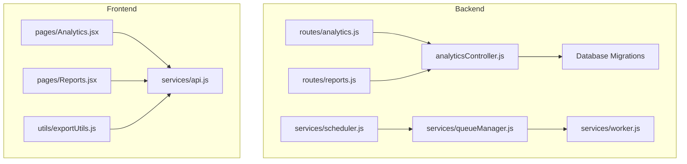
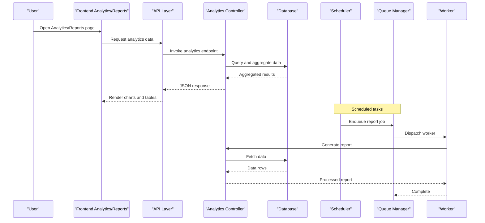
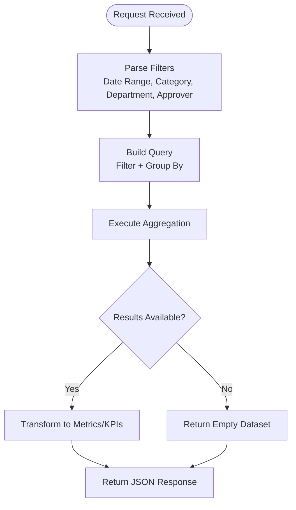
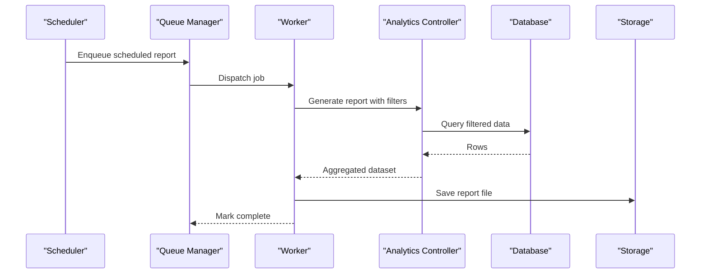
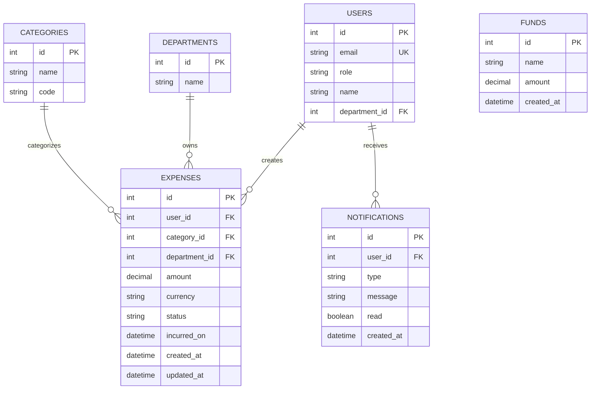
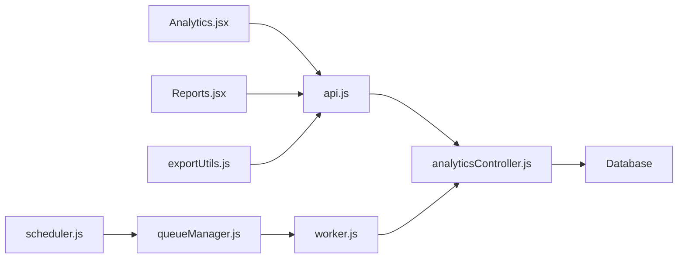

# Analytics & Reporting

<cite>
**Referenced Files in This Document**
- [README.md](file://README.md)
- [USER_MANUAL.md](file://USER_MANUAL.md)
- [deployment_guide.md](file://deployment_guide.md)
- [backend/src/controllers/analyticsController.js](file://backend/src/controllers/analyticsController.js)
- [backend/src/routes/analytics.js](file://backend/src/routes/analytics.js)
- [backend/src/routes/reports.js](file://backend/src/routes/reports.js)
- [backend/src/services/scheduler.js](file://backend/src/services/scheduler.js)
- [backend/src/services/queueManager.js](file://backend/src/services/queueManager.js)
- [backend/src/services/worker.js](file://backend/src/services/worker.js)
- [backend/src/db/migrations/20260512000000_initial_schema.js](file://backend/src/db/migrations/20260512000000_initial_schema.js)
- [backend/src/db/migrations/20260512075907_create_funds_table.js](file://backend/src/db/migrations/20260512075907_create_funds_table.js)
- [backend/src/db/migrations/20260512080000_add_quantity_unit_to_expenses.js](file://backend/src/db/migrations/20260512080000_add_quantity_unit_to_expenses.js)
- [backend/src/db/migrations/20260512080100_add_brand_to_expenses.js](file://backend/src/db/migrations/20260512080100_add_brand_to_expenses.js)
- [backend/src/db/migrations/20260515064955_add_notifications_and_email_system.js](file://backend/src/db/migrations/20260515064955_add_notifications_and_email_system.js)
- [backend/src/db/migrations/20260517090000_create_notification_center_tables.js](file://backend/src/db/migrations/20260517090000_create_notification_center_tables.js)
- [backend/src/db/migrations/20260519120000_alter_user_role_to_string.js](file://backend/src/db/migrations/20260519120000_alter_user_role_to_string.js)
- [backend/src/db/migrations/20260529120000_add_expense_units_setting.js](file://backend/src/db/migrations/20260529120000_add_expense_units_setting.js)
- [backend/src/db/migrations/20260611000000_add_liquidation_approval_workflow.js](file://backend/src/db/migrations/20260611000000_add_liquidation_approval_workflow.js)
- [backend/src/db/migrations/20260611010000_fix_expense_status_varchar.js](file://backend/src/db/migrations/20260611010000_fix_expense_status_varchar.js)
- [frontend/src/pages/Analytics.jsx](file://frontend/src/pages/Analytics.jsx)
- [frontend/src/pages/Reports.jsx](file://frontend/src/pages/Reports.jsx)
- [frontend/src/utils/exportUtils.js](file://frontend/src/utils/exportUtils.js)
- [frontend/src/services/api.js](file://frontend/src/services/api.js)
</cite>

## Table of Contents
1. [Introduction](#introduction)
2. [Project Structure](#project-structure)
3. [Core Components](#core-components)
4. [Architecture Overview](#architecture-overview)
5. [Detailed Component Analysis](#detailed-component-analysis)
6. [Dependency Analysis](#dependency-analysis)
7. [Performance Considerations](#performance-considerations)
8. [Troubleshooting Guide](#troubleshooting-guide)
9. [Conclusion](#conclusion)
10. [Appendices](#appendices)

## Introduction
This document provides comprehensive analytics and reporting documentation for the petty cash management system. It covers data visualization, report generation, export functionality, dashboard analytics, expense trends, category breakdowns, comparative analysis, report types, filtering options, custom reporting, export formats, data transformation, batch processing, performance metrics, KPI tracking, business insights, report scheduling, automated delivery, and sharing mechanisms. It also documents integrations with data sources and visualization libraries.

## Project Structure
The analytics and reporting capabilities span backend controllers and routes, database migrations defining the schema, and frontend pages and utilities for visualization and export. The backend exposes analytics endpoints and manages scheduled tasks, while the frontend renders dashboards and supports exporting reports.

**Diagram sources**
- [backend/src/controllers/analyticsController.js](file://backend/src/controllers/analyticsController.js)
- [backend/src/routes/analytics.js](file://backend/src/routes/analytics.js)
- [backend/src/routes/reports.js](file://backend/src/routes/reports.js)
- [backend/src/services/scheduler.js](file://backend/src/services/scheduler.js)
- [backend/src/services/queueManager.js](file://backend/src/services/queueManager.js)
- [backend/src/services/worker.js](file://backend/src/services/worker.js)
- [backend/src/db/migrations/20260512000000_initial_schema.js](file://backend/src/db/migrations/20260512000000_initial_schema.js)
- [frontend/src/pages/Analytics.jsx](file://frontend/src/pages/Analytics.jsx)
- [frontend/src/pages/Reports.jsx](file://frontend/src/pages/Reports.jsx)
- [frontend/src/utils/exportUtils.js](file://frontend/src/utils/exportUtils.js)
- [frontend/src/services/api.js](file://frontend/src/services/api.js)

**Section sources**
- [README.md](file://README.md)
- [USER_MANUAL.md](file://USER_MANUAL.md)
- [backend/src/controllers/analyticsController.js](file://backend/src/controllers/analyticsController.js)
- [backend/src/routes/analytics.js](file://backend/src/routes/analytics.js)
- [backend/src/routes/reports.js](file://backend/src/routes/reports.js)
- [frontend/src/pages/Analytics.jsx](file://frontend/src/pages/Analytics.jsx)
- [frontend/src/pages/Reports.jsx](file://frontend/src/pages/Reports.jsx)
- [frontend/src/utils/exportUtils.js](file://frontend/src/utils/exportUtils.js)
- [frontend/src/services/api.js](file://frontend/src/services/api.js)

## Core Components
- Backend Analytics Controller: Implements analytics endpoints for retrieving aggregated metrics, trends, and category breakdowns.
- Analytics Routes: Exposes endpoints for dashboards and analytics queries.
- Reports Routes: Provides endpoints for generating and managing reports.
- Scheduler and Queue: Manages scheduled report generation and background processing.
- Frontend Analytics Page: Renders dashboards and visualizations.
- Frontend Reports Page: Lists available reports and actions.
- Export Utilities: Handles export formats and transformations for reports.
- API Layer: Centralized service for frontend-backend communication.

Key responsibilities:
- Aggregation and filtering of expense data
- Category and trend analysis
- Comparative analysis across periods and categories
- Report generation and export
- Scheduling and automation
- Sharing and delivery mechanisms

**Section sources**
- [backend/src/controllers/analyticsController.js](file://backend/src/controllers/analyticsController.js)
- [backend/src/routes/analytics.js](file://backend/src/routes/analytics.js)
- [backend/src/routes/reports.js](file://backend/src/routes/reports.js)
- [backend/src/services/scheduler.js](file://backend/src/services/scheduler.js)
- [backend/src/services/queueManager.js](file://backend/src/services/queueManager.js)
- [backend/src/services/worker.js](file://backend/src/services/worker.js)
- [frontend/src/pages/Analytics.jsx](file://frontend/src/pages/Analytics.jsx)
- [frontend/src/pages/Reports.jsx](file://frontend/src/pages/Reports.jsx)
- [frontend/src/utils/exportUtils.js](file://frontend/src/utils/exportUtils.js)
- [frontend/src/services/api.js](file://frontend/src/services/api.js)

## Architecture Overview
The analytics and reporting architecture integrates frontend dashboards with backend analytics endpoints, database aggregations, and a scheduling pipeline for automated report generation and delivery.

**Diagram sources**
- [backend/src/controllers/analyticsController.js](file://backend/src/controllers/analyticsController.js)
- [backend/src/routes/analytics.js](file://backend/src/routes/analytics.js)
- [backend/src/routes/reports.js](file://backend/src/routes/reports.js)
- [backend/src/services/scheduler.js](file://backend/src/services/scheduler.js)
- [backend/src/services/queueManager.js](file://backend/src/services/queueManager.js)
- [backend/src/services/worker.js](file://backend/src/services/worker.js)
- [frontend/src/pages/Analytics.jsx](file://frontend/src/pages/Analytics.jsx)
- [frontend/src/pages/Reports.jsx](file://frontend/src/pages/Reports.jsx)
- [frontend/src/services/api.js](file://frontend/src/services/api.js)

## Detailed Component Analysis

### Backend Analytics Controller
Responsibilities:
- Aggregate expense data by date range, category, department, and approver.
- Compute KPIs such as total expenses, average per transaction, top categories, and trends.
- Support comparative analysis across periods and filters.
- Provide endpoints for dashboards and report generation.

Processing logic highlights:
- Filtering by date range and optional category/department/approver filters.
- Aggregation functions for totals, counts, averages, and variance calculations.
- Trend computation using grouped time series data.
- Comparative analysis via period-on-period comparisons.

**Diagram sources**
- [backend/src/controllers/analyticsController.js](file://backend/src/controllers/analyticsController.js)

**Section sources**
- [backend/src/controllers/analyticsController.js](file://backend/src/controllers/analyticsController.js)

### Analytics Routes
Endpoints:
- GET /api/analytics/dashboard: Returns high-level metrics and chart-ready datasets.
- GET /api/analytics/trends: Returns time-series trends by category or department.
- GET /api/analytics/categories: Returns category-wise breakdowns.
- GET /api/analytics/comparative: Returns comparative analysis across periods.

Usage:
- Frontend pages consume these endpoints to render charts and tables.
- Filters are passed as query parameters (date range, category IDs, department IDs).

**Section sources**
- [backend/src/routes/analytics.js](file://backend/src/routes/analytics.js)

### Reports Routes
Endpoints:
- GET /api/reports: Lists generated reports and metadata.
- POST /api/reports/generate: Triggers report generation with filters and format.
- GET /api/reports/:id/download: Downloads a generated report.
- DELETE /api/reports/:id: Deletes a stored report.

Capabilities:
- Report types: Expense summary, category breakdown, trends, comparative analysis.
- Filtering options: Date range, categories, departments, approvers.
- Custom reporting: Ad-hoc generation with selected filters and format.

**Section sources**
- [backend/src/routes/reports.js](file://backend/src/routes/reports.js)

### Scheduler, Queue, and Worker
- Scheduler: Periodic jobs for recurring reports (daily/weekly/monthly).
- Queue Manager: Manages background jobs for report generation.
- Worker: Executes report generation tasks, fetches data, transforms, and stores outputs.

**Diagram sources**
- [backend/src/services/scheduler.js](file://backend/src/services/scheduler.js)
- [backend/src/services/queueManager.js](file://backend/src/services/queueManager.js)
- [backend/src/services/worker.js](file://backend/src/services/worker.js)
- [backend/src/controllers/analyticsController.js](file://backend/src/controllers/analyticsController.js)

**Section sources**
- [backend/src/services/scheduler.js](file://backend/src/services/scheduler.js)
- [backend/src/services/queueManager.js](file://backend/src/services/queueManager.js)
- [backend/src/services/worker.js](file://backend/src/services/worker.js)

### Frontend Analytics Page
Features:
- Dashboard rendering with charts and KPI cards.
- Interactive filters for date range, categories, departments, and approvers.
- Real-time updates when filters change.
- Integration with API endpoints for data fetching.

Visualization library:
- Recharts is used for rendering charts and tables.

**Section sources**
- [frontend/src/pages/Analytics.jsx](file://frontend/src/pages/Analytics.jsx)
- [frontend/src/services/api.js](file://frontend/src/services/api.js)

### Frontend Reports Page
Features:
- List of generated reports with metadata (name, date, filters, status).
- Actions: Generate new report, download, delete, share.
- Filtered generation form with date range, categories, departments, approvers.
- Export format selection.

**Section sources**
- [frontend/src/pages/Reports.jsx](file://frontend/src/pages/Reports.jsx)
- [frontend/src/utils/exportUtils.js](file://frontend/src/utils/exportUtils.js)
- [frontend/src/services/api.js](file://frontend/src/services/api.js)

### Export Utilities
Capabilities:
- Export formats: CSV, Excel, PDF.
- Data transformation: Converts aggregated datasets into tabular formats.
- Batch processing: Supports bulk exports for large datasets.

**Section sources**
- [frontend/src/utils/exportUtils.js](file://frontend/src/utils/exportUtils.js)

### Database Schema and Migrations
The schema defines core entities and relationships supporting analytics:
- Users, Departments, Categories, Funds, Expenses, Notifications, and related tables.
- Migrations capture schema evolution and additions (e.g., units, brand, liquidation approvals).

**Diagram sources**
- [backend/src/db/migrations/20260512000000_initial_schema.js](file://backend/src/db/migrations/20260512000000_initial_schema.js)
- [backend/src/db/migrations/20260512075907_create_funds_table.js](file://backend/src/db/migrations/20260512075907_create_funds_table.js)
- [backend/src/db/migrations/20260512080000_add_quantity_unit_to_expenses.js](file://backend/src/db/migrations/20260512080000_add_quantity_unit_to_expenses.js)
- [backend/src/db/migrations/20260512080100_add_brand_to_expenses.js](file://backend/src/db/migrations/20260512080100_add_brand_to_expenses.js)
- [backend/src/db/migrations/20260515064955_add_notifications_and_email_system.js](file://backend/src/db/migrations/20260515064955_add_notifications_and_email_system.js)
- [backend/src/db/migrations/20260517090000_create_notification_center_tables.js](file://backend/src/db/migrations/20260517090000_create_notification_center_tables.js)
- [backend/src/db/migrations/20260519120000_alter_user_role_to_string.js](file://backend/src/db/migrations/20260519120000_alter_user_role_to_string.js)
- [backend/src/db/migrations/20260529120000_add_expense_units_setting.js](file://backend/src/db/migrations/20260529120000_add_expense_units_setting.js)
- [backend/src/db/migrations/20260611000000_add_liquidation_approval_workflow.js](file://backend/src/db/migrations/20260611000000_add_liquidation_approval_workflow.js)
- [backend/src/db/migrations/20260611010000_fix_expense_status_varchar.js](file://backend/src/db/migrations/20260611010000_fix_expense_status_varchar.js)

## Dependency Analysis
- Frontend depends on API endpoints for data.
- Analytics Controller depends on database schema and migrations for accurate aggregations.
- Scheduler and Queue depend on Worker to process report generation.
- Export Utilities depend on frontend pages and API for data and formats.

**Diagram sources**
- [frontend/src/pages/Analytics.jsx](file://frontend/src/pages/Analytics.jsx)
- [frontend/src/pages/Reports.jsx](file://frontend/src/pages/Reports.jsx)
- [frontend/src/services/api.js](file://frontend/src/services/api.js)
- [frontend/src/utils/exportUtils.js](file://frontend/src/utils/exportUtils.js)
- [backend/src/controllers/analyticsController.js](file://backend/src/controllers/analyticsController.js)
- [backend/src/services/scheduler.js](file://backend/src/services/scheduler.js)
- [backend/src/services/queueManager.js](file://backend/src/services/queueManager.js)
- [backend/src/services/worker.js](file://backend/src/services/worker.js)

**Section sources**
- [frontend/src/pages/Analytics.jsx](file://frontend/src/pages/Analytics.jsx)
- [frontend/src/pages/Reports.jsx](file://frontend/src/pages/Reports.jsx)
- [frontend/src/services/api.js](file://frontend/src/services/api.js)
- [frontend/src/utils/exportUtils.js](file://frontend/src/utils/exportUtils.js)
- [backend/src/controllers/analyticsController.js](file://backend/src/controllers/analyticsController.js)
- [backend/src/services/scheduler.js](file://backend/src/services/scheduler.js)
- [backend/src/services/queueManager.js](file://backend/src/services/queueManager.js)
- [backend/src/services/worker.js](file://backend/src/services/worker.js)

## Performance Considerations
- Use indexed columns for filters (e.g., incurred_on, category_id, department_id, user_id).
- Apply pagination for large datasets in export and report listings.
- Optimize aggregation queries with appropriate WHERE clauses and LIMIT/OFFSET.
- Cache frequently accessed dashboards for short intervals to reduce load.
- Batch export processing to avoid blocking requests; leverage queue workers.
- Monitor database query duration and tune slow queries.

## Troubleshooting Guide
Common issues and resolutions:
- Empty analytics data: Verify filters and date range; ensure data exists in the target period.
- Slow dashboard rendering: Reduce chart complexity; apply server-side pagination; cache results.
- Export failures: Confirm selected format compatibility; check backend storage permissions; retry batch processing.
- Scheduled reports not generated: Inspect scheduler logs; verify queue manager connectivity; confirm worker availability.
- Incorrect aggregations: Review migration history and ensure schema alignment; validate filter parameters.

**Section sources**
- [backend/src/controllers/analyticsController.js](file://backend/src/controllers/analyticsController.js)
- [backend/src/services/scheduler.js](file://backend/src/services/scheduler.js)
- [backend/src/services/queueManager.js](file://backend/src/services/queueManager.js)
- [backend/src/services/worker.js](file://backend/src/services/worker.js)

## Conclusion
The analytics and reporting system provides robust capabilities for visualizing expense trends, category breakdowns, and comparative analysis. It supports flexible filtering, custom report generation, multiple export formats, scheduling, and automated delivery. The modular backend and frontend architecture enable extensibility and maintainability for future enhancements.

## Appendices
- Deployment guide outlines environment setup and service dependencies for analytics and reporting.
- User manual describes how to navigate dashboards, generate reports, and configure filters.

**Section sources**
- [deployment_guide.md](file://deployment_guide.md)
- [USER_MANUAL.md](file://USER_MANUAL.md)