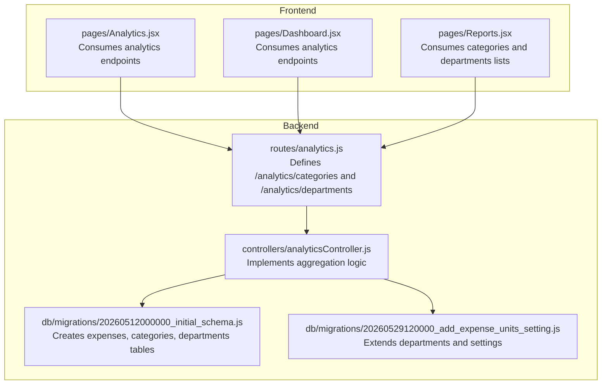
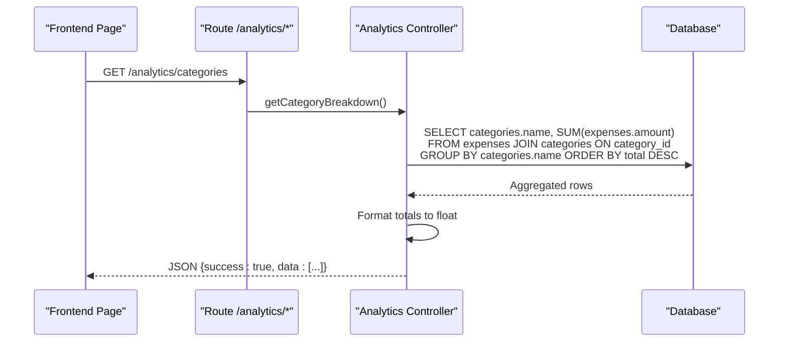
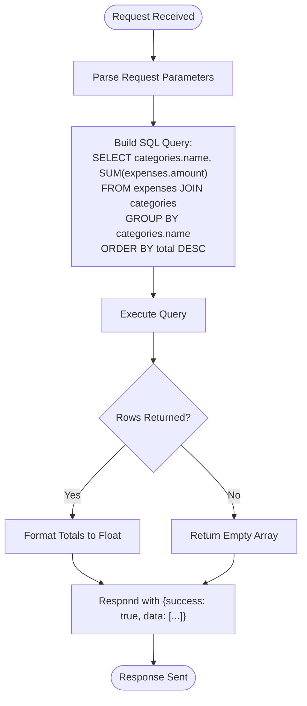
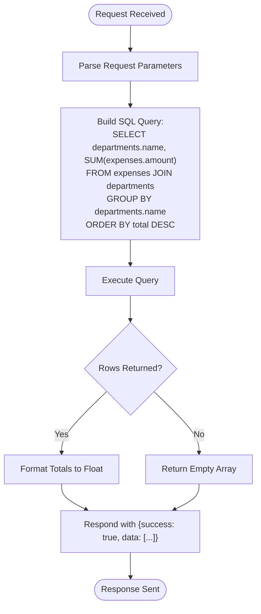
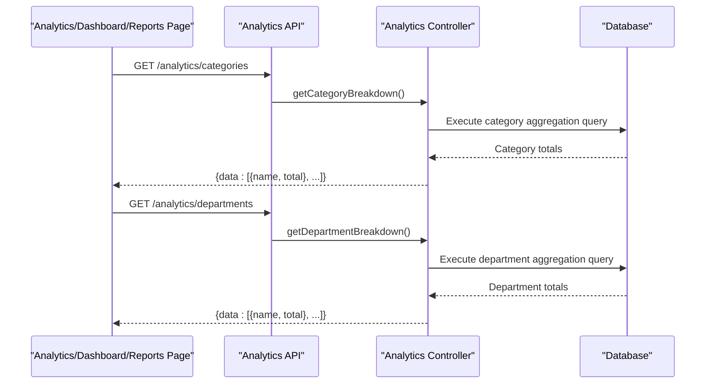
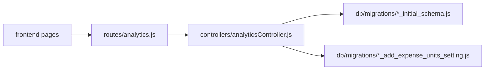

# Category & Department Analysis

<cite>
**Referenced Files in This Document**
- [analytics.js](file://backend/src/routes/analytics.js)
- [analyticsController.js](file://backend/src/controllers/analyticsController.js)
- [20260512000000_initial_schema.js](file://backend/src/db/migrations/20260512000000_initial_schema.js)
- [20260529120000_add_expense_units_setting.js](file://backend/src/db/migrations/20260529120000_add_expense_units_setting.js)
- [Analytics.jsx](file://frontend/src/pages/Analytics.jsx)
- [Dashboard.jsx](file://frontend/src/pages/Dashboard.jsx)
- [Reports.jsx](file://frontend/src/pages/Reports.jsx)
</cite>

## Table of Contents
1. [Introduction](#introduction)
2. [Project Structure](#project-structure)
3. [Core Components](#core-components)
4. [Architecture Overview](#architecture-overview)
5. [Detailed Component Analysis](#detailed-component-analysis)
6. [Dependency Analysis](#dependency-analysis)
7. [Performance Considerations](#performance-considerations)
8. [Troubleshooting Guide](#troubleshooting-guide)
9. [Conclusion](#conclusion)

## Introduction
This document provides comprehensive documentation for categorical and departmental expense analysis capabilities. It focuses on the getCategoryBreakdown and getDepartmentBreakdown endpoints that deliver aggregated expense data by category and department respectively. The documentation covers SQL aggregation queries, join operations between expenses and lookup tables, data formatting for visualization, ranking algorithms, percentage calculations, top-N analysis, category hierarchy analysis, departmental spending patterns, comparative analysis features, filtering, sorting mechanisms, and drill-down functionality.

## Project Structure
The expense analysis feature spans both backend and frontend components:
- Backend routes expose analytics endpoints under `/analytics`
- Controllers implement aggregation logic using database queries
- Frontend pages consume these endpoints to render charts and summaries

**Diagram sources**
- [analytics.js:1-12](file://backend/src/routes/analytics.js#L1-L12)
- [analyticsController.js:125-143](file://backend/src/controllers/analyticsController.js#L125-L143)
- [20260512000000_initial_schema.js:83-112](file://backend/src/db/migrations/20260512000000_initial_schema.js#L83-L112)
- [20260529120000_add_expense_units_setting.js:5-15](file://backend/src/db/migrations/20260529120000_add_expense_units_setting.js#L5-L15)
- [Analytics.jsx:33-51](file://frontend/src/pages/Analytics.jsx#L33-L51)
- [Dashboard.jsx:162-177](file://frontend/src/pages/Dashboard.jsx#L162-L177)
- [Reports.jsx:35-46](file://frontend/src/pages/Reports.jsx#L35-L46)

**Section sources**
- [analytics.js:1-12](file://backend/src/routes/analytics.js#L1-L12)
- [analyticsController.js:125-143](file://backend/src/controllers/analyticsController.js#L125-L143)
- [20260512000000_initial_schema.js:83-112](file://backend/src/db/migrations/20260512000000_initial_schema.js#L83-L112)
- [20260529120000_add_expense_units_setting.js:5-15](file://backend/src/db/migrations/20260529120000_add_expense_units_setting.js#L5-L15)
- [Analytics.jsx:33-51](file://frontend/src/pages/Analytics.jsx#L33-L51)
- [Dashboard.jsx:162-177](file://frontend/src/pages/Dashboard.jsx#L162-L177)
- [Reports.jsx:35-46](file://frontend/src/pages/Reports.jsx#L35-L46)

## Core Components
This section documents the two primary endpoints for categorical and departmental analysis:

- getCategoryBreakdown (`GET /analytics/categories`)
  - Aggregates total expense amounts by category name
  - Uses a join between expenses and categories on category_id
  - Groups by category name and orders by total descending
  - Returns an array of category objects with numeric totals

- getDepartmentBreakdown (`GET /analytics/departments`)
  - Aggregates total expense amounts by department name
  - Uses a join between expenses and departments on department_id
  - Groups by department name and orders by total descending
  - Returns an array of department objects with numeric totals

Both endpoints:
- Are protected via authentication middleware
- Return standardized JSON responses with success flag and data payload
- Convert totals to floating-point numbers for consistent client-side rendering

**Section sources**
- [analytics.js:9-10](file://backend/src/routes/analytics.js#L9-L10)
- [analyticsController.js:125-143](file://backend/src/controllers/analyticsController.js#L125-L143)

## Architecture Overview
The analytics feature follows a layered architecture:
- Routes define endpoint contracts and apply middleware
- Controllers encapsulate business logic and orchestrate data retrieval
- Database migrations establish the schema with foreign key relationships
- Frontend pages consume endpoints and render visualizations

**Diagram sources**
- [analytics.js](file://backend/src/routes/analytics.js#L9)
- [analyticsController.js:125-143](file://backend/src/controllers/analyticsController.js#L125-L143)
- [20260512000000_initial_schema.js:88-91](file://backend/src/db/migrations/20260512000000_initial_schema.js#L88-L91)

## Detailed Component Analysis

### getCategoryBreakdown Endpoint
Purpose:
- Provide aggregated expense data by category for visualization and reporting

Implementation highlights:
- Join operation: expenses joined with categories on category_id
- Aggregation: sum of amount grouped by category name
- Sorting: descending order by total amount
- Data formatting: converts totals to floating-point numbers

**Diagram sources**
- [analyticsController.js:125-143](file://backend/src/controllers/analyticsController.js#L125-L143)

**Section sources**
- [analyticsController.js:125-143](file://backend/src/controllers/analyticsController.js#L125-L143)

### getDepartmentBreakdown Endpoint
Purpose:
- Provide aggregated expense data by department for visualization and reporting

Implementation highlights:
- Join operation: expenses joined with departments on department_id
- Aggregation: sum of amount grouped by department name
- Sorting: descending order by total amount
- Data formatting: converts totals to floating-point numbers

**Diagram sources**
- [analyticsController.js:125-143](file://backend/src/controllers/analyticsController.js#L125-L143)

**Section sources**
- [analyticsController.js:125-143](file://backend/src/controllers/analyticsController.js#L125-L143)

### Frontend Consumption and Visualization
Frontend pages consume analytics endpoints and render visualizations:
- Analytics page fetches category breakdown and displays pie/bar charts
- Dashboard page integrates department breakdown into progress bars and summary cards
- Reports page provides filters for date range and category/department selection

**Diagram sources**
- [Analytics.jsx:33-51](file://frontend/src/pages/Analytics.jsx#L33-L51)
- [Dashboard.jsx:162-177](file://frontend/src/pages/Dashboard.jsx#L162-L177)
- [Reports.jsx:35-46](file://frontend/src/pages/Reports.jsx#L35-L46)
- [analyticsController.js:125-143](file://backend/src/controllers/analyticsController.js#L125-L143)

**Section sources**
- [Analytics.jsx:33-51](file://frontend/src/pages/Analytics.jsx#L33-L51)
- [Dashboard.jsx:162-177](file://frontend/src/pages/Dashboard.jsx#L162-L177)
- [Reports.jsx:35-46](file://frontend/src/pages/Reports.jsx#L35-L46)

## Dependency Analysis
The analytics feature depends on:
- Database schema with proper foreign keys between expenses, categories, and departments
- Authentication middleware applied to analytics routes
- Consistent data types for totals (converted to floats on the server)

**Diagram sources**
- [analytics.js:1-12](file://backend/src/routes/analytics.js#L1-L12)
- [analyticsController.js:125-143](file://backend/src/controllers/analyticsController.js#L125-L143)
- [20260512000000_initial_schema.js:83-112](file://backend/src/db/migrations/20260512000000_initial_schema.js#L83-L112)
- [20260529120000_add_expense_units_setting.js:5-15](file://backend/src/db/migrations/20260529120000_add_expense_units_setting.js#L5-L15)

**Section sources**
- [analytics.js:1-12](file://backend/src/routes/analytics.js#L1-L12)
- [analyticsController.js:125-143](file://backend/src/controllers/analyticsController.js#L125-L143)
- [20260512000000_initial_schema.js:83-112](file://backend/src/db/migrations/20260512000000_initial_schema.js#L83-L112)
- [20260529120000_add_expense_units_setting.js:5-15](file://backend/src/db/migrations/20260529120000_add_expense_units_setting.js#L5-L15)

## Performance Considerations
- Indexing recommendations:
  - Add indexes on expenses.category_id and expenses.department_id to accelerate joins
  - Consider composite indexes on (category_id, date) and (department_id, date) for trend analysis
- Query optimization:
  - Limit result sets for top-N analysis to reduce payload size
  - Apply date-range filters at query time to minimize aggregation work
- Caching:
  - Cache frequent requests for static periods (current month, previous month)
  - Invalidate cache on data changes or at midnight for daily rollups
- Pagination:
  - For very large datasets, implement pagination or limit N for top results

## Troubleshooting Guide
Common issues and resolutions:
- Empty results:
  - Verify date filters and ensure data exists in the target period
  - Confirm category/department records exist and are linked to expenses
- Incorrect totals:
  - Check decimal precision and ensure amount column is properly indexed
  - Validate foreign key relationships between expenses, categories, and departments
- Performance degradation:
  - Add appropriate database indexes
  - Reduce result set sizes with filters and limits
- Client-side rendering errors:
  - Ensure totals are parsed as numbers before rendering charts
  - Handle null/undefined values gracefully in visualizations

**Section sources**
- [analyticsController.js:125-143](file://backend/src/controllers/analyticsController.js#L125-L143)

## Conclusion
The getCategoryBreakdown and getDepartmentBreakdown endpoints provide robust foundations for categorical and departmental expense analysis. They leverage efficient SQL aggregations with joins against normalized lookup tables, return consistently formatted data for visualization, and integrate seamlessly with frontend dashboards. By implementing recommended indexing, caching, and filtering strategies, the system can scale to support larger datasets while maintaining responsive user experiences.