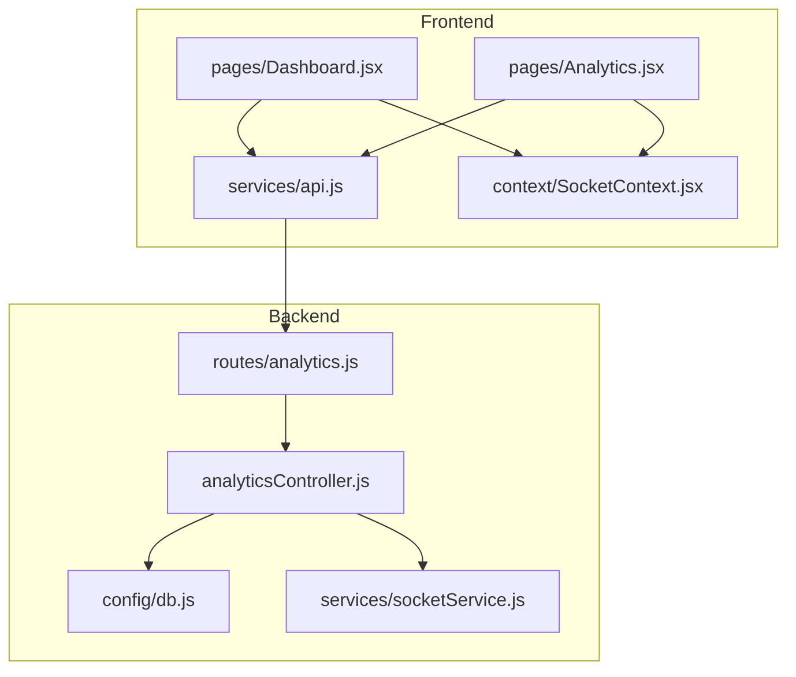
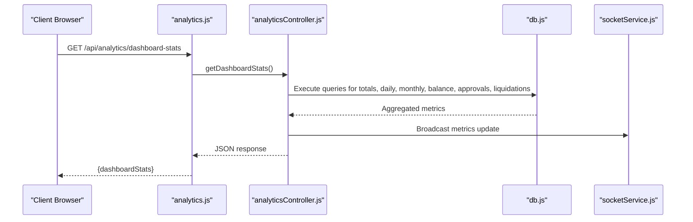
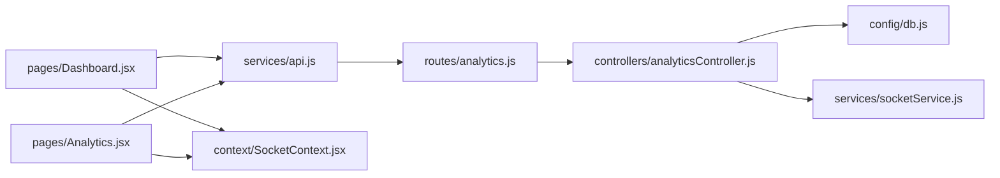

# Dashboard Analytics

<cite>
**Referenced Files in This Document**
- [analyticsController.js](file://backend/src/controllers/analyticsController.js)
- [analytics.js](file://backend/src/routes/analytics.js)
- [db.js](file://backend/src/config/db.js)
- [Dashboard.jsx](file://frontend/src/pages/Dashboard.jsx)
- [Analytics.jsx](file://frontend/src/pages/Analytics.jsx)
- [api.js](file://frontend/src/services/api.js)
- [SocketContext.jsx](file://frontend/src/context/SocketContext.jsx)
</cite>

## Table of Contents
1. [Introduction](#introduction)
2. [Project Structure](#project-structure)
3. [Core Components](#core-components)
4. [Architecture Overview](#architecture-overview)
5. [Detailed Component Analysis](#detailed-component-analysis)
6. [Dependency Analysis](#dependency-analysis)
7. [Performance Considerations](#performance-considerations)
8. [Troubleshooting Guide](#troubleshooting-guide)
9. [Conclusion](#conclusion)

## Introduction
This document provides comprehensive documentation for the dashboard analytics system, focusing on the backend analytics controller and frontend dashboard components. It explains the getDashboardStats endpoint, which aggregates key financial metrics such as total expenses, daily and monthly expenses, available balance, pending approvals, and pending liquidations. The document also covers statistics calculation logic, data aggregation methods, real-time metric updates via WebSocket, top category detection, recent expenses display, and department breakdown functionality. API response schemas, error handling, and performance considerations are included, along with guidance for integrating dashboard widgets and data visualization components.

## Project Structure
The dashboard analytics implementation spans both backend and frontend layers:
- Backend: Analytics controller exposes the getDashboardStats endpoint, backed by database queries and integrated with a WebSocket service for real-time updates.
- Frontend: Dashboard and Analytics pages consume the analytics API and render visualizations using React components and context providers for real-time updates.

**Diagram sources**
- [analyticsController.js](file://backend/src/controllers/analyticsController.js)
- [analytics.js](file://backend/src/routes/analytics.js)
- [db.js](file://backend/src/config/db.js)
- [Dashboard.jsx](file://frontend/src/pages/Dashboard.jsx)
- [Analytics.jsx](file://frontend/src/pages/Analytics.jsx)
- [api.js](file://frontend/src/services/api.js)
- [SocketContext.jsx](file://frontend/src/context/SocketContext.jsx)

**Section sources**
- [analyticsController.js](file://backend/src/controllers/analyticsController.js)
- [analytics.js](file://backend/src/routes/analytics.js)
- [db.js](file://backend/src/config/db.js)
- [Dashboard.jsx](file://frontend/src/pages/Dashboard.jsx)
- [Analytics.jsx](file://frontend/src/pages/Analytics.jsx)
- [api.js](file://frontend/src/services/api.js)
- [SocketContext.jsx](file://frontend/src/context/SocketContext.jsx)

## Core Components
- Analytics Controller: Implements the getDashboardStats endpoint, orchestrating data retrieval, aggregation, and real-time update broadcasting.
- Analytics Routes: Exposes the getDashboardStats endpoint via HTTP and integrates with the controller.
- Database Layer: Provides connection and query execution for financial metrics and supporting data.
- Frontend Dashboard: Renders dashboard widgets and subscribes to real-time updates for live metric refresh.
- Frontend Analytics Page: Presents detailed analytics views and supports filtering and export capabilities.
- Real-Time Updates: WebSocket service broadcasts metric updates to subscribed clients.

Key responsibilities:
- Aggregate total expenses, daily and monthly expenses, available balance, pending approvals, and pending liquidations.
- Detect top spending categories and recent expenses for quick insights.
- Break down metrics by department for organizational reporting.
- Provide real-time updates through WebSocket connections.

**Section sources**
- [analyticsController.js](file://backend/src/controllers/analyticsController.js)
- [analytics.js](file://backend/src/routes/analytics.js)
- [db.js](file://backend/src/config/db.js)
- [Dashboard.jsx](file://frontend/src/pages/Dashboard.jsx)
- [Analytics.jsx](file://frontend/src/pages/Analytics.jsx)
- [api.js](file://frontend/src/services/api.js)
- [SocketContext.jsx](file://frontend/src/context/SocketContext.jsx)

## Architecture Overview
The analytics pipeline follows a clear separation of concerns:
- HTTP requests reach the analytics route, which delegates to the analytics controller.
- The controller executes database queries to compute metrics and aggregates results.
- Aggregated data is returned to the client and optionally broadcasted via WebSocket for real-time updates.
- Frontend components fetch data from the API and subscribe to WebSocket events for live updates.

**Diagram sources**
- [analytics.js](file://backend/src/routes/analytics.js)
- [analyticsController.js](file://backend/src/controllers/analyticsController.js)
- [db.js](file://backend/src/config/db.js)

## Detailed Component Analysis

### Analytics Controller Implementation
The analytics controller encapsulates the business logic for computing dashboard metrics:
- Endpoint: getDashboardStats
- Responsibilities:
  - Compute total expenses across all approved/reimbursable transactions.
  - Calculate daily and monthly expenses using date-based aggregations.
  - Determine available balance by subtracting total expenses from total funds.
  - Count pending approvals and pending liquidations based on status filters.
  - Identify top spending categories by summing amounts per category.
  - Retrieve recent expenses for display in the dashboard.
  - Break down metrics by department for organizational insights.
  - Trigger real-time updates via WebSocket after successful computation.

Processing logic highlights:
- Data aggregation uses SQL queries to group by date, category, and department.
- Status-based filtering ensures only relevant records contribute to metrics.
- Top category detection employs descending sum aggregation with limits.
- Recent expenses are ordered by creation/modification timestamps.

Real-time updates:
- After computing metrics, the controller broadcasts updates to connected clients through the WebSocket service.
- Clients subscribe to updates via SocketContext to receive live changes.

**Section sources**
- [analyticsController.js](file://backend/src/controllers/analyticsController.js)
- [db.js](file://backend/src/config/db.js)
- [SocketContext.jsx](file://frontend/src/context/SocketContext.jsx)

### API Endpoint Definition
The analytics route defines the HTTP interface for dashboard statistics:
- Path: /api/analytics/dashboard-stats
- Method: GET
- Authentication: Requires authenticated session via middleware.
- Response: JSON payload containing dashboardStats object with computed metrics.

Response schema outline:
- totalExpenses: number
- dailyExpenses: number
- monthlyExpenses: number
- availableBalance: number
- pendingApprovals: number
- pendingLiquidations: number
- topCategories: array of category objects with name and aggregated amount
- recentExpenses: array of recent expense entries
- departmentBreakdown: array of department objects with name and aggregated metrics

Error handling:
- Returns appropriate HTTP status codes for invalid requests, internal errors, and unauthorized access.
- Centralized error handling ensures consistent responses across endpoints.

**Section sources**
- [analytics.js](file://backend/src/routes/analytics.js)
- [analyticsController.js](file://backend/src/controllers/analyticsController.js)

### Frontend Dashboard Components
The frontend dashboard integrates analytics data into reusable widgets:
- Dashboard.jsx: Main dashboard page consuming analytics API and rendering summary cards, charts, and recent activity.
- Analytics.jsx: Detailed analytics page offering filters, export utilities, and advanced visualizations.
- api.js: HTTP client abstraction for API calls, including base URL configuration and request helpers.
- SocketContext.jsx: Provides real-time subscription hooks for receiving live metric updates.

Widget integration patterns:
- Fetch initial data on mount and periodically refresh to keep metrics current.
- Subscribe to WebSocket events to update widgets instantly when backend recalculates.
- Render charts and summaries using visualization libraries configured in the app shell.

**Section sources**
- [Dashboard.jsx](file://frontend/src/pages/Dashboard.jsx)
- [Analytics.jsx](file://frontend/src/pages/Analytics.jsx)
- [api.js](file://frontend/src/services/api.js)
- [SocketContext.jsx](file://frontend/src/context/SocketContext.jsx)

### Data Aggregation Methods and Calculation Logic
Aggregation strategies:
- Totals: Sum of approved/reimbursable expense amounts grouped by status and date range.
- Daily/Monthly: Time-based grouping using date truncation to isolate day/month contributions.
- Available Balance: Total funds minus total expenses, ensuring accurate cash position.
- Pending Approvals/Liquidations: Counts filtered by workflow statuses indicating pending actions.
- Top Categories: Sum of amounts per category, sorted descending with limit applied.
- Recent Expenses: Latest entries ordered by timestamp with pagination support.
- Department Breakdown: Aggregations grouped by department for hierarchical reporting.

Calculation complexity:
- Aggregation queries leverage indexed date and status columns for efficient computation.
- Caching strategies can be applied for frequently accessed time windows to reduce load.

**Section sources**
- [analyticsController.js](file://backend/src/controllers/analyticsController.js)
- [db.js](file://backend/src/config/db.js)

### Real-Time Metric Updates
Real-time delivery mechanism:
- WebSocket service broadcasts computed metrics to subscribed clients upon completion of calculations.
- Frontend components subscribe via SocketContext to receive live updates without polling.
- Update frequency controlled by backend scheduling or event-driven triggers.

Benefits:
- Immediate visibility of financial changes.
- Reduced server load compared to frequent polling.
- Enhanced user experience with dynamic dashboards.

**Section sources**
- [analyticsController.js](file://backend/src/controllers/analyticsController.js)
- [SocketContext.jsx](file://frontend/src/context/SocketContext.jsx)

### Top Category Detection and Recent Expenses Display
Top category detection:
- Aggregates amounts per category and sorts in descending order.
- Limits results to top N categories for concise presentation.

Recent expenses display:
- Retrieves latest expenses with essential fields for quick review.
- Supports pagination and filtering by date/category/department.

Integration:
- Both features feed into dashboard summary cards and detailed analytics tables.

**Section sources**
- [analyticsController.js](file://backend/src/controllers/analyticsController.js)
- [Dashboard.jsx](file://frontend/src/pages/Dashboard.jsx)

### Department Breakdown Functionality
Department breakdown:
- Computes aggregated metrics per department for organizational reporting.
- Enables drill-down analysis and budget monitoring across departments.

Usage:
- Dashboard widgets show department-wise totals.
- Analytics page provides detailed filters and export options.

**Section sources**
- [analyticsController.js](file://backend/src/controllers/analyticsController.js)
- [Analytics.jsx](file://frontend/src/pages/Analytics.jsx)

## Dependency Analysis
The analytics system exhibits clean separation of concerns with minimal coupling:
- Routes depend on the controller for business logic.
- Controller depends on the database layer for data access.
- Frontend components depend on the API client and WebSocket context.
- No circular dependencies observed between major modules.

**Diagram sources**
- [analytics.js](file://backend/src/routes/analytics.js)
- [analyticsController.js](file://backend/src/controllers/analyticsController.js)
- [db.js](file://backend/src/config/db.js)
- [Dashboard.jsx](file://frontend/src/pages/Dashboard.jsx)
- [Analytics.jsx](file://frontend/src/pages/Analytics.jsx)
- [api.js](file://frontend/src/services/api.js)
- [SocketContext.jsx](file://frontend/src/context/SocketContext.jsx)

**Section sources**
- [analytics.js](file://backend/src/routes/analytics.js)
- [analyticsController.js](file://backend/src/controllers/analyticsController.js)
- [db.js](file://backend/src/config/db.js)
- [Dashboard.jsx](file://frontend/src/pages/Dashboard.jsx)
- [Analytics.jsx](file://frontend/src/pages/Analytics.jsx)
- [api.js](file://frontend/src/services/api.js)
- [SocketContext.jsx](file://frontend/src/context/SocketContext.jsx)

## Performance Considerations
- Indexing: Ensure database indexes exist on date, status, and foreign key columns used in aggregation queries.
- Query Optimization: Use time window constraints to limit scanned data for daily/monthly computations.
- Caching: Implement short-lived caches for frequently accessed dashboard windows to reduce database load.
- Pagination: Apply pagination for recent expenses and detailed lists to avoid large payloads.
- Real-Time Scaling: Use connection pooling and efficient WebSocket broadcasting to handle multiple subscribers.
- Frontend Debouncing: Debounce rapid filter changes to minimize API churn while maintaining responsiveness.

## Troubleshooting Guide
Common issues and resolutions:
- Unauthorized Access: Verify authentication middleware is properly configured on the analytics route.
- Empty Metrics: Confirm database seeding and migration status; check date ranges and status filters.
- Slow Queries: Review query plans and add missing indexes; consider caching recent windows.
- WebSocket Disconnections: Ensure WebSocket service is running and clients retry on disconnect.
- Frontend Rendering Issues: Validate API response schema matches frontend expectations; handle missing fields gracefully.

Error handling patterns:
- Centralized HTTP error responses with descriptive messages.
- Graceful fallbacks for unavailable metrics during initialization.
- Logging of aggregation failures for diagnostics.

**Section sources**
- [analytics.js](file://backend/src/routes/analytics.js)
- [analyticsController.js](file://backend/src/controllers/analyticsController.js)
- [db.js](file://backend/src/config/db.js)
- [api.js](file://frontend/src/services/api.js)

## Conclusion
The dashboard analytics system delivers a robust foundation for financial oversight with real-time updates, comprehensive metrics, and flexible visualization. By leveraging efficient aggregation strategies, WebSocket-driven updates, and modular frontend components, the system supports timely decision-making across departments. Proper indexing, caching, and error handling ensure reliable performance and maintainability.