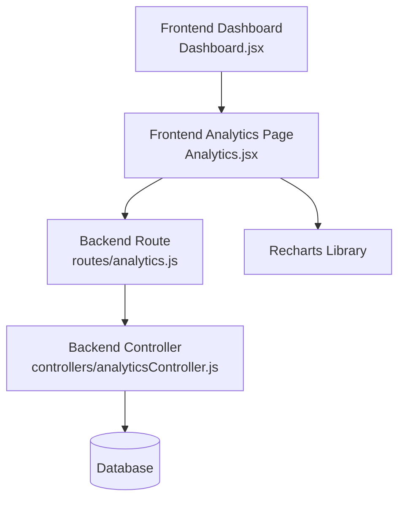
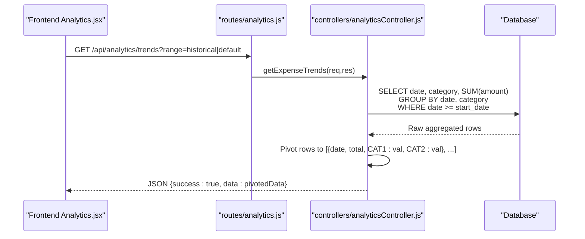
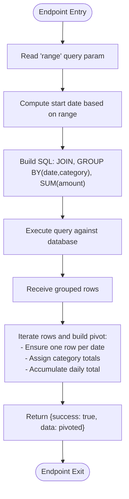
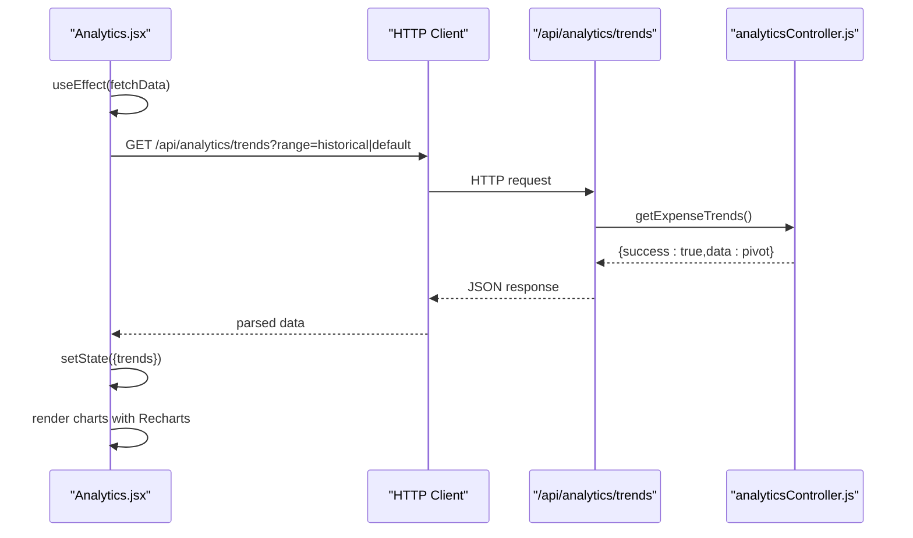
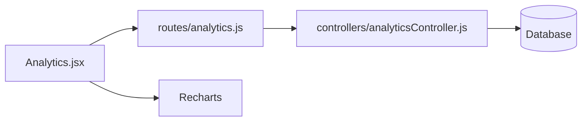

# Expense Trends & Time Series

<cite>
**Referenced Files in This Document**
- [analyticsController.js](file://backend/src/controllers/analyticsController.js)
- [analytics.js](file://backend/src/routes/analytics.js)
- [Analytics.jsx](file://frontend/src/pages/Analytics.jsx)
- [Dashboard.jsx](file://frontend/src/pages/Dashboard.jsx)
</cite>

## Table of Contents
1. [Introduction](#introduction)
2. [Project Structure](#project-structure)
3. [Core Components](#core-components)
4. [Architecture Overview](#architecture-overview)
5. [Detailed Component Analysis](#detailed-component-analysis)
6. [Dependency Analysis](#dependency-analysis)
7. [Performance Considerations](#performance-considerations)
8. [Troubleshooting Guide](#troubleshooting-guide)
9. [Conclusion](#conclusion)

## Introduction
This document provides comprehensive documentation for expense trend analysis and time series data visualization. It focuses on the getExpenseTrends endpoint that delivers historical expense data with configurable ranges (30-day default and 365-day historical), the data pivoting mechanism for Recharts compatibility, category-wise expense tracking, and temporal aggregation. It also covers date range filtering, category grouping, data transformation processes, trend analysis patterns, seasonal variations, forecasting capabilities, performance optimization for large datasets, and caching strategies for trend data.

## Project Structure
The expense trends feature spans backend analytics controllers and routes, and frontend visualization components. The backend exposes the getExpenseTrends endpoint, while the frontend renders stacked bar charts and category-specific charts using Recharts.

**Diagram sources**
- [analytics.js:1-10](file://backend/src/routes/analytics.js#L1-L10)
- [analyticsController.js:68-103](file://backend/src/controllers/analyticsController.js#L68-L103)
- [Analytics.jsx:1-247](file://frontend/src/pages/Analytics.jsx#L1-L247)
- [Dashboard.jsx:255-279](file://frontend/src/pages/Dashboard.jsx#L255-L279)

**Section sources**
- [analytics.js:1-10](file://backend/src/routes/analytics.js#L1-L10)
- [analyticsController.js:68-103](file://backend/src/controllers/analyticsController.js#L68-L103)
- [Analytics.jsx:1-247](file://frontend/src/pages/Analytics.jsx#L1-L247)
- [Dashboard.jsx:255-279](file://frontend/src/pages/Dashboard.jsx#L255-L279)

## Core Components
- Backend Endpoint: getExpenseTrends
  - Purpose: Returns time series data for expenses grouped by category and date.
  - Query Parameter: range accepts "historical" for 365-day window or defaults to 30 days.
  - Data Transformation: Aggregates amounts per date and category, then pivots into a Recharts-friendly structure.
- Frontend Visualization:
  - Analytics Page: Renders stacked bar charts for category-wise daily totals and category-filtered charts.
  - Dashboard: Displays real-time expense trend summary cards and chart area.

Key implementation references:
- Backend endpoint definition and logic: [analyticsController.js:68-103](file://backend/src/controllers/analyticsController.js#L68-L103)
- Route registration: [analytics.js:1-10](file://backend/src/routes/analytics.js#L1-L10)
- Frontend chart rendering and controls: [Analytics.jsx:1-247](file://frontend/src/pages/Analytics.jsx#L1-L247)
- Dashboard trend card and chart container: [Dashboard.jsx:255-279](file://frontend/src/pages/Dashboard.jsx#L255-L279)

**Section sources**
- [analyticsController.js:68-103](file://backend/src/controllers/analyticsController.js#L68-L103)
- [analytics.js:1-10](file://backend/src/routes/analytics.js#L1-L10)
- [Analytics.jsx:1-247](file://frontend/src/pages/Analytics.jsx#L1-L247)
- [Dashboard.jsx:255-279](file://frontend/src/pages/Dashboard.jsx#L255-L279)

## Architecture Overview
The system follows a client-server architecture where the frontend requests time series data via HTTP and receives a pivoted dataset suitable for Recharts visualization.

**Diagram sources**
- [analytics.js:1-10](file://backend/src/routes/analytics.js#L1-L10)
- [analyticsController.js:68-103](file://backend/src/controllers/analyticsController.js#L68-L103)

## Detailed Component Analysis

### Backend: getExpenseTrends Endpoint
- Request Handling
  - Reads query parameter range to compute the date window (30 or 365 days).
  - Calculates start date by subtracting the selected number of days from the current date.
- Data Aggregation
  - Performs a join between expenses and categories tables.
  - Groups by date and category name, summing amounts per group.
  - Orders results chronologically by date.
- Data Pivoting for Recharts
  - Transforms grouped rows into a pivot table where each row corresponds to a calendar date and columns represent category totals plus a total column.
  - Ensures each date appears only once with cumulative totals and category-specific allocations.
- Response
  - Returns a JSON payload containing success status and the pivoted dataset.

Implementation references:
- Range selection and date calculation: [analyticsController.js:69-76](file://backend/src/controllers/analyticsController.js#L69-L76)
- Query construction and aggregation: [analyticsController.js:77-84](file://backend/src/controllers/analyticsController.js#L77-L84)
- Pivoting logic: [analyticsController.js:85-97](file://backend/src/controllers/analyticsController.js#L85-L97)
- Error handling: [analyticsController.js:100-102](file://backend/src/controllers/analyticsController.js#L100-L102)

**Diagram sources**
- [analyticsController.js:69-97](file://backend/src/controllers/analyticsController.js#L69-L97)

**Section sources**
- [analyticsController.js:68-103](file://backend/src/controllers/analyticsController.js#L68-L103)

### Frontend: Analytics Page Visualization
- Data Fetching
  - Uses useEffect to fetch trends when view mode changes (active/historical).
  - Stores trends in state and prepares category names for chart legends.
- Chart Rendering
  - Stacked Bar Chart: Displays daily totals by category with Recharts BarChart.
  - Category Filter: Dropdown allows selecting a specific category to render a filtered dataset.
  - Tooltips and Legends: Provide contextual insights and interactive legend entries.
- Formatting and UX
  - X-axis tick formatter displays month/day labels.
  - Y-axis uses currency formatting for readability.
  - Download buttons enable exporting charts as images.

Implementation references:
- Fetch and state management: [Analytics.jsx:29-40](file://frontend/src/pages/Analytics.jsx#L29-L40)
- Stacked bar chart configuration: [Analytics.jsx:169-196](file://frontend/src/pages/Analytics.jsx#L169-L196)
- Category filter dropdown and chart: [Analytics.jsx:200-247](file://frontend/src/pages/Analytics.jsx#L200-L247)

**Diagram sources**
- [Analytics.jsx:29-40](file://frontend/src/pages/Analytics.jsx#L29-L40)
- [analytics.js:1-10](file://backend/src/routes/analytics.js#L1-L10)
- [analyticsController.js:68-103](file://backend/src/controllers/analyticsController.js#L68-L103)

**Section sources**
- [Analytics.jsx:1-247](file://frontend/src/pages/Analytics.jsx#L1-L247)

### Frontend: Dashboard Integration
- Real-time Indicator: Displays a real-time data badge alongside the expenses trend section.
- Chart Container: Provides a responsive container for the trend visualization.
- Download Capability: Exposes a button to download the rendered chart.

Implementation references:
- Dashboard layout and chart container: [Dashboard.jsx:255-279](file://frontend/src/pages/Dashboard.jsx#L255-L279)

**Section sources**
- [Dashboard.jsx:255-279](file://frontend/src/pages/Dashboard.jsx#L255-L279)

## Dependency Analysis
- Route-to-Controller Binding
  - The analytics route registers the getExpenseTrends handler, ensuring incoming requests are directed to the controller method.
- Controller-to-Database Interaction
  - The controller constructs and executes a query joining expenses and categories, aggregating amounts by date and category.
- Frontend-to-Backend Communication
  - The frontend triggers data fetching based on view mode and selected filters, receiving a pivoted dataset for visualization.
- Frontend-to-Visualization Library
  - Recharts consumes the pivoted dataset to render stacked bar charts and category-specific charts.

**Diagram sources**
- [analytics.js:1-10](file://backend/src/routes/analytics.js#L1-L10)
- [analyticsController.js:68-103](file://backend/src/controllers/analyticsController.js#L68-L103)
- [Analytics.jsx:1-247](file://frontend/src/pages/Analytics.jsx#L1-L247)

**Section sources**
- [analytics.js:1-10](file://backend/src/routes/analytics.js#L1-L10)
- [analyticsController.js:68-103](file://backend/src/controllers/analyticsController.js#L68-L103)
- [Analytics.jsx:1-247](file://frontend/src/pages/Analytics.jsx#L1-L247)

## Performance Considerations
- Database Query Optimization
  - Ensure indexes exist on expenses.date and expenses.category_id to accelerate filtering and grouping.
  - Limit the number of categories returned initially (e.g., top N categories) to reduce chart complexity and payload size.
- Data Volume Management
  - Cap the maximum range (e.g., 365 days) and consider downsampling for very long ranges (e.g., weekly aggregates).
  - Paginate or stream results if the dataset grows significantly.
- Frontend Rendering Efficiency
  - Memoize computed datasets and filtered views to avoid unnecessary re-renders.
  - Use virtualized lists or lazy loading for category legends with many items.
- Caching Strategies
  - Implement server-side caching for frequently requested ranges (e.g., last 30 days) with cache invalidation on data updates.
  - Add ETag or Last-Modified headers for HTTP caching.
  - Cache pivoted datasets in memory or Redis with TTL aligned to refresh cadence.
- Network Optimization
  - Debounce rapid view mode changes and category selections.
  - Compress responses and leverage gzip/HTTP2 for reduced latency.

[No sources needed since this section provides general guidance]

## Troubleshooting Guide
- Empty or Missing Data
  - Verify the date range parameter and ensure the database contains records within the computed start date.
  - Confirm that category joins are functioning and category names are populated.
- Incorrect Pivoting Behavior
  - Check that each date appears only once and that category totals are correctly assigned.
  - Validate that the total column accumulates across categories per date.
- Frontend Chart Issues
  - Ensure the received data structure matches the expected shape (date keys, category columns, total).
  - Inspect Recharts props for dataKey mismatches and missing axes.
- Error Responses
  - The controller returns structured error responses; inspect the message field for actionable diagnostics.

**Section sources**
- [analyticsController.js:100-102](file://backend/src/controllers/analyticsController.js#L100-L102)
- [Analytics.jsx:169-196](file://frontend/src/pages/Analytics.jsx#L169-L196)

## Conclusion
The expense trend analysis feature integrates a backend endpoint with robust temporal aggregation and category grouping, delivering a pivoted dataset optimized for Recharts visualization. The frontend provides interactive, filterable charts with real-time indicators and export capabilities. By implementing indexing, caching, and performance optimizations, the system scales effectively for large datasets while maintaining responsive user experiences.

[No sources needed since this section summarizes without analyzing specific files]