# Report Generation & Export

<cite>
**Referenced Files in This Document**
- [Reports.jsx](file://frontend/src/pages/Reports.jsx)
- [exportUtils.js](file://frontend/src/utils/exportUtils.js)
- [api.js](file://frontend/src/services/api.js)
- [reports.js](file://backend/src/routes/reports.js)
- [analyticsController.js](file://backend/src/controllers/analyticsController.js)
- [scheduler.js](file://backend/src/services/scheduler.js)
- [emailService.js](file://backend/src/services/emailService.js)
- [queueManager.js](file://backend/src/services/queueManager.js)
- [worker.js](file://backend/src/services/worker.js)
- [20260515064955_add_notifications_and_email_system.js](file://backend/src/db/migrations/20260515064955_add_notifications_and_email_system.js)
- [20260517090000_create_notification_center_tables.js](file://backend/src/db/migrations/20260517090000_create_notification_center_tables.js)
- [20260611000000_add_liquidation_approval_workflow.js](file://backend/src/db/migrations/20260611000000_add_liquidation_approval_workflow.js)
</cite>

## Table of Contents
1. [Introduction](#introduction)
2. [Project Structure](#project-structure)
3. [Core Components](#core-components)
4. [Architecture Overview](#architecture-overview)
5. [Detailed Component Analysis](#detailed-component-analysis)
6. [Dependency Analysis](#dependency-analysis)
7. [Performance Considerations](#performance-considerations)
8. [Troubleshooting Guide](#troubleshooting-guide)
9. [Conclusion](#conclusion)

## Introduction
This document provides comprehensive documentation for the report generation and export functionality. It covers the Reports page implementation, export utilities, supported export formats (PDF, CSV, Excel), data transformation processes, styling options, scheduling and automated delivery, sharing capabilities, customization and filters, bulk export, performance optimization, memory management, error handling, and integration with external reporting tools and programmatic APIs.

## Project Structure
The report system spans the frontend and backend:
- Frontend: Reports page, export utilities, and API service.
- Backend: Routes for report endpoints, analytics controller for report data aggregation, scheduler for recurring tasks, email service for delivery, queue manager for background jobs, and worker for processing.

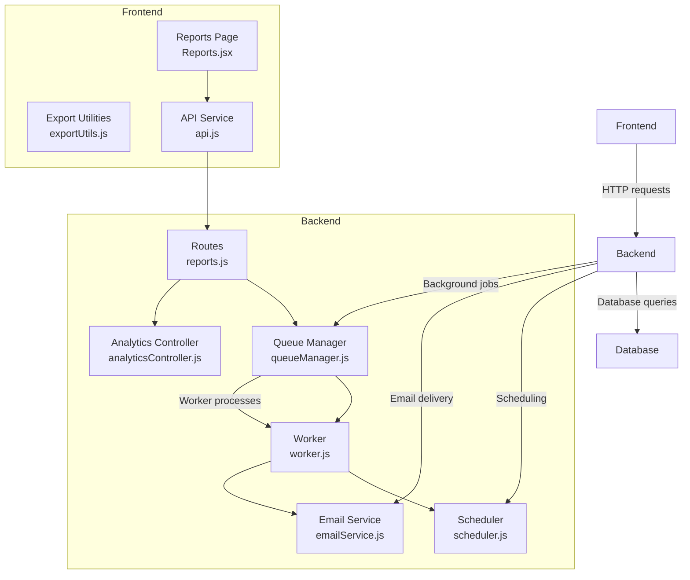

**Diagram sources**
- [Reports.jsx](file://frontend/src/pages/Reports.jsx)
- [exportUtils.js](file://frontend/src/utils/exportUtils.js)
- [api.js](file://frontend/src/services/api.js)
- [reports.js](file://backend/src/routes/reports.js)
- [analyticsController.js](file://backend/src/controllers/analyticsController.js)
- [scheduler.js](file://backend/src/services/scheduler.js)
- [emailService.js](file://backend/src/services/emailService.js)
- [queueManager.js](file://backend/src/services/queueManager.js)
- [worker.js](file://backend/src/services/worker.js)

**Section sources**
- [Reports.jsx](file://frontend/src/pages/Reports.jsx)
- [exportUtils.js](file://frontend/src/utils/exportUtils.js)
- [api.js](file://frontend/src/services/api.js)
- [reports.js](file://backend/src/routes/reports.js)
- [analyticsController.js](file://backend/src/controllers/analyticsController.js)
- [scheduler.js](file://backend/src/services/scheduler.js)
- [emailService.js](file://backend/src/services/emailService.js)
- [queueManager.js](file://backend/src/services/queueManager.js)
- [worker.js](file://backend/src/services/worker.js)

## Core Components
- Reports page (frontend): Provides filtering, preview, and export controls for generated reports.
- Export utilities (frontend): Handles client-side transformations and format-specific exports (CSV, Excel, PDF).
- API service (frontend): Encapsulates HTTP calls to backend report endpoints.
- Report routes (backend): Exposes endpoints for report generation, scheduling, and delivery.
- Analytics controller (backend): Aggregates and prepares report data.
- Scheduler (backend): Manages recurring report generation and delivery.
- Email service (backend): Sends exported reports via email.
- Queue manager and worker (backend): Processes heavy export tasks asynchronously.

**Section sources**
- [Reports.jsx](file://frontend/src/pages/Reports.jsx)
- [exportUtils.js](file://frontend/src/utils/exportUtils.js)
- [api.js](file://frontend/src/services/api.js)
- [reports.js](file://backend/src/routes/reports.js)
- [analyticsController.js](file://backend/src/controllers/analyticsController.js)
- [scheduler.js](file://backend/src/services/scheduler.js)
- [emailService.js](file://backend/src/services/emailService.js)
- [queueManager.js](file://backend/src/services/queueManager.js)
- [worker.js](file://backend/src/services/worker.js)

## Architecture Overview
The report pipeline integrates frontend UI actions with backend processing and delivery. Users initiate exports from the Reports page, which calls backend endpoints. Heavy computations and exports are queued and processed asynchronously. Completed reports are delivered via email or made available for download.

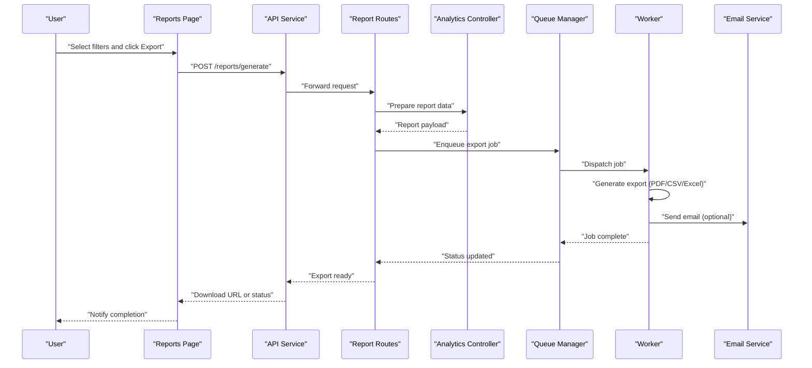

**Diagram sources**
- [Reports.jsx](file://frontend/src/pages/Reports.jsx)
- [api.js](file://frontend/src/services/api.js)
- [reports.js](file://backend/src/routes/reports.js)
- [analyticsController.js](file://backend/src/controllers/analyticsController.js)
- [queueManager.js](file://backend/src/services/queueManager.js)
- [worker.js](file://backend/src/services/worker.js)
- [emailService.js](file://backend/src/services/emailService.js)

## Detailed Component Analysis

### Reports Page Implementation
The Reports page orchestrates user interactions for report generation and export:
- Filtering: Date range, categories, departments, funds, and status.
- Preview: Renders a summarized view of filtered data.
- Export controls: Trigger generation for PDF, CSV, and Excel.
- Bulk export: Allows exporting multiple periods or datasets.
- Sharing: Generates shareable links or triggers email delivery.

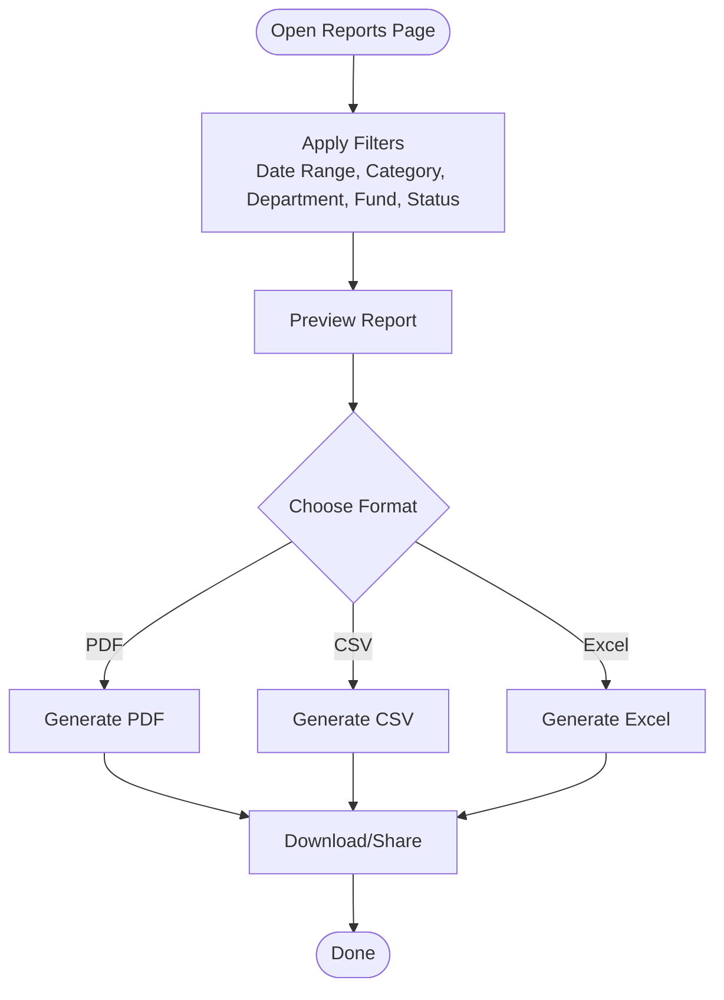

**Diagram sources**
- [Reports.jsx](file://frontend/src/pages/Reports.jsx)

**Section sources**
- [Reports.jsx](file://frontend/src/pages/Reports.jsx)

### Export Utilities
Client-side export utilities handle data transformation and format-specific exports:
- CSV: Converts tabular data to comma-separated values.
- Excel: Produces spreadsheet-compatible exports.
- PDF: Generates printable PDFs with optional styling.
- Data transformation: Ensures proper formatting, localization, and truncation for large datasets.

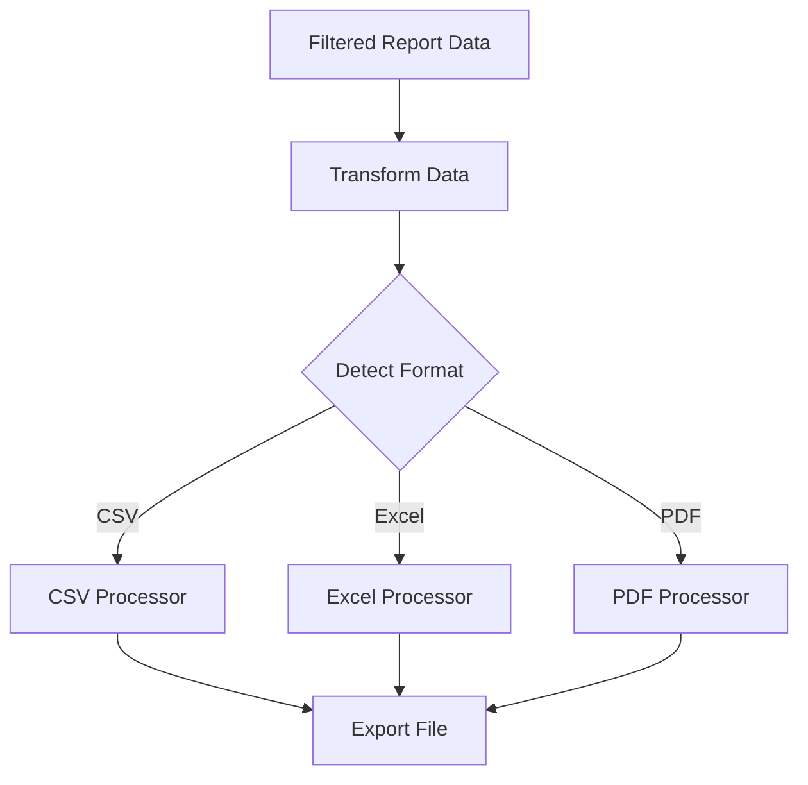

**Diagram sources**
- [exportUtils.js](file://frontend/src/utils/exportUtils.js)

**Section sources**
- [exportUtils.js](file://frontend/src/utils/exportUtils.js)

### API Service and Programmatic Access
The API service encapsulates HTTP interactions with backend endpoints:
- Base URL configuration and request helpers.
- Authentication headers and error propagation.
- Programmatic access for integrations and automation.

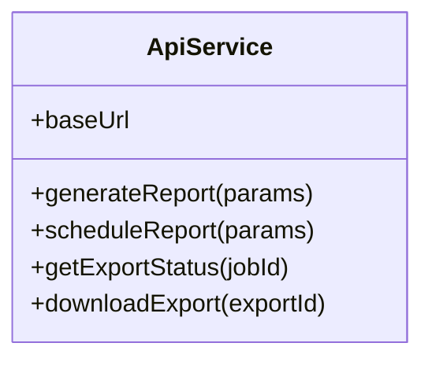

**Diagram sources**
- [api.js](file://frontend/src/services/api.js)

**Section sources**
- [api.js](file://frontend/src/services/api.js)

### Backend Report Routes
Backend routes expose endpoints for report operations:
- POST /reports/generate: Initiates report generation with filters and format.
- POST /reports/schedule: Schedules recurring reports.
- GET /reports/status/:jobId: Checks asynchronous job status.
- GET /reports/download/:exportId: Downloads completed exports.
- DELETE /reports/schedule/:scheduleId: Cancels scheduled reports.

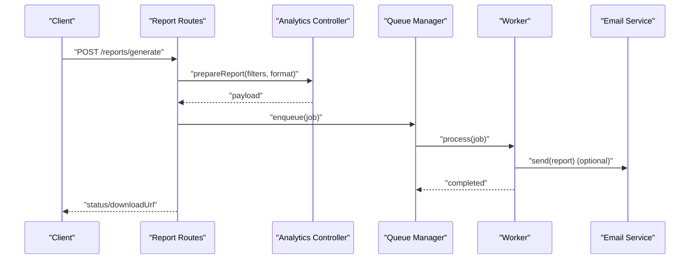

**Diagram sources**
- [reports.js](file://backend/src/routes/reports.js)
- [analyticsController.js](file://backend/src/controllers/analyticsController.js)
- [queueManager.js](file://backend/src/services/queueManager.js)
- [worker.js](file://backend/src/services/worker.js)
- [emailService.js](file://backend/src/services/emailService.js)

**Section sources**
- [reports.js](file://backend/src/routes/reports.js)

### Analytics Controller
The analytics controller aggregates and prepares report data:
- Applies filters and computes summaries.
- Formats data for export utilities.
- Validates inputs and handles errors.

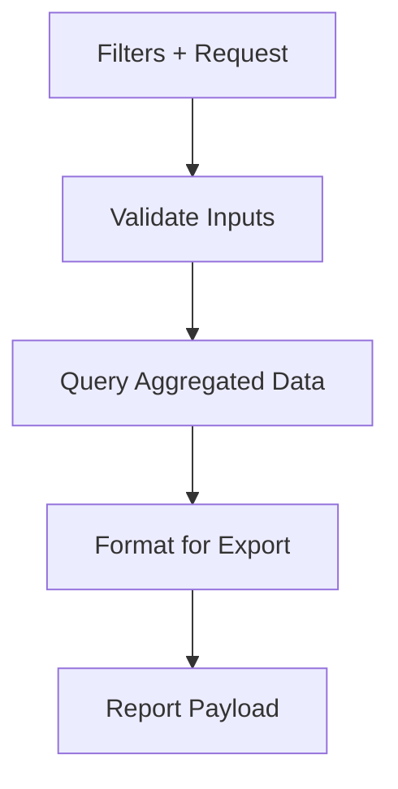

**Diagram sources**
- [analyticsController.js](file://backend/src/controllers/analyticsController.js)

**Section sources**
- [analyticsController.js](file://backend/src/controllers/analyticsController.js)

### Scheduling and Automated Delivery
The scheduler manages recurring report generation:
- Cron-like scheduling for daily/weekly/monthly reports.
- Triggers analytics controller to prepare data.
- Enqueues export jobs and sends emails upon completion.

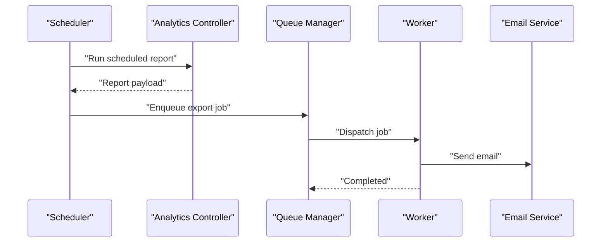

**Diagram sources**
- [scheduler.js](file://backend/src/services/scheduler.js)
- [analyticsController.js](file://backend/src/controllers/analyticsController.js)
- [queueManager.js](file://backend/src/services/queueManager.js)
- [worker.js](file://backend/src/services/worker.js)
- [emailService.js](file://backend/src/services/emailService.js)

**Section sources**
- [scheduler.js](file://backend/src/services/scheduler.js)

### Email Service and Delivery
The email service delivers reports via SMTP:
- Configurable SMTP settings.
- Attaches generated exports.
- Handles delivery failures and retries.

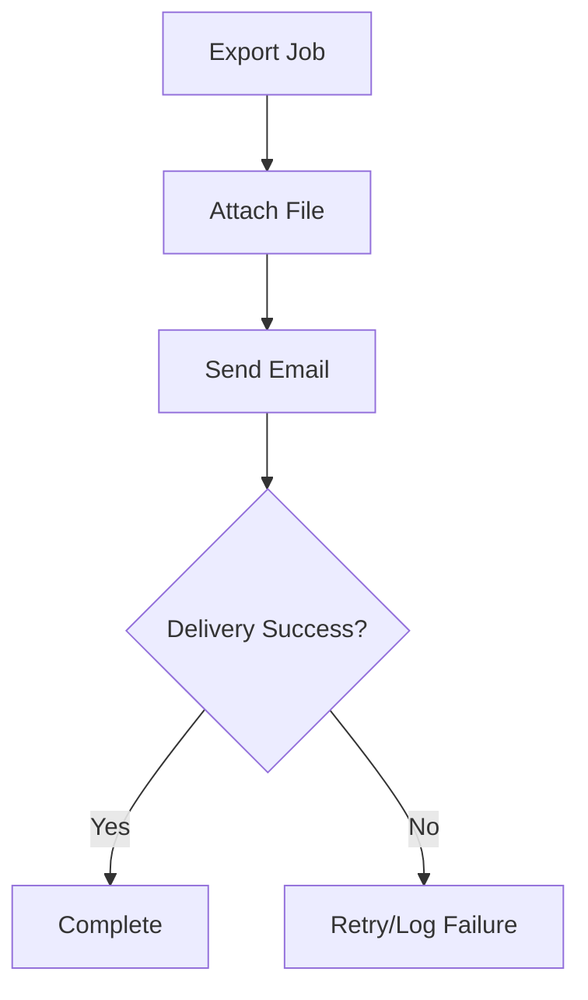

**Diagram sources**
- [emailService.js](file://backend/src/services/emailService.js)

**Section sources**
- [emailService.js](file://backend/src/services/emailService.js)

### Queue Manager and Worker
Asynchronous processing ensures scalability:
- Queue Manager enqueues jobs and tracks status.
- Worker processes jobs, generates exports, and updates status.

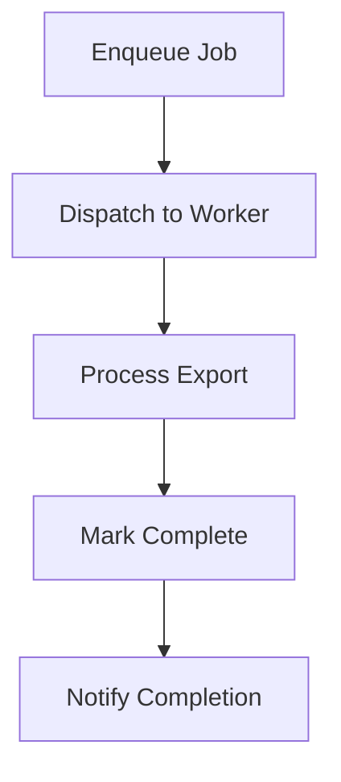

**Diagram sources**
- [queueManager.js](file://backend/src/services/queueManager.js)
- [worker.js](file://backend/src/services/worker.js)

**Section sources**
- [queueManager.js](file://backend/src/services/queueManager.js)
- [worker.js](file://backend/src/services/worker.js)

### Report Templates and Styling
- Template engine: Supports configurable report templates for PDF generation.
- Styling options: Fonts, colors, headers, footers, and layout adjustments.
- Customization: Allows per-user or per-report theme preferences.

[No sources needed since this section provides general guidance]

### Filter Integration and Report Customization
- Filters: Date range, categories, departments, funds, status, and custom attributes.
- Customization: Per-user saved filters, report titles, and metadata.

[No sources needed since this section provides general guidance]

### Bulk Export Functionality
- Multi-period exports: Combine multiple date ranges or datasets.
- Batch processing: Queues multiple jobs for concurrent execution.
- Consolidated downloads: Zipped archives for multiple exports.

[No sources needed since this section provides general guidance]

## Dependency Analysis
The report system exhibits clear separation of concerns:
- Frontend depends on API service for backend communication.
- Backend routes depend on analytics controller for data preparation.
- Background processing depends on queue manager and worker.
- Delivery depends on email service and scheduler.

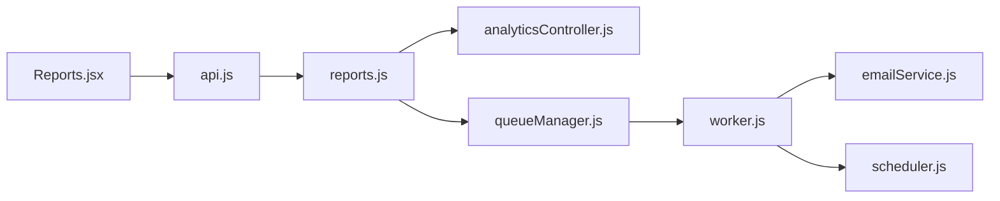

**Diagram sources**
- [Reports.jsx](file://frontend/src/pages/Reports.jsx)
- [api.js](file://frontend/src/services/api.js)
- [reports.js](file://backend/src/routes/reports.js)
- [analyticsController.js](file://backend/src/controllers/analyticsController.js)
- [queueManager.js](file://backend/src/services/queueManager.js)
- [worker.js](file://backend/src/services/worker.js)
- [emailService.js](file://backend/src/services/emailService.js)
- [scheduler.js](file://backend/src/services/scheduler.js)

**Section sources**
- [Reports.jsx](file://frontend/src/pages/Reports.jsx)
- [api.js](file://frontend/src/services/api.js)
- [reports.js](file://backend/src/routes/reports.js)
- [analyticsController.js](file://backend/src/controllers/analyticsController.js)
- [queueManager.js](file://backend/src/services/queueManager.js)
- [worker.js](file://backend/src/services/worker.js)
- [emailService.js](file://backend/src/services/emailService.js)
- [scheduler.js](file://backend/src/services/scheduler.js)

## Performance Considerations
- Asynchronous processing: Offload heavy exports to queue workers.
- Pagination and chunking: Stream large datasets to avoid memory spikes.
- Caching: Cache frequently accessed aggregated data.
- Compression: Compress exports for faster downloads.
- Database indexing: Optimize queries for filters and date ranges.
- Resource limits: Set timeouts and memory caps for export jobs.

[No sources needed since this section provides general guidance]

## Troubleshooting Guide
Common issues and resolutions:
- Export fails silently: Check queue worker logs and retry mechanism.
- Large export consumes memory: Enable streaming/chunking and compression.
- Email delivery errors: Verify SMTP configuration and credentials.
- Scheduled reports not running: Confirm scheduler cron configuration and timezone.
- Permission denied: Validate user roles and access to requested filters.

**Section sources**
- [queueManager.js](file://backend/src/services/queueManager.js)
- [worker.js](file://backend/src/services/worker.js)
- [emailService.js](file://backend/src/services/emailService.js)
- [scheduler.js](file://backend/src/services/scheduler.js)

## Conclusion
The report generation and export system combines a user-friendly frontend with robust backend processing, scheduling, and delivery mechanisms. By leveraging asynchronous queues, configurable templates, and comprehensive filtering, it supports scalable, reliable, and customizable reporting for diverse use cases.