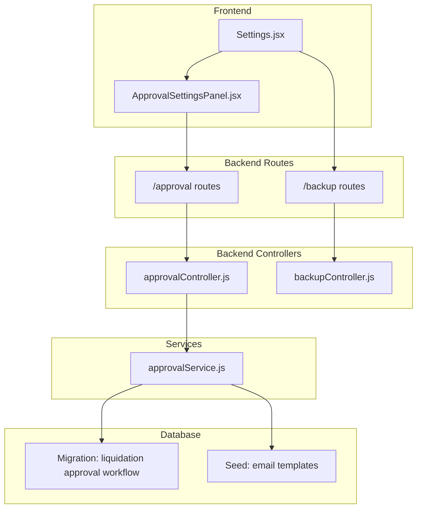
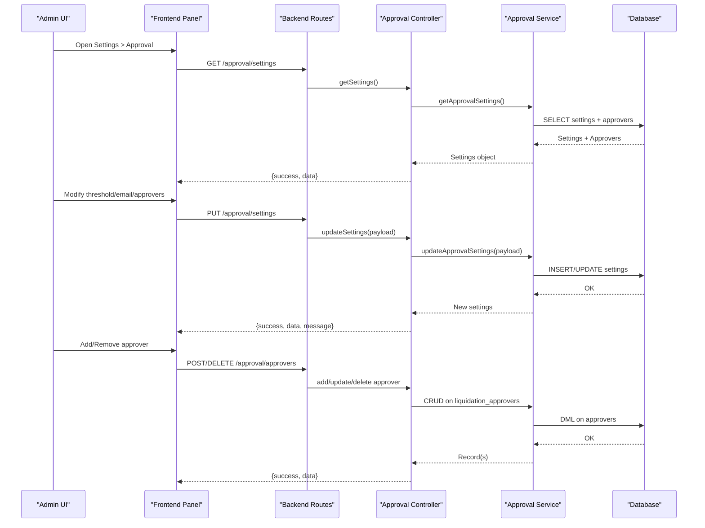
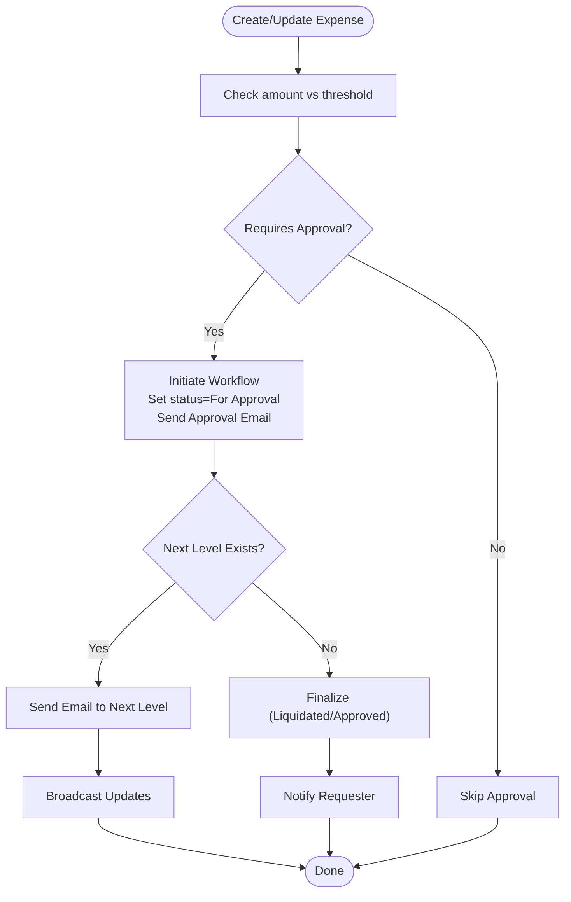
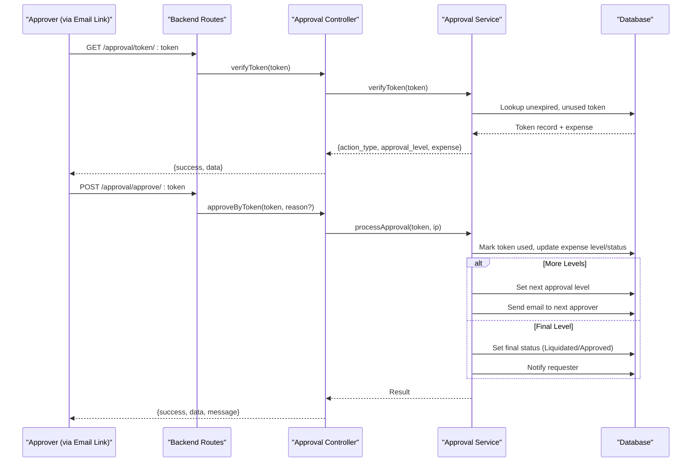
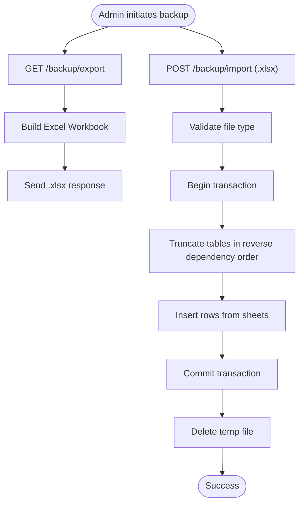
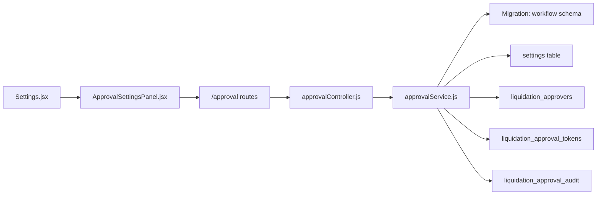

# Approval Settings & Configuration

<cite>
**Referenced Files in This Document**
- [approvalController.js](file://backend/src/controllers/approvalController.js)
- [approvalService.js](file://backend/src/services/approvalService.js)
- [approval.js](file://backend/src/routes/approval.js)
- [ApprovalSettingsPanel.jsx](file://frontend/src/components/ApprovalSettingsPanel.jsx)
- [Settings.jsx](file://frontend/src/pages/Settings.jsx)
- [20260611000000_add_liquidation_approval_workflow.js](file://backend/src/db/migrations/20260611000000_add_liquidation_approval_workflow.js)
- [03_email_templates.js](file://backend/src/db/seeds/03_email_templates.js)
- [backupController.js](file://backend/src/controllers/backupController.js)
- [backup.js](file://backend/src/routes/backup.js)
- [BackupRestore.jsx](file://frontend/src/pages/BackupRestore.jsx)
</cite>

## Table of Contents
1. [Introduction](#introduction)
2. [Project Structure](#project-structure)
3. [Core Components](#core-components)
4. [Architecture Overview](#architecture-overview)
5. [Detailed Component Analysis](#detailed-component-analysis)
6. [Dependency Analysis](#dependency-analysis)
7. [Performance Considerations](#performance-considerations)
8. [Troubleshooting Guide](#troubleshooting-guide)
9. [Conclusion](#conclusion)
10. [Appendices](#appendices)

## Introduction
This document explains the approval settings and configuration management for the petty cash liquidation workflow. It covers the approval settings panel interface, configuration options, administrative controls, thresholds, approver hierarchies, workflow customization, API endpoints, validation rules, persistence, workflow rules, escalation timers, notification preferences, backup and restore, and default configurations.

## Project Structure
The approval system spans backend controllers, services, and database migrations, and a frontend settings page and panel that expose configuration to administrators.

**Diagram sources**
- [approval.js:1-36](file://backend/src/routes/approval.js#L1-L36)
- [backup.js:1-33](file://backend/src/routes/backup.js#L1-L33)
- [approvalController.js:1-108](file://backend/src/controllers/approvalController.js#L1-L108)
- [backupController.js:1-137](file://backend/src/controllers/backupController.js#L1-L137)
- [approvalService.js:1-590](file://backend/src/services/approvalService.js#L1-L590)
- [20260611000000_add_liquidation_approval_workflow.js:1-179](file://backend/src/db/migrations/20260611000000_add_liquidation_approval_workflow.js#L1-L179)
- [03_email_templates.js:1-111](file://backend/src/db/seeds/03_email_templates.js#L1-L111)

**Section sources**
- [approval.js:1-36](file://backend/src/routes/approval.js#L1-L36)
- [backup.js:1-33](file://backend/src/routes/backup.js#L1-L33)
- [approvalController.js:1-108](file://backend/src/controllers/approvalController.js#L1-L108)
- [backupController.js:1-137](file://backend/src/controllers/backupController.js#L1-L137)
- [approvalService.js:1-590](file://backend/src/services/approvalService.js#L1-L590)
- [20260611000000_add_liquidation_approval_workflow.js:1-179](file://backend/src/db/migrations/20260611000000_add_liquidation_approval_workflow.js#L1-L179)
- [03_email_templates.js:1-111](file://backend/src/db/seeds/03_email_templates.js#L1-L111)

## Core Components
- Approval Settings Panel (frontend): Administrators configure the liquidation approval threshold, enable/disable email approvals, and manage approvers.
- Approval API (backend): Provides endpoints to fetch/update settings, list/add/update/delete approvers, and public token-based approval/decline actions.
- Approval Service (backend): Implements settings retrieval/persistence, approval workflow initiation, token generation/expiry, audit logging, and notifications.
- Database Schema (migration): Defines approvers table, tokens table, audit trail table, and default settings.
- Backup/Restore (backend/frontend): Exports and imports system data for disaster recovery.

**Section sources**
- [ApprovalSettingsPanel.jsx:1-252](file://frontend/src/components/ApprovalSettingsPanel.jsx#L1-L252)
- [Settings.jsx:1-460](file://frontend/src/pages/Settings.jsx#L1-L460)
- [approval.js:1-36](file://backend/src/routes/approval.js#L1-L36)
- [approvalController.js:1-108](file://backend/src/controllers/approvalController.js#L1-L108)
- [approvalService.js:1-590](file://backend/src/services/approvalService.js#L1-L590)
- [20260611000000_add_liquidation_approval_workflow.js:1-179](file://backend/src/db/migrations/20260611000000_add_liquidation_approval_workflow.js#L1-L179)
- [backup.js:1-33](file://backend/src/routes/backup.js#L1-L33)
- [backupController.js:1-137](file://backend/src/controllers/backupController.js#L1-L137)

## Architecture Overview
The approval configuration architecture integrates frontend forms with backend APIs and database persistence. Token-based public URLs enable email-based approvals without login.

**Diagram sources**
- [approval.js:1-36](file://backend/src/routes/approval.js#L1-L36)
- [approvalController.js:1-108](file://backend/src/controllers/approvalController.js#L1-L108)
- [approvalService.js:23-82](file://backend/src/services/approvalService.js#L23-L82)
- [20260611000000_add_liquidation_approval_workflow.js:21-62](file://backend/src/db/migrations/20260611000000_add_liquidation_approval_workflow.js#L21-L62)

## Detailed Component Analysis

### Approval Settings Panel (Frontend)
- Purpose: Presents configurable approval parameters and manages approvers.
- Key controls:
  - Threshold input (currency amount) with validation semantics.
  - Toggle for enabling/disabling email approval.
  - Primary approver email field.
  - Multi-level approver list with add/remove.
- Behavior:
  - Loads settings and approvers concurrently on mount.
  - Saves settings via PUT to backend.
  - Adds/removes approvers via POST/DELETE to backend.

**Section sources**
- [ApprovalSettingsPanel.jsx:1-252](file://frontend/src/components/ApprovalSettingsPanel.jsx#L1-L252)
- [Settings.jsx:301-301](file://frontend/src/pages/Settings.jsx#L301-L301)

### Approval API Endpoints (Backend)
- Protected admin endpoints:
  - GET /approval/settings (Super Admin)
  - PUT /approval/settings (Super Admin)
  - GET /approval/approvers (Super Admin)
  - POST /approval/approvers (Super Admin)
  - PUT /approval/approvers/:id (Super Admin)
  - DELETE /approval/approvers/:id (Super Admin)
- Public token-based endpoints:
  - GET /approval/token/:token
  - POST /approval/approve/:token
  - POST /approval/decline/:token
- Audit trail endpoint:
  - GET /approval/audit/:expenseId

**Section sources**
- [approval.js:17-33](file://backend/src/routes/approval.js#L17-L33)
- [approvalController.js:3-107](file://backend/src/controllers/approvalController.js#L3-L107)

### Approval Service (Backend)
- Settings retrieval and persistence:
  - Reads/writes settings keys for threshold, email enablement, and primary approver email.
  - Persists updates atomically per key.
- Workflow orchestration:
  - Determines if approval is required based on threshold.
  - Initiates workflow by transitioning expense status and sending email tokens.
  - Manages multi-level approvers and escalations.
- Tokens and expiry:
  - Generates hashed tokens per approval/decline action and per approval level.
  - Enforces 7-day expiry.
- Audit and notifications:
  - Records actions in audit table.
  - Sends requester notifications upon finalization.
  - Broadcasts updates to clients.

**Diagram sources**
- [approvalService.js:114-117](file://backend/src/services/approvalService.js#L114-L117)
- [approvalService.js:292-355](file://backend/src/services/approvalService.js#L292-L355)
- [approvalService.js:427-509](file://backend/src/services/approvalService.js#L427-L509)

**Section sources**
- [approvalService.js:23-82](file://backend/src/services/approvalService.js#L23-L82)
- [approvalService.js:114-117](file://backend/src/services/approvalService.js#L114-L117)
- [approvalService.js:292-355](file://backend/src/services/approvalService.js#L292-L355)
- [approvalService.js:427-509](file://backend/src/services/approvalService.js#L427-L509)

### Database Schema and Defaults
- Tables:
  - liquidation_approvers: stores approver records with approval_level and is_active.
  - liquidation_approval_tokens: stores hashed tokens, action type, approval level, expiry, and usage.
  - liquidation_approval_audit: tracks created/submitted/approved/declined actions with actor info and IP.
- Default settings persisted on migration:
  - liquidation_approval_threshold
  - liquidation_approval_email_enabled
  - liquidation_approval_recipient_email
- Email templates seeded:
  - liquidation_approval_request
  - liquidation_approved_requester
  - liquidation_declined_requester

**Section sources**
- [20260611000000_add_liquidation_approval_workflow.js:21-62](file://backend/src/db/migrations/20260611000000_add_liquidation_approval_workflow.js#L21-L62)
- [20260611000000_add_liquidation_approval_workflow.js:64-76](file://backend/src/db/migrations/20260611000000_add_liquidation_approval_workflow.js#L64-L76)
- [03_email_templates.js:40-94](file://backend/src/db/seeds/03_email_templates.js#L40-L94)

### Token-Based Approval Flow (Public)

**Diagram sources**
- [approval.js:17-20](file://backend/src/routes/approval.js#L17-L20)
- [approvalController.js:61-98](file://backend/src/controllers/approvalController.js#L61-L98)
- [approvalService.js:398-425](file://backend/src/services/approvalService.js#L398-L425)
- [approvalService.js:427-509](file://backend/src/services/approvalService.js#L427-L509)

**Section sources**
- [approval.js:17-20](file://backend/src/routes/approval.js#L17-L20)
- [approvalController.js:61-98](file://backend/src/controllers/approvalController.js#L61-L98)
- [approvalService.js:398-425](file://backend/src/services/approvalService.js#L398-L425)
- [approvalService.js:427-509](file://backend/src/services/approvalService.js#L427-L509)

### Backup and Restore (System-wide)
- Export backup:
  - Endpoint: GET /backup/export
  - Returns Excel workbook containing selected tables.
- Import backup:
  - Endpoint: POST /backup/import
  - Validates .xlsx, truncates tables in dependency-aware order, inserts data, commits transaction.
- Frontend UI:
  - Provides export/download and import/upload with confirmation modal and warnings.

**Diagram sources**
- [backup.js:29-30](file://backend/src/routes/backup.js#L29-L30)
- [backupController.js:6-56](file://backend/src/controllers/backupController.js#L6-L56)
- [backupController.js:58-136](file://backend/src/controllers/backupController.js#L58-L136)
- [BackupRestore.jsx:12-65](file://frontend/src/pages/BackupRestore.jsx#L12-L65)

**Section sources**
- [backup.js:1-33](file://backend/src/routes/backup.js#L1-L33)
- [backupController.js:1-137](file://backend/src/controllers/backupController.js#L1-L137)
- [BackupRestore.jsx:1-210](file://frontend/src/pages/BackupRestore.jsx#L1-L210)

## Dependency Analysis
- Frontend depends on:
  - Settings page embeds ApprovalSettingsPanel.
  - ApprovalSettingsPanel calls /approval endpoints.
- Backend depends on:
  - Routes -> Controller -> Service -> Database.
  - ApprovalService depends on email/notification/queue/socket services for notifications and broadcasts.
- Database:
  - Migration defines schema and seeds default templates.
  - Settings persistence uses a generic settings table keyed by name.

**Diagram sources**
- [approval.js:1-36](file://backend/src/routes/approval.js#L1-L36)
- [approvalController.js:1-108](file://backend/src/controllers/approvalController.js#L1-L108)
- [approvalService.js:1-590](file://backend/src/services/approvalService.js#L1-L590)
- [20260611000000_add_liquidation_approval_workflow.js:1-179](file://backend/src/db/migrations/20260611000000_add_liquidation_approval_workflow.js#L1-L179)

**Section sources**
- [approval.js:1-36](file://backend/src/routes/approval.js#L1-L36)
- [approvalController.js:1-108](file://backend/src/controllers/approvalController.js#L1-L108)
- [approvalService.js:1-590](file://backend/src/services/approvalService.js#L1-L590)
- [20260611000000_add_liquidation_approval_workflow.js:1-179](file://backend/src/db/migrations/20260611000000_add_liquidation_approval_workflow.js#L1-L179)

## Performance Considerations
- Token hashing and expiry checks are O(1) lookups; ensure indexes on token_hash and expense_id/action_type.
- Audit queries filter by expense_id and sort by created_at; ensure indexes exist for efficient sorting.
- Email sending is asynchronous via service calls; consider queuing for high throughput.
- Approver retrieval sorts by approval_level; ensure appropriate indexing on approval_level.

## Troubleshooting Guide
- Settings not saving:
  - Verify Super Admin authorization on /approval/settings endpoints.
  - Confirm payload includes numeric threshold and boolean email flag.
- Approver not receiving emails:
  - Check email enablement setting and primary approver email.
  - Ensure approver records exist and are active.
- Token errors:
  - Links expire after 7 days; regenerate tokens via workflow.
  - Used tokens cannot be reused; check audit for usage.
- Audit trail missing:
  - Ensure audit table exists and is seeded.
- Backup failures:
  - Confirm .xlsx format and Super Admin role.
  - Review transaction rollback messages for constraint violations.

**Section sources**
- [approval.js:25-33](file://backend/src/routes/approval.js#L25-L33)
- [approvalService.js:252-290](file://backend/src/services/approvalService.js#L252-L290)
- [approvalService.js:398-425](file://backend/src/services/approvalService.js#L398-L425)
- [approvalService.js:161-214](file://backend/src/services/approvalService.js#L161-L214)
- [backup.js:29-30](file://backend/src/routes/backup.js#L29-L30)
- [backupController.js:58-136](file://backend/src/controllers/backupController.js#L58-L136)

## Conclusion
The approval settings and configuration system provides a robust, auditable, and extensible framework for petty cash liquidation approvals. Administrators can control thresholds, enable email-based approvals, manage multi-level approvers, and monitor activity. The system supports secure token-based actions, comprehensive audit trails, and enterprise-grade backup/restore capabilities.

## Appendices

### API Reference: Approval Settings
- GET /approval/settings
  - Role: Super Admin
  - Response: { success: boolean, data: settings }
  - Settings keys:
    - liquidation_approval_threshold: number
    - liquidation_approval_email_enabled: boolean
    - liquidation_approval_recipient_email: string
- PUT /approval/settings
  - Role: Super Admin
  - Body: Partial settings object
  - Response: { success: boolean, data: settings, message: string }
- GET /approval/approvers
  - Role: Super Admin
  - Response: { success: boolean, data: approver[] }
- POST /approval/approvers
  - Role: Super Admin
  - Body: { email, name?, approval_level?, is_active? }
  - Response: { success: boolean, data: approver }
- PUT /approval/approvers/:id
  - Role: Super Admin
  - Body: { email, name?, approval_level?, is_active? }
  - Response: { success: boolean, data: approver }
- DELETE /approval/approvers/:id
  - Role: Super Admin
  - Response: { success: boolean, message: string }
- GET /approval/token/:token
  - Role: Public
  - Response: { success: boolean, data: { action_type, approval_level, expense } }
- POST /approval/approve/:token
  - Role: Public
  - Response: { success: boolean, data: result, message: string }
- POST /approval/decline/:token
  - Role: Public
  - Body: { reason: string }
  - Response: { success: boolean, data: result, message: string }
- GET /approval/audit/:expenseId
  - Role: Public
  - Response: { success: boolean, data: auditTrail[] }

**Section sources**
- [approval.js:17-33](file://backend/src/routes/approval.js#L17-L33)
- [approvalController.js:3-107](file://backend/src/controllers/approvalController.js#L3-L107)

### Validation Rules and Defaults
- Threshold:
  - Type: number
  - Default: 10000
  - Behavior: Amount >= threshold triggers approval workflow.
- Email Enablement:
  - Type: boolean
  - Default: true
- Primary Approver Email:
  - Type: string (email)
  - Default: empty
  - Behavior: If present and not in approver list, treated as level 1 approver.
- Escalation Timers:
  - Token expiry: 7 days
  - No additional timer configured; escalation occurs by moving to next level.
- Notification Preferences:
  - Separate from approval settings; managed under Notifications tab.

**Section sources**
- [approvalService.js:23-57](file://backend/src/services/approvalService.js#L23-L57)
- [approvalService.js:114-117](file://backend/src/services/approvalService.js#L114-L117)
- [20260611000000_add_liquidation_approval_workflow.js:64-76](file://backend/src/db/migrations/20260611000000_add_liquidation_approval_workflow.js#L64-L76)

### Configuration Persistence and Versioning
- Persistence:
  - Settings stored in settings table by key.
  - Approvers stored in liquidation_approvers table.
  - Tokens stored in liquidation_approval_tokens table.
  - Audit stored in liquidation_approval_audit table.
- Versioning:
  - Migration file name encodes timestamp for ordering.
  - Seed ensures default email templates exist.

**Section sources**
- [20260611000000_add_liquidation_approval_workflow.js:1-179](file://backend/src/db/migrations/20260611000000_add_liquidation_approval_workflow.js#L1-L179)
- [03_email_templates.js:1-111](file://backend/src/db/seeds/03_email_templates.js#L1-L111)

### Workflow Customization
- Multi-level approvers:
  - Define multiple approvers with distinct approval_level values.
  - Workflow escalates to next level automatically.
- Custom rule creation:
  - Threshold and email enablement are configurable.
  - Future enhancements could add category-specific thresholds or dynamic approver assignment.
- Optimization settings:
  - Token expiry and audit indexing improve performance.
  - Consider adding rate limiting for token verification endpoints.

**Section sources**
- [approvalService.js:427-509](file://backend/src/services/approvalService.js#L427-L509)
- [approvalService.js:558-586](file://backend/src/services/approvalService.js#L558-L586)