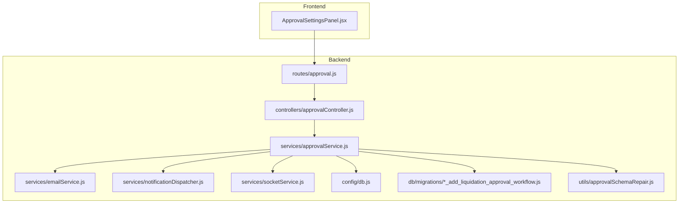
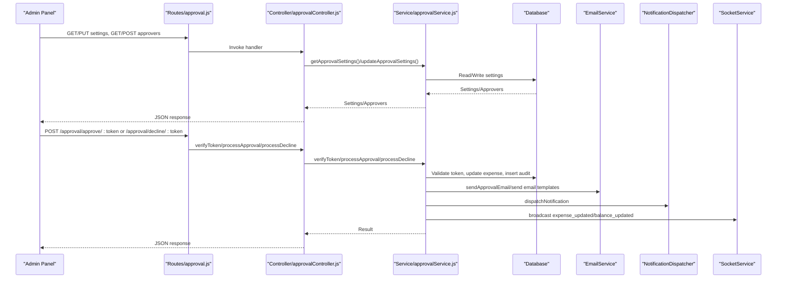
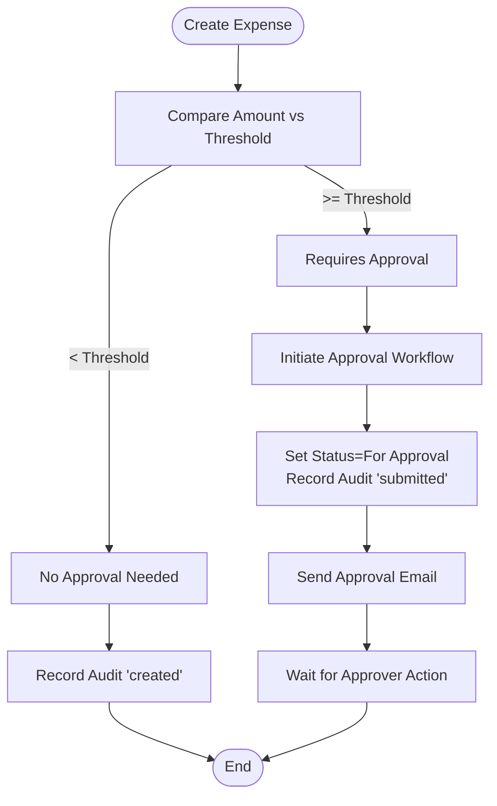
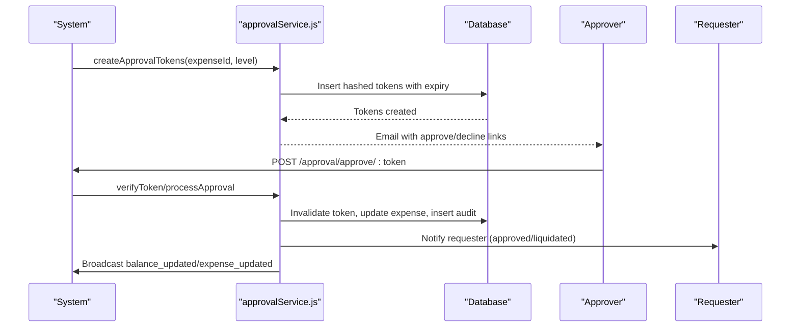
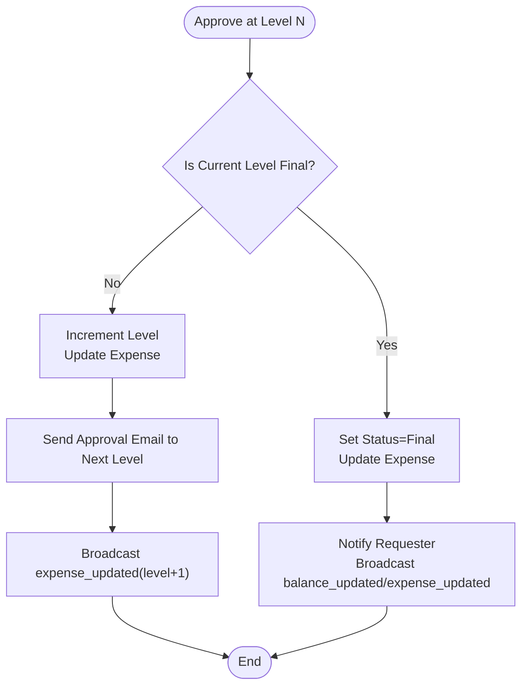
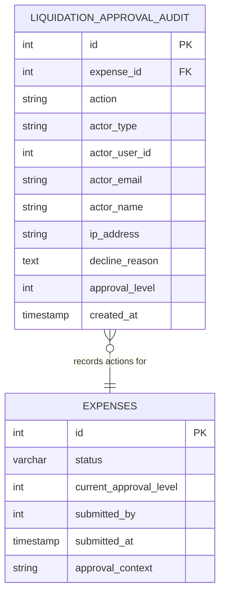
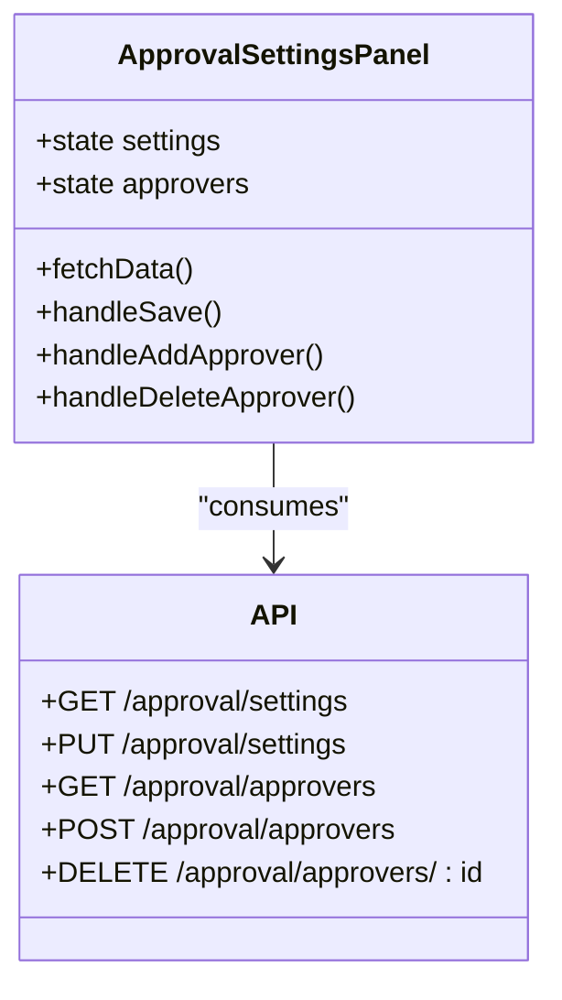
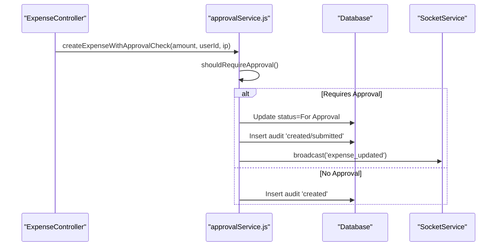
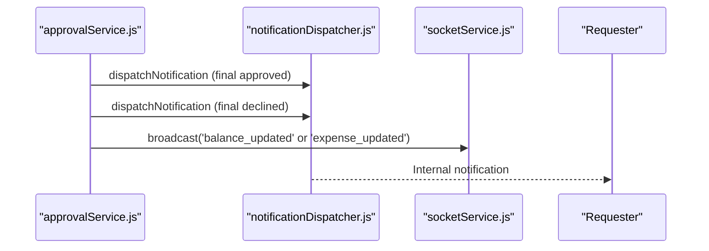
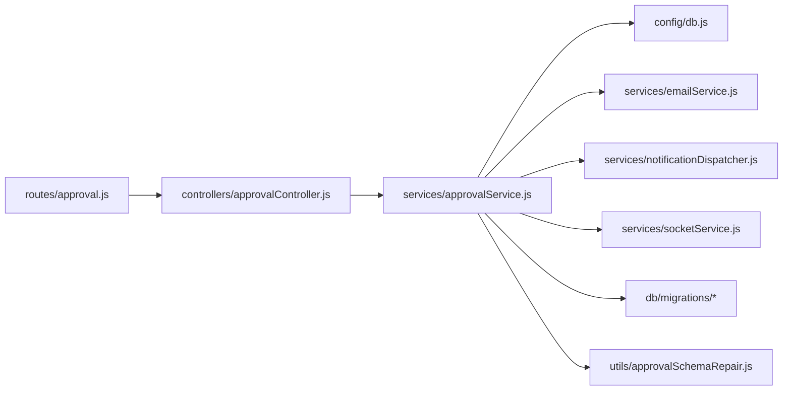

# Approval Workflow System

<cite>
**Referenced Files in This Document**
- [approvalController.js](file://backend/src/controllers/approvalController.js)
- [approvalService.js](file://backend/src/services/approvalService.js)
- [approval.js](file://backend/src/routes/approval.js)
- [ApprovalSettingsPanel.jsx](file://frontend/src/components/ApprovalSettingsPanel.jsx)
- [approvalSchemaRepair.js](file://backend/src/utils/approvalSchemaRepair.js)
- [20260611000000_add_liquidation_approval_workflow.js](file://backend/src/db/migrations/20260611000000_add_liquidation_approval_workflow.js)
- [analyticsController.js](file://backend/src/controllers/analyticsController.js)
- [expenseController.js](file://backend/src/controllers/expenseController.js)
- [emailService.js](file://backend/src/services/emailService.js)
- [notificationDispatcher.js](file://backend/src/services/notificationDispatcher.js)
- [socketService.js](file://backend/src/services/socketService.js)
- [auth.js](file://backend/src/middleware/auth.js)
- [db.js](file://backend/src/config/db.js)
</cite>

## Table of Contents
1. [Introduction](#introduction)
2. [Project Structure](#project-structure)
3. [Core Components](#core-components)
4. [Architecture Overview](#architecture-overview)
5. [Detailed Component Analysis](#detailed-component-analysis)
6. [Dependency Analysis](#dependency-analysis)
7. [Performance Considerations](#performance-considerations)
8. [Troubleshooting Guide](#troubleshooting-guide)
9. [Conclusion](#conclusion)
10. [Appendices](#appendices)

## Introduction
This document describes the multi-level approval workflow system for petty cash liquidations. It covers threshold-based approval detection, email-based approval processes, token-based security mechanisms, approval routing algorithms, escalation procedures, audit trail maintenance, and integration with expense management. It also documents the approval settings panel configuration, approver assignment, workflow customization, approval status tracking, notification triggers, analytics and reporting capabilities, workflow optimization, security considerations, approval history, and compliance requirements.

## Project Structure
The approval workflow spans backend controllers, services, database migrations, and frontend components. Controllers expose REST endpoints for approval settings, approver management, and token-based actions. Services encapsulate business logic for thresholds, routing, tokens, emails, notifications, and audit logging. Frontend provides an administrative panel to configure thresholds and manage approvers. Migrations define the schema for approvals, tokens, auditors, and default settings.

**Diagram sources**
- [approval.js:1-36](file://backend/src/routes/approval.js#L1-L36)
- [approvalController.js:1-108](file://backend/src/controllers/approvalController.js#L1-L108)
- [approvalService.js:1-590](file://backend/src/services/approvalService.js#L1-L590)
- [emailService.js](file://backend/src/services/emailService.js)
- [notificationDispatcher.js](file://backend/src/services/notificationDispatcher.js)
- [socketService.js](file://backend/src/services/socketService.js)
- [db.js](file://backend/src/config/db.js)
- [20260611000000_add_liquidation_approval_workflow.js:1-179](file://backend/src/db/migrations/20260611000000_add_liquidation_approval_workflow.js#L1-L179)
- [approvalSchemaRepair.js:1-100](file://backend/src/utils/approvalSchemaRepair.js#L1-L100)
- [ApprovalSettingsPanel.jsx:1-252](file://frontend/src/components/ApprovalSettingsPanel.jsx#L1-L252)

**Section sources**
- [approval.js:1-36](file://backend/src/routes/approval.js#L1-L36)
- [approvalController.js:1-108](file://backend/src/controllers/approvalController.js#L1-L108)
- [approvalService.js:1-590](file://backend/src/services/approvalService.js#L1-L590)
- [20260611000000_add_liquidation_approval_workflow.js:1-179](file://backend/src/db/migrations/20260611000000_add_liquidation_approval_workflow.js#L1-L179)
- [approvalSchemaRepair.js:1-100](file://backend/src/utils/approvalSchemaRepair.js#L1-L100)
- [ApprovalSettingsPanel.jsx:1-252](file://frontend/src/components/ApprovalSettingsPanel.jsx#L1-L252)

## Core Components
- Approval controller: Exposes endpoints for settings retrieval/update, approver CRUD, token verification, and audit trail retrieval.
- Approval service: Implements threshold checks, approval routing, token generation and validation, email notifications, audit logging, and broadcast events.
- Routes: Defines public token-based endpoints and protected admin endpoints.
- Frontend settings panel: Allows administrators to configure approval threshold, enable/disable email approval, set primary approver email, and manage multi-level approvers.
- Schema and migrations: Define approval-related tables, default settings, and email templates.
- Utilities: Schema repair utility ensures compatibility across environments.

Key responsibilities:
- Threshold-based approval detection: Determines whether an expense requires approval based on configured threshold.
- Token-based security: Generates hashed tokens per approval level with expiry and single-use semantics.
- Email-based approval: Sends secure approve/decline links to designated approvers.
- Multi-level routing: Moves approvals across configured levels and escalates accordingly.
- Audit and compliance: Records all actions with actor identity, IP address, and timestamps.
- Notifications: Notifies requesters upon finalization via internal notifications and broadcasts.

**Section sources**
- [approvalController.js:1-108](file://backend/src/controllers/approvalController.js#L1-L108)
- [approvalService.js:1-590](file://backend/src/services/approvalService.js#L1-L590)
- [approval.js:1-36](file://backend/src/routes/approval.js#L1-L36)
- [ApprovalSettingsPanel.jsx:1-252](file://frontend/src/components/ApprovalSettingsPanel.jsx#L1-L252)
- [20260611000000_add_liquidation_approval_workflow.js:1-179](file://backend/src/db/migrations/20260611000000_add_liquidation_approval_workflow.js#L1-L179)
- [approvalSchemaRepair.js:1-100](file://backend/src/utils/approvalSchemaRepair.js#L1-L100)

## Architecture Overview
The system integrates frontend configuration, backend processing, database persistence, and external systems for email delivery and real-time notifications.

**Diagram sources**
- [approval.js:1-36](file://backend/src/routes/approval.js#L1-L36)
- [approvalController.js:1-108](file://backend/src/controllers/approvalController.js#L1-L108)
- [approvalService.js:1-590](file://backend/src/services/approvalService.js#L1-L590)
- [emailService.js](file://backend/src/services/emailService.js)
- [notificationDispatcher.js](file://backend/src/services/notificationDispatcher.js)
- [socketService.js](file://backend/src/services/socketService.js)

## Detailed Component Analysis

### Threshold-Based Approval Detection
Threshold detection evaluates whether an expense amount meets or exceeds the configured approval threshold. If so, the system initiates the approval workflow; otherwise, it records the creation event and proceeds without approval.

**Diagram sources**
- [approvalService.js:114-117](file://backend/src/services/approvalService.js#L114-L117)
- [approvalService.js:292-355](file://backend/src/services/approvalService.js#L292-L355)

**Section sources**
- [approvalService.js:114-117](file://backend/src/services/approvalService.js#L114-L117)
- [approvalService.js:292-355](file://backend/src/services/approvalService.js#L292-L355)

### Token-Based Security Mechanisms
Token-based security secures email-based approvals:
- Tokens are generated per approval level and stored as SHA-256 hashes.
- Each token has an expiration date and is single-use.
- Public endpoints verify tokens and process approvals or declines.

**Diagram sources**
- [approvalService.js:223-250](file://backend/src/services/approvalService.js#L223-L250)
- [approvalService.js:387-425](file://backend/src/services/approvalService.js#L387-L425)
- [approvalService.js:427-509](file://backend/src/services/approvalService.js#L427-L509)
- [approvalService.js:511-555](file://backend/src/services/approvalService.js#L511-L555)

**Section sources**
- [approvalService.js:7-12](file://backend/src/services/approvalService.js#L7-L12)
- [approvalService.js:223-250](file://backend/src/services/approvalService.js#L223-L250)
- [approvalService.js:387-425](file://backend/src/services/approvalService.js#L387-L425)
- [approvalService.js:427-509](file://backend/src/services/approvalService.js#L427-L509)
- [approvalService.js:511-555](file://backend/src/services/approvalService.js#L511-L555)

### Approval Routing and Escalation Procedures
Routing follows approval levels:
- If the current level is less than total levels, escalate to the next level.
- If at the final level, finalize the expense (Liquidated or Approved depending on context).
- Broadcast updates to connected clients and notify requesters.

**Diagram sources**
- [approvalService.js:458-475](file://backend/src/services/approvalService.js#L458-L475)
- [approvalService.js:477-508](file://backend/src/services/approvalService.js#L477-L508)

**Section sources**
- [approvalService.js:292-327](file://backend/src/services/approvalService.js#L292-L327)
- [approvalService.js:458-508](file://backend/src/services/approvalService.js#L458-L508)

### Audit Trail Maintenance
The system maintains a comprehensive audit trail capturing creation, submission, approval, and decline actions with actor identity, IP address, and approval level.

**Diagram sources**
- [20260611000000_add_liquidation_approval_workflow.js:47-76](file://backend/src/db/migrations/20260611000000_add_liquidation_approval_workflow.js#L47-L76)
- [approvalService.js:119-143](file://backend/src/services/approvalService.js#L119-L143)
- [approvalService.js:161-214](file://backend/src/services/approvalService.js#L161-L214)

**Section sources**
- [approvalService.js:119-143](file://backend/src/services/approvalService.js#L119-L143)
- [approvalService.js:161-214](file://backend/src/services/approvalService.js#L161-L214)
- [20260611000000_add_liquidation_approval_workflow.js:47-76](file://backend/src/db/migrations/20260611000000_add_liquidation_approval_workflow.js#L47-L76)

### Approval Settings Panel Configuration
The frontend settings panel allows administrators to:
- Set the liquidation approval threshold.
- Enable/disable email-based approval.
- Configure a primary approver email.
- Manage additional approvers for multi-level approval chains.

**Diagram sources**
- [ApprovalSettingsPanel.jsx:1-252](file://frontend/src/components/ApprovalSettingsPanel.jsx#L1-L252)
- [approval.js:22-33](file://backend/src/routes/approval.js#L22-L33)

**Section sources**
- [ApprovalSettingsPanel.jsx:1-252](file://frontend/src/components/ApprovalSettingsPanel.jsx#L1-L252)
- [approval.js:22-33](file://backend/src/routes/approval.js#L22-L33)

### Integration with Expense Management
The approval workflow integrates with expense management by:
- Updating expense status to "For Approval" during initiation.
- Recording submission metadata (submitter, timestamp, context).
- Broadcasting updates for real-time UI refresh.
- Supporting both liquidation and general expense contexts.

**Diagram sources**
- [approvalService.js:329-355](file://backend/src/services/approvalService.js#L329-L355)
- [approvalService.js:292-327](file://backend/src/services/approvalService.js#L292-L327)

**Section sources**
- [approvalService.js:292-355](file://backend/src/services/approvalService.js#L292-L355)

### Notification Triggers and Real-Time Updates
Notifications are triggered upon finalization:
- Requester receives internal notifications and email templates.
- Socket broadcasts are emitted for balance updates and expense status changes.

**Diagram sources**
- [approvalService.js:357-385](file://backend/src/services/approvalService.js#L357-L385)
- [approvalService.js:486-504](file://backend/src/services/approvalService.js#L486-L504)
- [approvalService.js:550-554](file://backend/src/services/approvalService.js#L550-L554)

**Section sources**
- [approvalService.js:357-385](file://backend/src/services/approvalService.js#L357-L385)
- [approvalService.js:486-504](file://backend/src/services/approvalService.js#L486-L504)
- [approvalService.js:550-554](file://backend/src/services/approvalService.js#L550-L554)

### Approval Analytics and Reporting
Analytics and reporting can leverage:
- Expense activity logs and approval audits.
- Approval metrics such as approval rates, average processing time, and escalation frequency.
- Integration points with analytics controllers for dashboard views.

Note: Specific analytics endpoints and report generation logic are located in dedicated controllers and are not included in the referenced files here.

**Section sources**
- [analyticsController.js](file://backend/src/controllers/analyticsController.js)
- [approvalService.js:161-214](file://backend/src/services/approvalService.js#L161-L214)

### Workflow Optimization
Optimization opportunities include:
- Parallelization of email sending and notification dispatch.
- Batch token invalidation and cleanup jobs.
- Index tuning for audit and token tables.
- Caching frequently accessed settings.

[No sources needed since this section provides general guidance]

## Dependency Analysis
The approval system exhibits clear separation of concerns:
- Routes depend on controllers.
- Controllers depend on services.
- Services depend on database, email, notifications, and sockets.
- Migrations and repair utilities maintain schema consistency.

**Diagram sources**
- [approval.js:1-36](file://backend/src/routes/approval.js#L1-L36)
- [approvalController.js:1-108](file://backend/src/controllers/approvalController.js#L1-L108)
- [approvalService.js:1-590](file://backend/src/services/approvalService.js#L1-L590)
- [db.js](file://backend/src/config/db.js)
- [20260611000000_add_liquidation_approval_workflow.js:1-179](file://backend/src/db/migrations/20260611000000_add_liquidation_approval_workflow.js#L1-L179)
- [approvalSchemaRepair.js:1-100](file://backend/src/utils/approvalSchemaRepair.js#L1-L100)

**Section sources**
- [approval.js:1-36](file://backend/src/routes/approval.js#L1-L36)
- [approvalController.js:1-108](file://backend/src/controllers/approvalController.js#L1-L108)
- [approvalService.js:1-590](file://backend/src/services/approvalService.js#L1-L590)

## Performance Considerations
- Token hashing and database indexing reduce lookup overhead.
- Single-use tokens prevent replay attacks and reduce concurrent processing complexity.
- Broadcasting reduces polling and improves responsiveness.
- Consider background workers for heavy tasks like email sending and report generation.

[No sources needed since this section provides general guidance]

## Troubleshooting Guide
Common issues and resolutions:
- Invalid or expired token: Verify token validity and expiration; ensure proper token hashing and single-use enforcement.
- Email not sent: Confirm email service configuration and template availability; check logs for errors.
- Approver not receiving emails: Validate approver list and primary email settings; confirm active status and correct level assignment.
- Audit trail missing: Ensure audit table exists and schema repair utility ran successfully.
- Permission denied: Verify authentication middleware and authorization roles for admin endpoints.

**Section sources**
- [approvalService.js:387-425](file://backend/src/services/approvalService.js#L387-L425)
- [approvalService.js:511-555](file://backend/src/services/approvalService.js#L511-L555)
- [approvalSchemaRepair.js:1-100](file://backend/src/utils/approvalSchemaRepair.js#L1-L100)
- [auth.js](file://backend/src/middleware/auth.js)

## Conclusion
The approval workflow system provides a robust, configurable, and secure mechanism for managing petty cash liquidations. It leverages threshold-based detection, token-based security, multi-level routing, comprehensive auditing, and integrated notifications. Administrators can tailor thresholds and approvers, while requesters receive timely updates. The modular architecture supports scalability, maintainability, and compliance through detailed audit trails and standardized schemas.

## Appendices
- Compliance: Maintain audit logs, enforce token expiry, and ensure approver identity tracking for regulatory adherence.
- Security: Use hashed tokens, limit token lifetimes, sanitize inputs, and restrict admin endpoints with role-based authorization.
- Monitoring: Track approval latency, escalation rates, and requester satisfaction via analytics integrations.

[No sources needed since this section summarizes without analyzing specific files]