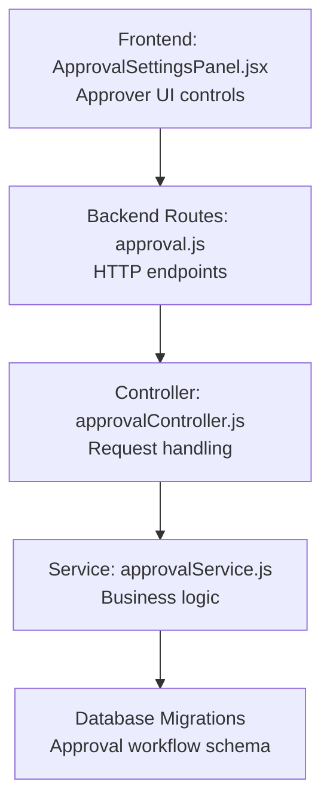
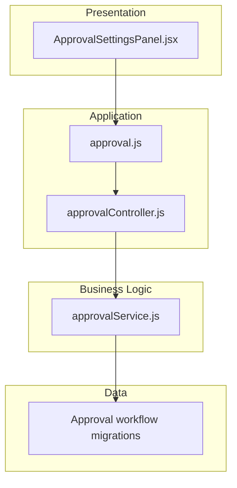
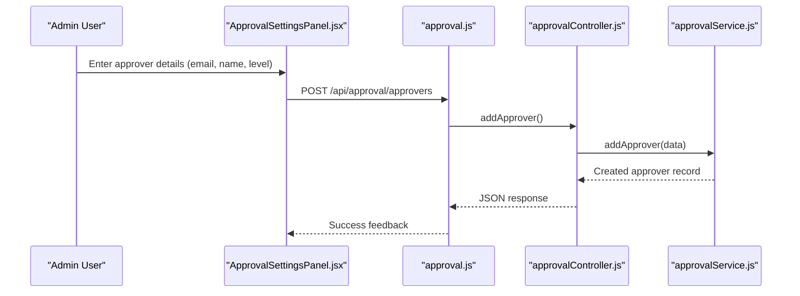
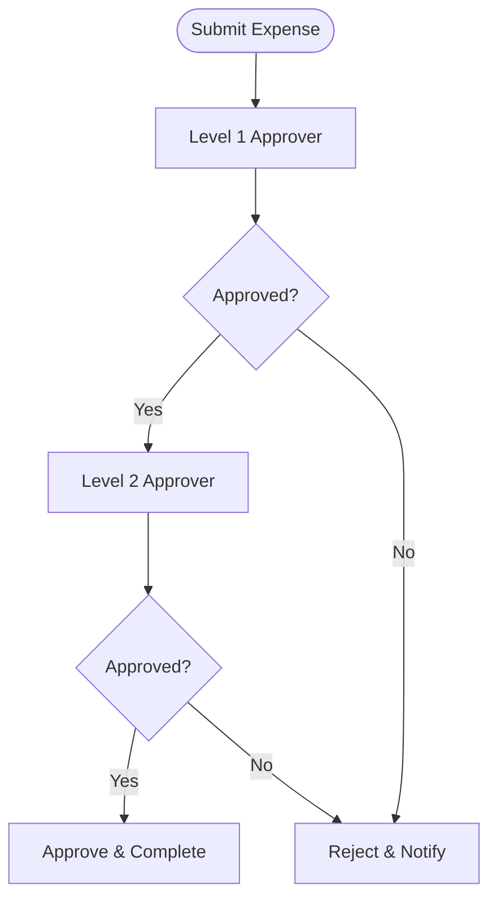
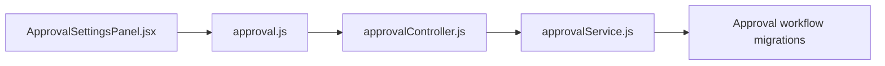

# Approver Management & Administration

<cite>
**Referenced Files in This Document**
- [ApprovalSettingsPanel.jsx](file://frontend/src/components/ApprovalSettingsPanel.jsx)
- [approvalController.js](file://backend/src/controllers/approvalController.js)
- [approvalService.js](file://backend/src/services/approvalService.js)
- [approval.js](file://backend/src/routes/approval.js)
- [20260611000000_add_liquidation_approval_workflow.js](file://backend/src/db/migrations/20260611000000_add_liquidation_approval_workflow.js)
- [20260512000000_initial_schema.js](file://backend/src/db/migrations/20260512000000_initial_schema.js)
- [users.js](file://backend/src/routes/users.js)
- [users.js](file://frontend/src/pages/Users.jsx)
- [departmentController.js](file://backend/src/controllers/departmentController.js)
- [departments.js](file://backend/src/routes/departments.js)
- [Analytics.jsx](file://frontend/src/pages/Analytics.jsx)
- [notificationCenterController.js](file://backend/src/controllers/notificationCenterController.js)
- [notificationCenterController.js](file://backend/src/controllers/notificationCenterController.js)
</cite>

## Table of Contents
1. [Introduction](#introduction)
2. [Project Structure](#project-structure)
3. [Core Components](#core-components)
4. [Architecture Overview](#architecture-overview)
5. [Detailed Component Analysis](#detailed-component-analysis)
6. [Dependency Analysis](#dependency-analysis)
7. [Performance Considerations](#performance-considerations)
8. [Troubleshooting Guide](#troubleshooting-guide)
9. [Conclusion](#conclusion)

## Introduction
This document provides comprehensive guidance for managing and administering approvers within the petty cash system. It covers approver registration, role assignment, approval level configuration, CRUD operations, active status management, hierarchical approver structures, availability tracking, delegation capabilities, temporary assignments, permission matrices, departmental and cross-departmental routing, training requirements, performance metrics, administrative oversight, onboarding procedures, and access control integration. The content is derived from the existing frontend and backend components and database schema present in the repository.

## Project Structure
The approver management functionality spans frontend and backend layers:
- Frontend: An approval settings panel component enables adding and removing approvers with level configuration.
- Backend: Controllers and services manage approval settings and approver lists, while routes expose endpoints for admin operations.
- Database: Migrations define approval workflow structures and initial schema elements.

**Diagram sources**
- [ApprovalSettingsPanel.jsx:184-251](file://frontend/src/components/ApprovalSettingsPanel.jsx#L184-L251)
- [approval.js](file://backend/src/routes/approval.js)
- [approvalController.js:1-39](file://backend/src/controllers/approvalController.js#L1-L39)
- [approvalService.js](file://backend/src/services/approvalService.js)
- [20260611000000_add_liquidation_approval_workflow.js](file://backend/src/db/migrations/20260611000000_add_liquidation_approval_workflow.js)

**Section sources**
- [ApprovalSettingsPanel.jsx:184-251](file://frontend/src/components/ApprovalSettingsPanel.jsx#L184-L251)
- [approvalController.js:1-39](file://backend/src/controllers/approvalController.js#L1-L39)
- [approval.js](file://backend/src/routes/approval.js)

## Core Components
- Approver Registration UI: The frontend component allows administrators to add approvers with email, optional name, and approval level. It supports listing existing approvers and removal via delete actions.
- Approval Settings Controller: Exposes endpoints to fetch and update approval settings, list approvers, and add new approvers with validation for required fields.
- Approval Workflow Schema: Database migrations introduce approval workflow structures supporting multi-level approvals and liquidation processes.

Key implementation references:
- Approver form fields and actions: [ApprovalSettingsPanel.jsx:184-251](file://frontend/src/components/ApprovalSettingsPanel.jsx#L184-L251)
- Settings retrieval and updates: [approvalController.js:3-19](file://backend/src/controllers/approvalController.js#L3-L19)
- Approver listing and creation: [approvalController.js:21-39](file://backend/src/controllers/approvalController.js#L21-L39)
- Approval workflow migration: [20260611000000_add_liquidation_approval_workflow.js](file://backend/src/db/migrations/20260611000000_add_liquidation_approval_workflow.js)
- Initial schema: [20260512000000_initial_schema.js](file://backend/src/db/migrations/20260512000000_initial_schema.js)

**Section sources**
- [ApprovalSettingsPanel.jsx:184-251](file://frontend/src/components/ApprovalSettingsPanel.jsx#L184-L251)
- [approvalController.js:1-39](file://backend/src/controllers/approvalController.js#L1-L39)
- [20260611000000_add_liquidation_approval_workflow.js](file://backend/src/db/migrations/20260611000000_add_liquidation_approval_workflow.js)
- [20260512000000_initial_schema.js](file://backend/src/db/migrations/20260512000000_initial_schema.js)

## Architecture Overview
The approver management architecture follows a layered pattern:
- Presentation Layer: Frontend component captures approver inputs and displays current approvers.
- Application Layer: Controller validates requests and delegates to service layer.
- Business Logic Layer: Service encapsulates approval workflow rules and persistence.
- Data Access Layer: Database migrations define schema for approval settings and multi-level approvers.

**Diagram sources**
- [ApprovalSettingsPanel.jsx:184-251](file://frontend/src/components/ApprovalSettingsPanel.jsx#L184-L251)
- [approval.js](file://backend/src/routes/approval.js)
- [approvalController.js:1-39](file://backend/src/controllers/approvalController.js#L1-L39)
- [approvalService.js](file://backend/src/services/approvalService.js)
- [20260611000000_add_liquidation_approval_workflow.js](file://backend/src/db/migrations/20260611000000_add_liquidation_approval_workflow.js)

## Detailed Component Analysis

### Approver Registration and CRUD Operations
Administrators can register approvers through the frontend panel and perform basic CRUD operations:
- Create: Add approvers with email, optional name, and approval level.
- Read: List current approvers via controller endpoint.
- Update: Modify approval settings and levels.
- Delete: Remove approvers from the system.

**Diagram sources**
- [ApprovalSettingsPanel.jsx:184-251](file://frontend/src/components/ApprovalSettingsPanel.jsx#L184-L251)
- [approval.js](file://backend/src/routes/approval.js)
- [approvalController.js:30-39](file://backend/src/controllers/approvalController.js#L30-L39)
- [approvalService.js](file://backend/src/services/approvalService.js)

Operational details:
- Validation ensures email presence during creation.
- Listing retrieves all configured approvers for administrative review.
- Deletion removes approvers from the system.

**Section sources**
- [approvalController.js:30-39](file://backend/src/controllers/approvalController.js#L30-L39)
- [ApprovalSettingsPanel.jsx:184-251](file://frontend/src/components/ApprovalSettingsPanel.jsx#L184-L251)

### Hierarchical Approver Structures and Approval Levels
The system supports multi-level approval chains:
- Level 1 is designated as primary.
- Additional approvers can be added at higher levels (starting from level 2).
- The approval workflow migration introduces structures enabling multi-level routing.

**Diagram sources**
- [20260611000000_add_liquidation_approval_workflow.js](file://backend/src/db/migrations/20260611000000_add_liquidation_approval_workflow.js)

**Section sources**
- [ApprovalSettingsPanel.jsx:184-251](file://frontend/src/components/ApprovalSettingsPanel.jsx#L184-L251)
- [20260611000000_add_liquidation_approval_workflow.js](file://backend/src/db/migrations/20260611000000_add_liquidation_approval_workflow.js)

### Active Status Management
Active status controls whether an approver can participate in workflows:
- The creation endpoint accepts an active flag to enable/disable participation.
- Administrators can toggle active status via the frontend panel and backend endpoints.

**Section sources**
- [approvalController.js:30-39](file://backend/src/controllers/approvalController.js#L30-L39)

### Departmental and Cross-Departmental Routing
Departmental context influences who receives approval requests:
- Department routes and controllers manage department data.
- Users page provides access to user and role management, which can be leveraged to align approvers with departments.
- Cross-departmental routing can be implemented by configuring approvers at appropriate levels and ensuring users have correct roles.

**Section sources**
- [departmentController.js](file://backend/src/controllers/departmentController.js)
- [departments.js](file://backend/src/routes/departments.js)
- [users.js](file://backend/src/routes/users.js)
- [Users.jsx](file://frontend/src/pages/Users.jsx)

### Delegation and Temporary Assignments
Temporary approver assignments and delegation can be supported by:
- Creating temporary approvers at higher levels when regular approvers are unavailable.
- Using active status toggles to temporarily disable regular approvers and route approvals to alternates.
- Implementing delegation rules at the service layer to redirect approvals when primary approvers are absent.

Note: Specific delegation logic is not present in the current codebase and would require extension of the service layer and UI controls.

### Permission Matrices and Access Control Integration
Access control and permissions:
- Authentication middleware secures admin endpoints.
- Role-based access can be enforced at the controller level to restrict approver management operations.
- Notification center integrates with approval actions to inform stakeholders.

**Section sources**
- [approvalController.js:1-39](file://backend/src/controllers/approvalController.js#L1-L39)
- [notificationCenterController.js](file://backend/src/controllers/notificationCenterController.js)

### Training Requirements and Performance Metrics
Training and oversight:
- Training records and performance metrics are not implemented in the current codebase.
- Recommendation: Integrate training modules and metrics dashboards aligned with the analytics page to track approver performance and compliance.

**Section sources**
- [Analytics.jsx](file://frontend/src/pages/Analytics.jsx)

## Dependency Analysis
Approver management depends on:
- Frontend UI for input capture and display.
- Backend routes and controllers for request handling.
- Service layer for business logic and persistence.
- Database migrations for schema support.

**Diagram sources**
- [ApprovalSettingsPanel.jsx:184-251](file://frontend/src/components/ApprovalSettingsPanel.jsx#L184-L251)
- [approval.js](file://backend/src/routes/approval.js)
- [approvalController.js:1-39](file://backend/src/controllers/approvalController.js#L1-L39)
- [approvalService.js](file://backend/src/services/approvalService.js)
- [20260611000000_add_liquidation_approval_workflow.js](file://backend/src/db/migrations/20260611000000_add_liquidation_approval_workflow.js)

**Section sources**
- [approval.js](file://backend/src/routes/approval.js)
- [approvalController.js:1-39](file://backend/src/controllers/approvalController.js#L1-L39)
- [approvalService.js](file://backend/src/services/approvalService.js)
- [20260611000000_add_liquidation_approval_workflow.js](file://backend/src/db/migrations/20260611000000_add_liquidation_approval_workflow.js)

## Performance Considerations
- Minimize database queries by batching approver updates and caching frequently accessed approval settings.
- Index approval level and active status fields to optimize filtering and sorting in large approver lists.
- Use pagination for approver listings when the dataset grows large.

## Troubleshooting Guide
Common issues and resolutions:
- Missing email during approver creation: The controller validates the presence of email and returns an error if missing. Ensure the frontend captures required fields before submission.
- Approval settings update failures: Verify controller error handling and service transaction boundaries.
- Multi-level approval not functioning: Confirm the approval workflow migration is applied and approvers exist at required levels.

**Section sources**
- [approvalController.js:30-39](file://backend/src/controllers/approvalController.js#L30-L39)
- [20260611000000_add_liquidation_approval_workflow.js](file://backend/src/db/migrations/20260611000000_add_liquidation_approval_workflow.js)

## Conclusion
The petty cash system provides a foundation for approver management with a functional frontend panel, backend controller/service layer, and database schema supporting multi-level approvals. Administrators can register approvers, configure approval levels, manage active status, and leverage departmental contexts for routing. To enhance the system, consider implementing delegation, temporary assignments, training and performance tracking, and expanded permission matrices aligned with access control policies.