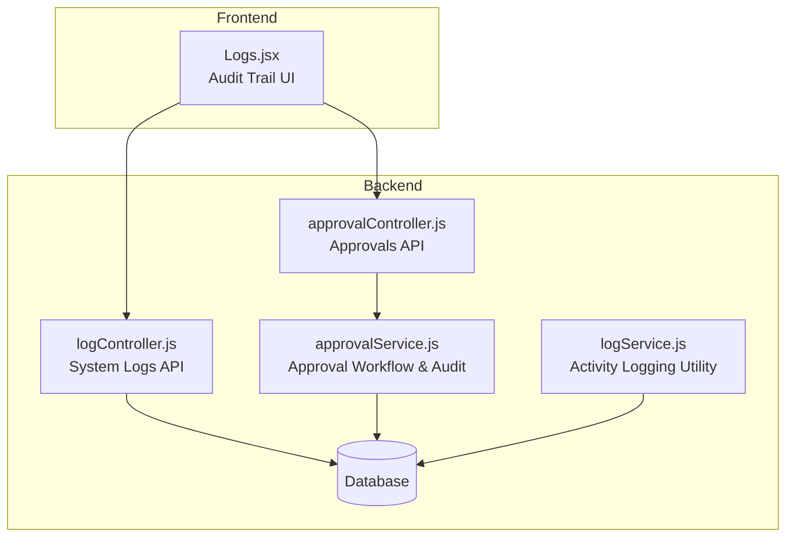
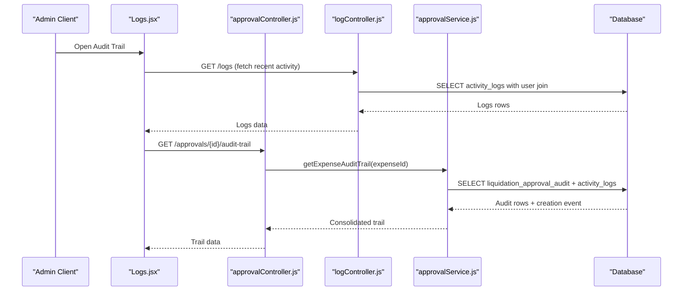
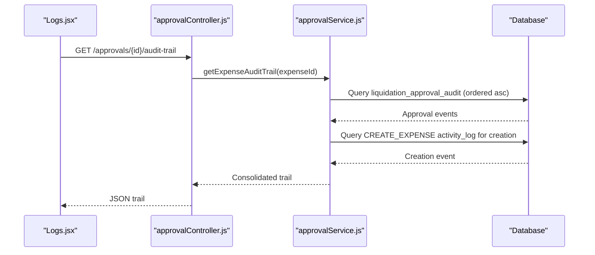
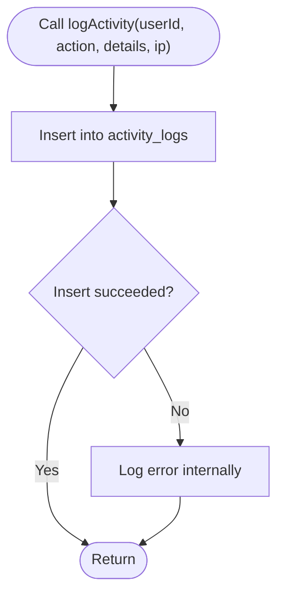
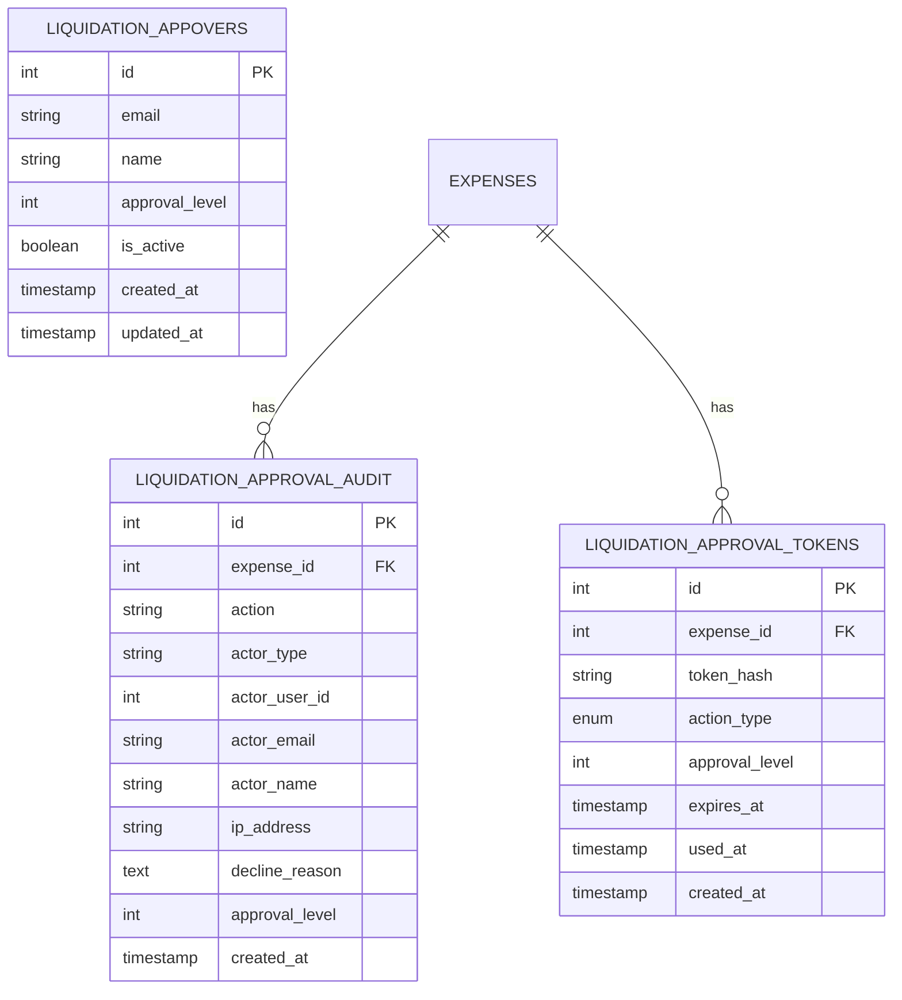
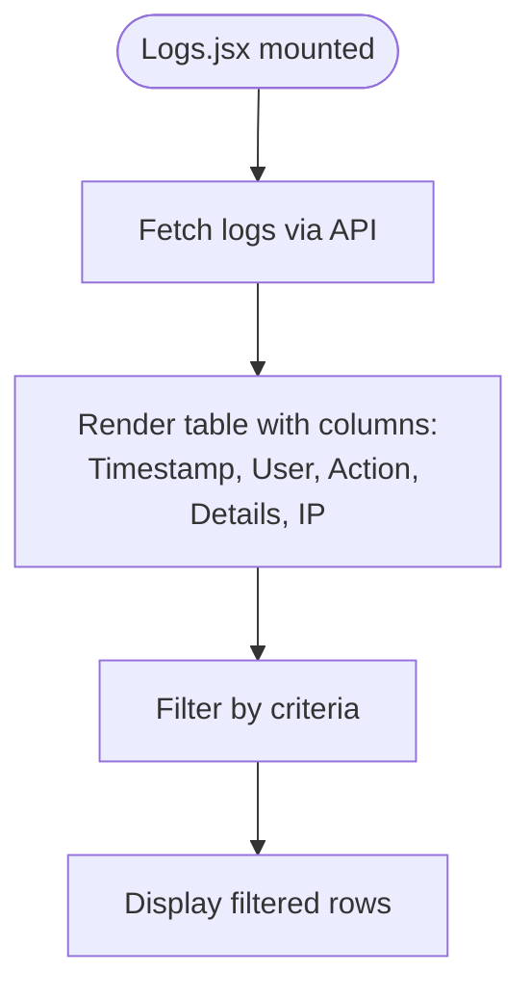
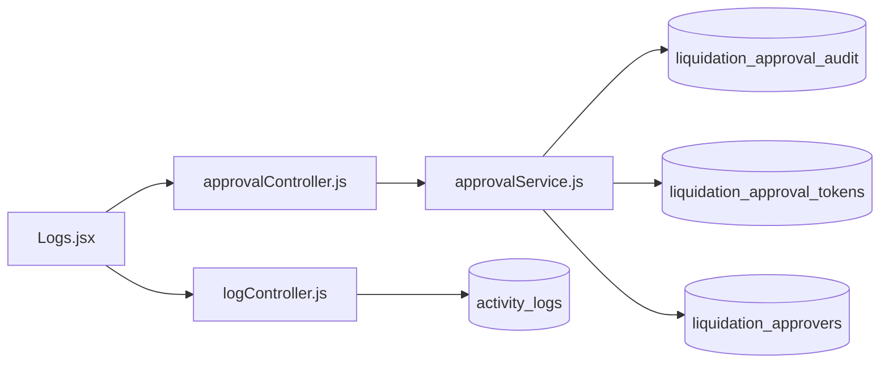

# Audit Trail & Compliance

<cite>
**Referenced Files in This Document**
- [approvalController.js](file://backend/src/controllers/approvalController.js)
- [approvalService.js](file://backend/src/services/approvalService.js)
- [logController.js](file://backend/src/controllers/logController.js)
- [logService.js](file://backend/src/utils/logService.js)
- [20260611000000_add_liquidation_approval_workflow.js](file://backend/src/db/migrations/20260611000000_add_liquidation_approval_workflow.js)
- [approvalSchemaRepair.js](file://backend/src/utils/approvalSchemaRepair.js)
- [Logs.jsx](file://frontend/src/pages/Logs.jsx)
- [emailAutomation.js](file://backend/src/routes/emailAutomation.js)
</cite>

## Table of Contents
1. [Introduction](#introduction)
2. [Project Structure](#project-structure)
3. [Core Components](#core-components)
4. [Architecture Overview](#architecture-overview)
5. [Detailed Component Analysis](#detailed-component-analysis)
6. [Dependency Analysis](#dependency-analysis)
7. [Performance Considerations](#performance-considerations)
8. [Troubleshooting Guide](#troubleshooting-guide)
9. [Conclusion](#conclusion)
10. [Appendices](#appendices)

## Introduction
This document details the audit trail and compliance capabilities implemented in the system. It covers approval history tracking, timestamp recording, and change logging mechanisms. It also explains how to query audit trails, generate compliance reports, fulfill regulatory requirements, log approval decisions with reasons, preserve evidence, export audit data, build compliance dashboards, and integrate with financial auditing systems and internal control frameworks. Data retention, security, and compliance automation are addressed alongside integration touchpoints.

## Project Structure
The audit trail spans backend controllers, services, database migrations, and frontend views:
- Backend controllers expose endpoints for approvals and system logs retrieval.
- Services orchestrate approval workflows and produce consolidated audit trails.
- Migrations define audit-related tables and schema for approval tracking.
- Frontend provides a real-time audit trail view for administrators.

**Diagram sources**
- [approvalController.js:1-120](file://backend/src/controllers/approvalController.js#L1-L120)
- [logController.js:1-20](file://backend/src/controllers/logController.js#L1-L20)
- [approvalService.js:150-220](file://backend/src/services/approvalService.js#L150-L220)
- [logService.js:1-23](file://backend/src/utils/logService.js#L1-L23)
- [Logs.jsx:42-133](file://frontend/src/pages/Logs.jsx#L42-L133)

**Section sources**
- [approvalController.js:1-120](file://backend/src/controllers/approvalController.js#L1-L120)
- [logController.js:1-20](file://backend/src/controllers/logController.js#L1-L20)
- [approvalService.js:150-220](file://backend/src/services/approvalService.js#L150-L220)
- [logService.js:1-23](file://backend/src/utils/logService.js#L1-L23)
- [Logs.jsx:42-133](file://frontend/src/pages/Logs.jsx#L42-L133)

## Core Components
- Approval Audit Trail Endpoint: Retrieves a consolidated history for an expense, combining approval actions and creation events.
- Activity Logging Utility: Centralized mechanism to record user actions with timestamps, actors, and IP addresses.
- Approval Workflow Schema: Defines audit tables, tokens, and approver configurations to support secure, auditable approvals.
- Logs View: Presents system activity logs with filtering and pagination for compliance review.

Key responsibilities:
- Track who performed actions, when, and from where.
- Preserve evidence of approval decisions and reasons.
- Support compliance queries and exports.

**Section sources**
- [approvalController.js:99-107](file://backend/src/controllers/approvalController.js#L99-L107)
- [approvalService.js:161-202](file://backend/src/services/approvalService.js#L161-L202)
- [logService.js:10-21](file://backend/src/utils/logService.js#L10-L21)
- [20260611000000_add_liquidation_approval_workflow.js:47-76](file://backend/src/db/migrations/20260611000000_add_liquidation_approval_workflow.js#L47-L76)
- [Logs.jsx:42-133](file://frontend/src/pages/Logs.jsx#L42-L133)

## Architecture Overview
The audit trail architecture integrates approval decisions, system activity logs, and a unified frontend view.

**Diagram sources**
- [approvalController.js:99-107](file://backend/src/controllers/approvalController.js#L99-L107)
- [logController.js:3-19](file://backend/src/controllers/logController.js#L3-L19)
- [approvalService.js:161-202](file://backend/src/services/approvalService.js#L161-L202)
- [Logs.jsx:42-133](file://frontend/src/pages/Logs.jsx#L42-L133)

## Detailed Component Analysis

### Approval Audit Trail Endpoint
- Purpose: Return a chronological audit trail for a given expense ID.
- Data sources:
  - Approval audit table for approval lifecycle events.
  - System activity logs for creation events.
- Output fields include actor identity, action type, timestamp, IP address, and optional decline reason.

**Diagram sources**
- [approvalController.js:100-107](file://backend/src/controllers/approvalController.js#L100-L107)
- [approvalService.js:161-202](file://backend/src/services/approvalService.js#L161-L202)

**Section sources**
- [approvalController.js:99-107](file://backend/src/controllers/approvalController.js#L99-L107)
- [approvalService.js:161-202](file://backend/src/services/approvalService.js#L161-L202)

### Activity Logging Utility
- Purpose: Standardize logging of user actions with metadata.
- Functionality:
  - Accepts user ID, action type, details payload, and optional IP.
  - Inserts records into the activity logs table with a timestamp.
- Used across the system to capture significant events for compliance.

**Diagram sources**
- [logService.js:10-21](file://backend/src/utils/logService.js#L10-L21)

**Section sources**
- [logService.js:10-21](file://backend/src/utils/logService.js#L10-L21)

### Approval Workflow Schema
- Tables:
  - Approval audit table: stores approval lifecycle events with actor identifiers, IP, optional decline reason, and timestamps.
  - Tokens table: supports secure, time-bound approval links.
  - Approvers table: defines multi-level approvers.
- Migration ensures schema creation and safe rollback handling.

**Diagram sources**
- [20260611000000_add_liquidation_approval_workflow.js:47-76](file://backend/src/db/migrations/20260611000000_add_liquidation_approval_workflow.js#L47-L76)
- [20260611000000_add_liquidation_approval_workflow.js:33-45](file://backend/src/db/migrations/20260611000000_add_liquidation_approval_workflow.js#L33-L45)
- [20260611000000_add_liquidation_approval_workflow.js:29-31](file://backend/src/db/migrations/20260611000000_add_liquidation_approval_workflow.js#L29-L31)

**Section sources**
- [20260611000000_add_liquidation_approval_workflow.js:29-178](file://backend/src/db/migrations/20260611000000_add_liquidation_approval_workflow.js#L29-L178)
- [approvalSchemaRepair.js:32-99](file://backend/src/utils/approvalSchemaRepair.js#L32-L99)

### Logs View (Frontend)
- Purpose: Present system activity logs in a sortable, filterable table with action categorization and counts.
- Features:
  - Real-time loading indicator.
  - Action-based color coding for quick scanning.
  - Pagination and total event count.

**Diagram sources**
- [Logs.jsx:42-133](file://frontend/src/pages/Logs.jsx#L42-L133)

**Section sources**
- [Logs.jsx:42-133](file://frontend/src/pages/Logs.jsx#L42-L133)

### Compliance Reporting and Regulatory Fulfillment
- Evidence Preservation:
  - Approval decisions are recorded with actor identity, IP address, and timestamps.
  - Decline reasons are persisted for transparency and traceability.
- Query Mechanisms:
  - Approvals endpoint returns a chronological trail per expense.
  - System logs endpoint retrieves recent activity for broader compliance checks.
- Export and Dashboards:
  - Frontend displays logs; backend APIs enable export pipelines.
  - Combine approval trails and system logs for comprehensive audit reports.
- Regulatory Alignment:
  - Timestamped, immutable-like records (via audit tables) support SOX-like controls.
  - Secure tokens and IP logging aid in attribution and non-repudiation.

**Section sources**
- [approvalService.js:161-202](file://backend/src/services/approvalService.js#L161-L202)
- [logController.js:3-19](file://backend/src/controllers/logController.js#L3-L19)
- [approvalController.js:99-107](file://backend/src/controllers/approvalController.js#L99-L107)

### Integration Touchpoints
- Financial Auditing Systems:
  - Export endpoints and consolidated trails can feed external systems.
  - Structured fields (actor, action, timestamp, IP, reason) support reconciliation.
- Internal Control Frameworks:
  - Multi-level approvers and secure tokens enforce segregation of duties.
  - Creation and approval events provide sequential control evidence.

**Section sources**
- [20260611000000_add_liquidation_approval_workflow.js:47-76](file://backend/src/db/migrations/20260611000000_add_liquidation_approval_workflow.js#L47-L76)
- [approvalController.js:73-81](file://backend/src/controllers/approvalController.js#L73-L81)

## Dependency Analysis
- Controllers depend on services for business logic.
- Services depend on the database for persistence and joins.
- Frontend depends on controllers for data.
- Approval schema migrations define the contract for audit storage.

**Diagram sources**
- [approvalController.js:1-120](file://backend/src/controllers/approvalController.js#L1-L120)
- [logController.js:1-20](file://backend/src/controllers/logController.js#L1-L20)
- [approvalService.js:150-220](file://backend/src/services/approvalService.js#L150-L220)
- [20260611000000_add_liquidation_approval_workflow.js:47-76](file://backend/src/db/migrations/20260611000000_add_liquidation_approval_workflow.js#L47-L76)

**Section sources**
- [approvalController.js:1-120](file://backend/src/controllers/approvalController.js#L1-L120)
- [logController.js:1-20](file://backend/src/controllers/logController.js#L1-L20)
- [approvalService.js:150-220](file://backend/src/services/approvalService.js#L150-L220)
- [20260611000000_add_liquidation_approval_workflow.js:47-76](file://backend/src/db/migrations/20260611000000_add_liquidation_approval_workflow.js#L47-L76)

## Performance Considerations
- Indexes on expense ID and created_at improve audit trail queries.
- Limiting log fetch sizes prevents memory pressure during compliance reviews.
- Consolidating creation events with approval events reduces round trips.

[No sources needed since this section provides general guidance]

## Troubleshooting Guide
- Empty audit trail:
  - Verify the audit table exists and contains records for the expense ID.
  - Confirm creation event exists in activity logs for the same expense.
- Missing logs:
  - Ensure the activity logging utility is invoked for relevant actions.
  - Check controller endpoints for proper error propagation.
- Token-based approvals:
  - Validate token existence, expiration, and usage status.
  - Confirm approver configuration and multi-level chain.

**Section sources**
- [approvalService.js:161-202](file://backend/src/services/approvalService.js#L161-L202)
- [logService.js:10-21](file://backend/src/utils/logService.js#L10-L21)
- [20260611000000_add_liquidation_approval_workflow.js:33-45](file://backend/src/db/migrations/20260611000000_add_liquidation_approval_workflow.js#L33-L45)

## Conclusion
The system implements a robust audit trail covering approval lifecycle events and system activities. It captures timestamps, actor identities, IP addresses, and reasons for declines, enabling compliance reporting and regulatory alignment. The modular architecture supports export, dashboarding, and integration with financial auditing systems while enforcing internal controls through secure tokens and multi-level approvers.

[No sources needed since this section summarizes without analyzing specific files]

## Appendices

### Audit Trail Queries and Compliance Reporting
- Expense-specific audit trail:
  - Endpoint: Retrieve consolidated trail for an expense ID.
  - Data: Approval actions, creation event, actor, IP, timestamps, and decline reason.
- System-wide logs:
  - Endpoint: Fetch recent activity logs with user and action metadata.
  - Use-case: Cross-check approvals against system events for completeness.

**Section sources**
- [approvalController.js:99-107](file://backend/src/controllers/approvalController.js#L99-L107)
- [logController.js:3-19](file://backend/src/controllers/logController.js#L3-L19)
- [approvalService.js:161-202](file://backend/src/services/approvalService.js#L161-L202)

### Data Retention Policies
- Retention policy definition:
  - Define retention periods for audit tables and logs in settings or configuration.
  - Implement scheduled cleanup jobs to remove expired records.
- Security and Integrity:
  - Maintain immutability of historical records; avoid altering closed periods.
  - Apply access controls and encryption for sensitive audit data.

[No sources needed since this section provides general guidance]

### Audit Trail Security
- Token-based approvals:
  - Use hashed tokens with expiration and single-use semantics.
  - Record IP and timestamps for all token-based actions.
- Access Controls:
  - Restrict audit endpoints to authorized roles (e.g., Super Admin, Accounting).
- Transport and Storage:
  - Enforce HTTPS and secure database connections.
  - Apply database-level access restrictions and audit triggers where applicable.

**Section sources**
- [20260611000000_add_liquidation_approval_workflow.js:33-45](file://backend/src/db/migrations/20260611000000_add_liquidation_approval_workflow.js#L33-L45)
- [emailAutomation.js:1-23](file://backend/src/routes/emailAutomation.js#L1-L23)

### Compliance Automation
- Automated alerts and reminders:
  - Use scheduling and notification systems to maintain control over deadlines.
- Evidence aggregation:
  - Periodic exports of trails and logs for internal and external audits.
- Continuous monitoring:
  - Surface anomalies via dashboards and trigger remediation workflows.

[No sources needed since this section provides general guidance]