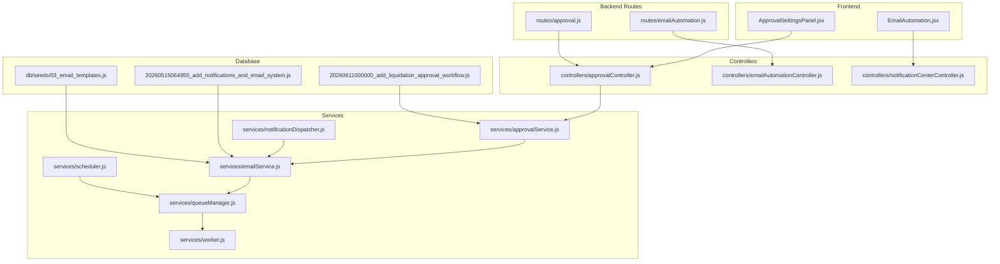
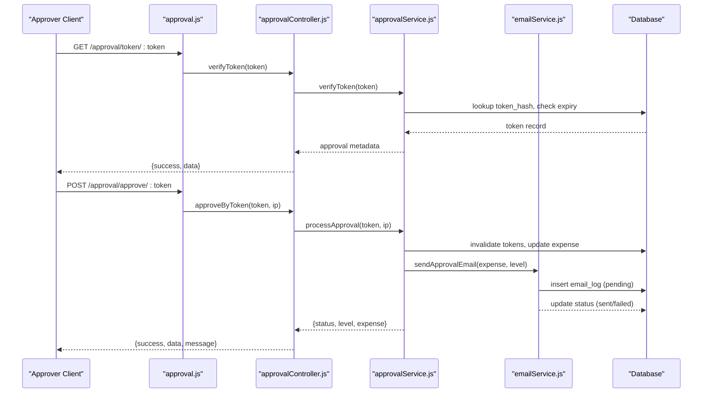
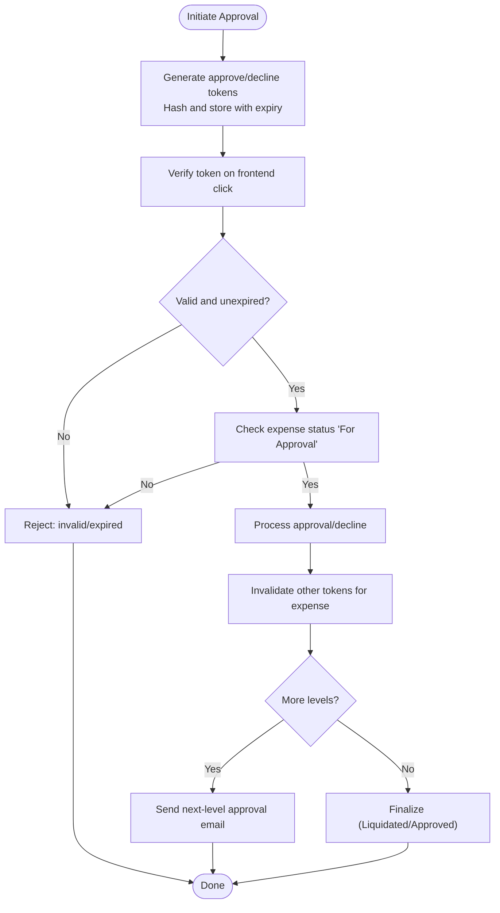
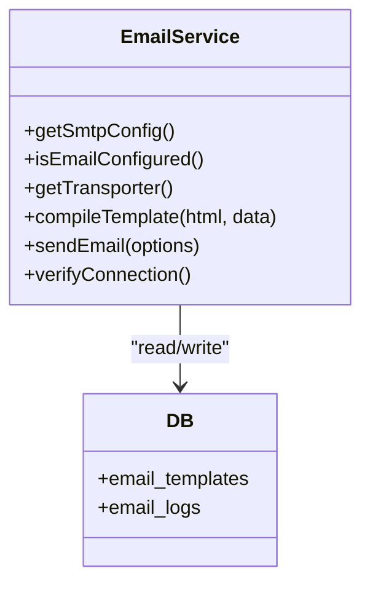
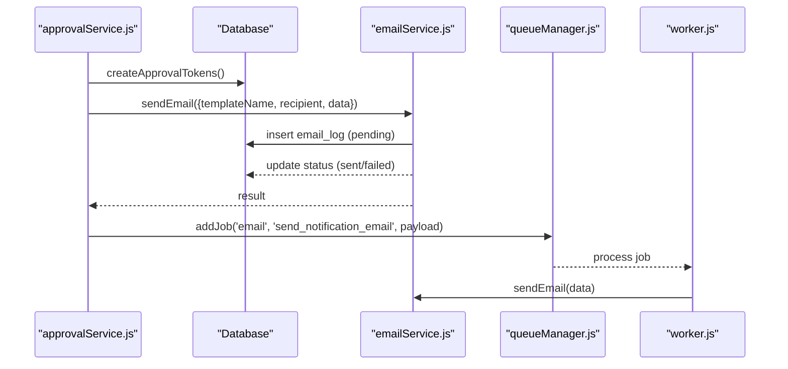
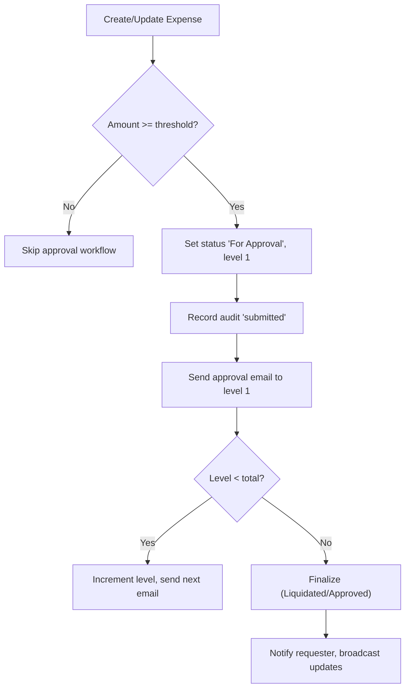
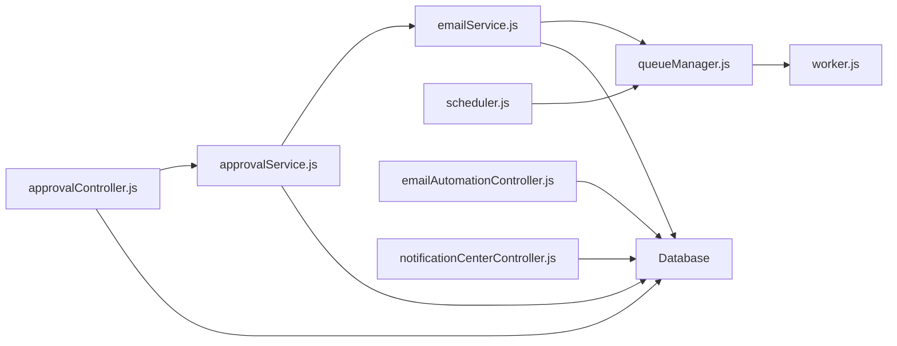

# Email-Based Approval System

<cite>
**Referenced Files in This Document**
- [emailService.js](file://backend/src/services/emailService.js)
- [approvalService.js](file://backend/src/services/approvalService.js)
- [approvalController.js](file://backend/src/controllers/approvalController.js)
- [emailAutomationController.js](file://backend/src/controllers/emailAutomationController.js)
- [notificationCenterController.js](file://backend/src/controllers/notificationCenterController.js)
- [emailAutomation.js](file://backend/src/routes/emailAutomation.js)
- [approval.js](file://backend/src/routes/approval.js)
- [20260515064955_add_notifications_and_email_system.js](file://backend/src/db/migrations/20260515064955_add_notifications_and_email_system.js)
- [20260611000000_add_liquidation_approval_workflow.js](file://backend/src/db/migrations/20260611000000_add_liquidation_approval_workflow.js)
- [03_email_templates.js](file://backend/src/db/seeds/03_email_templates.js)
- [queueManager.js](file://backend/src/services/queueManager.js)
- [scheduler.js](file://backend/src/services/scheduler.js)
- [worker.js](file://backend/src/services/worker.js)
- [logService.js](file://backend/src/utils/logService.js)
- [EmailAutomation.jsx](file://frontend/src/pages/EmailAutomation.jsx)
- [ApprovalSettingsPanel.jsx](file://frontend/src/components/ApprovalSettingsPanel.jsx)
</cite>

## Table of Contents
1. [Introduction](#introduction)
2. [Project Structure](#project-structure)
3. [Core Components](#core-components)
4. [Architecture Overview](#architecture-overview)
5. [Detailed Component Analysis](#detailed-component-analysis)
6. [Dependency Analysis](#dependency-analysis)
7. [Performance Considerations](#performance-considerations)
8. [Troubleshooting Guide](#troubleshooting-guide)
9. [Conclusion](#conclusion)

## Introduction
This document describes the email-based approval system that enables secure, token-driven approvals for high-value petty cash liquidations. It covers token-based security, email template generation, automated email triggers, approval workflows, SMTP integration, and audit logging. The system supports multi-level approvals, configurable thresholds, and comprehensive tracking of email deliveries and user actions.

## Project Structure
The system spans backend services, database migrations and seeds, frontend pages, and supporting infrastructure for queuing, scheduling, and notifications.

**Diagram sources**
- [approval.js:1-36](file://backend/src/routes/approval.js#L1-L36)
- [emailAutomation.js:1-24](file://backend/src/routes/emailAutomation.js#L1-L24)
- [approvalController.js:1-108](file://backend/src/controllers/approvalController.js#L1-L108)
- [emailAutomationController.js:1-78](file://backend/src/controllers/emailAutomationController.js#L1-L78)
- [approvalService.js:1-590](file://backend/src/services/approvalService.js#L1-L590)
- [emailService.js:1-122](file://backend/src/services/emailService.js#L1-L122)
- [queueManager.js:1-126](file://backend/src/services/queueManager.js#L1-L126)
- [scheduler.js:1-155](file://backend/src/services/scheduler.js#L1-L155)
- [worker.js:1-43](file://backend/src/services/worker.js#L1-L43)
- [20260515064955_add_notifications_and_email_system.js:1-110](file://backend/src/db/migrations/20260515064955_add_notifications_and_email_system.js#L1-L110)
- [20260611000000_add_liquidation_approval_workflow.js:1-179](file://backend/src/db/migrations/20260611000000_add_liquidation_approval_workflow.js#L1-L179)
- [03_email_templates.js:1-111](file://backend/src/db/seeds/03_email_templates.js#L1-L111)

**Section sources**
- [approval.js:1-36](file://backend/src/routes/approval.js#L1-L36)
- [emailAutomation.js:1-24](file://backend/src/routes/emailAutomation.js#L1-L24)
- [approvalController.js:1-108](file://backend/src/controllers/approvalController.js#L1-L108)
- [emailAutomationController.js:1-78](file://backend/src/controllers/emailAutomationController.js#L1-L78)
- [approvalService.js:1-590](file://backend/src/services/approvalService.js#L1-L590)
- [emailService.js:1-122](file://backend/src/services/emailService.js#L1-L122)
- [queueManager.js:1-126](file://backend/src/services/queueManager.js#L1-L126)
- [scheduler.js:1-155](file://backend/src/services/scheduler.js#L1-L155)
- [worker.js:1-43](file://backend/src/services/worker.js#L1-L43)
- [20260515064955_add_notifications_and_email_system.js:1-110](file://backend/src/db/migrations/20260515064955_add_notifications_and_email_system.js#L1-L110)
- [20260611000000_add_liquidation_approval_workflow.js:1-179](file://backend/src/db/migrations/20260611000000_add_liquidation_approval_workflow.js#L1-L179)
- [03_email_templates.js:1-111](file://backend/src/db/seeds/03_email_templates.js#L1-L111)

## Core Components
- Token-based approval workflow: Generates secure tokens per approval/decline action, stores hashed tokens, enforces expiration, and validates tokens during verification and processing.
- Email service: Manages SMTP configuration, compiles templates with dynamic data, sends emails, tracks delivery status, and records logs.
- Approval service: Orchestrates approval initiation, multi-level routing, requester notifications, audit trails, and integration with email service.
- Frontend components: Provide admin panels to configure thresholds, manage approvers, and monitor email automation and logs.
- Queue and scheduler: Asynchronous processing via BullMQ with Redis fallback, and cron-based scheduling for recurring tasks.

**Section sources**
- [approvalService.js:7-250](file://backend/src/services/approvalService.js#L7-L250)
- [emailService.js:4-122](file://backend/src/services/emailService.js#L4-L122)
- [approvalController.js:61-98](file://backend/src/controllers/approvalController.js#L61-L98)
- [EmailAutomation.jsx:1-800](file://frontend/src/pages/EmailAutomation.jsx#L1-L800)
- [ApprovalSettingsPanel.jsx:1-252](file://frontend/src/components/ApprovalSettingsPanel.jsx#L1-L252)
- [queueManager.js:1-126](file://backend/src/services/queueManager.js#L1-L126)
- [scheduler.js:1-155](file://backend/src/services/scheduler.js#L1-L155)

## Architecture Overview
The system integrates frontend UI, backend routes, controllers, services, and database layers. Tokens are generated and validated without requiring user authentication, while email delivery is queued and tracked asynchronously.

**Diagram sources**
- [approval.js:17-20](file://backend/src/routes/approval.js#L17-L20)
- [approvalController.js:61-98](file://backend/src/controllers/approvalController.js#L61-L98)
- [approvalService.js:398-509](file://backend/src/services/approvalService.js#L398-L509)
- [emailService.js:41-103](file://backend/src/services/emailService.js#L41-L103)

## Detailed Component Analysis

### Token-Based Security Mechanisms
- Token generation: Random hex tokens are generated and stored as SHA-256 hashes to prevent plaintext exposure.
- Expiration: Tokens expire after seven days; queries enforce unused and unexpired conditions.
- Validation: Verification checks token hash, used_at null, and expiry; ensures expense status remains "For Approval".
- Multi-level support: Each approval level generates separate approve/decline token pairs.

**Diagram sources**
- [approvalService.js:223-250](file://backend/src/services/approvalService.js#L223-L250)
- [approvalService.js:387-425](file://backend/src/services/approvalService.js#L387-L425)
- [approvalService.js:427-509](file://backend/src/services/approvalService.js#L427-L509)

**Section sources**
- [approvalService.js:7-12](file://backend/src/services/approvalService.js#L7-L12)
- [approvalService.js:223-250](file://backend/src/services/approvalService.js#L223-L250)
- [approvalService.js:387-425](file://backend/src/services/approvalService.js#L387-L425)
- [approvalService.js:427-509](file://backend/src/services/approvalService.js#L427-L509)

### Email Template Generation and Delivery
- Template engine: Templates are stored with placeholders; compilation replaces keys with provided data.
- Dynamic content: Templates include approval/decline links, expense details, and branding.
- SMTP integration: Configurable via environment variables; connection verification supported.
- Delivery tracking: Logs record pending/sent/failed states, timestamps, and errors.
- Attachments: Optional structured attachments passed through to the transport layer.

**Diagram sources**
- [emailService.js:4-122](file://backend/src/services/emailService.js#L4-L122)
- [20260515064955_add_notifications_and_email_system.js:2-29](file://backend/src/db/migrations/20260515064955_add_notifications_and_email_system.js#L2-L29)

**Section sources**
- [emailService.js:32-103](file://backend/src/services/emailService.js#L32-L103)
- [03_email_templates.js:40-111](file://backend/src/db/seeds/03_email_templates.js#L40-L111)
- [20260515064955_add_notifications_and_email_system.js:2-29](file://backend/src/db/migrations/20260515064955_add_notifications_and_email_system.js#L2-L29)

### Automated Email Triggers and Workflows
- Liquidation approval emails: Sent when expenses exceed threshold; includes approve/decline links.
- Requester notifications: Automatic emails upon final approval or decline with contextual details.
- Queue-based delivery: Uses BullMQ workers with Redis fallback; scheduled tasks processed by cron.
- Notification center: Admin panel to manage templates, schedules, and track sent notifications.

**Diagram sources**
- [approvalService.js:252-290](file://backend/src/services/approvalService.js#L252-L290)
- [emailService.js:41-103](file://backend/src/services/emailService.js#L41-L103)
- [queueManager.js:61-85](file://backend/src/services/queueManager.js#L61-L85)
- [worker.js:5-20](file://backend/src/services/worker.js#L5-L20)

**Section sources**
- [approvalService.js:252-290](file://backend/src/services/approvalService.js#L252-L290)
- [emailService.js:41-103](file://backend/src/services/emailService.js#L41-L103)
- [queueManager.js:61-85](file://backend/src/services/queueManager.js#L61-L85)
- [worker.js:5-20](file://backend/src/services/worker.js#L5-L20)
- [scheduler.js:42-147](file://backend/src/services/scheduler.js#L42-L147)

### Approval Workflow Orchestration
- Threshold-based gating: Expenses above configured amount initiate multi-level approval.
- Multi-level routing: Determines next approver by approval level; escalates until final approval.
- Audit logging: Records submissions, approvals, declines, and IP addresses for compliance.
- Real-time updates: WebSocket broadcasts reflect status changes.

**Diagram sources**
- [approvalService.js:292-355](file://backend/src/services/approvalService.js#L292-L355)
- [approvalService.js:427-509](file://backend/src/services/approvalService.js#L427-L509)

**Section sources**
- [approvalService.js:292-355](file://backend/src/services/approvalService.js#L292-L355)
- [approvalService.js:427-509](file://backend/src/services/approvalService.js#L427-L509)

### Frontend Administration and Monitoring
- Email Automation page: Templates, schedules, and sent history analytics for admin oversight.
- Approval settings panel: Configure thresholds, enable/disable email approvals, and manage approvers.

**Section sources**
- [EmailAutomation.jsx:1-800](file://frontend/src/pages/EmailAutomation.jsx#L1-L800)
- [ApprovalSettingsPanel.jsx:1-252](file://frontend/src/components/ApprovalSettingsPanel.jsx#L1-L252)

## Dependency Analysis
The approval system relies on several interconnected modules:

**Diagram sources**
- [approvalController.js:1-108](file://backend/src/controllers/approvalController.js#L1-L108)
- [approvalService.js:1-590](file://backend/src/services/approvalService.js#L1-L590)
- [emailService.js:1-122](file://backend/src/services/emailService.js#L1-L122)
- [queueManager.js:1-126](file://backend/src/services/queueManager.js#L1-L126)
- [worker.js:1-43](file://backend/src/services/worker.js#L1-L43)
- [scheduler.js:1-155](file://backend/src/services/scheduler.js#L1-L155)
- [emailAutomationController.js:1-78](file://backend/src/controllers/emailAutomationController.js#L1-L78)
- [notificationCenterController.js:1-370](file://backend/src/controllers/notificationCenterController.js#L1-L370)

**Section sources**
- [approvalController.js:1-108](file://backend/src/controllers/approvalController.js#L1-L108)
- [approvalService.js:1-590](file://backend/src/services/approvalService.js#L1-L590)
- [emailService.js:1-122](file://backend/src/services/emailService.js#L1-L122)
- [queueManager.js:1-126](file://backend/src/services/queueManager.js#L1-L126)
- [worker.js:1-43](file://backend/src/services/worker.js#L1-L43)
- [scheduler.js:1-155](file://backend/src/services/scheduler.js#L1-L155)
- [emailAutomationController.js:1-78](file://backend/src/controllers/emailAutomationController.js#L1-L78)
- [notificationCenterController.js:1-370](file://backend/src/controllers/notificationCenterController.js#L1-L370)

## Performance Considerations
- Asynchronous processing: Email sending is queued to avoid blocking requests; BullMQ workers process jobs efficiently with exponential backoff.
- Redis fallback: When Redis is unavailable, the system falls back to database polling for job processing, ensuring resilience.
- Template compilation: Placeholders are replaced synchronously; keep templates concise to minimize overhead.
- Database indexing: Tokens and audit tables include strategic indexes to optimize lookups and writes.

[No sources needed since this section provides general guidance]

## Troubleshooting Guide
Common issues and resolutions:
- SMTP not configured: Sending emails returns a skipped status; verify environment variables for host, port, user, and pass.
- Template not found: Compilation fails if the named template does not exist; confirm seed installation and template names.
- Invalid or expired token: Verification returns null; ensure links are used within seven days and not previously used.
- Email delivery failures: Check email_logs for error messages and retry counts; inspect SMTP credentials and network connectivity.
- Redis connectivity: If Redis is down, the system automatically switches to database-backed queue processing; monitor logs for fallback warnings.

**Section sources**
- [emailService.js:41-103](file://backend/src/services/emailService.js#L41-L103)
- [approvalService.js:398-425](file://backend/src/services/approvalService.js#L398-L425)
- [queueManager.js:9-52](file://backend/src/services/queueManager.js#L9-L52)

## Conclusion
The email-based approval system provides a secure, scalable, and auditable mechanism for managing high-value petty cash liquidations. Through token-based security, robust email templating, asynchronous delivery, and comprehensive monitoring, it ensures reliable approvals with strong governance and compliance capabilities.