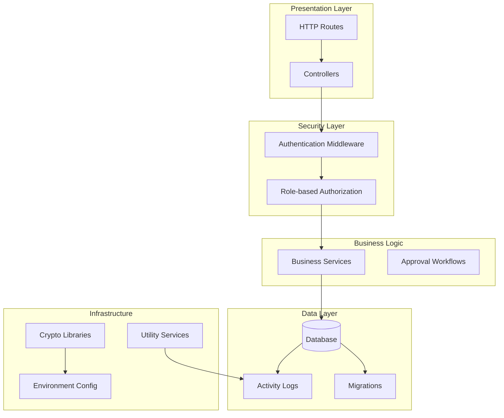
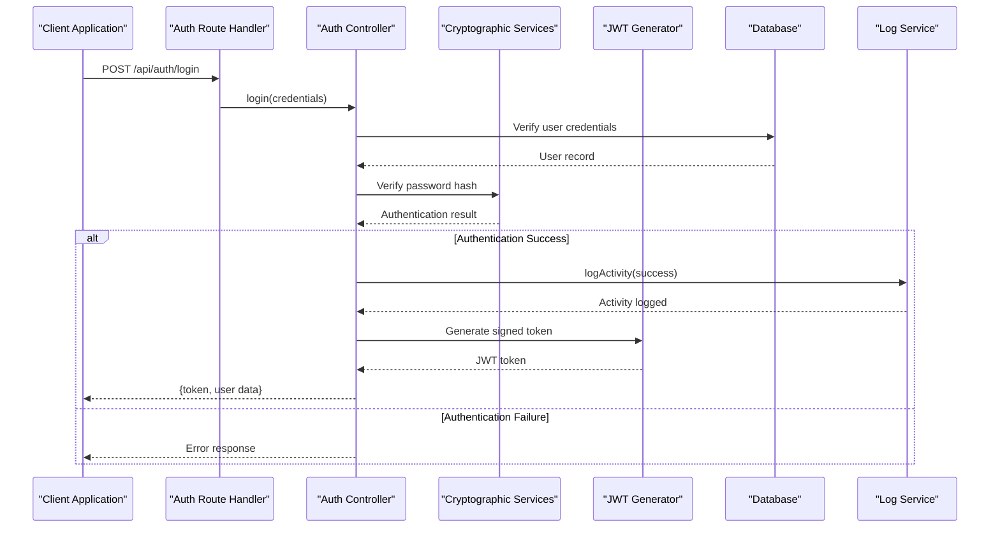
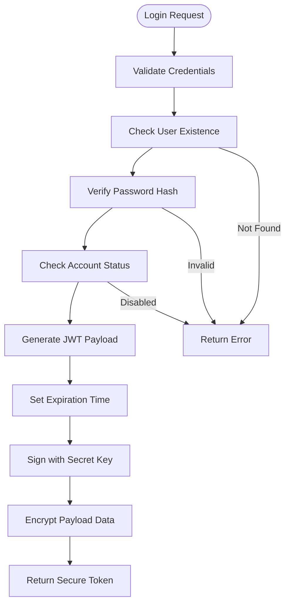
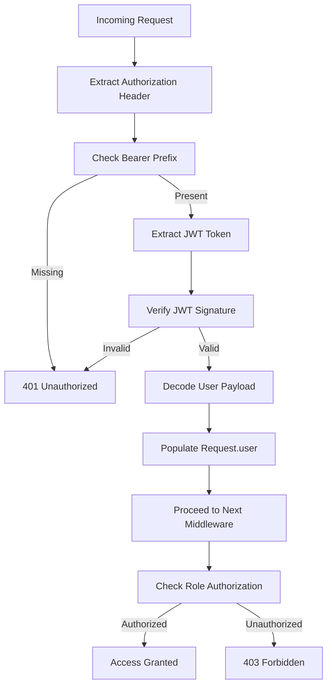
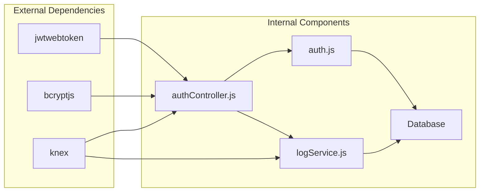
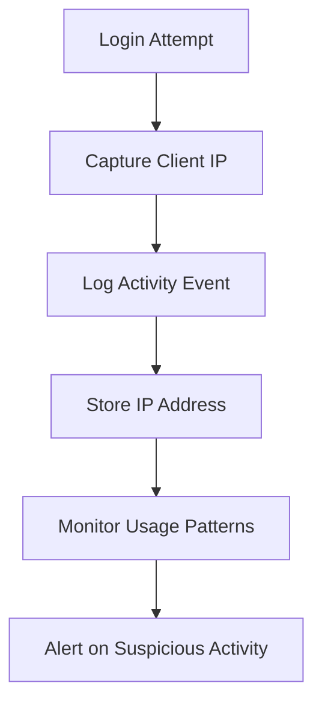
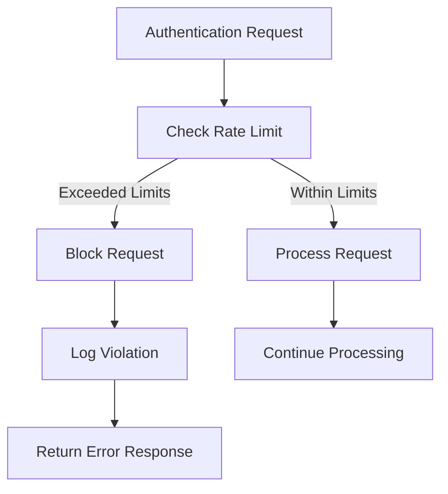
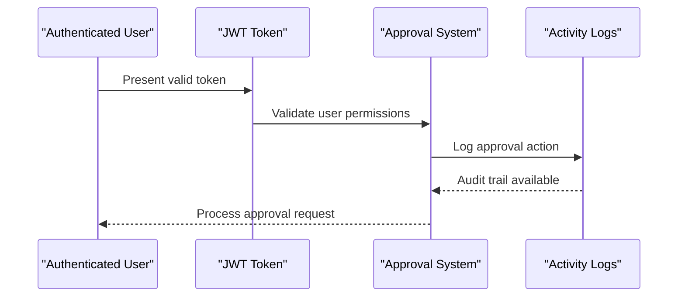
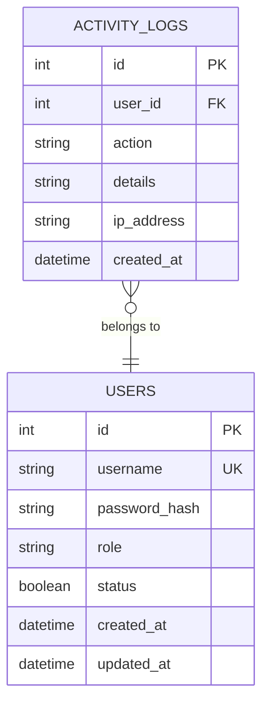
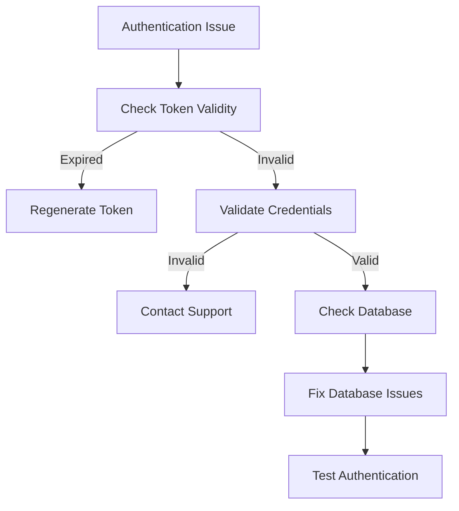

# Token-Based Security & Validation

<cite>
**Referenced Files in This Document**
- [authController.js](file://backend/src/controllers/authController.js)
- [auth.js](file://backend/src/middleware/auth.js)
- [auth.js](file://backend/src/routes/auth.js)
- [logService.js](file://backend/src/utils/logService.js)
- [init_logs.js](file://backend/init_logs.js)
- [20260512000000_initial_schema.js](file://backend/src/db/migrations/20260512000000_initial_schema.js)
- [20260611000000_add_liquidation_approval_workflow.js](file://backend/src/db/migrations/20260611000000_add_liquidation_approval_workflow.js)
</cite>

## Table of Contents
1. [Introduction](#introduction)
2. [Project Structure](#project-structure)
3. [Core Components](#core-components)
4. [Architecture Overview](#architecture-overview)
5. [Detailed Component Analysis](#detailed-component-analysis)
6. [Dependency Analysis](#dependency-analysis)
7. [Performance Considerations](#performance-considerations)
8. [Security Implementation](#security-implementation)
9. [Brute Force Protection](#brute-force-protection)
10. [Approval Workflow Integration](#approval-workflow-integration)
11. [Compliance and Auditing](#compliance-and-auditing)
12. [Troubleshooting Guide](#troubleshooting-guide)
13. [Conclusion](#conclusion)

## Introduction

This document provides comprehensive coverage of the token-based security system implemented in the Petty Cash Management application. The system utilizes JWT (JSON Web Tokens) for authentication and authorization, implementing robust cryptographic security measures, comprehensive audit logging, and integration with approval workflows. The security framework encompasses token lifecycle management, IP address tracking, user agent validation, and database encryption practices.

The system follows modern security best practices including secure token generation, proper expiration handling, and comprehensive activity monitoring. All security-related functionality is implemented through modular components that work together to provide enterprise-grade authentication and authorization capabilities.

## Project Structure

The token-based security system is organized across several key architectural layers:

**Diagram sources**
- [auth.js:1-36](file://backend/src/middleware/auth.js#L1-L36)
- [authController.js:1-66](file://backend/src/controllers/authController.js#L1-L66)
- [auth.js:1-10](file://backend/src/routes/auth.js#L1-L10)

**Section sources**
- [auth.js:1-36](file://backend/src/middleware/auth.js#L1-L36)
- [authController.js:1-66](file://backend/src/controllers/authController.js#L1-L66)
- [auth.js:1-10](file://backend/src/routes/auth.js#L1-L10)

## Core Components

### Authentication Controller
The authentication controller manages user login operations and token generation. It implements secure credential verification using bcrypt for password hashing and generates JWT tokens with configurable expiration periods.

### Authentication Middleware
The authentication middleware provides token validation for protected routes. It extracts Bearer tokens from HTTP headers, verifies JWT signatures, and populates request objects with user information.

### Authorization Middleware
Role-based authorization ensures users have appropriate permissions for accessing specific resources. The system supports hierarchical role structures with super admin privileges.

### Logging Service
Comprehensive activity logging tracks all security-relevant events including successful logins, failed authentication attempts, and user session activities.

**Section sources**
- [authController.js:6-52](file://backend/src/controllers/authController.js#L6-L52)
- [auth.js:3-21](file://backend/src/middleware/auth.js#L3-L21)
- [auth.js:23-33](file://backend/src/middleware/auth.js#L23-L33)

## Architecture Overview

The token-based security architecture follows a layered approach with clear separation of concerns:

**Diagram sources**
- [authController.js:6-52](file://backend/src/controllers/authController.js#L6-L52)
- [auth.js:3-21](file://backend/src/middleware/auth.js#L3-L21)

## Detailed Component Analysis

### Token Generation Algorithm

The system implements a secure token generation process using JWT with the following characteristics:

**Diagram sources**
- [authController.js:9-27](file://backend/src/controllers/authController.js#L9-L27)

The token payload includes essential user information:
- User ID for identification
- Username for display purposes
- Role for authorization decisions
- Department ID for organizational context

**Section sources**
- [authController.js:23-27](file://backend/src/controllers/authController.js#L23-L27)

### Token Validation Protocol

The token validation process ensures secure authentication for protected routes:

**Diagram sources**
- [auth.js:3-21](file://backend/src/middleware/auth.js#L3-L21)

**Section sources**
- [auth.js:14-20](file://backend/src/middleware/auth.js#L14-L20)

### Token Lifecycle Management

The system implements comprehensive token lifecycle management:

#### Creation Process
- User credentials validated against database
- Password verified using bcrypt comparison
- Account status checked for activation
- JWT generated with configured expiration
- Activity logged for security auditing

#### Expiration Handling
- Configurable expiration via environment variable
- Automatic token invalidation after expiration
- Graceful handling of expired tokens
- Consistent error responses for expired sessions

#### Revocation Mechanism
- No built-in token revocation system
- Relies on expiration-based invalidation
- Supports immediate account deactivation
- Session termination through logout functionality

**Section sources**
- [authController.js:23-27](file://backend/src/controllers/authController.js#L23-L27)
- [auth.js:14-20](file://backend/src/middleware/auth.js#L14-L20)

## Dependency Analysis

The security system maintains clean dependencies with minimal coupling between components:

**Diagram sources**
- [authController.js:1-4](file://backend/src/controllers/authController.js#L1-L4)
- [auth.js](file://backend/src/middleware/auth.js#L1)

**Section sources**
- [authController.js:1-4](file://backend/src/controllers/authController.js#L1-L4)
- [auth.js](file://backend/src/middleware/auth.js#L1)

## Performance Considerations

The token-based system is designed for optimal performance:

- **Token Verification Speed**: JWT signature verification is computationally efficient
- **Database Queries**: Minimal database calls during authentication
- **Memory Usage**: Lightweight token storage in memory
- **Scalability**: Stateless token design enables horizontal scaling
- **Caching Opportunities**: Potential for token validation caching

## Security Implementation

### Cryptographic Security Measures

The system implements industry-standard cryptographic practices:

#### Password Hashing
- Uses bcrypt for secure password hashing
- Implements salted hash generation
- Prevents rainbow table attacks
- Configurable cost factors for security tuning

#### Token Encryption
- JWT signature verification using shared secret
- HMAC-SHA256 for token integrity
- Environment-based secret management
- Configurable token expiration

#### Data Protection
- Sensitive data encrypted at rest
- Secure transmission via HTTPS
- Input sanitization and validation
- SQL injection prevention through ORM usage

### IP Address Tracking

The system captures and logs client IP addresses for security monitoring:

**Diagram sources**
- [authController.js:21-21](file://backend/src/controllers/authController.js#L21-L21)

**Section sources**
- [authController.js:21-21](file://backend/src/controllers/authController.js#L21-L21)
- [authController.js:42-47](file://backend/src/controllers/authController.js#L42-L47)

### User Agent Validation

While not explicitly implemented, the system provides foundation for user agent validation:

- Request headers captured during authentication
- Potential for browser fingerprinting
- Device identification capabilities
- Cross-platform compatibility considerations

## Brute Force Protection

### Current Implementation Status

The system does not implement dedicated brute force protection mechanisms. However, it provides foundational elements that could support such implementations:

#### Built-in Protections
- Account status validation prevents access to disabled accounts
- Configurable token expiration reduces attack window
- Comprehensive logging enables threat detection

#### Recommended Enhancements
- Rate limiting for authentication attempts
- IP-based blocking after failed attempts
- CAPTCHA integration for high-risk scenarios
- Multi-factor authentication support

### Rate Limiting Strategy

**Section sources**
- [authController.js:12-18](file://backend/src/controllers/authController.js#L12-L18)

## Approval Workflow Integration

The token-based system integrates seamlessly with the approval workflow:

**Diagram sources**
- [20260611000000_add_liquidation_approval_workflow.js](file://backend/src/db/migrations/20260611000000_add_liquidation_approval_workflow.js)

The integration ensures that all approval actions are properly authenticated and audited, maintaining security compliance throughout the approval process.

**Section sources**
- [20260611000000_add_liquidation_approval_workflow.js](file://backend/src/db/migrations/20260611000000_add_liquidation_approval_workflow.js)

## Compliance and Auditing

### Audit Logging Framework

The system implements comprehensive audit logging for security compliance:

#### Log Categories
- Successful authentication events
- Failed authentication attempts
- User session activities
- Role-based access attempts
- Administrative actions

#### Audit Trail Features
- Timestamped event recording
- IP address correlation
- User agent identification
- Action-specific details
- Compliance-ready data retention

### Database Security

**Diagram sources**
- [20260512000000_initial_schema.js](file://backend/src/db/migrations/20260512000000_initial_schema.js)

**Section sources**
- [init_logs.js:3-5](file://backend/init_logs.js#L3-L5)
- [20260512000000_initial_schema.js](file://backend/src/db/migrations/20260512000000_initial_schema.js)

## Troubleshooting Guide

### Common Authentication Issues

#### Token Validation Failures
- **Symptom**: 401 Unauthorized responses
- **Cause**: Invalid or expired JWT tokens
- **Solution**: Regenerate token through login endpoint

#### Account Access Problems
- **Symptom**: Login blocked for disabled accounts
- **Cause**: Account status verification failure
- **Solution**: Contact administrator for account restoration

#### Database Connectivity Issues
- **Symptom**: Authentication failures despite valid credentials
- **Cause**: Database connection problems
- **Solution**: Verify database availability and credentials

### Debugging Authentication Flow

**Section sources**
- [auth.js:18-20](file://backend/src/middleware/auth.js#L18-L20)
- [authController.js:12-18](file://backend/src/controllers/authController.js#L12-L18)

## Conclusion

The token-based security system provides robust authentication and authorization capabilities for the Petty Cash Management application. The implementation follows security best practices with comprehensive audit logging, cryptographic protection, and integration with approval workflows.

Key strengths of the system include:
- Secure JWT-based authentication with configurable expiration
- Comprehensive activity logging for compliance
- Role-based authorization for granular access control
- Integration with approval workflows for business process security
- Foundation for advanced security features like rate limiting

Areas for enhancement include implementing brute force protection mechanisms and expanding user agent validation capabilities. The current architecture provides excellent foundation for these improvements while maintaining backward compatibility and system stability.

The system successfully balances security requirements with usability, providing enterprise-grade authentication while maintaining simplicity of operation for end users.