# Workflow Core Logic

<cite>
**Referenced Files in This Document**
- [approvalController.js](file://backend/src/controllers/approvalController.js)
- [approvalService.js](file://backend/src/services/approvalService.js)
- [approval.js](file://backend/src/routes/approval.js)
- [expenseController.js](file://backend/src/controllers/expenseController.js)
- [20260611000000_add_liquidation_approval_workflow.js](file://backend/src/db/migrations/20260611000000_add_liquidation_approval_workflow.js)
- [ApprovalSettingsPanel.jsx](file://frontend/src/components/ApprovalSettingsPanel.jsx)
</cite>

## Table of Contents
1. [Introduction](#introduction)
2. [Project Structure](#project-structure)
3. [Core Components](#core-components)
4. [Architecture Overview](#architecture-overview)
5. [Detailed Component Analysis](#detailed-component-analysis)
6. [Dependency Analysis](#dependency-analysis)
7. [Performance Considerations](#performance-considerations)
8. [Troubleshooting Guide](#troubleshooting-guide)
9. [Conclusion](#conclusion)

## Introduction
This document explains the core approval workflow logic for petty cash liquidation. It covers threshold-based approval detection, approval routing across multiple levels, escalation via email tokens, and workflow state management. It also documents the approval service implementation, integration with the expense management system, and the approval controller endpoints for settings, approver administration, and workflow operations.

## Project Structure
The approval workflow spans backend controllers, services, and routes, with database-backed persistence for settings, approvers, tokens, audit trails, and expense statuses. Frontend components support configuration of approvers and thresholds.

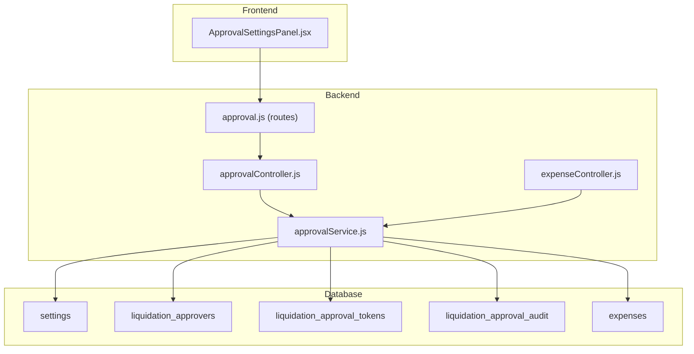

**Diagram sources**
- [approval.js:1-36](file://backend/src/routes/approval.js#L1-L36)
- [approvalController.js:1-108](file://backend/src/controllers/approvalController.js#L1-L108)
- [approvalService.js:1-590](file://backend/src/services/approvalService.js#L1-L590)
- [expenseController.js:158-335](file://backend/src/controllers/expenseController.js#L158-L335)
- [20260611000000_add_liquidation_approval_workflow.js:121-150](file://backend/src/db/migrations/20260611000000_add_liquidation_approval_workflow.js#L121-L150)

**Section sources**
- [approval.js:1-36](file://backend/src/routes/approval.js#L1-L36)
- [approvalController.js:1-108](file://backend/src/controllers/approvalController.js#L1-L108)
- [approvalService.js:1-590](file://backend/src/services/approvalService.js#L1-L590)
- [expenseController.js:158-335](file://backend/src/controllers/expenseController.js#L158-L335)
- [20260611000000_add_liquidation_approval_workflow.js:121-150](file://backend/src/db/migrations/20260611000000_add_liquidation_approval_workflow.js#L121-L150)

## Core Components
- Threshold-based approval detection: Determines whether an expense amount crosses the configurable approval threshold.
- Approval routing: Routes approvals across configured levels using email tokens and broadcasts.
- Escalation: Sends approval emails with unique tokens per level; invalidates previous tokens to prevent reuse.
- Workflow state management: Updates expense status, tracks current approval level, and records audit actions.
- Integration with expense management: Hooks into expense creation and liquidation to trigger approvals when needed.

Key implementation references:
- Threshold detection and settings retrieval: [approvalService.js:23-57], [approvalService.js:114-117]
- Token generation and expiration: [approvalService.js:223-250]
- Email sending and token links: [approvalService.js:252-290]
- Initiation of workflow and state updates: [approvalService.js:292-327]
- Multi-level approval progression and finalization: [approvalService.js:427-509]
- Decline handling and notifications: [approvalService.js:511-555]
- Expense controller integration: [expenseController.js:158-335]

**Section sources**
- [approvalService.js:23-57](file://backend/src/services/approvalService.js#L23-L57)
- [approvalService.js:114-117](file://backend/src/services/approvalService.js#L114-L117)
- [approvalService.js:223-250](file://backend/src/services/approvalService.js#L223-L250)
- [approvalService.js:252-290](file://backend/src/services/approvalService.js#L252-L290)
- [approvalService.js:292-327](file://backend/src/services/approvalService.js#L292-L327)
- [approvalService.js:427-509](file://backend/src/services/approvalService.js#L427-L509)
- [approvalService.js:511-555](file://backend/src/services/approvalService.js#L511-L555)
- [expenseController.js:158-335](file://backend/src/controllers/expenseController.js#L158-L335)

## Architecture Overview
The approval workflow is event-driven and token-based:
- Expense events trigger checks against the approval threshold.
- When approval is required, the system creates tokens for approval and decline actions.
- Emails are sent to the current approver level with secure links.
- Approvals advance the workflow to the next level or finalize the process.
- Audit trails capture all actions and IP addresses for compliance.

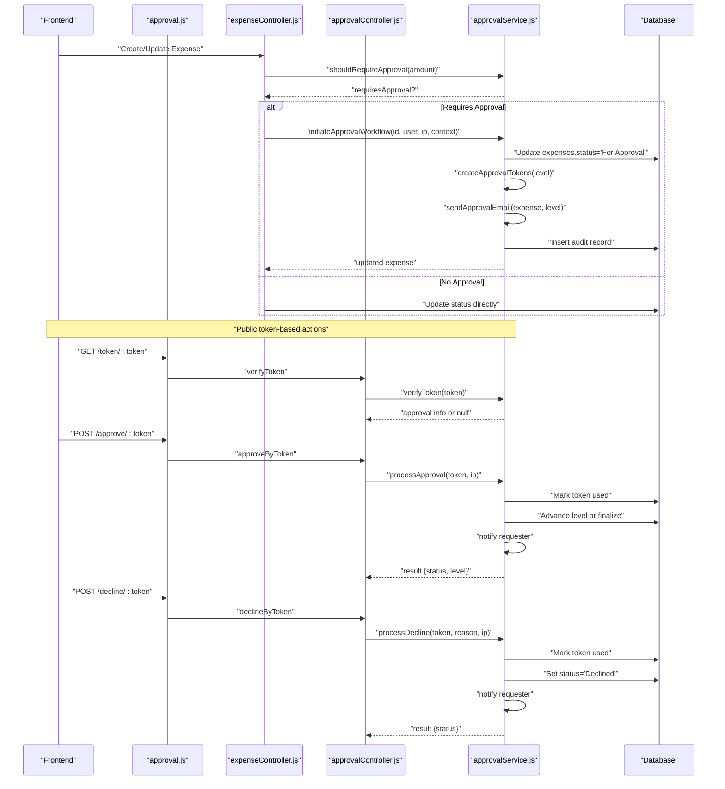

**Diagram sources**
- [approval.js:17-33](file://backend/src/routes/approval.js#L17-L33)
- [approvalController.js:61-98](file://backend/src/controllers/approvalController.js#L61-L98)
- [approvalService.js:292-327](file://backend/src/services/approvalService.js#L292-L327)
- [approvalService.js:398-425](file://backend/src/services/approvalService.js#L398-L425)
- [approvalService.js:427-509](file://backend/src/services/approvalService.js#L427-L509)
- [approvalService.js:511-555](file://backend/src/services/approvalService.js#L511-L555)
- [expenseController.js:158-335](file://backend/src/controllers/expenseController.js#L158-L335)

## Detailed Component Analysis

### Threshold-Based Approval Detection
- Retrieves settings keys for the approval threshold and email preferences.
- Compares the expense amount against the threshold to decide if approval is required.
- Defaults are applied when settings are missing.

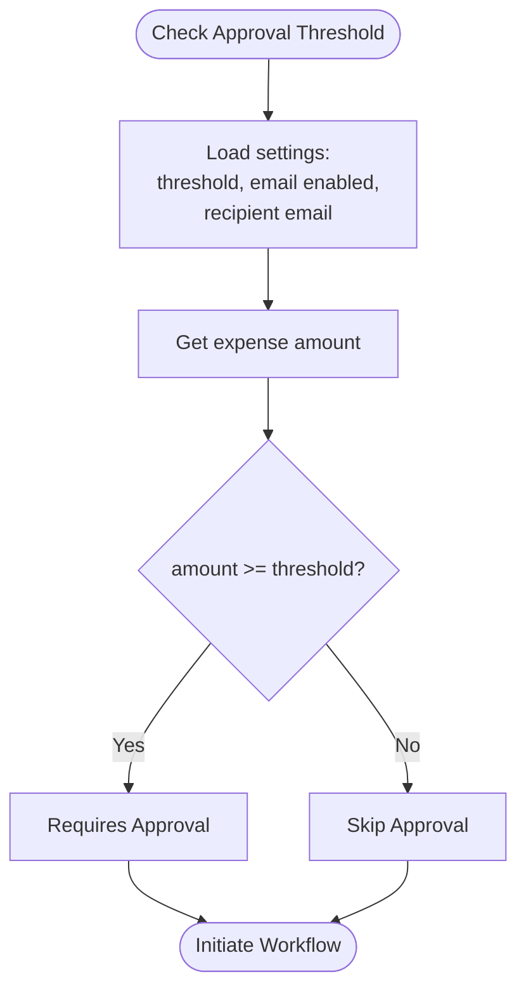

**Diagram sources**
- [approvalService.js:23-57](file://backend/src/services/approvalService.js#L23-L57)
- [approvalService.js:114-117](file://backend/src/services/approvalService.js#L114-L117)

**Section sources**
- [approvalService.js:23-57](file://backend/src/services/approvalService.js#L23-L57)
- [approvalService.js:114-117](file://backend/src/services/approvalService.js#L114-L117)

### Approval Routing Mechanisms
- Active approvers are loaded and deduplicated by approval level.
- Tokens are generated per approval level with expiry dates.
- Emails are sent to the approver at the current level with approve/decline links.
- Tokens are invalidated for the same expense to prevent replay.

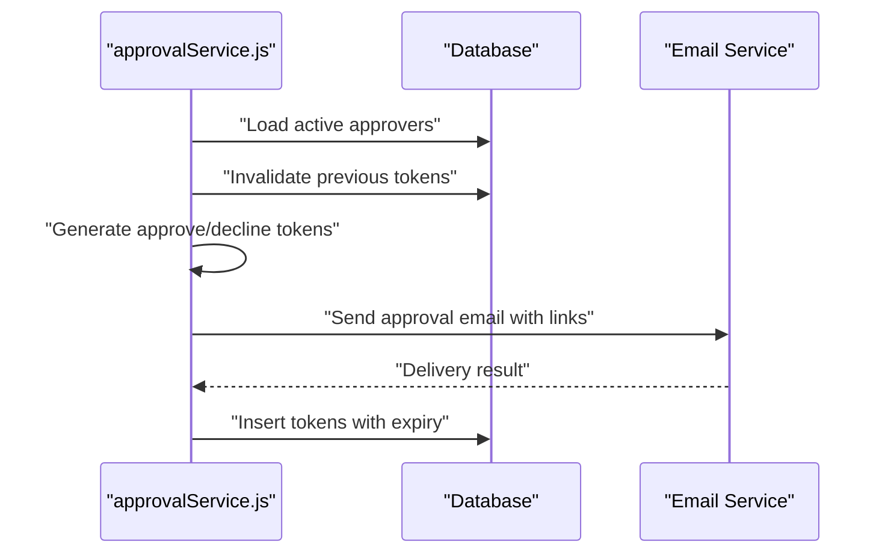

**Diagram sources**
- [approvalService.js:84-112](file://backend/src/services/approvalService.js#L84-L112)
- [approvalService.js:216-250](file://backend/src/services/approvalService.js#L216-L250)
- [approvalService.js:252-290](file://backend/src/services/approvalService.js#L252-L290)

**Section sources**
- [approvalService.js:84-112](file://backend/src/services/approvalService.js#L84-L112)
- [approvalService.js:216-250](file://backend/src/services/approvalService.js#L216-L250)
- [approvalService.js:252-290](file://backend/src/services/approvalService.js#L252-L290)

### Escalation Procedures
- When an approver approves, the system advances to the next level if available.
- If at the last level, the workflow finalizes (e.g., marks as Liquidated or Approved depending on context).
- Declines terminate the workflow and notify the requester.

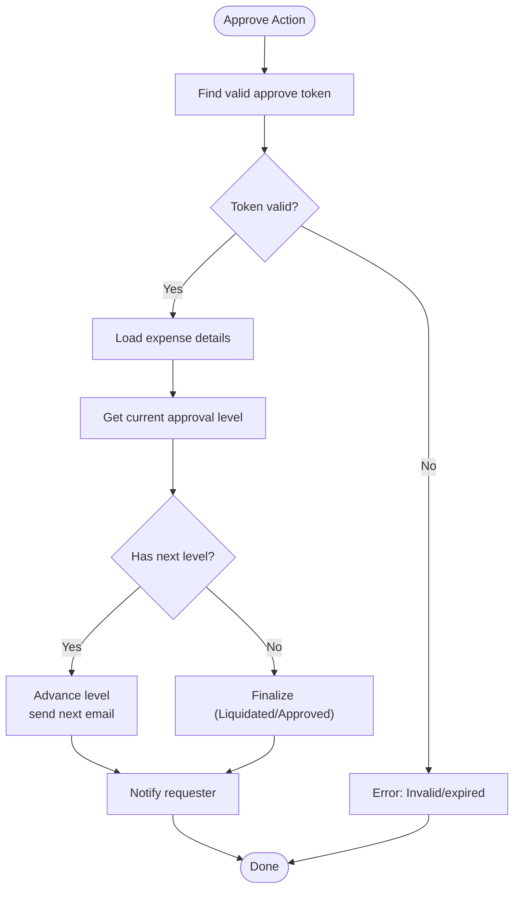

**Diagram sources**
- [approvalService.js:427-509](file://backend/src/services/approvalService.js#L427-L509)

**Section sources**
- [approvalService.js:427-509](file://backend/src/services/approvalService.js#L427-L509)

### Approval Service Implementation
- Settings management: Retrieve and update approval threshold, email enablement, and recipient email.
- Approver management: List, add, update, and delete approvers; supports multi-level hierarchy.
- Expense evaluation: Determine if approval is required and initiate workflow.
- Token lifecycle: Generate, hash, store, verify, and expire tokens.
- Notifications: Email templates for approval requests and status updates; socket/broadcast updates.

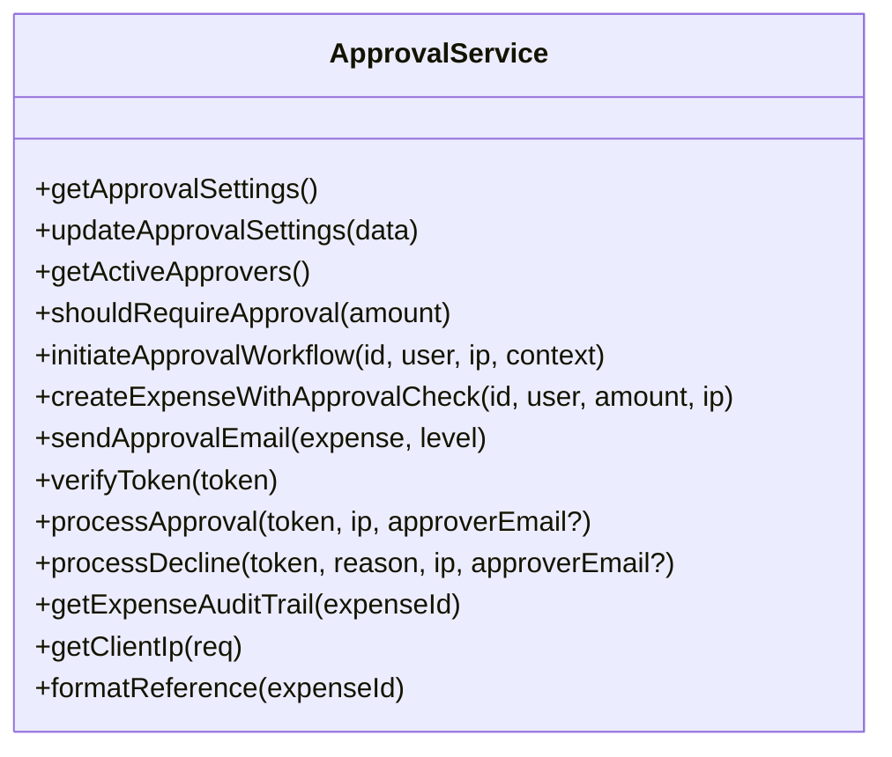

**Diagram sources**
- [approvalService.js:23-590](file://backend/src/services/approvalService.js#L23-L590)

**Section sources**
- [approvalService.js:23-590](file://backend/src/services/approvalService.js#L23-L590)

### Approval Controller Endpoints
- Public token verification and actions: GET /token/:token, POST /approve/:token, POST /decline/:token.
- Protected admin endpoints: GET/PUT /settings, GET/POST/PUT/DELETE /approvers.
- Audit trail retrieval: GET /audit/:expenseId.

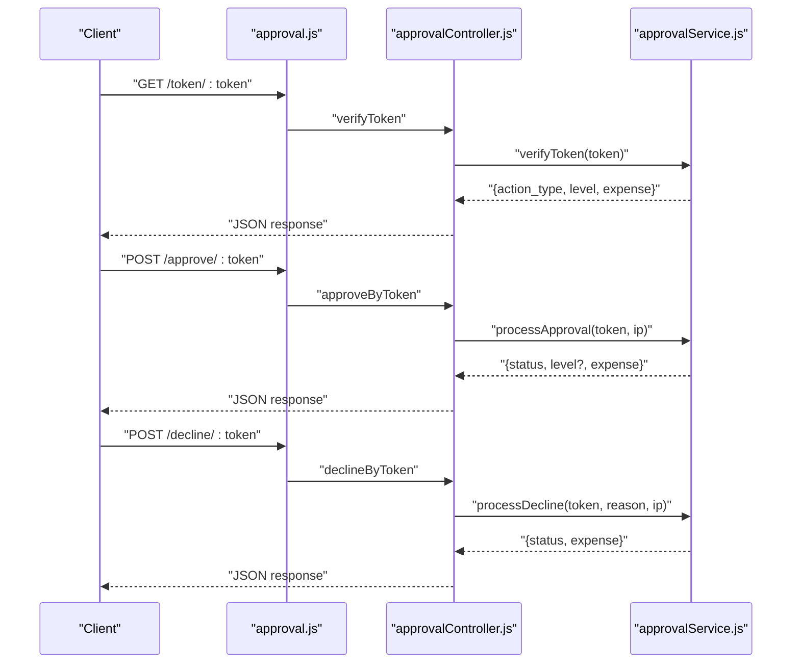

**Diagram sources**
- [approval.js:17-33](file://backend/src/routes/approval.js#L17-L33)
- [approvalController.js:61-98](file://backend/src/controllers/approvalController.js#L61-L98)
- [approvalService.js:398-425](file://backend/src/services/approvalService.js#L398-L425)
- [approvalService.js:427-509](file://backend/src/services/approvalService.js#L427-L509)
- [approvalService.js:511-555](file://backend/src/services/approvalService.js#L511-L555)

**Section sources**
- [approval.js:17-33](file://backend/src/routes/approval.js#L17-L33)
- [approvalController.js:61-98](file://backend/src/controllers/approvalController.js#L61-L98)

### Expense Management Integration
- During creation, the system records an audit entry and triggers approval workflow if amount exceeds threshold.
- During liquidation, if the expense is already Approved and amount exceeds threshold, the system initiates approval workflow and returns a message indicating approval is required.

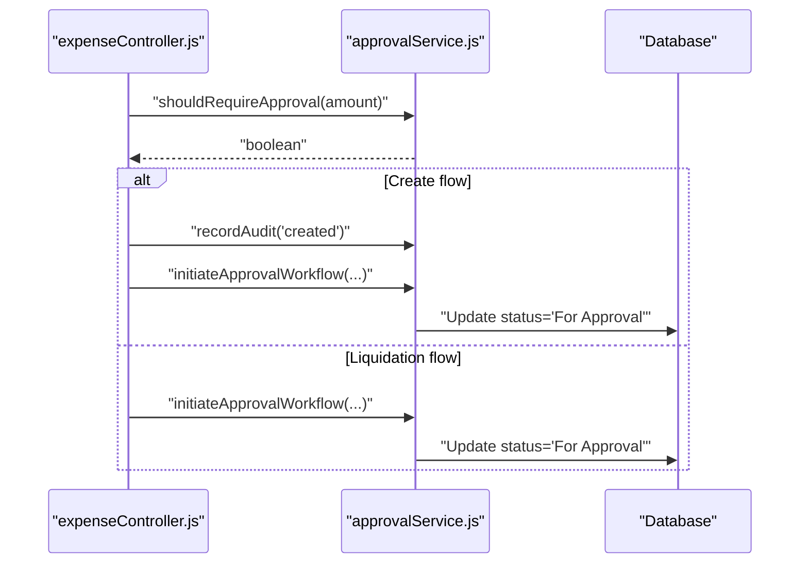

**Diagram sources**
- [expenseController.js:158-335](file://backend/src/controllers/expenseController.js#L158-L335)
- [approvalService.js:292-327](file://backend/src/services/approvalService.js#L292-L327)

**Section sources**
- [expenseController.js:158-335](file://backend/src/controllers/expenseController.js#L158-L335)

### Workflow State Management
- Expense status transitions: Created → For Approval → Approved/Liquidated/Declined.
- Current approval level increments per escalation.
- Audit trail captures all actions with actor details and IP address.
- Broadcasts notify clients of status changes and balance updates.

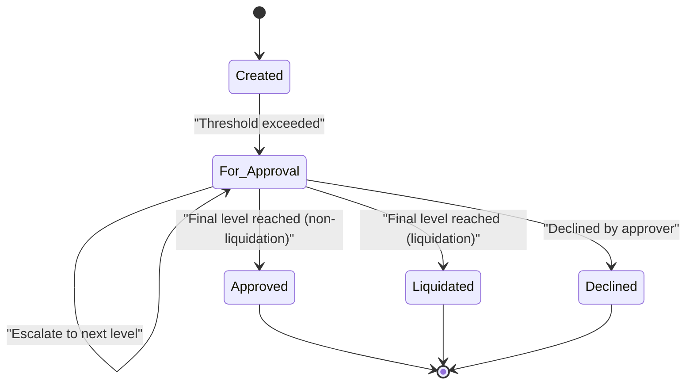

**Diagram sources**
- [approvalService.js:292-327](file://backend/src/services/approvalService.js#L292-L327)
- [approvalService.js:427-509](file://backend/src/services/approvalService.js#L427-L509)
- [approvalService.js:511-555](file://backend/src/services/approvalService.js#L511-L555)

**Section sources**
- [approvalService.js:292-327](file://backend/src/services/approvalService.js#L292-L327)
- [approvalService.js:427-509](file://backend/src/services/approvalService.js#L427-L509)
- [approvalService.js:511-555](file://backend/src/services/approvalService.js#L511-L555)

### Database Schema and Persistence
- Settings table stores approval threshold and email preferences.
- Liquidation approvers table defines multi-level approvers with activation and ordering.
- Tokens table holds hashed tokens with action type, approval level, and expiry.
- Audit table logs all approval actions with actor metadata.
- Expenses table tracks status, submission metadata, and approval context.

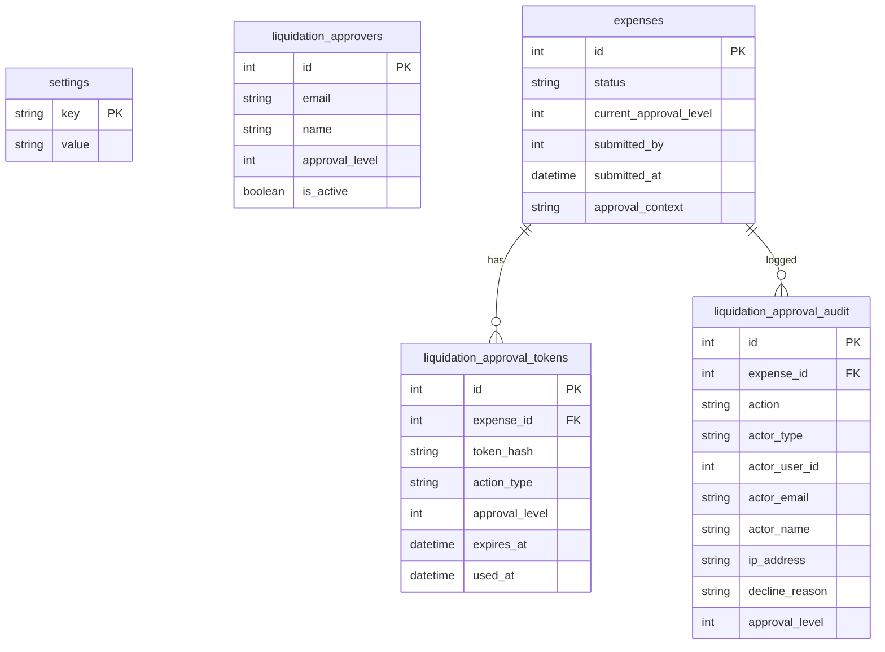

**Diagram sources**
- [20260611000000_add_liquidation_approval_workflow.js:121-150](file://backend/src/db/migrations/20260611000000_add_liquidation_approval_workflow.js#L121-L150)

**Section sources**
- [20260611000000_add_liquidation_approval_workflow.js:121-150](file://backend/src/db/migrations/20260611000000_add_liquidation_approval_workflow.js#L121-L150)

### Frontend Integration and Customization
- The frontend ApprovalSettingsPanel allows adding and managing approvers with levels, enabling multi-level approval chains.
- The primary email recipient setting is integrated into the active approver list for single-level fallback.

**Section sources**
- [ApprovalSettingsPanel.jsx:184-251](file://frontend/src/components/ApprovalSettingsPanel.jsx#L184-L251)

## Dependency Analysis
- Controllers depend on services for business logic.
- Services depend on database access, email/notification services, and socket broadcasting.
- Routes define public and protected access patterns for approval operations.
- Expense controller integrates approval decisions during creation and liquidation.

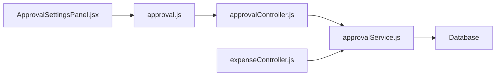

**Diagram sources**
- [approval.js:1-36](file://backend/src/routes/approval.js#L1-L36)
- [approvalController.js:1-108](file://backend/src/controllers/approvalController.js#L1-L108)
- [approvalService.js:1-590](file://backend/src/services/approvalService.js#L1-L590)
- [expenseController.js:158-335](file://backend/src/controllers/expenseController.js#L158-L335)
- [ApprovalSettingsPanel.jsx:184-251](file://frontend/src/components/ApprovalSettingsPanel.jsx#L184-L251)

**Section sources**
- [approval.js:1-36](file://backend/src/routes/approval.js#L1-L36)
- [approvalController.js:1-108](file://backend/src/controllers/approvalController.js#L1-L108)
- [approvalService.js:1-590](file://backend/src/services/approvalService.js#L1-L590)
- [expenseController.js:158-335](file://backend/src/controllers/expenseController.js#L158-L335)
- [ApprovalSettingsPanel.jsx:184-251](file://frontend/src/components/ApprovalSettingsPanel.jsx#L184-L251)

## Performance Considerations
- Token hashing and expiry checks are O(1) lookups keyed by hashed token.
- Approver loading is bounded by the number of active approvers; keep approver lists lean.
- Email sending is asynchronous; consider rate limiting and retry strategies.
- Broadcasting updates should be scoped to avoid unnecessary client churn.

## Troubleshooting Guide
- Invalid or expired token: Verify token existence, expiry, and used-at status.
- No approver email configured: Ensure approver entries exist and have valid emails.
- Duplicate tokens: Previous tokens are invalidated upon new workflow initiation.
- Decline reasons: A reason is mandatory for declines; ensure client supplies a non-empty reason.
- Audit trail gaps: Confirm audit table exists and is populated; check activity logs for creation events.

Common error scenarios and handlers:
- Token verification failures: [approvalService.js:398-425]
- Approval processing errors: [approvalService.js:427-434]
- Decline processing errors: [approvalService.js:511-522]
- Audit trail retrieval: [approvalService.js:161-214]

**Section sources**
- [approvalService.js:398-425](file://backend/src/services/approvalService.js#L398-L425)
- [approvalService.js:427-434](file://backend/src/services/approvalService.js#L427-L434)
- [approvalService.js:511-522](file://backend/src/services/approvalService.js#L511-L522)
- [approvalService.js:161-214](file://backend/src/services/approvalService.js#L161-L214)

## Conclusion
The approval workflow is a robust, token-based system that enforces threshold-based checks, supports multi-level escalation, and maintains comprehensive auditability. Its integration with expense management ensures that high-value liquidations are routed appropriately, while front-end controls enable administrators to configure approvers and thresholds. The modular design of controllers, services, and routes facilitates maintainability and extensibility for future enhancements.