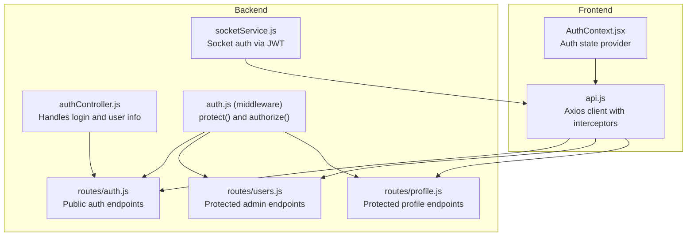
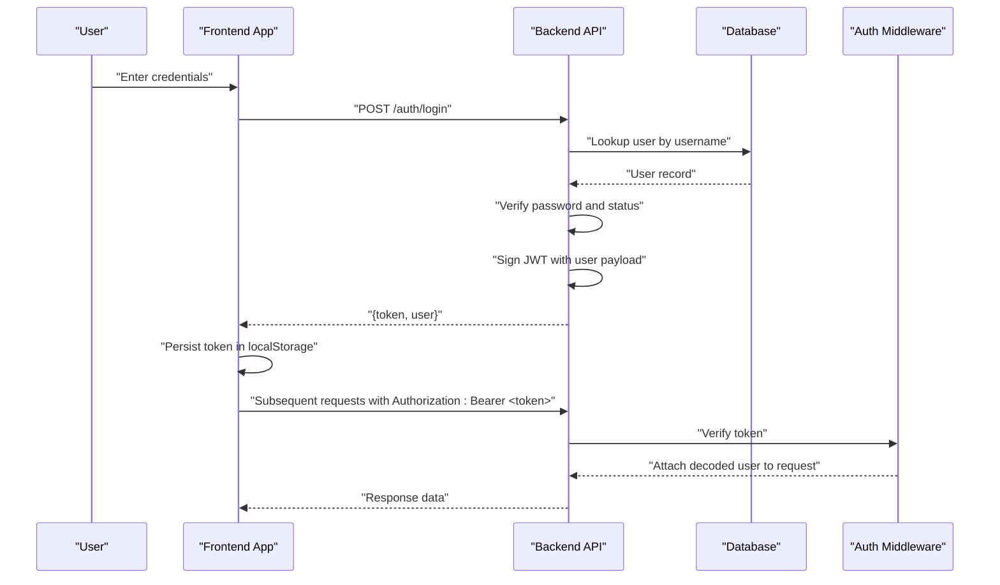
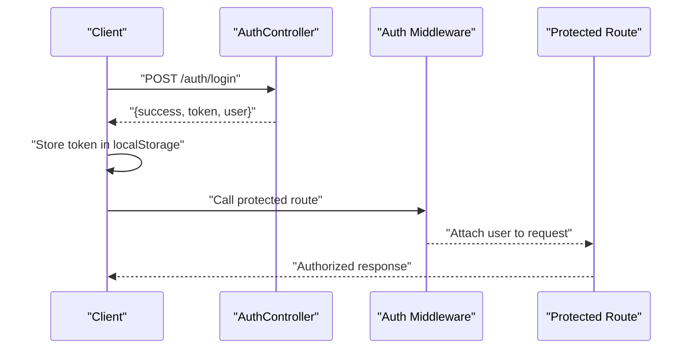
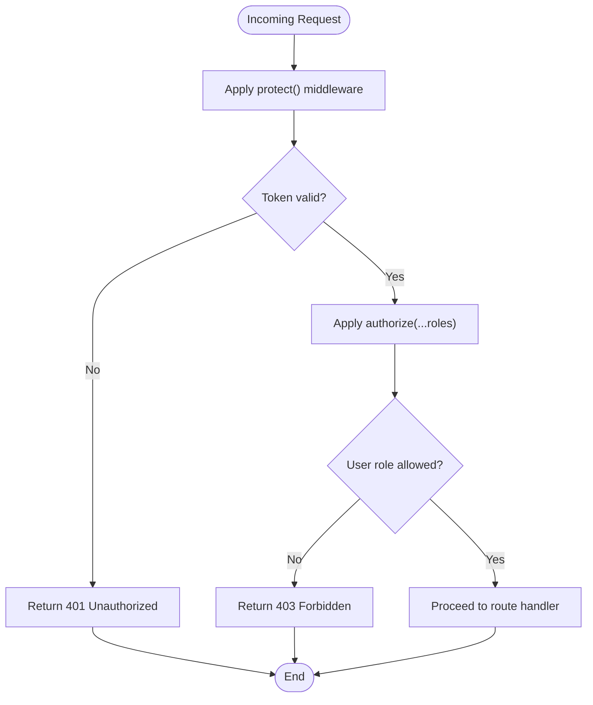
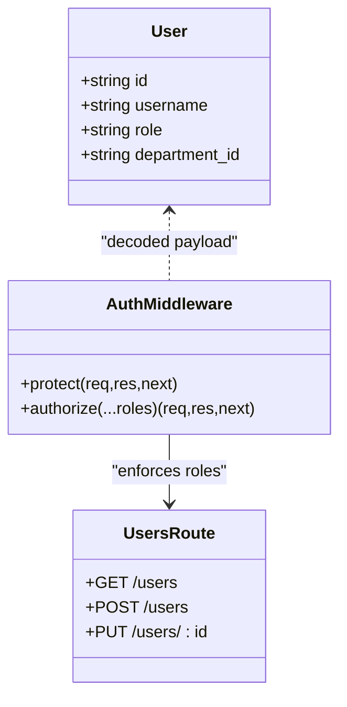
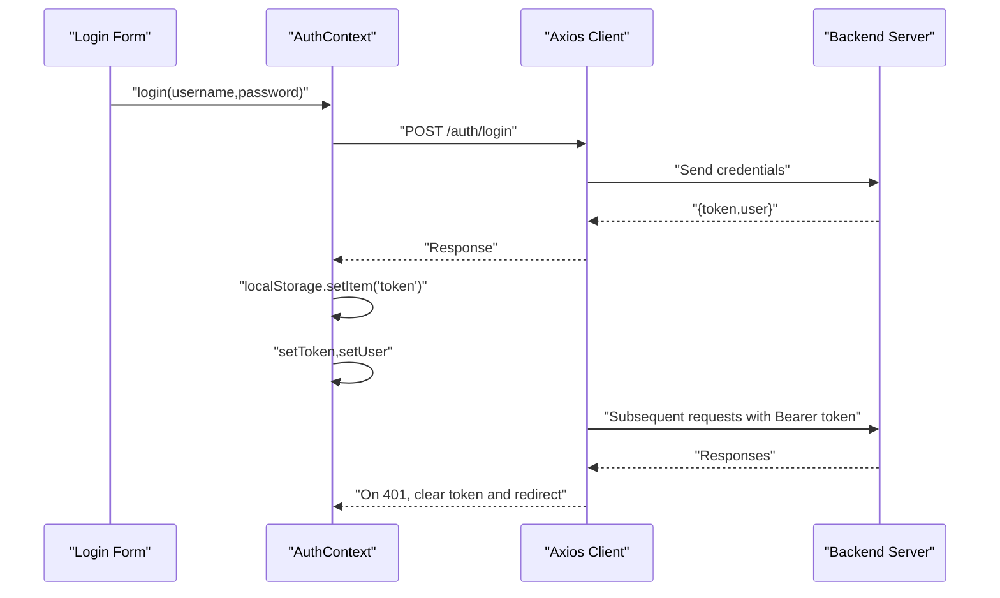
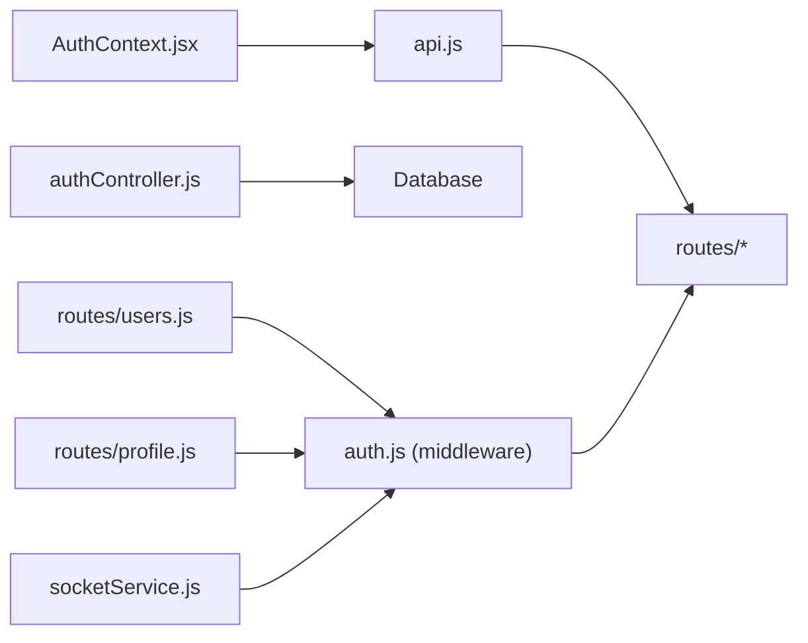

# Authentication & Authorization

<cite>
**Referenced Files in This Document**
- [authController.js](file://backend/src/controllers/authController.js)
- [auth.js](file://backend/src/middleware/auth.js)
- [auth.js](file://backend/src/routes/auth.js)
- [AuthContext.jsx](file://frontend/src/context/AuthContext.jsx)
- [api.js](file://frontend/src/services/api.js)
- [users.js](file://backend/src/routes/users.js)
- [profile.js](file://backend/src/routes/profile.js)
- [socketService.js](file://backend/src/services/socketService.js)
- [20260519120000_alter_user_role_to_string.js](file://backend/src/db/migrations/20260519120000_alter_user_role_to_string.js)
- [USER_MANUAL.md](file://USER_MANUAL.md)
</cite>

## Table of Contents
1. [Introduction](#introduction)
2. [Project Structure](#project-structure)
3. [Core Components](#core-components)
4. [Architecture Overview](#architecture-overview)
5. [Detailed Component Analysis](#detailed-component-analysis)
6. [Dependency Analysis](#dependency-analysis)
7. [Performance Considerations](#performance-considerations)
8. [Troubleshooting Guide](#troubleshooting-guide)
9. [Conclusion](#conclusion)
10. [Appendices](#appendices)

## Introduction
This document provides comprehensive authentication and authorization documentation for the JWT-based security system. It covers the end-to-end authentication flow (login, token issuance, protected routes, and logout), role-based access control (RBAC) with user roles and permission levels, middleware authorization checks, and frontend authentication state management. It also outlines security best practices, token storage strategies, and common troubleshooting steps. The relationship between backend authentication and frontend context providers is explained to help developers integrate both sides effectively.

## Project Structure
Authentication spans three primary areas:
- Backend Express server with controllers, middleware, and routes for login and protected resources
- Frontend React application with an authentication context provider and HTTP client configured for JWT transport
- Shared RBAC model and protected routes enforcing role-based permissions

**Diagram sources**
- [authController.js:1-66](file://backend/src/controllers/authController.js#L1-L66)
- [auth.js:1-36](file://backend/src/middleware/auth.js#L1-L36)
- [auth.js:1-10](file://backend/src/routes/auth.js#L1-L10)
- [users.js:1-83](file://backend/src/routes/users.js#L1-L83)
- [profile.js:1-30](file://backend/src/routes/profile.js#L1-L30)
- [socketService.js:1-40](file://backend/src/services/socketService.js#L1-L40)
- [AuthContext.jsx:1-54](file://frontend/src/context/AuthContext.jsx#L1-L54)
- [api.js:1-29](file://frontend/src/services/api.js#L1-L29)

**Section sources**
- [authController.js:1-66](file://backend/src/controllers/authController.js#L1-L66)
- [auth.js:1-36](file://backend/src/middleware/auth.js#L1-L36)
- [auth.js:1-10](file://backend/src/routes/auth.js#L1-L10)
- [users.js:1-83](file://backend/src/routes/users.js#L1-L83)
- [profile.js:1-30](file://backend/src/routes/profile.js#L1-L30)
- [socketService.js:1-40](file://backend/src/services/socketService.js#L1-L40)
- [AuthContext.jsx:1-54](file://frontend/src/context/AuthContext.jsx#L1-L54)
- [api.js:1-29](file://frontend/src/services/api.js#L1-L29)

## Core Components
- Backend authentication controller: Validates credentials, checks account status, signs JWT with user identity and role, and returns user info alongside the token.
- Middleware: Extracts Bearer token from Authorization header, verifies JWT, attaches user payload to request, and enforces role-based authorization.
- Public auth routes: Expose login and self-profile endpoints.
- Protected routes: Enforce authentication and role checks for administrative and sensitive operations.
- Frontend auth context: Manages token lifecycle, persists token in local storage, injects Authorization header automatically, and redirects on 401.
- Socket service: Parses JWT for real-time connections without blocking, enabling per-user socket channels.

Key implementation references:
- Login and token issuance: [authController.js:6-52](file://backend/src/controllers/authController.js#L6-L52)
- Token verification and user attachment: [auth.js:3-21](file://backend/src/middleware/auth.js#L3-L21)
- Role-based authorization: [auth.js:23-33](file://backend/src/middleware/auth.js#L23-L33)
- Public auth endpoints: [auth.js:6-7](file://backend/src/routes/auth.js#L6-L7)
- Protected admin endpoints: [users.js:7-8](file://backend/src/routes/users.js#L7-L8)
- Protected profile endpoint: [profile.js:9-28](file://backend/src/routes/profile.js#L9-L28)
- Frontend login and token persistence: [AuthContext.jsx:32-38](file://frontend/src/context/AuthContext.jsx#L32-L38)
- Frontend token injection and 401 handling: [api.js:8-26](file://frontend/src/services/api.js#L8-L26)
- Socket auth parsing: [socketService.js:16-27](file://backend/src/services/socketService.js#L16-L27)

**Section sources**
- [authController.js:6-52](file://backend/src/controllers/authController.js#L6-L52)
- [auth.js:3-33](file://backend/src/middleware/auth.js#L3-L33)
- [auth.js:6-7](file://backend/src/routes/auth.js#L6-L7)
- [users.js:7-8](file://backend/src/routes/users.js#L7-L8)
- [profile.js:9-28](file://backend/src/routes/profile.js#L9-L28)
- [AuthContext.jsx:32-38](file://frontend/src/context/AuthContext.jsx#L32-L38)
- [api.js:8-26](file://frontend/src/services/api.js#L8-L26)
- [socketService.js:16-27](file://backend/src/services/socketService.js#L16-L27)

## Architecture Overview
The system uses bearer tokens for stateless authentication. On login, the backend validates credentials and issues a signed JWT containing user identity and role. The frontend stores the token and sends it on every request via an Axios interceptor. Protected routes enforce authentication and optional role checks. Real-time sockets optionally accept JWTs to associate connections with users.

**Diagram sources**
- [authController.js:6-52](file://backend/src/controllers/authController.js#L6-L52)
- [auth.js:3-21](file://backend/src/middleware/auth.js#L3-L21)
- [AuthContext.jsx:32-38](file://frontend/src/context/AuthContext.jsx#L32-L38)
- [api.js:8-14](file://frontend/src/services/api.js#L8-L14)

## Detailed Component Analysis

### Authentication Flow: Login, Token Generation, and Session Management
- Login endpoint validates username/password and account status, logs activity, signs JWT with identity and role, and returns token plus user info.
- Frontend receives token, stores it in localStorage, and sets it in the AuthContext state.
- Axios interceptor automatically attaches Authorization: Bearer <token> to outgoing requests.
- On 401 responses, the frontend clears the token and redirects to the login page.

**Diagram sources**
- [authController.js:6-52](file://backend/src/controllers/authController.js#L6-L52)
- [auth.js:3-21](file://backend/src/middleware/auth.js#L3-L21)
- [AuthContext.jsx:32-38](file://frontend/src/context/AuthContext.jsx#L32-L38)
- [api.js:8-14](file://frontend/src/services/api.js#L8-L14)

**Section sources**
- [authController.js:6-52](file://backend/src/controllers/authController.js#L6-L52)
- [AuthContext.jsx:32-38](file://frontend/src/context/AuthContext.jsx#L32-L38)
- [api.js:8-26](file://frontend/src/services/api.js#L8-L26)

### Protected Routes and Middleware Authorization Checks
- Global protection: All routes under a router can be wrapped with the protect middleware to enforce authentication.
- Role-based enforcement: The authorize higher-order function restricts access to specific roles.
- Example usage: The users route applies protect globally and authorize('Super Admin') for administrative actions.

**Diagram sources**
- [auth.js:3-33](file://backend/src/middleware/auth.js#L3-L33)
- [users.js:7-8](file://backend/src/routes/users.js#L7-L8)

**Section sources**
- [auth.js:3-33](file://backend/src/middleware/auth.js#L3-L33)
- [users.js:7-8](file://backend/src/routes/users.js#L7-L8)

### Role-Based Access Control (RBAC) Implementation
- Roles are stored as strings in the database, allowing flexible role values and simplified maintenance compared to enums.
- The RBAC matrix defines capabilities per role tier, including administrative privileges and feature access.
- Backend enforces role checks via the authorize middleware; frontend components can reflect role-aware UI accordingly.

**Diagram sources**
- [auth.js:3-33](file://backend/src/middleware/auth.js#L3-L33)
- [users.js:1-83](file://backend/src/routes/users.js#L1-L83)
- [20260519120000_alter_user_role_to_string.js:1-13](file://backend/src/db/migrations/20260519120000_alter_user_role_to_string.js#L1-L13)

**Section sources**
- [20260519120000_alter_user_role_to_string.js:1-13](file://backend/src/db/migrations/20260519120000_alter_user_role_to_string.js#L1-L13)
- [users.js:1-83](file://backend/src/routes/users.js#L1-L83)
- [USER_MANUAL.md:63-108](file://USER_MANUAL.md#L63-L108)

### Frontend Authentication State Management
- AuthContext initializes from localStorage, validates the token by calling /auth/me, and manages user, token, and loading state.
- Provides login and logout functions to coordinate with the backend and update state consistently.
- Axios interceptors automatically attach Authorization headers and handle 401 by clearing the token and redirecting.

**Diagram sources**
- [AuthContext.jsx:11-38](file://frontend/src/context/AuthContext.jsx#L11-L38)
- [api.js:8-26](file://frontend/src/services/api.js#L8-L26)
- [auth.js:6-7](file://backend/src/routes/auth.js#L6-L7)

**Section sources**
- [AuthContext.jsx:1-54](file://frontend/src/context/AuthContext.jsx#L1-L54)
- [api.js:1-29](file://frontend/src/services/api.js#L1-L29)

### Logout Procedures
- Frontend logout removes the token from localStorage and resets state.
- Subsequent requests will lack Authorization headers; protected routes will reject them with 401.
- Socket connections established without JWT remain functional but are not associated with a user.

**Section sources**
- [AuthContext.jsx:40-44](file://frontend/src/context/AuthContext.jsx#L40-L44)
- [api.js:20-23](file://frontend/src/services/api.js#L20-L23)
- [socketService.js:16-27](file://backend/src/services/socketService.js#L16-L27)

### Real-Time Authentication (Socket.IO)
- Socket handshake accepts an optional token in the handshake auth.
- If present, the server verifies the token and associates the socket with a user ID.
- If verification fails, the socket connects as a guest and logs the event.

**Section sources**
- [socketService.js:16-27](file://backend/src/services/socketService.js#L16-L27)

## Dependency Analysis
- Frontend depends on Axios for HTTP communication and on the AuthContext for token/state management.
- Backend controllers depend on the database layer and JWT library; routes depend on controllers and middleware.
- Middleware depends on JWT secret and environment configuration.
- Protected routes depend on middleware for authentication and authorization.

**Diagram sources**
- [api.js:1-29](file://frontend/src/services/api.js#L1-L29)
- [AuthContext.jsx:1-54](file://frontend/src/context/AuthContext.jsx#L1-L54)
- [authController.js:1-66](file://backend/src/controllers/authController.js#L1-L66)
- [auth.js:1-36](file://backend/src/middleware/auth.js#L1-L36)
- [users.js:1-83](file://backend/src/routes/users.js#L1-L83)
- [profile.js:1-30](file://backend/src/routes/profile.js#L1-L30)
- [socketService.js:1-40](file://backend/src/services/socketService.js#L1-L40)

**Section sources**
- [api.js:1-29](file://frontend/src/services/api.js#L1-L29)
- [AuthContext.jsx:1-54](file://frontend/src/context/AuthContext.jsx#L1-L54)
- [authController.js:1-66](file://backend/src/controllers/authController.js#L1-L66)
- [auth.js:1-36](file://backend/src/middleware/auth.js#L1-L36)
- [users.js:1-83](file://backend/src/routes/users.js#L1-L83)
- [profile.js:1-30](file://backend/src/routes/profile.js#L1-L30)
- [socketService.js:1-40](file://backend/src/services/socketService.js#L1-L40)

## Performance Considerations
- Token verification occurs on every protected request; keep JWT_SECRET secure and avoid overly large payloads in the token claim.
- Minimize unnecessary protected route calls by leveraging frontend routing guards and lazy loading.
- For high-throughput APIs, consider short-lived access tokens with refresh strategies and robust caching for non-sensitive data.
- Ensure database queries for user lookup and updates are indexed appropriately (e.g., username/email).

## Troubleshooting Guide
Common issues and resolutions:
- 401 Unauthorized on protected routes
  - Cause: Missing or invalid Authorization header; expired or malformed token.
  - Resolution: Re-authenticate; confirm token presence in localStorage; verify JWT_SECRET correctness.
  - References: [api.js:20-23](file://frontend/src/services/api.js#L20-L23), [auth.js:10-20](file://backend/src/middleware/auth.js#L10-L20)

- 403 Forbidden due to insufficient role
  - Cause: User role not included in the authorize(...) list.
  - Resolution: Verify user role in the database and adjust route authorization as needed.
  - References: [auth.js:23-33](file://backend/src/middleware/auth.js#L23-L33), [users.js](file://backend/src/routes/users.js#L8)

- Account disabled during login
  - Cause: User status indicates disabled.
  - Resolution: Enable the user account in the system.
  - References: [authController.js:16-18](file://backend/src/controllers/authController.js#L16-L18)

- Token not sent with requests
  - Cause: Interceptor not applied or token missing.
  - Resolution: Confirm token is stored and interceptor adds Authorization header.
  - References: [api.js:8-14](file://frontend/src/services/api.js#L8-L14), [AuthContext.jsx:32-38](file://frontend/src/context/AuthContext.jsx#L32-L38)

- Socket connection without user association
  - Cause: No token provided or invalid token in handshake.
  - Resolution: Pass a valid JWT in handshake auth; otherwise, socket connects as guest.
  - References: [socketService.js:16-27](file://backend/src/services/socketService.js#L16-L27)

**Section sources**
- [api.js:8-26](file://frontend/src/services/api.js#L8-L26)
- [auth.js:10-33](file://backend/src/middleware/auth.js#L10-L33)
- [authController.js:16-18](file://backend/src/controllers/authController.js#L16-L18)
- [users.js](file://backend/src/routes/users.js#L8)
- [AuthContext.jsx:32-38](file://frontend/src/context/AuthContext.jsx#L32-L38)
- [socketService.js:16-27](file://backend/src/services/socketService.js#L16-L27)

## Conclusion
The system implements a robust, stateless JWT-based authentication and authorization framework. The backend enforces authentication and role checks via middleware, while the frontend manages tokens and automatically attaches them to requests. RBAC is enforced both at the backend and reflected in the manual’s capability matrix. Socket integration supports optional user association. Following the best practices and troubleshooting steps outlined here will help maintain a secure and reliable authentication experience.

## Appendices

### Security Best Practices
- Store JWTs securely; avoid placing tokens in easily accessible locations (use httpOnly cookies if feasible).
- Rotate JWT_SECRET regularly and manage secrets via environment variables.
- Limit token payload size; avoid storing sensitive data in claims.
- Implement rate limiting and strong password policies.
- Use HTTPS in production to protect tokens in transit.
- Consider short-lived access tokens with secure refresh mechanisms.

### Token Storage Strategies
- LocalStorage: Simple and effective for SPAs; be mindful of XSS risks.
- SessionStorage: Same-origin isolation; cleared on tab close.
- HttpOnly cookies: Harder to exploit via XSS; requires backend support for CSRF protection.

### Logout Behavior
- Clear token from storage and reset application state.
- Invalidate sessions server-side if applicable (requires session store).
- Close active WebSocket connections to sever real-time ties.