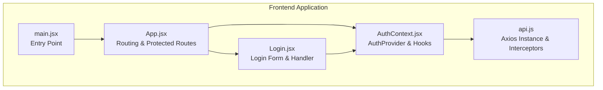
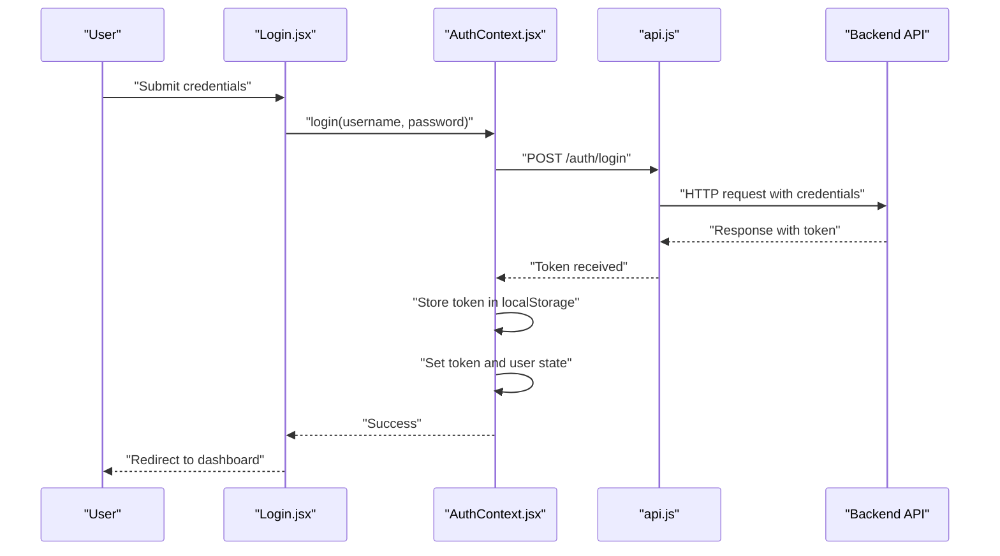
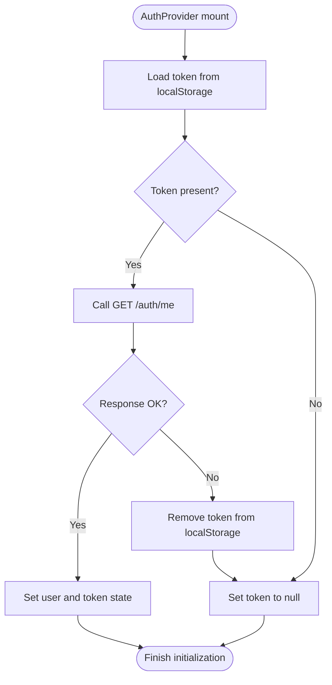
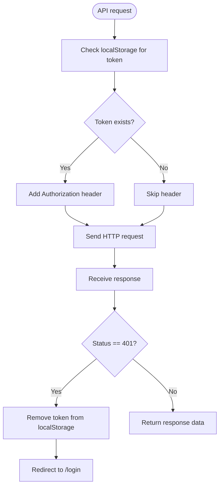
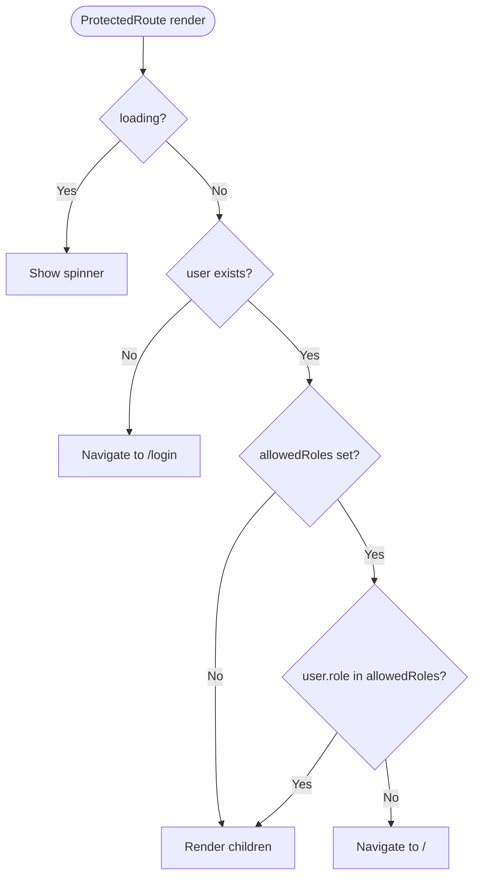
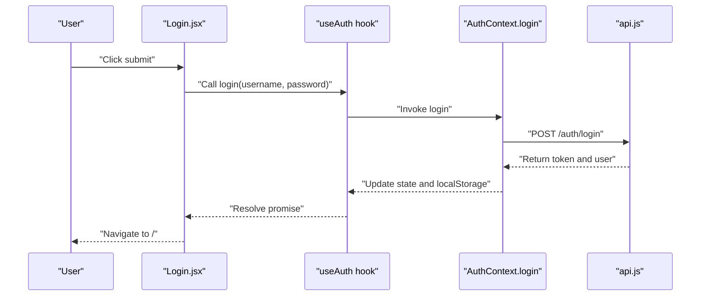
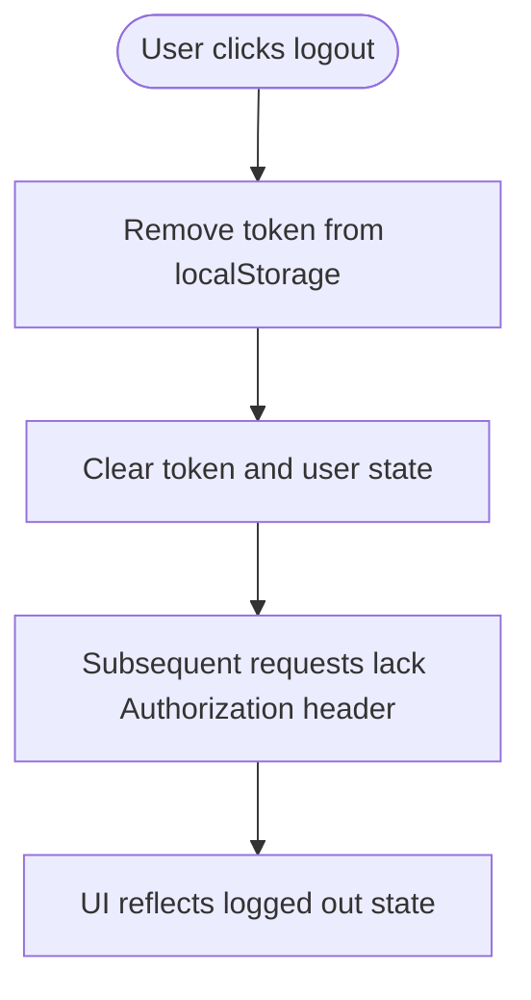
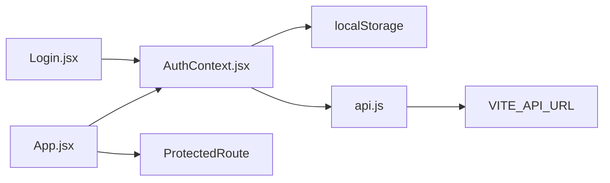

# Frontend Authentication State Management

<cite>
**Referenced Files in This Document**
- [AuthContext.jsx](file://frontend/src/context/AuthContext.jsx)
- [api.js](file://frontend/src/services/api.js)
- [Login.jsx](file://frontend/src/pages/Login.jsx)
- [App.jsx](file://frontend/src/App.jsx)
- [main.jsx](file://frontend/src/main.jsx)
</cite>

## Table of Contents
1. [Introduction](#introduction)
2. [Project Structure](#project-structure)
3. [Core Components](#core-components)
4. [Architecture Overview](#architecture-overview)
5. [Detailed Component Analysis](#detailed-component-analysis)
6. [Dependency Analysis](#dependency-analysis)
7. [Performance Considerations](#performance-considerations)
8. [Troubleshooting Guide](#troubleshooting-guide)
9. [Conclusion](#conclusion)

## Introduction
This document explains the frontend authentication state management implementation using React Context API. It covers the AuthContext provider setup, user authentication state, token storage and retrieval, automatic authentication status updates, integration with API services for authenticated requests, logout procedures, consuming authentication context in components, conditional rendering based on auth status, protected route wrappers, local storage management, state persistence across browser sessions, and error handling for authentication failures.

## Project Structure
The authentication implementation spans three primary areas:
- Context Provider: Centralized authentication state and actions
- API Service: Axios instance with request/response interceptors for token injection and error handling
- Routing Layer: Protected routes and login page integration

**Diagram sources**
- [main.jsx:1-11](file://frontend/src/main.jsx#L1-L11)
- [App.jsx:1-127](file://frontend/src/App.jsx#L1-L127)
- [AuthContext.jsx:1-54](file://frontend/src/context/AuthContext.jsx#L1-L54)
- [api.js:1-29](file://frontend/src/services/api.js#L1-L29)
- [Login.jsx:1-156](file://frontend/src/pages/Login.jsx#L1-L156)

**Section sources**
- [main.jsx:1-11](file://frontend/src/main.jsx#L1-L11)
- [App.jsx:1-127](file://frontend/src/App.jsx#L1-L127)
- [AuthContext.jsx:1-54](file://frontend/src/context/AuthContext.jsx#L1-L54)
- [api.js:1-29](file://frontend/src/services/api.js#L1-L29)
- [Login.jsx:1-156](file://frontend/src/pages/Login.jsx#L1-L156)

## Core Components
- AuthProvider: Manages authentication state (user, token, loading), initializes from localStorage, validates session via API, and exposes login/logout actions.
- useAuth: Custom hook to consume authentication context values and actions.
- api service: Axios instance with request interceptor injecting Authorization header and response interceptor handling 401 errors by clearing token and redirecting to login.
- ProtectedRoute: Route wrapper that enforces authentication and role-based access checks.
- Login page: Consumes useAuth to submit credentials, handles errors, and navigates on success.

Key implementation references:
- AuthProvider initialization and token retrieval from localStorage
- Automatic session validation on app load
- Token storage during login and cleanup during logout
- API interceptors for token injection and 401 handling
- ProtectedRoute logic for authentication and role checks

**Section sources**
- [AuthContext.jsx:6-51](file://frontend/src/context/AuthContext.jsx#L6-L51)
- [AuthContext.jsx:53-54](file://frontend/src/context/AuthContext.jsx#L53-L54)
- [api.js:7-26](file://frontend/src/services/api.js#L7-L26)
- [App.jsx:26-43](file://frontend/src/App.jsx#L26-L43)
- [Login.jsx:14-30](file://frontend/src/pages/Login.jsx#L14-L30)

## Architecture Overview
The authentication flow integrates React Context for state management with an Axios-based API client that automatically attaches tokens to requests and handles unauthorized responses.

**Diagram sources**
- [Login.jsx:17-30](file://frontend/src/pages/Login.jsx#L17-L30)
- [AuthContext.jsx:32-38](file://frontend/src/context/AuthContext.jsx#L32-L38)
- [api.js:3-5](file://frontend/src/services/api.js#L3-L5)

## Detailed Component Analysis

### AuthContext Provider
The provider manages:
- State: user, token, loading
- Initialization: reads token from localStorage and validates via GET /auth/me
- Actions: login (stores token, sets state), logout (clears token and state)
- Side effects: cleans up invalid tokens and prevents stale sessions

**Diagram sources**
- [AuthContext.jsx:11-30](file://frontend/src/context/AuthContext.jsx#L11-L30)

**Section sources**
- [AuthContext.jsx:6-51](file://frontend/src/context/AuthContext.jsx#L6-L51)

### API Service Integration
The API service centralizes HTTP communication:
- Request interceptor: adds Authorization header when token exists
- Response interceptor: detects 401 errors, clears token, and redirects to login

**Diagram sources**
- [api.js:7-26](file://frontend/src/services/api.js#L7-L26)

**Section sources**
- [api.js:1-29](file://frontend/src/services/api.js#L1-L29)

### Protected Route Wrapper
The ProtectedRoute component:
- Blocks unauthenticated users by redirecting to /login
- Supports role-based access control via allowedRoles prop
- Handles loading state while authentication resolves

**Diagram sources**
- [App.jsx:26-43](file://frontend/src/App.jsx#L26-L43)

**Section sources**
- [App.jsx:26-43](file://frontend/src/App.jsx#L26-L43)

### Login Page Integration
The Login page consumes useAuth to:
- Submit credentials via login action
- Handle errors and loading states
- Navigate to the dashboard upon successful authentication

**Diagram sources**
- [Login.jsx:17-30](file://frontend/src/pages/Login.jsx#L17-L30)
- [AuthContext.jsx:32-38](file://frontend/src/context/AuthContext.jsx#L32-L38)
- [api.js:3-5](file://frontend/src/services/api.js#L3-L5)

**Section sources**
- [Login.jsx:14-30](file://frontend/src/pages/Login.jsx#L14-L30)
- [AuthContext.jsx:32-38](file://frontend/src/context/AuthContext.jsx#L32-L38)

### Logout Procedure
Logout clears the token from localStorage and resets authentication state, ensuring subsequent requests are unauthenticated and the UI reflects guest status.

**Diagram sources**
- [AuthContext.jsx:40-44](file://frontend/src/context/AuthContext.jsx#L40-L44)

**Section sources**
- [AuthContext.jsx:40-44](file://frontend/src/context/AuthContext.jsx#L40-L44)

## Dependency Analysis
The authentication system exhibits clean separation of concerns:
- AuthContext depends on localStorage and the api service
- api service depends on environment configuration for base URL
- App routing composes AuthProvider and ProtectedRoute around page components
- Login page depends on useAuth to trigger authentication

**Diagram sources**
- [AuthContext.jsx:1-2](file://frontend/src/context/AuthContext.jsx#L1-L2)
- [api.js:3-5](file://frontend/src/services/api.js#L3-L5)
- [App.jsx:26-43](file://frontend/src/App.jsx#L26-L43)
- [Login.jsx:13-14](file://frontend/src/pages/Login.jsx#L13-L14)

**Section sources**
- [AuthContext.jsx:1-2](file://frontend/src/context/AuthContext.jsx#L1-L2)
- [api.js:3-5](file://frontend/src/services/api.js#L3-L5)
- [App.jsx:26-43](file://frontend/src/App.jsx#L26-L43)
- [Login.jsx:13-14](file://frontend/src/pages/Login.jsx#L13-L14)

## Performance Considerations
- Initial validation runs once on mount; avoid unnecessary re-renders by keeping state minimal
- API interceptors add Authorization header on every request; ensure only authenticated routes rely on this behavior
- ProtectedRoute renders a spinner while loading; keep the authentication check fast to minimize perceived latency
- Avoid storing sensitive data beyond the token; keep user object lean

## Troubleshooting Guide
Common issues and resolutions:
- Stale token causing 401 errors: The response interceptor automatically clears the token and redirects to /login. Verify network tab for failed requests and confirm token removal from localStorage
- Login fails silently: Check console for thrown errors and ensure error messages are displayed to the user
- Protected route flickers or redirects incorrectly: Confirm that loading state is handled and allowedRoles match user roles
- Token not persisting across browser sessions: Verify localStorage availability and that the token is written during login and cleared during logout

**Section sources**
- [api.js:16-26](file://frontend/src/services/api.js#L16-L26)
- [AuthContext.jsx:11-30](file://frontend/src/context/AuthContext.jsx#L11-L30)
- [App.jsx:26-43](file://frontend/src/App.jsx#L26-L43)
- [Login.jsx:17-30](file://frontend/src/pages/Login.jsx#L17-L30)

## Conclusion
The frontend authentication implementation leverages React Context for centralized state management, integrates seamlessly with an Axios-based API client for token injection and error handling, and provides robust protected routing with role-based access control. The design ensures state persistence across sessions via localStorage, automatic session validation on startup, and clear error handling for authentication failures. Components consume authentication context through a dedicated hook, enabling consistent conditional rendering and protected navigation patterns.