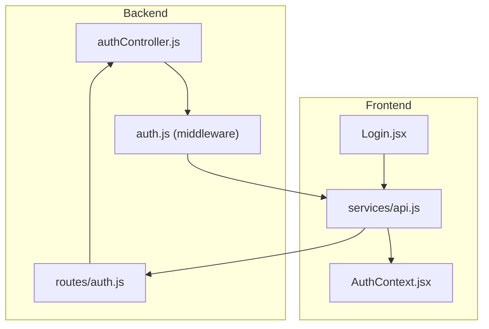
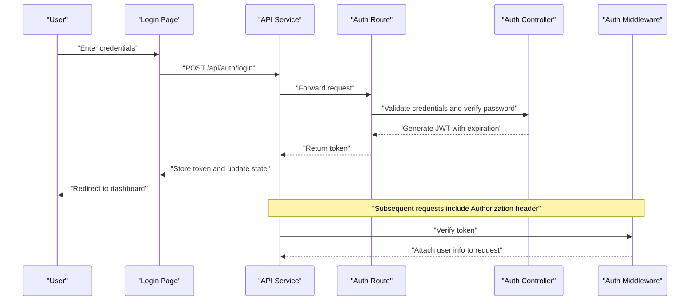
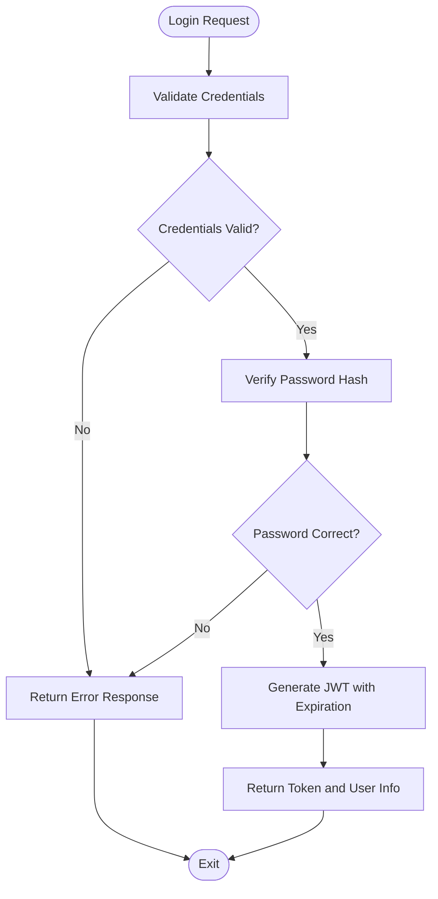
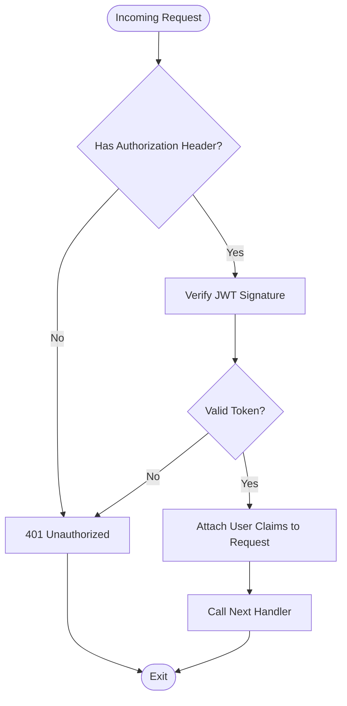
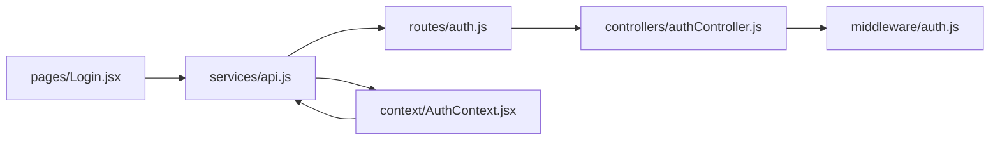

# JWT Authentication Flow

<cite>
**Referenced Files in This Document**
- [authController.js](file://backend/src/controllers/authController.js)
- [auth.js](file://backend/src/middleware/auth.js)
- [auth.js](file://backend/src/routes/auth.js)
- [AuthContext.jsx](file://frontend/src/context/AuthContext.jsx)
- [Login.jsx](file://frontend/src/pages/Login.jsx)
- [api.js](file://frontend/src/services/api.js)
</cite>

## Table of Contents
1. [Introduction](#introduction)
2. [Project Structure](#project-structure)
3. [Core Components](#core-components)
4. [Architecture Overview](#architecture-overview)
5. [Detailed Component Analysis](#detailed-component-analysis)
6. [Dependency Analysis](#dependency-analysis)
7. [Performance Considerations](#performance-considerations)
8. [Troubleshooting Guide](#troubleshooting-guide)
9. [Conclusion](#conclusion)

## Introduction
This document explains the JWT authentication flow implemented in the application. It covers the complete login process, including credential validation, password verification, token generation with expiration, and response handling. It also documents the JWT payload structure, frontend token storage strategies, token refresh mechanisms, automatic logout procedures, and security considerations such as IP logging and failed login attempts. Finally, it provides guidance for frontend authentication state management and backend middleware token verification.

## Project Structure
The authentication implementation spans backend controllers, middleware, and routes, and frontend context, pages, and API service. The following diagram shows the high-level structure of the authentication subsystem.

**Diagram sources**
- [authController.js](file://backend/src/controllers/authController.js)
- [auth.js](file://backend/src/middleware/auth.js)
- [auth.js](file://backend/src/routes/auth.js)
- [AuthContext.jsx](file://frontend/src/context/AuthContext.jsx)
- [Login.jsx](file://frontend/src/pages/Login.jsx)
- [api.js](file://frontend/src/services/api.js)

**Section sources**
- [authController.js](file://backend/src/controllers/authController.js)
- [auth.js](file://backend/src/middleware/auth.js)
- [auth.js](file://backend/src/routes/auth.js)
- [AuthContext.jsx](file://frontend/src/context/AuthContext.jsx)
- [Login.jsx](file://frontend/src/pages/Login.jsx)
- [api.js](file://frontend/src/services/api.js)

## Core Components
- Backend controller handles login requests, validates credentials, verifies passwords, generates JWT tokens with expiration, and returns structured responses.
- Middleware enforces JWT validation for protected routes and extracts user identity from tokens.
- Routes define the endpoint for login and apply middleware to protected resources.
- Frontend context manages authentication state, persists tokens, and coordinates logout and refresh flows.
- Login page triggers the authentication request via the API service.
- API service encapsulates HTTP calls and token persistence logic.

**Section sources**
- [authController.js](file://backend/src/controllers/authController.js)
- [auth.js](file://backend/src/middleware/auth.js)
- [auth.js](file://backend/src/routes/auth.js)
- [AuthContext.jsx](file://frontend/src/context/AuthContext.jsx)
- [Login.jsx](file://frontend/src/pages/Login.jsx)
- [api.js](file://frontend/src/services/api.js)

## Architecture Overview
The authentication flow follows a standard JWT pattern: client submits credentials, server validates them, generates a signed token with an expiration, and responds with the token. Subsequent requests include the token in headers for middleware verification.

**Diagram sources**
- [authController.js](file://backend/src/controllers/authController.js)
- [auth.js](file://backend/src/middleware/auth.js)
- [auth.js](file://backend/src/routes/auth.js)
- [Login.jsx](file://frontend/src/pages/Login.jsx)
- [api.js](file://frontend/src/services/api.js)

## Detailed Component Analysis

### Backend Controller: Login and Token Generation
- Endpoint: The route defines a login endpoint that accepts credentials.
- Credential validation: Validates presence and format of incoming credentials.
- Password verification: Compares provided password against stored hash.
- Token generation: Creates a JWT containing user identity and sets an expiration.
- Response handling: Returns token and user metadata in a standardized response format.

**Diagram sources**
- [authController.js](file://backend/src/controllers/authController.js)

**Section sources**
- [authController.js](file://backend/src/controllers/authController.js)

### Backend Middleware: Token Verification
- Extracts Authorization header and validates JWT signature.
- Decodes token to retrieve user identity claims.
- Attaches user information to the request object for downstream handlers.
- Handles missing or invalid tokens by returning appropriate errors.

**Diagram sources**
- [auth.js](file://backend/src/middleware/auth.js)

**Section sources**
- [auth.js](file://backend/src/middleware/auth.js)

### Backend Routes: Login Endpoint
- Defines the login route and applies the authentication controller logic.
- Ensures the endpoint is accessible without prior authentication.

**Section sources**
- [auth.js](file://backend/src/routes/auth.js)

### Frontend Context: Authentication State Management
- Provides authentication state (user, isAuthenticated).
- Stores token securely (localStorage/sessionStorage).
- Implements login, logout, and optional token refresh actions.
- Guards protected routes and updates UI state accordingly.

**Section sources**
- [AuthContext.jsx](file://frontend/src/context/AuthContext.jsx)

### Frontend Login Page: Triggering Authentication
- Captures user input and invokes the API service to submit credentials.
- Handles success and error responses from the server.
- Updates authentication context upon successful login.

**Section sources**
- [Login.jsx](file://frontend/src/pages/Login.jsx)

### Frontend API Service: HTTP Calls and Token Persistence
- Encapsulates HTTP requests to backend endpoints.
- Persists tokens after successful login.
- Adds Authorization header to subsequent requests.
- Coordinates logout by removing stored tokens.

**Section sources**
- [api.js](file://frontend/src/services/api.js)

## Dependency Analysis
The authentication subsystem exhibits clear separation of concerns:
- Routes depend on the controller for business logic.
- Controller depends on middleware for token verification in protected flows.
- Frontend components depend on the API service for network operations.
- API service depends on context for state and token storage.

**Diagram sources**
- [auth.js](file://backend/src/routes/auth.js)
- [authController.js](file://backend/src/controllers/authController.js)
- [auth.js](file://backend/src/middleware/auth.js)
- [Login.jsx](file://frontend/src/pages/Login.jsx)
- [api.js](file://frontend/src/services/api.js)
- [AuthContext.jsx](file://frontend/src/context/AuthContext.jsx)

**Section sources**
- [auth.js](file://backend/src/routes/auth.js)
- [authController.js](file://backend/src/controllers/authController.js)
- [auth.js](file://backend/src/middleware/auth.js)
- [Login.jsx](file://frontend/src/pages/Login.jsx)
- [api.js](file://frontend/src/services/api.js)
- [AuthContext.jsx](file://frontend/src/context/AuthContext.jsx)

## Performance Considerations
- Token expiration: Set reasonable TTL values to minimize long-lived tokens and reduce risk.
- Hash verification cost: Ensure password hashing uses secure, adaptive algorithms with appropriate cost factors.
- Network overhead: Minimize unnecessary requests by batching authenticated calls and reusing tokens until expiration.
- Middleware checks: Keep token verification lightweight to avoid blocking request processing.

## Troubleshooting Guide
Common issues and resolutions:
- 401 Unauthorized on protected routes: Verify Authorization header presence and token validity. Confirm middleware is applied to routes.
- Login fails despite correct credentials: Check password verification logic and database records. Ensure hashing algorithm compatibility.
- Token not persisted: Confirm frontend storage strategy and context updates after login.
- Refresh token not working: Validate refresh mechanism implementation and token rotation policy.
- Security events: Monitor IP logging and failed login attempts to detect suspicious activity.

**Section sources**
- [auth.js](file://backend/src/middleware/auth.js)
- [authController.js](file://backend/src/controllers/authController.js)
- [AuthContext.jsx](file://frontend/src/context/AuthContext.jsx)

## Conclusion
The JWT authentication flow integrates backend controllers, middleware, and routes with frontend state management and API services. By validating credentials, verifying hashed passwords, generating signed tokens with expiration, and enforcing middleware-based verification, the system provides a robust foundation for secure user sessions. Proper token storage, refresh strategies, and security monitoring further strengthen the implementation.