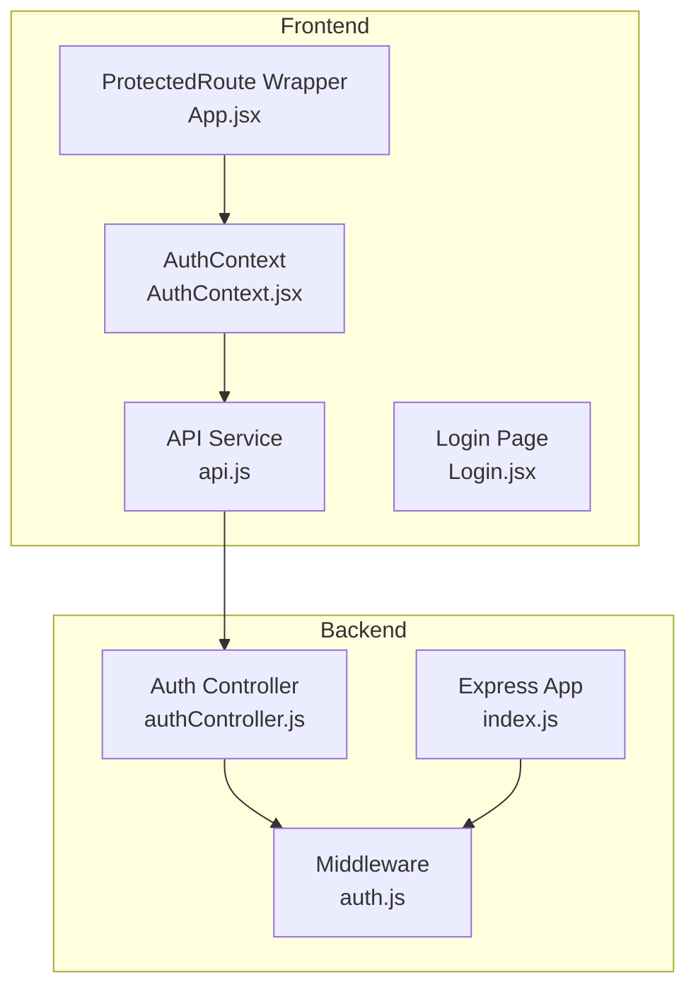
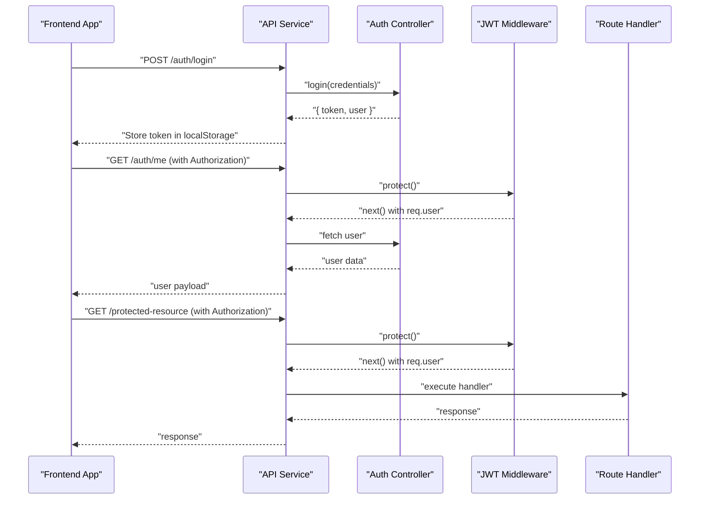
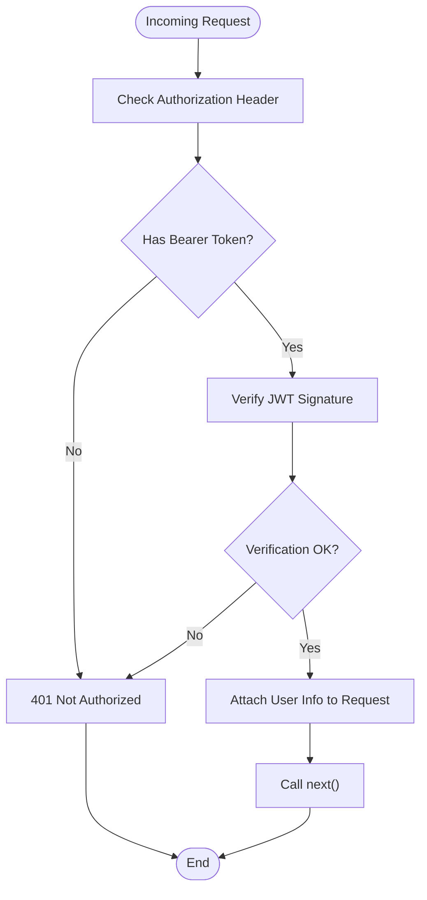
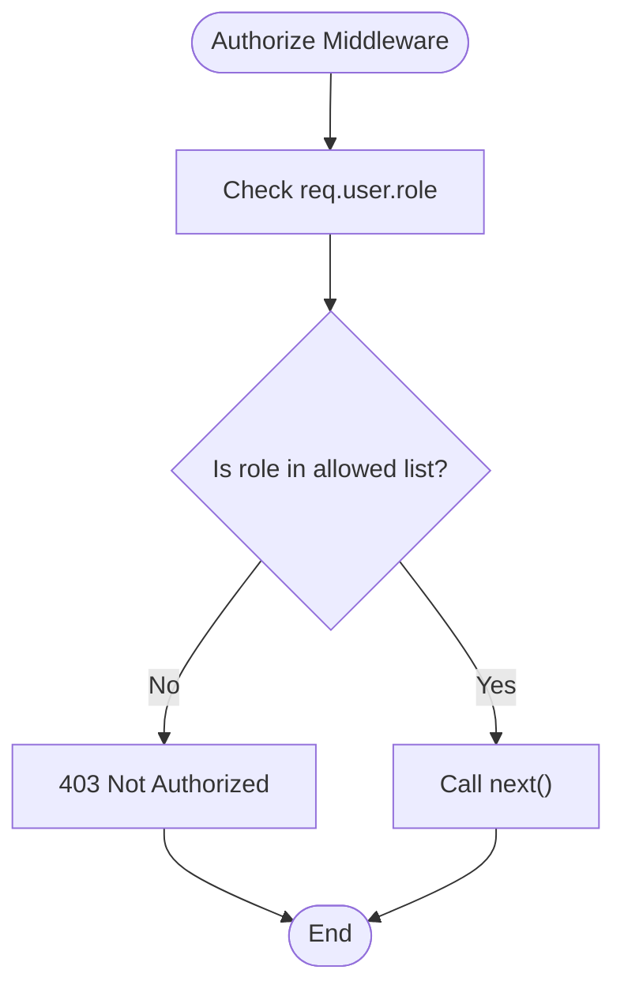
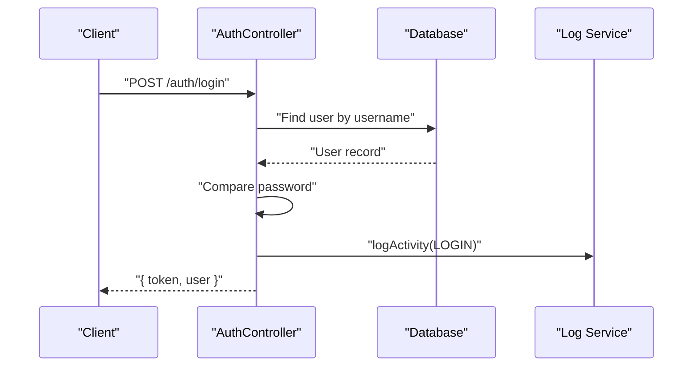
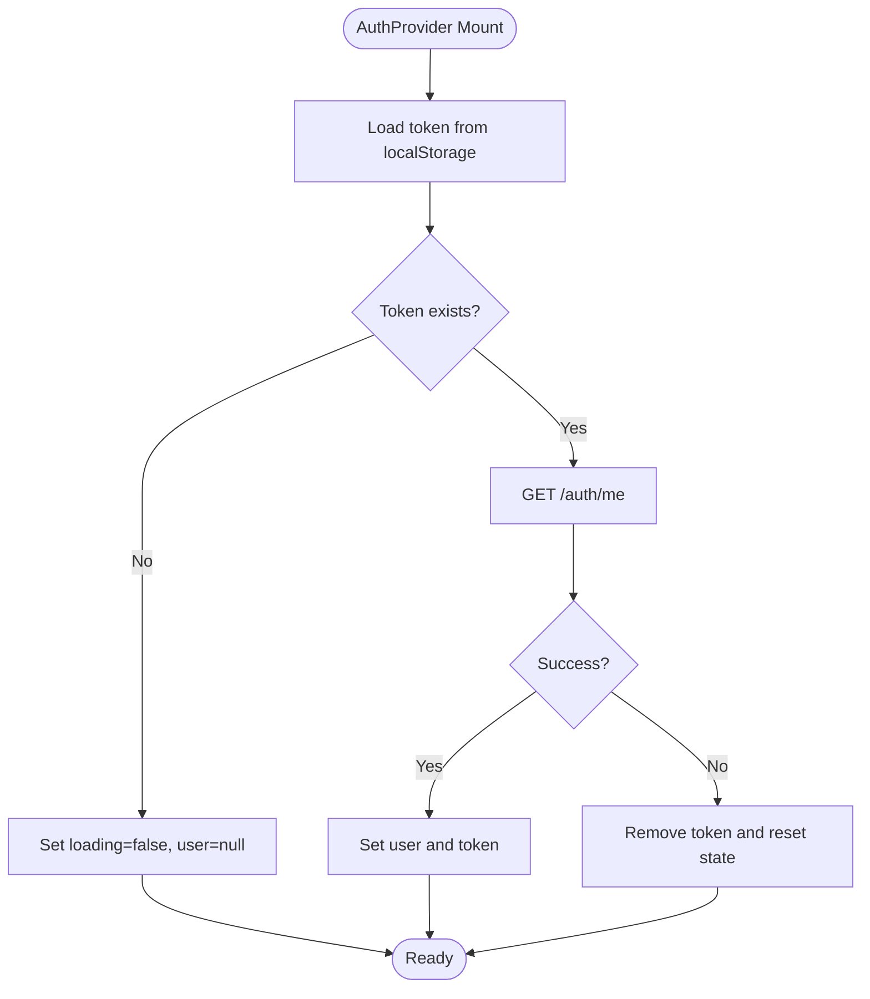
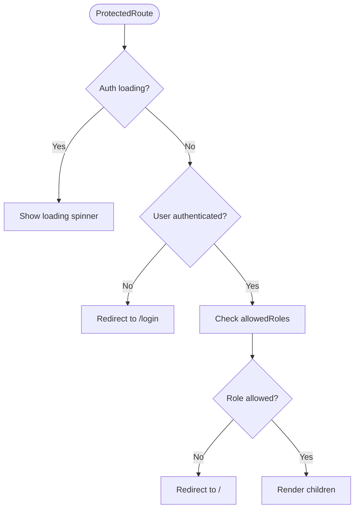
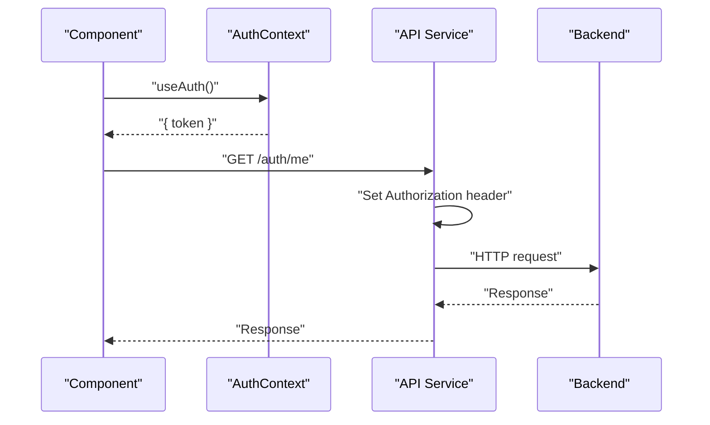
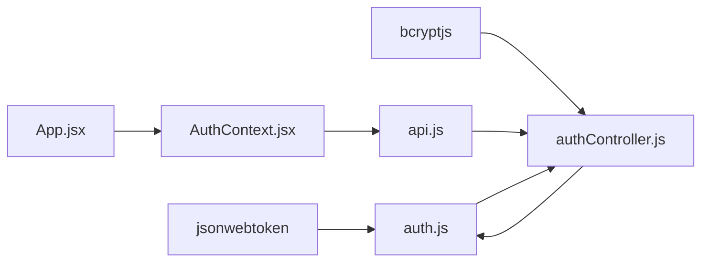

# Protected Routes & Middleware

<cite>
**Referenced Files in This Document**
- [auth.js](file://backend/src/middleware/auth.js)
- [authController.js](file://backend/src/controllers/authController.js)
- [index.js](file://backend/src/index.js)
- [AuthContext.jsx](file://frontend/src/context/AuthContext.jsx)
- [App.jsx](file://frontend/src/App.jsx)
- [api.js](file://frontend/src/services/api.js)
- [Login.jsx](file://frontend/src/pages/Login.jsx)
</cite>

## Table of Contents
1. [Introduction](#introduction)
2. [Project Structure](#project-structure)
3. [Core Components](#core-components)
4. [Architecture Overview](#architecture-overview)
5. [Detailed Component Analysis](#detailed-component-analysis)
6. [Dependency Analysis](#dependency-analysis)
7. [Performance Considerations](#performance-considerations)
8. [Troubleshooting Guide](#troubleshooting-guide)
9. [Conclusion](#conclusion)

## Introduction
This document explains the end-to-end implementation of protected routes and middleware authorization in the application. It covers backend authentication middleware that validates JWT tokens and enforces role-based access control, frontend protected route guards that redirect unauthorized users, automatic logout on token expiration, and the integration between backend middleware and frontend route protection. It also documents protected API endpoints, route-level permissions, error handling for unauthorized access attempts, and session timeout handling with re-authentication flows.

## Project Structure
The protected route system spans two layers:
- Backend: Express middleware for JWT verification and role-based authorization, plus authentication controller for login and token issuance.
- Frontend: Authentication context managing user state and token persistence, protected route wrapper enforcing access control, and API service injecting Authorization headers.

**Diagram sources**
- [auth.js:1-35](file://backend/src/middleware/auth.js#L1-L35)
- [authController.js:1-52](file://backend/src/controllers/authController.js#L1-L52)
- [index.js:184-210](file://backend/src/index.js#L184-L210)
- [AuthContext.jsx:1-53](file://frontend/src/context/AuthContext.jsx#L1-L53)
- [App.jsx:26-50](file://frontend/src/App.jsx#L26-L50)
- [api.js](file://frontend/src/services/api.js)
- [Login.jsx:114-126](file://frontend/src/pages/Login.jsx#L114-L126)

**Section sources**
- [auth.js:1-35](file://backend/src/middleware/auth.js#L1-L35)
- [authController.js:1-52](file://backend/src/controllers/authController.js#L1-L52)
- [index.js:184-210](file://backend/src/index.js#L184-L210)
- [AuthContext.jsx:1-53](file://frontend/src/context/AuthContext.jsx#L1-L53)
- [App.jsx:26-50](file://frontend/src/App.jsx#L26-L50)
- [api.js](file://frontend/src/services/api.js)
- [Login.jsx:114-126](file://frontend/src/pages/Login.jsx#L114-L126)

## Core Components
- Backend JWT Middleware: Validates presence of Bearer token in Authorization header and verifies JWT signature. On success, attaches user info to request; otherwise responds with 401 Unauthorized.
- Role-Based Authorization: Enforces route-level permissions by checking if the authenticated user's role is included in allowed roles.
- Authentication Controller: Handles login requests, validates credentials, checks account status, logs activity, and issues signed JWT with configured expiry.
- Frontend Auth Context: Manages token storage in localStorage, fetches current user via backend endpoint, and exposes login/logout functions.
- Protected Route Wrapper: Guards routes by checking authentication state and role eligibility, redirecting unauthenticated or unauthorized users appropriately.
- API Service: Injects Authorization header with Bearer token for authenticated requests.

**Section sources**
- [auth.js:3-21](file://backend/src/middleware/auth.js#L3-L21)
- [auth.js:23-33](file://backend/src/middleware/auth.js#L23-L33)
- [authController.js:6-51](file://backend/src/controllers/authController.js#L6-L51)
- [AuthContext.jsx:6-30](file://frontend/src/context/AuthContext.jsx#L6-L30)
- [AuthContext.jsx:32-44](file://frontend/src/context/AuthContext.jsx#L32-L44)
- [App.jsx:26-43](file://frontend/src/App.jsx#L26-L43)
- [api.js](file://frontend/src/services/api.js)

## Architecture Overview
The system enforces protection at two levels:
- Transport level: Frontend API requests include Authorization: Bearer <token>.
- Application level: Backend middleware verifies token validity and user role before allowing route handlers to execute.

**Diagram sources**
- [authController.js:6-51](file://backend/src/controllers/authController.js#L6-L51)
- [auth.js:3-21](file://backend/src/middleware/auth.js#L3-L21)
- [AuthContext.jsx:32-38](file://frontend/src/context/AuthContext.jsx#L32-L38)
- [api.js](file://frontend/src/services/api.js)

## Detailed Component Analysis

### Backend Authentication Middleware
The middleware performs:
- Token extraction from Authorization header (Bearer scheme).
- JWT verification using server secret.
- Request augmentation with user identity on success.
- Early exit with 401 for missing or invalid tokens.

**Diagram sources**
- [auth.js:3-21](file://backend/src/middleware/auth.js#L3-L21)

**Section sources**
- [auth.js:3-21](file://backend/src/middleware/auth.js#L3-L21)

### Role-Based Authorization
Role enforcement middleware:
- Accepts a list of allowed roles.
- Compares against authenticated user's role.
- Returns 403 Forbidden if mismatch.
- Proceeds otherwise.

**Diagram sources**
- [auth.js:23-33](file://backend/src/middleware/auth.js#L23-L33)

**Section sources**
- [auth.js:23-33](file://backend/src/middleware/auth.js#L23-L33)

### Authentication Controller (Login)
Key behaviors:
- Validates username/password against database.
- Confirms user status is active.
- Issues JWT with configurable expiry containing user identity and role.
- Logs successful login events.

**Diagram sources**
- [authController.js:6-51](file://backend/src/controllers/authController.js#L6-L51)

**Section sources**
- [authController.js:6-51](file://backend/src/controllers/authController.js#L6-L51)

### Frontend Authentication Context
Responsibilities:
- Initialize authentication state from localStorage.
- Fetch current user via GET /auth/me using Authorization header.
- On failure, remove invalid token and reset state.
- Expose login and logout functions.

**Diagram sources**
- [AuthContext.jsx:11-30](file://frontend/src/context/AuthContext.jsx#L11-L30)
- [AuthContext.jsx:32-44](file://frontend/src/context/AuthContext.jsx#L32-L44)

**Section sources**
- [AuthContext.jsx:6-30](file://frontend/src/context/AuthContext.jsx#L6-L30)
- [AuthContext.jsx:32-44](file://frontend/src/context/AuthContext.jsx#L32-L44)

### Protected Route Guard
The ProtectedRoute wrapper:
- Blocks navigation if user is not authenticated.
- Redirects to home ("/") if user lacks required role.
- Renders children when access is granted.

**Diagram sources**
- [App.jsx:26-43](file://frontend/src/App.jsx#L26-L43)

**Section sources**
- [App.jsx:26-43](file://frontend/src/App.jsx#L26-L43)

### API Service Authorization
The API client injects Authorization header for authenticated requests:
- Reads token from context.
- Sets Authorization: Bearer <token> for subsequent requests.

**Diagram sources**
- [AuthContext.jsx:6-30](file://frontend/src/context/AuthContext.jsx#L6-L30)
- [api.js](file://frontend/src/services/api.js)

**Section sources**
- [AuthContext.jsx:6-30](file://frontend/src/context/AuthContext.jsx#L6-L30)
- [api.js](file://frontend/src/services/api.js)

## Dependency Analysis
- Backend middleware depends on jsonwebtoken for token verification and environment configuration for JWT secret.
- Authentication controller depends on bcrypt for password comparison, database access, and logging utilities.
- Frontend AuthContext depends on the API service and localStorage for token persistence.
- ProtectedRoute depends on AuthContext for user state and role checks.
- API service depends on AuthContext for token retrieval and sets Authorization header.

**Diagram sources**
- [auth.js:1-1](file://backend/src/middleware/auth.js#L1-L1)
- [authController.js:1-4](file://backend/src/controllers/authController.js#L1-L4)
- [AuthContext.jsx:1-2](file://frontend/src/context/AuthContext.jsx#L1-L2)
- [App.jsx:26-43](file://frontend/src/App.jsx#L26-L43)
- [api.js](file://frontend/src/services/api.js)

**Section sources**
- [auth.js:1-35](file://backend/src/middleware/auth.js#L1-L35)
- [authController.js:1-52](file://backend/src/controllers/authController.js#L1-L52)
- [AuthContext.jsx:1-53](file://frontend/src/context/AuthContext.jsx#L1-L53)
- [App.jsx:26-50](file://frontend/src/App.jsx#L26-L50)
- [api.js](file://frontend/src/services/api.js)

## Performance Considerations
- Token verification occurs on every protected request; keep JWT_SECRET secure and avoid excessive middleware overhead.
- Role checks are O(n) over allowed roles; limit allowed roles per route to minimize comparisons.
- Frontend fetches current user on mount; consider caching user data in memory to reduce redundant network calls.
- Avoid unnecessary redirects by pre-checking authentication state before navigation.

## Troubleshooting Guide
Common issues and resolutions:
- 401 Unauthorized on protected endpoints:
  - Verify Authorization header is present and formatted as Bearer <token>.
  - Confirm JWT_SECRET matches backend configuration.
  - Ensure token is not expired; backend issues new tokens on successful login.
- 403 Forbidden on protected routes:
  - Confirm user role is included in allowed roles for the route.
  - Adjust route protection or user role assignment accordingly.
- Automatic logout after token expiration:
  - On token failure during /auth/me or protected requests, frontend removes token and resets state.
  - Prompt user to log in again via the login page.
- Session timeout handling:
  - No server-side session storage; rely on token expiry and frontend logout on failures.
  - Re-authentication flow: user submits credentials, receives new token, and continues.

**Section sources**
- [auth.js:10-20](file://backend/src/middleware/auth.js#L10-L20)
- [auth.js:25-30](file://backend/src/middleware/auth.js#L25-L30)
- [AuthContext.jsx:19-22](file://frontend/src/context/AuthContext.jsx#L19-L22)
- [Login.jsx:114-126](file://frontend/src/pages/Login.jsx#L114-L126)

## Conclusion
The application implements robust protected routes through a layered approach: backend JWT middleware for transport-level security and role-based authorization, and frontend ProtectedRoute wrapper with AuthContext for seamless user state management and redirection. Together, they provide secure access control, automatic logout on token failure, and a clear re-authentication flow for users experiencing session timeouts.