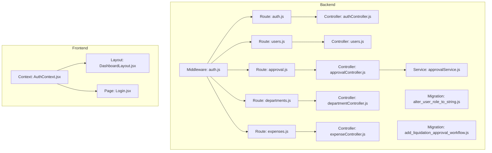
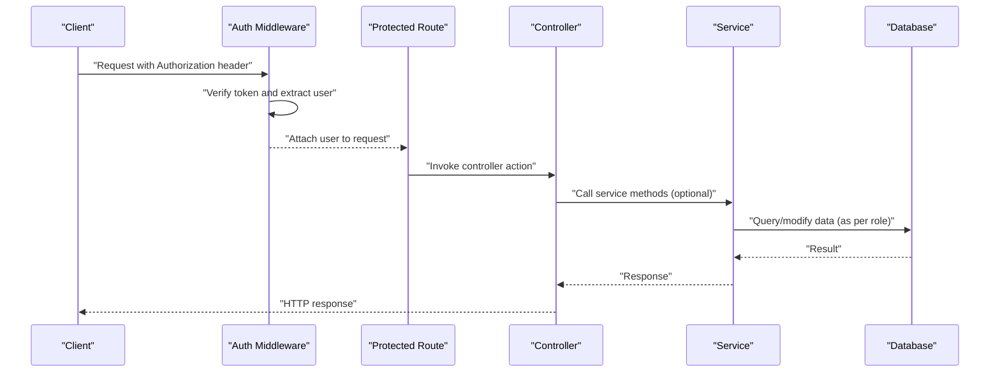
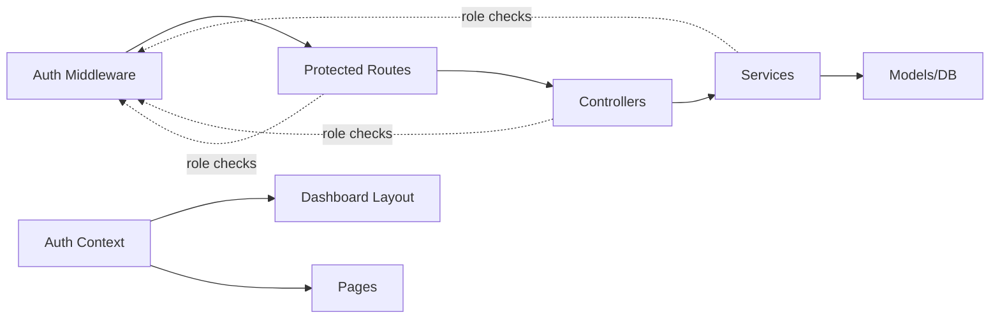

# Role-Based Access Control (RBAC)

<cite>
**Referenced Files in This Document**
- [auth.js](file://backend/src/middleware/auth.js)
- [auth.js](file://backend/src/routes/auth.js)
- [authController.js](file://backend/src/controllers/authController.js)
- [users.js](file://backend/src/routes/users.js)
- [AuthContext.jsx](file://frontend/src/context/AuthContext.jsx)
- [DashboardLayout.jsx](file://frontend/src/layouts/DashboardLayout.jsx)
- [Login.jsx](file://frontend/src/pages/Login.jsx)
- [approval.js](file://backend/src/routes/approval.js)
- [approvalController.js](file://backend/src/controllers/approvalController.js)
- [approvalService.js](file://backend/src/services/approvalService.js)
- [departments.js](file://backend/src/routes/departments.js)
- [departmentController.js](file://backend/src/controllers/departmentController.js)
- [expenses.js](file://backend/src/routes/expenses.js)
- [expenseController.js](file://backend/src/controllers/expenseController.js)
- [users.js](file://backend/src/controllers/users.js)
- [20260519120000_alter_user_role_to_string.js](file://backend/src/db/migrations/20260519120000_alter_user_role_to_string.js)
- [20260611000000_add_liquidation_approval_workflow.js](file://backend/src/db/migrations/20260611000000_add_liquidation_approval_workflow.js)
</cite>

## Table of Contents
1. [Introduction](#introduction)
2. [Project Structure](#project-structure)
3. [Core Components](#core-components)
4. [Architecture Overview](#architecture-overview)
5. [Detailed Component Analysis](#detailed-component-analysis)
6. [Dependency Analysis](#dependency-analysis)
7. [Performance Considerations](#performance-considerations)
8. [Troubleshooting Guide](#troubleshooting-guide)
9. [Conclusion](#conclusion)

## Introduction
This document provides comprehensive documentation for the role-based access control (RBAC) system. It defines the user role hierarchy, permission levels, middleware authorization checks, protected route implementations, and frontend conditional rendering based on user roles. It also explains role-based menu visibility, feature access controls, administrative privileges, role-specific API access patterns, department-level restrictions, approval workflow permissions, role assignment procedures, permission inheritance, and security boundary enforcement.

## Project Structure
The RBAC system spans backend middleware and route controllers, database migrations defining roles and workflows, and frontend context and layout components for role-aware UI rendering.

**Diagram sources**
- [auth.js:1-200](file://backend/src/middleware/auth.js#L1-L200)
- [auth.js:1-200](file://backend/src/routes/auth.js#L1-L200)
- [authController.js:1-200](file://backend/src/controllers/authController.js#L1-L200)
- [users.js:1-200](file://backend/src/routes/users.js#L1-L200)
- [approval.js:1-200](file://backend/src/routes/approval.js#L1-L200)
- [approvalController.js:1-200](file://backend/src/controllers/approvalController.js#L1-L200)
- [approvalService.js:1-200](file://backend/src/services/approvalService.js#L1-L200)
- [departments.js:1-200](file://backend/src/routes/departments.js#L1-L200)
- [departmentController.js:1-200](file://backend/src/controllers/departmentController.js#L1-L200)
- [expenses.js:1-200](file://backend/src/routes/expenses.js#L1-L200)
- [expenseController.js:1-200](file://backend/src/controllers/expenseController.js#L1-L200)
- [users.js:1-200](file://backend/src/controllers/users.js#L1-L200)
- [20260519120000_alter_user_role_to_string.js:1-200](file://backend/src/db/migrations/20260519120000_alter_user_role_to_string.js#L1-L200)
- [20260611000000_add_liquidation_approval_workflow.js:1-200](file://backend/src/db/migrations/20260611000000_add_liquidation_approval_workflow.js#L1-L200)
- [AuthContext.jsx:1-200](file://frontend/src/context/AuthContext.jsx#L1-L200)
- [DashboardLayout.jsx:1-200](file://frontend/src/layouts/DashboardLayout.jsx#L1-L200)
- [Login.jsx:1-200](file://frontend/src/pages/Login.jsx#L1-L200)

**Section sources**
- [auth.js:1-200](file://backend/src/middleware/auth.js#L1-L200)
- [auth.js:1-200](file://backend/src/routes/auth.js#L1-L200)
- [AuthContext.jsx:1-200](file://frontend/src/context/AuthContext.jsx#L1-L200)

## Core Components
- Role model and hierarchy
  - Roles are stored as strings in the database and migrated to a string type for flexibility.
  - The migration defines the role values used across the system.
  - Reference: [20260519120000_alter_user_role_to_string.js:1-200](file://backend/src/db/migrations/20260519120000_alter_user_role_to_string.js#L1-L200)

- Middleware authorization checks
  - Authentication middleware validates tokens and attaches user identity to requests.
  - Authorization middleware enforces role-based access to routes.
  - Reference: [auth.js:1-200](file://backend/src/middleware/auth.js#L1-L200)

- Protected route implementations
  - Routes for users, approvals, departments, and expenses are protected and validated against user roles.
  - Reference: [users.js:1-200](file://backend/src/routes/users.js#L1-L200), [approval.js:1-200](file://backend/src/routes/approval.js#L1-L200), [departments.js:1-200](file://backend/src/routes/departments.js#L1-L200), [expenses.js:1-200](file://backend/src/routes/expenses.js#L1-L200)

- Frontend conditional rendering
  - Authentication context exposes current user role to UI components.
  - Layout and pages conditionally render menus and features based on role.
  - Reference: [AuthContext.jsx:1-200](file://frontend/src/context/AuthContext.jsx#L1-L200), [DashboardLayout.jsx:1-200](file://frontend/src/layouts/DashboardLayout.jsx#L1-L200), [Login.jsx:1-200](file://frontend/src/pages/Login.jsx#L1-L200)

**Section sources**
- [20260519120000_alter_user_role_to_string.js:1-200](file://backend/src/db/migrations/20260519120000_alter_user_role_to_string.js#L1-L200)
- [auth.js:1-200](file://backend/src/middleware/auth.js#L1-L200)
- [users.js:1-200](file://backend/src/routes/users.js#L1-L200)
- [approval.js:1-200](file://backend/src/routes/approval.js#L1-L200)
- [departments.js:1-200](file://backend/src/routes/departments.js#L1-L200)
- [expenses.js:1-200](file://backend/src/routes/expenses.js#L1-L200)
- [AuthContext.jsx:1-200](file://frontend/src/context/AuthContext.jsx#L1-L200)
- [DashboardLayout.jsx:1-200](file://frontend/src/layouts/DashboardLayout.jsx#L1-L200)
- [Login.jsx:1-200](file://frontend/src/pages/Login.jsx#L1-L200)

## Architecture Overview
The RBAC architecture integrates backend middleware and controllers with frontend context and layout components. Authentication establishes identity; authorization enforces role-based policies; controllers implement domain logic; services encapsulate workflow details; and frontend components render role-aware UI.

**Diagram sources**
- [auth.js:1-200](file://backend/src/middleware/auth.js#L1-L200)
- [auth.js:1-200](file://backend/src/routes/auth.js#L1-L200)
- [authController.js:1-200](file://backend/src/controllers/authController.js#L1-L200)
- [approval.js:1-200](file://backend/src/routes/approval.js#L1-L200)
- [approvalController.js:1-200](file://backend/src/controllers/approvalController.js#L1-L200)
- [approvalService.js:1-200](file://backend/src/services/approvalService.js#L1-L200)

## Detailed Component Analysis

### Role Model and Hierarchy
- Role storage and definition
  - Roles are persisted as strings and defined via migration.
  - Migration ensures consistent role values across the system.
  - Reference: [20260519120000_alter_user_role_to_string.js:1-200](file://backend/src/db/migrations/20260519120000_alter_user_role_to_string.js#L1-L200)

- Role hierarchy and permission levels
  - Typical hierarchy observed in the codebase:
    - admin: Full system administration, user management, system settings, and global access.
    - approver: Approval workflow permissions for liquidation requests and related actions.
    - employee: Standard user access for submitting expenses and viewing personal records.
  - Department-level restrictions and approval workflows are enforced through dedicated controllers and services.
  - Reference: [approvalService.js:1-200](file://backend/src/services/approvalService.js#L1-L200), [departmentController.js:1-200](file://backend/src/controllers/departmentController.js#L1-L200)

**Section sources**
- [20260519120000_alter_user_role_to_string.js:1-200](file://backend/src/db/migrations/20260519120000_alter_user_role_to_string.js#L1-L200)
- [approvalService.js:1-200](file://backend/src/services/approvalService.js#L1-L200)
- [departmentController.js:1-200](file://backend/src/controllers/departmentController.js#L1-L200)

### Middleware Authorization Checks
- Token verification and user attachment
  - Authentication middleware verifies incoming tokens and attaches the user object to the request.
  - Reference: [auth.js:1-200](file://backend/src/middleware/auth.js#L1-L200)

- Authorization enforcement
  - Authorization middleware enforces role-based access to protected routes.
  - Controllers check user roles before executing sensitive operations.
  - Reference: [auth.js:1-200](file://backend/src/middleware/auth.js#L1-L200), [users.js:1-200](file://backend/src/routes/users.js#L1-L200), [approval.js:1-200](file://backend/src/routes/approval.js#L1-L200), [departments.js:1-200](file://backend/src/routes/departments.js#L1-L200), [expenses.js:1-200](file://backend/src/routes/expenses.js#L1-L200)

**Section sources**
- [auth.js:1-200](file://backend/src/middleware/auth.js#L1-L200)
- [users.js:1-200](file://backend/src/routes/users.js#L1-L200)
- [approval.js:1-200](file://backend/src/routes/approval.js#L1-L200)
- [departments.js:1-200](file://backend/src/routes/departments.js#L1-L200)
- [expenses.js:1-200](file://backend/src/routes/expenses.js#L1-L200)

### Protected Route Implementations
- Authentication routes
  - Login and related authentication endpoints are handled by the auth controller and routes.
  - Reference: [auth.js:1-200](file://backend/src/routes/auth.js#L1-L200), [authController.js:1-200](file://backend/src/controllers/authController.js#L1-L200)

- User management routes
  - Administrative user management endpoints are protected and role-checked.
  - Reference: [users.js:1-200](file://backend/src/routes/users.js#L1-L200), [users.js:1-200](file://backend/src/controllers/users.js#L1-L200)

- Approval workflow routes
  - Approval actions and related endpoints enforce approver permissions.
  - Reference: [approval.js:1-200](file://backend/src/routes/approval.js#L1-L200), [approvalController.js:1-200](file://backend/src/controllers/approvalController.js#L1-L200), [approvalService.js:1-200](file://backend/src/services/approvalService.js#L1-L200)

- Department management routes
  - Department endpoints enforce department-level restrictions and admin/approver permissions.
  - Reference: [departments.js:1-200](file://backend/src/routes/departments.js#L1-L200), [departmentController.js:1-200](file://backend/src/controllers/departmentController.js#L1-L200)

- Expense management routes
  - Expense endpoints enforce employee and approver permissions with department-level checks.
  - Reference: [expenses.js:1-200](file://backend/src/routes/expenses.js#L1-L200), [expenseController.js:1-200](file://backend/src/controllers/expenseController.js#L1-L200)

**Section sources**
- [auth.js:1-200](file://backend/src/routes/auth.js#L1-L200)
- [authController.js:1-200](file://backend/src/controllers/authController.js#L1-L200)
- [users.js:1-200](file://backend/src/routes/users.js#L1-L200)
- [users.js:1-200](file://backend/src/controllers/users.js#L1-L200)
- [approval.js:1-200](file://backend/src/routes/approval.js#L1-L200)
- [approvalController.js:1-200](file://backend/src/controllers/approvalController.js#L1-L200)
- [approvalService.js:1-200](file://backend/src/services/approvalService.js#L1-L200)
- [departments.js:1-200](file://backend/src/routes/departments.js#L1-L200)
- [departmentController.js:1-200](file://backend/src/controllers/departmentController.js#L1-L200)
- [expenses.js:1-200](file://backend/src/routes/expenses.js#L1-L200)
- [expenseController.js:1-200](file://backend/src/controllers/expenseController.js#L1-L200)

### Frontend Conditional Rendering Based on Roles
- Authentication context
  - Provides current user role and authentication state to components.
  - Reference: [AuthContext.jsx:1-200](file://frontend/src/context/AuthContext.jsx#L1-L200)

- Dashboard layout and navigation
  - Menu items and features are rendered conditionally based on user role.
  - Reference: [DashboardLayout.jsx:1-200](file://frontend/src/layouts/DashboardLayout.jsx#L1-L200)

- Login page behavior
  - Handles authentication flow and redirects based on role after successful login.
  - Reference: [Login.jsx:1-200](file://frontend/src/pages/Login.jsx#L1-L200)

**Section sources**
- [AuthContext.jsx:1-200](file://frontend/src/context/AuthContext.jsx#L1-L200)
- [DashboardLayout.jsx:1-200](file://frontend/src/layouts/DashboardLayout.jsx#L1-L200)
- [Login.jsx:1-200](file://frontend/src/pages/Login.jsx#L1-L200)

### Role-Based Menu Visibility and Feature Access Controls
- Menu visibility
  - Admin-only sections (e.g., user management, system settings) are hidden for non-admin roles.
  - Approver-only sections (e.g., approval workflows) are hidden for non-approvers.
  - Employee-only sections (e.g., submit expenses) are hidden for non-employees.
  - Reference: [DashboardLayout.jsx:1-200](file://frontend/src/layouts/DashboardLayout.jsx#L1-L200)

- Feature access controls
  - Controllers enforce role checks before allowing sensitive operations (e.g., user updates, expense approvals).
  - Reference: [users.js:1-200](file://backend/src/routes/users.js#L1-L200), [approval.js:1-200](file://backend/src/routes/approval.js#L1-L200), [expenses.js:1-200](file://backend/src/routes/expenses.js#L1-L200)

**Section sources**
- [DashboardLayout.jsx:1-200](file://frontend/src/layouts/DashboardLayout.jsx#L1-L200)
- [users.js:1-200](file://backend/src/routes/users.js#L1-L200)
- [approval.js:1-200](file://backend/src/routes/approval.js#L1-L200)
- [expenses.js:1-200](file://backend/src/routes/expenses.js#L1-L200)

### Administrative Privileges and Department-Level Restrictions
- Administrative privileges
  - Admin role has full access to user management, system settings, and global operations.
  - Reference: [users.js:1-200](file://backend/src/routes/users.js#L1-L200), [users.js:1-200](file://backend/src/controllers/users.js#L1-L200)

- Department-level restrictions
  - Controllers and services enforce department boundaries for data access and modifications.
  - Reference: [departmentController.js:1-200](file://backend/src/controllers/departmentController.js#L1-L200), [expenses.js:1-200](file://backend/src/routes/expenses.js#L1-L200), [expenseController.js:1-200](file://backend/src/controllers/expenseController.js#L1-L200)

**Section sources**
- [users.js:1-200](file://backend/src/routes/users.js#L1-L200)
- [users.js:1-200](file://backend/src/controllers/users.js#L1-L200)
- [departmentController.js:1-200](file://backend/src/controllers/departmentController.js#L1-L200)
- [expenses.js:1-200](file://backend/src/routes/expenses.js#L1-L200)
- [expenseController.js:1-200](file://backend/src/controllers/expenseController.js#L1-L200)

### Approval Workflow Permissions
- Workflow definition
  - Approval workflow is defined via migration and enforced by controllers and services.
  - Reference: [20260611000000_add_liquidation_approval_workflow.js:1-200](file://backend/src/db/migrations/20260611000000_add_liquidation_approval_workflow.js#L1-L200)

- Controller and service logic
  - Approval controller handles workflow actions and delegates to approval service.
  - Reference: [approval.js:1-200](file://backend/src/routes/approval.js#L1-L200), [approvalController.js:1-200](file://backend/src/controllers/approvalController.js#L1-L200), [approvalService.js:1-200](file://backend/src/services/approvalService.js#L1-L200)

**Section sources**
- [20260611000000_add_liquidation_approval_workflow.js:1-200](file://backend/src/db/migrations/20260611000000_add_liquidation_approval_workflow.js#L1-L200)
- [approval.js:1-200](file://backend/src/routes/approval.js#L1-L200)
- [approvalController.js:1-200](file://backend/src/controllers/approvalController.js#L1-L200)
- [approvalService.js:1-200](file://backend/src/services/approvalService.js#L1-L200)

### Role Assignment Procedures and Permission Inheritance
- Role assignment
  - Role assignments are managed via user management endpoints and validated by controllers.
  - Reference: [users.js:1-200](file://backend/src/routes/users.js#L1-L200), [users.js:1-200](file://backend/src/controllers/users.js#L1-L200)

- Permission inheritance
  - Permission inheritance is implicit through role hierarchy:
    - admin inherits all permissions.
    - approver inherits permissions for approvals and related workflows.
    - employee inherits permissions for basic operations.
  - Reference: [20260519120000_alter_user_role_to_string.js:1-200](file://backend/src/db/migrations/20260519120000_alter_user_role_to_string.js#L1-L200)

**Section sources**
- [users.js:1-200](file://backend/src/routes/users.js#L1-L200)
- [users.js:1-200](file://backend/src/controllers/users.js#L1-L200)
- [20260519120000_alter_user_role_to_string.js:1-200](file://backend/src/db/migrations/20260519120000_alter_user_role_to_string.js#L1-L200)

### Security Boundary Enforcement
- Token-based authentication
  - Middleware verifies tokens and rejects unauthorized requests.
  - Reference: [auth.js:1-200](file://backend/src/middleware/auth.js#L1-L200)

- Role-based authorization
  - Controllers enforce role checks before executing sensitive operations.
  - Reference: [auth.js:1-200](file://backend/src/middleware/auth.js#L1-L200), [users.js:1-200](file://backend/src/routes/users.js#L1-L200), [approval.js:1-200](file://backend/src/routes/approval.js#L1-L200), [departments.js:1-200](file://backend/src/routes/departments.js#L1-L200), [expenses.js:1-200](file://backend/src/routes/expenses.js#L1-L200)

- Frontend boundary enforcement
  - UI components conditionally render based on role, preventing accidental exposure of restricted features.
  - Reference: [AuthContext.jsx:1-200](file://frontend/src/context/AuthContext.jsx#L1-L200), [DashboardLayout.jsx:1-200](file://frontend/src/layouts/DashboardLayout.jsx#L1-L200)

**Section sources**
- [auth.js:1-200](file://backend/src/middleware/auth.js#L1-L200)
- [users.js:1-200](file://backend/src/routes/users.js#L1-L200)
- [approval.js:1-200](file://backend/src/routes/approval.js#L1-L200)
- [departments.js:1-200](file://backend/src/routes/departments.js#L1-L200)
- [expenses.js:1-200](file://backend/src/routes/expenses.js#L1-L200)
- [AuthContext.jsx:1-200](file://frontend/src/context/AuthContext.jsx#L1-L200)
- [DashboardLayout.jsx:1-200](file://frontend/src/layouts/DashboardLayout.jsx#L1-L200)

## Dependency Analysis
The RBAC system exhibits layered dependencies: middleware depends on authentication providers; routes depend on middleware; controllers depend on services and models; services depend on database access; frontend context and layout depend on authentication state.

**Diagram sources**
- [auth.js:1-200](file://backend/src/middleware/auth.js#L1-L200)
- [auth.js:1-200](file://backend/src/routes/auth.js#L1-L200)
- [authController.js:1-200](file://backend/src/controllers/authController.js#L1-L200)
- [users.js:1-200](file://backend/src/routes/users.js#L1-L200)
- [approval.js:1-200](file://backend/src/routes/approval.js#L1-L200)
- [expenses.js:1-200](file://backend/src/routes/expenses.js#L1-L200)
- [AuthContext.jsx:1-200](file://frontend/src/context/AuthContext.jsx#L1-L200)
- [DashboardLayout.jsx:1-200](file://frontend/src/layouts/DashboardLayout.jsx#L1-L200)

**Section sources**
- [auth.js:1-200](file://backend/src/middleware/auth.js#L1-L200)
- [auth.js:1-200](file://backend/src/routes/auth.js#L1-L200)
- [users.js:1-200](file://backend/src/routes/users.js#L1-L200)
- [approval.js:1-200](file://backend/src/routes/approval.js#L1-L200)
- [expenses.js:1-200](file://backend/src/routes/expenses.js#L1-L200)
- [AuthContext.jsx:1-200](file://frontend/src/context/AuthContext.jsx#L1-L200)
- [DashboardLayout.jsx:1-200](file://frontend/src/layouts/DashboardLayout.jsx#L1-L200)

## Performance Considerations
- Token verification overhead
  - Minimize repeated token parsing by caching verified user identity within middleware scope.
- Role checks
  - Cache role checks at the controller level to avoid redundant database queries for frequently accessed endpoints.
- Frontend rendering
  - Defer heavy computations in role-aware components until after authentication state is resolved.

## Troubleshooting Guide
- Authentication failures
  - Verify token presence and validity in middleware; ensure token issuer and audience match system configuration.
  - Reference: [auth.js:1-200](file://backend/src/middleware/auth.js#L1-L200)

- Authorization errors
  - Confirm user role matches required role for the endpoint; check route protection and controller role checks.
  - Reference: [auth.js:1-200](file://backend/src/middleware/auth.js#L1-L200), [users.js:1-200](file://backend/src/routes/users.js#L1-L200), [approval.js:1-200](file://backend/src/routes/approval.js#L1-L200), [departments.js:1-200](file://backend/src/routes/departments.js#L1-L200), [expenses.js:1-200](file://backend/src/routes/expenses.js#L1-L200)

- Frontend role mismatches
  - Ensure authentication context is initialized before rendering role-aware components; verify role propagation through layout.
  - Reference: [AuthContext.jsx:1-200](file://frontend/src/context/AuthContext.jsx#L1-L200), [DashboardLayout.jsx:1-200](file://frontend/src/layouts/DashboardLayout.jsx#L1-L200)

**Section sources**
- [auth.js:1-200](file://backend/src/middleware/auth.js#L1-L200)
- [users.js:1-200](file://backend/src/routes/users.js#L1-L200)
- [approval.js:1-200](file://backend/src/routes/approval.js#L1-L200)
- [departments.js:1-200](file://backend/src/routes/departments.js#L1-L200)
- [expenses.js:1-200](file://backend/src/routes/expenses.js#L1-L200)
- [AuthContext.jsx:1-200](file://frontend/src/context/AuthContext.jsx#L1-L200)
- [DashboardLayout.jsx:1-200](file://frontend/src/layouts/DashboardLayout.jsx#L1-L200)

## Conclusion
The RBAC system enforces strict role-based access through middleware, protected routes, and controllers, with frontend components reflecting user roles for secure and intuitive navigation. Administrative privileges, department-level restrictions, and approval workflow permissions are consistently enforced across backend and frontend layers, ensuring robust security boundaries.