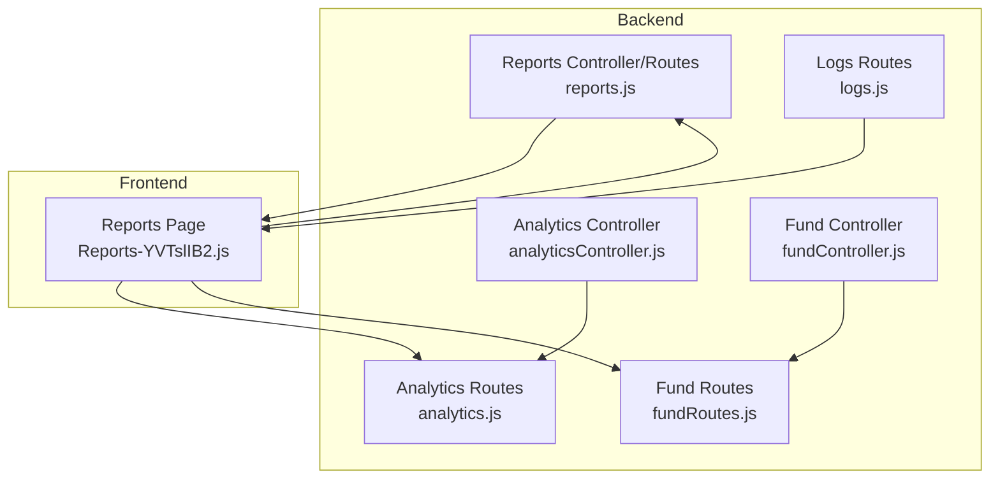
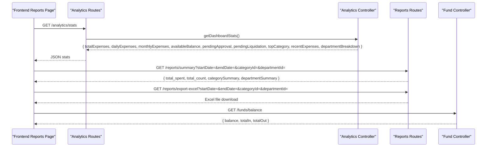
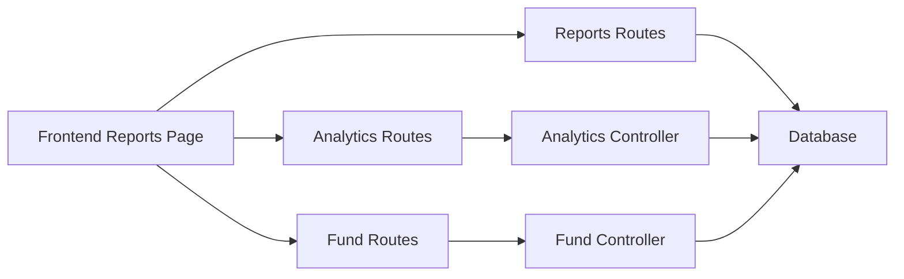

# Analytics & Reporting API

<cite>
**Referenced Files in This Document**
- [analyticsController.js](file://backend/src/controllers/analyticsController.js)
- [analytics.js](file://backend/src/routes/analytics.js)
- [reports.js](file://backend/src/routes/reports.js)
- [fundController.js](file://backend/src/controllers/fundController.js)
- [fundRoutes.js](file://backend/src/routes/fundRoutes.js)
- [logs.js](file://backend/src/routes/logs.js)
- [Reports-YVTslIB2.js](file://frontend/dist/assets/Reports-YVTslIB2.js)
</cite>

## Table of Contents
1. [Introduction](#introduction)
2. [Project Structure](#project-structure)
3. [Core Components](#core-components)
4. [Architecture Overview](#architecture-overview)
5. [Detailed Component Analysis](#detailed-component-analysis)
6. [Dependency Analysis](#dependency-analysis)
7. [Performance Considerations](#performance-considerations)
8. [Troubleshooting Guide](#troubleshooting-guide)
9. [Conclusion](#conclusion)

## Introduction
This document provides comprehensive API documentation for analytics and reporting endpoints in the petty cash management system. It covers:
- Expense analytics and trends
- Fund balance reports
- User activity metrics
- Financial summaries
- Query parameters for date ranges, filters, and aggregation levels
- Request schemas for custom report generation, export formats, and data visualization endpoints
- Performance considerations for large datasets and caching strategies

## Project Structure
The analytics and reporting functionality is implemented in the backend under the `/backend/src` directory, with dedicated controllers and routes. Frontend visualization components consume these APIs to present dashboards and reports.



**Diagram sources**
- [analyticsController.js:1-144](file://backend/src/controllers/analyticsController.js#L1-L144)
- [analytics.js:1-13](file://backend/src/routes/analytics.js#L1-L13)
- [reports.js:1-101](file://backend/src/routes/reports.js#L1-L101)
- [fundController.js:1-108](file://backend/src/controllers/fundController.js#L1-L108)
- [fundRoutes.js:10-10](file://backend/src/routes/fundRoutes.js#L10-L10)
- [logs.js:1-9](file://backend/src/routes/logs.js#L1-L9)
- [Reports-YVTslIB2.js:1-1000](file://frontend/dist/assets/Reports-YVTslIB2.js#L1-L1000)

**Section sources**
- [analyticsController.js:1-144](file://backend/src/controllers/analyticsController.js#L1-L144)
- [analytics.js:1-13](file://backend/src/routes/analytics.js#L1-L13)
- [reports.js:1-101](file://backend/src/routes/reports.js#L1-L101)
- [fundController.js:1-108](file://backend/src/controllers/fundController.js#L1-L108)
- [fundRoutes.js:10-10](file://backend/src/routes/fundRoutes.js#L10-L10)
- [logs.js:1-9](file://backend/src/routes/logs.js#L1-L9)
- [Reports-YVTslIB2.js:1-1000](file://frontend/dist/assets/Reports-YVTslIB2.js#L1-L1000)

## Core Components
- Analytics Controller: Provides dashboard statistics, expense trends, and breakdowns by category and department.
- Reports Routes: Offers financial summaries and Excel/PDF exports with filtering by date range and categories/departments.
- Fund Controller: Supplies fund balance calculations and replenishment history.
- Logs Routes: Provides audit trail for system activity.

**Section sources**
- [analyticsController.js:1-144](file://backend/src/controllers/analyticsController.js#L1-L144)
- [reports.js:1-101](file://backend/src/routes/reports.js#L1-L101)
- [fundController.js:1-108](file://backend/src/controllers/fundController.js#L1-L108)
- [logs.js:1-9](file://backend/src/routes/logs.js#L1-L9)

## Architecture Overview
The analytics and reporting endpoints are protected by authentication middleware and expose JSON responses. The frontend components construct requests with appropriate query parameters and handle exports.



**Diagram sources**
- [analytics.js:6-10](file://backend/src/routes/analytics.js#L6-L10)
- [analyticsController.js:3-67](file://backend/src/controllers/analyticsController.js#L3-L67)
- [reports.js:7-98](file://backend/src/routes/reports.js#L7-L98)
- [fundController.js:83-107](file://backend/src/controllers/fundController.js#L83-L107)

## Detailed Component Analysis

### Analytics Endpoints
- Endpoint: `GET /api/analytics/stats`
  - Purpose: Returns dashboard summary metrics including total expenses, daily spend, monthly spend, available fund balance, pending approvals, and top spending category.
  - Query Parameters: None
  - Response Schema:
    ```json
    {
      "success": true,
      "data": {
        "totalExpenses": 0,
        "dailyExpenses": 0,
        "monthlyExpenses": 0,
        "availableBalance": 0,
        "pendingApproval": 0,
        "pendingLiquidation": 0,
        "topCategory": "string",
        "recentExpenses": [],
        "departmentBreakdown": []
      }
    }
    ```

- Endpoint: `GET /api/analytics/trends`
  - Purpose: Returns expense trend data aggregated by day and category for the last 30 or 365 days.
  - Query Parameters:
    - `range`: "30" or "365" (default: "30")
  - Response Schema:
    ```json
    {
      "success": true,
      "data": [
        {
          "date": "YYYY-MM-DD",
          "total": 0,
          "[Category Name]": 0
        }
      ]
    }
    ```

- Endpoint: `GET /api/analytics/categories`
  - Purpose: Returns category-wise total expense breakdown.
  - Query Parameters: None
  - Response Schema:
    ```json
    {
      "success": true,
      "data": [
        {
          "name": "string",
          "total": 0
        }
      ]
    }
    ```

- Endpoint: `GET /api/analytics/departments`
  - Purpose: Returns department-wise total expense breakdown.
  - Query Parameters: None
  - Response Schema:
    ```json
    {
      "success": true,
      "data": [
        {
          "name": "string",
          "total": 0
        }
      ]
    }
    ```

**Section sources**
- [analytics.js:6-10](file://backend/src/routes/analytics.js#L6-L10)
- [analyticsController.js:3-67](file://backend/src/controllers/analyticsController.js#L3-L67)
- [analyticsController.js:69-103](file://backend/src/controllers/analyticsController.js#L69-L103)
- [analyticsController.js:105-123](file://backend/src/controllers/analyticsController.js#L105-L123)
- [analyticsController.js:125-143](file://backend/src/controllers/analyticsController.js#L125-L143)

### Reports Endpoints
- Endpoint: `GET /api/reports/summary`
  - Purpose: Returns financial summary for a given date range, including total spent, transaction count, and category/department distributions.
  - Query Parameters:
    - `startDate`: Date filter (inclusive)
    - `endDate`: Date filter (inclusive)
  - Response Schema:
    ```json
    {
      "success": true,
      "data": {
        "total_spent": 0,
        "total_count": 0,
        "categorySummary": [],
        "departmentSummary": []
      }
    }
    ```

- Endpoint: `GET /api/reports/export-excel`
  - Purpose: Exports filtered expense ledger to Excel (.xlsx).
  - Query Parameters:
    - `startDate`: Date filter (inclusive)
    - `endDate`: Date filter (inclusive)
    - `categoryId`: Filter by expense category
    - `departmentId`: Filter by department
  - Response: Binary Excel file attachment

- Endpoint: `GET /api/reports/export-pdf`
  - Purpose: Generates a PDF report from the current UI state (visual report).
  - Query Parameters: Same as summary endpoint
  - Response: Binary PDF file attachment

**Section sources**
- [reports.js:70-98](file://backend/src/routes/reports.js#L70-L98)
- [reports.js:9-68](file://backend/src/routes/reports.js#L9-L68)
- [Reports-YVTslIB2.js:1-1000](file://frontend/dist/assets/Reports-YVTslIB2.js#L1-L1000)

### Fund Balance Endpoints
- Endpoint: `GET /api/funds/balance`
  - Purpose: Returns fund balance summary including total inflows, outflows, and current balance.
  - Query Parameters: None
  - Response Schema:
    ```json
    {
      "success": true,
      "data": {
        "balance": 0,
        "totalIn": 0,
        "totalOut": 0
      }
    }
    ```

- Endpoint: `GET /api/funds`
  - Purpose: Retrieves fund replenishment history with user attribution.
  - Query Parameters: None
  - Response Schema:
    ```json
    {
      "success": true,
      "data": [
        {
          "id": 0,
          "amount": 0,
          "reference_no": "string",
          "remarks": "string",
          "date": "YYYY-MM-DD",
          "added_by": 0,
          "adder_name": "string"
        }
      ]
    }
    ```

- Endpoint: `POST /api/funds`
  - Purpose: Adds a new fund replenishment entry.
  - Request Body Schema:
    ```json
    {
      "amount": 0,
      "reference_no": "string",
      "remarks": "string",
      "date": "YYYY-MM-DD"
    }
  - Response Schema:
    ```json
    {
      "success": true,
      "data": { "id": 0, ... }
    }
    ```

- Endpoint: `DELETE /api/funds/:id`
  - Purpose: Removes a fund replenishment entry.
  - Path Parameters:
    - `id`: Numeric fund entry identifier
  - Response Schema:
    ```json
    {
      "success": true,
      "message": "string"
    }
    ```

**Section sources**
- [fundController.js](file://backend/src/controllers/fundController.js#L5-L15)
- [fundController.js](file://backend/src/controllers/fundController.js#L17-L56)
- [fundController.js](file://backend/src/controllers/fundController.js#L58-L81)
- [fundController.js](file://backend/src/controllers/fundController.js#L83-L107)
- [fundRoutes.js](file://backend/src/routes/fundRoutes.js#L10-L10)

### User Activity Metrics
- Endpoint: `GET /api/logs`
  - Purpose: Retrieves system audit logs for Super Admin users.
  - Query Parameters: None
  - Response Schema:
    ```json
    {
      "success": true,
      "data": [
        {
          "id": 0,
          "user_id": 0,
          "action": "string",
          "details": "string",
          "ip_address": "string",
          "created_at": "YYYY-MM-DDTHH:mm:ss.sssZ",
          "full_name": "string",
          "username": "string"
        }
      ]
    }
    ```

**Section sources**
- [logs.js](file://backend/src/routes/logs.js#L6-L7)
- [logs.js](file://backend/src/routes/logs.js#L1-L9)

## Dependency Analysis
- Authentication: All analytics and reporting endpoints are protected by the `protect` middleware.
- Data Access: Controllers use Knex.js queries to aggregate and pivot data from the database.
- Frontend Integration: The Reports page constructs requests with date ranges and filters, and handles binary downloads for Excel/PDF exports.



**Diagram sources**
- [analytics.js:6-10](file://backend/src/routes/analytics.js#L6-L10)
- [reports.js:7-98](file://backend/src/routes/reports.js#L7-L98)
- [fundRoutes.js:10-10](file://backend/src/routes/fundRoutes.js#L10-L10)
- [analyticsController.js:1-144](file://backend/src/controllers/analyticsController.js#L1-L144)
- [fundController.js:1-108](file://backend/src/controllers/fundController.js#L1-L108)

**Section sources**
- [analytics.js:6-10](file://backend/src/routes/analytics.js#L6-L10)
- [reports.js:7-98](file://backend/src/routes/reports.js#L7-L98)
- [fundRoutes.js:10-10](file://backend/src/routes/fundRoutes.js#L10-L10)
- [analyticsController.js:1-144](file://backend/src/controllers/analyticsController.js#L1-L144)
- [fundController.js:1-108](file://backend/src/controllers/fundController.js#L1-L108)

## Performance Considerations
- Aggregation Queries: Use indexed date columns and category/department foreign keys to optimize SUM and GROUP BY operations.
- Pagination: For large datasets, implement pagination parameters (page, limit) to avoid heavy payloads.
- Caching Strategies:
  - Dashboard stats: Cache `/analytics/stats` for short TTL (e.g., minutes) to reflect recent changes while reducing DB load.
  - Trends: Cache pivoted trend data per category/date range to minimize repeated pivot operations.
  - Summary Reports: Cache `/reports/summary` keyed by date range and filters for common combinations.
  - Exports: Generate Excel/PDF on demand or precompute for frequent ranges; cache generated files with invalidation on data changes.
- Indexes: Ensure composite indexes on `(date, status)` and `(category_id, department_id, status)` for efficient filtering and aggregation.
- Frontend Optimization: Debounce filter changes and batch chart updates to reduce request frequency.

[No sources needed since this section provides general guidance]

## Troubleshooting Guide
- Authentication Errors: Ensure bearer token is included in Authorization header for protected endpoints.
- Empty or Unexpected Data:
  - Verify date range parameters (`startDate`, `endDate`) are valid ISO dates.
  - Confirm category and department filters correspond to existing IDs.
- Export Failures:
  - Check browser download permissions and network stability.
  - Validate that the requested date range contains data.
- Fund Balance Discrepancies:
  - Review `/funds` entries and ensure statuses align with approved/liquidated expense records.

**Section sources**
- [analytics.js:6-10](file://backend/src/routes/analytics.js#L6-L10)
- [reports.js:70-98](file://backend/src/routes/reports.js#L70-L98)
- [fundController.js:83-107](file://backend/src/controllers/fundController.js#L83-L107)

## Conclusion
The analytics and reporting endpoints provide a robust foundation for financial oversight, offering dashboard insights, trend analysis, category/department breakdowns, fund balances, and export capabilities. By implementing the recommended performance and caching strategies, the system can scale effectively for large datasets while maintaining responsive user experiences.