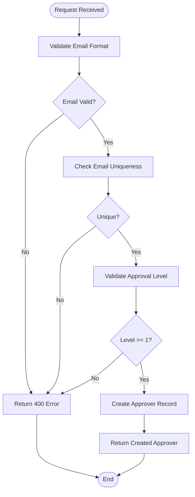

# Admin Approver Management

<cite>
**Referenced Files in This Document**
- [approvalController.js](file://backend/src/controllers/approvalController.js)
- [approval.js](file://backend/src/routes/approval.js)
- [approvalService.js](file://backend/src/services/approvalService.js)
- [20260611000000_add_liquidation_approval_workflow.js](file://backend/src/db/migrations/20260611000000_add_liquidation_approval_workflow.js)
- [ApprovalSettingsPanel.jsx](file://frontend/src/components/ApprovalSettingsPanel.jsx)
</cite>

## Table of Contents
1. [Introduction](#introduction)
2. [API Endpoints](#api-endpoints)
3. [Authorization Requirements](#authorization-requirements)
4. [Approver Data Schema](#approver-data-schema)
5. [Endpoint Specifications](#endpoint-specifications)
6. [Validation Rules](#validation-rules)
7. [Hierarchical Approval Structure](#hierarchical-approval-structure)
8. [Example Configurations](#example-configurations)
9. [Frontend Integration](#frontend-integration)
10. [Troubleshooting Guide](#troubleshooting-guide)
11. [Conclusion](#conclusion)

## Introduction

The Admin Approver Management system provides comprehensive endpoint management for configuring and maintaining organizational approval hierarchies. This system enables Super Admin users to manage approvers who participate in multi-level approval workflows for expense liquidations and other financial transactions.

The system implements a hierarchical approval structure where approvers are organized by approval levels, with Level 1 representing the primary approver and subsequent levels forming the approval chain. The architecture supports both active and inactive approvers, allowing for flexible management of approval team members.

## API Endpoints

The approver management API consists of four primary endpoints designed for administrator-only access:

| Endpoint | Method | Description |
|----------|--------|-------------|
| `/approval/approvers` | GET | List all active approvers in the system |
| `/approval/approvers` | POST | Add a new approver to the approval hierarchy |
| `/approval/approvers/:id` | PUT | Update an existing approver's information |
| `/approval/approvers/:id` | DELETE | Remove an approver from the system |

**Section sources**
- [approval.js:28-31](file://backend/src/routes/approval.js#L28-L31)

## Authorization Requirements

All approver management endpoints require Super Admin privileges. The authorization middleware enforces strict access control:

- **Required Role**: Super Admin
- **Access Level**: Administrator-only
- **Scope**: Full CRUD operations on approver management
- **Protection Mechanism**: Route-level authorization middleware

The authorization requirement is enforced through the route definition pattern:
```javascript
router.get('/approvers', authorize('Super Admin'), listApprovers);
```

**Section sources**
- [approval.js:25-31](file://backend/src/routes/approval.js#L25-L31)

## Approver Data Schema

The approver entity follows a structured schema designed for multi-level approval hierarchies:

| Field | Type | Required | Default | Description |
|-------|------|----------|---------|-------------|
| `id` | Integer | No | Auto-generated | Unique identifier for the approver record |
| `email` | String | Yes | None | Approver's email address (unique constraint) |
| `name` | String | No | Null | Approver's display name |
| `approval_level` | Integer | Yes | 1 | Hierarchical level in approval chain (1 = primary) |
| `is_active` | Boolean | No | True | Whether the approver is currently active |
| `created_at` | Timestamp | No | Current timestamp | Record creation timestamp |
| `updated_at` | Timestamp | No | Current timestamp | Last modification timestamp |

**Section sources**
- [20260611000000_add_liquidation_approval_workflow.js:22-31](file://backend/src/db/migrations/20260611000000_add_liquidation_approval_workflow.js#L22-L31)

## Endpoint Specifications

### GET /approval/approvers

**Description**: Retrieves all active approvers from the system, ordered by approval level.

**Response Format**:
```json
{
  "success": true,
  "data": [
    {
      "id": 1,
      "email": "primary@approvers.local",
      "name": "Primary Approver",
      "approval_level": 1,
      "is_active": true,
      "created_at": "2026-06-11T00:00:00.000Z",
      "updated_at": "2026-06-11T00:00:00.000Z"
    }
  ]
}
```

**Section sources**
- [approvalController.js:21-28](file://backend/src/controllers/approvalController.js#L21-L28)
- [approvalService.js:47-54](file://backend/src/services/approvalService.js#L47-L54)

### POST /approval/approvers

**Description**: Creates a new approver in the system with specified attributes.

**Request Body**:
```json
{
  "email": "approver@example.com",
  "name": "John Doe",
  "approval_level": 2,
  "is_active": true
}
```

**Response**: Returns the created approver object with generated ID.

**Section sources**
- [approvalController.js:30-41](file://backend/src/controllers/approvalController.js#L30-L41)
- [approvalService.js:573-582](file://backend/src/services/approvalService.js#L573-L582)

### PUT /approval/approvers/:id

**Description**: Updates an existing approver's information.

**Path Parameters**:
- `id` (required): Approver's unique identifier

**Request Body**: Partial approver object with fields to update.

**Response**: Returns the updated approver object.

**Section sources**
- [approvalController.js:43-50](file://backend/src/controllers/approvalController.js#L43-L50)
- [approvalService.js:573-582](file://backend/src/services/approvalService.js#L573-L582)

### DELETE /approval/approvers/:id

**Description**: Removes an approver from the system.

**Response**: Confirmation message indicating successful removal.

**Section sources**
- [approvalController.js:52-59](file://backend/src/controllers/approvalController.js#L52-L59)
- [approvalService.js:584-586](file://backend/src/services/approvalService.js#L584-L586)

## Validation Rules

The system implements comprehensive validation for approver data:

### Email Validation
- **Format**: Must be a valid email address
- **Uniqueness**: Email addresses must be unique across all approvers
- **Requirement**: Email is mandatory for all approvers

### Approval Level Validation
- **Range**: Must be greater than or equal to 1
- **Ordering**: Levels determine approval hierarchy order
- **Primary Level**: Level 1 represents the primary approver

### Active Status Validation
- **Type**: Boolean value
- **Default**: True if not specified
- **Impact**: Only active approvers participate in approvals

### Request Validation Flow



**Diagram sources**
- [approvalController.js:32-35](file://backend/src/controllers/approvalController.js#L32-L35)

**Section sources**
- [approvalController.js:32-35](file://backend/src/controllers/approvalController.js#L32-L35)

## Hierarchical Approval Structure

The approval system implements a multi-level hierarchy where approvers are organized by approval levels:

### Level Organization
- **Level 1**: Primary approver (most senior)
- **Level 2**: Secondary approver
- **Level n**: Additional approvers in sequence

### Approval Flow
1. Expense submitted above threshold
2. System identifies approver at current level
3. Approver receives approval notification
4. Approval or rejection processed
5. Next approver in hierarchy notified (if applicable)

### Active vs Inactive Approvers
- **Active**: Participate in approval workflows
- **Inactive**: Excluded from current approval processes
- **Transition**: Can be reactivated when needed

**Section sources**
- [approvalService.js:47-54](file://backend/src/services/approvalService.js#L47-L54)

## Example Configurations

### Basic Multi-Level Setup

```json
[
  {
    "email": "ceo@company.com",
    "name": "CEO",
    "approval_level": 1,
    "is_active": true
  },
  {
    "email": "finance@company.com", 
    "name": "Finance Director",
    "approval_level": 2,
    "is_active": true
  },
  {
    "email": "dept-head@company.com",
    "name": "Department Head",
    "approval_level": 3,
    "is_active": true
  }
]
```

### Mixed Active/Inactive Configuration

```json
[
  {
    "email": "manager@company.com",
    "name": "Team Manager",
    "approval_level": 1,
    "is_active": true
  },
  {
    "email": "senior-approver@company.com",
    "name": "Senior Approver", 
    "approval_level": 2,
    "is_active": false  // Temporarily inactive
  }
]
```

### Minimal Configuration

```json
[
  {
    "email": "primary@company.com",
    "name": "Primary Approver",
    "approval_level": 1,
    "is_active": true
  }
]
```

## Frontend Integration

The frontend Approval Settings Panel provides comprehensive management interface:

### Component Features
- **Real-time Updates**: Approver list updates immediately after changes
- **Form Validation**: Client-side validation for email format and level requirements
- **Visual Hierarchy**: Clear display of approver levels and order
- **Bulk Operations**: Add/remove approvers with single clicks

### User Interface Elements
- **Email Input**: Validates email format before submission
- **Name Field**: Optional display name field
- **Level Selector**: Minimum value of 2 for additional approvers
- **Action Buttons**: Add, edit, and delete operations

**Section sources**
- [ApprovalSettingsPanel.jsx:189-251](file://frontend/src/components/ApprovalSettingsPanel.jsx#L189-L251)

## Troubleshooting Guide

### Common Issues and Solutions

#### 401 Unauthorized Access
**Symptoms**: Requests rejected with unauthorized status
**Cause**: Missing or invalid authentication token
**Solution**: Ensure proper login and authentication header inclusion

#### 403 Forbidden Access  
**Symptoms**: Access denied despite authentication
**Cause**: Non-Super Admin user attempting approver management
**Solution**: Verify user has Super Admin role assignment

#### 400 Bad Request - Email Validation
**Symptoms**: Email format validation errors
**Cause**: Invalid email address format
**Solution**: Use proper email format (user@domain.com)

#### 400 Bad Request - Duplicate Email
**Symptoms**: Email uniqueness validation failures
**Cause**: Email already exists in approver database
**Solution**: Use unique email address or update existing approver

#### 404 Not Found - Approver Not Found
**Symptoms**: Attempted update/delete of non-existent approver
**Cause**: Invalid approver ID
**Solution**: Verify approver ID exists in system

### Debugging Steps
1. Verify Super Admin role assignment
2. Check email format validity
3. Confirm approval level range (≥ 1)
4. Validate approver ID existence
5. Review system logs for detailed error messages

**Section sources**
- [approvalController.js:32-35](file://backend/src/controllers/approvalController.js#L32-L35)

## Conclusion

The Admin Approver Management system provides a robust foundation for organizational approval workflows. Its hierarchical structure supports complex approval chains while maintaining simplicity for basic configurations. The system's emphasis on Super Admin-only access ensures appropriate governance of approval authority, while comprehensive validation protects data integrity.

Key benefits include:
- **Flexible Hierarchy**: Support for multi-level approval chains
- **Role-Based Security**: Strict access controls for administrator functions  
- **Real-time Management**: Immediate updates to approval workflows
- **Comprehensive Validation**: Built-in data quality checks
- **User-Friendly Interface**: Intuitive management through frontend components

The system successfully balances administrative needs with operational efficiency, providing organizations with the tools necessary to maintain effective financial oversight and approval processes.