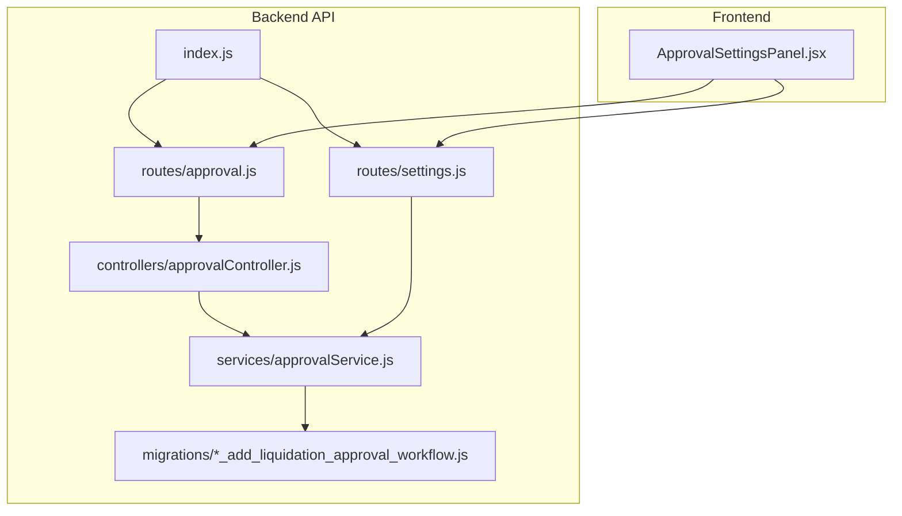
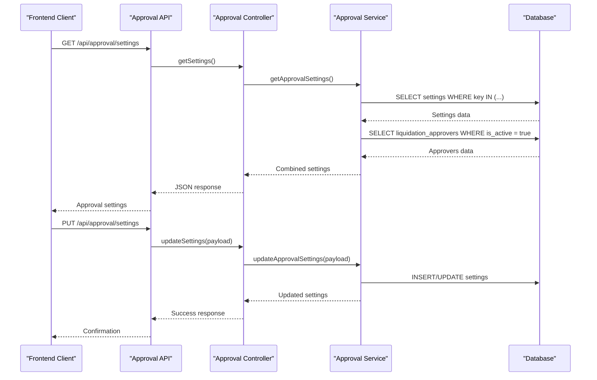
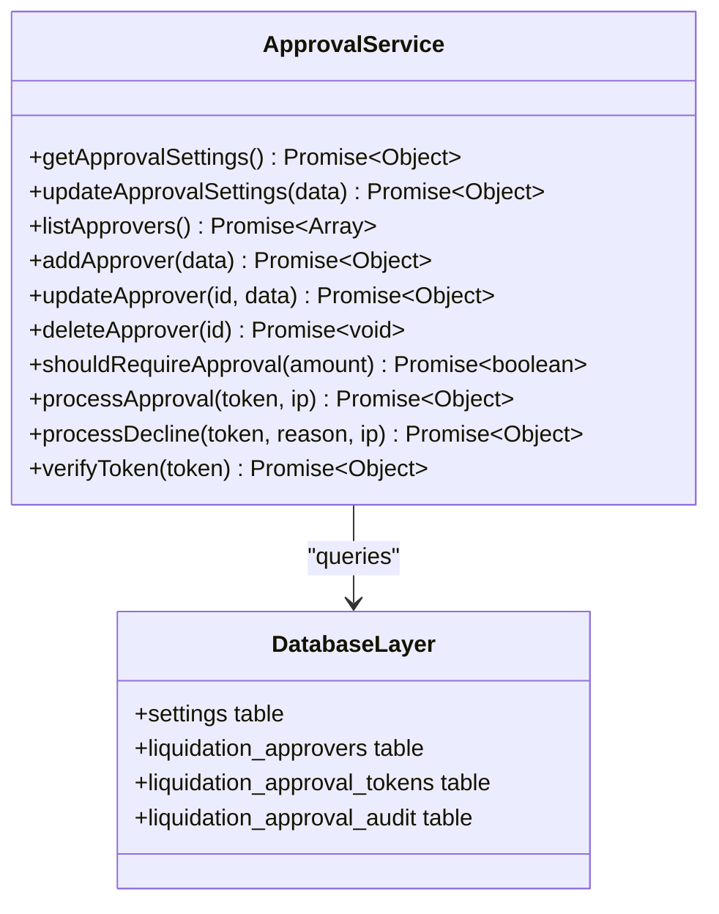
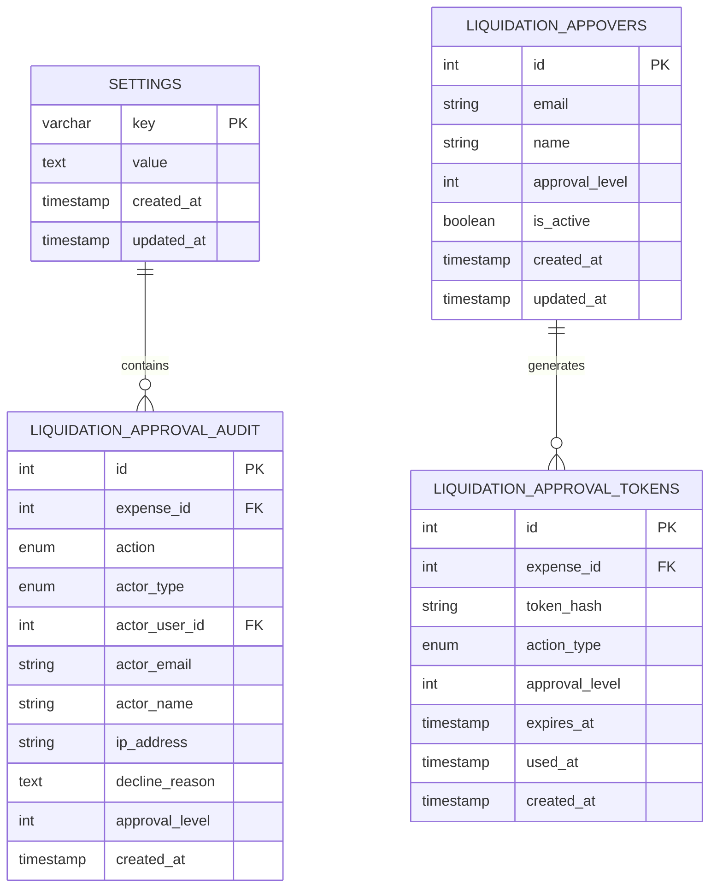
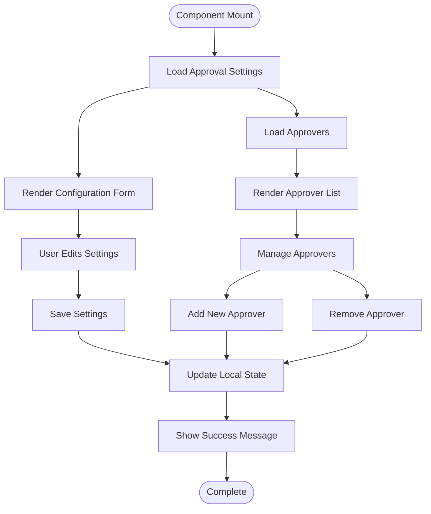
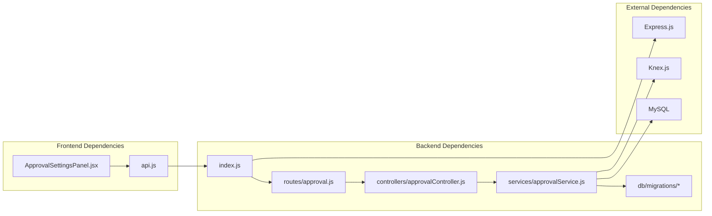

# Approval Settings Configuration

<cite>
**Referenced Files in This Document**
- [approval.js](file://backend/src/routes/approval.js)
- [approvalController.js](file://backend/src/controllers/approvalController.js)
- [approvalService.js](file://backend/src/services/approvalService.js)
- [settings.js](file://backend/src/routes/settings.js)
- [ApprovalSettingsPanel.jsx](file://frontend/src/components/ApprovalSettingsPanel.jsx)
- [20260611000000_add_liquidation_approval_workflow.js](file://backend/src/db/migrations/20260611000000_add_liquidation_approval_workflow.js)
- [index.js](file://backend/src/index.js)
</cite>

## Table of Contents
1. [Introduction](#introduction)
2. [Project Structure](#project-structure)
3. [Core Components](#core-components)
4. [Architecture Overview](#architecture-overview)
5. [Detailed Component Analysis](#detailed-component-analysis)
6. [Dependency Analysis](#dependency-analysis)
7. [Performance Considerations](#performance-considerations)
8. [Troubleshooting Guide](#troubleshooting-guide)
9. [Conclusion](#conclusion)

## Introduction
This document provides comprehensive API documentation for the approval system configuration endpoints in the Petty Cash Management System. It covers the retrieval and updating of approval settings, including approval thresholds, escalation rules, notification preferences, and workflow timeouts. The documentation includes practical examples for setting up multi-level approval hierarcharchies and customizing approval workflows.

## Project Structure
The approval settings configuration spans both backend API endpoints and frontend components:



**Diagram sources**
- [index.js:177](file://backend/src/index.js#L177)
- [approval.js:1](file://backend/src/routes/approval.js#L1)
- [settings.js:1](file://backend/src/routes/settings.js#L1)
- [approvalController.js:1](file://backend/src/controllers/approvalController.js#L1)
- [approvalService.js:1](file://backend/src/services/approvalService.js#L1)
- [ApprovalSettingsPanel.jsx:1](file://frontend/src/components/ApprovalSettingsPanel.jsx#L1)

**Section sources**
- [index.js:160-177](file://backend/src/index.js#L160-L177)
- [approval.js:1](file://backend/src/routes/approval.js#L1)
- [settings.js:1](file://backend/src/routes/settings.js#L1)
- [approvalController.js:1](file://backend/src/controllers/approvalController.js#L1)
- [approvalService.js:1](file://backend/src/services/approvalService.js#L1)
- [ApprovalSettingsPanel.jsx:1](file://frontend/src/components/ApprovalSettingsPanel.jsx#L1)

## Core Components

### Approval Settings API Endpoints

#### GET /api/approval/settings
Retrieves current approval system configuration including:
- Approval threshold amount
- Email approval enablement flag
- Primary approver email address
- Multi-level approver chain

**Response Format:**
```json
{
  "success": true,
  "data": {
    "liquidation_approval_threshold": 10000,
    "liquidation_approval_email_enabled": true,
    "liquidation_approval_recipient_email": "approver@company.com",
    "approvers": [
      {
        "id": 1,
        "email": "manager1@company.com",
        "name": "Manager One",
        "approval_level": 1,
        "is_active": true
      }
    ]
  }
}
```

#### PUT /api/approval/settings
Updates approval system configuration with partial updates supported.

**Request Body:**
```json
{
  "liquidation_approval_threshold": 15000,
  "liquidation_approval_email_enabled": false,
  "liquidation_approval_recipient_email": ""
}
```

**Response:**
```json
{
  "success": true,
  "data": {
    "liquidation_approval_threshold": 15000,
    "liquidation_approval_email_enabled": false,
    "liquidation_approval_recipient_email": "",
    "approvers": []
  },
  "message": "Approval settings updated"
}
```

#### Approver Management Endpoints
- GET `/api/approval/approvers` - List all active approvers
- POST `/api/approval/approvers` - Add new approver
- PUT `/api/approval/approvers/:id` - Update approver
- DELETE `/api/approval/approvers/:id` - Remove approver

**Section sources**
- [approval.js:25-33](file://backend/src/routes/approval.js#L25-L33)
- [approvalController.js:3-19](file://backend/src/controllers/approvalController.js#L3-L19)
- [approvalService.js:23-82](file://backend/src/services/approvalService.js#L23-L82)

### Settings Endpoint (General System Settings)
While primarily for general system settings, the approval workflow relies on settings persistence:

#### GET /api/settings
Returns system-wide settings including expense units configuration.

#### POST /api/settings/expense-units
Adds new expense unit to the system configuration.

**Section sources**
- [settings.js:6-35](file://backend/src/routes/settings.js#L6-L35)
- [settings.js:37-70](file://backend/src/routes/settings.js#L37-L70)

## Architecture Overview



**Diagram sources**
- [approval.js:25-33](file://backend/src/routes/approval.js#L25-L33)
- [approvalController.js:3-19](file://backend/src/controllers/approvalController.js#L3-L19)
- [approvalService.js:23-82](file://backend/src/services/approvalService.js#L23-L82)

## Detailed Component Analysis

### Approval Settings Service Layer

The approval service encapsulates all approval-related business logic:



**Diagram sources**
- [approvalService.js:23-590](file://backend/src/services/approvalService.js#L23-L590)

### Database Schema for Approval Workflow

The approval system relies on several specialized tables:



**Diagram sources**
- [20260611000000_add_liquidation_approval_workflow.js:21-62](file://backend/src/db/migrations/20260611000000_add_liquidation_approval_workflow.js#L21-L62)

### Frontend Integration

The frontend ApprovalSettingsPanel component provides a user interface for managing approval configurations:



**Diagram sources**
- [ApprovalSettingsPanel.jsx:21-76](file://frontend/src/components/ApprovalSettingsPanel.jsx#L21-L76)

**Section sources**
- [approvalService.js:23-590](file://backend/src/services/approvalService.js#L23-L590)
- [20260611000000_add_liquidation_approval_workflow.js:1-179](file://backend/src/db/migrations/20260611000000_add_liquidation_approval_workflow.js#L1-L179)
- [ApprovalSettingsPanel.jsx:1-252](file://frontend/src/components/ApprovalSettingsPanel.jsx#L1-L252)

## Dependency Analysis



**Diagram sources**
- [index.js:177](file://backend/src/index.js#L177)
- [approval.js:1](file://backend/src/routes/approval.js#L1)
- [approvalController.js:1](file://backend/src/controllers/approvalController.js#L1)
- [approvalService.js:1](file://backend/src/services/approvalService.js#L1)

**Section sources**
- [index.js:177](file://backend/src/index.js#L177)
- [approval.js:1](file://backend/src/routes/approval.js#L1)
- [approvalController.js:1](file://backend/src/controllers/approvalController.js#L1)
- [approvalService.js:1](file://backend/src/services/approvalService.js#L1)

## Performance Considerations

### Database Optimization
- Settings queries use indexed keys for fast retrieval
- Approver lists are filtered by active status only
- Token verification uses hashed tokens for security and performance

### Caching Strategy
- Settings are loaded once per session and cached locally in the frontend
- Database queries are optimized with appropriate indexing on frequently queried columns

### Scalability Notes
- Multi-level approval chains scale linearly with approver count
- Token-based approval eliminates polling overhead
- Email notifications are queued asynchronously

## Troubleshooting Guide

### Common Issues and Solutions

**Issue: Approval emails not sending**
- Verify email approval is enabled in settings
- Check SMTP configuration in environment variables
- Review email logs for delivery failures

**Issue: Approver not receiving emails**
- Confirm approver email is properly configured
- Verify approver is marked as active
- Check email template content and formatting

**Issue: Settings not persisting**
- Ensure proper authentication as Super Admin
- Verify database connectivity
- Check for migration errors during startup

**Section sources**
- [approvalService.js:252-290](file://backend/src/services/approvalService.js#L252-L290)
- [approvalService.js:558-586](file://backend/src/services/approvalService.js#L558-L586)

## Conclusion

The approval settings configuration system provides a robust foundation for managing petty cash liquidation approvals. The API endpoints offer comprehensive control over approval thresholds, email notifications, and multi-level approver hierarchies. The frontend component provides an intuitive interface for administrators to configure and manage approval workflows. The system's design emphasizes security through token-based approvals, scalability through asynchronous processing, and maintainability through clear separation of concerns.

Key benefits include:
- Flexible multi-level approval chains
- Secure token-based approval process
- Comprehensive audit trails
- Real-time notification system
- Extensible configuration model

The implementation follows best practices for enterprise-grade approval systems while maintaining simplicity for typical organizational needs.