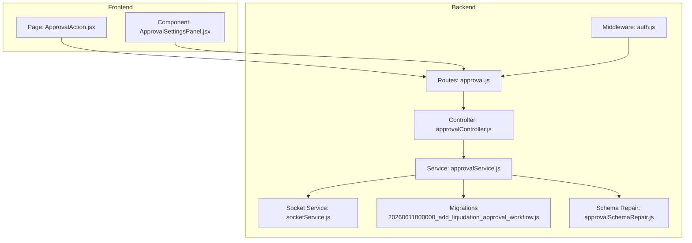
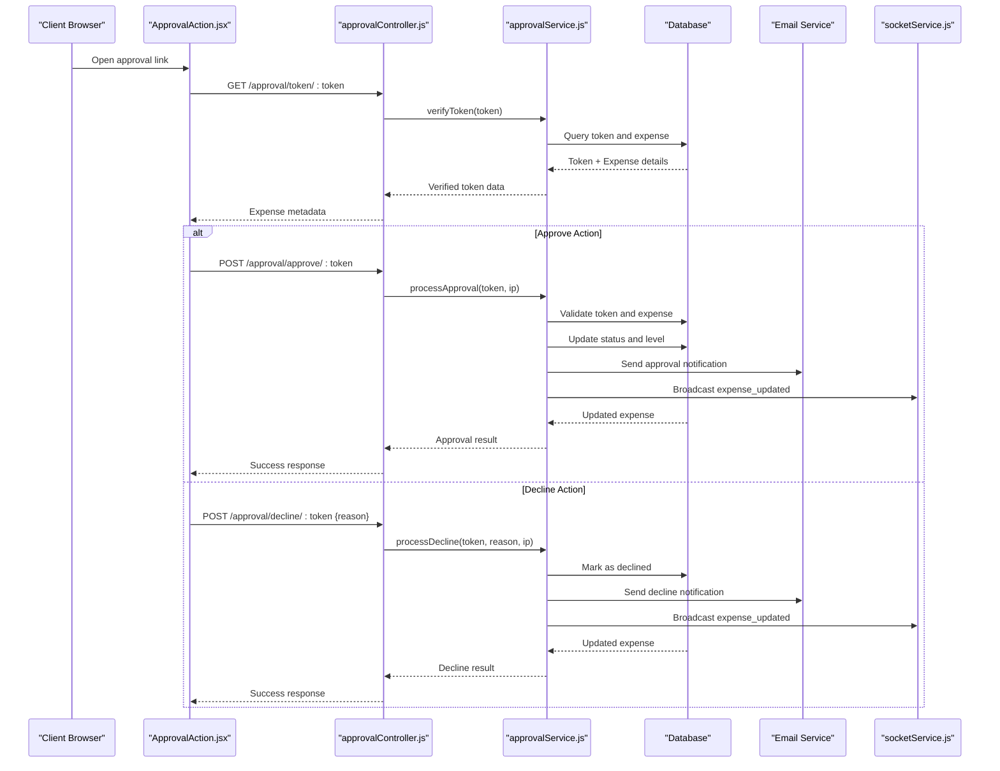
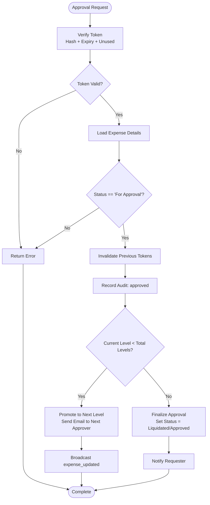
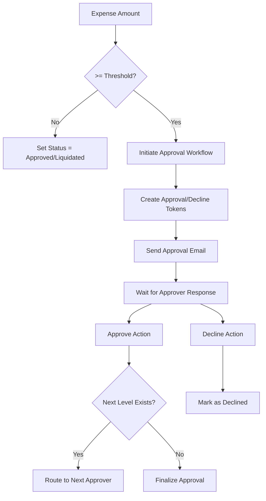

# Approval Workflow API

<cite>
**Referenced Files in This Document**
- [approvalController.js](file://backend/src/controllers/approvalController.js)
- [approval.js](file://backend/src/routes/approval.js)
- [approvalService.js](file://backend/src/services/approvalService.js)
- [20260611000000_add_liquidation_approval_workflow.js](file://backend/src/db/migrations/20260611000000_add_liquidation_approval_workflow.js)
- [20260611010000_fix_expense_status_varchar.js](file://backend/src/db/migrations/20260611010000_fix_expense_status_varchar.js)
- [approvalSchemaRepair.js](file://backend/src/utils/approvalSchemaRepair.js)
- [socketService.js](file://backend/src/services/socketService.js)
- [auth.js](file://backend/src/middleware/auth.js)
- [ApprovalAction.jsx](file://frontend/src/pages/ApprovalAction.jsx)
- [ApprovalSettingsPanel.jsx](file://frontend/src/components/ApprovalSettingsPanel.jsx)
</cite>

## Update Summary
**Changes Made**
- Enhanced approval workflow endpoints with comprehensive approval management functionality
- Added email health monitoring endpoint for SMTP configuration verification
- Expanded approver management capabilities with full CRUD operations
- Improved token verification and validation mechanisms
- Enhanced audit trail reporting with detailed activity logs
- Added comprehensive frontend integration for approval settings and management

## Table of Contents
1. [Introduction](#introduction)
2. [Project Structure](#project-structure)
3. [Core Components](#core-components)
4. [Architecture Overview](#architecture-overview)
5. [Detailed Component Analysis](#detailed-component-analysis)
6. [API Reference](#api-reference)
7. [Approval Schema and Data Models](#approval-schema-and-data-models)
8. [Threshold Detection and Multi-Level Routing](#threshold-detection-and-multi-level-routing)
9. [Real-Time Updates](#real-time-updates)
10. [Security and Authentication](#security-and-authentication)
11. [Troubleshooting Guide](#troubleshooting-guide)
12. [Conclusion](#conclusion)

## Introduction
This document provides comprehensive API documentation for the approval workflow system. It covers approval request submission, email-based approval processing, approval status management, token-based approval endpoints, threshold detection algorithms, multi-level approval routing, request schemas, audit trail queries, and real-time approval status updates. The system supports secure, email-triggered approvals with configurable thresholds and hierarchical approver levels. The enhanced system now includes comprehensive approval management functionality, settings retrieval and updates, approver management (add, update, delete), token verification for email approvals, and detailed audit trail reporting.

## Project Structure
The approval workflow spans backend controllers, services, database migrations, and frontend components:

**Diagram sources**
- [approval.js:1-38](file://backend/src/routes/approval.js#L1-L38)
- [approvalController.js:1-142](file://backend/src/controllers/approvalController.js#L1-L142)
- [approvalService.js:1-622](file://backend/src/services/approvalService.js#L1-L622)
- [auth.js:1-36](file://backend/src/middleware/auth.js#L1-L36)
- [socketService.js:1-102](file://backend/src/services/socketService.js#L1-L102)
- [20260611000000_add_liquidation_approval_workflow.js:1-179](file://backend/src/db/migrations/20260611000000_add_liquidation_approval_workflow.js#L1-L179)
- [approvalSchemaRepair.js:1-100](file://backend/src/utils/approvalSchemaRepair.js#L1-L100)
- [ApprovalAction.jsx:1-199](file://frontend/src/pages/ApprovalAction.jsx#L1-L199)
- [ApprovalSettingsPanel.jsx:1-252](file://frontend/src/components/ApprovalSettingsPanel.jsx#L1-L252)

**Section sources**
- [approval.js:1-38](file://backend/src/routes/approval.js#L1-L38)
- [approvalController.js:1-142](file://backend/src/controllers/approvalController.js#L1-L142)
- [approvalService.js:1-622](file://backend/src/services/approvalService.js#L1-L622)
- [auth.js:1-36](file://backend/src/middleware/auth.js#L1-L36)
- [socketService.js:1-102](file://backend/src/services/socketService.js#L1-L102)
- [20260611000000_add_liquidation_approval_workflow.js:1-179](file://backend/src/db/migrations/20260611000000_add_liquidation_approval_workflow.js#L1-L179)
- [approvalSchemaRepair.js:1-100](file://backend/src/utils/approvalSchemaRepair.js#L1-L100)
- [ApprovalAction.jsx:1-199](file://frontend/src/pages/ApprovalAction.jsx#L1-L199)
- [ApprovalSettingsPanel.jsx:1-252](file://frontend/src/components/ApprovalSettingsPanel.jsx#L1-L252)

## Core Components
- **Route Layer**: Defines public token-based endpoints and protected admin endpoints for managing approval settings and approvers.
- **Controller Layer**: Handles HTTP requests/responses, validates inputs, and orchestrates service operations.
- **Service Layer**: Implements approval logic, token generation/verification, email notifications, audit logging, and real-time broadcasting.
- **Schema and Migrations**: Define database tables for approvers, tokens, audit trails, and approval settings.
- **Frontend Integration**: Provides seamless token-based approval/decline UI with auto-submission and comprehensive approval settings management.

Key responsibilities:
- Threshold-based approval initiation
- Multi-level approval routing
- Secure token-based actions
- Audit trail maintenance
- Real-time status updates
- Comprehensive approver management
- Email health monitoring

**Section sources**
- [approval.js:18-35](file://backend/src/routes/approval.js#L18-L35)
- [approvalController.js:1-142](file://backend/src/controllers/approvalController.js#L1-L142)
- [approvalService.js:23-622](file://backend/src/services/approvalService.js#L23-L622)

## Architecture Overview
The approval workflow follows a token-based, asynchronous model with email notifications and real-time updates:

**Diagram sources**
- [approvalController.js:62-99](file://backend/src/controllers/approvalController.js#L62-L99)
- [approvalService.js:444-587](file://backend/src/services/approvalService.js#L444-L587)
- [socketService.js:88-94](file://backend/src/services/socketService.js#L88-L94)
- [ApprovalAction.jsx:20-81](file://frontend/src/pages/ApprovalAction.jsx#L20-L81)

## Detailed Component Analysis

### Enhanced Token-Based Approval Endpoints
Public endpoints for email-based approvals:
- GET `/approval/token/:token` - Verify token validity and retrieve expense metadata
- POST `/approval/approve/:token` - Process approval using the approval token
- POST `/approval/decline/:token` - Process decline using the decline token

Protected admin endpoints:
- GET `/approval/settings` - Retrieve approval settings
- PUT `/approval/settings` - Update approval settings
- GET `/approval/approvers` - List active approvers
- POST `/approval/approvers` - Add new approver
- PUT `/approval/approvers/:id` - Update approver
- DELETE `/approval/approvers/:id` - Remove approver
- GET `/approval/audit/:expenseId` - Retrieve audit trail for an expense
- GET `/approval/email-health` - Check email configuration health

Authorization:
- Admin endpoints require JWT Bearer token and Super Admin role
- Token-based endpoints are publicly accessible but secured via hashed tokens

**Section sources**
- [approval.js:18-35](file://backend/src/routes/approval.js#L18-L35)
- [approvalController.js:1-142](file://backend/src/controllers/approvalController.js#L1-L142)
- [auth.js:3-33](file://backend/src/middleware/auth.js#L3-L33)

### Comprehensive Approval Processing Logic
The service layer manages approval workflows with enhanced functionality:

**Diagram sources**
- [approvalService.js:444-541](file://backend/src/services/approvalService.js#L444-L541)

**Section sources**
- [approvalService.js:444-587](file://backend/src/services/approvalService.js#L444-L587)

### Advanced Audit Trail Management
The system maintains a comprehensive audit trail with enhanced features:
- Actions: created, submitted, approved, declined
- Actor types: user, email
- IP address tracking
- Decline reasons
- Approval levels
- Activity logs integration
- Requester notifications

Enhanced audit retrieval endpoint:
- GET `/approval/audit/:expenseId` - Returns chronological audit events with requester notifications and activity logs

**Section sources**
- [approvalService.js:119-214](file://backend/src/services/approvalService.js#L119-L214)
- [approval.js:34-34](file://backend/src/routes/approval.js#L34-L34)

### Multi-Level Approval Routing with Enhanced Management
Approver hierarchy with comprehensive management:
- Active approvers sorted by approval_level
- Primary approver can be configured via email
- Token creation per approval level
- Automatic routing to next approver when levels remain
- Full CRUD operations for approver management
- Dynamic approver resolution with fallback to primary email

**Section sources**
- [approvalService.js:84-112](file://backend/src/services/approvalService.js#L84-L112)
- [approvalService.js:294-344](file://backend/src/services/approvalService.js#L294-L344)
- [approvalService.js:589-618](file://backend/src/services/approvalService.js#L589-L618)

### Email Health Monitoring
Enhanced email configuration monitoring:
- GET `/approval/email-health` - Comprehensive email system health check
- SMTP configuration verification
- Connection testing
- Primary approver email validation
- Approver count assessment
- Threshold configuration review

**Section sources**
- [approvalController.js:110-141](file://backend/src/controllers/approvalController.js#L110-L141)
- [approvalService.js:252-292](file://backend/src/services/approvalService.js#L252-L292)

## API Reference

### Enhanced Token-Based Endpoints
- **GET** `/api/approval/token/:token`
  - Description: Verify approval token and return expense metadata
  - Response: `{ success: boolean, data: { action_type, approval_level, expense } }`
  - Error: 404 if invalid/expired

- **POST** `/api/approval/approve/:token`
  - Description: Process approval using approval token
  - Response: `{ success: boolean, data: { status, expense, multiLevel?, level? }, message }`
  - Error: 400 if invalid/expired or not pending

- **POST** `/api/approval/decline/:token`
  - Description: Process decline using decline token
  - Body: `{ reason: string }`
  - Response: `{ success: boolean, data: { status, expense }, message }`
  - Error: 400 if invalid/expired, missing reason, or not pending

### Enhanced Admin Endpoints
- **GET** `/api/approval/settings`
  - Description: Retrieve approval settings and approvers
  - Response: `{ success: boolean, data: settings }`

- **PUT** `/api/approval/settings`
  - Description: Update approval settings
  - Body: `{ liquidation_approval_threshold?: number, liquidation_approval_email_enabled?: boolean, liquidation_approval_recipient_email?: string }`
  - Response: `{ success: boolean, data: settings, message }`

- **GET** `/api/approval/approvers`
  - Description: List active approvers
  - Response: `{ success: boolean, data: approvers[] }`

- **POST** `/api/approval/approvers`
  - Description: Add new approver
  - Body: `{ email: string, name?: string, approval_level?: number, is_active?: boolean }`
  - Response: `{ success: boolean, data: approver }`

- **PUT** `/api/approval/approvers/:id`
  - Description: Update approver
  - Body: `{ email?: string, name?: string, approval_level?: number, is_active?: boolean }`
  - Response: `{ success: boolean, data: approver }`

- **DELETE** `/api/approval/approvers/:id`
  - Description: Remove approver
  - Response: `{ success: boolean, message }`

- **GET** `/api/approval/audit/:expenseId`
  - Description: Retrieve audit trail for an expense
  - Response: `{ success: boolean, data: auditEvents[] }`

- **GET** `/api/approval/email-health`
  - Description: Check email configuration health
  - Response: `{ success: boolean, data: { smtpConfigured, smtpConnected, smtpError, emailApprovalEnabled, primaryApproverEmail, approverCount, threshold } }`

**Section sources**
- [approval.js:18-35](file://backend/src/routes/approval.js#L18-L35)
- [approvalController.js:1-142](file://backend/src/controllers/approvalController.js#L1-L142)

## Approval Schema and Data Models

### Enhanced Database Tables
- **expenses**: Enhanced with approval fields (current_approval_level, submitted_by, submitted_at, approval_context)
- **liquidation_approvers**: Stores approver configurations (email, name, approval_level, is_active)
- **liquidation_approval_tokens**: Stores hashed tokens for approve/decline actions with expiry
- **liquidation_approval_audit**: Records all approval actions with actor details and IP
- **settings**: Contains approval workflow configuration parameters

### Enhanced Approval Settings
- liquidation_approval_threshold: Numeric threshold for requiring approvals
- liquidation_approval_email_enabled: Boolean flag for email notifications
- liquidation_approval_recipient_email: Optional primary approver email
- approvers: Array of active approver configurations

### Enhanced Audit Trail Fields
- action: created | submitted | approved | declined
- actor_type: user | email
- actor_user_id: foreign key to users
- actor_email: email of actor
- actor_name: display name
- ip_address: client IP
- decline_reason: text for declines
- approval_level: level at which action occurred

### Enhanced Email Templates
- liquidation_approval_request: Multi-level approval request with approve/decline links
- liquidation_approved_requester: Notification for approved liquidations
- liquidation_declined_requester: Notification for declined liquidations

**Section sources**
- [20260611000000_add_liquidation_approval_workflow.js:1-179](file://backend/src/db/migrations/20260611000000_add_liquidation_approval_workflow.js#L1-L179)
- [approvalService.js:23-82](file://backend/src/services/approvalService.js#L23-L82)
- [approvalService.js:119-143](file://backend/src/services/approvalService.js#L119-L143)

## Threshold Detection and Multi-Level Routing

### Enhanced Threshold Detection Algorithm
- Amount comparison against liquidation_approval_threshold
- Returns boolean indicating whether approval workflow should be initiated
- Applied during expense creation and modification
- Configurable threshold values with validation

### Enhanced Multi-Level Approval Routing
- Active approvers grouped by approval_level
- Primary approver can be configured via email with automatic fallback
- Token generation per approval level with expiration handling
- Automatic progression to next level upon approval
- Finalization when last level approves
- Dynamic approver resolution with level-based prioritization

**Diagram sources**
- [approvalService.js:114-117](file://backend/src/services/approvalService.js#L114-L117)
- [approvalService.js:294-344](file://backend/src/services/approvalService.js#L294-L344)
- [approvalService.js:444-541](file://backend/src/services/approvalService.js#L444-L541)

**Section sources**
- [approvalService.js:114-117](file://backend/src/services/approvalService.js#L114-L117)
- [approvalService.js:294-344](file://backend/src/services/approvalService.js#L294-L344)
- [approvalService.js:444-541](file://backend/src/services/approvalService.js#L444-L541)

## Real-Time Updates
The system provides comprehensive real-time status updates via WebSocket:
- Events: expense_updated, balance_updated, new_notification
- Broadcasting occurs after approval/decline actions
- Socket initialization supports JWT-based user identification
- Notifications delivered to connected clients
- Multi-level approval chain notifications
- Email failure notifications to administrators

Integration points:
- Frontend listens for expense_updated events
- Real-time feedback during approval process
- Immediate status synchronization across clients
- In-app notifications for administrative actions

**Section sources**
- [approvalService.js:336-344](file://backend/src/services/approvalService.js#L336-L344)
- [approvalService.js:499-507](file://backend/src/services/approvalService.js#L499-L507)
- [approvalService.js:518-541](file://backend/src/services/approvalService.js#L518-L541)
- [socketService.js:88-94](file://backend/src/services/socketService.js#L88-L94)

## Security and Authentication
- Token-based access for email approvals (no login required)
- JWT Bearer authentication for admin endpoints
- Role-based authorization (Super Admin)
- IP address capture for audit trails
- Token hashing and expiry enforcement (7-day validity)
- CSRF-safe token usage
- Comprehensive email health monitoring
- SMTP configuration validation

Access control:
- Public token endpoints: anonymous access
- Admin endpoints: authenticated with proper roles
- Token validation prevents replay attacks
- Email configuration verification for reliability

**Section sources**
- [approval.js:18-35](file://backend/src/routes/approval.js#L18-L35)
- [auth.js:3-33](file://backend/src/middleware/auth.js#L3-L33)
- [approvalService.js:415-442](file://backend/src/services/approvalService.js#L415-L442)

## Troubleshooting Guide

### Common Issues
- **Invalid or expired token**: Check token expiry and ensure single-use constraints
- **Approval not progressing**: Verify approver configuration and email delivery
- **Missing audit entries**: Confirm audit table existence and permissions
- **Email notifications failing**: Review email service configuration and templates
- **SMTP connection issues**: Use `/approval/email-health` endpoint for diagnostics
- **Approver management problems**: Verify database connectivity and table permissions

### Enhanced Debugging Steps
1. Verify token validity via GET `/approval/token/:token`
2. Check database records in liquidation_approval_tokens
3. Review email logs for delivery attempts
4. Inspect audit trail for action timestamps
5. Monitor WebSocket connections for broadcast events
6. Use `/approval/email-health` for comprehensive SMTP diagnostics
7. Validate approver configurations in `/approval/approvers`

### Enhanced Error Responses
- 400: Validation errors, missing fields, or invalid state transitions
- 401: Unauthorized access (missing/invalid JWT)
- 403: Forbidden (insufficient role)
- 404: Resource not found or token invalid/expired
- 500: Internal server errors
- 503: Service unavailable (email system issues)

**Section sources**
- [approvalController.js:62-99](file://backend/src/controllers/approvalController.js#L62-L99)
- [approvalService.js:543-587](file://backend/src/services/approvalService.js#L543-L587)

## Conclusion
The enhanced approval workflow API provides a robust, secure, and scalable solution for email-based approvals with configurable thresholds and multi-level routing. Its comprehensive token-based design ensures accessibility while maintaining security, and real-time updates enhance user experience. The extensive audit trail, flexible admin controls, comprehensive approver management, and email health monitoring support compliance and operational oversight. The system's modular architecture allows for easy extension and maintenance while providing reliable approval processing capabilities.