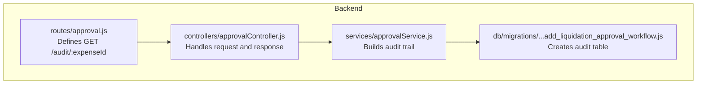
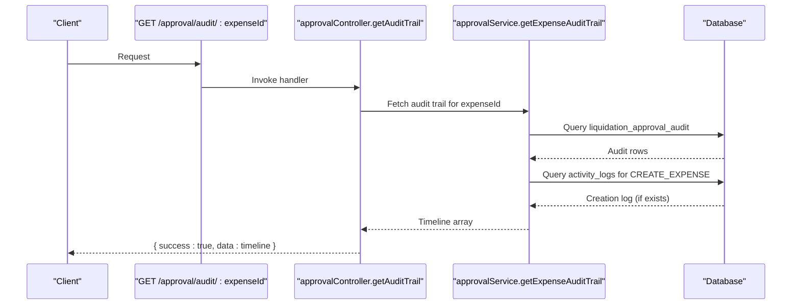
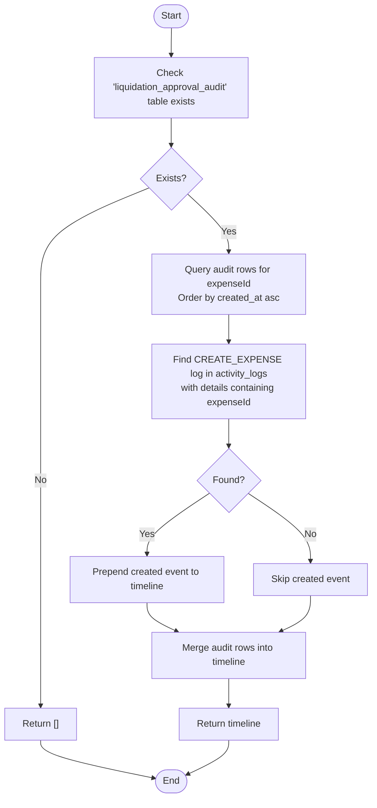
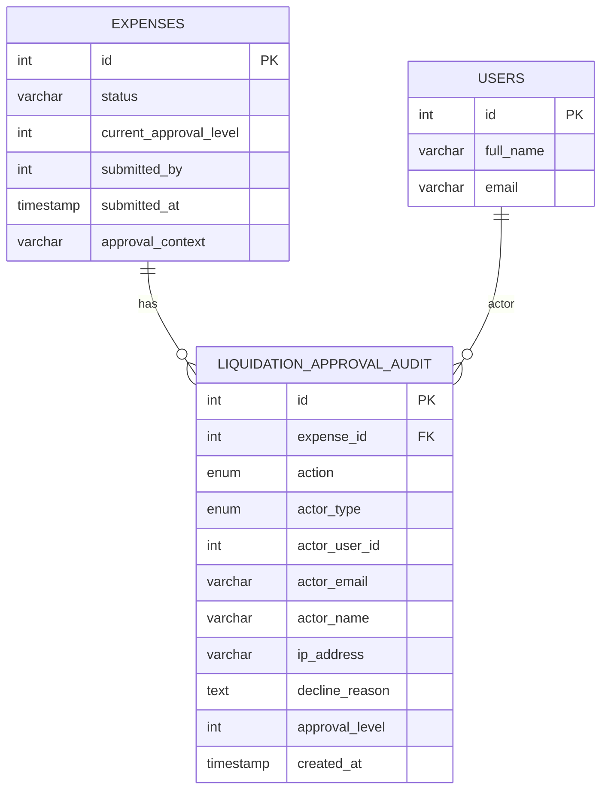
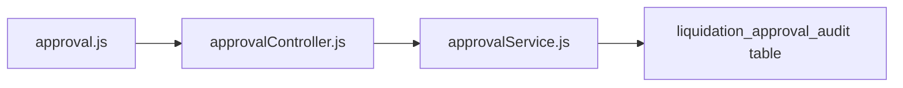

# Audit Trail Queries

<cite>
**Referenced Files in This Document**
- [approval.js](file://backend/src/routes/approval.js)
- [approvalController.js](file://backend/src/controllers/approvalController.js)
- [approvalService.js](file://backend/src/services/approvalService.js)
- [20260611000000_add_liquidation_approval_workflow.js](file://backend/src/db/migrations/20260611000000_add_liquidation_approval_workflow.js)
- [Reports.jsx](file://frontend/src/pages/Reports.jsx)
</cite>

## Table of Contents
1. [Introduction](#introduction)
2. [Project Structure](#project-structure)
3. [Core Components](#core-components)
4. [Architecture Overview](#architecture-overview)
5. [Detailed Component Analysis](#detailed-component-analysis)
6. [Dependency Analysis](#dependency-analysis)
7. [Performance Considerations](#performance-considerations)
8. [Troubleshooting Guide](#troubleshooting-guide)
9. [Conclusion](#conclusion)

## Introduction
This document provides API documentation for the approval audit trail querying endpoint designed to track approval history, decision timestamps, and action logs for petty cash liquidation expenses. It focuses on the endpoint that retrieves the complete audit timeline for a given expense, enabling compliance reporting and bottleneck analysis.

## Project Structure
The audit trail functionality spans routing, controller, service, and database schema layers. The relevant backend components are organized as follows:
- Route definition for the audit trail endpoint
- Controller method delegating to the service
- Service method aggregating audit records and creation logs
- Database migration defining the audit table schema

**Diagram sources**
- [approval.js:33](file://backend/src/routes/approval.js#L33)
- [approvalController.js:100-107](file://backend/src/controllers/approvalController.js#L100-L107)
- [approvalService.js:161-214](file://backend/src/services/approvalService.js#L161-L214)
- [20260611000000_add_liquidation_approval_workflow.js:47-62](file://backend/src/db/migrations/20260611000000_add_liquidation_approval_workflow.js#L47-L62)

**Section sources**
- [approval.js:33](file://backend/src/routes/approval.js#L33)
- [approvalController.js:100-107](file://backend/src/controllers/approvalController.js#L100-L107)
- [approvalService.js:161-214](file://backend/src/services/approvalService.js#L161-L214)
- [20260611000000_add_liquidation_approval_workflow.js:47-62](file://backend/src/db/migrations/20260611000000_add_liquidation_approval_workflow.js#L47-L62)

## Core Components
- Endpoint: GET /approval/audit/:expenseId
  - Purpose: Retrieve the complete approval audit trail for a specified expense ID
  - Authentication: Not protected by default; intended for internal use or controlled access
  - Path parameter:
    - expenseId (required): Numeric ID of the expense whose audit trail is requested

Response format:
- success: Boolean indicating operation outcome
- data: Array of timeline entries ordered chronologically (oldest to newest)

Timeline entry fields:
- action: Enumerated action type (e.g., created, submitted, approved, declined)
- label: Human-readable label derived from action
- actor_name: Name or identifier of the actor who performed the action
- actor_email: Email of the actor (when applicable)
- ip_address: IP address associated with the action (when recorded)
- decline_reason: Reason provided for declines (when applicable)
- approval_level: Numeric approval level (1-based) for multi-level approvals
- created_at: Timestamp of when the action occurred

Notes:
- The audit trail combines dedicated approval audit records with the original creation log entry extracted from the activity logs table
- If the audit table does not exist, an empty array is returned

**Section sources**
- [approval.js:33](file://backend/src/routes/approval.js#L33)
- [approvalController.js:100-107](file://backend/src/controllers/approvalController.js#L100-L107)
- [approvalService.js:161-214](file://backend/src/services/approvalService.js#L161-L214)
- [20260611000000_add_liquidation_approval_workflow.js:47-62](file://backend/src/db/migrations/20260611000000_add_liquidation_approval_workflow.js#L47-L62)

## Architecture Overview
The audit trail retrieval follows a straightforward request-response flow:
- The route handler receives the expense ID
- The controller invokes the service method
- The service queries the audit table and activity logs, merges the results, and returns a chronological timeline

**Diagram sources**
- [approval.js:33](file://backend/src/routes/approval.js#L33)
- [approvalController.js:100-107](file://backend/src/controllers/approvalController.js#L100-L107)
- [approvalService.js:161-214](file://backend/src/services/approvalService.js#L161-L214)

## Detailed Component Analysis

### Endpoint Definition and Access
- Route: GET /approval/audit/:expenseId
- Handler: approvalController.getAuditTrail
- Behavior:
  - Delegates to approvalService.getExpenseAuditTrail
  - Returns a JSON object containing success flag and data array
  - On error, returns a 500 response with a message

Access control:
- The route is defined without explicit protection middleware; ensure appropriate controls are applied at the application or reverse proxy level when exposing this endpoint externally.

**Section sources**
- [approval.js:33](file://backend/src/routes/approval.js#L33)
- [approvalController.js:100-107](file://backend/src/controllers/approvalController.js#L100-L107)

### Audit Trail Construction Logic
The service method constructs the timeline by:
- Checking for the existence of the audit table; returns empty array if missing
- Querying the audit table for all actions related to the expense, left joining with users for actor names
- Locating the creation log from activity logs where the action is CREATE_EXPENSE and details include the expense ID
- Prepending the creation event to the timeline if found
- Appending each audit record to the timeline
- Returning the combined, chronologically sorted array

**Diagram sources**
- [approvalService.js:161-214](file://backend/src/services/approvalService.js#L161-L214)

**Section sources**
- [approvalService.js:161-214](file://backend/src/services/approvalService.js#L161-L214)

### Database Schema for Audit Records
The audit trail relies on the following schema elements:
- Table: liquidation_approval_audit
  - Columns: id, expense_id, action, actor_type, actor_user_id, actor_email, actor_name, ip_address, decline_reason, approval_level, created_at
  - Indexes: (expense_id, created_at)
- Related tables:
  - expenses: referenced by expense_id with CASCADE deletion
  - users: referenced by actor_user_id with SET NULL on delete

**Diagram sources**
- [20260611000000_add_liquidation_approval_workflow.js:47-62](file://backend/src/db/migrations/20260611000000_add_liquidation_approval_workflow.js#L47-L62)

**Section sources**
- [20260611000000_add_liquidation_approval_workflow.js:47-62](file://backend/src/db/migrations/20260611000000_add_liquidation_approval_workflow.js#L47-L62)

### Compliance Reporting and Bottleneck Analysis Examples
The returned timeline enables:
- Compliance reports: Compile chronological actions per expense to verify adherence to approval thresholds and multi-level workflows
- Bottleneck identification: Compare approval_level timestamps to detect delays at specific levels
- Actor accountability: Trace decisions to specific actors by name/email/IP address
- Decline reasons: Extract denial rationale for corrective actions

Note: The frontend page Reports.jsx is available for building dashboards and exporting reports based on audit data.

**Section sources**
- [Reports.jsx](file://frontend/src/pages/Reports.jsx)

## Dependency Analysis
The audit trail endpoint depends on:
- Route registration for GET /approval/audit/:expenseId
- Controller method invocation
- Service method implementation
- Database schema presence for audit records and activity logs

**Diagram sources**
- [approval.js:33](file://backend/src/routes/approval.js#L33)
- [approvalController.js:100-107](file://backend/src/controllers/approvalController.js#L100-L107)
- [approvalService.js:161-214](file://backend/src/services/approvalService.js#L161-L214)
- [20260611000000_add_liquidation_approval_workflow.js:47-62](file://backend/src/db/migrations/20260611000000_add_liquidation_approval_workflow.js#L47-L62)

**Section sources**
- [approval.js:33](file://backend/src/routes/approval.js#L33)
- [approvalController.js:100-107](file://backend/src/controllers/approvalController.js#L100-L107)
- [approvalService.js:161-214](file://backend/src/services/approvalService.js#L161-L214)
- [20260611000000_add_liquidation_approval_workflow.js:47-62](file://backend/src/db/migrations/20260611000000_add_liquidation_approval_workflow.js#L47-L62)

## Performance Considerations
- Indexing: The audit table includes an index on (expense_id, created_at), supporting efficient querying by expense and chronological ordering
- Pagination: The service currently returns all audit events; for high-volume systems, consider adding pagination or date-range filters
- Left joins: The service performs left joins to enrich actor names; monitor join performance on large datasets
- Existence checks: The service checks for the audit table’s existence before querying, preventing errors on fresh deployments

[No sources needed since this section provides general guidance]

## Troubleshooting Guide
Common issues and resolutions:
- Empty timeline:
  - Cause: Audit table does not exist or no audit records for the expense
  - Resolution: Verify migration ran and that the expense has undergone approval actions
- Missing creation event:
  - Cause: Activity logs entry for CREATE_EXPENSE with the expense ID is not found
  - Resolution: Confirm the creation log exists and matches the expected pattern
- Unexpected empty response:
  - Cause: Expense ID invalid or not found
  - Resolution: Validate the expense ID and permissions to access the data

**Section sources**
- [approvalService.js:161-214](file://backend/src/services/approvalService.js#L161-L214)

## Conclusion
The approval audit trail endpoint provides a standardized, chronological view of all approval-related actions for a given expense. Its design leverages a dedicated audit table and creation logs to support robust compliance reporting and operational insights. Ensure proper access controls and consider performance enhancements for production-scale usage.