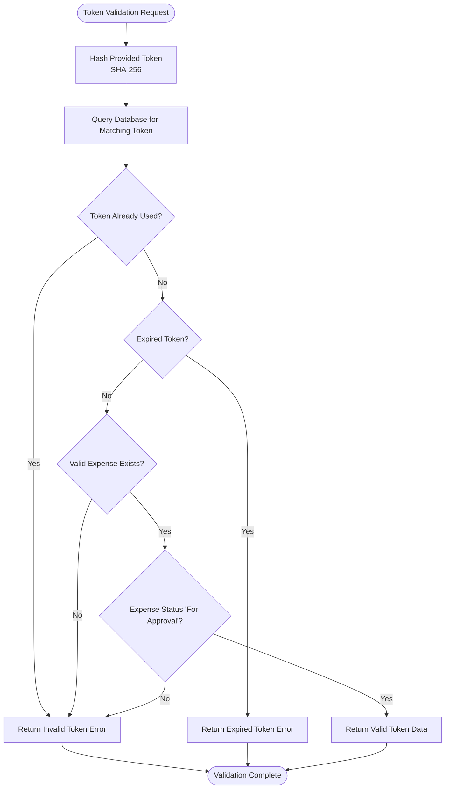
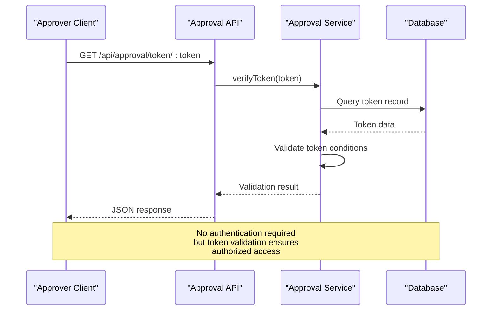
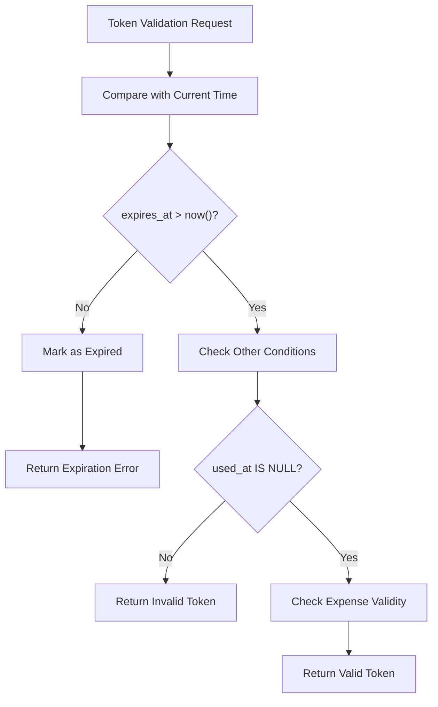
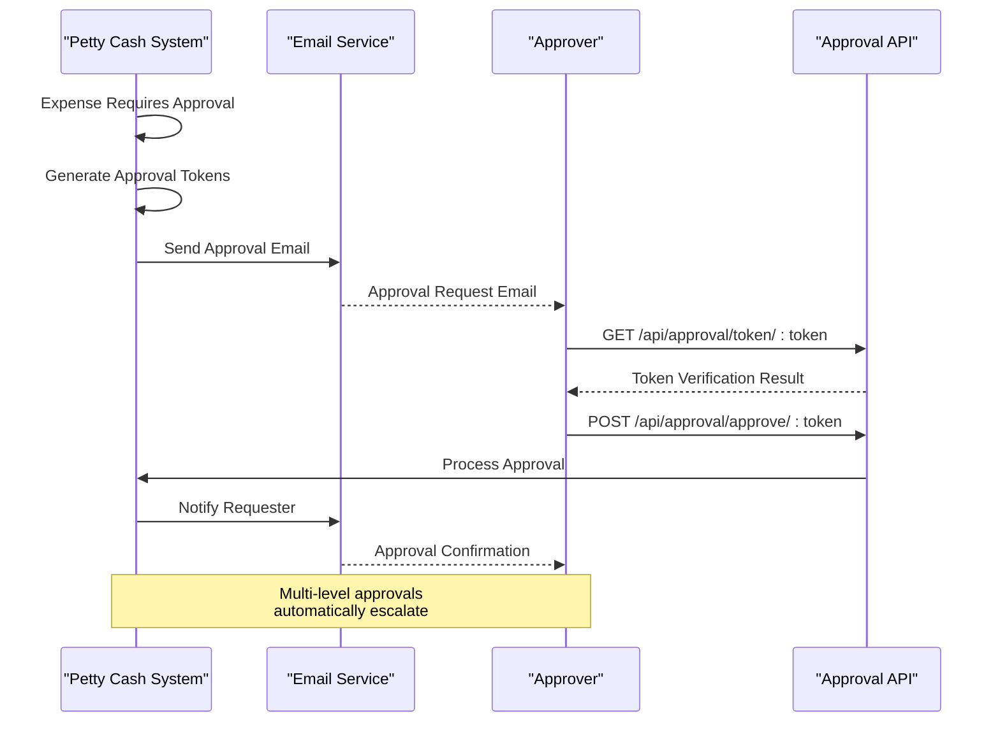
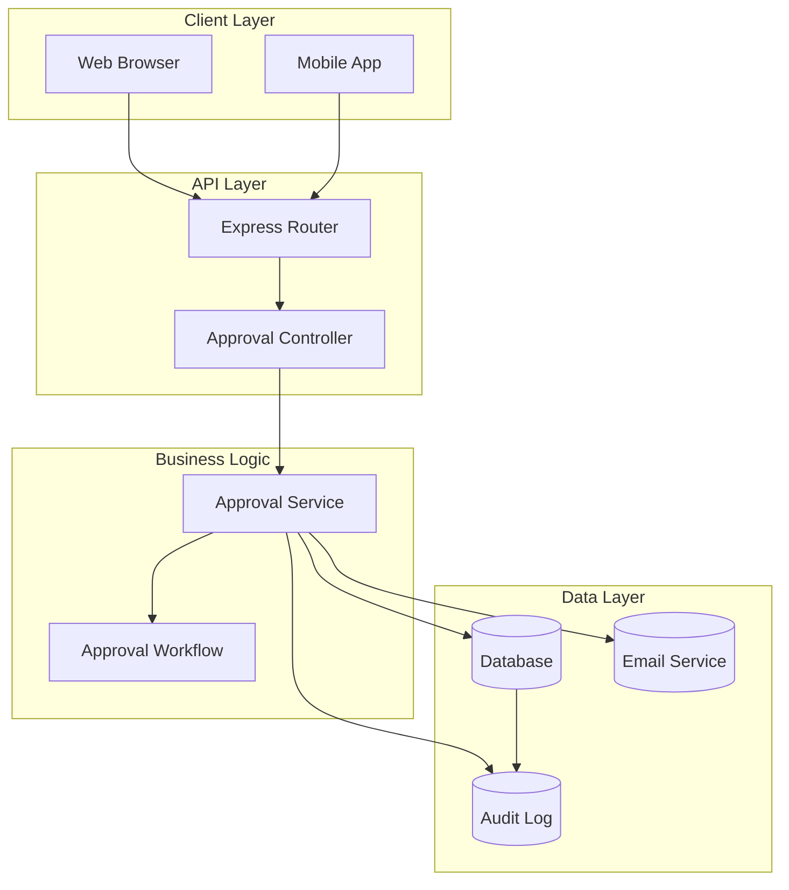

# Token-Based Approval Endpoints

<cite>
**Referenced Files in This Document**
- [approval.js](file://backend/src/routes/approval.js)
- [approvalController.js](file://backend/src/controllers/approvalController.js)
- [approvalService.js](file://backend/src/services/approvalService.js)
- [20260611000000_add_liquidation_approval_workflow.js](file://backend/src/db/migrations/20260611000000_add_liquidation_approval_workflow.js)
</cite>

## Table of Contents
1. [Introduction](#introduction)
2. [Endpoint Specifications](#endpoint-specifications)
3. [Token Validation Mechanisms](#token-validation-mechanisms)
4. [Security Considerations](#security-considerations)
5. [Expiration Handling](#expiration-handling)
6. [Request/Response Schemas](#requestresponse-schemas)
7. [Integration Patterns](#integration-patterns)
8. [Error Responses](#error-responses)
9. [Architecture Overview](#architecture-overview)
10. [Troubleshooting Guide](#troubleshooting-guide)
11. [Conclusion](#conclusion)

## Introduction

The token-based approval system provides secure, email-triggered approval workflows for petty cash liquidation requests. This system enables approvers to approve or decline expense submissions using time-limited, cryptographically-secured tokens sent via email, eliminating the need for login credentials while maintaining robust security controls.

The system operates on a multi-level approval hierarchy where each expense generates unique approval and decline tokens that expire after seven days. The approval process automatically escalates through configured approval levels until final authorization or rejection.

## Endpoint Specifications

### Public Token-Based Endpoints

The system exposes three public endpoints for token-based approval actions:

| Endpoint | Method | Description |
|----------|--------|-------------|
| `/api/approval/token/:token` | GET | Verify token validity and retrieve expense details |
| `/api/approval/approve/:token` | POST | Approve an expense submission |
| `/api/approval/decline/:token` | POST | Decline an expense submission |

**Section sources**
- [approval.js:17-20](file://backend/src/routes/approval.js#L17-L20)

### Protected Administrative Endpoints

Administrative endpoints require authentication and authorization:

| Endpoint | Method | Role Required | Description |
|----------|--------|---------------|-------------|
| `/api/approval/settings` | GET/PUT | Super Admin | Manage approval workflow settings |
| `/api/approval/approvers` | GET/POST/PUT/DELETE | Super Admin | Manage approver configurations |
| `/api/approval/audit/:expenseId` | GET | Super Admin | Retrieve approval audit trail |

**Section sources**
- [approval.js:22-33](file://backend/src/routes/approval.js#L22-L33)

## Token Validation Mechanisms

### Token Generation and Storage

The system generates cryptographically secure tokens using the following process:

1. **Random Token Generation**: 32-byte random tokens generated using cryptographic-safe randomness
2. **Token Hashing**: SHA-256 hashing applied to tokens for secure storage
3. **Dual-Token System**: Separate approval and decline tokens generated for each expense
4. **Database Storage**: Tokens stored as hashed values with unique constraints

### Validation Process

Token validation follows this comprehensive verification sequence:



**Diagram sources**
- [approvalService.js:387-425](file://backend/src/services/approvalService.js#L387-L425)

**Section sources**
- [approvalService.js:9-12](file://backend/src/services/approvalService.js#L9-L12)
- [approvalService.js:223-250](file://backend/src/services/approvalService.js#L223-L250)
- [approvalService.js:387-425](file://backend/src/services/approvalService.js#L387-L425)

## Security Considerations

### Cryptographic Security Measures

1. **Token Generation**: Uses cryptographically secure random number generation
2. **Storage Security**: Tokens stored as SHA-256 hashes with unique database constraints
3. **Transport Security**: HTTPS required for all endpoints
4. **IP Tracking**: Automatic IP address capture for audit trails

### Access Control Implementation



**Diagram sources**
- [approvalController.js:61-71](file://backend/src/controllers/approvalController.js#L61-L71)
- [approvalService.js:398-425](file://backend/src/services/approvalService.js#L398-L425)

### Multi-Level Approval Security

The system implements hierarchical approval security:

- **Approval Level Validation**: Ensures approvers can only act on their designated levels
- **Sequential Processing**: Prevents bypassing approval stages
- **Audit Trail**: Comprehensive logging of all approval actions
- **Token Invalidation**: Automatic invalidation of tokens upon use

**Section sources**
- [approvalService.js:427-509](file://backend/src/services/approvalService.js#L427-L509)
- [approvalService.js:511-555](file://backend/src/services/approvalService.js#L511-L555)

## Expiration Handling

### Token Lifespan Management

All approval tokens have a fixed 7-day expiration period:

- **Creation Timestamp**: Tokens created with 7-day expiry from generation time
- **Automatic Cleanup**: Expired tokens become immediately invalid
- **Grace Period**: No automatic renewal or extension mechanisms
- **Database Cleanup**: System automatically handles expired token cleanup

### Expiration Validation Process



**Diagram sources**
- [approvalService.js:387-425](file://backend/src/services/approvalService.js#L387-L425)

**Section sources**
- [approvalService.js:7](file://backend/src/services/approvalService.js#L7)
- [approvalService.js:226-227](file://backend/src/services/approvalService.js#L226-L227)
- [approvalService.js:392](file://backend/src/services/approvalService.js#L392)

## Request/Response Schemas

### Token Verification Endpoint

**GET** `/api/approval/token/:token`

**Response Schema**:
```javascript
{
  "success": boolean,
  "data": {
    "action_type": "approve" | "decline",
    "approval_level": integer,
    "expense": {
      "id": integer,
      "reference_number": string,
      "requested_by": string,
      "department_name": string,
      "category_name": string,
      "amount": number,
      "remarks": string,
      "status": "For Approval"
    }
  },
  "message": string
}
```

**Section sources**
- [approvalController.js:61-71](file://backend/src/controllers/approvalController.js#L61-L71)
- [approvalService.js:411-424](file://backend/src/services/approvalService.js#L411-L424)

### Approve by Token Endpoint

**POST** `/api/approval/approve/:token`

**Request Body**: None (empty body)

**Response Schema**:
```javascript
{
  "success": boolean,
  "data": {
    "status": "For Approval" | "Liquidated" | "Approved",
    "expense": {
      "id": integer,
      "reference_number": string,
      "requested_by": string,
      "department_name": string,
      "category_name": string,
      "amount": number,
      "remarks": string,
      "status": string,
      "current_approval_level": integer
    },
    "multiLevel": boolean,
    "level": integer
  },
  "message": string
}
```

**Section sources**
- [approvalController.js:73-87](file://backend/src/controllers/approvalController.js#L73-L87)
- [approvalService.js:474](file://backend/src/services/approvalService.js#L474)

### Decline by Token Endpoint

**POST** `/api/approval/decline/:token`

**Request Body**:
```javascript
{
  "reason": string
}
```

**Response Schema**:
```javascript
{
  "success": boolean,
  "data": {
    "status": "Declined",
    "expense": {
      "id": integer,
      "reference_number": string,
      "requested_by": string,
      "department_name": string,
      "category_name": string,
      "amount": number,
      "remarks": string,
      "status": "Declined"
    }
  },
  "message": string
}
```

**Section sources**
- [approvalController.js:89-98](file://backend/src/controllers/approvalController.js#L89-L98)
- [approvalService.js:511-555](file://backend/src/services/approvalService.js#L511-L555)

## Integration Patterns

### Email-Based Workflow Integration

The approval system integrates seamlessly with email automation:



**Diagram sources**
- [approvalService.js:252-290](file://backend/src/services/approvalService.js#L252-L290)
- [approvalService.js:427-509](file://backend/src/services/approvalService.js#L427-L509)

### Frontend Integration Patterns

**Direct Link Integration**:
- Approve button: `{{approve_link}}`
- Decline button: `{{decline_link}}`
- Automatic token validation on page load
- Real-time status updates via WebSocket

**Section sources**
- [approvalService.js:264-280](file://backend/src/services/approvalService.js#L264-L280)

## Error Responses

### Common Error Scenarios

| Error Code | Error Message | Cause | Resolution |
|------------|---------------|-------|------------|
| 404 | "Invalid or expired link" | Token not found or expired | Request new approval email |
| 400 | "Invalid or expired approval link" | Invalid approval token | Check token validity |
| 400 | "Invalid or expired decline link" | Invalid decline token | Check token validity |
| 400 | "This expense is no longer pending approval" | Expense status changed | Check current expense status |
| 400 | "A decline reason is required" | Missing decline reason | Provide valid reason |
| 500 | Error message | Server-side error | Retry or contact administrator |

### Error Response Schema

```javascript
{
  "success": false,
  "message": string
}
```

**Section sources**
- [approvalController.js:64-70](file://backend/src/controllers/approvalController.js#L64-L70)
- [approvalController.js:84-97](file://backend/src/controllers/approvalController.js#L84-L97)
- [approvalService.js:429](file://backend/src/services/approvalService.js#L429)
- [approvalService.js:512-514](file://backend/src/services/approvalService.js#L512-L514)

## Architecture Overview

### System Architecture



**Diagram sources**
- [approval.js:1-36](file://backend/src/routes/approval.js#L1-L36)
- [approvalController.js:1](file://backend/src/controllers/approvalController.js#L1)
- [approvalService.js:1-6](file://backend/src/services/approvalService.js#L1-L6)

### Database Schema

The approval system utilizes a dedicated token table with comprehensive indexing:

| Column | Type | Constraints | Description |
|--------|------|-------------|-------------|
| `id` | INTEGER | PRIMARY KEY, AUTO_INCREMENT | Unique identifier |
| `expense_id` | INTEGER | NOT NULL, FOREIGN KEY | Related expense record |
| `token_hash` | STRING | NOT NULL, UNIQUE | SHA-256 hashed token |
| `action_type` | ENUM | NOT NULL | 'approve' or 'decline' |
| `approval_level` | INTEGER | NOT NULL, DEFAULT 1 | Approval hierarchy level |
| `expires_at` | TIMESTAMP | NOT NULL | Token expiration time |
| `used_at` | TIMESTAMP | NULLABLE | Token usage timestamp |
| `created_at` | TIMESTAMP | DEFAULT NOW() | Record creation time |

**Section sources**
- [20260611000000_add_liquidation_approval_workflow.js:33-45](file://backend/src/db/migrations/20260611000000_add_liquidation_approval_workflow.js#L33-L45)

## Troubleshooting Guide

### Common Issues and Solutions

**Issue**: Token appears valid but validation fails
- **Cause**: Token already used or expired
- **Solution**: Generate new approval request and resend email

**Issue**: Approver receives approval email but cannot access
- **Cause**: Incorrect frontend URL configuration
- **Solution**: Verify FRONTEND_URL environment variable

**Issue**: Approval not processed despite valid token
- **Cause**: Expense status changed during approval process
- **Solution**: Check expense status and approval workflow configuration

**Issue**: Email delivery failures
- **Cause**: SMTP configuration errors
- **Solution**: Verify email service credentials and network connectivity

### Debug Information

**Audit Trail Access**: `/api/approval/audit/:expenseId` (Super Admin only)

**Key Debug Fields**:
- Token hash verification results
- IP address tracking for all actions
- Approval level progression
- Email delivery status
- System timestamps for all operations

**Section sources**
- [approval.js:33](file://backend/src/routes/approval.js#L33)
- [approvalService.js:119-143](file://backend/src/services/approvalService.js#L119-L143)

## Conclusion

The token-based approval system provides a secure, scalable solution for automated expense approval workflows. Its cryptographic foundation, multi-level approval hierarchy, and comprehensive audit capabilities ensure both security and transparency. The system's integration with email automation and real-time notifications creates an efficient approval process that requires minimal administrative overhead while maintaining strict security controls.

The 7-day token expiration policy balances usability with security, while the dual-token approach (approve/decline) prevents token misuse. The modular architecture supports future enhancements including additional approval levels, custom approval workflows, and integration with external approval systems.