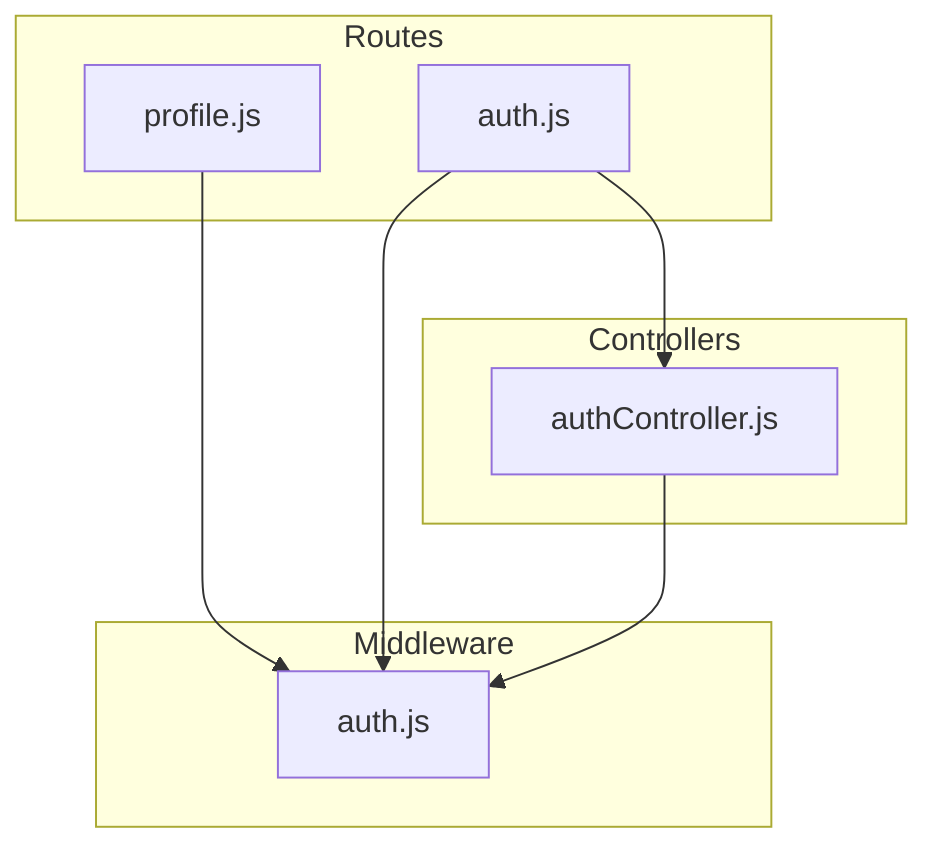
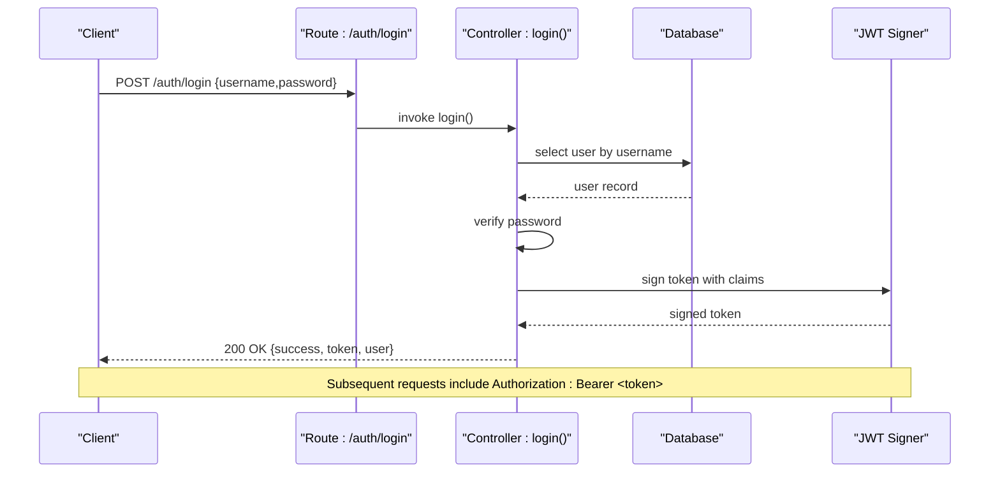
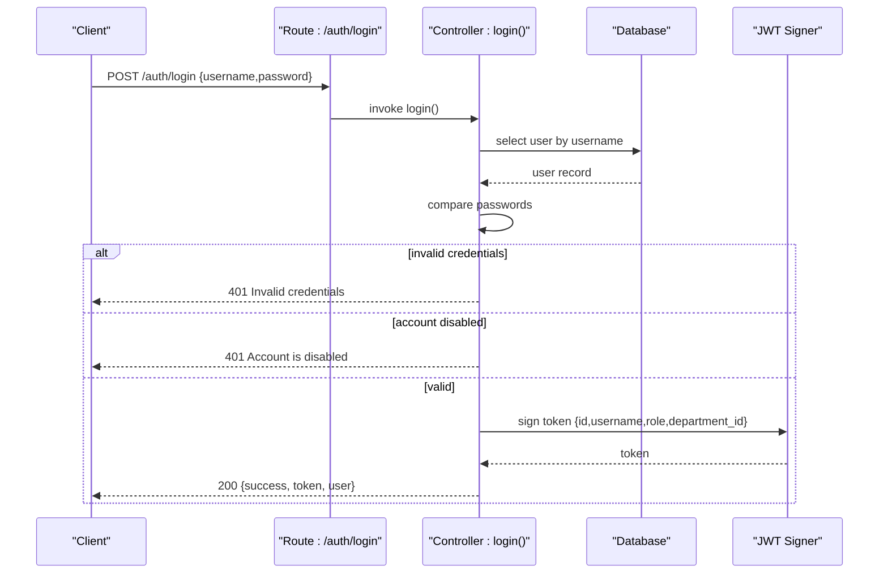
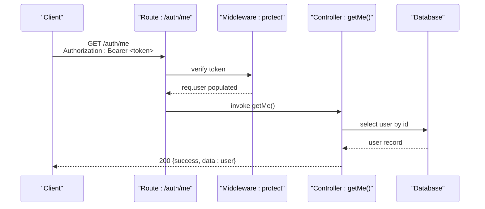
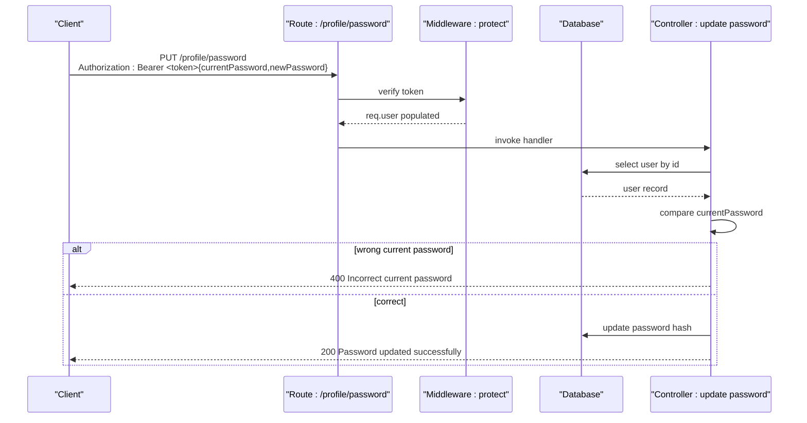
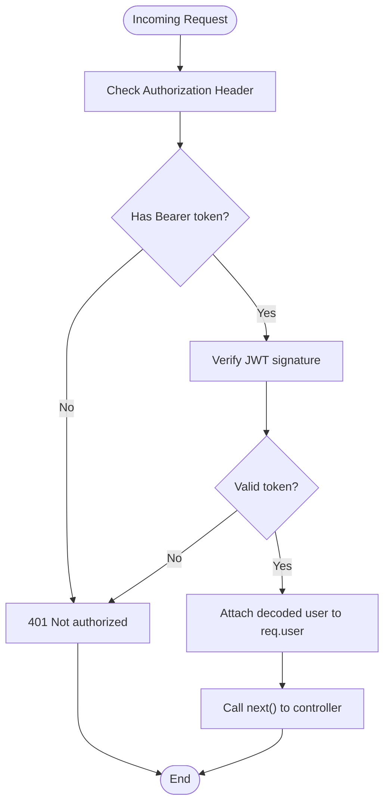
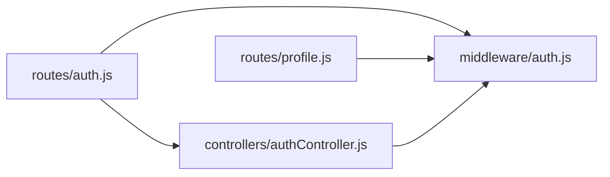

# Authentication API

<cite>
**Referenced Files in This Document**
- [authController.js](file://backend/src/controllers/authController.js)
- [auth.js](file://backend/src/middleware/auth.js)
- [auth.js](file://backend/src/routes/auth.js)
- [profile.js](file://backend/src/routes/profile.js)
</cite>

## Table of Contents
1. [Introduction](#introduction)
2. [Project Structure](#project-structure)
3. [Core Components](#core-components)
4. [Architecture Overview](#architecture-overview)
5. [Detailed Component Analysis](#detailed-component-analysis)
6. [Dependency Analysis](#dependency-analysis)
7. [Performance Considerations](#performance-considerations)
8. [Troubleshooting Guide](#troubleshooting-guide)
9. [Conclusion](#conclusion)

## Introduction
This document describes the authentication API for the system, focusing on login, profile retrieval, and password change endpoints. It explains JWT token handling, session management, and authentication middleware requirements. It also documents request/response schemas, error responses, and examples of authentication headers and token refresh mechanisms.

## Project Structure
The authentication system is implemented with three primary building blocks:
- Routes define endpoint contracts and bind them to controller handlers.
- Middleware enforces authentication and authorization checks.
- Controllers implement business logic for authentication and profile operations.

**Diagram sources**
- [auth.js:1-10](file://backend/src/routes/auth.js#L1-L10)
- [profile.js:1-31](file://backend/src/routes/profile.js#L1-L31)
- [auth.js:1-36](file://backend/src/middleware/auth.js#L1-L36)
- [authController.js:1-66](file://backend/src/controllers/authController.js#L1-L66)

**Section sources**
- [auth.js:1-10](file://backend/src/routes/auth.js#L1-L10)
- [auth.js:1-36](file://backend/src/middleware/auth.js#L1-L36)
- [authController.js:1-66](file://backend/src/controllers/authController.js#L1-L66)
- [profile.js:1-31](file://backend/src/routes/profile.js#L1-L31)

## Core Components
- Authentication routes:
  - POST /auth/login: Accepts credentials and returns a JWT token and user payload.
  - GET /auth/me: Returns the authenticated user’s profile.
- Password change route:
  - PUT /profile/password: Updates the authenticated user’s password after verifying the current password.

- Authentication middleware:
  - protect: Extracts a Bearer token from Authorization header, verifies it, and attaches decoded user info to the request.
  - authorize: Role-based guard (exposed but not used on authentication endpoints in the provided files).

- Controllers:
  - login: Validates credentials, checks account status, logs activity, and issues a signed JWT.
  - getMe: Returns the authenticated user’s profile.

**Section sources**
- [auth.js:1-10](file://backend/src/routes/auth.js#L1-L10)
- [auth.js:1-36](file://backend/src/middleware/auth.js#L1-L36)
- [authController.js:1-66](file://backend/src/controllers/authController.js#L1-L66)
- [profile.js:1-31](file://backend/src/routes/profile.js#L1-L31)

## Architecture Overview
The authentication flow integrates routing, middleware, and controller layers. Requests to protected endpoints pass through the authentication middleware, which validates the JWT and injects user context. Controllers then implement domain-specific logic.

**Diagram sources**
- [auth.js:6-7](file://backend/src/routes/auth.js#L6-L7)
- [authController.js:6-52](file://backend/src/controllers/authController.js#L6-L52)
- [auth.js:3-21](file://backend/src/middleware/auth.js#L3-L21)

## Detailed Component Analysis

### Authentication Endpoints

#### POST /auth/login
- Purpose: Authenticate a user and issue a JWT.
- Request body:
  - username: string
  - password: string
- Successful response:
  - success: boolean
  - token: string (JWT)
  - user: object containing id, username, full_name, email, role
- Error responses:
  - 401 Unauthorized: Invalid credentials or disabled account.
  - 500 Internal Server Error: Unexpected failure during login.

Authentication header for subsequent requests:
- Authorization: Bearer <token>

**Diagram sources**
- [authController.js:6-52](file://backend/src/controllers/authController.js#L6-L52)
- [auth.js:6-7](file://backend/src/routes/auth.js#L6-L7)

**Section sources**
- [auth.js:6-7](file://backend/src/routes/auth.js#L6-L7)
- [authController.js:6-52](file://backend/src/controllers/authController.js#L6-L52)

#### GET /auth/me
- Purpose: Retrieve the authenticated user’s profile.
- Authentication: Required (Bearer token).
- Successful response:
  - success: boolean
  - data: user object (id, username, full_name, email, role, department_id, status)
- Error responses:
  - 401 Unauthorized: Missing or invalid token.
  - 500 Internal Server Error: Unexpected failure while fetching profile.

**Diagram sources**
- [auth.js:7-7](file://backend/src/routes/auth.js#L7-L7)
- [auth.js:3-21](file://backend/src/middleware/auth.js#L3-L21)
- [authController.js:54-65](file://backend/src/controllers/authController.js#L54-L65)

**Section sources**
- [auth.js:7-7](file://backend/src/routes/auth.js#L7-L7)
- [auth.js:3-21](file://backend/src/middleware/auth.js#L3-L21)
- [authController.js:54-65](file://backend/src/controllers/authController.js#L54-L65)

#### PUT /profile/password
- Purpose: Change the authenticated user’s password.
- Authentication: Required (Bearer token).
- Request body:
  - currentPassword: string
  - newPassword: string
- Successful response:
  - success: boolean
  - message: string
- Error responses:
  - 400 Bad Request: Incorrect current password.
  - 500 Internal Server Error: Unexpected failure during password update.

**Diagram sources**
- [profile.js:9-28](file://backend/src/routes/profile.js#L9-L28)
- [auth.js:3-21](file://backend/src/middleware/auth.js#L3-L21)

**Section sources**
- [profile.js:1-31](file://backend/src/routes/profile.js#L1-L31)
- [auth.js:3-21](file://backend/src/middleware/auth.js#L3-L21)

### JWT Token Handling and Session Management
- Issuance:
  - The login endpoint signs a JWT with claims including user id, username, role, and department_id, and sets an expiration via an environment variable.
- Verification:
  - The protect middleware extracts the Bearer token from the Authorization header, verifies it against the configured secret, and attaches the decoded user payload to req.user.
- Session model:
  - Stateless JWT bearer tokens are used; there is no server-side session storage in the provided files.

**Diagram sources**
- [auth.js:3-21](file://backend/src/middleware/auth.js#L3-L21)

**Section sources**
- [authController.js:23-27](file://backend/src/controllers/authController.js#L23-L27)
- [auth.js:3-21](file://backend/src/middleware/auth.js#L3-L21)

### Authentication Middleware Requirements
- protect:
  - Extracts token from Authorization: Bearer <token>.
  - Verifies token and populates req.user.
  - Returns 401 for missing or invalid tokens.
- authorize:
  - Utility to restrict endpoints to specific roles; exposed but not used on authentication endpoints in the provided files.

Usage pattern:
- Apply protect to any endpoint requiring authentication.
- Optionally apply authorize to enforce role-based access.

**Section sources**
- [auth.js:3-33](file://backend/src/middleware/auth.js#L3-L33)

## Dependency Analysis
The authentication stack depends on:
- Express routes to expose endpoints.
- Middleware to enforce authentication.
- Controllers to implement business logic.
- Environment variables for JWT secret and expiration.

**Diagram sources**
- [auth.js:1-10](file://backend/src/routes/auth.js#L1-L10)
- [authController.js:1-66](file://backend/src/controllers/authController.js#L1-L66)
- [auth.js:1-36](file://backend/src/middleware/auth.js#L1-L36)
- [profile.js:1-31](file://backend/src/routes/profile.js#L1-L31)

**Section sources**
- [auth.js:1-10](file://backend/src/routes/auth.js#L1-L10)
- [authController.js:1-66](file://backend/src/controllers/authController.js#L1-L66)
- [auth.js:1-36](file://backend/src/middleware/auth.js#L1-L36)
- [profile.js:1-31](file://backend/src/routes/profile.js#L1-L31)

## Performance Considerations
- Token verification is lightweight and CPU-bound only for signature validation.
- Avoid excessive logging in production to minimize I/O overhead.
- Consider rate-limiting login attempts at the gateway or middleware level to mitigate brute-force attacks.

## Troubleshooting Guide
Common issues and resolutions:
- 401 Not authorized to access this route:
  - Cause: Missing or malformed Authorization header; invalid/expired token.
  - Resolution: Ensure Authorization: Bearer <valid-token> is present and unexpired.
- 401 Invalid credentials:
  - Cause: Wrong username/password combination.
  - Resolution: Verify credentials; ensure account is enabled.
- 400 Incorrect current password:
  - Cause: Provided currentPassword does not match stored hash.
  - Resolution: Prompt user to enter the correct current password.
- 500 Internal Server Error:
  - Cause: Unexpected failures during login or password update.
  - Resolution: Check server logs; confirm database connectivity and environment variables.

**Section sources**
- [auth.js:10-20](file://backend/src/middleware/auth.js#L10-L20)
- [authController.js:12-18](file://backend/src/controllers/authController.js#L12-L18)
- [profile.js:14-16](file://backend/src/routes/profile.js#L14-L16)

## Conclusion
The authentication API provides secure, stateless JWT-based access control with clear endpoints for login, profile retrieval, and password changes. The protect middleware enforces authentication across protected routes, while environment variables configure token signing and expiration. Extend the system with refresh token mechanisms and optional role guards as needed.