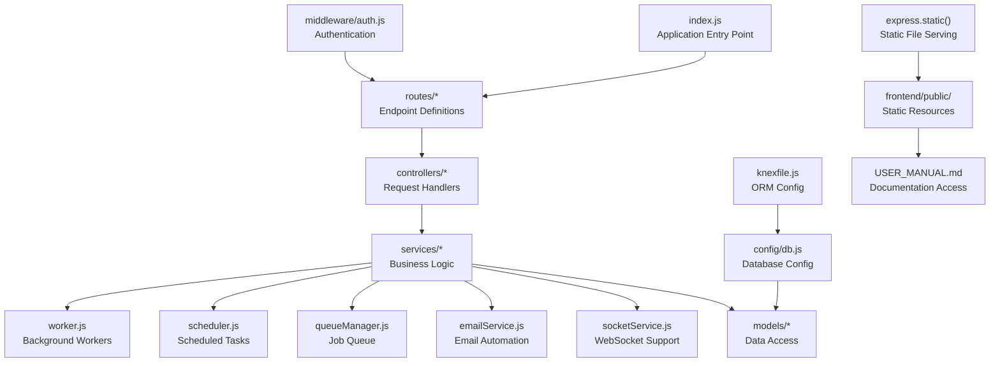
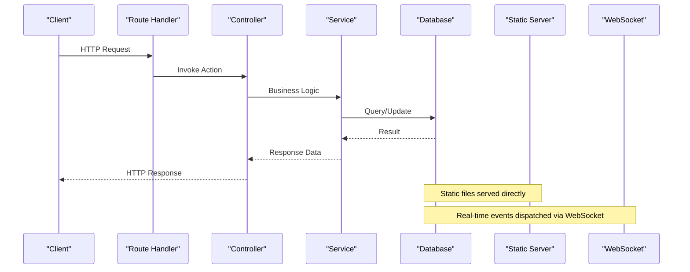
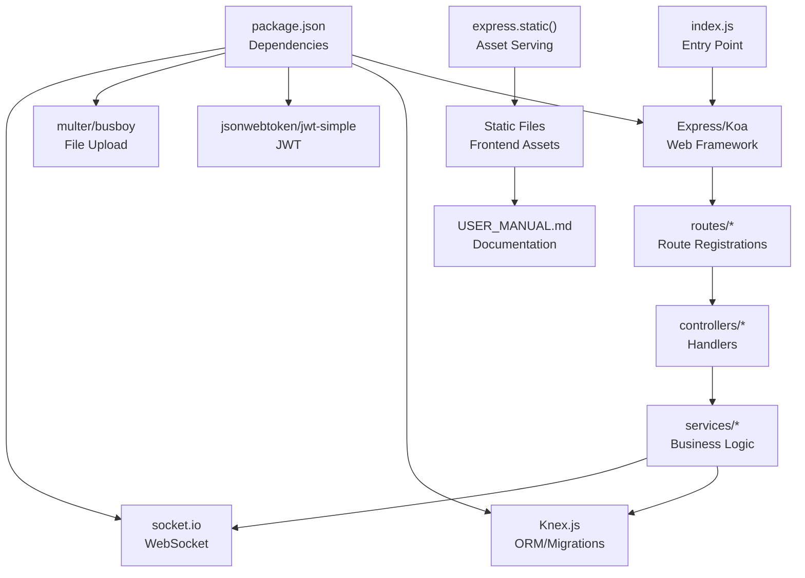

# Backend API Reference

<cite>
**Referenced Files in This Document**
- [index.js](file://backend/index.js)
- [auth.js](file://backend/src/middleware/auth.js)
- [db.js](file://backend/src/config/db.js)
- [authController.js](file://backend/src/controllers/authController.js)
- [expenseController.js](file://backend/src/controllers/expenseController.js)
- [approvalController.js](file://backend/src/controllers/approvalController.js)
- [fundController.js](file://backend/src/controllers/fundController.js)
- [categoryController.js](file://backend/src/controllers/categoryController.js)
- [departmentController.js](file://backend/src/controllers/departmentController.js)
- [notificationController.js](file://backend/src/controllers/notificationController.js)
- [notificationCenterController.js](file://backend/src/controllers/notificationCenterController.js)
- [analyticsController.js](file://backend/src/controllers/analyticsController.js)
- [emailAutomationController.js](file://backend/src/controllers/emailAutomationController.js)
- [logController.js](file://backend/src/controllers/logController.js)
- [backupController.js](file://backend/src/controllers/backupController.js)
- [auth.js](file://backend/src/routes/auth.js)
- [expenses.js](file://backend/src/routes/expenses.js)
- [approval.js](file://backend/src/routes/approval.js)
- [fundRoutes.js](file://backend/src/routes/fundRoutes.js)
- [categories.js](file://backend/src/routes/categories.js)
- [departments.js](file://backend/src/routes/departments.js)
- [notifications.js](file://backend/src/routes/notifications.js)
- [analytics.js](file://backend/src/routes/analytics.js)
- [emailAutomation.js](file://backend/src/routes/emailAutomation.js)
- [logs.js](file://backend/src/routes/logs.js)
- [backup.js](file://backend/src/routes/backup.js)
- [socketService.js](file://backend/src/services/socketService.js)
- [emailService.js](file://backend/src/services/emailService.js)
- [queueManager.js](file://backend/src/services/queueManager.js)
- [scheduler.js](file://backend/src/services/scheduler.js)
- [worker.js](file://backend/src/services/worker.js)
- [package.json](file://backend/package.json)
- [knexfile.js](file://backend/knexfile.js)
- [run_migrations.js](file://backend/run_migrations.js)
- [USER_MANUAL.md](file://frontend/public/USER_MANUAL.md)
</cite>

## Update Summary
**Changes Made**
- Added new section documenting the /USER_MANUAL.md route for direct user manual access
- Updated project structure diagram to include frontend static file serving
- Enhanced file serving section with explicit user manual route documentation

## Table of Contents
1. [Introduction](#introduction)
2. [Project Structure](#project-structure)
3. [Core Components](#core-components)
4. [Architecture Overview](#architecture-overview)
5. [Detailed Component Analysis](#detailed-component-analysis)
6. [Dependency Analysis](#dependency-analysis)
7. [Performance Considerations](#performance-considerations)
8. [Troubleshooting Guide](#troubleshooting-guide)
9. [Conclusion](#conclusion)
10. [Appendices](#appendices)

## Introduction
This document provides comprehensive API documentation for the petty cash management system backend. It covers RESTful endpoints for authentication, expense management, approval workflows, user administration, fund management, analytics, and system administration. It also documents WebSocket endpoints for real-time notifications, file upload endpoints, and static file serving including the new user manual access route. For each endpoint, we specify HTTP methods, URL patterns, request/response schemas, authentication requirements, and error handling. Additional topics include rate limiting, pagination, filtering, search capabilities, curl examples, and common integration patterns.

## Project Structure
The backend follows a modular MVC-like structure with controllers, routes, services, middleware, and database configuration. Controllers handle HTTP requests and responses, routes define endpoint patterns, services encapsulate business logic, middleware enforces authentication, and database configuration manages connections and migrations. The system serves both dynamic API endpoints and static frontend resources, including user documentation.

**Diagram sources**
- [index.js](file://backend/index.js)
- [auth.js](file://backend/src/middleware/auth.js)
- [db.js](file://backend/src/config/db.js)
- [socketService.js](file://backend/src/services/socketService.js)
- [emailService.js](file://backend/src/services/emailService.js)
- [queueManager.js](file://backend/src/services/queueManager.js)
- [scheduler.js](file://backend/src/services/scheduler.js)
- [worker.js](file://backend/src/services/worker.js)
- [USER_MANUAL.md](file://frontend/public/USER_MANUAL.md)

**Section sources**
- [index.js](file://backend/index.js)
- [auth.js](file://backend/src/middleware/auth.js)
- [db.js](file://backend/src/config/db.js)
- [knexfile.js](file://backend/knexfile.js)

## Core Components
- Authentication Middleware: Enforces JWT-based authentication for protected routes.
- Controllers: Implement request handling logic for each domain (auth, expenses, approvals, funds, categories, departments, notifications, analytics, email automation, logs, backups).
- Services: Encapsulate business logic, job queuing, scheduling, and WebSocket dispatching.
- Routes: Define RESTful endpoint patterns mapped to controller actions.
- Database Layer: Managed via Knex.js with migrations and seeds.
- Static File Serving: Handles frontend asset delivery and user manual access.

Key integration patterns:
- Controllers return standardized JSON responses with appropriate HTTP status codes.
- Middleware validates tokens and attaches user context to requests.
- Services coordinate database operations, background jobs, and real-time updates.
- Static routes serve frontend resources and documentation directly from the backend.

**Section sources**
- [auth.js](file://backend/src/middleware/auth.js)
- [authController.js](file://backend/src/controllers/authController.js)
- [expenseController.js](file://backend/src/controllers/expenseController.js)
- [approvalController.js](file://backend/src/controllers/approvalController.js)
- [fundController.js](file://backend/src/controllers/fundController.js)
- [categoryController.js](file://backend/src/controllers/categoryController.js)
- [departmentController.js](file://backend/src/controllers/departmentController.js)
- [notificationController.js](file://backend/src/controllers/notificationController.js)
- [notificationCenterController.js](file://backend/src/controllers/notificationCenterController.js)
- [analyticsController.js](file://backend/src/controllers/analyticsController.js)
- [emailAutomationController.js](file://backend/src/controllers/emailAutomationController.js)
- [logController.js](file://backend/src/controllers/logController.js)
- [backupController.js](file://backend/src/controllers/backupController.js)

## Architecture Overview
The backend exposes REST APIs and supports real-time communication via WebSockets. Requests flow from clients to routes, processed by controllers, executed by services, and persisted through the database layer. Background tasks are managed by queue managers and workers, while scheduled tasks are handled by the scheduler service. Static resources including user manuals are served directly from the backend for improved accessibility.

**Diagram sources**
- [index.js](file://backend/index.js)
- [socketService.js](file://backend/src/services/socketService.js)
- [db.js](file://backend/src/config/db.js)

## Detailed Component Analysis

### Authentication Endpoints
Purpose: User login, logout, and profile management.

- POST /api/auth/login
  - Description: Authenticate user and issue JWT token.
  - Authentication: None
  - Request body: Credentials object (fields depend on implementation).
  - Response: Token and user profile.
  - Errors: Invalid credentials, account disabled, server errors.
  - Example curl: Not applicable (no code snippet).
  - Related controller: [authController.js](file://backend/src/controllers/authController.js)
  - Route definition: [auth.js](file://backend/src/routes/auth.js)

- POST /api/auth/logout
  - Description: Invalidate current session/token.
  - Authentication: Required (Bearer JWT)
  - Request body: Empty.
  - Response: Success confirmation.
  - Errors: Unauthorized, invalid token.
  - Example curl: Not applicable.
  - Related controller: [authController.js](file://backend/src/controllers/authController.js)
  - Route definition: [auth.js](file://backend/src/routes/auth.js)

- GET /api/profile
  - Description: Retrieve authenticated user profile.
  - Authentication: Required (Bearer JWT)
  - Request body: Empty.
  - Response: User profile object.
  - Errors: Unauthorized, user not found.
  - Example curl: Not applicable.
  - Related controller: [authController.js](file://backend/src/controllers/authController.js)
  - Route definition: [profile route](file://backend/src/routes/profile.js)

Validation rules:
- Username/email and password must match existing records.
- Token expiration is enforced by middleware.

Common integration pattern:
- Store JWT securely (e.g., HttpOnly cookie or secure storage).
- Attach Authorization header for subsequent requests.

**Section sources**
- [auth.js](file://backend/src/routes/auth.js)
- [authController.js](file://backend/src/controllers/authController.js)
- [auth.js](file://backend/src/middleware/auth.js)

### Expense Management Endpoints
Purpose: CRUD operations for petty cash expenses with status tracking and approval linkage.

- GET /api/expenses
  - Description: List expenses with optional filters and pagination.
  - Authentication: Required (Bearer JWT)
  - Query parameters:
    - page: integer (default depends on implementation)
    - limit: integer (default depends on implementation)
    - status: enum string (filter by expense status)
    - categoryId: UUID (filter by category)
    - departmentId: UUID (filter by department)
    - createdBy: UUID (filter by creator)
    - sortBy: string (e.g., "createdAt", "amount")
    - sortOrder: "asc"|"desc"
    - search: string (free-text search)
  - Response: Paginated list of expenses.
  - Errors: Unauthorized, invalid parameters.
  - Example curl: Not applicable.
  - Related controller: [expenseController.js](file://backend/src/controllers/expenseController.js)
  - Route definition: [expenses.js](file://backend/src/routes/expenses.js)

- GET /api/expenses/:id
  - Description: Retrieve a single expense by ID.
  - Authentication: Required (Bearer JWT)
  - Path parameters: id (UUID)
  - Response: Expense object.
  - Errors: Unauthorized, not found, invalid ID.
  - Example curl: Not applicable.
  - Related controller: [expenseController.js](file://backend/src/controllers/expenseController.js)
  - Route definition: [expenses.js](file://backend/src/routes/expenses.js)

- POST /api/expenses
  - Description: Create a new expense.
  - Authentication: Required (Bearer JWT)
  - Request body: Expense creation payload (fields depend on implementation).
  - Response: Created expense object.
  - Errors: Unauthorized, validation errors, insufficient permissions.
  - Example curl: Not applicable.
  - Related controller: [expenseController.js](file://backend/src/controllers/expenseController.js)
  - Route definition: [expenses.js](file://backend/src/routes/expenses.js)

- PUT /api/expenses/:id
  - Description: Update an existing expense.
  - Authentication: Required (Bearer JWT)
  - Path parameters: id (UUID)
  - Request body: Expense update payload (fields depend on implementation).
  - Response: Updated expense object.
  - Errors: Unauthorized, not found, validation errors.
  - Example curl: Not applicable.
  - Related controller: [expenseController.js](file://backend/src/controllers/expenseController.js)
  - Route definition: [expenses.js](file://backend/src/routes/expenses.js)

- DELETE /api/expenses/:id
  - Description: Delete an expense.
  - Authentication: Required (Bearer JWT)
  - Path parameters: id (UUID)
  - Response: Deletion confirmation.
  - Errors: Unauthorized, not found, deletion restrictions.
  - Example curl: Not applicable.
  - Related controller: [expenseController.js](file://backend/src/controllers/expenseController.js)
  - Route definition: [expenses.js](file://backend/src/routes/expenses.js)

Validation rules:
- Amount must be positive.
- Status transitions follow predefined workflow rules.
- Category and department must exist.

Filtering and search:
- Supports status, category, department, creator, free-text search, sorting, and pagination.

**Section sources**
- [expenses.js](file://backend/src/routes/expenses.js)
- [expenseController.js](file://backend/src/controllers/expenseController.js)

### Approval Workflows Endpoints
Purpose: Manage approval requests and track workflow states.

- GET /api/approvals
  - Description: List pending and historical approvals with filters.
  - Authentication: Required (Bearer JWT)
  - Query parameters:
    - page, limit, status, requesterId, approverId, sortBy, sortOrder, search
  - Response: Paginated approvals list.
  - Errors: Unauthorized, invalid parameters.
  - Example curl: Not applicable.
  - Related controller: [approvalController.js](file://backend/src/controllers/approvalController.js)
  - Route definition: [approval.js](file://backend/src/routes/approval.js)

- GET /api/approvals/:id
  - Description: Retrieve approval details.
  - Authentication: Required (Bearer JWT)
  - Path parameters: id (UUID)
  - Response: Approval object.
  - Errors: Unauthorized, not found.
  - Example curl: Not applicable.
  - Related controller: [approvalController.js](file://backend/src/controllers/approvalController.js)
  - Route definition: [approval.js](file://backend/src/routes/approval.js)

- POST /api/approvals/:id/approve
  - Description: Approve an expense.
  - Authentication: Required (Bearer JWT)
  - Path parameters: id (UUID)
  - Request body: Optional comment.
  - Response: Approval result.
  - Errors: Unauthorized, not found, invalid state.
  - Example curl: Not applicable.
  - Related controller: [approvalController.js](file://backend/src/controllers/approvalController.js)
  - Route definition: [approval.js](file://backend/src/routes/approval.js)

- POST /api/approvals/:id/reject
  - Description: Reject an expense.
  - Authentication: Required (Bearer JWT)
  - Path parameters: id (UUID)
  - Request body: Optional comment.
  - Response: Approval result.
  - Errors: Unauthorized, not found, invalid state.
  - Example curl: Not applicable.
  - Related controller: [approvalController.js](file://backend/src/controllers/approvalController.js)
  - Route definition: [approval.js](file://backend/src/routes/approval.js)

Validation rules:
- Only authorized approvers can act on approvals.
- Workflow enforces state transitions.

**Section sources**
- [approval.js](file://backend/src/routes/approval.js)
- [approvalController.js](file://backend/src/controllers/approvalController.js)

### Fund Management Endpoints
Purpose: Manage petty cash funds and balances.

- GET /api/funds
  - Description: List funds with optional filters.
  - Authentication: Required (Bearer JWT)
  - Query parameters: page, limit, name, departmentId, sortBy, sortOrder
  - Response: Paginated funds list.
  - Errors: Unauthorized, invalid parameters.
  - Example curl: Not applicable.
  - Related controller: [fundController.js](file://backend/src/controllers/fundController.js)
  - Route definition: [fundRoutes.js](file://backend/src/routes/fundRoutes.js)

- GET /api/funds/:id
  - Description: Retrieve fund details.
  - Authentication: Required (Bearer JWT)
  - Path parameters: id (UUID)
  - Response: Fund object.
  - Errors: Unauthorized, not found.
  - Example curl: Not applicable.
  - Related controller: [fundController.js](file://backend/src/controllers/fundController.js)
  - Route definition: [fundRoutes.js](file://backend/src/routes/fundRoutes.js)

- POST /api/funds
  - Description: Create a new fund.
  - Authentication: Required (Bearer JWT)
  - Request body: Fund creation payload.
  - Response: Created fund object.
  - Errors: Unauthorized, validation errors.
  - Example curl: Not applicable.
  - Related controller: [fundController.js](file://backend/src/controllers/fundController.js)
  - Route definition: [fundRoutes.js](file://backend/src/routes/fundRoutes.js)

- PUT /api/funds/:id
  - Description: Update fund details.
  - Authentication: Required (Bearer JWT)
  - Path parameters: id (UUID)
  - Request body: Fund update payload.
  - Response: Updated fund object.
  - Errors: Unauthorized, not found, validation errors.
  - Example curl: Not applicable.
  - Related controller: [fundController.js](file://backend/src/controllers/fundController.js)
  - Route definition: [fundRoutes.js](file://backend/src/routes/fundRoutes.js)

- DELETE /api/funds/:id
  - Description: Delete a fund.
  - Authentication: Required (Bearer JWT)
  - Path parameters: id (UUID)
  - Response: Deletion confirmation.
  - Errors: Unauthorized, not found.
  - Example curl: Not applicable.
  - Related controller: [fundController.js](file://backend/src/controllers/fundController.js)
  - Route definition: [fundRoutes.js](file://backend/src/routes/fundRoutes.js)

Validation rules:
- Fund name uniqueness per department.
- Balance updates tracked via transactions.

**Section sources**
- [fundRoutes.js](file://backend/src/routes/fundRoutes.js)
- [fundController.js](file://backend/src/controllers/fundController.js)

### Categories and Departments Endpoints
Purpose: Manage administrative categories and departments.

- Categories
  - GET /api/categories: List categories with filters and pagination.
  - GET /api/categories/:id: Retrieve category.
  - POST /api/categories: Create category.
  - PUT /api/categories/:id: Update category.
  - DELETE /api/categories/:id: Delete category.
  - Authentication: Required (Bearer JWT)
  - Validation: Unique names, hierarchical constraints if applicable.
  - Example curl: Not applicable.
  - Related controller: [categoryController.js](file://backend/src/controllers/categoryController.js)
  - Route definition: [categories.js](file://backend/src/routes/categories.js)

- Departments
  - GET /api/departments: List departments with filters and pagination.
  - GET /api/departments/:id: Retrieve department.
  - POST /api/departments: Create department.
  - PUT /api/departments/:id: Update department.
  - DELETE /api/departments/:id: Delete department.
  - Authentication: Required (Bearer JWT)
  - Validation: Unique names, parent-child relationships if applicable.
  - Example curl: Not applicable.
  - Related controller: [departmentController.js](file://backend/src/controllers/departmentController.js)
  - Route definition: [departments.js](file://backend/src/routes/departments.js)

**Section sources**
- [categories.js](file://backend/src/routes/categories.js)
- [categoryController.js](file://backend/src/controllers/categoryController.js)
- [departments.js](file://backend/src/routes/departments.js)
- [departmentController.js](file://backend/src/controllers/departmentController.js)

### Notifications and Real-Time Endpoints
Purpose: Manage notifications and real-time updates.

- Notifications
  - GET /api/notifications: List notifications with read/unread filters.
  - GET /api/notifications/:id: Mark as read or fetch details.
  - PUT /api/notifications/:id/read: Mark as read.
  - Authentication: Required (Bearer JWT)
  - Example curl: Not applicable.
  - Related controller: [notificationController.js](file://backend/src/controllers/notificationController.js)
  - Route definition: [notifications.js](file://backend/src/routes/notifications.js)

- Notification Center
  - GET /api/notifications/center: Aggregated notifications for dashboard.
  - Authentication: Required (Bearer JWT)
  - Example curl: Not applicable.
  - Related controller: [notificationCenterController.js](file://backend/src/controllers/notificationCenterController.js)
  - Route definition: [notifications.js](file://backend/src/routes/notifications.js)

- WebSocket Endpoints
  - Endpoint: /ws (WebSocket upgrade)
  - Purpose: Real-time event broadcasting (e.g., approvals, notifications).
  - Authentication: Bearer JWT via query param or headers.
  - Message types: Event-specific payloads (e.g., "approval.update", "notification.new").
  - Example curl: Not applicable.
  - Implementation: [socketService.js](file://backend/src/services/socketService.js)

**Section sources**
- [notifications.js](file://backend/src/routes/notifications.js)
- [notificationController.js](file://backend/src/controllers/notificationController.js)
- [notificationCenterController.js](file://backend/src/controllers/notificationCenterController.js)
- [socketService.js](file://backend/src/services/socketService.js)

### Analytics and Reporting Endpoints
Purpose: Provide financial insights and reports.

- GET /api/analytics/expenses-summary
  - Description: Summary statistics for expenses (totals, counts, trends).
  - Authentication: Required (Bearer JWT)
  - Query parameters: startDate, endDate, departmentId, categoryId.
  - Response: Aggregated metrics.
  - Example curl: Not applicable.
  - Related controller: [analyticsController.js](file://backend/src/controllers/analyticsController.js)
  - Route definition: [analytics.js](file://backend/src/routes/analytics.js)

- GET /api/analytics/top-expenses
  - Description: Top expense items/categories within date range.
  - Authentication: Required (Bearer JWT)
  - Query parameters: limit, startDate, endDate.
  - Response: Ranked list.
  - Example curl: Not applicable.
  - Related controller: [analyticsController.js](file://backend/src/controllers/analyticsController.js)
  - Route definition: [analytics.js](file://backend/src/routes/analytics.js)

- GET /api/reports
  - Description: Exportable reports (CSV/PDF) with filters.
  - Authentication: Required (Bearer JWT)
  - Query parameters: type, filters, format.
  - Response: File download or report metadata.
  - Example curl: Not applicable.
  - Related controller: [analyticsController.js](file://backend/src/controllers/analyticsController.js)
  - Route definition: [reports route](file://backend/src/routes/reports.js)

**Section sources**
- [analytics.js](file://backend/src/routes/analytics.js)
- [analyticsController.js](file://backend/src/controllers/analyticsController.js)

### Email Automation Endpoints
Purpose: Configure and manage automated email templates and triggers.

- GET /api/email-automation/templates
  - Description: List email templates.
  - Authentication: Required (Bearer JWT)
  - Response: Templates list.
  - Example curl: Not applicable.
  - Related controller: [emailAutomationController.js](file://backend/src/controllers/emailAutomationController.js)
  - Route definition: [emailAutomation.js](file://backend/src/routes/emailAutomation.js)

- GET /api/email-automation/templates/:id
  - Description: Retrieve template details.
  - Authentication: Required (Bearer JWT)
  - Path parameters: id (UUID)
  - Response: Template object.
  - Example curl: Not applicable.
  - Related controller: [emailAutomationController.js](file://backend/src/controllers/emailAutomationController.js)
  - Route definition: [emailAutomation.js](file://backend/src/routes/emailAutomation.js)

- POST /api/email-automation/templates
  - Description: Create template.
  - Authentication: Required (Bearer JWT)
  - Request body: Template payload.
  - Response: Created template.
  - Example curl: Not applicable.
  - Related controller: [emailAutomationController.js](file://backend/src/controllers/emailAutomationController.js)
  - Route definition: [emailAutomation.js](file://backend/src/routes/emailAutomation.js)

- PUT /api/email-automation/templates/:id
  - Description: Update template.
  - Authentication: Required (Bearer JWT)
  - Path parameters: id (UUID)
  - Request body: Template payload.
  - Response: Updated template.
  - Example curl: Not applicable.
  - Related controller: [emailAutomationController.js](file://backend/src/controllers/emailAutomationController.js)
  - Route definition: [emailAutomation.js](file://backend/src/routes/emailAutomation.js)

- DELETE /api/email-automation/templates/:id
  - Description: Delete template.
  - Authentication: Required (Bearer JWT)
  - Path parameters: id (UUID)
  - Response: Deletion confirmation.
  - Example curl: Not applicable.
  - Related controller: [emailAutomationController.js](file://backend/src/controllers/emailAutomationController.js)
  - Route definition: [emailAutomation.js](file://backend/src/routes/emailAutomation.js)

**Section sources**
- [emailAutomation.js](file://backend/src/routes/emailAutomation.js)
- [emailAutomationController.js](file://backend/src/controllers/emailAutomationController.js)

### Logs and System Administration Endpoints
Purpose: Audit trails, system logs, and administrative controls.

- GET /api/logs
  - Description: List system logs with filters.
  - Authentication: Required (Bearer JWT)
  - Query parameters: level, module, startDate, endDate, page, limit.
  - Response: Paginated logs.
  - Example curl: Not applicable.
  - Related controller: [logController.js](file://backend/src/controllers/logController.js)
  - Route definition: [logs.js](file://backend/src/routes/logs.js)

- POST /api/backup
  - Description: Trigger system backup.
  - Authentication: Required (Bearer JWT)
  - Request body: Backup configuration.
  - Response: Backup job details.
  - Example curl: Not applicable.
  - Related controller: [backupController.js](file://backend/src/controllers/backupController.js)
  - Route definition: [backup.js](file://backend/src/routes/backup.js)

- GET /api/backup
  - Description: List previous backups.
  - Authentication: Required (Bearer JWT)
  - Response: Backups list.
  - Example curl: Not applicable.
  - Related controller: [backupController.js](file://backend/src/controllers/backupController.js)
  - Route definition: [backup.js](file://backend/src/routes/backup.js)

**Section sources**
- [logs.js](file://backend/src/routes/logs.js)
- [logController.js](file://backend/src/controllers/logController.js)
- [backup.js](file://backend/src/routes/backup.js)
- [backupController.js](file://backend/src/controllers/backupController.js)

### File Upload Endpoints
Purpose: Upload expense attachments and related files.

- POST /api/uploads
  - Description: Upload files (e.g., receipts).
  - Authentication: Required (Bearer JWT)
  - Request: multipart/form-data with file field.
  - Response: Upload result with file metadata.
  - Errors: Unauthorized, file size limits, unsupported types.
  - Example curl: Not applicable.
  - Implementation: Uses Express middleware and uploads directory.

Note: Specific route file for uploads is not present in the provided structure; consult application wiring for exact path.

**Section sources**
- [index.js](file://backend/index.js)

### Static File Serving Endpoints
Purpose: Serve frontend static resources and user documentation directly from backend.

- GET /USER_MANUAL.md
  - Description: Directly serve user manual documentation file from frontend distribution.
  - Authentication: None (public access)
  - Request body: Empty.
  - Response: Markdown content (text/markdown) or 404 if not found.
  - Errors: 404 Not Found if manual file is missing.
  - Example curl: `curl -I http://localhost:3000/USER_MANUAL.md`
  - Implementation: Serves from frontend dist directory
  - File location: frontend/public/USER_MANUAL.md
  - Cache control: No special caching headers (standard static file behavior)

- GET /assets/*
  - Description: Serve compiled frontend assets (JavaScript, CSS, images).
  - Authentication: None (public access)
  - Response: Compiled frontend resources with appropriate content-type headers.
  - Cache control: Assets cached for 1 year (immutable) with proper cache headers.
  - Implementation: Express static middleware serving frontend/dist directory.

Validation rules:
- User manual file must exist in frontend/public directory.
- Asset files must be compiled and available in frontend/dist directory.
- Content-type headers automatically set based on file extension.

Common integration pattern:
- Direct access to documentation without routing through application logic.
- Seamless integration with frontend asset pipeline.
- Improved user experience by eliminating extra redirects.

**Updated** Added new section documenting the /USER_MANUAL.md route for direct user manual access

**Section sources**
- [index.js](file://backend/index.js)
- [USER_MANUAL.md](file://frontend/public/USER_MANUAL.md)

## Dependency Analysis
The backend relies on several external libraries and internal modules. Dependencies include web framework, ORM, authentication, file handling, and real-time communication.

**Diagram sources**
- [package.json](file://backend/package.json)
- [index.js](file://backend/index.js)

**Section sources**
- [package.json](file://backend/package.json)
- [index.js](file://backend/index.js)

## Performance Considerations
- Pagination: Use page and limit query parameters to avoid large payloads.
- Filtering and Search: Apply filters early in queries to reduce dataset size.
- Sorting: Prefer indexed columns for sortBy to improve query performance.
- Caching: Consider caching static lists (categories, departments) where appropriate.
- Background Jobs: Offload heavy tasks to queueManager and workers.
- Database Indexes: Ensure proper indexing on frequently filtered/sorted columns.
- Static File Serving: User manual and assets served directly without application processing overhead.

## Troubleshooting Guide
Common issues and resolutions:
- Unauthorized Access: Verify JWT validity and scope. Check middleware enforcement.
- Validation Errors: Review request payload against controller validation rules.
- Database Errors: Confirm migrations are applied and connection settings are correct.
- WebSocket Disconnections: Ensure client reconnects and handles re-authentication.
- File Upload Failures: Check file size limits, MIME types, and disk permissions.
- User Manual Not Found: Verify USER_MANUAL.md exists in frontend/public directory.
- Asset Loading Issues: Check frontend build process and express.static configuration.

Operational checks:
- Health endpoints: Implement and monitor health checks.
- Logging: Enable structured logging for audit and debugging.
- Monitoring: Track response times, error rates, and queue backlog.
- Static File Access: Verify direct access to /USER_MANUAL.md and /assets/* routes.

**Section sources**
- [auth.js](file://backend/src/middleware/auth.js)
- [db.js](file://backend/src/config/db.js)
- [logController.js](file://backend/src/controllers/logController.js)
- [index.js](file://backend/index.js)

## Conclusion
This API reference outlines the REST endpoints, WebSocket support, static file serving capabilities, and operational guidelines for the petty cash management system. By adheriting to authentication requirements, pagination/filtering/search patterns, validation rules, and leveraging the new direct user manual access route, integrators can build reliable applications on top of the backend. The addition of static file serving improves user experience by providing direct access to documentation resources without application processing overhead.

## Appendices
- Rate Limiting: Implement per-endpoint or global rate limiting using middleware.
- Pagination Defaults: Typically page=1 and limit=50; adjust based on performance needs.
- Search Scope: Free-text search applies to relevant text fields (descriptions, notes).
- Curl Examples: Use Authorization header with Bearer token for protected endpoints.
- Static File Access: Direct access to /USER_MANUAL.md for immediate documentation retrieval.
- Asset Optimization: Frontend assets automatically cached with long expiration times.