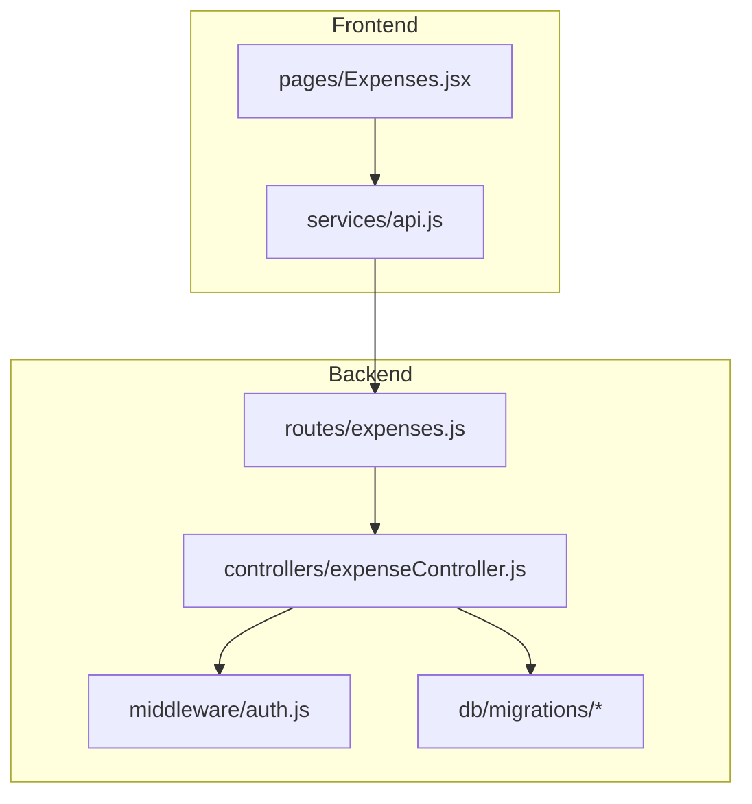
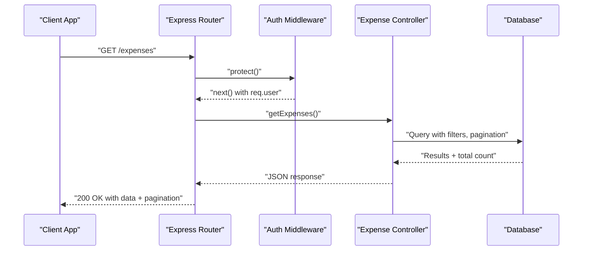
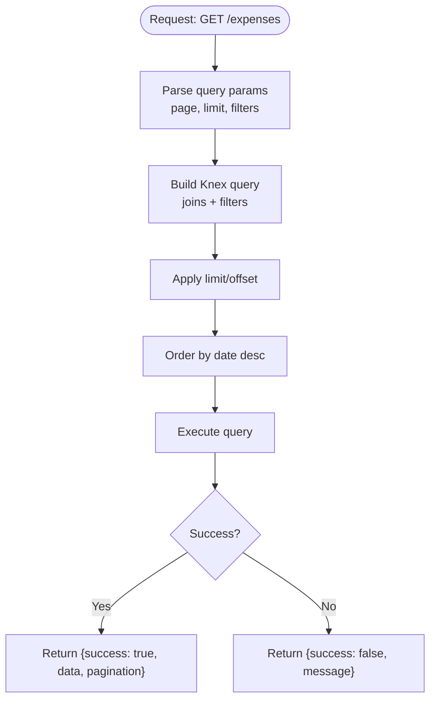
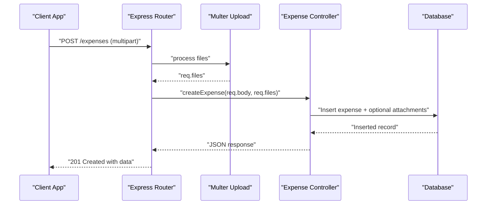
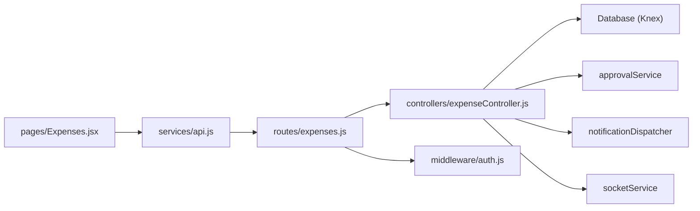

# Expense CRUD Operations

<cite>
**Referenced Files in This Document**
- [expenseController.js](file://backend/src/controllers/expenseController.js)
- [expenses.js](file://backend/src/routes/expenses.js)
- [auth.js](file://backend/src/middleware/auth.js)
- [20260512000000_initial_schema.js](file://backend/src/db/migrations/20260512000000_initial_schema.js)
- [20260512080000_add_quantity_unit_to_expenses.js](file://backend/src/db/migrations/20260512080000_add_quantity_unit_to_expenses.js)
- [20260512080100_add_brand_to_expenses.js](file://backend/src/db/migrations/20260512080100_add_brand_to_expenses.js)
- [Expenses.jsx](file://frontend/src/pages/Expenses.jsx)
- [api.js](file://frontend/src/services/api.js)
</cite>

## Table of Contents
1. [Introduction](#introduction)
2. [Project Structure](#project-structure)
3. [Core Components](#core-components)
4. [Architecture Overview](#architecture-overview)
5. [Detailed Component Analysis](#detailed-component-analysis)
6. [Dependency Analysis](#dependency-analysis)
7. [Performance Considerations](#performance-considerations)
8. [Troubleshooting Guide](#troubleshooting-guide)
9. [Conclusion](#conclusion)

## Introduction
This document provides comprehensive API documentation for expense CRUD operations in the petty cash system. It covers endpoint specifications, request/response schemas, filtering/sorting/pagination parameters, authorization requirements, and error handling. The backend implements REST endpoints for listing, retrieving, creating, updating, and deleting expenses, while the frontend integrates these APIs to provide a user interface for expense management.

## Project Structure
The expense feature spans backend controllers, routes, middleware, and database migrations, along with frontend pages and services that consume the APIs.

**Diagram sources**
- [expenses.js:1-49](file://backend/src/routes/expenses.js#L1-L49)
- [expenseController.js:1-358](file://backend/src/controllers/expenseController.js#L1-L358)
- [auth.js:1-36](file://backend/src/middleware/auth.js#L1-L36)
- [20260512000000_initial_schema.js:1-159](file://backend/src/db/migrations/20260512000000_initial_schema.js#L1-L159)
- [Expenses.jsx:1-856](file://frontend/src/pages/Expenses.jsx#L1-L856)
- [api.js:1-29](file://frontend/src/services/api.js#L1-L29)

**Section sources**
- [expenses.js:1-49](file://backend/src/routes/expenses.js#L1-L49)
- [expenseController.js:1-358](file://backend/src/controllers/expenseController.js#L1-L358)
- [auth.js:1-36](file://backend/src/middleware/auth.js#L1-L36)
- [20260512000000_initial_schema.js:1-159](file://backend/src/db/migrations/20260512000000_initial_schema.js#L1-L159)
- [Expenses.jsx:1-856](file://frontend/src/pages/Expenses.jsx#L1-L856)
- [api.js:1-29](file://frontend/src/services/api.js#L1-L29)

## Core Components
- Backend routes define the HTTP endpoints and apply authentication/authorization middleware.
- Controller functions implement business logic for expense queries, creation, updates, and deletions.
- Middleware enforces JWT-based authentication and role-based authorization.
- Database migrations define the schema for expenses, including optional fields for quantity/unit and brand.
- Frontend pages consume the APIs to render lists, forms, and modals for expense management.

**Section sources**
- [expenses.js:1-49](file://backend/src/routes/expenses.js#L1-L49)
- [expenseController.js:1-358](file://backend/src/controllers/expenseController.js#L1-L358)
- [auth.js:1-36](file://backend/src/middleware/auth.js#L1-L36)
- [20260512080000_add_quantity_unit_to_expenses.js:1-23](file://backend/src/db/migrations/20260512080000_add_quantity_unit_to_expenses.js#L1-L23)
- [20260512080100_add_brand_to_expenses.js:1-23](file://backend/src/db/migrations/20260512080100_add_brand_to_expenses.js#L1-L23)

## Architecture Overview
The expense module follows a layered architecture:
- HTTP Layer: Express routes define endpoints and attach middleware.
- Business Logic Layer: Controllers encapsulate CRUD operations and integrate with services and database.
- Data Access Layer: Knex-based queries with joins to related entities (categories, departments).
- Presentation Layer: Frontend pages and services consume the APIs and manage UI state.

**Diagram sources**
- [expenses.js:1-49](file://backend/src/routes/expenses.js#L1-L49)
- [auth.js:1-36](file://backend/src/middleware/auth.js#L1-L36)
- [expenseController.js:7-76](file://backend/src/controllers/expenseController.js#L7-L76)

## Detailed Component Analysis

### GET /expenses
Retrieves paginated and filtered expense records with optional sorting.

- Authentication: Required (Bearer token).
- Authorization: Not enforced at route level.
- Query Parameters:
  - page (integer, default 1, min 1, max 100)
  - limit (integer, default 10, min 1, max 100)
  - search (string): Searches in remarks and requested_by
  - category (integer): Filter by category_id
  - department (integer): Filter by department_id
  - status (enum string): One of Pending, Approved, Rejected, Liquidated, For Approval, Declined
  - startDate (date), endDate (date): Date range filter
  - requestedBy (string): Partial match on requested_by
- Sorting: Defaults to descending order by date.
- Response:
  - success (boolean)
  - data (array of expenses)
  - pagination (object with total, page, limit)
- Error Responses:
  - 500 Internal Server Error with error message on failures.

**Diagram sources**
- [expenseController.js:7-76](file://backend/src/controllers/expenseController.js#L7-L76)

**Section sources**
- [expenseController.js:7-76](file://backend/src/controllers/expenseController.js#L7-L76)
- [expenses.js:41-41](file://backend/src/routes/expenses.js#L41-L41)

### GET /expenses/:id
Retrieves a single expense by ID, including related category and department names, attachments, and audit trail.

- Authentication: Required.
- Authorization: Not enforced at route level.
- Path Parameters:
  - id (integer): Expense identifier
- Response:
  - success (boolean)
  - data (object with expense fields, category_name, department_name, attachments array, audit_trail array)
- Error Responses:
  - 404 Not Found if expense does not exist
  - 500 Internal Server Error on failures

**Section sources**
- [expenseController.js:78-103](file://backend/src/controllers/expenseController.js#L78-L103)
- [expenses.js:42-42](file://backend/src/routes/expenses.js#L42-L42)

### POST /expenses
Creates a new expense record. Supports multipart/form-data for attachments.

- Authentication: Required.
- Authorization: Not enforced at route level (upload middleware applied).
- Content Type: multipart/form-data with fields:
  - date (string, required)
  - category_id (integer, nullable)
  - remarks (text, optional)
  - requested_by (string, required)
  - department_id (integer, nullable)
  - amount (decimal, required)
  - status (enum string, default Pending)
  - quantity (integer, default 1)
  - unit (string, default Piece)
  - attachments (array of files, up to 5)
- Validation Rules:
  - Fields marked required must be present.
  - quantity must be >= 1.
  - unit must be one of predefined values (e.g., Piece, Box, Ream, etc.).
  - Only images and PDFs are accepted for attachments.
- Response:
  - success (boolean)
  - data (created expense object)
- Error Responses:
  - 500 Internal Server Error on failures

**Diagram sources**
- [expenses.js:15-37](file://backend/src/routes/expenses.js#L15-L37)
- [expenses.js:43-43](file://backend/src/routes/expenses.js#L43-L43)
- [expenseController.js:105-211](file://backend/src/controllers/expenseController.js#L105-L211)

**Section sources**
- [expenses.js:15-37](file://backend/src/routes/expenses.js#L15-L37)
- [expenses.js:43-43](file://backend/src/routes/expenses.js#L43-L43)
- [expenseController.js:105-211](file://backend/src/controllers/expenseController.js#L105-L211)
- [20260512080000_add_quantity_unit_to_expenses.js:1-23](file://backend/src/db/migrations/20260512080000_add_quantity_unit_to_expenses.js#L1-L23)
- [20260512080100_add_brand_to_expenses.js:1-23](file://backend/src/db/migrations/20260512080100_add_brand_to_expenses.js#L1-L23)

### PUT /expenses/:id
Updates an existing expense record.

- Authentication: Required.
- Authorization: Role-based (Super Admin, Accounting, Manager).
- Path Parameters:
  - id (integer): Expense identifier
- Request Body (fields):
  - date (string)
  - category_id (integer, nullable)
  - remarks (text)
  - requested_by (string)
  - department_id (integer, nullable)
  - amount (decimal)
  - status (enum string)
  - quantity (integer)
  - unit (string)
- Validation Rules:
  - Fields are optional; partial updates are supported.
  - quantity must be >= 1.
- Response:
  - success (boolean)
  - data (updated expense object)
- Error Responses:
  - 403 Forbidden if user role is not authorized
  - 404 Not Found if expense does not exist
  - 500 Internal Server Error on failures

**Section sources**
- [expenses.js:44-44](file://backend/src/routes/expenses.js#L44-L44)
- [auth.js:23-33](file://backend/src/middleware/auth.js#L23-L33)
- [expenseController.js:213-253](file://backend/src/controllers/expenseController.js#L213-L253)

### DELETE /expenses/:id
Deletes an expense by ID.

- Authentication: Required.
- Authorization: Role-based (Super Admin).
- Path Parameters:
  - id (integer): Expense identifier
- Behavior:
  - Removes related records (attachments, approval tokens/audit if present).
  - Broadcasts balance and status updates.
- Response:
  - success (boolean)
  - message (string)
- Error Responses:
  - 403 Forbidden if user role is not authorized
  - 404 Not Found if expense does not exist
  - 500 Internal Server Error on failures

**Section sources**
- [expenses.js:46-46](file://backend/src/routes/expenses.js#L46-L46)
- [auth.js:23-33](file://backend/src/middleware/auth.js#L23-L33)
- [expenseController.js:255-289](file://backend/src/controllers/expenseController.js#L255-L289)

### PATCH /expenses/:id/status
Updates the status of an expense (e.g., Approved, Rejected, Liquidated). Includes approval workflow for high-value expenses.

- Authentication: Required.
- Authorization: Role-based (Super Admin, Accounting, Manager).
- Path Parameters:
  - id (integer): Expense identifier
- Request Body:
  - status (enum string): One of Pending, Approved, Rejected, Liquidated
- Behavior:
  - Initiates email approval workflow if threshold is exceeded for Liquidation.
  - Broadcasts balance and status updates.
- Response:
  - success (boolean)
  - data (updated expense)
  - message (string, optional)
  - requiresApproval (boolean, optional)
- Error Responses:
  - 403 Forbidden if user role is not authorized
  - 404 Not Found if expense does not exist
  - 500 Internal Server Error on failures

**Section sources**
- [expenses.js:45-45](file://backend/src/routes/expenses.js#L45-L45)
- [auth.js:23-33](file://backend/src/middleware/auth.js#L23-L33)
- [expenseController.js:291-357](file://backend/src/controllers/expenseController.js#L291-L357)

## Dependency Analysis
- Routes depend on controller functions and middleware.
- Controllers depend on database access and external services (approval/email).
- Frontend pages depend on the API service for HTTP communication.

**Diagram sources**
- [expenses.js:1-49](file://backend/src/routes/expenses.js#L1-L49)
- [expenseController.js:1-358](file://backend/src/controllers/expenseController.js#L1-L358)
- [auth.js:1-36](file://backend/src/middleware/auth.js#L1-L36)
- [Expenses.jsx:1-856](file://frontend/src/pages/Expenses.jsx#L1-L856)
- [api.js:1-29](file://frontend/src/services/api.js#L1-L29)

**Section sources**
- [expenses.js:1-49](file://backend/src/routes/expenses.js#L1-L49)
- [expenseController.js:1-358](file://backend/src/controllers/expenseController.js#L1-L358)
- [auth.js:1-36](file://backend/src/middleware/auth.js#L1-L36)
- [Expenses.jsx:1-856](file://frontend/src/pages/Expenses.jsx#L1-L856)
- [api.js:1-29](file://frontend/src/services/api.js#L1-L29)

## Performance Considerations
- Pagination limits are enforced (min 1, max 100) to prevent heavy queries.
- Filtering and sorting are applied at the database level using Knex.
- Large attachment uploads are handled via multer; ensure appropriate disk space and file size limits.
- Broadcasting and notifications occur after updates; consider rate limiting if many concurrent updates occur.

[No sources needed since this section provides general guidance]

## Troubleshooting Guide
Common issues and resolutions:
- Unauthorized Access:
  - Symptom: 401 Not authorized to access this route.
  - Cause: Missing or invalid Bearer token.
  - Resolution: Ensure a valid token is included in Authorization header.
- Forbidden Access:
  - Symptom: 403 User role is not authorized to access this route.
  - Cause: Insufficient role for PUT/DELETE/PATCH endpoints.
  - Resolution: Verify user role is Super Admin, Accounting, or Manager as required.
- Not Found:
  - Symptom: 404 Not Found for GET/PUT/DELETE/:id.
  - Cause: Expense ID does not exist.
  - Resolution: Confirm the ID exists or refresh the list.
- Attachment Upload Errors:
  - Symptom: Error during POST /expenses with attachments.
  - Cause: Unsupported file type or exceeding file count limit.
  - Resolution: Ensure files are images or PDFs and under 5 attachments.

**Section sources**
- [auth.js:10-21](file://backend/src/middleware/auth.js#L10-L21)
- [auth.js:25-30](file://backend/src/middleware/auth.js#L25-L30)
- [expenses.js:27-36](file://backend/src/routes/expenses.js#L27-L36)
- [expenseController.js:141-149](file://backend/src/controllers/expenseController.js#L141-L149)

## Conclusion
The expense CRUD module provides robust endpoints for listing, viewing, creating, updating, and deleting expense records with comprehensive filtering, pagination, and authorization controls. The frontend integrates seamlessly with these APIs to deliver a responsive user experience. Adhering to the documented schemas, validation rules, and authorization requirements ensures reliable operation across environments.