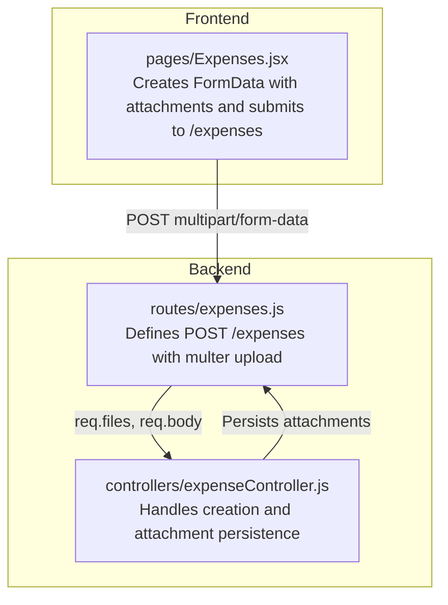
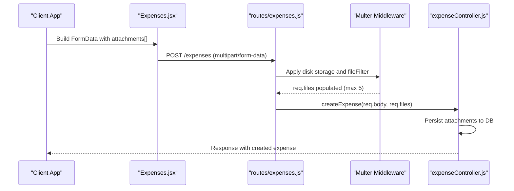
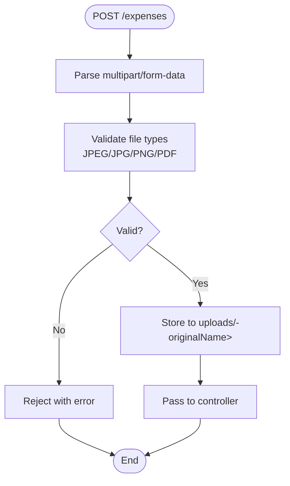
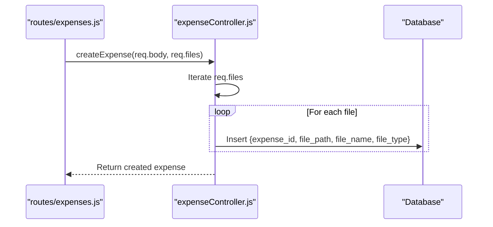
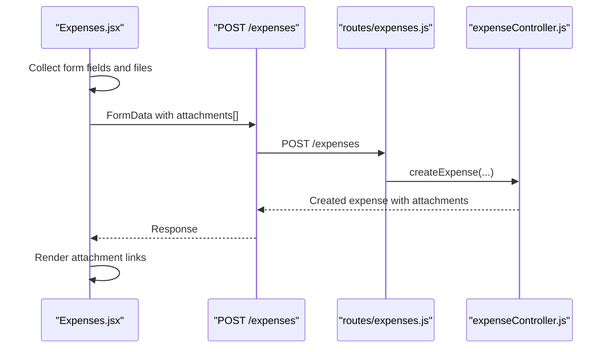
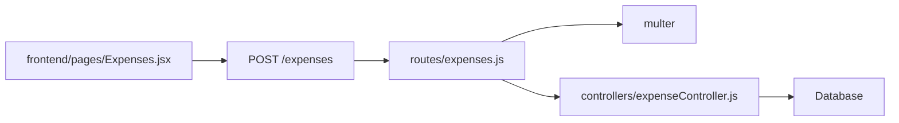

# Expense File Upload & Attachments

<cite>
**Referenced Files in This Document**
- [expenses.js](file://backend/src/routes/expenses.js)
- [expenseController.js](file://backend/src/controllers/expenseController.js)
- [Expenses.jsx](file://frontend/src/pages/Expenses.jsx)
</cite>

## Table of Contents
1. [Introduction](#introduction)
2. [Project Structure](#project-structure)
3. [Core Components](#core-components)
4. [Architecture Overview](#architecture-overview)
5. [Detailed Component Analysis](#detailed-component-analysis)
6. [Dependency Analysis](#dependency-analysis)
7. [Performance Considerations](#performance-considerations)
8. [Troubleshooting Guide](#troubleshooting-guide)
9. [Conclusion](#conclusion)

## Introduction
This document describes the expense file upload functionality for the petty cash system. It covers the multipart/form-data endpoint POST /expenses with support for attaching up to five files per request. The specification defines supported file types, naming conventions, storage configuration, validation rules, error handling, and security considerations.

## Project Structure
The upload feature spans backend routing and controller logic, and frontend integration for creating and submitting requests.

**Diagram sources**
- [expenses.js:1-48](file://backend/src/routes/expenses.js#L1-L48)
- [expenseController.js:116-156](file://backend/src/controllers/expenseController.js#L116-L156)
- [Expenses.jsx:767-782](file://frontend/src/pages/Expenses.jsx#L767-L782)

**Section sources**
- [expenses.js:1-48](file://backend/src/routes/expenses.js#L1-L48)
- [expenseController.js:116-156](file://backend/src/controllers/expenseController.js#L116-L156)
- [Expenses.jsx:767-782](file://frontend/src/pages/Expenses.jsx#L767-L782)

## Core Components
- Endpoint: POST /expenses
- Field: attachments (array)
- Limit: 5 files per request
- Supported types: JPEG, JPG, PNG, PDF
- Storage: uploads/ directory
- Naming: timestamp prefix + original filename
- Validation: file type filter via multer

**Section sources**
- [expenses.js:15-43](file://backend/src/routes/expenses.js#L15-L43)
- [expenseController.js:140-149](file://backend/src/controllers/expenseController.js#L140-L149)

## Architecture Overview
The upload pipeline integrates frontend FormData construction with backend multer processing and database persistence.

**Diagram sources**
- [expenses.js:15-43](file://backend/src/routes/expenses.js#L15-L43)
- [expenseController.js:140-149](file://backend/src/controllers/expenseController.js#L140-L149)
- [Expenses.jsx:767-782](file://frontend/src/pages/Expenses.jsx#L767-L782)

## Detailed Component Analysis

### Backend Route: POST /expenses with Multer Upload
- Disk storage destination configured to uploads/
- Filename format: timestamp prefix + original filename
- File filter accepts only JPEG, JPG, PNG, PDF
- Uses upload.array('attachments', 5) to accept up to 5 files

**Diagram sources**
- [expenses.js:15-43](file://backend/src/routes/expenses.js#L15-L43)

**Section sources**
- [expenses.js:15-43](file://backend/src/routes/expenses.js#L15-L43)

### Controller: Attachment Persistence
- On successful creation, iterates req.files
- Inserts each attachment record with:
  - expense_id
  - file_path (stored by multer)
  - file_name (original filename)
  - file_type (mimetype)
- Persists to expense_attachments table

**Diagram sources**
- [expenseController.js:140-149](file://backend/src/controllers/expenseController.js#L140-L149)

**Section sources**
- [expenseController.js:140-149](file://backend/src/controllers/expenseController.js#L140-L149)

### Frontend: Form Submission with Attachments
- Builds FormData containing expense fields plus multiple files under attachments[]
- Submits with Content-Type multipart/form-data
- Displays uploaded attachments as clickable links

**Diagram sources**
- [Expenses.jsx:767-782](file://frontend/src/pages/Expenses.jsx#L767-L782)

**Section sources**
- [Expenses.jsx:767-782](file://frontend/src/pages/Expenses.jsx#L767-L782)

## Dependency Analysis
- routes/expenses.js depends on:
  - multer for disk storage and file filtering
  - expenseController for business logic
- controllers/expenseController depends on:
  - Database ORM for inserting attachments
- frontend/pages/Expenses.jsx depends on:
  - API service for posting FormData

**Diagram sources**
- [expenses.js:1-48](file://backend/src/routes/expenses.js#L1-L48)
- [expenseController.js:116-156](file://backend/src/controllers/expenseController.js#L116-L156)
- [Expenses.jsx:767-782](file://frontend/src/pages/Expenses.jsx#L767-L782)

**Section sources**
- [expenses.js:1-48](file://backend/src/routes/expenses.js#L1-L48)
- [expenseController.js:116-156](file://backend/src/controllers/expenseController.js#L116-L156)
- [Expenses.jsx:767-782](file://frontend/src/pages/Expenses.jsx#L767-L782)

## Performance Considerations
- Multer stores files on disk; ensure sufficient disk space in uploads/
- Up to 5 files per request; validate client-side to avoid oversized payloads
- No explicit size limits are enforced by multer in the route; consider adding size constraints if needed
- File naming avoids collisions via timestamp prefix

[No sources needed since this section provides general guidance]

## Troubleshooting Guide
Common issues and resolutions:
- Invalid file type error: Ensure files are JPEG, JPG, PNG, or PDF
- Too many files: Limit selection to 5 or fewer
- Upload directory permissions: Verify backend has write access to uploads/
- Missing Content-Type: Submit with multipart/form-data header
- FileFilter rejection: Confirm file extension and MIME type match allowed types

**Section sources**
- [expenses.js:25-37](file://backend/src/routes/expenses.js#L25-L37)

## Conclusion
The expense file upload feature supports secure, validated uploads of up to five documents per expense submission. Files are stored with timestamped names in the uploads/ directory and persisted with metadata for retrieval and audit. The frontend integrates seamlessly by building FormData with the attachments[] field and submitting via POST /expenses.