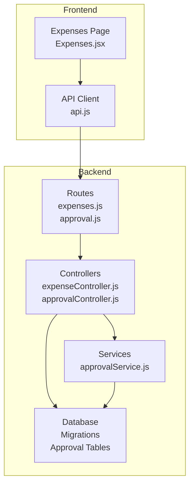
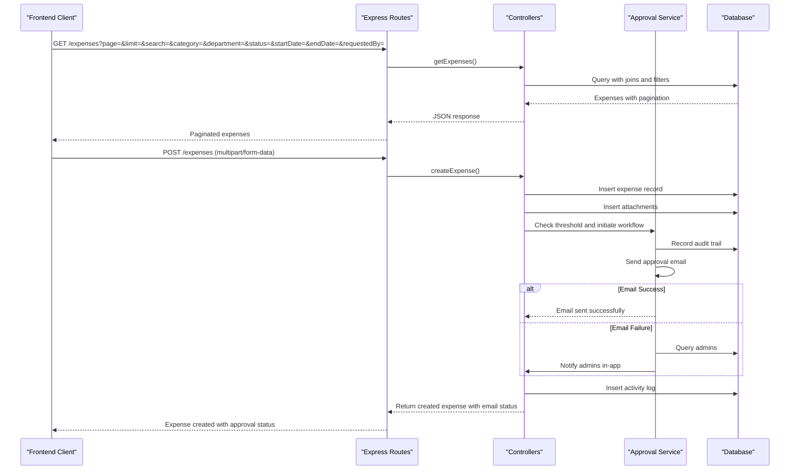
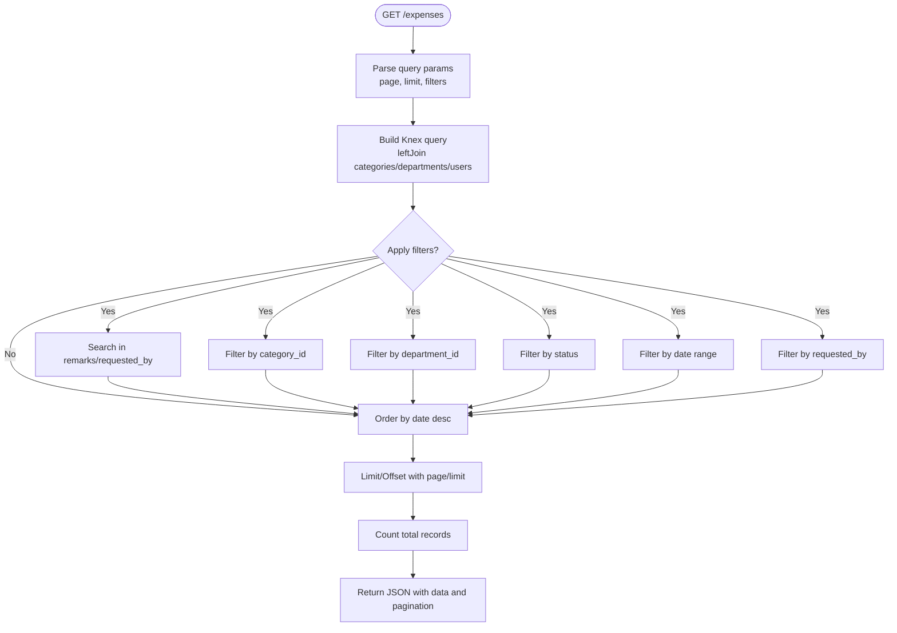
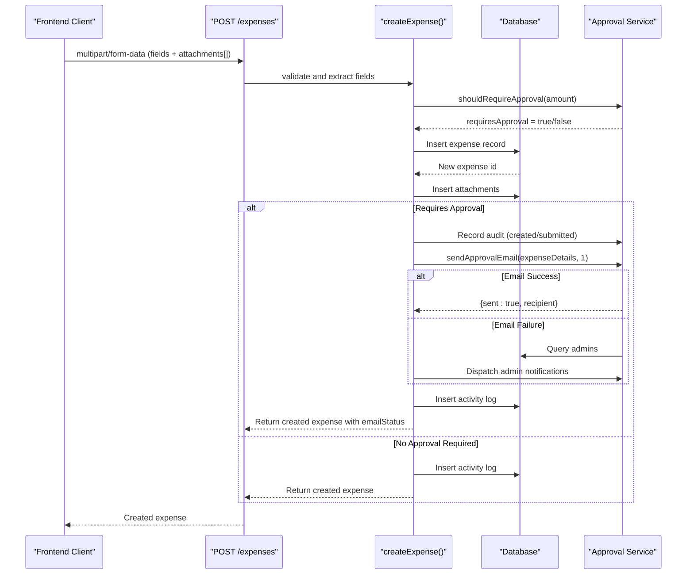
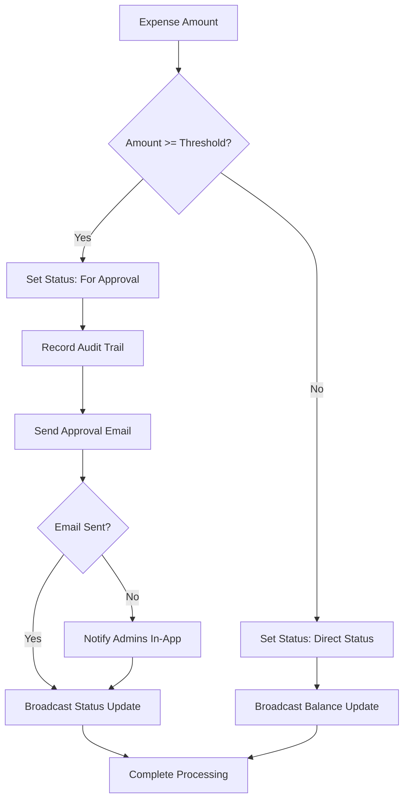
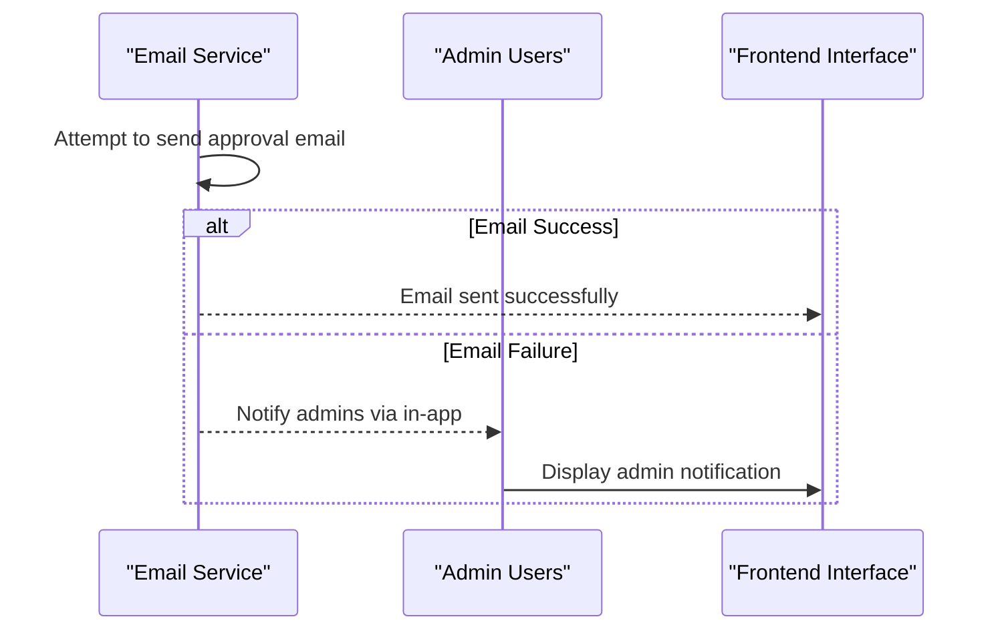
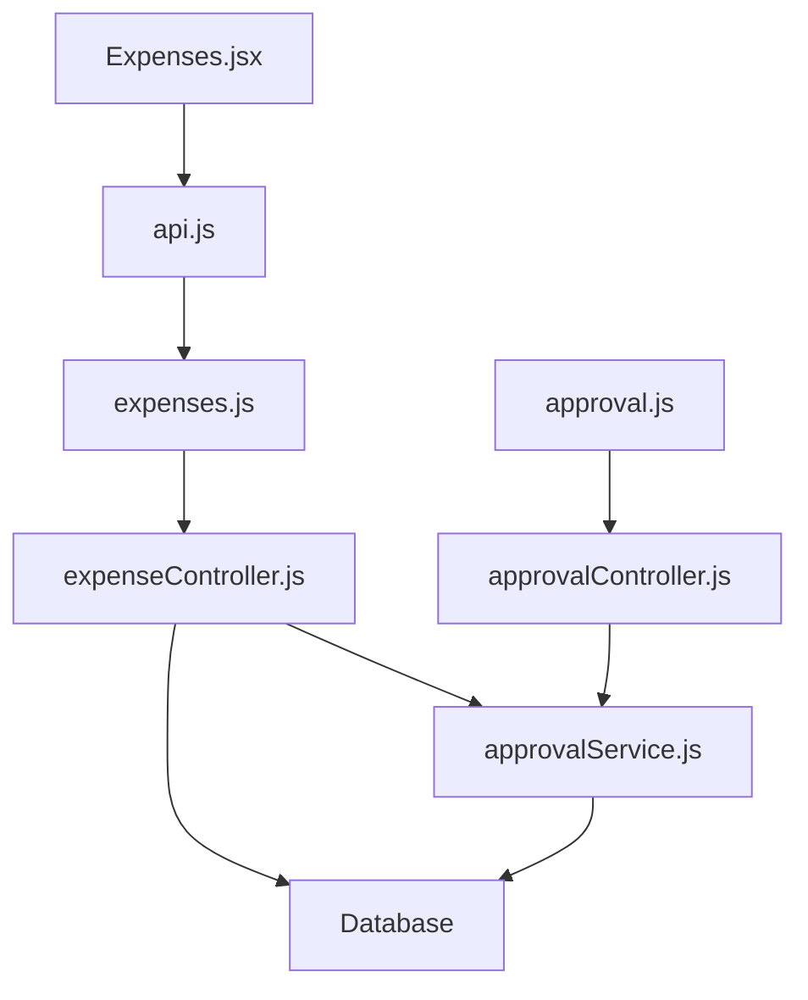

# Expense Management API

<cite>
**Referenced Files in This Document**
- [expenseController.js](file://backend/src/controllers/expenseController.js)
- [expenses.js](file://backend/src/routes/expenses.js)
- [approvalController.js](file://backend/src/controllers/approvalController.js)
- [approval.js](file://backend/src/routes/approval.js)
- [approvalService.js](file://backend/src/services/approvalService.js)
- [20260611000000_add_liquidation_approval_workflow.js](file://backend/src/db/migrations/20260611000000_add_liquidation_approval_workflow.js)
- [20260512080000_add_quantity_unit_to_expenses.js](file://backend/src/db/migrations/20260512080000_add_quantity_unit_to_expenses.js)
- [20260512080100_add_brand_to_expenses.js](file://backend/src/db/migrations/20260512080100_add_brand_to_expenses.js)
- [Expenses.jsx](file://frontend/src/pages/Expenses.jsx)
- [api.js](file://frontend/src/services/api.js)
</cite>

## Update Summary
**Changes Made**
- Enhanced expense creation process with automatic approval workflow integration
- Added intelligent approval threshold detection and multi-level approval support
- Implemented comprehensive email notification fallback mechanisms
- Added detailed status tracking and audit trail capabilities
- Updated frontend integration to handle approval workflow responses
- Enhanced approval settings management with configurable thresholds

## Table of Contents
1. [Introduction](#introduction)
2. [Project Structure](#project-structure)
3. [Core Components](#core-components)
4. [Architecture Overview](#architecture-overview)
5. [Detailed Component Analysis](#detailed-component-analysis)
6. [Enhanced Approval Workflow](#enhanced-approval-workflow)
7. [Dependency Analysis](#dependency-analysis)
8. [Performance Considerations](#performance-considerations)
9. [Troubleshooting Guide](#troubleshooting-guide)
10. [Conclusion](#conclusion)

## Introduction
This document provides comprehensive API documentation for the enhanced expense management system. The system now features an integrated approval workflow that automatically triggers when expense amounts exceed configured thresholds. It covers CRUD operations for expense records, attachment upload endpoints, intelligent approval processing, comprehensive status management, and bulk operations. The system includes automatic email notifications, fallback mechanisms, and detailed audit trails for complete transparency.

## Project Structure
The expense management API is implemented in the backend using Express.js and Knex.js for database operations, with dedicated controllers, routes, and services. The approval workflow is seamlessly integrated into the expense creation and status update processes. Frontend integration is handled via a React-based interface that consumes the API endpoints and displays approval workflow status.

**Diagram sources**
- [expenses.js:1-49](file://backend/src/routes/expenses.js#L1-L49)
- [expenseController.js:1-385](file://backend/src/controllers/expenseController.js#L1-L385)
- [approval.js:1-38](file://backend/src/routes/approval.js#L1-L38)
- [approvalController.js:1-108](file://backend/src/controllers/approvalController.js#L1-L108)
- [approvalService.js:1-622](file://backend/src/services/approvalService.js#L1-L622)
- [Expenses.jsx:1-862](file://frontend/src/pages/Expenses.jsx#L1-L862)
- [api.js:1-29](file://frontend/src/services/api.js#L1-L29)

**Section sources**
- [expenses.js:1-49](file://backend/src/routes/expenses.js#L1-L49)
- [expenseController.js:1-385](file://backend/src/controllers/expenseController.js#L1-L385)
- [approval.js:1-38](file://backend/src/routes/approval.js#L1-L38)
- [approvalController.js:1-108](file://backend/src/controllers/approvalController.js#L1-L108)
- [approvalService.js:1-622](file://backend/src/services/approvalService.js#L1-L622)
- [Expenses.jsx:1-862](file://frontend/src/pages/Expenses.jsx#L1-L862)
- [api.js:1-29](file://frontend/src/services/api.js#L1-L29)

## Core Components
- **Expense Controller**: Implements GET, POST, PUT, DELETE, and PATCH endpoints for expense records, including intelligent approval workflow integration, status updates, and attachment handling.
- **Approval Controller**: Manages approval settings, approver lists, token-based approval/decline workflows, and audit trail access.
- **Approval Service**: Handles approval thresholds, multi-level approvals, email notifications, comprehensive audit trails, token verification, and fallback notification mechanisms.
- **Routes**: Define endpoint paths, authentication middleware, file upload configuration, and approval workflow endpoints.
- **Migrations**: Define schema changes for quantity/unit fields, brand field, approval workflow tables, and enhanced status tracking.

**Section sources**
- [expenseController.js:1-385](file://backend/src/controllers/expenseController.js#L1-L385)
- [approvalController.js:1-108](file://backend/src/controllers/approvalController.js#L1-L108)
- [approvalService.js:1-622](file://backend/src/services/approvalService.js#L1-L622)
- [expenses.js:1-49](file://backend/src/routes/expenses.js#L1-L49)
- [approval.js:1-38](file://backend/src/routes/approval.js#L1-L38)
- [20260512080000_add_quantity_unit_to_expenses.js:1-23](file://backend/src/db/migrations/20260512080000_add_quantity_unit_to_expenses.js#L1-L23)
- [20260512080100_add_brand_to_expenses.js:1-23](file://backend/src/db/migrations/20260512080100_add_brand_to_expenses.js#L1-L23)
- [20260611000000_add_liquidation_approval_workflow.js:1-179](file://backend/src/db/migrations/20260611000000_add_liquidation_approval_workflow.js#L1-L179)

## Architecture Overview
The system follows a layered architecture with enhanced approval workflow integration:
- **Presentation Layer**: Frontend React page consuming REST endpoints with real-time approval status updates.
- **API Layer**: Express routes delegating to controllers with automatic approval workflow triggering.
- **Business Logic Layer**: Controllers orchestrate service calls, database operations, and approval processing.
- **Persistence Layer**: Knex.js queries against the database with migrations ensuring schema consistency and approval tracking.

**Diagram sources**
- [expenses.js:1-49](file://backend/src/routes/expenses.js#L1-L49)
- [expenseController.js:105-233](file://backend/src/controllers/expenseController.js#L105-L233)
- [approvalService.js:114-117](file://backend/src/services/approvalService.js#L114-L117)
- [approvalService.js:252-292](file://backend/src/services/approvalService.js#L252-L292)
- [approvalService.js:322-344](file://backend/src/services/approvalService.js#L322-L344)

## Detailed Component Analysis

### Expense Endpoints

#### List Expenses
- **Method**: GET
- **Path**: /api/expenses
- **Authentication**: Required
- **Authorization**: None (protected by middleware)
- **Query Parameters**:
  - page: integer, default 1, min 1, max 100
  - limit: integer, default 10, min 1, max 100
  - search: string, free-text search across remarks and requested_by
  - category: integer, category_id filter
  - department: integer, department_id filter
  - status: string enum, filters by status
  - startDate: date, ISO string
  - endDate: date, ISO string
  - requestedBy: string, partial match filter
- **Response**:
  - success: boolean
  - data: array of expense objects with category_name, department_name, and creator_name
  - pagination: { total, page, limit }

**Diagram sources**
- [expenseController.js:7-76](file://backend/src/controllers/expenseController.js#L7-L76)

**Section sources**
- [expenses.js:41-41](file://backend/src/routes/expenses.js#L41-L41)
- [expenseController.js:7-76](file://backend/src/controllers/expenseController.js#L7-L76)

#### Get Single Expense
- **Method**: GET
- **Path**: /api/expenses/:id
- **Authentication**: Required
- **Authorization**: None
- **Path Parameters**:
  - id: integer, expense identifier
- **Response**:
  - success: boolean
  - data: expense object joined with category and department names
  - data.attachments: array of attachment records
  - data.audit_trail: array of approval actions with timestamps, actor info, and IP addresses

**Section sources**
- [expenses.js:42-42](file://backend/src/routes/expenses.js#L42-L42)
- [expenseController.js:78-103](file://backend/src/controllers/expenseController.js#L78-L103)

#### Create Expense
- **Method**: POST
- **Path**: /api/expenses
- **Authentication**: Required
- **Authorization**: None
- **Content-Type**: multipart/form-data
- **Form Fields (all required unless noted)**:
  - date: string (ISO date)
  - category_id: integer (optional)
  - remarks: string
  - requested_by: string
  - department_id: integer (optional)
  - amount: number (currency)
  - status: string enum (Pending, Approved, Rejected, Liquidated, For Approval, Declined)
  - quantity: integer, default 1
  - unit: string, default "Piece"
  - attachments[]: files (up to 5), allowed types: jpeg, jpg, png, pdf
- **Behavior**:
  - **Enhanced**: Automatically checks approval threshold using approvalService.shouldRequireApproval()
  - **Enhanced**: If amount meets approval threshold, sets status to "For Approval" and initiates multi-level approval workflow
  - **Enhanced**: Records comprehensive audit trail with actor details and IP addresses
  - **Enhanced**: Sends approval email with fallback notification to admins if email fails
  - **Enhanced**: Broadcasts real-time status updates with email delivery status
  - **Enhanced**: Inserts expense record with created_by set to current user
  - **Enhanced**: Saves uploaded files as attachments
  - **Enhanced**: Records activity log and broadcasts balance updates
- **Response**:
  - success: boolean
  - data: created expense object
  - emailStatus: object (when approval required) with sent, reason, and recipient properties
  - If approval required: includes requiresApproval flag and message

**Diagram sources**
- [expenses.js:25-37](file://backend/src/routes/expenses.js#L25-L37)
- [expenses.js:43-43](file://backend/src/routes/expenses.js#L43-L43)
- [expenseController.js:105-233](file://backend/src/controllers/expenseController.js#L105-L233)
- [approvalService.js:114-117](file://backend/src/services/approvalService.js#L114-L117)
- [approvalService.js:252-292](file://backend/src/services/approvalService.js#L252-L292)
- [approvalService.js:322-344](file://backend/src/services/approvalService.js#L322-L344)

**Section sources**
- [expenses.js:15-37](file://backend/src/routes/expenses.js#L15-L37)
- [expenses.js:43-43](file://backend/src/routes/expenses.js#L43-L43)
- [expenseController.js:105-233](file://backend/src/controllers/expenseController.js#L105-L233)
- [20260512080000_add_quantity_unit_to_expenses.js:1-23](file://backend/src/db/migrations/20260512080000_add_quantity_unit_to_expenses.js#L1-L23)
- [20260512080100_add_brand_to_expenses.js:1-23](file://backend/src/db/migrations/20260512080100_add_brand_to_expenses.js#L1-L23)

#### Update Expense
- **Method**: PUT
- **Path**: /api/expenses/:id
- **Authentication**: Required
- **Authorization**: Super Admin, Accounting, Manager
- **Path Parameters**:
  - id: integer
- **JSON Body**:
  - date: string (ISO date)
  - category_id: integer (optional)
  - remarks: string
  - requested_by: string
  - department_id: integer (optional)
  - amount: number (currency)
  - status: string enum
  - quantity: integer
  - unit: string
- **Behavior**:
  - Updates expense record and records activity log
  - Broadcasts balance update regardless of amount/status changes
- **Response**:
  - success: boolean
  - data: updated expense object

**Section sources**
- [expenses.js:44-44](file://backend/src/routes/expenses.js#L44-L44)
- [expenseController.js:235-275](file://backend/src/controllers/expenseController.js#L235-L275)

#### Delete Expense
- **Method**: DELETE
- **Path**: /api/expenses/:id
- **Authentication**: Required
- **Authorization**: Super Admin
- **Path Parameters**:
  - id: integer
- **Behavior**:
  - Deletes related tokens, audit records, and attachments
  - Removes expense record
  - Records activity log and broadcasts balance and status updates
- **Response**:
  - success: boolean
  - message: string

**Section sources**
- [expenses.js:46-46](file://backend/src/routes/expenses.js#L46-L46)
- [expenseController.js:277-311](file://backend/src/controllers/expenseController.js#L277-L311)

#### Update Expense Status
- **Method**: PATCH
- **Path**: /api/expenses/:id/status
- **Authentication**: Required
- **Authorization**: Super Admin, Accounting, Manager
- **Path Parameters**:
  - id: integer
- **JSON Body**:
  - status: string enum (Approved, Rejected, Liquidated)
- **Behavior**:
  - **Enhanced**: Intercepts liquidation requests that exceed approval threshold
  - **Enhanced**: Initiates multi-level approval workflow if threshold exceeded
  - **Enhanced**: Provides comprehensive email status feedback
  - **Enhanced**: Updates status and records activity log
  - **Enhanced**: Notifies requester via in-app notification
  - **Enhanced**: Broadcasts balance and status updates
- **Response**:
  - success: boolean
  - data: updated expense object
  - requiresApproval: boolean (when threshold exceeded)
  - message: string (when requiresApproval is true)
  - emailStatus: object (when approval workflow initiated)

**Section sources**
- [expenses.js:45-45](file://backend/src/routes/expenses.js#L45-L45)
- [expenseController.js:313-385](file://backend/src/controllers/expenseController.js#L313-L385)

### Attachment Upload Endpoint
- **Method**: POST
- **Path**: /api/expenses
- **Content-Type**: multipart/form-data
- **Files**:
  - attachments[]: up to 5 files
  - Allowed types: image/jpeg, image/jpg, image/png, application/pdf
- **Storage**:
  - Files saved to server uploads/ directory with sanitized filenames
- **Behavior**:
  - On successful expense creation, inserts attachment records linking to expense_id

**Section sources**
- [expenses.js:15-37](file://backend/src/routes/expenses.js#L15-L37)
- [expenses.js:43-43](file://backend/src/routes/expenses.js#L43-L43)
- [expenseController.js:142-150](file://backend/src/controllers/expenseController.js#L142-L150)

### Enhanced Approval Workflow Endpoints
- **Verify Token (Public)**:
  - Method: GET
  - Path: /api/approval/token/:token
  - Response:
    - success: boolean
    - data: { action_type, approval_level, expense: { id, reference_number, requested_by, department_name, category_name, amount, remarks, status } }
- **Approve by Token**:
  - Method: POST
  - Path: /api/approval/approve/:token
  - Response:
    - success: boolean
    - data: { status, expense, multiLevel, level }
    - message: string (indicates multi-level or completion)
- **Decline by Token**:
  - Method: POST
  - Path: /api/approval/decline/:token
  - JSON Body:
    - reason: string (required)
  - Response:
    - success: boolean
    - data: { status, expense }
    - message: string

**Section sources**
- [approval.js:18-21](file://backend/src/routes/approval.js#L18-L21)
- [approvalController.js:61-98](file://backend/src/controllers/approvalController.js#L61-L98)
- [approvalService.js:415-587](file://backend/src/services/approvalService.js#L415-L587)

### Approval Settings and Approver Management
- **Get Settings**:
  - Method: GET
  - Path: /api/approval/settings
  - Response:
    - success: boolean
    - data: { liquidation_approval_threshold, liquidation_approval_email_enabled, liquidation_approval_recipient_email, approvers[] }
- **Update Settings**:
  - Method: PUT
  - Path: /api/approval/settings
  - Response:
    - success: boolean
    - data: settings object
    - message: string
- **List Approvers**:
  - Method: GET
  - Path: /api/approval/approvers
  - Response:
    - success: boolean
    - data: approver list
- **Add Approver**:
  - Method: POST
  - Path: /api/approval/approvers
  - JSON Body:
    - email: string (required)
    - name: string
    - approval_level: integer
    - is_active: boolean
  - Response:
    - success: boolean
    - data: approver object
- **Update Approver**:
  - Method: PUT
  - Path: /api/approval/approvers/:id
  - Response:
    - success: boolean
    - data: approver object
- **Delete Approver**:
  - Method: DELETE
  - Path: /api/approval/approvers/:id
  - Response:
    - success: boolean
    - message: string

**Section sources**
- [approval.js:26-32](file://backend/src/routes/approval.js#L26-L32)
- [approvalController.js:3-59](file://backend/src/controllers/approvalController.js#L3-L59)
- [approvalService.js:23-57](file://backend/src/services/approvalService.js#L23-L57)
- [approvalService.js:589-618](file://backend/src/services/approvalService.js#L589-L618)

### Expense Schema and Fields
- **Core Fields**:
  - date: date
  - category_id: integer (nullable)
  - remarks: text
  - requested_by: string
  - department_id: integer (nullable)
  - amount: decimal
  - status: string enum (Pending, Approved, Rejected, Liquidated, For Approval, Declined)
  - created_by: integer
  - updated_at: timestamp
- **Enhanced Fields** (conditionally present):
  - quantity: integer (default 1)
  - unit: string (default "Piece")
  - brand: string (nullable)
  - current_approval_level: integer (default 0)
  - submitted_by: integer (nullable)
  - submitted_at: timestamp
  - approval_context: string (nullable)
  - **Enhanced**: Comprehensive audit trail tracking all approval actions

**Section sources**
- [20260512080000_add_quantity_unit_to_expenses.js:1-23](file://backend/src/db/migrations/20260512080000_add_quantity_unit_to_expenses.js#L1-L23)
- [20260512080100_add_brand_to_expenses.js:1-23](file://backend/src/db/migrations/20260512080100_add_brand_to_expenses.js#L1-L23)
- [20260611000000_add_liquidation_approval_workflow.js:12-19](file://backend/src/db/migrations/20260611000000_add_liquidation_approval_workflow.js#L12-L19)

### Filtering, Sorting, and Pagination
- **Filtering**:
  - Free-text search across remarks and requested_by
  - Category, department, status, requested_by exact match
  - Date range filtering with startDate and endDate
- **Sorting**:
  - Default order: date descending
- **Pagination**:
  - page: integer, minimum 1, capped at 100
  - limit: integer, minimum 1, capped at 100
  - Returns total count, current page, and limit

**Section sources**
- [expenseController.js:7-76](file://backend/src/controllers/expenseController.js#L7-L76)

## Enhanced Approval Workflow

### Intelligent Threshold Detection
The system now automatically detects when expense amounts exceed configured approval thresholds and initiates the appropriate workflow:

**Diagram sources**
- [approvalService.js:114-117](file://backend/src/services/approvalService.js#L114-L117)
- [approvalService.js:252-292](file://backend/src/services/approvalService.js#L252-L292)
- [approvalService.js:322-344](file://backend/src/services/approvalService.js#L322-L344)

### Multi-Level Approval Process
The approval workflow supports multiple approval levels with comprehensive tracking:

1. **Threshold Detection**: Automatic approval requirement based on configured thresholds
2. **Token Generation**: Secure approval and decline tokens with expiration
3. **Email Notification**: Automated email to designated approvers
4. **Fallback Mechanism**: In-app notifications to admins when emails fail
5. **Multi-Level Progression**: Sequential approval levels with status tracking
6. **Final Approval**: Automatic status update to Liquidated or Approved
7. **Audit Trail**: Complete record of all approval actions and decisions

### Email Notification Fallback
When email approval notifications fail, the system automatically notifies administrators through the in-app notification system:

**Diagram sources**
- [approvalService.js:322-344](file://backend/src/services/approvalService.js#L322-L344)
- [approvalService.js:192-204](file://backend/src/services/approvalService.js#L192-L204)

### Comprehensive Status Tracking
The system maintains detailed audit trails for all approval actions:

- **Created**: Expense creation with actor details and IP address
- **Submitted**: Initial submission with approval level tracking
- **Approved**: Individual approver decisions with timestamps
- **Declined**: Decline reasons recorded with approver information
- **Final Status**: Automatic status updates (Liquidated/Approved)

**Section sources**
- [approvalService.js:119-143](file://backend/src/services/approvalService.js#L119-L143)
- [approvalService.js:161-214](file://backend/src/services/approvalService.js#L161-L214)
- [expenseController.js:159-222](file://backend/src/controllers/expenseController.js#L159-L222)

### Examples: Enhanced Expense Approval Workflows and Status Transitions

#### Example 1: Expense Creation with Threshold Exceeded
- **Request**:
  - POST /api/expenses with amount exceeding threshold
- **Expected Outcome**:
  - Expense created with status "For Approval"
  - Approval workflow initiated with comprehensive audit trail
  - Approval email sent to next approver
  - Email delivery status returned to frontend
  - In-app notification to requester with approval status
  - Broadcast indicates status change with email delivery information

**Section sources**
- [expenseController.js:105-233](file://backend/src/controllers/expenseController.js#L105-L233)
- [approvalService.js:252-292](file://backend/src/services/approvalService.js#L252-L292)
- [Expenses.jsx:188-194](file://frontend/src/pages/Expenses.jsx#L188-L194)

#### Example 2: Multi-Level Approval Completion
- **Request**:
  - POST /api/approval/approve/:token (for level 1)
- **Expected Outcome**:
  - Expense remains "For Approval" with next approval level
  - Approval email sent to next approver
  - In-app notification to admins if email fails
  - Broadcast indicates status and level with email delivery status
- **Subsequent Approvals**:
  - Continue posting to /api/approval/approve/:token until final level reached
- **Final Outcome**:
  - Expense status becomes "Liquidated" (or "Approved" depending on context)
  - Notification sent to requester with approver details
  - Balance updated broadcast
  - Comprehensive audit trail maintained

**Section sources**
- [approvalController.js:73-87](file://backend/src/controllers/approvalController.js#L73-L87)
- [approvalService.js:444-541](file://backend/src/services/approvalService.js#L444-L541)
- [approvalService.js:322-344](file://backend/src/services/approvalService.js#L322-L344)

#### Example 3: Liquidation Approval Threshold Exceeded
- **Request**:
  - PATCH /api/expenses/:id/status with status "Liquidated" while current status is "Approved"
- **Expected Outcome**:
  - If amount exceeds threshold, sets status to "For Approval" and initiates workflow
  - Returns requiresApproval flag and comprehensive message
  - Provides email delivery status feedback
  - Initiates approval process with fallback notification mechanism

**Section sources**
- [expenseController.js:313-385](file://backend/src/controllers/expenseController.js#L313-L385)
- [approvalService.js:294-344](file://backend/src/services/approvalService.js#L294-L344)

## Dependency Analysis
The enhanced expense management API relies on several key dependencies with improved approval workflow integration:
- **Express.js** for routing and middleware
- **Multer** for file uploads
- **Knex.js** for database queries and migrations
- **Socket/Notification services** for real-time updates
- **Email service** for approval notifications with fallback mechanisms
- **Crypto** for secure token generation and verification

**Diagram sources**
- [expenses.js:1-49](file://backend/src/routes/expenses.js#L1-L49)
- [expenseController.js:1-385](file://backend/src/controllers/expenseController.js#L1-L385)
- [approval.js:1-38](file://backend/src/routes/approval.js#L1-L38)
- [approvalController.js:1-108](file://backend/src/controllers/approvalController.js#L1-L108)
- [approvalService.js:1-622](file://backend/src/services/approvalService.js#L1-L622)
- [Expenses.jsx:1-862](file://frontend/src/pages/Expenses.jsx#L1-L862)
- [api.js:1-29](file://frontend/src/services/api.js#L1-L29)

**Section sources**
- [expenses.js:1-49](file://backend/src/routes/expenses.js#L1-L49)
- [approval.js:1-38](file://backend/src/routes/approval.js#L1-L38)
- [approvalService.js:1-622](file://backend/src/services/approvalService.js#L1-L622)
- [Expenses.jsx:1-862](file://frontend/src/pages/Expenses.jsx#L1-L862)
- [api.js:1-29](file://frontend/src/services/api.js#L1-L29)

## Performance Considerations
- **Pagination limits**: page and limit are capped at 100 to prevent excessive loads.
- **Efficient filtering**: database-level filtering reduces payload sizes.
- **Real-time updates**: socket broadcasts minimize polling overhead.
- **File uploads**: limited to 5 files per request with MIME-type validation.
- **Approval workflow optimization**: Token-based approach prevents unnecessary database queries.
- **Email fallback caching**: Reduced email service calls when notifications fail.
- **Audit trail indexing**: Database indexes optimize approval action queries.

## Troubleshooting Guide
- **401 Unauthorized**: Ensure Authorization header with Bearer token is included.
- **403 Forbidden**: Verify role permissions (Super Admin, Accounting, Manager) for protected endpoints.
- **404 Not Found**: Confirm resource identifiers (expense id) are correct.
- **413 Payload Too Large**: Reduce number of attachments or file sizes.
- **415 Unsupported Media Type**: Ensure Content-Type is multipart/form-data for uploads.
- **Approval workflow issues**: Verify approval settings and token validity.
- **Email delivery failures**: Check SMTP configuration and fallback admin notifications.
- **Approval threshold misconfiguration**: Verify liquidation_approval_threshold setting in approval settings.
- **Multi-level approval stuck**: Check approver configurations and token expiration.

**Section sources**
- [expenses.js:39-39](file://backend/src/routes/expenses.js#L39-L39)
- [expenses.js:44-46](file://backend/src/routes/expenses.js#L44-L46)
- [expenses.js:25-37](file://backend/src/routes/expenses.js#L25-L37)
- [approval.js:18-21](file://backend/src/routes/approval.js#L18-L21)
- [approvalService.js:252-292](file://backend/src/services/approvalService.js#L252-L292)

## Conclusion
The enhanced expense management API provides a robust set of endpoints for CRUD operations, file attachments, and intelligent multi-level approval workflows. The system now features automatic approval threshold detection, comprehensive email notification fallback mechanisms, detailed audit trails, and real-time status tracking. These enhancements enable efficient expense tracking, transparent approval processes, and reliable communication between stakeholders while maintaining security and compliance standards.