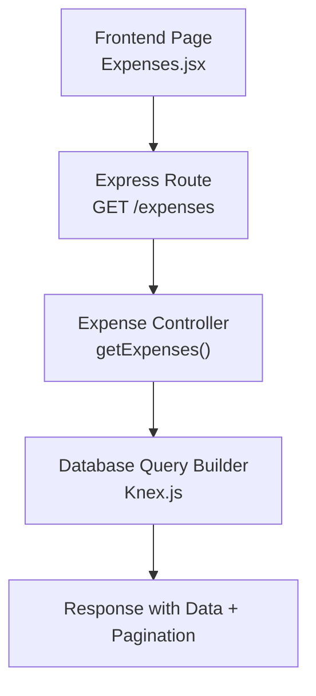
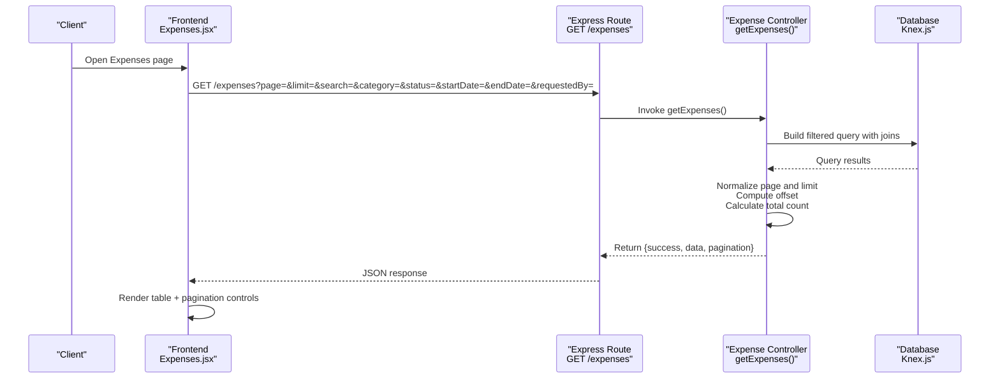
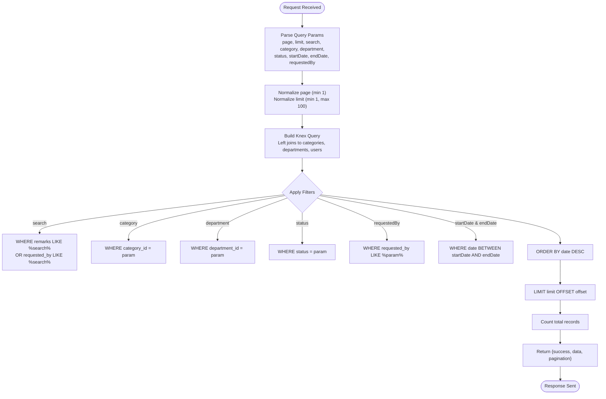
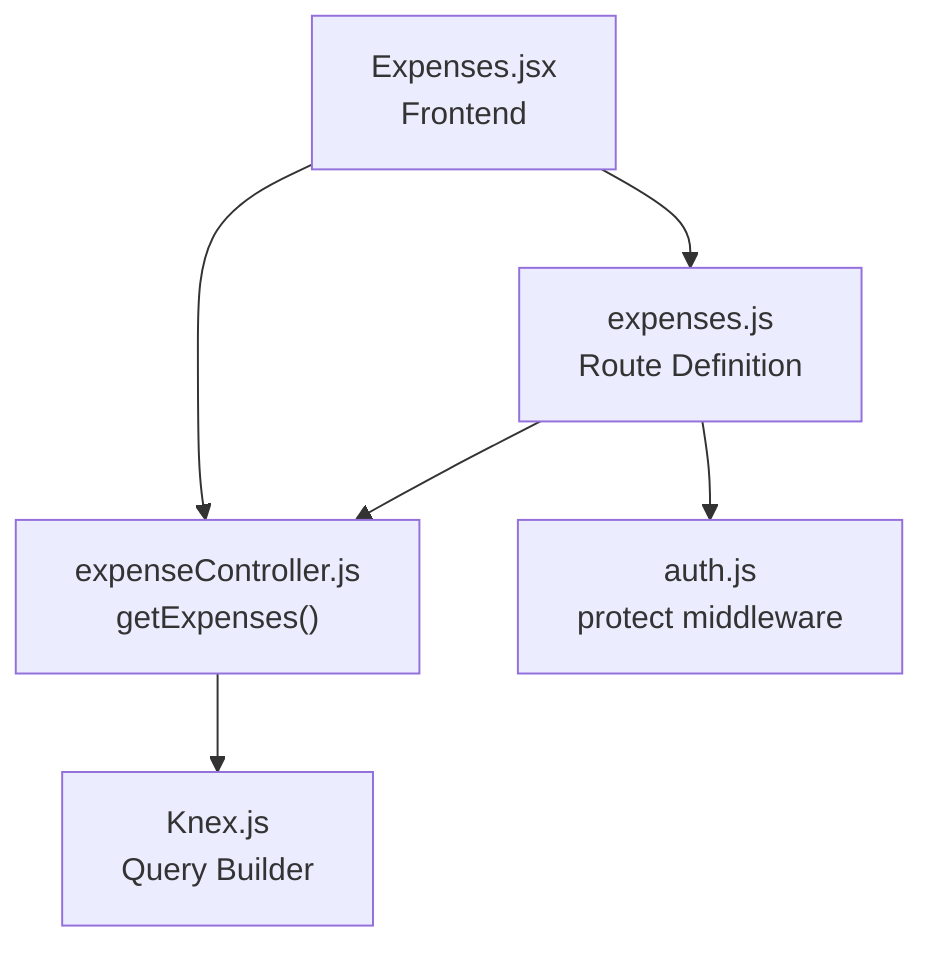

# Expense Search & Filtering

<cite>
**Referenced Files in This Document**
- [expenseController.js](file://backend/src/controllers/expenseController.js)
- [expenses.js](file://backend/src/routes/expenses.js)
- [Expenses.jsx](file://frontend/src/pages/Expenses.jsx)
</cite>

## Table of Contents
1. [Introduction](#introduction)
2. [Project Structure](#project-structure)
3. [Core Components](#core-components)
4. [Architecture Overview](#architecture-overview)
5. [Detailed Component Analysis](#detailed-component-analysis)
6. [Dependency Analysis](#dependency-analysis)
7. [Performance Considerations](#performance-considerations)
8. [Troubleshooting Guide](#troubleshooting-guide)
9. [Conclusion](#conclusion)

## Introduction
This document provides comprehensive API documentation for the expense search and filtering capabilities. It covers the GET /expenses endpoint, including supported query parameters for date ranges, amount ranges, categories, departments, statuses, and free-text search. It also documents pagination parameters, sorting behavior, and practical filtering examples for common use cases such as recent expenses, high-value transactions, and pending approvals. The documentation includes search syntax and wildcard matching capabilities derived from the backend implementation.

## Project Structure
The expense search and filtering functionality spans three key areas:
- Backend controller implementing the GET /expenses endpoint with filtering, pagination, and sorting
- Express route wiring for the expenses API
- Frontend page that demonstrates usage of the filtering and pagination parameters

**Diagram sources**
- [expenses.js:41-41](file://backend/src/routes/expenses.js#L41-L41)
- [expenseController.js:7-76](file://backend/src/controllers/expenseController.js#L7-L76)
- [Expenses.jsx:89-125](file://frontend/src/pages/Expenses.jsx#L89-L125)

**Section sources**
- [expenses.js:1-49](file://backend/src/routes/expenses.js#L1-L49)
- [expenseController.js:1-358](file://backend/src/controllers/expenseController.js#L1-L358)
- [Expenses.jsx:1-856](file://frontend/src/pages/Expenses.jsx#L1-L856)

## Core Components
This section documents the GET /expenses endpoint and its query parameters, pagination, and sorting behavior.

- Endpoint: GET /expenses
- Purpose: Retrieve paginated expense records with optional filters and sorting
- Authentication: Protected by middleware (route-level protection applied)
- Response shape:
  - success: Boolean indicating operation outcome
  - data: Array of expense records with joins to categories, departments, and creators
  - pagination: Object containing total count, current page, and limit

Key query parameters:
- page: Integer, default 1, minimum 1, maximum 100
- limit: Integer, default 10, minimum 1, maximum 100
- search: String, free-text search across remarks and requested_by fields
- category: Integer, category identifier filter
- department: Integer, department identifier filter
- status: String, expense status filter
- startDate: Date string, inclusive lower bound for expense date
- endDate: Date string, inclusive upper bound for expense date
- requestedBy: String, partial match against requested_by field

Sorting behavior:
- Default sort: expenses.date descending (most recent first)

Pagination behavior:
- Page number is normalized to minimum 1
- Limit is normalized to minimum 1 and capped at 100
- Offset computed as (page - 1) * limit
- Total count is calculated from the expenses table

Search syntax and wildcards:
- Free-text search uses SQL LIKE with % wildcards around the search term
- Search applies to remarks and requested_by fields combined with OR logic

Filtering examples:
- Recent expenses: Use startDate and endDate to constrain the date range
- High-value transactions: Combine category and amount thresholds (via client-side filtering or additional backend support)
- Pending approvals: Filter by status values such as Pending, For Approval, Approved, Rejected, Liquidated, Declined

**Section sources**
- [expenseController.js:7-76](file://backend/src/controllers/expenseController.js#L7-L76)
- [expenses.js:39-41](file://backend/src/routes/expenses.js#L39-L41)
- [Expenses.jsx:36-46](file://frontend/src/pages/Expenses.jsx#L36-L46)
- [Expenses.jsx:89-125](file://frontend/src/pages/Expenses.jsx#L89-L125)

## Architecture Overview
The expense search pipeline follows a clear request-to-response flow with filtering, pagination, and sorting implemented in the backend controller.

**Diagram sources**
- [expenses.js:41-41](file://backend/src/routes/expenses.js#L41-L41)
- [expenseController.js:7-76](file://backend/src/controllers/expenseController.js#L7-L76)
- [Expenses.jsx:89-125](file://frontend/src/pages/Expenses.jsx#L89-L125)

## Detailed Component Analysis

### Backend Controller: getExpenses()
The controller handles query parsing, applies filters, computes pagination, and returns structured results.

Implementation highlights:
- Query construction with left joins to categories, departments, and users for enriched data
- Filter conditions:
  - search: LIKE match on remarks and requested_by
  - category: exact match on category_id
  - department: exact match on department_id
  - status: exact match on status
  - requestedBy: LIKE match on requested_by
  - startDate and endDate: BETWEEN on expense date
- Pagination:
  - page normalized to minimum 1
  - limit normalized to minimum 1 and capped at 100
  - offset computed as (page - 1) * limit
  - total count derived from expenses table
- Sorting:
  - orderBy expenses.date desc (most recent first)
- Response:
  - success flag
  - data array
  - pagination object with total, page, limit

**Diagram sources**
- [expenseController.js:7-76](file://backend/src/controllers/expenseController.js#L7-L76)

**Section sources**
- [expenseController.js:7-76](file://backend/src/controllers/expenseController.js#L7-L76)

### Express Route Wiring
The route exposes GET /expenses and applies authentication middleware.

Key points:
- Route: GET /expenses -> getExpenses controller
- Protection: Uses protect middleware (route-level)
- No explicit authorization enforced at route level for this endpoint

**Section sources**
- [expenses.js:39-41](file://backend/src/routes/expenses.js#L39-L41)

### Frontend Integration
The frontend page demonstrates how to construct and send queries to the backend, including:
- State management for filters (page, limit, search, category, status, startDate, endDate)
- Debounced search input handling
- Fetching data with AbortController for cancellation
- Rendering pagination controls and updating state on real-time events

Practical usage:
- Construct query parameters from the filters state
- Send GET /expenses with params
- Update UI with returned data and pagination metadata

**Section sources**
- [Expenses.jsx:36-46](file://frontend/src/pages/Expenses.jsx#L36-L46)
- [Expenses.jsx:89-125](file://frontend/src/pages/Expenses.jsx#L89-L125)

## Dependency Analysis
The expense search functionality depends on:
- Express routing for endpoint exposure
- Knex.js for SQL query building and execution
- Middleware for authentication
- Frontend state management for UI-driven filtering

**Diagram sources**
- [expenses.js:1-49](file://backend/src/routes/expenses.js#L1-L49)
- [expenseController.js:1-358](file://backend/src/controllers/expenseController.js#L1-L358)
- [Expenses.jsx:1-856](file://frontend/src/pages/Expenses.jsx#L1-L856)

**Section sources**
- [expenses.js:1-49](file://backend/src/routes/expenses.js#L1-L49)
- [expenseController.js:1-358](file://backend/src/controllers/expenseController.js#L1-L358)
- [Expenses.jsx:1-856](file://frontend/src/pages/Expenses.jsx#L1-L856)

## Performance Considerations
- Pagination limits: The backend caps the maximum page size at 100 to prevent excessive resource usage.
- Sorting: Default sort by date desc ensures recent items appear first, which is efficient with proper indexing.
- Filtering: LIKE with leading wildcards can be inefficient; consider adding indexes on frequently filtered columns (e.g., category_id, department_id, status, requested_by) and date if needed.
- Joins: Left joins to categories, departments, and users add overhead; ensure appropriate indexes exist on join keys.

## Troubleshooting Guide
Common issues and resolutions:
- Unexpected empty results:
  - Verify date range parameters (startDate and endDate) are correctly formatted and ordered.
  - Confirm status values match exactly (case-sensitive) as stored in the database.
- Slow queries:
  - Reduce page size or refine filters to limit result sets.
  - Ensure database indexes exist on category_id, department_id, status, requested_by, and date.
- Search not returning expected results:
  - The search uses LIKE with wildcards on remarks and requested_by; confirm the search term aligns with the data.
- Pagination inconsistencies:
  - Ensure page and limit parameters are integers and within bounds (1–100).

**Section sources**
- [expenseController.js:7-76](file://backend/src/controllers/expenseController.js#L7-L76)

## Conclusion
The GET /expenses endpoint provides robust filtering, pagination, and sorting capabilities tailored for expense monitoring. By leveraging the documented query parameters and understanding the backend behavior, developers can efficiently implement advanced search scenarios such as recent expenses, high-value transactions, and pending approvals. Proper indexing and mindful use of pagination limits will help maintain performance as data volumes grow.