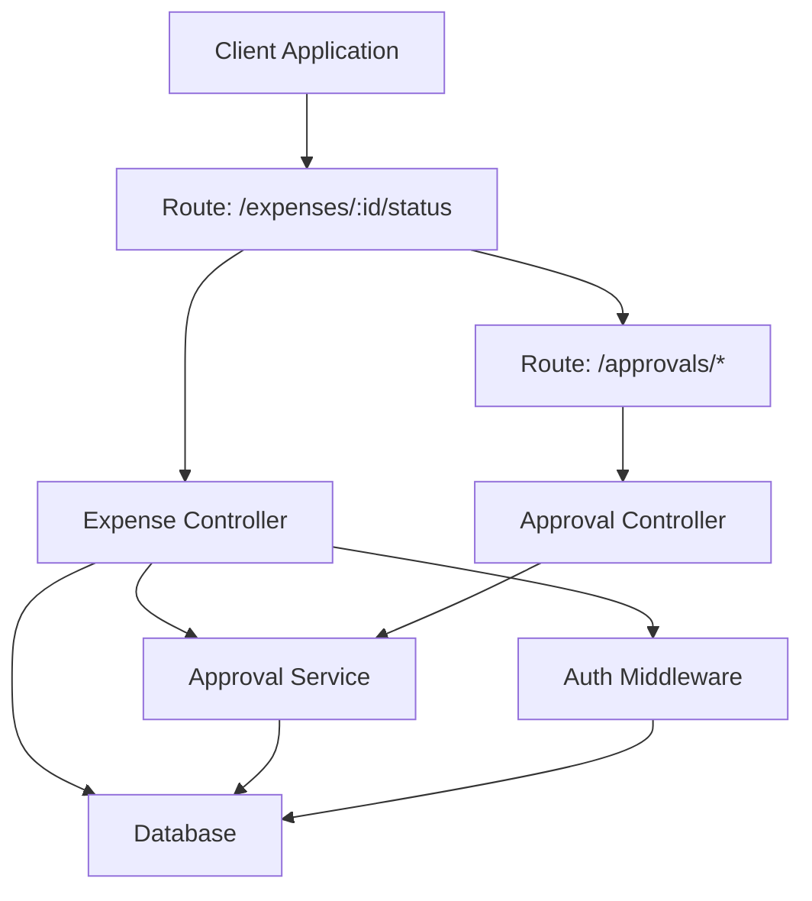
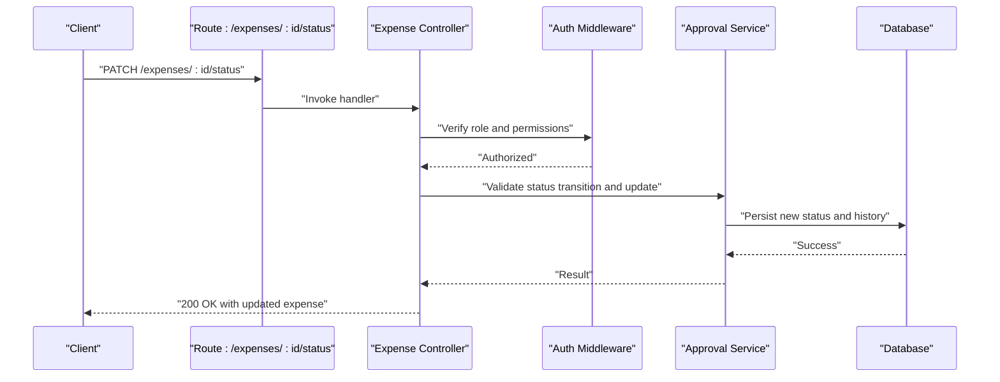
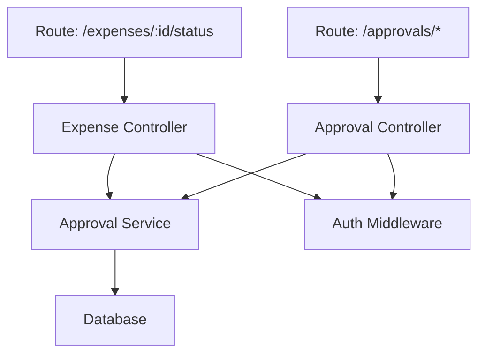

# Expense Status Management

<cite>
**Referenced Files in This Document**
- [expenseController.js](file://backend/src/controllers/expenseController.js)
- [approvalController.js](file://backend/src/controllers/approvalController.js)
- [expenses.js](file://backend/src/routes/expenses.js)
- [approval.js](file://backend/src/routes/approval.js)
- [approvalService.js](file://backend/src/services/approvalService.js)
- [db.js](file://backend/src/config/db.js)
- [auth.js](file://backend/src/middleware/auth.js)
- [20260611010000_fix_expense_status_varchar.js](file://backend/src/db/migrations/20260611010000_fix_expense_status_varchar.js)
- [20260611000000_add_liquidation_approval_workflow.js](file://backend/src/db/migrations/20260611000000_add_liquidation_approval_workflow.js)
</cite>

## Table of Contents
1. [Introduction](#introduction)
2. [Project Structure](#project-structure)
3. [Core Components](#core-components)
4. [Architecture Overview](#architecture-overview)
5. [Detailed Component Analysis](#detailed-component-analysis)
6. [Dependency Analysis](#dependency-analysis)
7. [Performance Considerations](#performance-considerations)
8. [Troubleshooting Guide](#troubleshooting-guide)
9. [Conclusion](#conclusion)

## Introduction
This document provides comprehensive API documentation for expense status management operations, focusing on the PATCH `/expenses/:id/status` endpoint used to update expense approval status. It specifies authorized roles, status transition rules, validation logic, request schema, automatic workflow triggers, concurrent modification handling, and status history tracking. Examples of common workflows and error scenarios are included to guide implementation and troubleshooting.

## Project Structure
The expense status management functionality spans controllers, routes, services, database configurations, and middleware. The primary components involved are:
- Routes: Define the HTTP endpoints for expenses and approvals
- Controllers: Implement request handling and orchestrate service logic
- Services: Encapsulate business logic for approvals and status transitions
- Middleware: Enforce authentication and authorization
- Database: Persist expense records, statuses, and related metadata

**Diagram sources**
- [expenses.js](file://backend/src/routes/expenses.js)
- [approval.js](file://backend/src/routes/approval.js)
- [expenseController.js](file://backend/src/controllers/expenseController.js)
- [approvalController.js](file://backend/src/controllers/approvalController.js)
- [approvalService.js](file://backend/src/services/approvalService.js)
- [auth.js](file://backend/src/middleware/auth.js)
- [db.js](file://backend/src/config/db.js)

**Section sources**
- [expenses.js](file://backend/src/routes/expenses.js)
- [approval.js](file://backend/src/routes/approval.js)
- [expenseController.js](file://backend/src/controllers/expenseController.js)
- [approvalController.js](file://backend/src/controllers/approvalController.js)
- [approvalService.js](file://backend/src/services/approvalService.js)
- [auth.js](file://backend/src/middleware/auth.js)
- [db.js](file://backend/src/config/db.js)

## Core Components
- Expense Controller: Handles PATCH `/expenses/:id/status`, validates inputs, enforces role-based authorization, and triggers approval workflows.
- Approval Controller: Manages approval-related operations and integrates with the approval service.
- Approval Service: Implements status transition rules, concurrency checks, and workflow triggers.
- Authentication and Authorization Middleware: Ensures only authorized users can modify expense statuses.
- Database Layer: Stores expense records, statuses, timestamps, and status history entries.

Key responsibilities:
- Validate request payload and enforce role-based access
- Apply status transition rules and prevent invalid state changes
- Handle concurrent modifications via optimistic locking mechanisms
- Record status history and trigger automated workflows upon successful updates

**Section sources**
- [expenseController.js](file://backend/src/controllers/expenseController.js)
- [approvalController.js](file://backend/src/controllers/approvalController.js)
- [approvalService.js](file://backend/src/services/approvalService.js)
- [auth.js](file://backend/src/middleware/auth.js)

## Architecture Overview
The expense status update flow integrates route handling, controller validation, service-level business logic, and database persistence. Authorization middleware ensures only eligible roles can submit status updates.

**Diagram sources**
- [expenses.js](file://backend/src/routes/expenses.js)
- [expenseController.js](file://backend/src/controllers/expenseController.js)
- [approvalService.js](file://backend/src/services/approvalService.js)
- [auth.js](file://backend/src/middleware/auth.js)
- [db.js](file://backend/src/config/db.js)

## Detailed Component Analysis

### Endpoint Definition: PATCH /expenses/:id/status
- Method: PATCH
- Path: `/expenses/:id/status`
- Purpose: Update the approval status of a specific expense identified by ID
- Authorized Roles: Super Admin, Accounting, and Manager
- Request Body Schema:
  - Required:
    - `status`: string, must be a valid status value according to configured status set
  - Optional:
    - `approvalToken`: string, required when the status change requires token-based approval
    - `rejectionReason`: string, required when transitioning to a rejection status
    - `comments`: string, optional comments for audit trail
- Response:
  - 200 OK: Updated expense object with new status
  - 400 Bad Request: Validation errors (invalid status, missing required fields)
  - 401 Unauthorized: Not authenticated
  - 403 Forbidden: Insufficient permissions
  - 404 Not Found: Expense not found
  - 409 Conflict: Concurrent modification detected
  - 500 Internal Server Error: Unexpected server error

Validation Logic:
- Status must belong to the configured status set defined in the database schema
- approvalToken must be present and valid when required by the target status
- rejectionReason must be provided when transitioning to a rejection status
- Comments are optional but recommended for auditability

Status Transition Rules:
- Allowed transitions depend on current status and target status
- Disallowed transitions return 400 with detailed error messages
- Some transitions may require additional approvals or conditions

Concurrency Handling:
- Optimistic locking via version/timestamp comparison prevents lost updates
- If concurrent modification is detected, a 409 Conflict response is returned with guidance to retry

Status History Tracking:
- On successful status update, a new status history record is created
- History includes timestamp, actor (approver), old status, new status, and optional reason/comment

Automatic Workflow Triggers:
- Upon successful status update, the system triggers relevant workflows:
  - Notification dispatch to relevant stakeholders
  - Email automation for approvers and requesters
  - Queue-based background tasks for downstream processing
- Workflows are integrated with the approval service and notification center

Examples of Common Workflows:
- Manager approves an expense → triggers notification to requester and initiates accounting review
- Accounting rejects an expense with reason → notifies requester and updates status to pending revisions
- Super Admin overrides status → bypasses normal approvals and applies immediate change

Error Scenarios:
- Invalid status value: 400 Bad Request
- Missing approvalToken for token-required status: 400 Bad Request
- Missing rejectionReason for rejection status: 400 Bad Request
- Unauthorized role attempting status change: 403 Forbidden
- Concurrent modification conflict: 409 Conflict
- Expense not found: 404 Not Found

**Section sources**
- [expenses.js](file://backend/src/routes/expenses.js)
- [expenseController.js](file://backend/src/controllers/expenseController.js)
- [approvalService.js](file://backend/src/services/approvalService.js)
- [auth.js](file://backend/src/middleware/auth.js)

### Database Schema and Migrations
The expense status management relies on database schema definitions and migrations that define the status domain and approval workflow.

Key schema elements:
- Expense table includes status field with constrained values
- Status history table captures all status changes with timestamps and actors
- Approval workflow schema defines approval steps and conditions

Migrations:
- Status type fix migration ensures consistent status representation
- Liquidation approval workflow migration introduces structured approval steps

These schema elements underpin validation, transition rules, and history tracking.

**Section sources**
- [20260611010000_fix_expense_status_varchar.js](file://backend/src/db/migrations/20260611010000_fix_expense_status_varchar.js)
- [20260611000000_add_liquidation_approval_workflow.js](file://backend/src/db/migrations/20260611000000_add_liquidation_approval_workflow.js)

### Authorization and Middleware
Authorization is enforced through middleware that verifies:
- User authentication
- Role membership (Super Admin, Accounting, Manager)
- Permission to modify the specific expense’s status

Failure to meet authorization criteria results in 401 or 403 responses.

**Section sources**
- [auth.js](file://backend/src/middleware/auth.js)

### Approval Service Logic
The approval service encapsulates:
- Status transition validation against configured rules
- Concurrency control via optimistic locking
- Status history creation
- Workflow triggering for notifications and downstream actions

Integration points:
- Database access for reads/writes
- Notification dispatcher for stakeholder communication
- Queue manager for background processing

**Section sources**
- [approvalService.js](file://backend/src/services/approvalService.js)

### Route Definitions
The routes define:
- PATCH `/expenses/:id/status` for status updates
- Related approval routes for supporting operations

Routing ensures proper binding of handlers and middleware.

**Section sources**
- [expenses.js](file://backend/src/routes/expenses.js)
- [approval.js](file://backend/src/routes/approval.js)

## Dependency Analysis
The expense status management feature depends on:
- Route layer for HTTP endpoint exposure
- Controller layer for request handling and authorization enforcement
- Service layer for business logic and workflow orchestration
- Database layer for persistence and schema compliance
- Middleware for authentication and authorization

**Diagram sources**
- [expenses.js](file://backend/src/routes/expenses.js)
- [approval.js](file://backend/src/routes/approval.js)
- [expenseController.js](file://backend/src/controllers/expenseController.js)
- [approvalController.js](file://backend/src/controllers/approvalController.js)
- [approvalService.js](file://backend/src/services/approvalService.js)
- [auth.js](file://backend/src/middleware/auth.js)
- [db.js](file://backend/src/config/db.js)

**Section sources**
- [expenses.js](file://backend/src/routes/expenses.js)
- [approval.js](file://backend/src/routes/approval.js)
- [expenseController.js](file://backend/src/controllers/expenseController.js)
- [approvalController.js](file://backend/src/controllers/approvalController.js)
- [approvalService.js](file://backend/src/services/approvalService.js)
- [auth.js](file://backend/src/middleware/auth.js)
- [db.js](file://backend/src/config/db.js)

## Performance Considerations
- Minimize database round-trips by batching related operations where appropriate
- Use efficient queries for status history retrieval and concurrency checks
- Leverage indexing on status and timestamp fields for faster lookups
- Implement pagination for status history lists to avoid large payloads

## Troubleshooting Guide
Common issues and resolutions:
- 400 Bad Request: Verify request body matches the documented schema and includes required fields for the target status
- 401 Unauthorized: Ensure valid authentication credentials are provided
- 403 Forbidden: Confirm the user has one of the authorized roles (Super Admin, Accounting, Manager)
- 404 Not Found: Validate the expense ID exists
- 409 Conflict: Retry the operation after fetching the latest expense state to resolve concurrent modifications
- 500 Internal Server Error: Check server logs for exceptions and ensure database connectivity

**Section sources**
- [expenseController.js](file://backend/src/controllers/expenseController.js)
- [approvalService.js](file://backend/src/services/approvalService.js)
- [auth.js](file://backend/src/middleware/auth.js)

## Conclusion
The expense status management API provides a robust mechanism for controlled status updates with strong authorization, validation, and auditing capabilities. By adhering to the documented schema, transition rules, and error handling guidance, developers can implement reliable integrations that support efficient expense approval workflows.