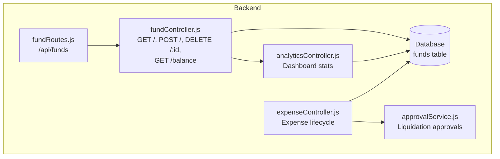
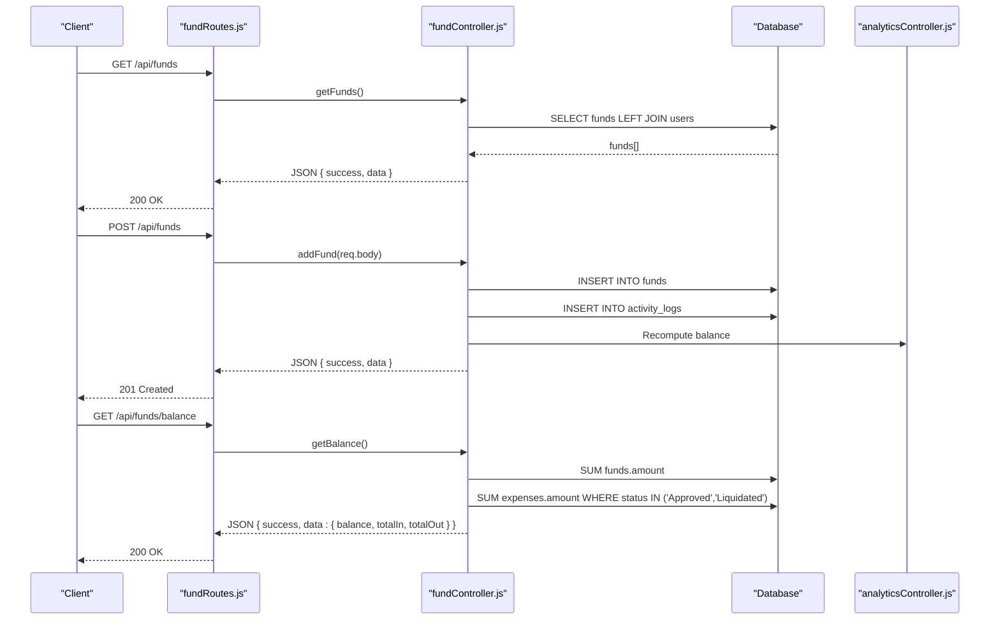
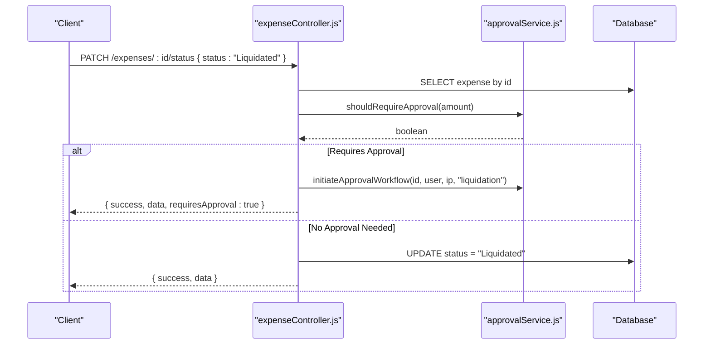
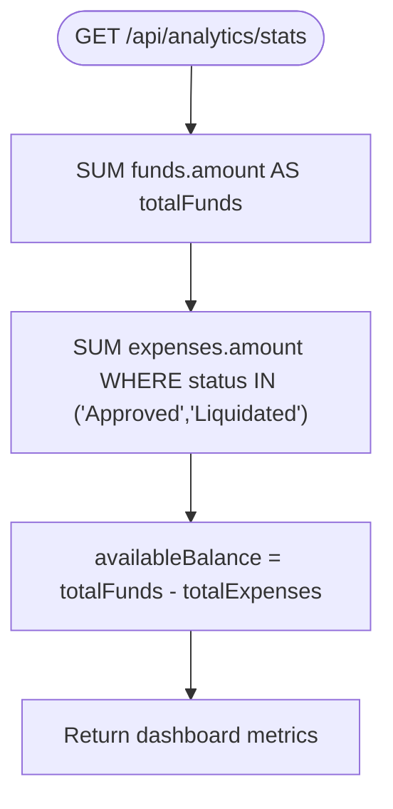
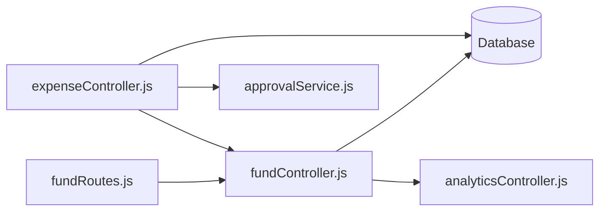

# Fund Management API

<cite>
**Referenced Files in This Document**
- [fundController.js](file://backend/src/controllers/fundController.js)
- [fundRoutes.js](file://backend/src/routes/fundRoutes.js)
- [20260512075907_create_funds_table.js](file://backend/src/db/migrations/20260512075907_create_funds_table.js)
- [20260611000000_add_liquidation_approval_workflow.js](file://backend/src/db/migrations/20260611000000_add_liquidation_approval_workflow.js)
- [analyticsController.js](file://backend/src/controllers/analyticsController.js)
- [expenseController.js](file://backend/src/controllers/expenseController.js)
- [approvalService.js](file://backend/src/services/approvalService.js)
</cite>

## Table of Contents
1. [Introduction](#introduction)
2. [Project Structure](#project-structure)
3. [Core Components](#core-components)
4. [Architecture Overview](#architecture-overview)
5. [Detailed Component Analysis](#detailed-component-analysis)
6. [Dependency Analysis](#dependency-analysis)
7. [Performance Considerations](#performance-considerations)
8. [Troubleshooting Guide](#troubleshooting-guide)
9. [Conclusion](#conclusion)

## Introduction
This document provides comprehensive API documentation for the fund management system, covering petty cash fund creation, balance tracking, fund transactions, and liquidation processing. It also documents fund allocation endpoints, transfer operations, balance adjustment mechanisms, request schemas for fund setup and transactions, and fund reconciliation. Additionally, it outlines fund hierarchy, budget tracking, and financial reporting endpoints.

## Project Structure
The fund management API is implemented as a Node.js/Express application with a PostgreSQL database using Knex.js for ORM. The backend exposes REST endpoints under the `/api/funds` route group, with supporting analytics and expense controllers for balance computation and liquidation workflows.

**Diagram sources**
- [fundRoutes.js:1-14](file://backend/src/routes/fundRoutes.js#L1-L14)
- [fundController.js:1-108](file://backend/src/controllers/fundController.js#L1-L108)
- [analyticsController.js:20-67](file://backend/src/controllers/analyticsController.js#L20-L67)
- [expenseController.js:1-358](file://backend/src/controllers/expenseController.js#L1-L358)
- [approvalService.js](file://backend/src/services/approvalService.js)

**Section sources**
- [fundRoutes.js:1-14](file://backend/src/routes/fundRoutes.js#L1-L14)
- [fundController.js:1-108](file://backend/src/controllers/fundController.js#L1-L108)
- [20260512075907_create_funds_table.js:1-44](file://backend/src/db/migrations/20260512075907_create_funds_table.js#L1-L44)

## Core Components
- Fund Management Controller: Handles fund creation, deletion, listing, and balance calculation.
- Fund Routes: Defines protected endpoints for fund operations and balance retrieval.
- Database Schema: Funds table with monetary amount, reference number, remarks, and audit metadata.
- Analytics Controller: Computes dashboard metrics including available fund balance.
- Expense Controller: Manages expense lifecycle and integrates with fund balance updates.
- Approval Service: Coordinates email-based liquidation approvals for high-value expenses.

**Section sources**
- [fundController.js:5-107](file://backend/src/controllers/fundController.js#L5-L107)
- [fundRoutes.js:6-11](file://backend/src/routes/fundRoutes.js#L6-L11)
- [20260512075907_create_funds_table.js:4-12](file://backend/src/db/migrations/20260512075907_create_funds_table.js#L4-L12)
- [analyticsController.js:45-47](file://backend/src/controllers/analyticsController.js#L45-L47)
- [expenseController.js:291-357](file://backend/src/controllers/expenseController.js#L291-L357)
- [approvalService.js](file://backend/src/services/approvalService.js)

## Architecture Overview
The fund management API follows a layered architecture:
- Route handlers enforce authentication and authorization.
- Controllers process requests, interact with the database, and publish real-time updates.
- Services encapsulate business logic such as approval workflows.
- Analytics controllers compute derived metrics for dashboards and reporting.

**Diagram sources**
- [fundRoutes.js:8-11](file://backend/src/routes/fundRoutes.js#L8-L11)
- [fundController.js:5-107](file://backend/src/controllers/fundController.js#L5-L107)
- [analyticsController.js:45-62](file://backend/src/controllers/analyticsController.js#L45-L62)

## Detailed Component Analysis

### Fund Management Endpoints

#### GET /api/funds
- Description: Retrieve all fund entries ordered by date descending, joined with the adding user's name.
- Authentication: Required.
- Authorization: Super Admin.
- Response: Array of fund records with user name field `adder_name`.

**Section sources**
- [fundController.js:5-15](file://backend/src/controllers/fundController.js#L5-L15)
- [fundRoutes.js:8-8](file://backend/src/routes/fundRoutes.js#L8-L8)

#### POST /api/funds
- Description: Add a new fund replenishment entry.
- Authentication: Required.
- Authorization: Super Admin.
- Request Body:
  - amount (number, required): Monetary value added.
  - reference_no (string, optional): Reference number (e.g., check or OR number).
  - remarks (string, optional): Notes about the replenishment.
  - date (string, optional): Voucher date; defaults to server time if omitted.
- Response: Newly created fund record.

Behavior:
- Inserts a new fund entry with the current user as `added_by`.
- Logs activity and broadcasts real-time balance updates.
- Notifies administrators via internal notifications.

**Section sources**
- [fundController.js:17-56](file://backend/src/controllers/fundController.js#L17-L56)
- [fundRoutes.js:9-9](file://backend/src/routes/fundRoutes.js#L9-L9)

#### DELETE /api/funds/:id
- Description: Remove a fund entry by ID.
- Authentication: Required.
- Authorization: Super Admin.
- Response: Success message upon deletion.

Behavior:
- Deletes the fund entry and logs activity.
- Broadcasts real-time balance updates.

**Section sources**
- [fundController.js:58-81](file://backend/src/controllers/fundController.js#L58-L81)
- [fundRoutes.js:10-10](file://backend/src/routes/fundRoutes.js#L10-L10)

#### GET /api/funds/balance
- Description: Compute current available fund balance.
- Authentication: Optional (public endpoint).
- Response: Object containing `balance`, `totalIn`, and `totalOut`.

Calculation:
- totalIn: Sum of all fund replenishments.
- totalOut: Sum of approved and liquidated expenses.
- balance: totalIn - totalOut.

**Section sources**
- [fundController.js:83-107](file://backend/src/controllers/fundController.js#L83-L107)
- [fundRoutes.js:11-11](file://backend/src/routes/fundRoutes.js#L11-L11)

### Fund Setup and Transaction Schemas

#### Fund Entry Schema
- id (integer): Auto-incremented primary key.
- date (timestamp): Defaults to current time.
- amount (decimal): Monetary value; required.
- reference_no (string): Optional reference number.
- remarks (string): Optional remarks.
- added_by (integer): Foreign key to users table.
- created_at, updated_at (timestamps): Automatic timestamps.

**Section sources**
- [20260512075907_create_funds_table.js:4-12](file://backend/src/db/migrations/20260512075907_create_funds_table.js#L4-L12)

#### Expense Integration Schema
- Expenses integrate with fund balance via status-based aggregation:
  - Approved and Liquidated expenses contribute to totalOut.
  - Pending, Rejected, and For Approval statuses do not affect totalOut.

**Section sources**
- [fundController.js:86-88](file://backend/src/controllers/fundController.js#L86-L88)
- [expenseController.js:291-357](file://backend/src/controllers/expenseController.js#L291-L357)

### Liquidation Processing and Fund Transactions

#### Liquidation Approval Workflow
- Threshold-based email approval:
  - If an expense amount meets or exceeds the configured threshold, liquidation initiates an email approval workflow.
  - On approval, the expense status transitions accordingly and fund balance updates are broadcast.
- Approval tokens and audit trail:
  - Tokens track approval actions and expiration.
  - Audit logs record approval events and actors.

**Diagram sources**
- [expenseController.js:291-319](file://backend/src/controllers/expenseController.js#L291-L319)
- [approvalService.js](file://backend/src/services/approvalService.js)

**Section sources**
- [20260611000000_add_liquidation_approval_workflow.js:29-45](file://backend/src/db/migrations/20260611000000_add_liquidation_approval_workflow.js#L29-L45)
- [20260611000000_add_liquidation_approval_workflow.js:148-178](file://backend/src/db/migrations/20260611000000_add_liquidation_approval_workflow.js#L148-L178)
- [expenseController.js:291-319](file://backend/src/controllers/expenseController.js#L291-L319)

### Fund Allocation, Transfers, and Reconciliation

- Fund allocation:
  - New fund entries are created via POST /api/funds with amount and optional metadata.
- Transfers:
  - No explicit fund transfer endpoints are present in the current codebase.
- Balance adjustments:
  - Fund additions/deletions trigger real-time balance updates and activity logging.
  - Expense status changes (Approved, Rejected, Liquidated) also trigger balance updates.

**Section sources**
- [fundController.js:17-56](file://backend/src/controllers/fundController.js#L17-L56)
- [fundController.js:58-81](file://backend/src/controllers/fundController.js#L58-L81)
- [fundController.js:83-107](file://backend/src/controllers/fundController.js#L83-L107)
- [expenseController.js:246-247](file://backend/src/controllers/expenseController.js#L246-L247)
- [expenseController.js:347-349](file://backend/src/controllers/expenseController.js#L347-L349)

### Budget Tracking and Financial Reporting

- Dashboard statistics:
  - Analytics controller computes total expenses, daily/monthly aggregates, available balance, pending approval counts, and top categories.
- Reporting endpoints:
  - Reports module supports filtering by date range, category, and department, with export capabilities.

**Diagram sources**
- [analyticsController.js:45-47](file://backend/src/controllers/analyticsController.js#L45-L47)

**Section sources**
- [analyticsController.js:20-67](file://backend/src/controllers/analyticsController.js#L20-L67)

## Dependency Analysis

**Diagram sources**
- [fundRoutes.js:1-14](file://backend/src/routes/fundRoutes.js#L1-L14)
- [fundController.js:1-108](file://backend/src/controllers/fundController.js#L1-L108)
- [analyticsController.js:20-67](file://backend/src/controllers/analyticsController.js#L20-L67)
- [expenseController.js:1-358](file://backend/src/controllers/expenseController.js#L1-L358)
- [approvalService.js](file://backend/src/services/approvalService.js)

**Section sources**
- [fundController.js:1-4](file://backend/src/controllers/fundController.js#L1-L4)
- [expenseController.js:1-6](file://backend/src/controllers/expenseController.js#L1-L6)

## Performance Considerations
- Database indexing:
  - Consider adding indexes on funds.amount and expenses.status to optimize balance calculations.
- Real-time updates:
  - Broadcasting balance updates reduces client polling overhead but should be monitored for scalability.
- Pagination and filtering:
  - Analytics and expense endpoints support pagination and filters; ensure appropriate limits to prevent heavy queries.

## Troubleshooting Guide
- Fund entry not found:
  - Deleting a non-existent fund entry returns a 404 response.
- Balance calculation errors:
  - Verify that only approved and liquidated expenses contribute to totalOut.
- Approval workflow failures:
  - Confirm threshold settings and email configuration for liquidation approvals.

**Section sources**
- [fundController.js:62-63](file://backend/src/controllers/fundController.js#L62-L63)
- [fundController.js:104-106](file://backend/src/controllers/fundController.js#L104-L106)
- [expenseController.js:301-319](file://backend/src/controllers/expenseController.js#L301-L319)

## Conclusion
The fund management API provides robust endpoints for petty cash fund creation, balance tracking, and liquidation processing. It integrates seamlessly with expense workflows and supports real-time updates and comprehensive financial reporting. While explicit fund transfer endpoints are not present, the system’s design allows for straightforward extension to support transfers and advanced reconciliation features.