# Real-Time Communication API

<cite>
**Referenced Files in This Document**
- [socketService.js](file://backend/src/services/socketService.js)
- [SocketContext.jsx](file://frontend/src/context/SocketContext.jsx)
- [sender.html](file://frontend/public/sender.html)
- [index.js](file://backend/src/index.js)
- [package.json](file://backend/package.json)
- [notificationCenterController.js](file://backend/src/controllers/notificationCenterController.js)
- [notificationDispatcher.js](file://backend/src/services/notificationDispatcher.js)
- [queueManager.js](file://backend/src/services/queueManager.js)
</cite>

## Table of Contents
1. [Introduction](#introduction)
2. [WebSocket Connection Management](#websocket-connection-management)
3. [Authentication and Authorization](#authentication-and-authorization)
4. [Message Formats and Event Types](#message-formats-and-event-types)
5. [Notification Broadcasting](#notification-broadcasting)
6. [Live Dashboard Updates](#live-dashboard-updates)
7. [Subscription Management](#subscription-management)
8. [Reconnection Strategies](#reconnection-strategies)
9. [Message Queuing for Offline Clients](#message-queuing-for-offline-clients)
10. [Real-World Examples](#real-world-examples)
11. [Implementation Details](#implementation-details)
12. [Troubleshooting Guide](#troubleshooting-guide)
13. [Conclusion](#conclusion)

## Introduction

The Real-Time Communication API provides WebSocket-based real-time functionality for the Petty Cash management system. This API enables live updates for expense status changes, approval notifications, system alerts, and dashboard synchronization. Built on Socket.IO with JWT authentication, it supports both authenticated user connections and guest connections with flexible reconnection capabilities.

The system facilitates immediate notification delivery, real-time dashboard updates, and seamless user experience through persistent WebSocket connections with intelligent fallback mechanisms.

## WebSocket Connection Management

### Connection Establishment

The WebSocket server initializes with configurable CORS policies and supports both polling and WebSocket transports for maximum compatibility across different network environments.

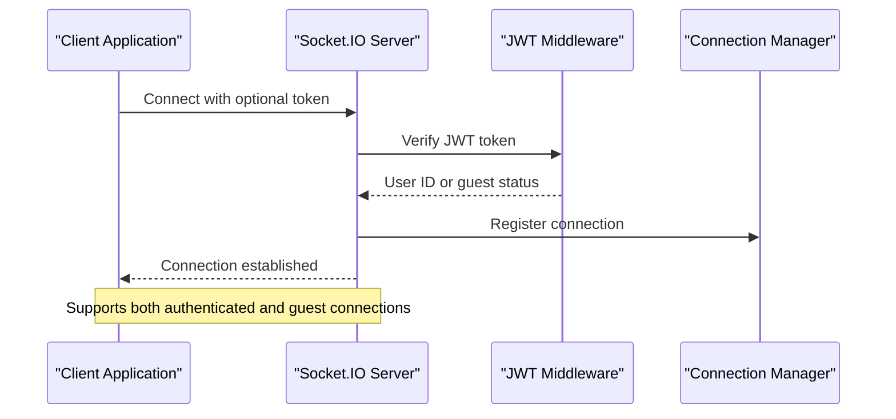

**Diagram sources**
- [socketService.js:7-27](file://backend/src/services/socketService.js#L7-L27)
- [SocketContext.jsx:210-219](file://frontend/src/context/SocketContext.jsx#L210-L219)

### Connection Lifecycle

The connection lifecycle manages user associations, socket cleanup, and graceful disconnection handling with automatic resource management.

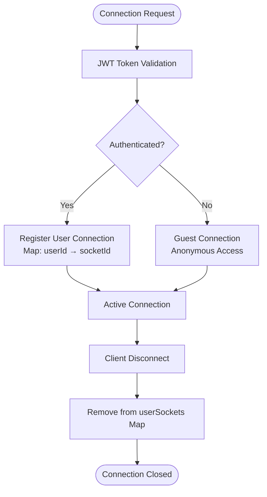

**Diagram sources**
- [socketService.js:29-71](file://backend/src/services/socketService.js#L29-L71)

**Section sources**
- [socketService.js:1-101](file://backend/src/services/socketService.js#L1-L101)
- [SocketContext.jsx:210-219](file://frontend/src/context/SocketContext.jsx#L210-L219)

## Authentication and Authorization

### JWT-Based Authentication

The system implements flexible JWT authentication that doesn't block connections but associates authenticated users with their sockets for targeted messaging.

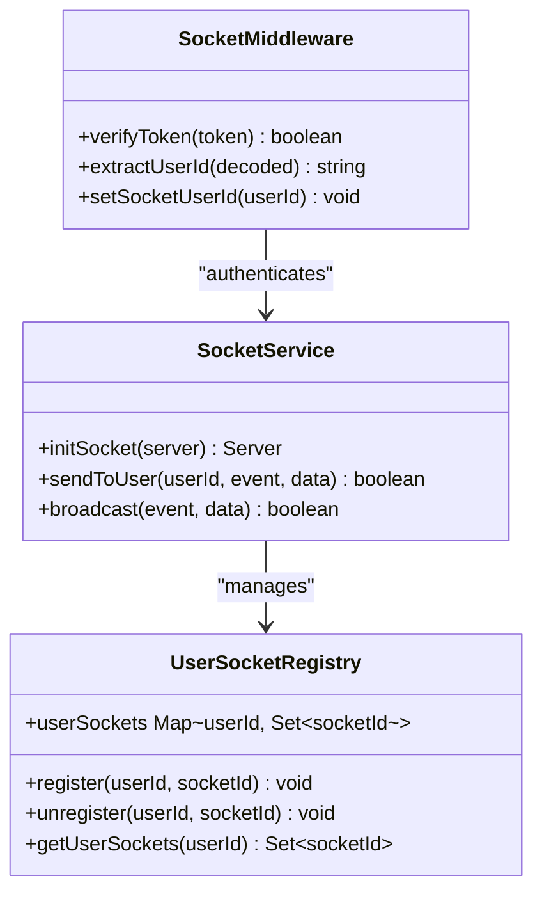

**Diagram sources**
- [socketService.js:15-27](file://backend/src/services/socketService.js#L15-L27)
- [socketService.js:5-6](file://backend/src/services/socketService.js#L5-L6)

### Authentication Flow

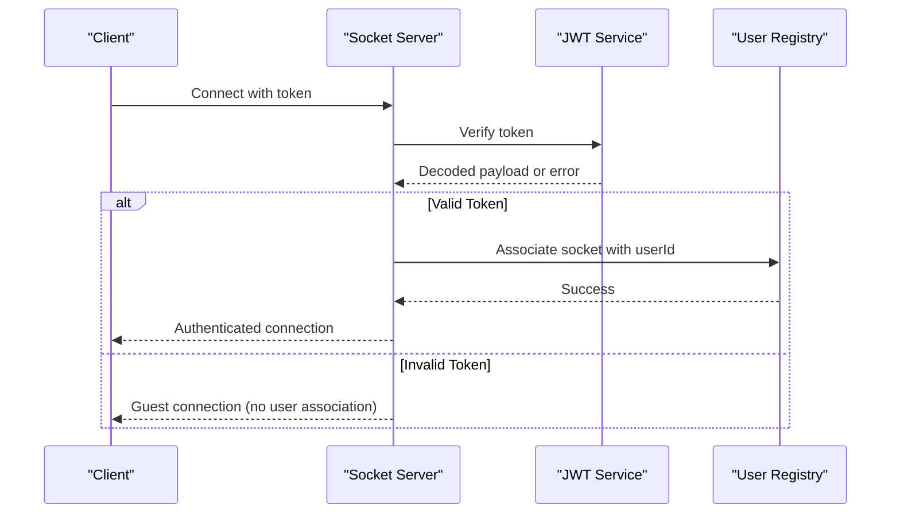

**Diagram sources**
- [socketService.js:16-26](file://backend/src/services/socketService.js#L16-L26)

**Section sources**
- [socketService.js:15-27](file://backend/src/services/socketService.js#L15-L27)

## Message Formats and Event Types

### Core Events

The system defines standardized event types for different notification categories and user interactions:

| Event Name | Purpose | Data Structure | Trigger |
|------------|---------|----------------|---------|
| `new_notification` | Primary notification event | Normalized notification object | Backend services |
| `receiveNotification` | Custom notification handler | Custom notification data | Frontend example |
| `connect_error` | Connection error handling | Error details | Socket.IO errors |
| `disconnect` | Connection termination | Disconnection info | Client/server disconnect |

### Notification Data Model

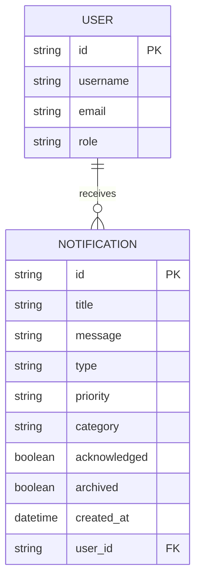

**Diagram sources**
- [socketService.js:50-60](file://backend/src/services/socketService.js#L50-L60)

**Section sources**
- [socketService.js:42-61](file://backend/src/services/socketService.js#L42-L61)

## Notification Broadcasting

### Broadcast Mechanisms

The notification system supports two primary broadcasting approaches: targeted user notifications and global broadcasts.

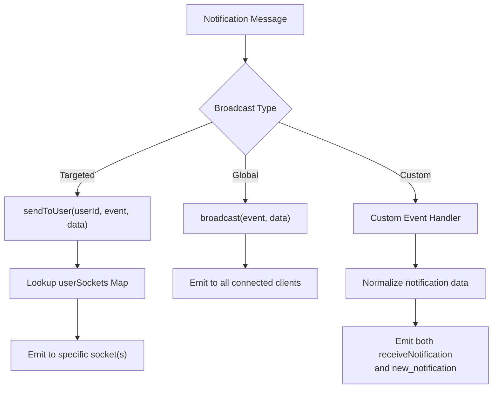

**Diagram sources**
- [socketService.js:77-94](file://backend/src/services/socketService.js#L77-L94)
- [socketService.js:42-61](file://backend/src/services/socketService.js#L42-L61)

### Event Processing Pipeline

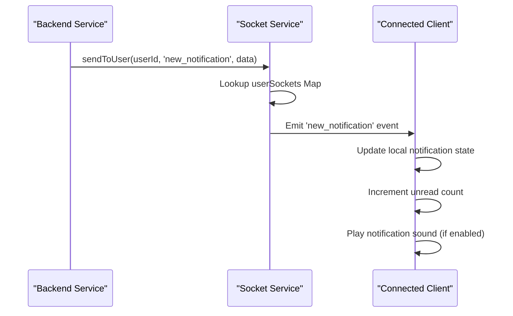

**Diagram sources**
- [socketService.js:77-86](file://backend/src/services/socketService.js#L77-L86)
- [SocketContext.jsx:225-236](file://frontend/src/context/SocketContext.jsx#L225-L236)

**Section sources**
- [socketService.js:42-94](file://backend/src/services/socketService.js#L42-L94)

## Live Dashboard Updates

### Dashboard Synchronization

The dashboard maintains real-time synchronization through WebSocket events and periodic polling fallback mechanisms.

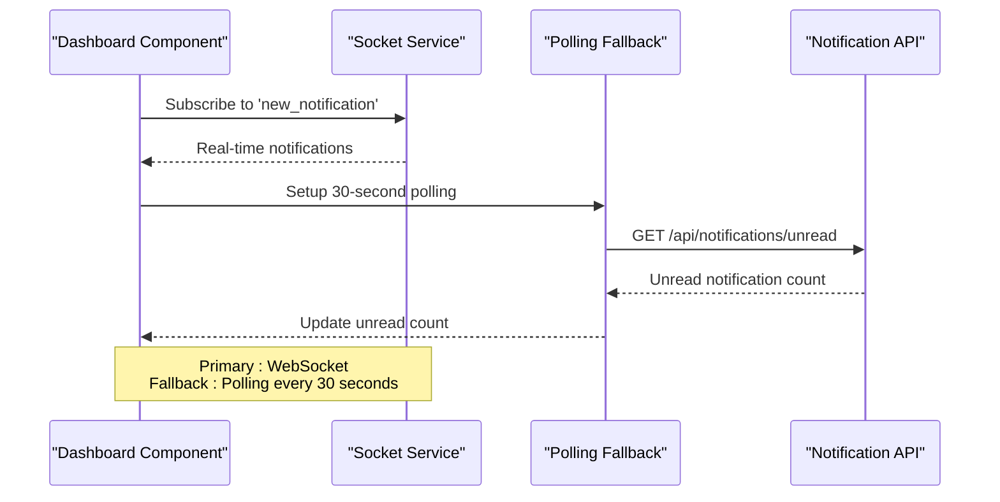

**Diagram sources**
- [SocketContext.jsx:195-207](file://frontend/src/context/SocketContext.jsx#L195-L207)
- [SocketContext.jsx:225-236](file://frontend/src/context/SocketContext.jsx#L225-L236)

### Critical Alert Management

The system implements sophisticated critical alert handling with audio feedback and visual indicators.

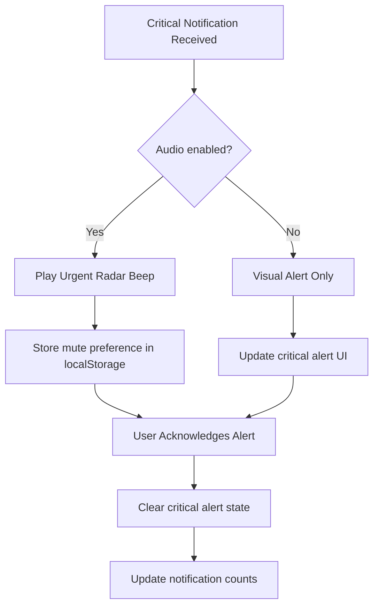

**Diagram sources**
- [SocketContext.jsx:96-128](file://frontend/src/context/SocketContext.jsx#L96-L128)
- [SocketContext.jsx:334-356](file://frontend/src/context/SocketContext.jsx#L334-L356)

**Section sources**
- [SocketContext.jsx:139-193](file://frontend/src/context/SocketContext.jsx#L139-L193)
- [SocketContext.jsx:210-236](file://frontend/src/context/SocketContext.jsx#L210-L236)

## Subscription Management

### User Subscription Patterns

The subscription system manages per-user notification preferences and connection states through a centralized registry.

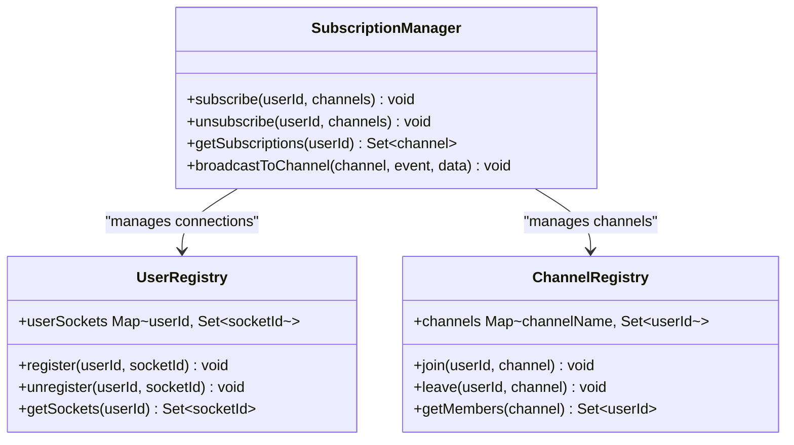

**Diagram sources**
- [socketService.js:5](file://backend/src/services/socketService.js#L5)
- [socketService.js:77-86](file://backend/src/services/socketService.js#L77-L86)

### Connection State Management

The system maintains connection state through a robust registry that tracks user-to-socket mappings and handles connection cleanup.

**Section sources**
- [socketService.js:5-6](file://backend/src/services/socketService.js#L5-L6)
- [socketService.js:77-86](file://backend/src/services/socketService.js#L77-L86)

## Reconnection Strategies

### Client-Side Reconnection

The frontend implements comprehensive reconnection strategies with exponential backoff and transport fallback mechanisms.

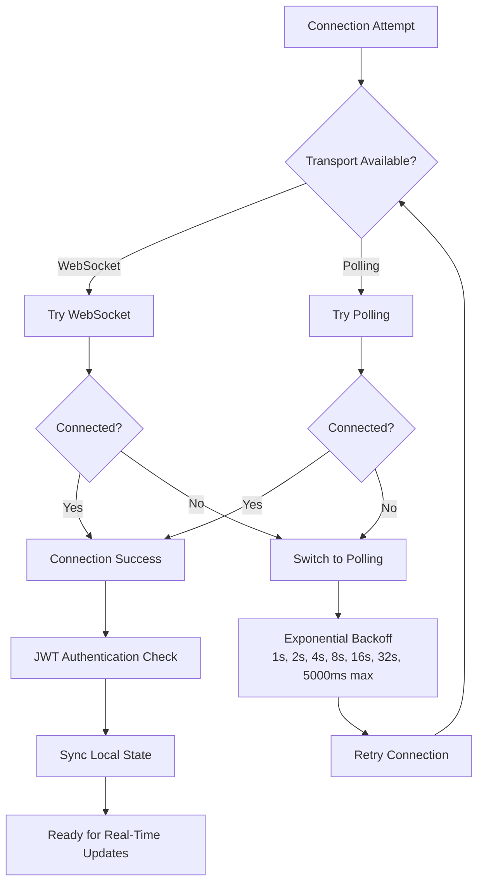

**Diagram sources**
- [SocketContext.jsx:214-218](file://frontend/src/context/SocketContext.jsx#L214-L218)

### Server-Side Connection Handling

The server maintains connection state and gracefully handles client disconnections with automatic cleanup.

**Section sources**
- [SocketContext.jsx:214-218](file://frontend/src/context/SocketContext.jsx#L214-L218)
- [socketService.js:63-71](file://backend/src/services/socketService.js#L63-L71)

## Message Queuing for Offline Clients

### Offline Message Delivery

The system implements a message queuing mechanism to handle offline clients and ensure no notifications are lost during temporary disconnections.

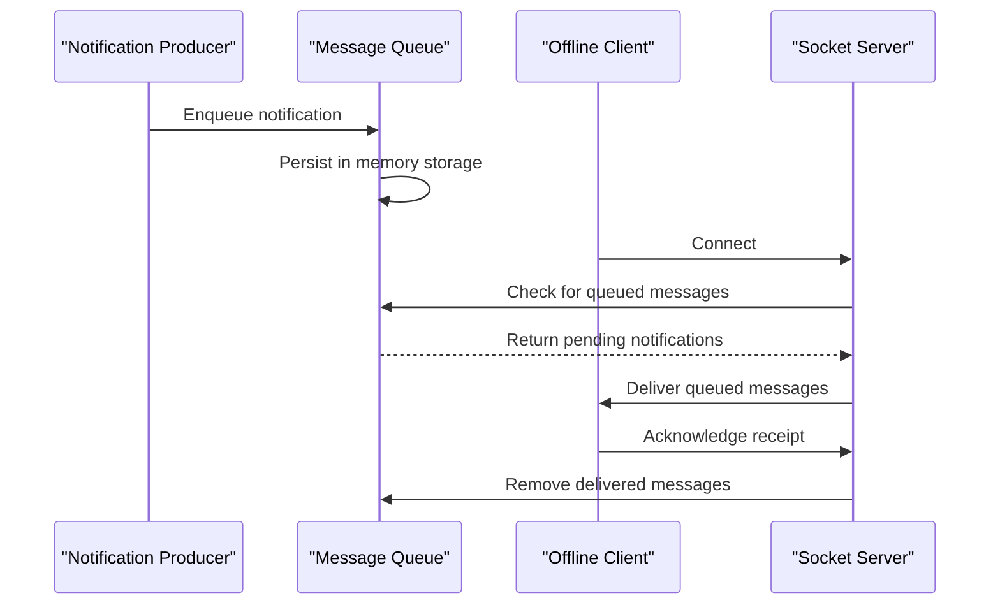

**Diagram sources**
- [queueManager.js](file://backend/src/services/queueManager.js)

### Queue Management Features

The queue system provides:

- **Message Persistence**: Temporary storage of notifications until client acknowledges receipt
- **Delivery Guarantees**: Ensures all queued messages are delivered upon client reconnection
- **Memory Management**: Automatic cleanup of delivered messages to prevent memory leaks
- **Priority Handling**: Supports different priority levels for message processing

**Section sources**
- [queueManager.js](file://backend/src/services/queueManager.js)

## Real-World Examples

### Expense Status Update Example

Real-time expense status updates demonstrate the system's capability to synchronize state changes across all connected clients.

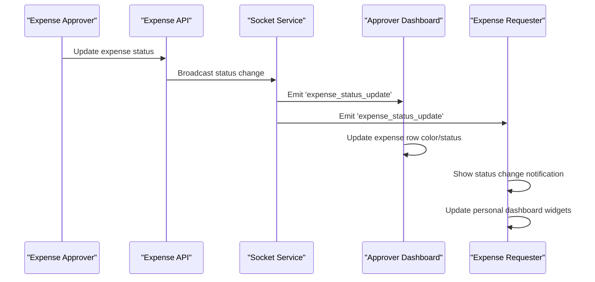

### Approval Notification Example

The approval notification system provides immediate feedback to relevant parties when action items require attention.

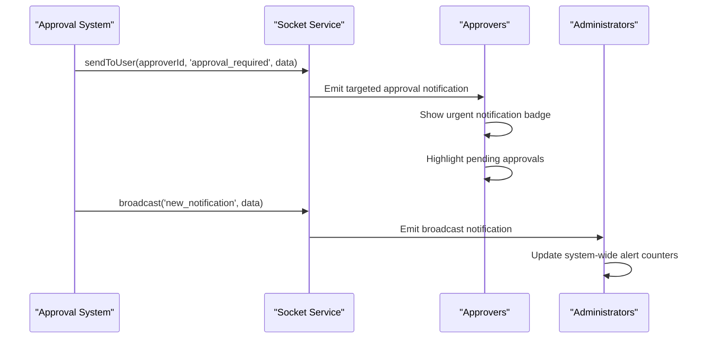

### System Alert Example

Critical system alerts utilize the urgent notification system with audio feedback and visual indicators.

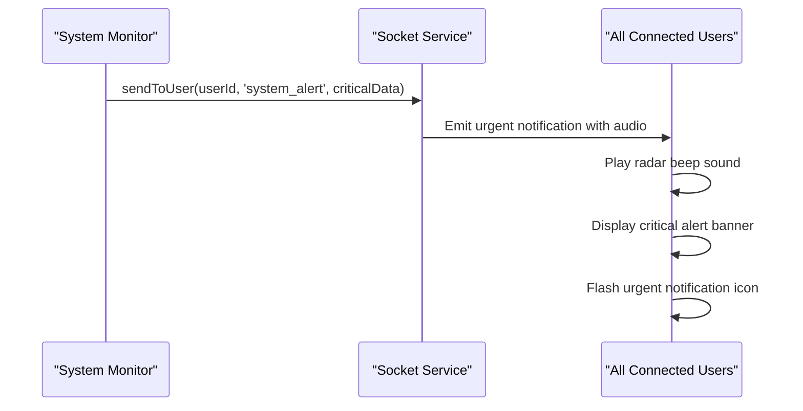

**Section sources**
- [socketService.js:77-94](file://backend/src/services/socketService.js#L77-L94)
- [SocketContext.jsx:225-236](file://frontend/src/context/SocketContext.jsx#L225-L236)

## Implementation Details

### Backend Architecture

The backend implements a modular Socket.IO service with JWT authentication middleware and connection management.

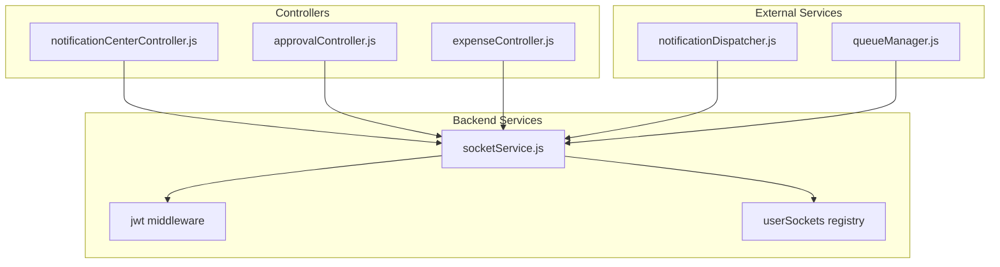

**Diagram sources**
- [socketService.js:1-101](file://backend/src/services/socketService.js#L1-L101)
- [notificationCenterController.js](file://backend/src/controllers/notificationCenterController.js)
- [notificationDispatcher.js](file://backend/src/services/notificationDispatcher.js)

### Frontend Integration

The frontend integrates WebSocket functionality through a React context provider that manages connection state, notification handling, and user interactions.

**Section sources**
- [socketService.js:1-101](file://backend/src/services/socketService.js#L1-L101)
- [SocketContext.jsx:130-375](file://frontend/src/context/SocketContext.jsx#L130-L375)

## Troubleshooting Guide

### Common Connection Issues

**Connection Refused Errors**
- Verify Socket.IO server is running and accessible
- Check CORS configuration allows frontend origin
- Ensure JWT_SECRET environment variable is set

**Authentication Failures**
- Validate JWT token format and expiration
- Confirm token was generated with correct secret
- Check user ID exists in database

**Message Delivery Issues**
- Verify user is properly registered in userSockets map
- Check socket connection state
- Ensure event names match exactly (case-sensitive)

### Performance Optimization

**Connection Pool Management**
- Monitor userSockets map size to prevent memory leaks
- Implement connection cleanup on disconnect
- Use exponential backoff for reconnection attempts

**Message Processing**
- Batch notification updates to reduce DOM re-renders
- Implement debouncing for rapid notification streams
- Use virtual scrolling for large notification lists

### Debugging Tools

Enable debug logging by setting the DEBUG environment variable to include "socket.io":

```bash
DEBUG=socket.io npm start
```

Monitor connection metrics through Socket.IO instrumentation and implement custom logging for authentication events.

**Section sources**
- [socketService.js:63-71](file://backend/src/services/socketService.js#L63-L71)
- [SocketContext.jsx:221-223](file://frontend/src/context/SocketContext.jsx#L221-L223)

## Conclusion

The Real-Time Communication API provides a robust foundation for live updates, notifications, and dashboard synchronization in the Petty Cash management system. Its dual-transport approach ensures compatibility across diverse network environments, while the flexible authentication system supports both authenticated user experiences and anonymous access.

The implementation demonstrates best practices for WebSocket architecture including proper connection lifecycle management, efficient message broadcasting, and comprehensive reconnection strategies. The system's modular design facilitates easy extension for additional notification types and real-time features as the application evolves.

Key strengths include:
- **Reliable Delivery**: Both WebSocket and polling fallback mechanisms
- **Flexible Authentication**: Optional JWT-based user identification
- **Scalable Broadcasting**: Efficient user-targeted and global notifications
- **Robust Error Handling**: Comprehensive reconnection and recovery strategies
- **Performance Optimized**: Memory-efficient connection management and message processing

This API serves as a solid foundation for real-time collaboration features and can be extended to support additional use cases such as live chat, collaborative editing, and system monitoring dashboards.