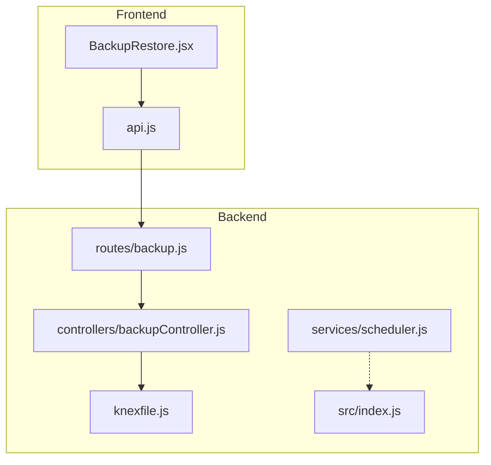
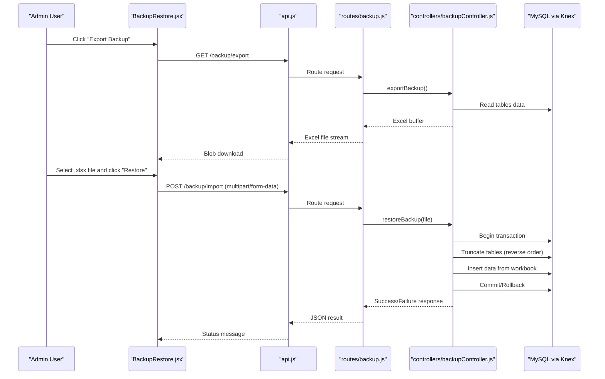
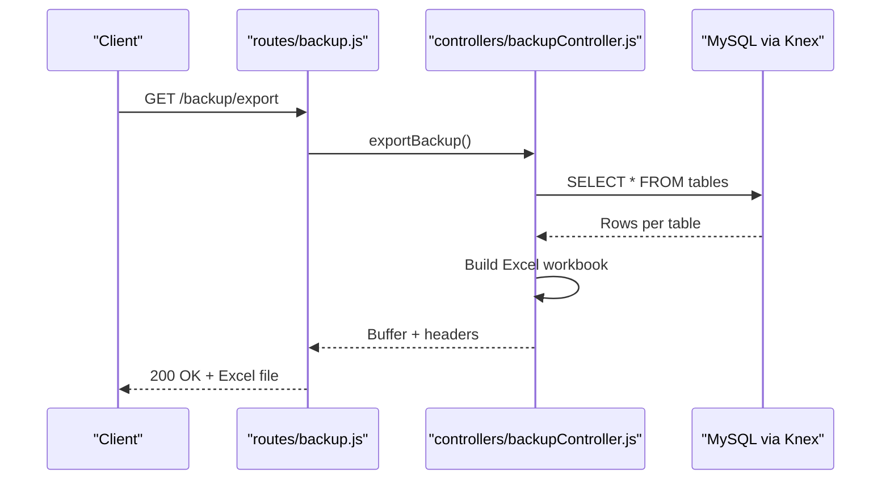
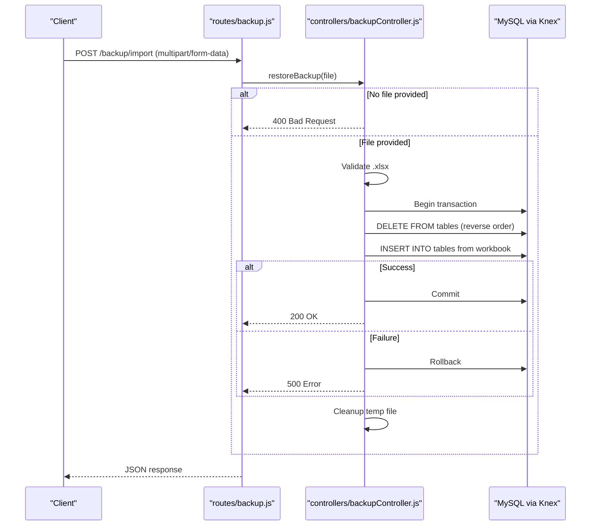
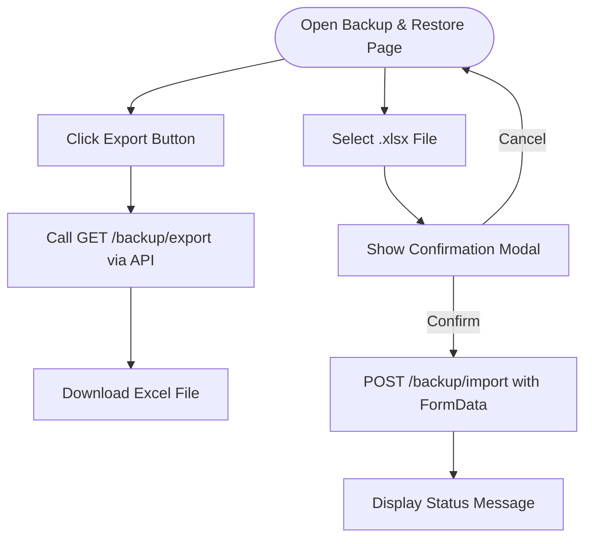
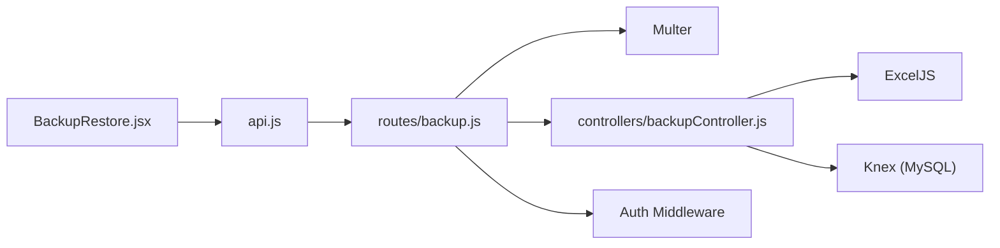

# Backup & Restore Operations

<cite>
**Referenced Files in This Document**
- [backupController.js](file://backend/src/controllers/backupController.js)
- [backup.js](file://backend/src/routes/backup.js)
- [BackupRestore.jsx](file://frontend/src/pages/BackupRestore.jsx)
- [api.js](file://frontend/src/services/api.js)
- [knexfile.js](file://backend/knexfile.js)
- [scheduler.js](file://backend/src/services/scheduler.js)
- [index.js](file://backend/src/index.js)
</cite>

## Table of Contents
1. [Introduction](#introduction)
2. [Project Structure](#project-structure)
3. [Core Components](#core-components)
4. [Architecture Overview](#architecture-overview)
5. [Detailed Component Analysis](#detailed-component-analysis)
6. [Dependency Analysis](#dependency-analysis)
7. [Performance Considerations](#performance-considerations)
8. [Troubleshooting Guide](#troubleshooting-guide)
9. [Conclusion](#conclusion)

## Introduction
This document describes the backup and restore system endpoints for the NKB Petty Cash System. It covers manual backup creation, restoration workflows, and operational controls. The system currently supports exporting the database to an Excel spreadsheet and importing a previously exported backup to restore data. The implementation includes role-based access control, transactional restoration, and basic integrity checks during restore operations.

## Project Structure
The backup and restore functionality spans backend controllers and routes, frontend UI components, and supporting configuration files:
- Backend controller handles export and restore operations
- Express routes define endpoint access and file upload constraints
- Frontend page provides user interface for initiating backups and restores
- Database configuration defines connection parameters for the MySQL database
- Scheduler module manages recurring tasks unrelated to backups but relevant to system maintenance

**Diagram sources**
- [backup.js:1-33](file://backend/src/routes/backup.js#L1-L33)
- [backupController.js:1-137](file://backend/src/controllers/backupController.js#L1-L137)
- [knexfile.js:1-37](file://backend/knexfile.js#L1-L37)
- [scheduler.js:1-154](file://backend/src/services/scheduler.js#L1-L154)
- [index.js:60-99](file://backend/src/index.js#L60-L99)

**Section sources**
- [backup.js:1-33](file://backend/src/routes/backup.js#L1-L33)
- [backupController.js:1-137](file://backend/src/controllers/backupController.js#L1-L137)
- [knexfile.js:1-37](file://backend/knexfile.js#L1-L37)
- [scheduler.js:1-154](file://backend/src/services/scheduler.js#L1-L154)
- [index.js:60-99](file://backend/src/index.js#L60-L99)

## Core Components
- Export endpoint: Generates a single Excel workbook containing all configured tables
- Import endpoint: Restores data from an uploaded Excel workbook using a transaction
- Role-based access control: Requires Super Admin privileges
- File upload handling: Accepts only .xlsx files via multer
- Transactional restore: Ensures atomicity during restoration

Key operational characteristics:
- Export creates a single workbook with worksheets named after database tables
- Restore clears existing data in dependency-aware order, then inserts data from the workbook
- Temporary file handling ensures cleanup after restore attempts

**Section sources**
- [backupController.js:6-56](file://backend/src/controllers/backupController.js#L6-L56)
- [backupController.js:58-136](file://backend/src/controllers/backupController.js#L58-L136)
- [backup.js:8-27](file://backend/src/routes/backup.js#L8-L27)
- [backup.js:29-30](file://backend/src/routes/backup.js#L29-L30)

## Architecture Overview
The backup and restore architecture follows a clear separation of concerns:
- Frontend triggers requests via the API service
- Express routes enforce authentication and authorization
- Controller performs database operations and file handling
- Database configuration defines connection parameters

**Diagram sources**
- [BackupRestore.jsx:12-32](file://frontend/src/pages/BackupRestore.jsx#L12-L32)
- [BackupRestore.jsx:40-65](file://frontend/src/pages/BackupRestore.jsx#L40-L65)
- [api.js:1-29](file://frontend/src/services/api.js#L1-L29)
- [backup.js:29-30](file://backend/src/routes/backup.js#L29-L30)
- [backupController.js:6-56](file://backend/src/controllers/backupController.js#L6-L56)
- [backupController.js:58-136](file://backend/src/controllers/backupController.js#L58-L136)

## Detailed Component Analysis

### Export Endpoint
Purpose:
- Create a comprehensive backup of the system by exporting all relevant tables into a single Excel workbook

Behavior:
- Reads data from predefined tables
- Writes each table as a worksheet
- Streams the workbook as an Excel file attachment

Access control:
- Protected route requiring authentication and Super Admin authorization

Response:
- 200 OK with Excel file attachment on success
- 500 Internal Server Error with error message on failure

**Diagram sources**
- [backup.js](file://backend/src/routes/backup.js#L29)
- [backupController.js:6-56](file://backend/src/controllers/backupController.js#L6-L56)

**Section sources**
- [backupController.js:6-56](file://backend/src/controllers/backupController.js#L6-L56)
- [backup.js](file://backend/src/routes/backup.js#L29)

### Import Endpoint
Purpose:
- Restore the system database from an uploaded Excel backup file

Behavior:
- Validates file type (.xlsx)
- Begins a database transaction
- Clears existing data in dependency-aware reverse order
- Inserts data from each worksheet into corresponding tables
- Commits on success, rolls back on error
- Cleans up temporary upload file

Access control:
- Protected route requiring authentication and Super Admin authorization

Response:
- 200 OK with success message on success
- 400 Bad Request if no file is provided
- 500 Internal Server Error with error message on failure

**Diagram sources**
- [backup.js:18-27](file://backend/src/routes/backup.js#L18-L27)
- [backup.js](file://backend/src/routes/backup.js#L30)
- [backupController.js:58-136](file://backend/src/controllers/backupController.js#L58-L136)

**Section sources**
- [backupController.js:58-136](file://backend/src/controllers/backupController.js#L58-L136)
- [backup.js:18-27](file://backend/src/routes/backup.js#L18-L27)
- [backup.js](file://backend/src/routes/backup.js#L30)

### Frontend Integration
The frontend provides:
- Export button that downloads a timestamped Excel file
- File selection for restore with confirmation modal
- Status messages for success and error scenarios
- Critical warning about destructive nature of restore

**Diagram sources**
- [BackupRestore.jsx:12-32](file://frontend/src/pages/BackupRestore.jsx#L12-L32)
- [BackupRestore.jsx:34-65](file://frontend/src/pages/BackupRestore.jsx#L34-L65)

**Section sources**
- [BackupRestore.jsx:12-32](file://frontend/src/pages/BackupRestore.jsx#L12-L32)
- [BackupRestore.jsx:34-65](file://frontend/src/pages/BackupRestore.jsx#L34-L65)

### Database Configuration
The system connects to a MySQL database using Knex with environment variables for credentials and connection details. Migration and seed directories are configured for schema management.

**Section sources**
- [knexfile.js:1-37](file://backend/knexfile.js#L1-L37)

### Scheduling Context
While backup scheduling is not implemented in the current code, the scheduler module demonstrates how recurring tasks are managed in the system. This provides context for potential future automation of backups.

**Section sources**
- [scheduler.js:1-154](file://backend/src/services/scheduler.js#L1-L154)

## Dependency Analysis
The backup system depends on:
- Express routes for request handling and file upload constraints
- Multer for secure file upload to a designated temporary directory
- ExcelJS for workbook creation and parsing
- Knex for database access and transaction management
- Authentication and authorization middleware for role enforcement

**Diagram sources**
- [backup.js:1-33](file://backend/src/routes/backup.js#L1-L33)
- [backupController.js:1-5](file://backend/src/controllers/backupController.js#L1-L5)
- [api.js:1-29](file://frontend/src/services/api.js#L1-L29)

**Section sources**
- [backup.js:1-33](file://backend/src/routes/backup.js#L1-L33)
- [backupController.js:1-5](file://backend/src/controllers/backupController.js#L1-L5)
- [api.js:1-29](file://frontend/src/services/api.js#L1-L29)

## Performance Considerations
- Export performance scales with the total number of rows across tables; consider limiting export scope for very large datasets
- Restore performance depends on insert volume and database write speed; the transactional approach ensures consistency but may lock tables during operation
- File upload size limits are enforced by multer; ensure client devices can handle large Excel files
- Network bandwidth affects export/download speeds; consider compressing data externally if needed

## Troubleshooting Guide
Common issues and resolutions:
- Access Denied: Ensure the requesting user has Super Admin role; endpoints are protected by authorization middleware
- Invalid File Type: Only .xlsx files are accepted; verify the uploaded file extension
- Restore Failed: Review server logs for database errors; the system automatically rolls back on failure and cleans up temporary files
- Empty Sheets: Export handles empty tables gracefully; if a table is empty, an empty worksheet may be included
- Large Data Sets: For very large exports/restores, monitor memory usage and database performance

Operational notes:
- Temporary files are stored in the uploads directory and cleaned up after restore attempts
- Transactional restore ensures data integrity; partial failures roll back all changes
- The restore process truncates tables in reverse dependency order to avoid foreign key conflicts

**Section sources**
- [backup.js:18-27](file://backend/src/routes/backup.js#L18-L27)
- [backupController.js:58-136](file://backend/src/controllers/backupController.js#L58-L136)

## Conclusion
The backup and restore system provides a straightforward mechanism for exporting and restoring the entire database state using Excel workbooks. It enforces role-based access control, uses transactions for reliable restoration, and includes basic integrity safeguards. While automated scheduling is not yet implemented, the existing architecture supports future enhancements such as scheduled exports and retention policies.