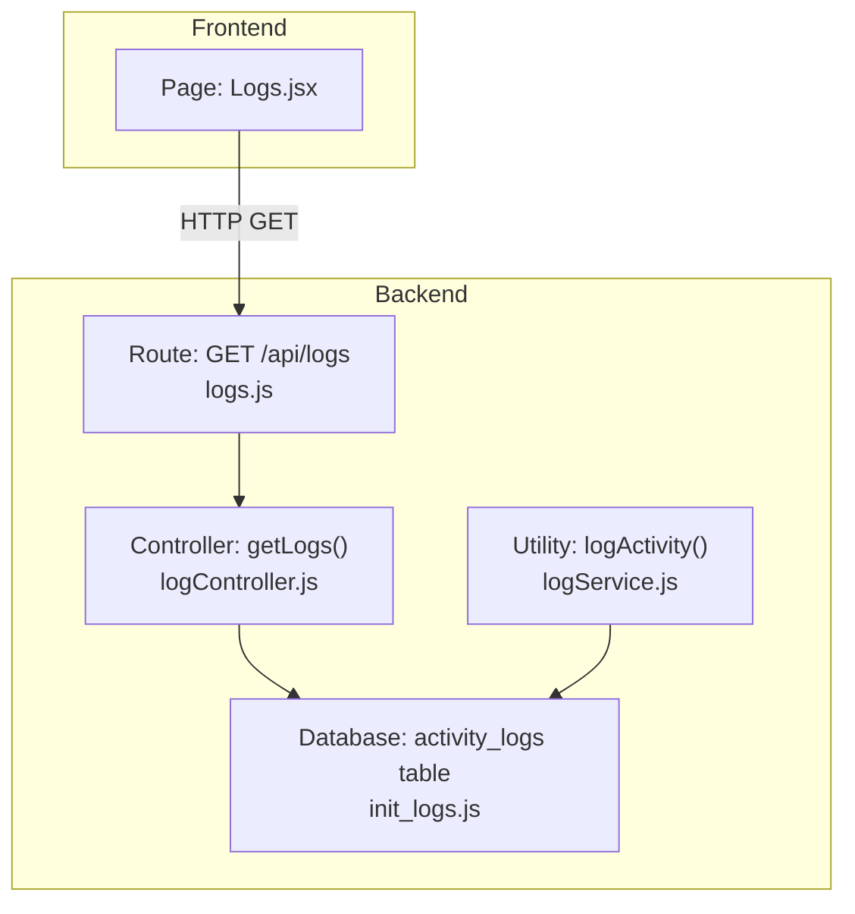
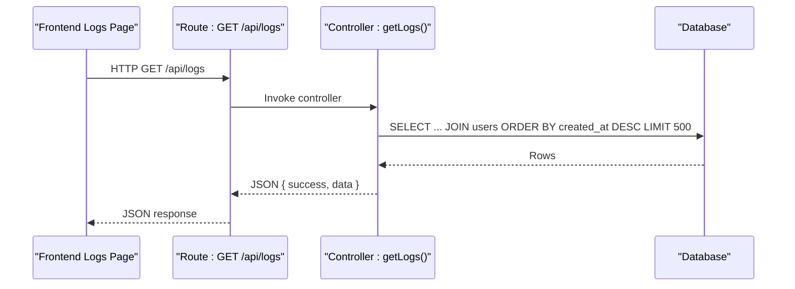
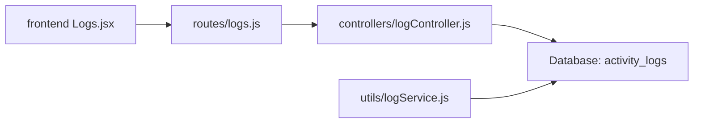

# Logging & Monitoring APIs

<cite>
**Referenced Files in This Document**
- [logController.js](file://backend/src/controllers/logController.js)
- [logs.js](file://backend/src/routes/logs.js)
- [logService.js](file://backend/src/utils/logService.js)
- [init_logs.js](file://backend/init_logs.js)
- [Logs.jsx](file://frontend/src/pages/Logs.jsx)
</cite>

## Table of Contents
1. [Introduction](#introduction)
2. [Project Structure](#project-structure)
3. [Core Components](#core-components)
4. [Architecture Overview](#architecture-overview)
5. [Detailed Component Analysis](#detailed-component-analysis)
6. [Dependency Analysis](#dependency-analysis)
7. [Performance Considerations](#performance-considerations)
8. [Troubleshooting Guide](#troubleshooting-guide)
9. [Conclusion](#conclusion)

## Introduction
This document describes the logging and monitoring APIs for audit trail retrieval and display. It covers endpoint behavior, request and response schemas, filtering capabilities, pagination, sorting, and export considerations. It also outlines system health and monitoring integration points visible in the frontend, and highlights operational topics such as log rotation, retention, and security controls for log access.

## Project Structure
The logging subsystem consists of:
- Backend route exposing GET /api/logs
- Controller implementing log retrieval with a fixed limit and server-side ordering
- Utility service for writing activity logs
- Frontend page for viewing and filtering logs
- Initialization script ensuring the activity_logs table exists

**Diagram sources**
- [logs.js:1-9](file://backend/src/routes/logs.js#L1-L9)
- [logController.js:1-21](file://backend/src/controllers/logController.js#L1-L21)
- [init_logs.js:1-19](file://backend/init_logs.js#L1-L19)
- [logService.js:1-24](file://backend/src/utils/logService.js#L1-L24)
- [Logs.jsx:1-179](file://frontend/src/pages/Logs.jsx#L1-L179)

**Section sources**
- [logs.js:1-9](file://backend/src/routes/logs.js#L1-L9)
- [logController.js:1-21](file://backend/src/controllers/logController.js#L1-L21)
- [logService.js:1-24](file://backend/src/utils/logService.js#L1-L24)
- [init_logs.js:1-19](file://backend/init_logs.js#L1-L19)
- [Logs.jsx:1-179](file://frontend/src/pages/Logs.jsx#L1-L179)

## Core Components
- Endpoint: GET /api/logs
  - Purpose: Retrieve recent system activity logs with user context
  - Authentication: Requires bearer token
  - Authorization: Super Admin role
  - Response: JSON object containing success flag and data array of logs
- Controller behavior:
  - Joins activity_logs with users to enrich entries with user full_name and username
  - Orders by created_at descending
  - Limits to 500 most recent entries
- Frontend:
  - Fetches logs on mount
  - Filters client-side by action, details, or user full_name
  - Displays timestamp, user, action, details, and IP address

**Section sources**
- [logs.js:1-9](file://backend/src/routes/logs.js#L1-L9)
- [logController.js:1-21](file://backend/src/controllers/logController.js#L1-L21)
- [Logs.jsx:1-179](file://frontend/src/pages/Logs.jsx#L1-L179)

## Architecture Overview
The logging pipeline integrates write-time and read-time operations:
- Write path: Services call logActivity to persist events to activity_logs
- Read path: GET /api/logs returns paginated, sorted, and joined records
- Frontend: Renders logs and applies client-side filters

**Diagram sources**
- [logs.js:1-9](file://backend/src/routes/logs.js#L1-L9)
- [logController.js:1-21](file://backend/src/controllers/logController.js#L1-L21)

## Detailed Component Analysis

### Endpoint Definition: GET /api/logs
- Method: GET
- Path: /api/logs
- Authentication: Required (bearer token)
- Authorization: Super Admin
- Request parameters:
  - None (no query parameters supported)
- Response body:
  - success: boolean
  - data: array of log entries
- Log entry fields:
  - id: integer
  - user_id: integer or null
  - action: string
  - details: text
  - ip_address: string
  - created_at: timestamp
  - full_name: string (from users join) or null
  - username: string (from users join) or null

Notes:
- Pagination is not exposed; the controller limits to 500 entries.
- Sorting is fixed to created_at descending.
- No server-side filtering or search is implemented.

**Section sources**
- [logs.js:1-9](file://backend/src/routes/logs.js#L1-L9)
- [logController.js:1-21](file://backend/src/controllers/logController.js#L1-L21)

### Controller Implementation Details
- Database query:
  - Left join with users on user_id
  - Selects activity_logs.* plus users.full_name and users.username
  - Orders by activity_logs.created_at descending
  - Limits to 500 rows
- Error handling:
  - Catches database errors and returns 500 with a generic message

**Section sources**
- [logController.js:1-21](file://backend/src/controllers/logController.js#L1-L21)

### Logging Utility (Write Path)
- Function: logActivity(userId, action, details, ip?)
- Behavior:
  - Inserts a row into activity_logs with user_id, action, details, and optional ip_address
  - Silently handles database insertion failures

**Section sources**
- [logService.js:1-24](file://backend/src/utils/logService.js#L1-L24)

### Database Schema
- Table: activity_logs
  - Columns: id (PK), user_id (FK to users), action, details, ip_address, created_at
- Initialization:
  - Creates table if missing
  - Adds foreign key constraint on user_id with ON DELETE SET NULL

**Section sources**
- [init_logs.js:1-19](file://backend/init_logs.js#L1-L19)

### Frontend Log Viewer
- Fetches logs via GET /api/logs on mount
- Client-side filtering:
  - Searches across action, details, and full_name
- Rendering:
  - Timestamps formatted by date-fns
  - Action badges colored by action keywords
  - Displays user avatar initials, username, details, and IP address

**Section sources**
- [Logs.jsx:1-179](file://frontend/src/pages/Logs.jsx#L1-L179)

### Export Operations
- Current state:
  - No server-side export endpoint is present
  - Frontend does not expose export buttons for logs
- Recommendation:
  - Add CSV/PDF export endpoints with optional query parameters for date range and filters
  - Enforce rate limiting and user consent for exports

[No sources needed since this section provides recommendations without analyzing specific files]

### Filtering and Search Criteria
- Server-side:
  - Not supported (no query parameters)
- Client-side:
  - Implemented in Logs.jsx with a single text field searching action, details, and full_name

**Section sources**
- [Logs.jsx:1-179](file://frontend/src/pages/Logs.jsx#L1-L179)

### Pagination and Sorting
- Pagination:
  - Not exposed; controller returns up to 500 entries
- Sorting:
  - Fixed to created_at descending

**Section sources**
- [logController.js:1-21](file://backend/src/controllers/logController.js#L1-L21)

### Security Considerations
- Access control:
  - Route protected by bearer token and Super Admin authorization
- Data exposure:
  - Returns sensitive fields (details, ip_address) to authorized users
- Recommendations:
  - Consider redacting sensitive details in read-only dashboards
  - Enforce least privilege and monitor access to logs

**Section sources**
- [logs.js:1-9](file://backend/src/routes/logs.js#L1-L9)

### System Health and Monitoring Integration
- Queue monitoring:
  - Dedicated page for queue health and BullMQ integration
  - Provides counts for active, waiting, completed, failed, delayed jobs
  - Includes a link to the technical Bull Board interface
- Audit logs page:
  - Real-time listing of system activity events
  - Supports client-side filtering and display of timestamps, users, actions, details, and IPs

**Section sources**
- [Logs.jsx:1-179](file://frontend/src/pages/Logs.jsx#L1-L179)

## Dependency Analysis

**Diagram sources**
- [logs.js:1-9](file://backend/src/routes/logs.js#L1-L9)
- [logController.js:1-21](file://backend/src/controllers/logController.js#L1-L21)
- [logService.js:1-24](file://backend/src/utils/logService.js#L1-L24)
- [Logs.jsx:1-179](file://frontend/src/pages/Logs.jsx#L1-L179)

**Section sources**
- [logs.js:1-9](file://backend/src/routes/logs.js#L1-L9)
- [logController.js:1-21](file://backend/src/controllers/logController.js#L1-L21)
- [logService.js:1-24](file://backend/src/utils/logService.js#L1-L24)
- [Logs.jsx:1-179](file://frontend/src/pages/Logs.jsx#L1-L179)

## Performance Considerations
- Controller limit:
  - Fixed limit of 500 rows prevents unbounded reads
- Sorting:
  - Single column sort by created_at descending is efficient
- Indexing:
  - Consider adding an index on activity_logs.created_at for large datasets
- Frontend filtering:
  - Client-side filtering on ~500 rows is acceptable but can be improved with server-side search

[No sources needed since this section provides general guidance]

## Troubleshooting Guide
- 500 Internal Server Error on GET /api/logs:
  - Indicates database connectivity or query failure
  - Check database availability and connection configuration
- Empty response:
  - activity_logs table may be empty or missing
  - Run initialization script to create the table
- Missing user context:
  - If user_id is null, full_name and username will be null
  - Verify user records exist and user_id references are valid

**Section sources**
- [logController.js:1-21](file://backend/src/controllers/logController.js#L1-L21)
- [init_logs.js:1-19](file://backend/init_logs.js#L1-L19)

## Conclusion
The logging and monitoring system provides a focused audit trail endpoint with strong access controls and a clean frontend viewer. While server-side filtering, pagination, and export are not yet implemented, the existing foundation supports straightforward enhancements to meet operational needs for compliance, incident response, and system observability.