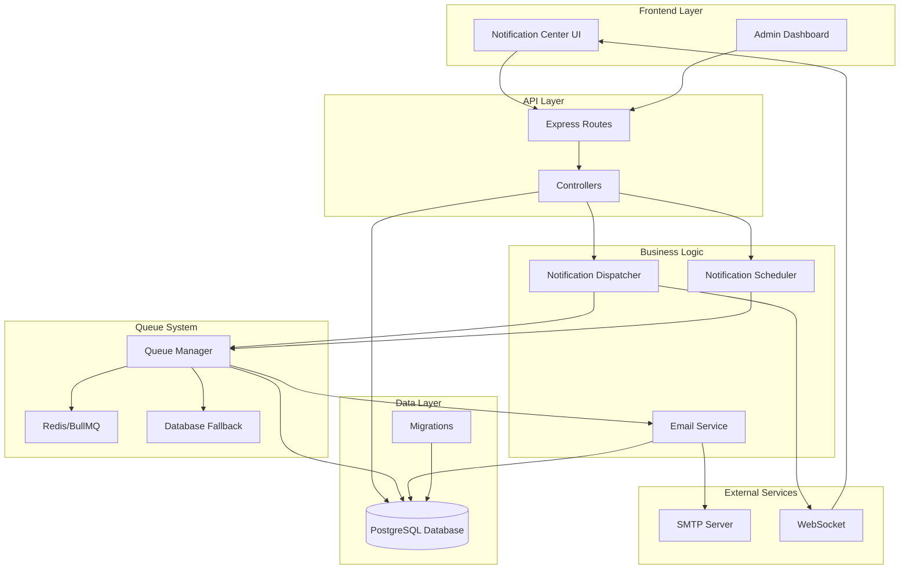
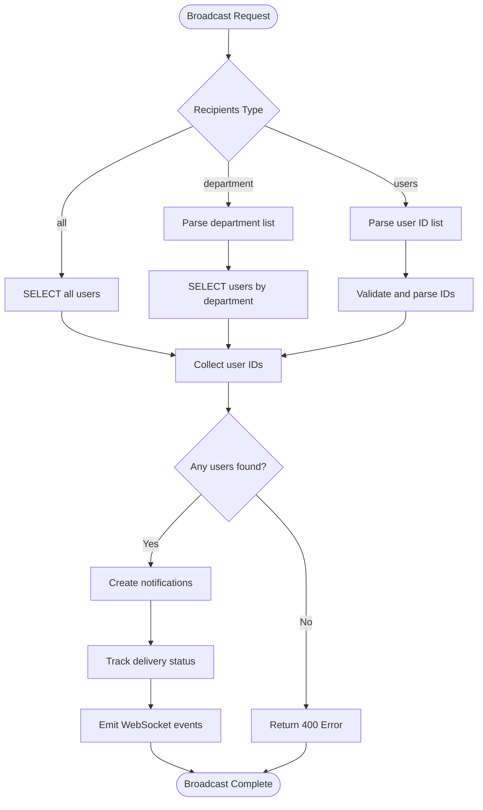
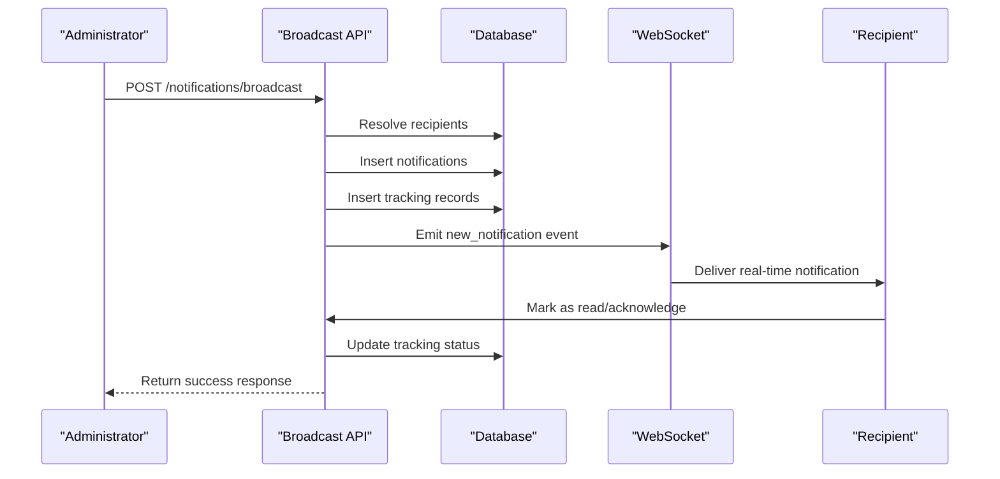
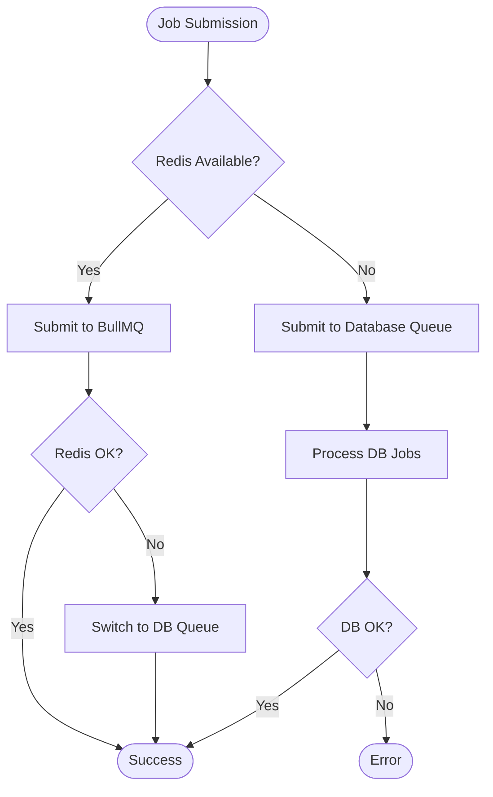

# Notification System Administration

<cite>
**Referenced Files in This Document**
- [notificationCenterController.js](file://backend/src/controllers/notificationCenterController.js)
- [notificationController.js](file://backend/src/controllers/notificationController.js)
- [emailAutomationController.js](file://backend/src/controllers/emailAutomationController.js)
- [notifications.js](file://backend/src/routes/notifications.js)
- [notificationDispatcher.js](file://backend/src/services/notificationDispatcher.js)
- [emailService.js](file://backend/src/services/emailService.js)
- [queueManager.js](file://backend/src/services/queueManager.js)
- [scheduler.js](file://backend/src/services/scheduler.js)
- [20260515064955_add_notifications_and_email_system.js](file://backend/src/db/migrations/20260515064955_add_notifications_and_email_system.js)
- [20260517090000_create_notification_center_tables.js](file://backend/src/db/migrations/20260517090000_create_notification_center_tables.js)
- [NotificationCenter.jsx](file://frontend/src/components/NotificationCenter.jsx)
- [QueueMonitor.jsx](file://frontend/src/pages/QueueMonitor.jsx)
</cite>

## Table of Contents
1. [Introduction](#introduction)
2. [System Architecture](#system-architecture)
3. [API Endpoints](#api-endpoints)
4. [Notification Template Management](#notification-template-management)
5. [Delivery Configuration](#delivery-configuration)
6. [Broadcast Controls](#broadcast-controls)
7. [Recipient Filtering](#recipient-filtering)
8. [Notification Center Administration](#notification-center-administration)
9. [Bulk Messaging Capabilities](#bulk-messaging-capabilities)
10. [Delivery Status Tracking](#delivery-status-tracking)
11. [Throttling and Retry Policies](#throttling-and-retry-policies)
12. [Failure Handling](#failure-handling)
13. [Frontend Integration](#frontend-integration)
14. [Database Schema](#database-schema)

## Introduction

The Notification System Administration provides comprehensive APIs for managing notifications, templates, and delivery configurations within the Petty Cash application. This system supports both real-time in-app notifications and email delivery through a robust queuing mechanism with Redis/BullMQ support and database fallback capabilities.

The system is designed with security in mind, requiring authentication and authorization for administrative operations while providing flexible recipient targeting and scheduling capabilities.

## System Architecture



**Diagram sources**
- [notificationCenterController.js:1-370](file://backend/src/controllers/notificationCenterController.js#L1-L370)
- [notificationDispatcher.js:1-68](file://backend/src/services/notificationDispatcher.js#L1-L68)
- [queueManager.js:1-126](file://backend/src/services/queueManager.js#L1-L126)
- [scheduler.js:1-155](file://backend/src/services/scheduler.js#L1-L155)

## API Endpoints

### Authentication and Authorization

All administrative endpoints require authentication and specific roles:
- `GET /api/notifications` - User inbox access
- `POST /api/notifications/broadcast` - Requires "Super Admin" or "Accounting"
- `GET /api/notifications/sent` - Requires "Super Admin" or "Accounting"

**Section sources**
- [notifications.js:1-33](file://backend/src/routes/notifications.js#L1-L33)

### User Notification Endpoints

| Method | Endpoint | Description | Authentication |
|--------|----------|-------------|----------------|
| GET | `/api/notifications` | Fetch user notifications with filters | Required |
| PUT | `/api/notifications/:id/read` | Mark single notification as read | Required |
| PUT | `/api/notifications/read-all` | Mark all notifications as read | Required |
| PUT | `/api/notifications/:id/acknowledge` | Acknowledge notification | Required |
| PUT | `/api/notifications/:id/archive` | Archive/unarchive notification | Required |

### User Preference Endpoints

| Method | Endpoint | Description | Authentication |
|--------|----------|-------------|----------------|
| GET | `/api/notifications/preferences` | Get user notification preferences | Required |
| PUT | `/api/notifications/preferences` | Update user notification preferences | Required |

### Administrative Endpoints

| Method | Endpoint | Description | Authentication |
|--------|----------|-------------|----------------|
| POST | `/api/notifications/broadcast` | Broadcast notifications to users | Super Admin/Accounting |
| GET | `/api/notifications/sent` | View sent notifications with tracking | Super Admin/Accounting |

**Section sources**
- [notifications.js:17-31](file://backend/src/routes/notifications.js#L17-L31)

## Notification Template Management

### Template Operations

The system supports full CRUD operations for notification templates:

#### Template Creation Request Schema
```javascript
{
  "name": "string",           // Unique template name
  "subject": "string",        // Email subject
  "body": "string",           // HTML body with placeholders
  "type": "string"            // Template type (info, success, warning, error, approval, finance)
}
```

#### Template Update Request Schema
```javascript
{
  "name": "string",           // Template name
  "subject": "string",        // Email subject
  "body": "string",           // HTML body with placeholders
  "type": "string"            // Template type
}
```

#### Template Deletion
- Endpoint: `DELETE /api/notifications/templates/:id`
- Requires: Administrative privileges

**Section sources**
- [notificationCenterController.js:291-345](file://backend/src/controllers/notificationCenterController.js#L291-L345)

### Email Template Management

The email automation system provides separate template management:

#### Email Template Operations
```javascript
// Create Email Template
{
  "name": "string",
  "subject": "string",
  "body": "string",
  "type": "string"
}

// Update Email Template
{
  "name": "string",
  "subject": "string", 
  "body": "string",
  "type": "string"
}
```

**Section sources**
- [emailAutomationController.js:13-44](file://backend/src/controllers/emailAutomationController.js#L13-L44)

## Delivery Configuration

### Channel Configuration

The system supports dual-channel delivery with configurable preferences:

#### User Preference Schema
```javascript
{
  "email_enabled": "boolean",     // Enable/disable email notifications
  "in_app_enabled": "boolean"     // Enable/disable in-app notifications
}
```

#### Global Delivery Rules
- **Priority Levels**: normal, important, critical
- **Notification Types**: info, success, warning, error, approval, finance, audit
- **Categories**: general, approval, finance, alert

### Template-Based Delivery

Templates enable structured notification delivery with dynamic content replacement.

**Section sources**
- [notificationDispatcher.js:9-56](file://backend/src/services/notificationDispatcher.js#L9-L56)
- [notificationCenterController.js:29-40](file://backend/src/controllers/notificationCenterController.js#L29-L40)

## Broadcast Controls

### Broadcast Notification Request Schema

Administrative broadcast functionality supports flexible recipient targeting:

```javascript
{
  "title": "string",                           // Notification title
  "message": "string",                         // Notification message
  "priority": "string",                       // normal, important, critical
  "recipients_type": "string",               // all, department, users
  "recipients_data": "array|string|number",  // Target identifiers
  "attachment_url": "string",                 // Optional attachment link
  "task_link": "string",                      // Optional task reference
  "category": "string"                        // Notification category
}
```

### Recipient Resolution Logic



**Diagram sources**
- [notificationCenterController.js:140-209](file://backend/src/controllers/notificationCenterController.js#L140-L209)

**Section sources**
- [notificationCenterController.js:140-209](file://backend/src/controllers/notificationCenterController.js#L140-L209)

## Recipient Filtering

### Advanced Filtering Options

The notification center supports sophisticated filtering for user-specific views:

#### Query Parameters
- `search`: Text search across title and message
- `priority`: Filter by priority level
- `status`: Filter by status (unread, read, archived)
- `category`: Filter by notification category

#### Status States
- **Active**: Non-archived notifications
- **Unread**: Unread, non-archived notifications
- **Read**: Read, non-archived notifications  
- **Archived**: Archived notifications

**Section sources**
- [notificationCenterController.js:7-40](file://backend/src/controllers/notificationCenterController.js#L7-L40)

## Notification Center Administration

### Administrative Features

Administrators have access to comprehensive notification management:

#### Sent Notifications Tracking
- View all notifications broadcasted by administrators
- Track delivery status per recipient
- Monitor read and acknowledgment rates

#### Schedule Management
- View all scheduled notifications
- Create recurring notification schedules
- Manage schedule lifecycle (active, completed, paused)

**Section sources**
- [notificationCenterController.js:211-286](file://backend/src/controllers/notificationCenterController.js#L211-L286)

### Real-Time Delivery Tracking



**Diagram sources**
- [notificationCenterController.js:140-209](file://backend/src/controllers/notificationCenterController.js#L140-L209)

## Bulk Messaging Capabilities

### Scalable Delivery Architecture

The system is designed for high-volume notification delivery:

#### Queue Processing
- **Redis/BullMQ**: Primary queue system with automatic scaling
- **Database Fallback**: Automatic failover when Redis is unavailable
- **Job Prioritization**: Configurable priority levels for critical notifications

#### Delivery Patterns
- **Immediate Delivery**: Real-time notifications via WebSocket
- **Scheduled Delivery**: Cron-based recurring notifications
- **Batch Processing**: Efficient bulk notification distribution

**Section sources**
- [queueManager.js:61-85](file://backend/src/services/queueManager.js#L61-L85)
- [scheduler.js:42-147](file://backend/src/services/scheduler.js#L42-L147)

## Delivery Status Tracking

### Comprehensive Tracking System

The system maintains detailed delivery and engagement metrics:

#### Tracking Fields
- **Status**: sent, delivered, read, acknowledged
- **Timestamps**: created_at, read_at, acknowledged_at
- **User Context**: user_id, notification_id relationship
- **Engagement Metrics**: read rates, acknowledgment rates

#### Tracking Queries
- Per-notification delivery status
- User-specific engagement history
- Administrative reporting dashboards

**Section sources**
- [notificationCenterController.js:222-234](file://backend/src/controllers/notificationCenterController.js#L222-L234)

## Throttling and Retry Policies

### Queue Management

The system implements robust queue management with intelligent retry mechanisms:

#### Job Configuration
- **Attempts**: Maximum 3 retry attempts for failed jobs
- **Backoff**: Exponential backoff (1s, 2s, 4s base delays)
- **Priority**: Configurable priority levels (0-100)
- **Delay**: Optional delayed execution for rate limiting

#### Fallback Mechanism


**Diagram sources**
- [queueManager.js:9-52](file://backend/src/services/queueManager.js#L9-L52)

**Section sources**
- [queueManager.js:61-85](file://backend/src/services/queueManager.js#L61-L85)

## Failure Handling

### Comprehensive Error Management

The system provides multiple layers of error handling and recovery:

#### Email Delivery Failures
- **Logging**: Detailed error logging with stack traces
- **Retry Logic**: Automatic retry with exponential backoff
- **Failure Notifications**: Admin alerts for persistent failures
- **Queue Monitoring**: Real-time visibility into failed jobs

#### Queue Failures
- **Automatic Fallback**: Seamless transition to database queue
- **Health Monitoring**: Redis connectivity monitoring
- **Graceful Degradation**: Reduced functionality during outages
- **Manual Intervention**: Admin controls for failed job management

**Section sources**
- [emailService.js:91-98](file://backend/src/services/emailService.js#L91-L98)
- [queueManager.js:96-115](file://backend/src/services/queueManager.js#L96-L115)

## Frontend Integration

### User Experience Features

The frontend provides comprehensive notification management:

#### Notification Center
- Real-time notification updates via WebSocket
- Visual priority indicators (critical, important, normal)
- Interactive marking (read, acknowledge, archive)
- Responsive design with animated feedback

#### Admin Dashboard
- Bulk notification broadcasting interface
- Delivery status monitoring
- Queue health visualization
- Template management interface

**Section sources**
- [NotificationCenter.jsx:1-183](file://frontend/src/components/NotificationCenter.jsx#L1-L183)
- [QueueMonitor.jsx:1-155](file://frontend/src/pages/QueueMonitor.jsx#L1-L155)

## Database Schema

### Core Tables

The notification system utilizes a normalized database schema:

#### Notification Templates
- `id`: Auto-increment primary key
- `name`: Unique template identifier
- `subject`: Email subject line
- `body`: HTML template content
- `type`: Template classification
- `created_at/updated_at`: Timestamp tracking

#### Notifications
- Enhanced with priority, sender, attachments, acknowledgments, archiving, and categorization
- Multi-recipient support through dedicated junction table
- Detailed read/acknowledgment tracking

#### Queue Management
- `queue_fallback_jobs`: Database-backed queue for Redis failures
- Support for priority, attempts, and retry scheduling

**Section sources**
- [20260517090000_create_notification_center_tables.js:1-119](file://backend/src/db/migrations/20260517090000_create_notification_center_tables.js#L1-L119)
- [20260515064955_add_notifications_and_email_system.js:1-110](file://backend/src/db/migrations/20260515064955_add_notifications_and_email_system.js#L1-L110)