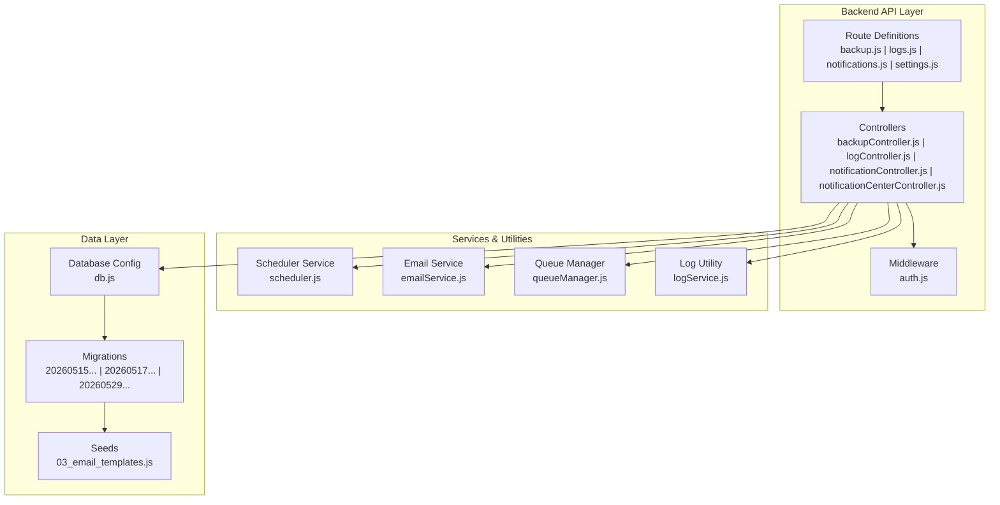
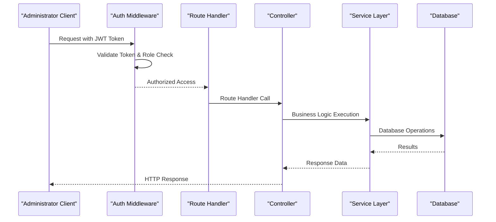
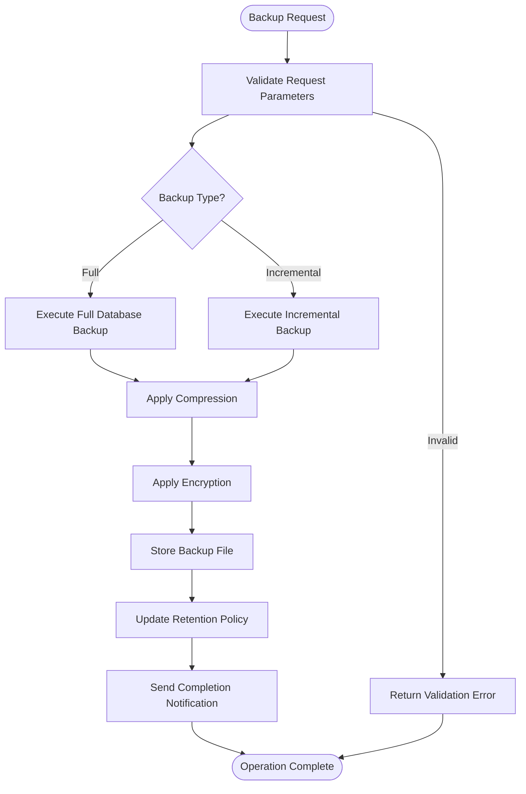
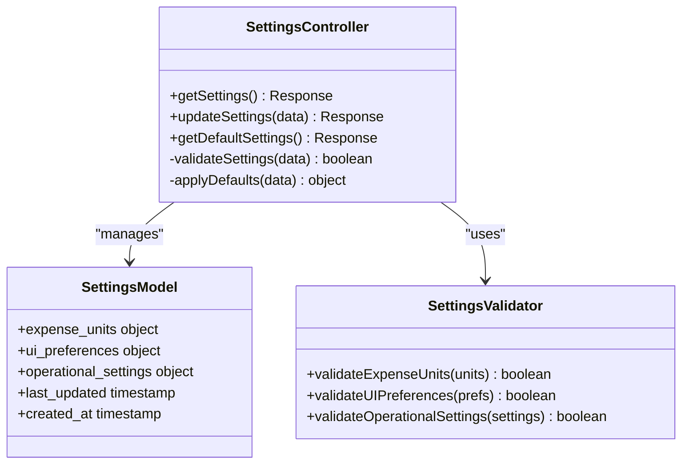
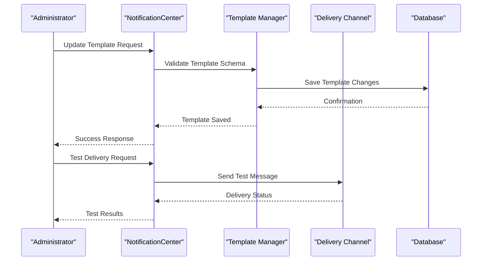
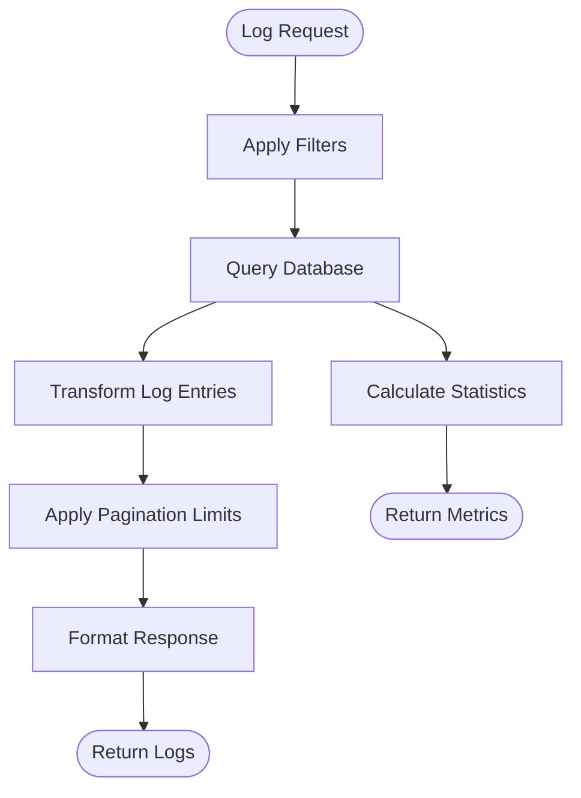
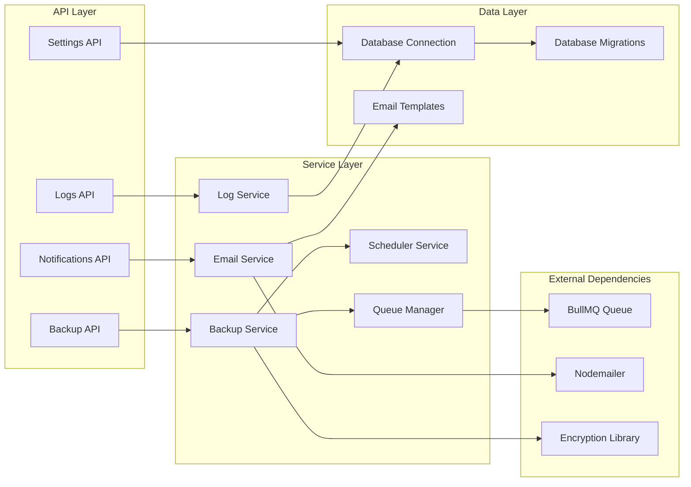

# System Administration API

<cite>
**Referenced Files in This Document**
- [backupController.js](file://backend/src/controllers/backupController.js)
- [logController.js](file://backend/src/controllers/logController.js)
- [notificationController.js](file://backend/src/controllers/notificationController.js)
- [notificationCenterController.js](file://backend/src/controllers/notificationCenterController.js)
- [settings.js](file://backend/src/routes/settings.js)
- [backup.js](file://backend/src/routes/backup.js)
- [logs.js](file://backend/src/routes/logs.js)
- [notifications.js](file://backend/src/routes/notifications.js)
- [auth.js](file://backend/src/middleware/auth.js)
- [db.js](file://backend/src/config/db.js)
- [scheduler.js](file://backend/src/services/scheduler.js)
- [emailService.js](file://backend/src/services/emailService.js)
- [queueManager.js](file://backend/src/services/queueManager.js)
- [logService.js](file://backend/src/utils/logService.js)
- [20260515064955_add_notifications_and_email_system.js](file://backend/src/db/migrations/20260515064955_add_notifications_and_email_system.js)
- [20260517090000_create_notification_center_tables.js](file://backend/src/db/migrations/20260517090000_create_notification_center_tables.js)
- [20260529120000_add_expense_units_setting.js](file://backend/src/db/migrations/20260529120000_add_expense_units_setting.js)
- [03_email_templates.js](file://backend/src/db/seeds/03_email_templates.js)
</cite>

## Table of Contents
1. [Introduction](#introduction)
2. [Project Structure](#project-structure)
3. [Core Components](#core-components)
4. [Architecture Overview](#architecture-overview)
5. [Detailed Component Analysis](#detailed-component-analysis)
6. [Dependency Analysis](#dependency-analysis)
7. [Performance Considerations](#performance-considerations)
8. [Troubleshooting Guide](#troubleshooting-guide)
9. [Conclusion](#conclusion)

## Introduction
This document provides comprehensive API documentation for system administration endpoints. It covers system settings management, backup and restore operations, notification configuration, logging endpoints, administrative privileges requirements, system health checks, maintenance operations, system monitoring, and administrative audit trails. The documentation is designed for both technical and non-technical administrators to understand and operate the system effectively.

## Project Structure
The system administration APIs are organized around dedicated controllers and routes within the backend service. Key components include:
- Controllers for backup, logging, notifications, and system settings
- Route definitions for each administrative endpoint group
- Middleware for authentication and authorization
- Database configurations and migration schemas supporting administrative features
- Services for scheduling, email dispatching, and queue management
- Utility modules for logging and database initialization

**Diagram sources**
- [backup.js](file://backend/src/routes/backup.js)
- [logs.js](file://backend/src/routes/logs.js)
- [notifications.js](file://backend/src/routes/notifications.js)
- [settings.js](file://backend/src/routes/settings.js)
- [backupController.js](file://backend/src/controllers/backupController.js)
- [logController.js](file://backend/src/controllers/logController.js)
- [notificationController.js](file://backend/src/controllers/notificationController.js)
- [notificationCenterController.js](file://backend/src/controllers/notificationCenterController.js)
- [auth.js](file://backend/src/middleware/auth.js)
- [scheduler.js](file://backend/src/services/scheduler.js)
- [emailService.js](file://backend/src/services/emailService.js)
- [queueManager.js](file://backend/src/services/queueManager.js)
- [logService.js](file://backend/src/utils/logService.js)
- [db.js](file://backend/src/config/db.js)
- [20260515064955_add_notifications_and_email_system.js](file://backend/src/db/migrations/20260515064955_add_notifications_and_email_system.js)
- [20260517090000_create_notification_center_tables.js](file://backend/src/db/migrations/20260517090000_create_notification_center_tables.js)
- [20260529120000_add_expense_units_setting.js](file://backend/src/db/migrations/20260529120000_add_expense_units_setting.js)
- [03_email_templates.js](file://backend/src/db/seeds/03_email_templates.js)

**Section sources**
- [backup.js](file://backend/src/routes/backup.js)
- [logs.js](file://backend/src/routes/logs.js)
- [notifications.js](file://backend/src/routes/notifications.js)
- [settings.js](file://backend/src/routes/settings.js)
- [auth.js](file://backend/src/middleware/auth.js)
- [db.js](file://backend/src/config/db.js)

## Core Components
This section outlines the primary administrative API components and their responsibilities:

### Authentication and Authorization Middleware
- Enforces administrative privileges for protected endpoints
- Validates JWT tokens and user roles
- Restricts access to system settings, backups, and audit operations

### Backup Management Controller
- Handles backup creation, restoration, and scheduling
- Manages backup storage locations and retention policies
- Provides backup status monitoring and error reporting

### Logging Controller
- Retrieves system logs with filtering capabilities
- Supports log level filtering and date range queries
- Exposes log rotation and archival operations

### Notification Management Controllers
- Configures system-wide notification templates
- Manages notification delivery channels and routing
- Provides notification center administration

### Settings Management Controller
- Updates system-wide configuration parameters
- Manages user interface preferences and operational settings
- Handles expense units and currency configurations

**Section sources**
- [auth.js](file://backend/src/middleware/auth.js)
- [backupController.js](file://backend/src/controllers/backupController.js)
- [logController.js](file://backend/src/controllers/logController.js)
- [notificationController.js](file://backend/src/controllers/notificationController.js)
- [notificationCenterController.js](file://backend/src/controllers/notificationCenterController.js)

## Architecture Overview
The system administration API follows a layered architecture with clear separation of concerns:

**Diagram sources**
- [auth.js](file://backend/src/middleware/auth.js)
- [backup.js](file://backend/src/routes/backup.js)
- [backupController.js](file://backend/src/controllers/backupController.js)
- [scheduler.js](file://backend/src/services/scheduler.js)
- [db.js](file://backend/src/config/db.js)

The architecture ensures:
- Centralized authentication and authorization
- Clear separation between route handlers, controllers, and services
- Database abstraction through configuration
- Modular service components for schedulers, email, and queues

## Detailed Component Analysis

### Backup and Restore Operations
Backup management provides comprehensive data protection capabilities:

#### Endpoint: POST /api/backup/create
- Purpose: Initiates manual backup creation
- Authentication: Administrative role required
- Request Body Schema:
  - type: string (enum: full, incremental)
  - compression: boolean
  - encryption: boolean
  - retention_days: integer (minimum: 1)
- Response: Backup metadata with status tracking

#### Endpoint: GET /api/backup/list
- Purpose: Lists available backups with metadata
- Query Parameters:
  - limit: integer (default: 50)
  - offset: integer (default: 0)
  - type: string (filter by backup type)
  - date_from: date-time
  - date_to: date-time
- Response: Array of backup objects with size, timestamp, and status

#### Endpoint: POST /api/backup/restore/:id
- Purpose: Restores system from specific backup
- Path Parameter: backup_id (UUID format)
- Request Body Schema:
  - confirm: boolean (must be true)
  - restore_options: object
    - data_only: boolean
    - schema_only: boolean
    - selective_tables: array of strings
- Response: Restore job identifier and status

#### Endpoint: POST /api/backup/schedule
- Purpose: Creates automated backup schedule
- Request Body Schema:
  - frequency: string (daily, weekly, monthly)
  - time: string (HH:mm:ss format)
  - retention_days: integer (minimum: 1)
  - enabled: boolean
  - target_location: string
- Response: Schedule configuration with next_run timestamp

**Diagram sources**
- [backupController.js](file://backend/src/controllers/backupController.js)
- [scheduler.js](file://backend/src/services/scheduler.js)

**Section sources**
- [backupController.js](file://backend/src/controllers/backupController.js)
- [backup.js](file://backend/src/routes/backup.js)
- [scheduler.js](file://backend/src/services/scheduler.js)

### System Settings Management
Settings management controls core system behavior and appearance:

#### Endpoint: GET /api/settings
- Purpose: Retrieves current system configuration
- Response: Complete settings object with defaults applied

#### Endpoint: PUT /api/settings
- Purpose: Updates system-wide settings
- Request Body Schema:
  - expense_units: object
    - default_unit: string
    - supported_units: array of strings
    - conversion_rates: object
  - ui_preferences: object
    - theme: string
    - language: string
    - timezone: string
  - operational_settings: object
    - max_daily_limit: number
    - approval_required: boolean
    - audit_logging: boolean
- Response: Updated settings with validation results

#### Endpoint: GET /api/settings/defaults
- Purpose: Returns default configuration values
- Response: Template of all configurable settings

**Diagram sources**
- [settings.js](file://backend/src/routes/settings.js)
- [20260529120000_add_expense_units_setting.js](file://backend/src/db/migrations/20260529120000_add_expense_units_setting.js)

**Section sources**
- [settings.js](file://backend/src/routes/settings.js)

### Notification Configuration
Notification system supports multiple delivery channels and templates:

#### Endpoint: GET /api/notifications/templates
- Purpose: Lists available notification templates
- Query Parameters:
  - category: string (filter by notification category)
  - language: string (filter by language)
  - active: boolean (filter by activation status)
- Response: Array of template definitions

#### Endpoint: PUT /api/notifications/templates/:templateId
- Purpose: Updates notification template content
- Path Parameter: templateId (UUID format)
- Request Body Schema:
  - subject: string
  - body: string
  - variables: array of strings
  - active: boolean
  - category: string
  - language: string
- Response: Updated template metadata

#### Endpoint: POST /api/notifications/test
- Purpose: Tests notification delivery
- Request Body Schema:
  - template_id: string
  - recipient: string
  - variables: object
- Response: Test delivery result

**Diagram sources**
- [notificationController.js](file://backend/src/controllers/notificationController.js)
- [notificationCenterController.js](file://backend/src/controllers/notificationCenterController.js)
- [emailService.js](file://backend/src/services/emailService.js)

**Section sources**
- [notificationController.js](file://backend/src/controllers/notificationController.js)
- [notificationCenterController.js](file://backend/src/controllers/notificationCenterController.js)
- [notifications.js](file://backend/src/routes/notifications.js)
- [emailService.js](file://backend/src/services/emailService.js)

### Logging and Monitoring
Logging system provides comprehensive audit trails and system monitoring:

#### Endpoint: GET /api/logs
- Purpose: Retrieves system logs with filtering
- Query Parameters:
  - level: string (trace, debug, info, warn, error)
  - service: string (filter by service/module)
  - date_from: date-time
  - date_to: date-time
  - limit: integer (default: 100)
  - offset: integer (default: 0)
- Response: Paginated log entries

#### Endpoint: GET /api/logs/stats
- Purpose: Provides system log statistics
- Response: Aggregated log metrics by level and service

#### Endpoint: GET /api/logs/download
- Purpose: Downloads filtered logs as CSV
- Query Parameters: Same as GET /api/logs
- Response: CSV file attachment

**Diagram sources**
- [logController.js](file://backend/src/controllers/logController.js)
- [logService.js](file://backend/src/utils/logService.js)

**Section sources**
- [logController.js](file://backend/src/controllers/logController.js)
- [logs.js](file://backend/src/routes/logs.js)
- [logService.js](file://backend/src/utils/logService.js)

### Administrative Audit Trails
Audit trail system maintains comprehensive records of administrative actions:

#### Endpoint: GET /api/audit
- Purpose: Retrieves administrative action history
- Query Parameters:
  - actor: string (administrator username)
  - action: string (filter by action type)
  - resource: string (filter by affected resource)
  - date_from: date-time
  - date_to: date-time
  - limit: integer (default: 100)
- Response: Array of audit events with timestamps and details

#### Endpoint: GET /api/health
- Purpose: System health check endpoint
- Response: Health status including database connectivity, service availability, and resource utilization

**Section sources**
- [logController.js](file://backend/src/controllers/logController.js)
- [logService.js](file://backend/src/utils/logService.js)

## Dependency Analysis
Administrative APIs depend on several core services and database components:

**Diagram sources**
- [backupController.js](file://backend/src/controllers/backupController.js)
- [notificationController.js](file://backend/src/controllers/notificationController.js)
- [logController.js](file://backend/src/controllers/logController.js)
- [scheduler.js](file://backend/src/services/scheduler.js)
- [emailService.js](file://backend/src/services/emailService.js)
- [queueManager.js](file://backend/src/services/queueManager.js)
- [logService.js](file://backend/src/utils/logService.js)
- [db.js](file://backend/src/config/db.js)

Key dependencies and their roles:
- **Database Layer**: Provides persistent storage for configurations, logs, and audit trails
- **Scheduler Service**: Manages automated backup jobs and maintenance tasks
- **Email Service**: Handles notification delivery via SMTP and template rendering
- **Queue Manager**: Processes background tasks asynchronously using BullMQ
- **Encryption Library**: Secures backup data and sensitive configuration values

**Section sources**
- [backupController.js](file://backend/src/controllers/backupController.js)
- [notificationController.js](file://backend/src/controllers/notificationController.js)
- [logController.js](file://backend/src/controllers/logController.js)
- [scheduler.js](file://backend/src/services/scheduler.js)
- [emailService.js](file://backend/src/services/emailService.js)
- [queueManager.js](file://backend/src/services/queueManager.js)
- [logService.js](file://backend/src/utils/logService.js)
- [db.js](file://backend/src/config/db.js)

## Performance Considerations
Administrative operations require careful consideration of performance and resource usage:

### Backup Operations
- Large database backups may impact system performance
- Compression and encryption add CPU overhead
- Network transfer speeds affect backup completion times
- Consider scheduling backups during off-peak hours

### Logging Operations
- High-volume logging can impact database performance
- Implement log rotation and retention policies
- Use pagination for log retrieval to prevent memory issues
- Consider log aggregation for large-scale deployments

### Notification Delivery
- Email delivery rates are limited by SMTP provider quotas
- Implement retry mechanisms for failed deliveries
- Monitor queue backlog during peak notification periods

## Troubleshooting Guide
Common issues and their resolutions:

### Authentication Failures
- Verify JWT token validity and expiration
- Check administrative role assignment
- Review authentication middleware configuration

### Backup Operation Failures
- Validate backup destination permissions
- Check database connection stability
- Review encryption key configuration
- Monitor disk space availability

### Notification Delivery Issues
- Verify SMTP server configuration
- Check email template syntax
- Review queue worker status
- Monitor delivery rate limits

### Database Migration Problems
- Ensure database user has sufficient privileges
- Check migration script compatibility
- Verify database version requirements

**Section sources**
- [auth.js](file://backend/src/middleware/auth.js)
- [backupController.js](file://backend/src/controllers/backupController.js)
- [notificationController.js](file://backend/src/controllers/notificationController.js)
- [logController.js](file://backend/src/controllers/logController.js)

## Conclusion
The System Administration API provides comprehensive administrative capabilities for managing system configuration, data protection, communication, and monitoring. The modular architecture ensures maintainability while the centralized authentication and authorization framework protects critical system operations. Proper implementation of backup schedules, notification templates, and logging configurations will ensure reliable system operation and compliance with administrative requirements.