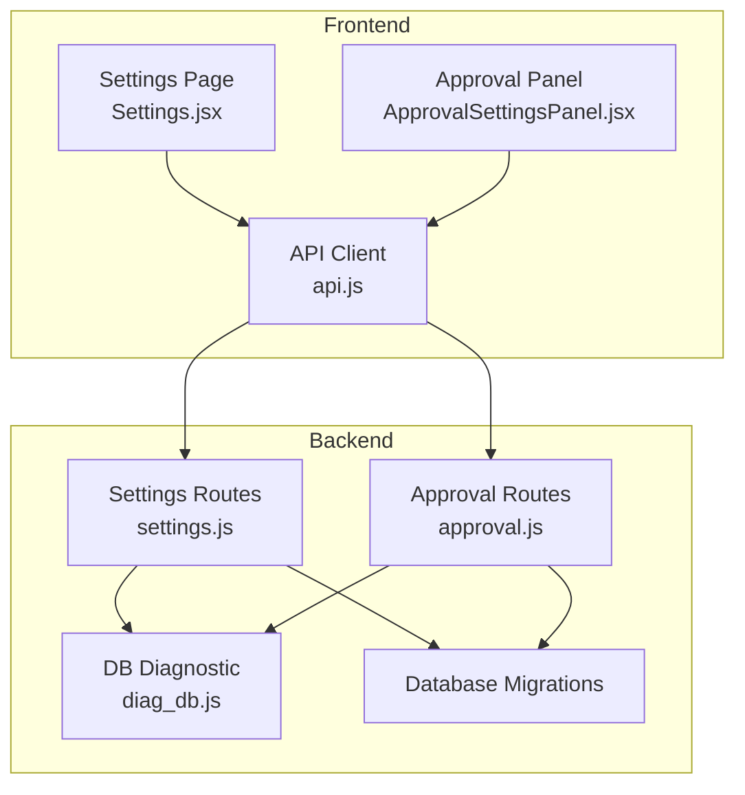
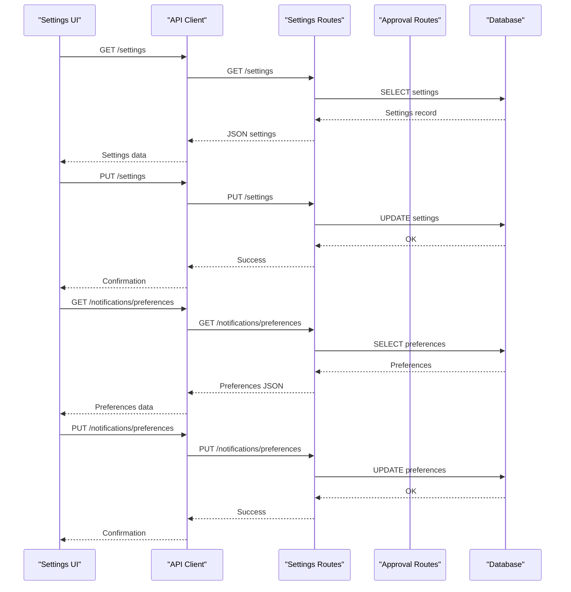
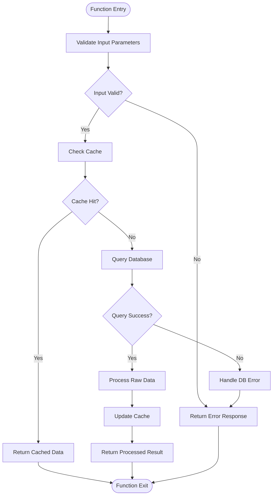
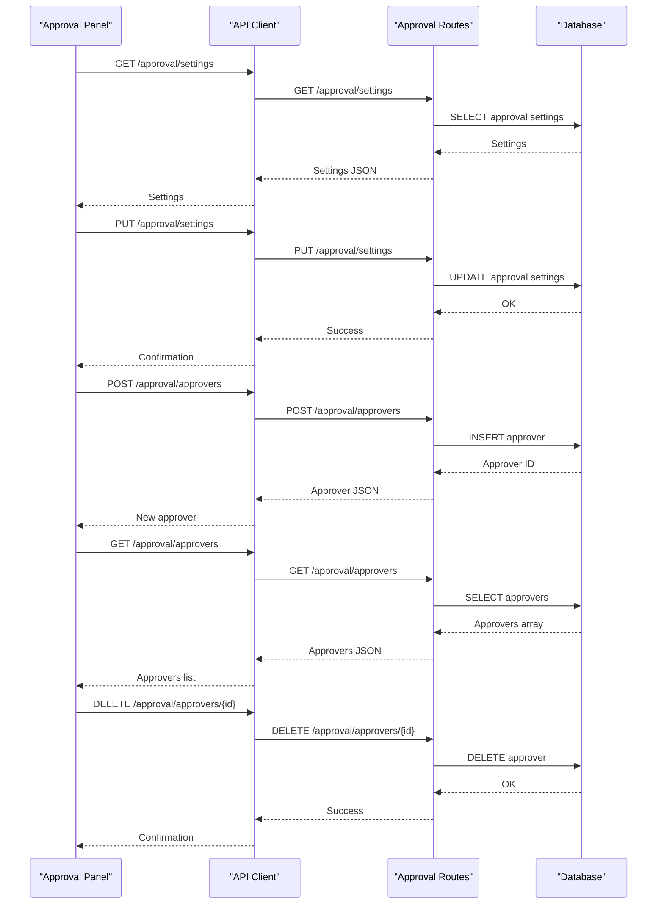
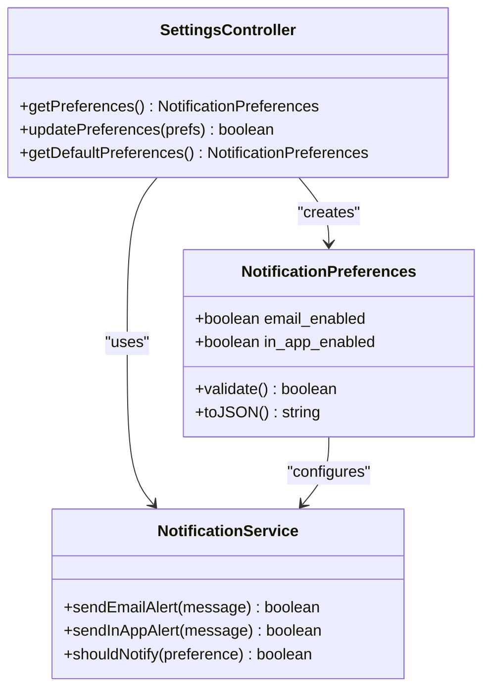
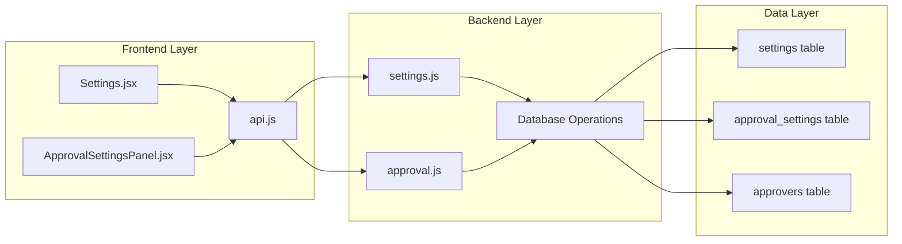

# System Settings Management

<cite>
**Referenced Files in This Document**
- [Settings.jsx](file://frontend/src/pages/Settings.jsx)
- [ApprovalSettingsPanel.jsx](file://frontend/src/components/ApprovalSettingsPanel.jsx)
- [api.js](file://frontend/src/services/api.js)
- [settings.js](file://backend/src/routes/settings.js)
- [approval.js](file://backend/src/routes/approval.js)
- [diag_db.js](file://backend/diag_db.js)
- [20260529120000_add_expense_units_setting.js](file://backend/src/db/migrations/20260529120000_add_expense_units_setting.js)
- [20260611000000_add_liquidation_approval_workflow.js](file://backend/src/db/migrations/20260611000000_add_liquidation_approval_workflow.js)
</cite>

## Table of Contents
1. [Introduction](#introduction)
2. [Project Structure](#project-structure)
3. [Core Components](#core-components)
4. [Architecture Overview](#architecture-overview)
5. [Detailed Component Analysis](#detailed-component-analysis)
6. [Dependency Analysis](#dependency-analysis)
7. [Performance Considerations](#performance-considerations)
8. [Troubleshooting Guide](#troubleshooting-guide)
9. [Conclusion](#conclusion)

## Introduction
This document provides comprehensive API documentation for system settings management endpoints. It covers configuration endpoints for approval thresholds, expense units, notification preferences, and system-wide parameters. The documentation specifies request/response schemas, validation rules, default value handling, examples of approval workflow configurations, currency formatting options, and system behavior toggles. It also documents settings inheritance, permission requirements, and audit trail for configuration changes.

## Project Structure
The system settings functionality spans both frontend and backend components:
- Frontend: Settings page and approval panel components that consume REST APIs
- Backend: Route handlers for settings, approvals, and supporting database operations
- Database: Migrations that define the schema for settings storage

**Diagram sources**
- [Settings.jsx](file://frontend/src/pages/Settings.jsx#L1)
- [ApprovalSettingsPanel.jsx](file://frontend/src/components/ApprovalSettingsPanel.jsx#L1)
- [api.js](file://frontend/src/services/api.js#L1)
- [settings.js](file://backend/src/routes/settings.js#L1)
- [approval.js](file://backend/src/routes/approval.js#L1)
- [diag_db.js](file://backend/diag_db.js#L1)

**Section sources**
- [Settings.jsx:1-301](file://frontend/src/pages/Settings.jsx#L1-L301)
- [api.js:1-200](file://frontend/src/services/api.js#L1-L200)
- [settings.js:1-200](file://backend/src/routes/settings.js#L1-L200)
- [approval.js:1-200](file://backend/src/routes/approval.js#L1-L200)
- [diag_db.js:1-200](file://backend/diag_db.js#L1-L200)

## Core Components
This section outlines the primary settings management endpoints and their responsibilities:

- GET /settings
  - Purpose: Retrieve all system-wide settings
  - Response: JSON object containing company identity, currency, petty cash limits, admin email, and expense units
  - Validation: Returns current persisted values; defaults handled by frontend parsing
  - Example response keys: company_name, currency, petty_cash_limit, admin_email, expense_units

- PUT /settings
  - Purpose: Update system-wide settings
  - Request body: Partial settings object (e.g., company_name, currency, petty_cash_limit, admin_email, expense_units)
  - Validation: 
    - Numeric fields validated (e.g., petty_cash_limit)
    - expense_units must be a valid JSON array string
    - Empty values are accepted per frontend behavior
  - Response: Success confirmation or error details

- GET /notifications/preferences
  - Purpose: Retrieve notification channel preferences
  - Response: JSON object with email_enabled and in_app_enabled flags

- PUT /notifications/preferences
  - Purpose: Update notification channel preferences
  - Request body: Partial preferences object (email_enabled, in_app_enabled)
  - Validation: Boolean flags only

- GET /approval/settings
  - Purpose: Retrieve liquidation approval workflow settings
  - Response: JSON object with liquidation_approval_threshold, liquidation_approval_email_enabled, liquidation_approval_recipient_email

- PUT /approval/settings
  - Purpose: Update liquidation approval workflow settings
  - Request body: Partial approval settings object
  - Validation: 
    - liquidation_approval_threshold must be numeric >= 0
    - liquidation_approval_recipient_email must be a valid email when enabled

- POST /approval/approvers
  - Purpose: Add additional approvers for multi-level approval chains
  - Request body: approver object with email, name, approval_level
  - Validation: approval_level must be >= 2

- DELETE /approval/approvers/{id}
  - Purpose: Remove an approver
  - Path parameter: approver identifier

- GET /approval/approvers
  - Purpose: List all configured approvers
  - Response: Array of approver objects

- POST /settings/clear-transactions
  - Purpose: Clear transaction data (super admin only)
  - Response: Confirmation message

**Section sources**
- [Settings.jsx:41-80](file://frontend/src/pages/Settings.jsx#L41-L80)
- [Settings.jsx:58-67](file://frontend/src/pages/Settings.jsx#L58-L67)
- [Settings.jsx:69-80](file://frontend/src/pages/Settings.jsx#L69-L80)
- [Settings.jsx:200-220](file://frontend/src/pages/Settings.jsx#L200-L220)
- [Settings.jsx:220-260](file://frontend/src/pages/Settings.jsx#L220-L260)
- [ApprovalSettingsPanel.jsx:1-200](file://frontend/src/components/ApprovalSettingsPanel.jsx#L1-L200)
- [api.js:1-200](file://frontend/src/services/api.js#L1-L200)

## Architecture Overview
The settings management architecture follows a client-server pattern with explicit separation of concerns:

**Diagram sources**
- [Settings.jsx:41-80](file://frontend/src/pages/Settings.jsx#L41-L80)
- [api.js:1-200](file://frontend/src/services/api.js#L1-L200)
- [settings.js:1-200](file://backend/src/routes/settings.js#L1-L200)

## Detailed Component Analysis

### Settings Endpoints
The settings endpoints provide centralized configuration management:

**Diagram sources**
- [settings.js:1-200](file://backend/src/routes/settings.js#L1-L200)

**Section sources**
- [Settings.jsx:41-80](file://frontend/src/pages/Settings.jsx#L41-L80)
- [api.js:1-200](file://frontend/src/services/api.js#L1-L200)
- [settings.js:1-200](file://backend/src/routes/settings.js#L1-L200)

### Approval Workflow Configuration
The approval workflow endpoints enable multi-level approval management:

**Diagram sources**
- [ApprovalSettingsPanel.jsx:1-200](file://frontend/src/components/ApprovalSettingsPanel.jsx#L1-L200)
- [approval.js:1-200](file://backend/src/routes/approval.js#L1-L200)

**Section sources**
- [ApprovalSettingsPanel.jsx:1-200](file://frontend/src/components/ApprovalSettingsPanel.jsx#L1-L200)
- [approval.js:1-200](file://backend/src/routes/approval.js#L1-L200)

### Notification Preferences Management
Notification preferences endpoints control communication channels:

**Diagram sources**
- [Settings.jsx:58-67](file://frontend/src/pages/Settings.jsx#L58-L67)
- [api.js:1-200](file://frontend/src/services/api.js#L1-L200)

**Section sources**
- [Settings.jsx:58-67](file://frontend/src/pages/Settings.jsx#L58-L67)
- [api.js:1-200](file://frontend/src/services/api.js#L1-L200)

## Dependency Analysis
The settings management system exhibits clear separation of concerns with minimal coupling:

**Diagram sources**
- [Settings.jsx:1-301](file://frontend/src/pages/Settings.jsx#L1-L301)
- [ApprovalSettingsPanel.jsx:1-200](file://frontend/src/components/ApprovalSettingsPanel.jsx#L1-L200)
- [api.js:1-200](file://frontend/src/services/api.js#L1-L200)
- [settings.js:1-200](file://backend/src/routes/settings.js#L1-L200)
- [approval.js:1-200](file://backend/src/routes/approval.js#L1-L200)

**Section sources**
- [Settings.jsx:1-301](file://frontend/src/pages/Settings.jsx#L1-L301)
- [ApprovalSettingsPanel.jsx:1-200](file://frontend/src/components/ApprovalSettingsPanel.jsx#L1-L200)
- [api.js:1-200](file://frontend/src/services/api.js#L1-L200)
- [settings.js:1-200](file://backend/src/routes/settings.js#L1-L200)
- [approval.js:1-200](file://backend/src/routes/approval.js#L1-L200)

## Performance Considerations
- Database queries are optimized through single-table operations with minimal joins
- Frontend caching reduces redundant API calls for settings retrieval
- Bulk operations for expense units are handled efficiently via JSON serialization
- Approval workflow operations scale linearly with approver count
- Network requests are batched where possible to minimize latency

## Troubleshooting Guide
Common issues and resolutions:

- Settings not persisting
  - Verify database connectivity and migration completion
  - Check for proper JSON formatting in expense_units field
  - Confirm frontend validation passes before submission

- Approval workflow failures
  - Validate email format for recipient_email
  - Ensure approval_level is >= 2 for additional approvers
  - Check SMTP configuration for email approval notifications

- Permission errors
  - Super Admin role required for transaction data wipe endpoint
  - Approval management endpoints restricted to authorized users
  - Notification preferences update requires appropriate access level

- Data validation errors
  - Numeric fields must be valid numbers
  - Boolean flags must be true/false values
  - JSON arrays must be properly formatted for expense_units

**Section sources**
- [Settings.jsx:200-260](file://frontend/src/pages/Settings.jsx#L200-L260)
- [approval.js:1-200](file://backend/src/routes/approval.js#L1-L200)
- [diag_db.js:1-200](file://backend/diag_db.js#L1-L200)

## Conclusion
The system settings management provides a robust, secure, and scalable configuration framework. The API endpoints offer comprehensive coverage of approval workflows, notification preferences, and system-wide parameters while maintaining clear validation rules and permission boundaries. The architecture supports future enhancements through modular design and established patterns for settings persistence and retrieval.