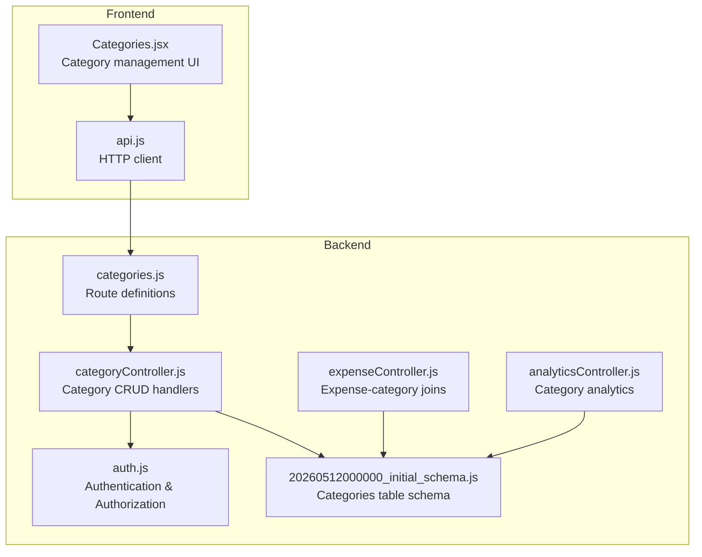
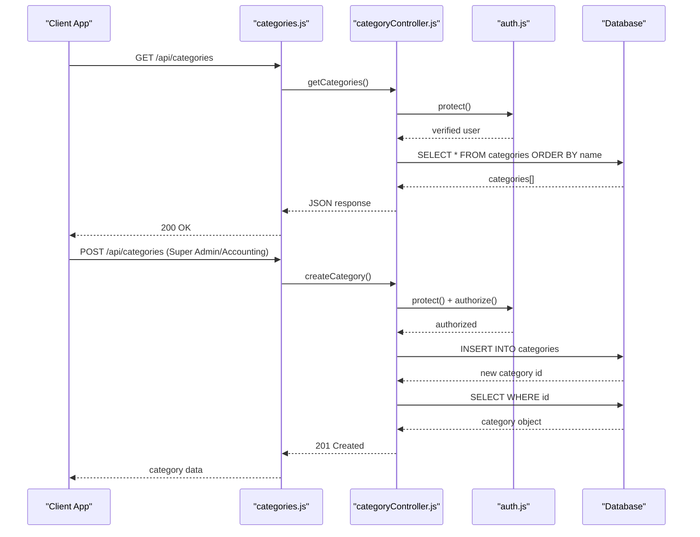
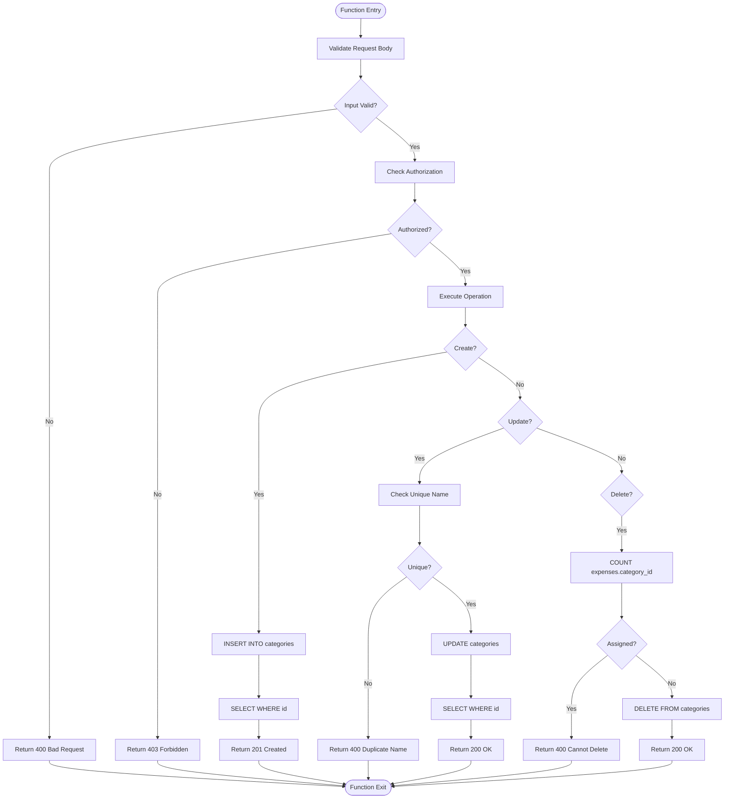
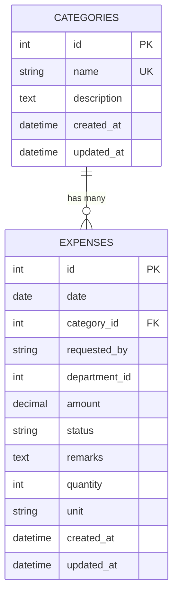
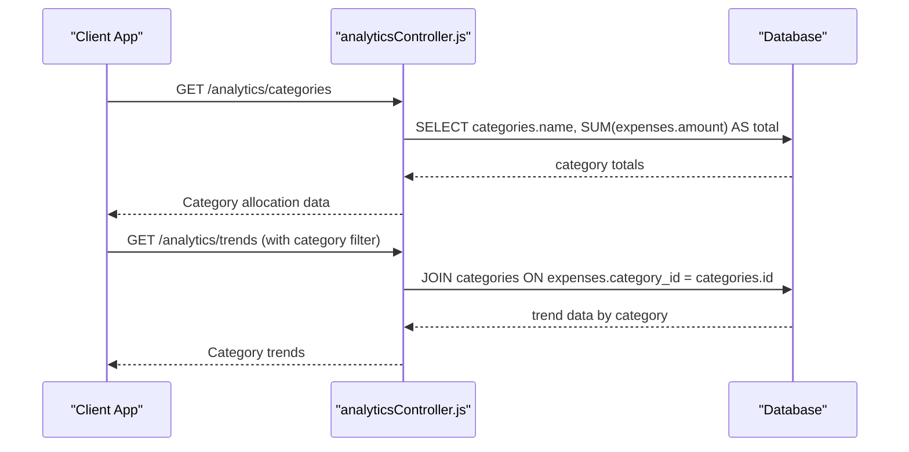
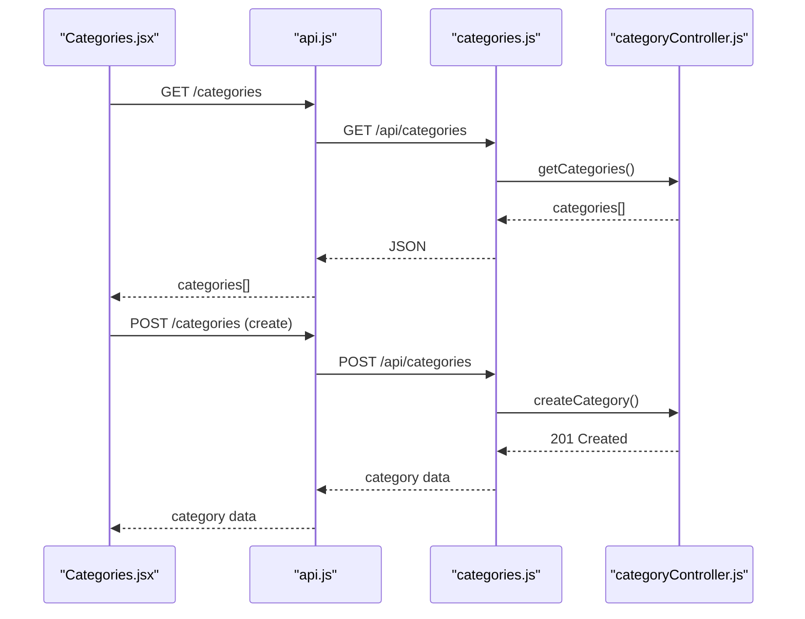
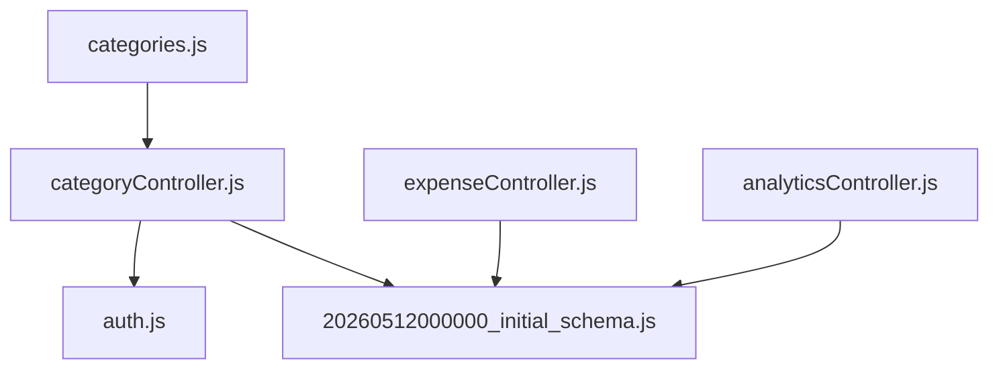

# Category Management Endpoints

<cite>
**Referenced Files in This Document**
- [categoryController.js](file://backend/src/controllers/categoryController.js)
- [categories.js](file://backend/src/routes/categories.js)
- [auth.js](file://backend/src/middleware/auth.js)
- [20260512000000_initial_schema.js](file://backend/src/db/migrations/20260512000000_initial_schema.js)
- [expenseController.js](file://backend/src/controllers/expenseController.js)
- [analyticsController.js](file://backend/src/controllers/analyticsController.js)
- [Categories.jsx](file://frontend/src/pages/Categories.jsx)
- [api.js](file://frontend/src/services/api.js)
</cite>

## Table of Contents
1. [Introduction](#introduction)
2. [Project Structure](#project-structure)
3. [Core Components](#core-components)
4. [Architecture Overview](#architecture-overview)
5. [Detailed Component Analysis](#detailed-component-analysis)
6. [Dependency Analysis](#dependency-analysis)
7. [Performance Considerations](#performance-considerations)
8. [Troubleshooting Guide](#troubleshooting-guide)
9. [Conclusion](#conclusion)

## Introduction
This document provides comprehensive API documentation for category management endpoints in the Petty Cash system. It covers CRUD operations for categories, category hierarchies, and the relationship between categories and expenses. The documentation includes request schemas, validation rules, category tree structures, and explains how categories organize expenses and affect reporting. Examples demonstrate category structures and their impact on expense categorization.

## Project Structure
The category management functionality spans backend controllers, routing, middleware, database schema, and frontend components:

- Backend:
  - Controllers handle category CRUD operations and integrate with expense queries
  - Routes define endpoint access policies and authorization
  - Middleware enforces authentication and role-based authorization
  - Database schema defines the categories table structure
- Frontend:
  - Category page displays categories and enables CRUD actions
  - API service abstracts HTTP requests to category endpoints

**Diagram sources**
- [categoryController.js:1-73](file://backend/src/controllers/categoryController.js#L1-L73)
- [categories.js:1-12](file://backend/src/routes/categories.js#L1-L12)
- [auth.js:1-36](file://backend/src/middleware/auth.js#L1-L36)
- [20260512000000_initial_schema.js:19-25](file://backend/src/db/migrations/20260512000000_initial_schema.js#L19-L25)
- [expenseController.js:25-26](file://backend/src/controllers/expenseController.js#L25-L26)
- [analyticsController.js:21-22](file://backend/src/controllers/analyticsController.js#L21-L22)
- [Categories.jsx](file://frontend/src/pages/Categories.jsx)
- [api.js](file://frontend/src/services/api.js)

**Section sources**
- [categoryController.js:1-73](file://backend/src/controllers/categoryController.js#L1-L73)
- [categories.js:1-12](file://backend/src/routes/categories.js#L1-L12)
- [auth.js:1-36](file://backend/src/middleware/auth.js#L1-L36)
- [20260512000000_initial_schema.js:19-25](file://backend/src/db/migrations/20260512000000_initial_schema.js#L19-L25)
- [expenseController.js:25-26](file://backend/src/controllers/expenseController.js#L25-L26)
- [analyticsController.js:21-22](file://backend/src/controllers/analyticsController.js#L21-L22)
- [Categories.jsx](file://frontend/src/pages/Categories.jsx)
- [api.js](file://frontend/src/services/api.js)

## Core Components
This section documents the category management endpoints, their request/response schemas, validation rules, and authorization requirements.

### Endpoint Catalog
- GET /api/categories
  - Purpose: Retrieve all categories ordered by name
  - Authentication: Required
  - Authorization: Any authenticated user
  - Response: Array of category objects
- POST /api/categories
  - Purpose: Create a new category
  - Authentication: Required
  - Authorization: Super Admin or Accounting
  - Request body: Category creation payload
  - Response: Created category object
- PUT /api/categories/:id
  - Purpose: Update an existing category
  - Authentication: Required
  - Authorization: Super Admin or Accounting
  - Path params: id (category identifier)
  - Request body: Category update payload
  - Response: Updated category object
- DELETE /api/categories/:id
  - Purpose: Delete a category
  - Authentication: Required
  - Authorization: Super Admin or Accounting
  - Path params: id (category identifier)
  - Response: Deletion confirmation message

### Request Schemas
- Category Creation Payload
  - name: string (required)
  - description: string (optional)
- Category Update Payload
  - name: string (optional)
  - description: string (optional)

Validation Rules
- Name uniqueness: When updating, if the name is changed, it must be unique across categories
- Category existence: Update and delete operations require the category to exist
- Category assignment: Deletion fails if the category is assigned to any expense record

Authorization Roles
- POST, PUT, DELETE: Super Admin or Accounting
- GET: Any authenticated user

Response Formats
- Success responses include a success flag and either data or a message
- Error responses include a success flag and an error message

**Section sources**
- [categories.js:6-9](file://backend/src/routes/categories.js#L6-L9)
- [categoryController.js:3-7](file://backend/src/controllers/categoryController.js#L3-L7)
- [categoryController.js:12-21](file://backend/src/controllers/categoryController.js#L12-L21)
- [categoryController.js:23-47](file://backend/src/controllers/categoryController.js#L23-L47)
- [categoryController.js:49-71](file://backend/src/controllers/categoryController.js#L49-L71)
- [auth.js:23-33](file://backend/src/middleware/auth.js#L23-L33)

## Architecture Overview
The category management architecture integrates frontend UI, backend routes, controllers, middleware, and database schema. The expense controller and analytics controller join with categories to support reporting and filtering.

**Diagram sources**
- [categories.js:6-9](file://backend/src/routes/categories.js#L6-L9)
- [categoryController.js:3-7](file://backend/src/controllers/categoryController.js#L3-L7)
- [categoryController.js:12-21](file://backend/src/controllers/categoryController.js#L12-L21)
- [auth.js:3-21](file://backend/src/middleware/auth.js#L3-L21)
- [auth.js:23-33](file://backend/src/middleware/auth.js#L23-L33)

## Detailed Component Analysis

### Category CRUD Operations
The category controller implements four primary operations with robust validation and error handling.

**Diagram sources**
- [categoryController.js:12-21](file://backend/src/controllers/categoryController.js#L12-L21)
- [categoryController.js:23-47](file://backend/src/controllers/categoryController.js#L23-L47)
- [categoryController.js:49-71](file://backend/src/controllers/categoryController.js#L49-L71)

**Section sources**
- [categoryController.js:3-7](file://backend/src/controllers/categoryController.js#L3-L7)
- [categoryController.js:12-21](file://backend/src/controllers/categoryController.js#L12-L21)
- [categoryController.js:23-47](file://backend/src/controllers/categoryController.js#L23-L47)
- [categoryController.js:49-71](file://backend/src/controllers/categoryController.js#L49-L71)

### Category-Expense Associations
Categories are linked to expenses through a foreign key relationship. The expense controller joins categories during expense queries, enabling filtering and reporting by category.

**Diagram sources**
- [20260512000000_initial_schema.js:19-25](file://backend/src/db/migrations/20260512000000_initial_schema.js#L19-L25)
- [expenseController.js:25-26](file://backend/src/controllers/expenseController.js#L25-L26)
- [expenseController.js:80-81](file://backend/src/controllers/expenseController.js#L80-L81)

**Section sources**
- [20260512000000_initial_schema.js:19-25](file://backend/src/db/migrations/20260512000000_initial_schema.js#L19-L25)
- [expenseController.js:25-26](file://backend/src/controllers/expenseController.js#L25-L26)
- [expenseController.js:80-81](file://backend/src/controllers/expenseController.js#L80-L81)

### Reporting and Analytics Integration
The analytics controller joins categories with expenses to generate category-based reports and visualizations.

**Diagram sources**
- [analyticsController.js:21-22](file://backend/src/controllers/analyticsController.js#L21-L22)
- [analyticsController.js:77-78](file://backend/src/controllers/analyticsController.js#L77-L78)
- [analyticsController.js:107-108](file://backend/src/controllers/analyticsController.js#L107-L108)

**Section sources**
- [analyticsController.js:21-22](file://backend/src/controllers/analyticsController.js#L21-L22)
- [analyticsController.js:77-78](file://backend/src/controllers/analyticsController.js#L77-L78)
- [analyticsController.js:107-108](file://backend/src/controllers/analyticsController.js#L107-L108)

### Frontend Integration
The frontend Categories page manages category CRUD operations and displays category lists for expense association.

**Diagram sources**
- [Categories.jsx](file://frontend/src/pages/Categories.jsx)
- [api.js](file://frontend/src/services/api.js)
- [categories.js:6-9](file://backend/src/routes/categories.js#L6-L9)
- [categoryController.js:12-21](file://backend/src/controllers/categoryController.js#L12-L21)

**Section sources**
- [Categories.jsx](file://frontend/src/pages/Categories.jsx)
- [api.js](file://frontend/src/services/api.js)
- [categories.js:6-9](file://backend/src/routes/categories.js#L6-L9)
- [categoryController.js:12-21](file://backend/src/controllers/categoryController.js#L12-L21)

## Dependency Analysis
Category management depends on several backend components and follows a layered architecture.

**Diagram sources**
- [categoryController.js:1-73](file://backend/src/controllers/categoryController.js#L1-L73)
- [categories.js:1-12](file://backend/src/routes/categories.js#L1-L12)
- [auth.js:1-36](file://backend/src/middleware/auth.js#L1-L36)
- [20260512000000_initial_schema.js:19-25](file://backend/src/db/migrations/20260512000000_initial_schema.js#L19-L25)
- [expenseController.js:25-26](file://backend/src/controllers/expenseController.js#L25-L26)
- [analyticsController.js:21-22](file://backend/src/controllers/analyticsController.js#L21-L22)

**Section sources**
- [categoryController.js:1-73](file://backend/src/controllers/categoryController.js#L1-L73)
- [categories.js:1-12](file://backend/src/routes/categories.js#L1-L12)
- [auth.js:1-36](file://backend/src/middleware/auth.js#L1-L36)
- [20260512000000_initial_schema.js:19-25](file://backend/src/db/migrations/20260512000000_initial_schema.js#L19-L25)
- [expenseController.js:25-26](file://backend/src/controllers/expenseController.js#L25-L26)
- [analyticsController.js:21-22](file://backend/src/controllers/analyticsController.js#L21-L22)

## Performance Considerations
- Category retrieval uses a simple SELECT with ORDER BY name, suitable for small to medium datasets
- Name uniqueness checks involve a single SELECT query per update operation
- Deletion validation counts related expenses to prevent orphaning; consider indexing category_id in expenses for large datasets
- Frontend caching of categories reduces repeated network requests

## Troubleshooting Guide
Common Issues and Resolutions
- 401 Not authorized: Verify JWT token presence and validity
- 403 Forbidden: Confirm user role includes Super Admin or Accounting
- 400 Duplicate name: Ensure category name is unique when updating
- 400 Cannot delete: Remove or reassign all expenses associated with the category before deletion
- 404 Category not found: Verify category id exists in the database

**Section sources**
- [auth.js:3-21](file://backend/src/middleware/auth.js#L3-L21)
- [categoryController.js:28-38](file://backend/src/controllers/categoryController.js#L28-L38)
- [categoryController.js:57-64](file://backend/src/controllers/categoryController.js#L57-L64)

## Conclusion
The category management endpoints provide a robust foundation for organizing expenses and generating meaningful reports. The implementation enforces data integrity through validation and authorization, while the frontend offers an intuitive interface for managing categories. Proper use of categories ensures accurate expense categorization and reliable reporting across the system.