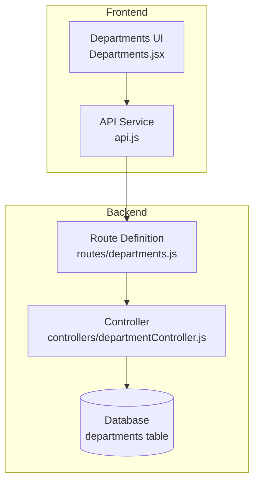
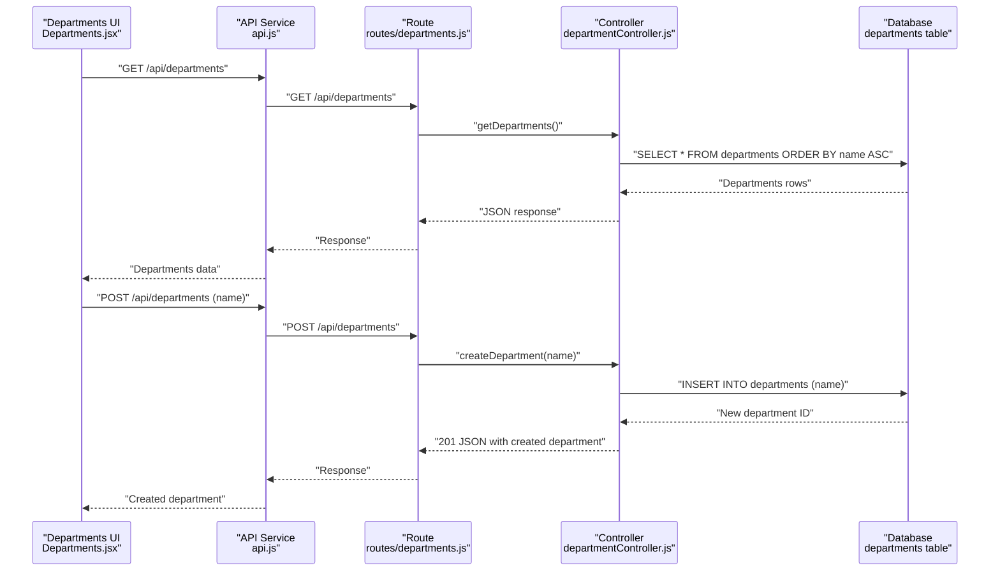
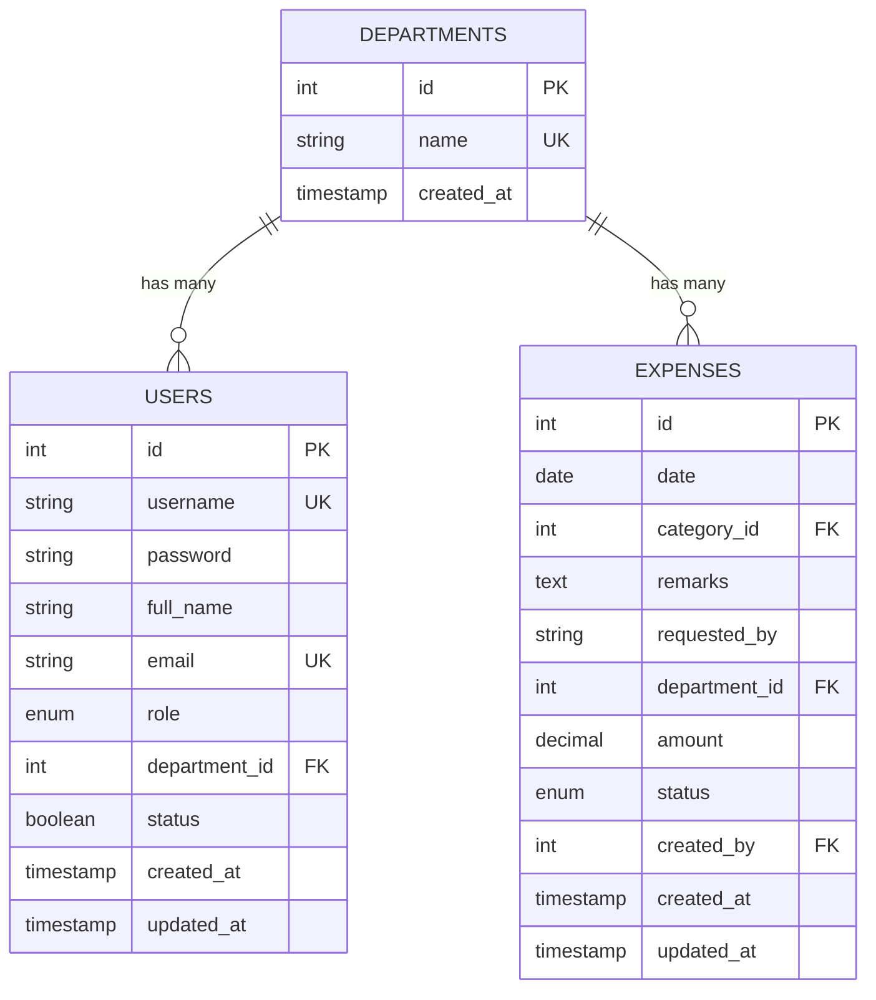
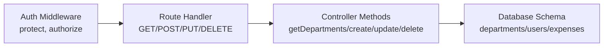

# Department Management Endpoints

<cite>
**Referenced Files in This Document**
- [departmentController.js](file://backend/src/controllers/departmentController.js)
- [departments.js](file://backend/src/routes/departments.js)
- [20260512000000_initial_schema.js](file://backend/src/db/migrations/20260512000000_initial_schema.js)
- [Departments.jsx](file://frontend/src/pages/Departments.jsx)
- [api.js](file://frontend/src/services/api.js)
</cite>

## Table of Contents
1. [Introduction](#introduction)
2. [Project Structure](#project-structure)
3. [Core Components](#core-components)
4. [Architecture Overview](#architecture-overview)
5. [Detailed Component Analysis](#detailed-component-analysis)
6. [Dependency Analysis](#dependency-analysis)
7. [Performance Considerations](#performance-considerations)
8. [Troubleshooting Guide](#troubleshooting-guide)
9. [Conclusion](#conclusion)

## Introduction
This document provides comprehensive API documentation for department management endpoints. It covers department CRUD operations, the underlying data model, validation rules, and how departments relate to users and expenses. It also explains permission inheritance via department associations and provides examples of department hierarchies and user-department assignments.

## Project Structure
The department management feature spans backend controllers, routing, database schema, and frontend UI components:
- Backend route handlers define the REST endpoints and apply authentication/authorization middleware.
- Controllers implement business logic for CRUD operations and validations.
- Database schema defines the departments table and foreign key relationships with users and expenses.
- Frontend UI demonstrates client-side usage of the endpoints.

**Diagram sources**
- [departments.js:1-12](file://backend/src/routes/departments.js#L1-L12)
- [departmentController.js:1-88](file://backend/src/controllers/departmentController.js#L1-L88)
- [20260512000000_initial_schema.js:1-159](file://backend/src/db/migrations/20260512000000_initial_schema.js#L1-L159)
- [Departments.jsx:1-132](file://frontend/src/pages/Departments.jsx#L1-L132)
- [api.js:1-29](file://frontend/src/services/api.js#L1-L29)

**Section sources**
- [departments.js:1-12](file://backend/src/routes/departments.js#L1-L12)
- [departmentController.js:1-88](file://backend/src/controllers/departmentController.js#L1-L88)
- [20260512000000_initial_schema.js:1-159](file://backend/src/db/migrations/20260512000000_initial_schema.js#L1-L159)
- [Departments.jsx:1-132](file://frontend/src/pages/Departments.jsx#L1-L132)
- [api.js:1-29](file://frontend/src/services/api.js#L1-L29)

## Core Components
- Department endpoint definitions:
  - GET /api/departments: List all departments (sorted by name).
  - POST /api/departments: Create a new department (requires Super Admin or Accounting).
  - PUT /api/departments/:id: Update a department (requires Super Admin or Accounting).
  - DELETE /api/departments/:id: Delete a department (requires Super Admin or Accounting).

- Validation and constraints:
  - Department name uniqueness enforced at the database level.
  - Department deletion prevents removal if users or expenses reference the department.

- Authorization:
  - All endpoints are protected by authentication middleware.
  - Creation, update, and deletion require roles Super Admin or Accounting.

**Section sources**
- [departments.js:6-9](file://backend/src/routes/departments.js#L6-L9)
- [departmentController.js:3-10](file://backend/src/controllers/departmentController.js#L3-L10)
- [departmentController.js:12-30](file://backend/src/controllers/departmentController.js#L12-L30)
- [departmentController.js:32-55](file://backend/src/controllers/departmentController.js#L32-L55)
- [departmentController.js:57-87](file://backend/src/controllers/departmentController.js#L57-L87)
- [20260512000000_initial_schema.js:4-8](file://backend/src/db/migrations/20260512000000_initial_schema.js#L4-L8)
- [20260512000000_initial_schema.js:47-47](file://backend/src/db/migrations/20260512000000_initial_schema.js#L47-L47)

## Architecture Overview
The department management flow integrates frontend UI, backend routes, controller logic, and database constraints.

**Diagram sources**
- [Departments.jsx:17-27](file://frontend/src/pages/Departments.jsx#L17-L27)
- [api.js:1-29](file://frontend/src/services/api.js#L1-L29)
- [departments.js:6-9](file://backend/src/routes/departments.js#L6-L9)
- [departmentController.js:3-10](file://backend/src/controllers/departmentController.js#L3-L10)
- [departmentController.js:12-30](file://backend/src/controllers/departmentController.js#L12-L30)
- [20260512000000_initial_schema.js:4-8](file://backend/src/db/migrations/20260512000000_initial_schema.js#L4-L8)

## Detailed Component Analysis

### Endpoint Definitions and Behaviors
- GET /api/departments
  - Purpose: Retrieve all departments sorted alphabetically by name.
  - Authentication: Required.
  - Response: Array of department objects.
  - Error handling: Returns 500 on internal errors.

- POST /api/departments
  - Purpose: Create a new department.
  - Authentication: Required.
  - Authorization: Super Admin or Accounting.
  - Request body: { name: string }.
  - Validation:
    - Name is required and trimmed.
    - Name must be unique (database constraint).
  - Response: Created department object with 201 status.
  - Error handling: Returns 400 if name missing or duplicate; 500 on internal errors.

- PUT /api/departments/:id
  - Purpose: Update an existing department.
  - Authentication: Required.
  - Authorization: Super Admin or Accounting.
  - Path params: id (integer).
  - Request body: { name: string }.
  - Validation:
    - Department must exist.
    - New name must be unique if provided.
  - Response: Updated department object.
  - Error handling: Returns 404 if not found, 400 on duplicate or invalid input; 500 on internal errors.

- DELETE /api/departments/:id
  - Purpose: Remove a department.
  - Authentication: Required.
  - Authorization: Super Admin or Accounting.
  - Path params: id (integer).
  - Validation:
    - Department must exist.
    - Cannot delete if any user is assigned to the department.
    - Cannot delete if any expense record references the department.
  - Response: Success message.
  - Error handling: Returns 404 if not found, 400 with count details if in use; 500 on internal errors.

**Section sources**
- [departments.js:6-9](file://backend/src/routes/departments.js#L6-L9)
- [departmentController.js:3-10](file://backend/src/controllers/departmentController.js#L3-L10)
- [departmentController.js:12-30](file://backend/src/controllers/departmentController.js#L12-L30)
- [departmentController.js:32-55](file://backend/src/controllers/departmentController.js#L32-L55)
- [departmentController.js:57-87](file://backend/src/controllers/departmentController.js#L57-L87)

### Data Model and Relationships
The departments table and related foreign keys define department-user and department-expense associations.

**Diagram sources**
- [20260512000000_initial_schema.js:4-8](file://backend/src/db/migrations/20260512000000_initial_schema.js#L4-L8)
- [20260512000000_initial_schema.js:47-47](file://backend/src/db/migrations/20260512000000_initial_schema.js#L47-L47)
- [20260512000000_initial_schema.js:91-91](file://backend/src/db/migrations/20260512000000_initial_schema.js#L91-L91)

### Permission Inheritance and Role-Based Access
- Department endpoints are protected by authentication middleware.
- Creation, update, and deletion require roles Super Admin or Accounting.
- Users are associated with departments via department_id, enabling role-based access control per department.

**Section sources**
- [departments.js:4-4](file://backend/src/routes/departments.js#L4-L4)
- [departments.js:7-9](file://backend/src/routes/departments.js#L7-L9)
- [20260512000000_initial_schema.js:47-47](file://backend/src/db/migrations/20260512000000_initial_schema.js#L47-L47)

### Department Tree Traversal
- The current schema does not define a hierarchical parent-child relationship for departments.
- No recursive queries or adjacency lists are present in the departments table.
- To support hierarchical department structures, consider adding a self-referencing foreign key column (e.g., parent_id) to the departments table.

**Section sources**
- [20260512000000_initial_schema.js:4-8](file://backend/src/db/migrations/20260512000000_initial_schema.js#L4-L8)

### Examples and Usage Patterns
- Creating a department:
  - Endpoint: POST /api/departments
  - Request body: { "name": "PRODUCTION" }
  - Expected response: 201 with the created department object.

- Updating a department:
  - Endpoint: PUT /api/departments/:id
  - Request body: { "name": "MANUFACTURING" }
  - Expected response: 200 with the updated department object.

- Deleting a department:
  - Endpoint: DELETE /api/departments/:id
  - Constraints: No users and no expenses assigned to the department.
  - Expected response: 200 with a success message.

- Assigning users to departments:
  - Set users.department_id to the target department's id.
  - This enables role-based access control per department.

- Department hierarchies:
  - Not supported in the current schema.
  - To enable hierarchy, add a parent_id column referencing departments.id and implement recursive traversal queries.

**Section sources**
- [Departments.jsx:29-42](file://frontend/src/pages/Departments.jsx#L29-L42)
- [api.js:1-29](file://frontend/src/services/api.js#L1-L29)
- [20260512000000_initial_schema.js:47-47](file://backend/src/db/migrations/20260512000000_initial_schema.js#L47-L47)

## Dependency Analysis
The department endpoints depend on:
- Route layer: Express router with authentication and authorization middleware.
- Controller layer: Business logic for CRUD operations and validations.
- Database layer: departments table with unique name constraint and foreign keys to users and expenses.

**Diagram sources**
- [departments.js:4-4](file://backend/src/routes/departments.js#L4-L4)
- [departments.js:6-9](file://backend/src/routes/departments.js#L6-L9)
- [departmentController.js:3-87](file://backend/src/controllers/departmentController.js#L3-L87)
- [20260512000000_initial_schema.js:4-8](file://backend/src/db/migrations/20260512000000_initial_schema.js#L4-L8)

**Section sources**
- [departments.js:1-12](file://backend/src/routes/departments.js#L1-L12)
- [departmentController.js:1-88](file://backend/src/controllers/departmentController.js#L1-L88)
- [20260512000000_initial_schema.js:1-159](file://backend/src/db/migrations/20260512000000_initial_schema.js#L1-L159)

## Performance Considerations
- Indexing: The departments.name column is unique, which implies an index; ensure queries leverage this index for lookups and uniqueness checks.
- Sorting: GET /api/departments sorts by name; consider indexing name for efficient ordering.
- Cascading constraints: Deletions are restricted by foreign keys; batch operations should account for referential integrity checks.

[No sources needed since this section provides general guidance]

## Troubleshooting Guide
Common issues and resolutions:
- 400 Bad Request during creation:
  - Cause: Missing or duplicate department name.
  - Resolution: Ensure name is provided and unique.

- 400 Bad Request during update:
  - Cause: Attempting to change to an existing name.
  - Resolution: Use a unique name or omit the name field.

- 404 Not Found:
  - Cause: Accessing a non-existent department.
  - Resolution: Verify the department id.

- 400 Bad Request during deletion:
  - Cause: Department still has users or expenses assigned.
  - Resolution: Unassign users and remove dependent expenses before deletion.

- 500 Internal Server Error:
  - Cause: Unexpected server-side failure.
  - Resolution: Check server logs and retry after correcting the request.

**Section sources**
- [departmentController.js:14-22](file://backend/src/controllers/departmentController.js#L14-L22)
- [departmentController.js:42-47](file://backend/src/controllers/departmentController.js#L42-L47)
- [departmentController.js:66-80](file://backend/src/controllers/departmentController.js#L66-L80)

## Conclusion
Department management endpoints provide robust CRUD operations with strong validation and authorization controls. The current schema supports department-user and department-expense associations but does not include hierarchical department structures. For advanced use cases requiring hierarchies, extend the schema with a parent_id column and implement recursive traversal logic. Proper use of department associations enables effective permission inheritance and role-based access control.