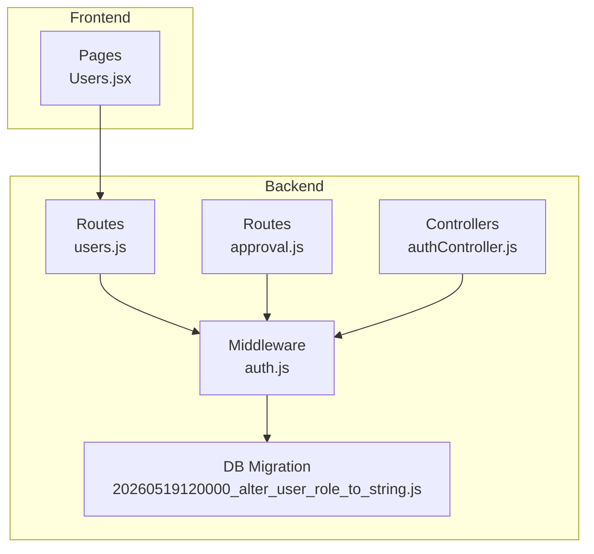
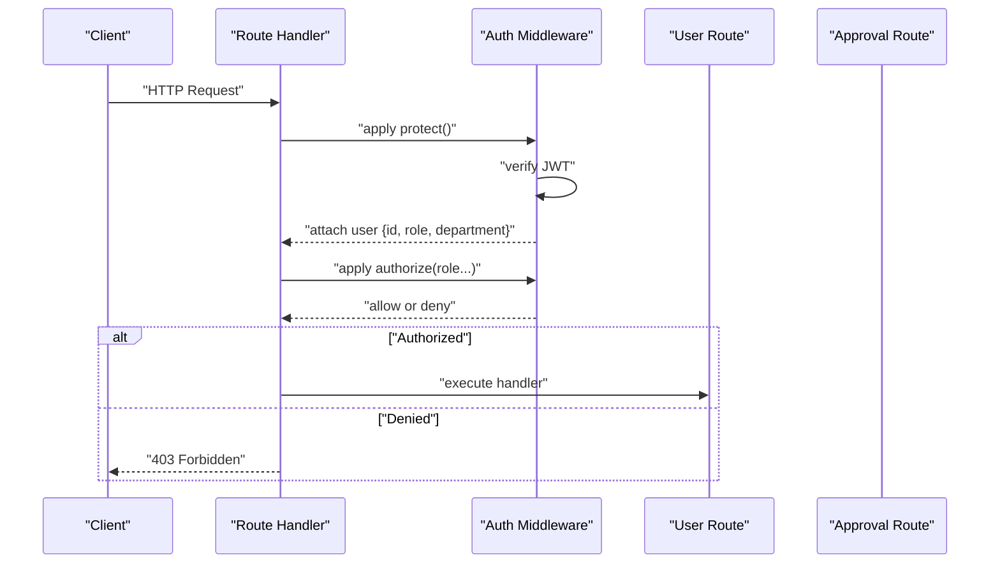
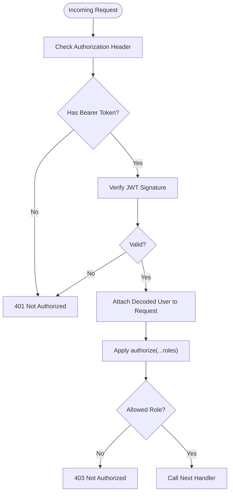
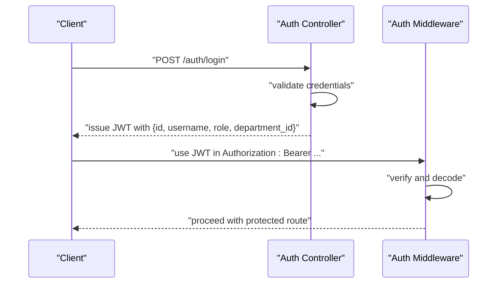
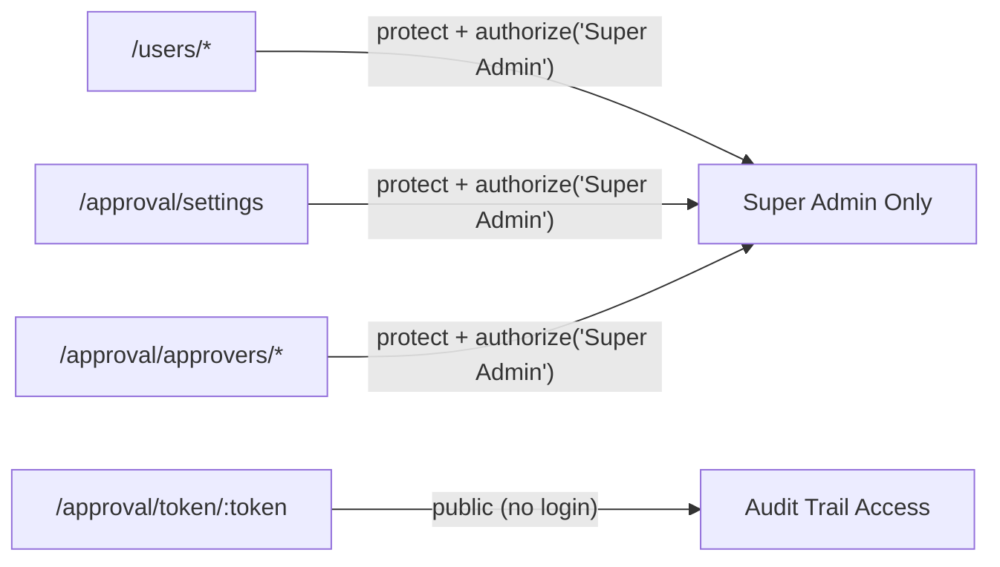
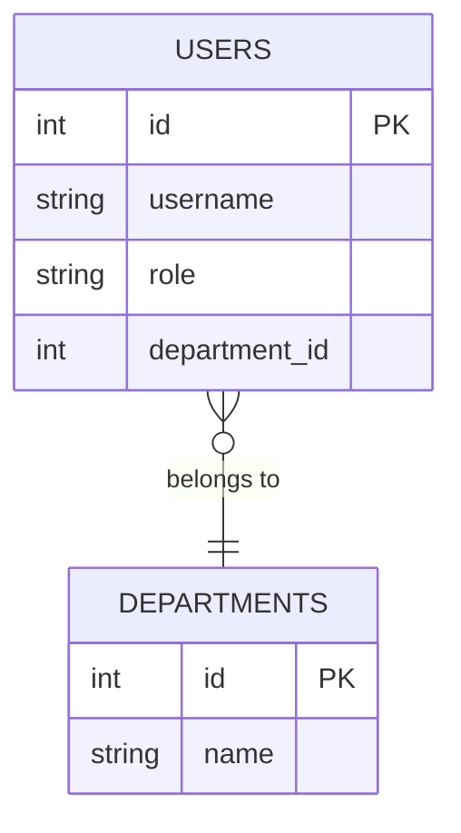
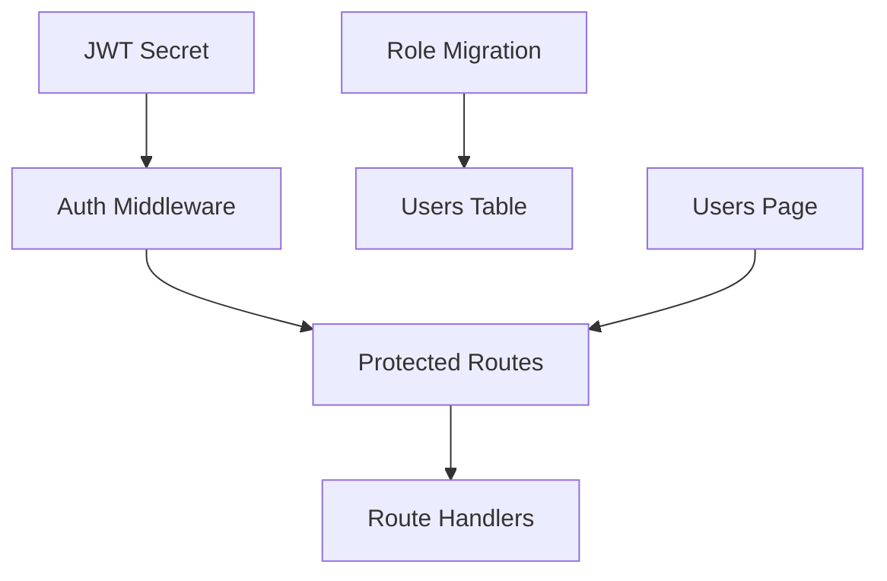

# Role & Permission System

<cite>
**Referenced Files in This Document**
- [auth.js](file://backend/src/middleware/auth.js)
- [authController.js](file://backend/src/controllers/authController.js)
- [users.js](file://backend/src/routes/users.js)
- [approval.js](file://backend/src/routes/approval.js)
- [20260519120000_alter_user_role_to_string.js](file://backend/src/db/migrations/20260519120000_alter_user_role_to_string.js)
- [Users.jsx](file://frontend/src/pages/Users.jsx)
</cite>

## Table of Contents
1. [Introduction](#introduction)
2. [Project Structure](#project-structure)
3. [Core Components](#core-components)
4. [Architecture Overview](#architecture-overview)
5. [Detailed Component Analysis](#detailed-component-analysis)
6. [Dependency Analysis](#dependency-analysis)
7. [Performance Considerations](#performance-considerations)
8. [Troubleshooting Guide](#troubleshooting-guide)
9. [Conclusion](#conclusion)

## Introduction
This document explains the role and permission system implemented in the application. It covers the role-based access control (RBAC) model, the authorization middleware, protected routes, and how roles and permissions are enforced. It also documents the Super Admin privileges, regular user limitations, and department-level associations. Examples of role assignments, permission matrices, and access control scenarios are included to help administrators and developers understand and operate the system effectively.

## Project Structure
The RBAC system spans three primary areas:
- Authentication middleware that validates JWT tokens and exposes the authorization guard
- Controllers and routes that enforce role-based authorization
- Frontend pages that present role selection and user management

**Diagram sources**
- [auth.js:1-35](file://backend/src/middleware/auth.js#L1-L35)
- [authController.js:1-65](file://backend/src/controllers/authController.js#L1-L65)
- [users.js:1-83](file://backend/src/routes/users.js#L1-L83)
- [approval.js:1-35](file://backend/src/routes/approval.js#L1-L35)
- [20260519120000_alter_user_role_to_string.js:1-13](file://backend/src/db/migrations/20260519120000_alter_user_role_to_string.js#L1-L13)
- [Users.jsx:1-91](file://frontend/src/pages/Users.jsx#L1-L91)

**Section sources**
- [auth.js:1-35](file://backend/src/middleware/auth.js#L1-L35)
- [authController.js:1-65](file://backend/src/controllers/authController.js#L1-L65)
- [users.js:1-83](file://backend/src/routes/users.js#L1-L83)
- [approval.js:1-35](file://backend/src/routes/approval.js#L1-L35)
- [20260519120000_alter_user_role_to_string.js:1-13](file://backend/src/db/migrations/20260519120000_alter_user_role_to_string.js#L1-L13)
- [Users.jsx:1-91](file://frontend/src/pages/Users.jsx#L1-L91)

## Core Components
- Authorization Middleware
  - Token verification middleware ensures requests carry a valid JWT.
  - Role-based authorization guard restricts routes to specific roles.
- Authentication Controller
  - Issues JWT tokens containing user identity, role, and department association.
- Routes and Controllers
  - Routes apply middleware to enforce protection and authorization.
  - Controllers implement business logic behind protected endpoints.
- Database Migration
  - Role column is stored as a flexible string to support dynamic roles.
- Frontend Management
  - Users page allows selecting roles during user creation and updates.

Key implementation references:
- [Authorization middleware:3-33](file://backend/src/middleware/auth.js#L3-L33)
- [JWT issuance with role payload:23-27](file://backend/src/controllers/authController.js#L23-L27)
- [Protected user management routes:7-8](file://backend/src/routes/users.js#L7-L8)
- [Approval routes with Super Admin enforcement:25-31](file://backend/src/routes/approval.js#L25-L31)
- [Role storage migration:1-13](file://backend/src/db/migrations/20260519120000_alter_user_role_to_string.js#L1-L13)
- [Role selection in UI](file://frontend/src/pages/Users.jsx#L21)

**Section sources**
- [auth.js:3-33](file://backend/src/middleware/auth.js#L3-L33)
- [authController.js:23-27](file://backend/src/controllers/authController.js#L23-L27)
- [users.js:7-8](file://backend/src/routes/users.js#L7-L8)
- [approval.js:25-31](file://backend/src/routes/approval.js#L25-L31)
- [20260519120000_alter_user_role_to_string.js:1-13](file://backend/src/db/migrations/20260519120000_alter_user_role_to_string.js#L1-L13)
- [Users.jsx](file://frontend/src/pages/Users.jsx#L21)

## Architecture Overview
The RBAC architecture enforces authorization at two layers:
- Transport-level protection via bearer token validation
- Role-level authorization via middleware guards

**Diagram sources**
- [auth.js:3-33](file://backend/src/middleware/auth.js#L3-L33)
- [users.js:7-8](file://backend/src/routes/users.js#L7-L8)
- [approval.js:25-31](file://backend/src/routes/approval.js#L25-L31)

## Detailed Component Analysis

### Authorization Middleware
The middleware provides:
- Token extraction from Authorization header
- JWT verification using a server secret
- Role-based authorization guard that checks the user's role against allowed roles

**Diagram sources**
- [auth.js:3-33](file://backend/src/middleware/auth.js#L3-L33)

**Section sources**
- [auth.js:3-33](file://backend/src/middleware/auth.js#L3-L33)

### Authentication Controller and Token Payload
On successful login, the controller generates a JWT containing:
- User identity
- Username
- Role
- Department identifier

This payload is used by the middleware to enforce role-based access.

**Diagram sources**
- [authController.js:6-27](file://backend/src/controllers/authController.js#L6-L27)
- [auth.js:14-20](file://backend/src/middleware/auth.js#L14-L20)

**Section sources**
- [authController.js:6-27](file://backend/src/controllers/authController.js#L6-L27)
- [auth.js:14-20](file://backend/src/middleware/auth.js#L14-L20)

### Protected Routes and Role Enforcement
- User management routes are protected and restricted to Super Admin.
- Approval routes are protected and further restricted to Super Admin for administrative actions.
- Token-based approval endpoints bypass login but remain audited.

**Diagram sources**
- [users.js:7-8](file://backend/src/routes/users.js#L7-L8)
- [approval.js:25-31](file://backend/src/routes/approval.js#L25-L31)

**Section sources**
- [users.js:7-8](file://backend/src/routes/users.js#L7-L8)
- [approval.js:25-31](file://backend/src/routes/approval.js#L25-L31)

### Role Model and Storage
- Roles are stored as strings to enable flexible role definitions.
- The migration alters the users table to use a string role field with a default value.
- The frontend presents predefined roles for selection during user creation/update.

**Diagram sources**
- [20260519120000_alter_user_role_to_string.js:1-13](file://backend/src/db/migrations/20260519120000_alter_user_role_to_string.js#L1-L13)
- [Users.jsx](file://frontend/src/pages/Users.jsx#L21)

**Section sources**
- [20260519120000_alter_user_role_to_string.js:1-13](file://backend/src/db/migrations/20260519120000_alter_user_role_to_string.js#L1-L13)
- [Users.jsx](file://frontend/src/pages/Users.jsx#L21)

### Role Assignments and Permission Matrices
Note: The system enforces role-based access but does not implement separate permission flags. Authorization is determined solely by the user's role.

- Super Admin
  - Full access to administrative endpoints
  - Can manage users and system settings
- Accounting
  - May have access to financial data and reporting
  - Specific endpoints depend on route definitions
- Manager
  - Likely restricted to department-scoped operations
  - Specific endpoints depend on route definitions
- Staff
  - Standard operational access
  - Specific endpoints depend on route definitions

Access matrix summary:
- Super Admin: All administrative routes
- Accounting: Financial and reporting routes (as defined by routes)
- Manager: Department-scoped routes (as defined by routes)
- Staff: Operational routes (as defined by routes)

**Section sources**
- [users.js:7-8](file://backend/src/routes/users.js#L7-L8)
- [approval.js:25-31](file://backend/src/routes/approval.js#L25-L31)
- [Users.jsx](file://frontend/src/pages/Users.jsx#L91)

### Access Control Scenarios
- Scenario 1: Super Admin creates a new user
  - Action: POST /users with Super Admin token
  - Outcome: User created with selected role
- Scenario 2: Regular Staff attempts to access /users
  - Action: POST /users with Staff token
  - Outcome: 403 Forbidden
- Scenario 3: Super Admin manages approvers
  - Action: PUT /approval/approvers/:id with Super Admin token
  - Outcome: Approver updated
- Scenario 4: Anonymous user approves an expense
  - Action: POST /approval/approve/:token (no login)
  - Outcome: Approval processed with audit trail

**Section sources**
- [users.js:7-8](file://backend/src/routes/users.js#L7-L8)
- [approval.js:25-31](file://backend/src/routes/approval.js#L25-L31)

## Dependency Analysis
The RBAC system depends on:
- JWT for secure transport-level authentication
- Middleware for enforcing authorization
- Routes for binding authorization to endpoints
- Database migration for flexible role storage
- Frontend for role selection during user management

**Diagram sources**
- [auth.js:1-35](file://backend/src/middleware/auth.js#L1-L35)
- [users.js:1-83](file://backend/src/routes/users.js#L1-L83)
- [20260519120000_alter_user_role_to_string.js:1-13](file://backend/src/db/migrations/20260519120000_alter_user_role_to_string.js#L1-L13)
- [Users.jsx:1-91](file://frontend/src/pages/Users.jsx#L1-L91)

**Section sources**
- [auth.js:1-35](file://backend/src/middleware/auth.js#L1-L35)
- [users.js:1-83](file://backend/src/routes/users.js#L1-L83)
- [20260519120000_alter_user_role_to_string.js:1-13](file://backend/src/db/migrations/20260519120000_alter_user_role_to_string.js#L1-L13)
- [Users.jsx:1-91](file://frontend/src/pages/Users.jsx#L1-L91)

## Performance Considerations
- Keep JWT payload minimal to reduce overhead
- Use selective role checks to avoid unnecessary computations
- Cache frequently accessed role definitions at the route level if needed
- Monitor authorization failures to detect misconfigurations early

## Troubleshooting Guide
Common issues and resolutions:
- 401 Not Authorized (token missing or invalid)
  - Ensure Authorization header includes a valid Bearer token
  - Verify JWT secret matches server configuration
- 403 Forbidden (role not authorized)
  - Confirm the user's role matches the required role(s)
  - Check route authorization guards applied to the endpoint
- User creation/update denied
  - Only Super Admin can access user management routes
  - Verify the requesting user has the Super Admin role

**Section sources**
- [auth.js:10-20](file://backend/src/middleware/auth.js#L10-L20)
- [users.js:7-8](file://backend/src/routes/users.js#L7-L8)

## Conclusion
The application implements a straightforward RBAC system centered on JWT-based authentication and middleware-driven role enforcement. Super Admin has broad administrative authority, while other roles are constrained by route-level authorization. The flexible string-based role storage supports future expansion. Administrators should ensure proper role assignment and guard route exposure to maintain security and clarity.