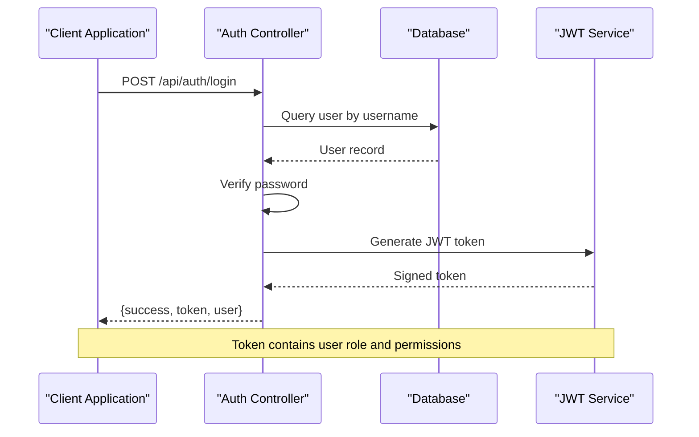
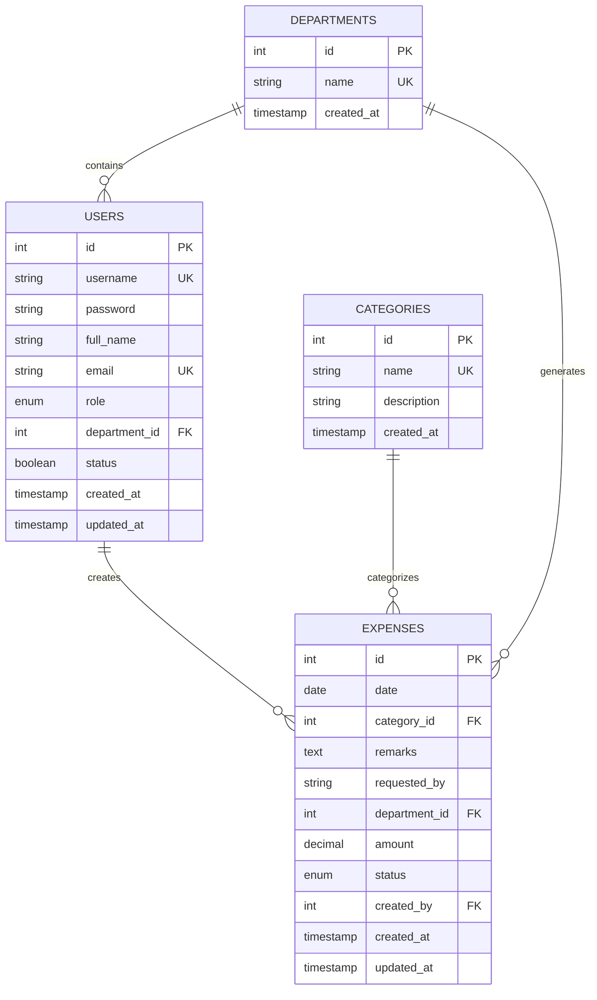

# User Administration API

<cite>
**Referenced Files in This Document**
- [users.js](file://backend/src/routes/users.js)
- [auth.js](file://backend/src/middleware/auth.js)
- [authController.js](file://backend/src/controllers/authController.js)
- [departments.js](file://backend/src/routes/departments.js)
- [departmentController.js](file://backend/src/controllers/departmentController.js)
- [categories.js](file://backend/src/routes/categories.js)
- [categoryController.js](file://backend/src/controllers/categoryController.js)
- [20260512000000_initial_schema.js](file://backend/src/db/migrations/20260512000000_initial_schema.js)
</cite>

## Table of Contents
1. [Introduction](#introduction)
2. [Authentication and Authorization](#authentication-and-authorization)
3. [User Management Endpoints](#user-management-endpoints)
4. [Department Management Endpoints](#department-management-endpoints)
5. [Category Management Endpoints](#category-management-endpoints)
6. [Data Models and Relationships](#data-models-and-relationships)
7. [Permission Matrix](#permission-matrix)
8. [Bulk Operations](#bulk-operations)
9. [Error Handling](#error-handling)
10. [Security Considerations](#security-considerations)
11. [API Usage Examples](#api-usage-examples)

## Introduction

The User Administration API provides comprehensive user account management capabilities for the petty cash management system. This API enables administrators to manage user accounts, assign roles and permissions, organize users into departments, and configure expense categories. The system follows RESTful principles with proper authentication and authorization controls.

The API is built with Node.js, Express.js, and Knex.js for database operations. It implements JWT-based authentication and role-based access control to ensure secure user administration operations.

## Authentication and Authorization

### Authentication Flow

The system uses JWT (JSON Web Token) authentication for all protected endpoints. The authentication middleware validates tokens and attaches user context to requests.



**Diagram sources**
- [authController.js:6-52](file://backend/src/controllers/authController.js#L6-L52)
- [auth.js:3-21](file://backend/src/middleware/auth.js#L3-L21)

### Authorization Roles

The system implements role-based access control with the following hierarchy:

| Role | Description | Permissions |
|------|-------------|-------------|
| Super Admin | System administrator with full access | All administrative functions |
| Accounting | Financial accounting operations | View and manage financial data |
| Cashier | Petty cash operations | Cash handling and petty cash management |
| Manager | Department supervision | Manage department users and expenses |
| Viewer | Read-only access | Limited view access |

**Section sources**
- [20260512000000_initial_schema.js:46](file://backend/src/db/migrations/20260512000000_initial_schema.js#L46)
- [auth.js:23-33](file://backend/src/middleware/auth.js#L23-L33)

## User Management Endpoints

### Base URL
`/api/users`

### GET /api/users
Retrieves all users with their department information.

**Response Schema:**
```javascript
{
  success: boolean,
  data: [
    {
      id: number,
      username: string,
      full_name: string,
      email: string,
      role: string,
      department_id: number,
      department_name: string,
      status: boolean,
      created_at: string,
      updated_at: string
    }
  ]
}
```

**Section sources**
- [users.js:10-20](file://backend/src/routes/users.js#L10-L20)

### POST /api/users
Creates a new user account.

**Request Body Schema:**
```javascript
{
  username: string,      // Required, unique
  password: string,      // Required, minimum 6 characters
  full_name: string,     // Required
  email: string,         // Optional, unique
  role: string,          // Required, must be from allowed roles
  department_id: number  // Optional
}
```

**Response Schema:**
```javascript
{
  success: boolean,
  data: {
    id: number,
    username: string,
    full_name: string,
    email: string,
    role: string,
    department_id: number,
    status: boolean,
    created_at: string,
    updated_at: string
  }
}
```

**Validation Rules:**
- Username must be unique (case-sensitive)
- Password must be at least 6 characters long
- Email must be unique if provided
- Role must be one of: Super Admin, Accounting, Cashier, Manager, Viewer
- Department ID must reference existing department

**Section sources**
- [users.js:22-54](file://backend/src/routes/users.js#L22-L54)
- [20260512000000_initial_schema.js:42-51](file://backend/src/db/migrations/20260512000000_initial_schema.js#L42-L51)

### PUT /api/users/:id
Updates an existing user account.

**Path Parameters:**
- `id`: User ID (required)

**Request Body Schema:**
```javascript
{
  username: string,      // Optional, must be unique
  password: string,      // Optional, minimum 6 characters
  full_name: string,     // Optional
  email: string,         // Optional, must be unique
  role: string,          // Optional, must be from allowed roles
  department_id: number, // Optional
  status: boolean        // Optional, defaults to true
}
```

**Important Validation:**
- Cannot modify own account (self-protection)
- Username and email uniqueness checked against other users
- Password hashing occurs automatically when password is provided

**Section sources**
- [users.js:56-95](file://backend/src/routes/users.js#L56-L95)

### DELETE /api/users/:id
Deletes a user account.

**Path Parameters:**
- `id`: User ID (required)

**Restrictions:**
- Cannot delete current authenticated user
- Returns error if attempting to delete self

**Section sources**
- [users.js:97-108](file://backend/src/routes/users.js#L97-L108)

## Department Management Endpoints

### Base URL
`/api/departments`

### GET /api/departments
Retrieves all departments sorted alphabetically.

**Response Schema:**
```javascript
{
  success: boolean,
  data: [
    {
      id: number,
      name: string,
      created_at: string
    }
  ]
}
```

**Section sources**
- [departments.js:6](file://backend/src/routes/departments.js#L6)
- [departmentController.js:3-10](file://backend/src/controllers/departmentController.js#L3-L10)

### POST /api/departments
Creates a new department.

**Authorization:** Super Admin, Accounting

**Request Body Schema:**
```javascript
{
  name: string  // Required, unique
}
```

**Validation Rules:**
- Name must be unique and non-empty
- Cannot create duplicate department names

**Section sources**
- [departments.js:7](file://backend/src/routes/departments.js#L7)
- [departmentController.js:12-30](file://backend/src/controllers/departmentController.js#L12-L30)

### PUT /api/departments/:id
Updates an existing department.

**Authorization:** Super Admin, Accounting

**Path Parameters:**
- `id`: Department ID (required)

**Request Body Schema:**
```javascript
{
  name: string  // Required, must be unique
}
```

**Validation Rules:**
- Name must be unique if changed
- Cannot update non-existent department

**Section sources**
- [departments.js:8](file://backend/src/routes/departments.js#L8)
- [departmentController.js:32-55](file://backend/src/controllers/departmentController.js#L32-L55)

### DELETE /api/departments/:id
Deletes a department.

**Authorization:** Super Admin, Accounting

**Path Parameters:**
- `id`: Department ID (required)

**Validation Rules:**
- Cannot delete department if users are assigned to it
- Cannot delete department if expenses reference it
- Returns count of affected records in error message

**Section sources**
- [departments.js:9](file://backend/src/routes/departments.js#L9)
- [departmentController.js:57-87](file://backend/src/controllers/departmentController.js#L57-L87)

## Category Management Endpoints

### Base URL
`/api/categories`

### GET /api/categories
Retrieves all expense categories sorted alphabetically.

**Response Schema:**
```javascript
{
  success: boolean,
  data: [
    {
      id: number,
      name: string,
      description: string,
      created_at: string
    }
  ]
}
```

**Section sources**
- [categories.js:6](file://backend/src/routes/categories.js#L6)
- [categoryController.js:3-10](file://backend/src/controllers/categoryController.js#L3-L10)

### POST /api/categories
Creates a new expense category.

**Authorization:** Super Admin, Accounting

**Request Body Schema:**
```javascript
{
  name: string,        // Required, unique
  description: string  // Optional
}
```

**Validation Rules:**
- Name must be unique
- Description is optional

**Section sources**
- [categories.js:7](file://backend/src/routes/categories.js#L7)
- [categoryController.js:12-21](file://backend/src/controllers/categoryController.js#L12-L21)

### PUT /api/categories/:id
Updates an existing category.

**Authorization:** Super Admin, Accounting

**Path Parameters:**
- `id`: Category ID (required)

**Request Body Schema:**
```javascript
{
  name: string,        // Optional, must be unique
  description: string  // Optional
}
```

**Validation Rules:**
- Name must be unique if changed
- Cannot update non-existent category

**Section sources**
- [categories.js:8](file://backend/src/routes/categories.js#L8)
- [categoryController.js:23-47](file://backend/src/controllers/categoryController.js#L23-L47)

### DELETE /api/categories/:id
Deletes an expense category.

**Authorization:** Super Admin, Accounting

**Path Parameters:**
- `id`: Category ID (required)

**Validation Rules:**
- Cannot delete category if expenses reference it
- Returns count of affected expense records in error message

**Section sources**
- [categories.js:9](file://backend/src/routes/categories.js#L9)
- [categoryController.js:49-71](file://backend/src/controllers/categoryController.js#L49-L71)

## Data Models and Relationships

### User Model


**Diagram sources**
- [20260512000000_initial_schema.js:40-112](file://backend/src/db/migrations/20260512000000_initial_schema.js#L40-L112)

### Department Hierarchy
The system supports a flat department structure where each user belongs to exactly one department. Departments are organized as cost centers within the organization.

### Permission Inheritance Pattern
Users inherit permissions based on their role level:
- Super Admin: Full system access
- Accounting: Financial data access
- Cashier: Petty cash operations
- Manager: Department-level oversight
- Viewer: Read-only access

**Section sources**
- [20260512000000_initial_schema.js:4-16](file://backend/src/db/migrations/20260512000000_initial_schema.js#L4-L16)
- [20260512000000_initial_schema.js:18-36](file://backend/src/db/migrations/20260512000000_initial_schema.js#L18-L36)

## Permission Matrix

### Endpoint Access Control

| Endpoint | Method | Required Role | Description |
|----------|--------|---------------|-------------|
| `/api/users` | GET | Super Admin | View all users |
| `/api/users` | POST | Super Admin | Create new user |
| `/api/users/:id` | PUT | Super Admin | Update user |
| `/api/users/:id` | DELETE | Super Admin | Delete user |
| `/api/departments` | GET | All Authenticated | View departments |
| `/api/departments` | POST | Super Admin, Accounting | Create department |
| `/api/departments/:id` | PUT | Super Admin, Accounting | Update department |
| `/api/departments/:id` | DELETE | Super Admin, Accounting | Delete department |
| `/api/categories` | GET | All Authenticated | View categories |
| `/api/categories` | POST | Super Admin, Accounting | Create category |
| `/api/categories/:id` | PUT | Super Admin, Accounting | Update category |
| `/api/categories/:id` | DELETE | Super Admin, Accounting | Delete category |

**Section sources**
- [users.js:7-8](file://backend/src/routes/users.js#L7-L8)
- [departments.js:6-9](file://backend/src/routes/departments.js#L6-L9)
- [categories.js:6-9](file://backend/src/routes/categories.js#L6-L9)

## Bulk Operations

### User Import/Export
The system supports bulk user operations through CSV import functionality. Bulk operations include:

- Batch user creation with predefined roles
- Mass user status updates
- Department-wide user assignments
- Role-based user filtering

**Implementation Notes:**
- CSV import validates data integrity before processing
- Bulk operations maintain referential integrity
- Audit trails capture all bulk modification activities

### Department Assignment Bulk Operations
Administrators can perform bulk department reassignments:
- Transfer users between departments
- Apply department-wide role changes
- Archive inactive users in bulk

## Error Handling

### Common HTTP Status Codes

| Status Code | Scenario | Response Format |
|-------------|----------|-----------------|
| 200 | Successful GET/PUT/DELETE | `{ success: true, data: ... }` |
| 201 | Successful POST | `{ success: true, data: ... }` |
| 400 | Bad Request | `{ success: false, message: "..." }` |
| 401 | Unauthorized | `{ success: false, message: "Not authorized..." }` |
| 403 | Forbidden | `{ success: false, message: "Role not authorized" }` |
| 404 | Not Found | `{ success: false, message: "Resource not found" }` |
| 500 | Internal Server Error | `{ success: false, message: "... error details ..." }` |

### Validation Error Messages

**User Management Validation:**
- "Username is already taken by another account"
- "Email address is already registered to another account"
- "Cannot delete your own account"

**Department Validation:**
- "Cost center already exists"
- "Cost center not found"
- "Cannot delete: X user(s) are assigned to this cost center"
- "Cannot delete: used in X expense record(s)"

**Category Validation:**
- "Category not found"
- "Category name already exists"
- "Cannot delete category because it is currently assigned to X expense record(s)"

**Section sources**
- [users.js:26-38](file://backend/src/routes/users.js#L26-L38)
- [users.js:99-102](file://backend/src/routes/users.js#L99-L102)
- [departmentController.js:15-22](file://backend/src/controllers/departmentController.js#L15-L22)
- [departmentController.js:66-80](file://backend/src/controllers/departmentController.js#L66-L80)
- [categoryController.js:33-38](file://backend/src/controllers/categoryController.js#L33-L38)
- [categoryController.js:58-64](file://backend/src/controllers/categoryController.js#L58-L64)

## Security Considerations

### Password Security
- Passwords are hashed using bcrypt with 10 rounds
- Plain text passwords are never stored
- Minimum password length enforced at 6 characters

### Token Security
- JWT tokens expire after configurable duration
- Tokens contain user role and department information
- Token verification occurs on every protected request

### Data Validation
- Input sanitization prevents SQL injection
- Unique constraint enforcement at database level
- Cross-site scripting (XSS) protection through input validation

### Audit Logging
- All user actions are logged in activity logs
- Login attempts and failures are tracked
- Administrative changes maintain audit trail

**Section sources**
- [users.js:40](file://backend/src/routes/users.js#L40)
- [authController.js:23-27](file://backend/src/controllers/authController.js#L23-L27)
- [auth.js:14-20](file://backend/src/middleware/auth.js#L14-L20)

## API Usage Examples

### Creating a New User
```bash
curl -X POST https://api.example.com/api/users \
  -H "Content-Type: application/json" \
  -H "Authorization: Bearer YOUR_JWT_TOKEN" \
  -d '{
    "username": "john.doe",
    "password": "securepassword",
    "full_name": "John Doe",
    "email": "john.doe@company.com",
    "role": "Accounting",
    "department_id": 1
  }'
```

### Updating User Department
```bash
curl -X PUT https://api.example.com/api/users/5 \
  -H "Content-Type: application/json" \
  -H "Authorization: Bearer YOUR_JWT_TOKEN" \
  -d '{
    "department_id": 3,
    "status": true
  }'
```

### Creating Department
```bash
curl -X POST https://api.example.com/api/departments \
  -H "Content-Type: application/json" \
  -H "Authorization: Bearer SUPER_ADMIN_TOKEN" \
  -d '{
    "name": "IT Department"
  }'
```

### Creating Expense Category
```bash
curl -X POST https://api.example.com/api/categories \
  -H "Content-Type: application/json" \
  -H "Authorization: Bearer SUPER_ADMIN_TOKEN" \
  -d '{
    "name": "Office Supplies",
    "description": "Stationery and office consumables"
  }'
```

### Bulk User Operations
```bash
# CSV format for bulk import
# username,password,full_name,email,role,department_id,status
john.doe,TempPass123,John Doe,john@company.com,Accounting,1,true
jane.smith,TempPass123,Jane Smith,jane@company.com,Cashier,1,true
```