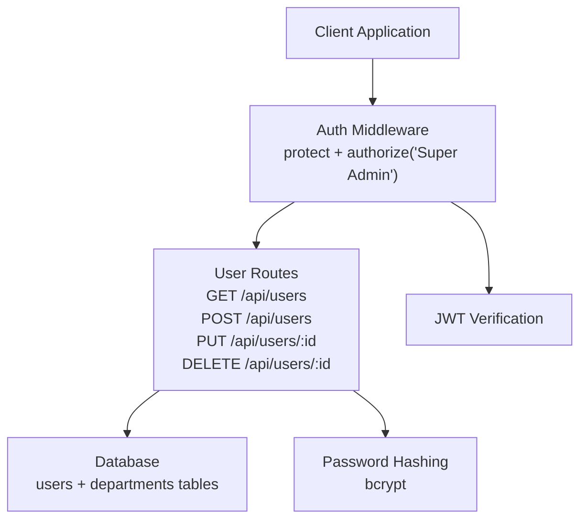
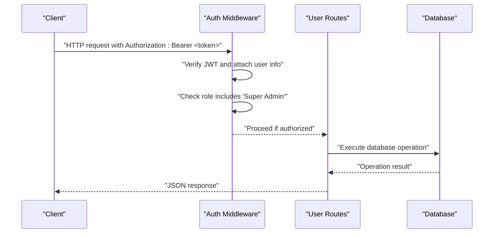
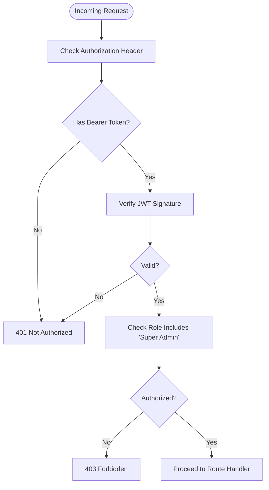
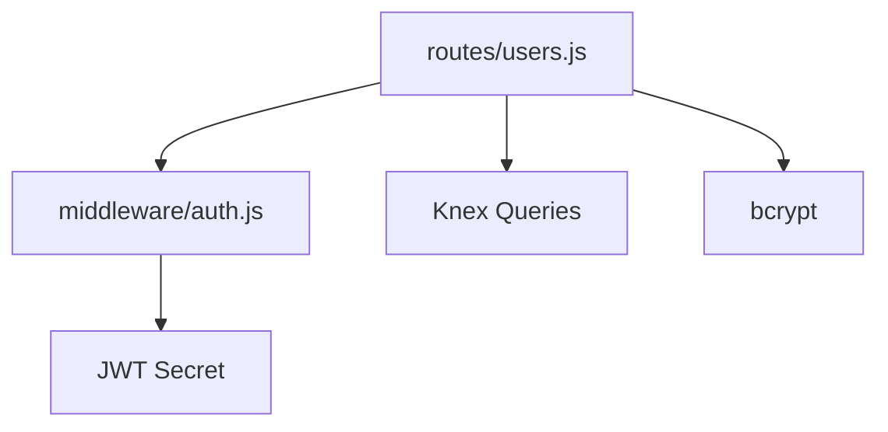

# User Management Endpoints

<cite>
**Referenced Files in This Document**
- [users.js](file://backend/src/routes/users.js)
- [auth.js](file://backend/src/middleware/auth.js)
- [authController.js](file://backend/src/controllers/authController.js)
- [20260512000000_initial_schema.js](file://backend/src/db/migrations/20260512000000_initial_schema.js)
</cite>

## Table of Contents
1. [Introduction](#introduction)
2. [Project Structure](#project-structure)
3. [Core Components](#core-components)
4. [Architecture Overview](#architecture-overview)
5. [Detailed Component Analysis](#detailed-component-analysis)
6. [Dependency Analysis](#dependency-analysis)
7. [Performance Considerations](#performance-considerations)
8. [Troubleshooting Guide](#troubleshooting-guide)
9. [Conclusion](#conclusion)

## Introduction
This document provides comprehensive API documentation for user management endpoints. It covers:
- Retrieving all users with department information
- Creating new users with validation
- Updating user details
- Deleting users
- Authentication and authorization requirements
- Validation rules for usernames and emails
- Password hashing
- Security restrictions such as preventing self-deletion
- Request/response schemas and error handling

## Project Structure
The user management endpoints are implemented in the Express routes module and backed by a Knex-based database schema. Authentication and authorization are enforced via middleware.

**Diagram sources**
- [users.js:1-111](file://backend/src/routes/users.js#L1-L111)
- [auth.js:1-36](file://backend/src/middleware/auth.js#L1-L36)

**Section sources**
- [users.js:1-111](file://backend/src/routes/users.js#L1-L111)
- [auth.js:1-36](file://backend/src/middleware/auth.js#L1-L36)

## Core Components
- Route handlers for user CRUD operations
- Authentication middleware enforcing bearer token and JWT verification
- Authorization middleware restricting endpoints to Super Admin role
- Database schema supporting users and departments with foreign key relationships
- Password hashing using bcrypt

**Section sources**
- [users.js:7-8](file://backend/src/routes/users.js#L7-L8)
- [auth.js:3-33](file://backend/src/middleware/auth.js#L3-L33)
- [20260512000000_initial_schema.js:38-81](file://backend/src/db/migrations/20260512000000_initial_schema.js#L38-L81)

## Architecture Overview
The user management endpoints are protected by middleware that verifies JWT tokens and ensures the requesting user has the Super Admin role. Requests are routed to controller-like handlers that interact with the database using Knex queries.

**Diagram sources**
- [auth.js:3-33](file://backend/src/middleware/auth.js#L3-L33)
- [users.js:10-108](file://backend/src/routes/users.js#L10-L108)

## Detailed Component Analysis

### Authentication and Authorization
- Token requirement: All user endpoints require a Bearer token in the Authorization header.
- JWT verification: The token is verified against the configured secret; otherwise, a 401 Unauthorized response is returned.
- Role restriction: Only users with the Super Admin role can access these endpoints.

**Diagram sources**
- [auth.js:3-33](file://backend/src/middleware/auth.js#L3-L33)

**Section sources**
- [auth.js:3-33](file://backend/src/middleware/auth.js#L3-L33)

### GET /api/users
Retrieves all users with department information by joining the users table with the departments table.

- Authentication: Required (Bearer token)
- Authorization: Super Admin only
- Response: Array of user objects with department name included

Request
- Method: GET
- URL: /api/users
- Headers: Authorization: Bearer <token>

Response
- 200 OK: Returns { success: true, data: [users_with_department] }
- 500 Internal Server Error: Returns { success: false, message: "<error_message>" }

Notes
- The endpoint performs a left join to include users even if they do not belong to a department.

**Section sources**
- [users.js:10-20](file://backend/src/routes/users.js#L10-L20)

### POST /api/users
Creates a new user with validation and password hashing.

- Authentication: Required (Bearer token)
- Authorization: Super Admin only
- Request body fields:
  - username (required)
  - password (required)
  - full_name (required)
  - email (optional)
  - role (optional; defaults to Viewer)
  - department_id (optional; allows null)
- Validation rules:
  - Username must be unique
  - Email must be unique (if provided)
- Security:
  - Password is hashed using bcrypt before storage
- Response:
  - 201 Created: Returns { success: true, data: <new_user> }
  - 400 Bad Request: Returns { success: false, message: "<validation_error>" }
  - 500 Internal Server Error: Returns { success: false, message: "<error_message>" }

**Section sources**
- [users.js:22-54](file://backend/src/routes/users.js#L22-L54)

### PUT /api/users/:id
Updates an existing user’s details with validation and optional password update.

- Authentication: Required (Bearer token)
- Authorization: Super Admin only
- Path parameters:
  - id (required; numeric)
- Request body fields:
  - username (optional)
  - password (optional; if provided, will be hashed)
  - full_name (optional)
  - email (optional)
  - role (optional)
  - department_id (optional; allows null)
  - status (optional; defaults to true if not provided)
- Validation rules:
  - Username must be unique (excluding the current user)
  - Email must be unique (excluding the current user)
- Security:
  - Password is hashed using bcrypt if provided
- Response:
  - 200 OK: Returns { success: true, data: <updated_user> }
  - 400 Bad Request: Returns { success: false, message: "<validation_error>" }
  - 500 Internal Server Error: Returns { success: false, message: "<error_message>" }

**Section sources**
- [users.js:56-95](file://backend/src/routes/users.js#L56-L95)

### DELETE /api/users/:id
Deletes a user by ID with a safety restriction preventing self-deletion.

- Authentication: Required (Bearer token)
- Authorization: Super Admin only
- Path parameters:
  - id (required; numeric)
- Security restriction:
  - Self-deletion is prevented; attempting to delete the authenticated user returns 400
- Response:
  - 200 OK: Returns { success: true, message: "User deleted successfully" }
  - 400 Bad Request: Returns { success: false, message: "Cannot delete your own account" }
  - 500 Internal Server Error: Returns { success: false, message: "<error_message>" }

**Section sources**
- [users.js:97-108](file://backend/src/routes/users.js#L97-L108)

### Data Model and Validation Rules
The users table and related constraints define the data model and validation behavior.

- Users table schema:
  - id (primary key)
  - username (unique, not null)
  - password (not null)
  - full_name (not null)
  - email (unique, nullable)
  - role (enum with default Viewer)
  - department_id (foreign key to departments, ON DELETE SET NULL)
  - status (boolean, default true)
  - created_at, updated_at (timestamps)
- Departments table schema:
  - id (primary key)
  - name (unique, not null)
  - created_at (timestamp)

Validation rules derived from the schema and route logic:
- Unique constraints apply to username and email
- Role values are restricted to the defined enum
- department_id references departments with cascading behavior on delete

**Section sources**
- [20260512000000_initial_schema.js:38-81](file://backend/src/db/migrations/20260512000000_initial_schema.js#L38-L81)

### Request and Response Schemas

#### GET /api/users
- Response data: Array of user objects with department name
  - Example fields: id, username, full_name, email, role, department_id, department_name, status, created_at, updated_at

**Section sources**
- [users.js:10-20](file://backend/src/routes/users.js#L10-L20)

#### POST /api/users
- Request body:
  - username: string (required)
  - password: string (required)
  - full_name: string (required)
  - email: string (optional)
  - role: enum string (optional)
  - department_id: number | null (optional)
- Response body:
  - success: boolean
  - data: user object

**Section sources**
- [users.js:22-54](file://backend/src/routes/users.js#L22-L54)

#### PUT /api/users/:id
- Request body:
  - username: string (optional)
  - password: string (optional)
  - full_name: string (optional)
  - email: string (optional)
  - role: enum string (optional)
  - department_id: number | null (optional)
  - status: boolean (optional)
- Response body:
  - success: boolean
  - data: user object

**Section sources**
- [users.js:56-95](file://backend/src/routes/users.js#L56-L95)

#### DELETE /api/users/:id
- Response body:
  - success: boolean
  - message: string

**Section sources**
- [users.js:97-108](file://backend/src/routes/users.js#L97-L108)

## Dependency Analysis
The user management endpoints depend on:
- Authentication middleware for token verification and role checks
- Database access via Knex queries
- Password hashing library for secure credential storage

**Diagram sources**
- [users.js:1-111](file://backend/src/routes/users.js#L1-L111)
- [auth.js:1-36](file://backend/src/middleware/auth.js#L1-L36)

**Section sources**
- [users.js:1-111](file://backend/src/routes/users.js#L1-L111)
- [auth.js:1-36](file://backend/src/middleware/auth.js#L1-L36)

## Performance Considerations
- Indexing: Ensure unique indexes exist on username and email for efficient duplicate checks during create/update operations.
- Pagination: For large datasets, consider implementing pagination in GET /api/users to avoid large payloads.
- Selectivity: The join with departments adds overhead; limit selected columns if only basic user info is needed.

## Troubleshooting Guide
Common errors and resolutions:
- 401 Not Authorized: Missing or invalid Authorization header; ensure a valid Bearer token is provided.
- 403 Forbidden: Insufficient privileges; only Super Admin users can access these endpoints.
- 400 Bad Request:
  - Username already taken
  - Email already registered
  - Attempting to delete self
- 500 Internal Server Error: Database or server issues; check server logs for details.

Operational tips:
- Verify JWT_SECRET environment variable is configured correctly.
- Confirm user roles are set appropriately in the database.
- Monitor database constraints for unique violations.

**Section sources**
- [auth.js:10-21](file://backend/src/middleware/auth.js#L10-L21)
- [users.js:26-38](file://backend/src/routes/users.js#L26-L38)
- [users.js:99-102](file://backend/src/routes/users.js#L99-L102)

## Conclusion
The user management endpoints provide secure, role-protected operations for managing users with robust validation and password hashing. Adhering to the documented schemas, authentication, and validation rules ensures reliable and secure usage across the application.