# Background Job Processing

<cite>
**Referenced Files in This Document**
- [queueManager.js](file://backend/src/services/queueManager.js)
- [worker.js](file://backend/src/services/worker.js)
- [scheduler.js](file://backend/src/services/scheduler.js)
- [notificationDispatcher.js](file://backend/src/services/notificationDispatcher.js)
- [emailService.js](file://backend/src/services/emailService.js)
- [20260515064955_add_notifications_and_email_system.js](file://backend/src/db/migrations/20260515064955_add_notifications_and_email_system.js)
- [20260517090000_create_notification_center_tables.js](file://backend/src/db/migrations/20260517090000_create_notification_center_tables.js)
- [03_email_templates.js](file://backend/src/db/seeds/03_email_templates.js)
- [QueueMonitor.jsx](file://frontend/src/pages/QueueMonitor.jsx)
- [index.js](file://backend/src/index.js)
</cite>

## Table of Contents
1. [Introduction](#introduction)
2. [Project Structure](#project-structure)
3. [Core Components](#core-components)
4. [Architecture Overview](#architecture-overview)
5. [Detailed Component Analysis](#detailed-component-analysis)
6. [Dependency Analysis](#dependency-analysis)
7. [Performance Considerations](#performance-considerations)
8. [Troubleshooting Guide](#troubleshooting-guide)
9. [Conclusion](#conclusion)
10. [Appendices](#appendices)

## Introduction
This document describes the background job processing system built with BullMQ queue management. It covers queue configuration, worker processes, job scheduling, fallback database-driven processing, job prioritization and retry strategies, monitoring and health management, job types and workflows, error handling, scalability, resource management, persistence, and integrations with email automation, notifications, and system maintenance tasks.

## Project Structure
The job processing system spans backend services, database migrations, and a frontend monitor page:
- Backend services orchestrate queues, workers, and schedulers
- Database migrations define persistent schemas for fallback and notifications
- Frontend provides a queue health monitor and links to the advanced Bull Board dashboard

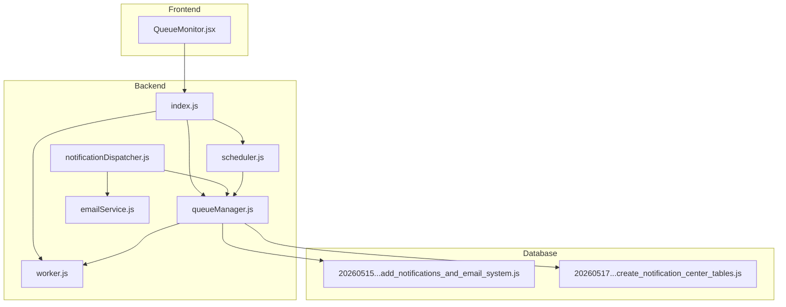

**Diagram sources**
- [index.js:1-25](file://backend/src/index.js#L1-L25)
- [queueManager.js:1-126](file://backend/src/services/queueManager.js#L1-L126)
- [worker.js:1-43](file://backend/src/services/worker.js#L1-L43)
- [scheduler.js:1-155](file://backend/src/services/scheduler.js#L1-L155)
- [notificationDispatcher.js:1-68](file://backend/src/services/notificationDispatcher.js#L1-L68)
- [emailService.js:1-122](file://backend/src/services/emailService.js#L1-L122)
- [20260515064955_add_notifications_and_email_system.js:1-110](file://backend/src/db/migrations/20260515064955_add_notifications_and_email_system.js#L1-L110)
- [20260517090000_create_notification_center_tables.js:1-119](file://backend/src/db/migrations/20260517090000_create_notification_center_tables.js#L1-L119)
- [QueueMonitor.jsx:1-154](file://frontend/src/pages/QueueMonitor.jsx#L1-L154)

**Section sources**
- [index.js:1-25](file://backend/src/index.js#L1-L25)
- [queueManager.js:1-126](file://backend/src/services/queueManager.js#L1-L126)
- [worker.js:1-43](file://backend/src/services/worker.js#L1-L43)
- [scheduler.js:1-155](file://backend/src/services/scheduler.js#L1-L155)
- [notificationDispatcher.js:1-68](file://backend/src/services/notificationDispatcher.js#L1-L68)
- [emailService.js:1-122](file://backend/src/services/emailService.js#L1-L122)
- [20260515064955_add_notifications_and_email_system.js:1-110](file://backend/src/db/migrations/20260515064955_add_notifications_and_email_system.js#L1-L110)
- [20260517090000_create_notification_center_tables.js:1-119](file://backend/src/db/migrations/20260517090000_create_notification_center_tables.js#L1-L119)
- [QueueMonitor.jsx:1-154](file://frontend/src/pages/QueueMonitor.jsx#L1-L154)

## Core Components
- Queue Manager: Initializes Redis or falls back to database, creates queues, adds jobs with retries/backoff, and polls DB jobs when Redis is unavailable
- Worker: Registers BullMQ workers for queues or runs polling-based workers for DB fallback
- Scheduler: Uses cron to enqueue recurring jobs for reports, escalations, and notifications
- Notification Dispatcher: Resolves user preferences and enqueues email jobs when templates are present
- Email Service: Sends emails via SMTP with template compilation and logging
- Database Schemas: Define fallback queue, notifications, preferences, templates, and scheduling tables

Key capabilities:
- Redis-backed queues with exponential backoff and automatic retries
- Database fallback with priority-based polling and exponential backoff
- Email automation with templating and logging
- Notification center with multi-recipient and read tracking
- Cron-based scheduling for system maintenance and alerts

**Section sources**
- [queueManager.js:1-126](file://backend/src/services/queueManager.js#L1-L126)
- [worker.js:1-43](file://backend/src/services/worker.js#L1-L43)
- [scheduler.js:1-155](file://backend/src/services/scheduler.js#L1-L155)
- [notificationDispatcher.js:1-68](file://backend/src/services/notificationDispatcher.js#L1-L68)
- [emailService.js:1-122](file://backend/src/services/emailService.js#L1-L122)
- [20260515064955_add_notifications_and_email_system.js:84-97](file://backend/src/db/migrations/20260515064955_add_notifications_and_email_system.js#L84-L97)
- [20260517090000_create_notification_center_tables.js:82-99](file://backend/src/db/migrations/20260517090000_create_notification_center_tables.js#L82-L99)

## Architecture Overview
The system integrates BullMQ workers and cron-based schedulers with a robust fallback mechanism. Redis is preferred; if unavailable, the system switches to database-backed job processing with polling.

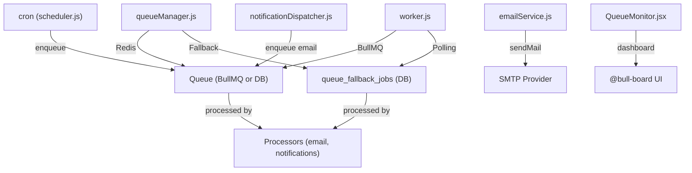

**Diagram sources**
- [scheduler.js:5-22](file://backend/src/services/scheduler.js#L5-L22)
- [queueManager.js:61-85](file://backend/src/services/queueManager.js#L61-L85)
- [queueManager.js:87-116](file://backend/src/services/queueManager.js#L87-L116)
- [worker.js:22-37](file://backend/src/services/worker.js#L22-L37)
- [notificationDispatcher.js:42-56](file://backend/src/services/notificationDispatcher.js#L42-L56)
- [emailService.js:41-103](file://backend/src/services/emailService.js#L41-L103)
- [QueueMonitor.jsx:111-133](file://frontend/src/pages/QueueMonitor.jsx#L111-L133)

## Detailed Component Analysis

### Queue Manager
Responsibilities:
- Initialize Redis connection with retry strategy and fallback to DB
- Create BullMQ queues when Redis is available
- Add jobs with retry/backoff or insert into fallback table when Redis fails
- Poll and process DB jobs when Redis is unavailable

Configuration highlights:
- Redis enabled/disabled via environment flag
- Exponential backoff with base delay for retries
- Priority and delay supported when adding jobs
- Fallback inserts include attempts, status, and next run time

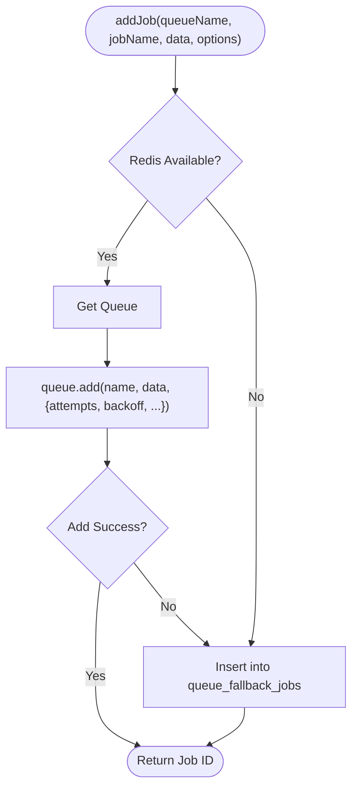

**Diagram sources**
- [queueManager.js:61-85](file://backend/src/services/queueManager.js#L61-L85)

**Section sources**
- [queueManager.js:9-52](file://backend/src/services/queueManager.js#L9-L52)
- [queueManager.js:54-59](file://backend/src/services/queueManager.js#L54-L59)
- [queueManager.js:61-85](file://backend/src/services/queueManager.js#L61-L85)
- [queueManager.js:87-116](file://backend/src/services/queueManager.js#L87-L116)

### Worker Processes
Responsibilities:
- Register BullMQ workers per queue when Redis is available
- Run polling-based workers when using DB fallback
- Process jobs by queue name and job name

Processor map supports:
- Email jobs: sending notifications via email
- Notifications: escalation checks and other alerting tasks

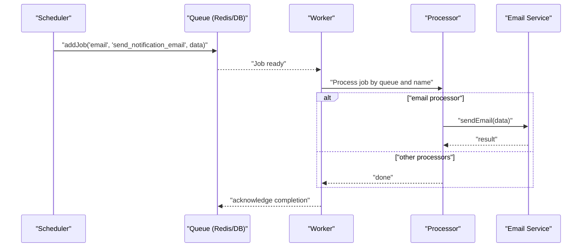

**Diagram sources**
- [scheduler.js:7-10](file://backend/src/services/scheduler.js#L7-L10)
- [worker.js:5-20](file://backend/src/services/worker.js#L5-L20)
- [emailService.js:41-103](file://backend/src/services/emailService.js#L41-L103)

**Section sources**
- [worker.js:22-37](file://backend/src/services/worker.js#L22-L37)
- [worker.js:5-20](file://backend/src/services/worker.js#L5-L20)

### Job Scheduling Mechanisms
The scheduler uses cron to enqueue jobs at fixed intervals:
- Daily summary reports
- Monthly financial reports
- Hourly escalation checks
- Periodic low fund checks
- Minute-granularity notification dispatcher

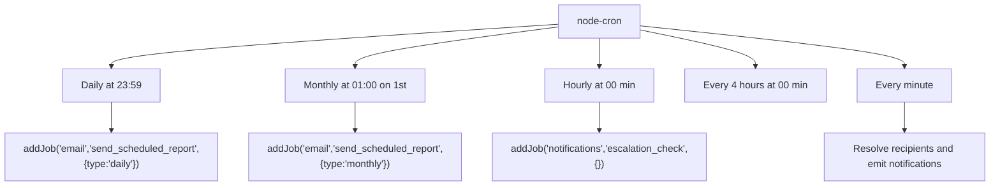

**Diagram sources**
- [scheduler.js:5-22](file://backend/src/services/scheduler.js#L5-L22)
- [scheduler.js:42-147](file://backend/src/services/scheduler.js#L42-L147)

**Section sources**
- [scheduler.js:5-22](file://backend/src/services/scheduler.js#L5-L22)
- [scheduler.js:42-147](file://backend/src/services/scheduler.js#L42-L147)

### Fallback Database-Driven Job Processing
When Redis is unavailable, the system:
- Switches to database-backed queue table
- Polls pending jobs based on priority and next run time
- Executes processors and updates attempts, status, and next run time with exponential backoff
- Retries failed jobs up to a configured limit

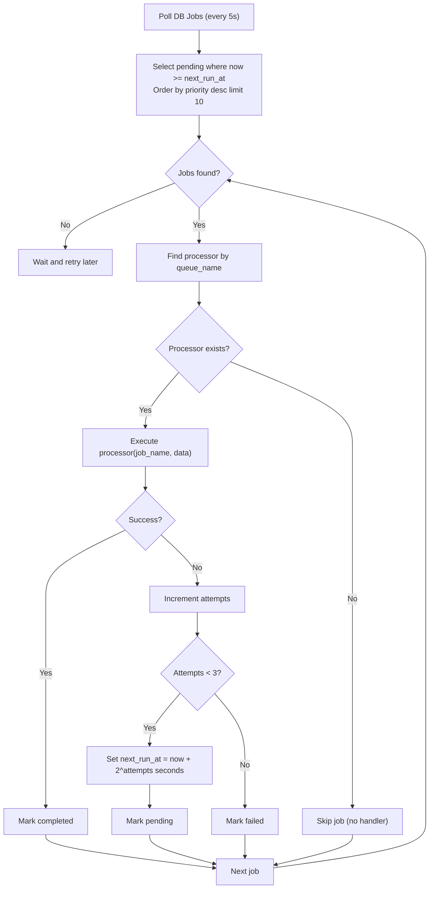

**Diagram sources**
- [worker.js:30-36](file://backend/src/services/worker.js#L30-L36)
- [queueManager.js:87-116](file://backend/src/services/queueManager.js#L87-L116)

**Section sources**
- [worker.js:30-36](file://backend/src/services/worker.js#L30-L36)
- [queueManager.js:87-116](file://backend/src/services/queueManager.js#L87-L116)

### Job Types, Prioritization, and Retry Strategies
Supported job types:
- Email: send_notification_email
- Notifications: escalation_check
- Reports: send_scheduled_report

Prioritization:
- Jobs can specify priority during insertion
- DB fallback orders by priority descending

Retry and backoff:
- BullMQ jobs configured with attempts and exponential backoff
- DB fallback uses exponential backoff per attempt with a cap

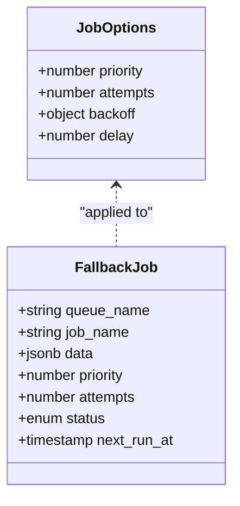

**Diagram sources**
- [queueManager.js:65-69](file://backend/src/services/queueManager.js#L65-L69)
- [queueManager.js:82-84](file://backend/src/services/queueManager.js#L82-L84)
- [queueManager.js:104-112](file://backend/src/services/queueManager.js#L104-L112)

**Section sources**
- [queueManager.js:65-69](file://backend/src/services/queueManager.js#L65-L69)
- [queueManager.js:82-84](file://backend/src/services/queueManager.js#L82-L84)
- [queueManager.js:104-112](file://backend/src/services/queueManager.js#L104-L112)

### Email Automation and Templates
Email service:
- Configurable SMTP via environment variables
- Template compilation with placeholder substitution
- Logging of email events with status tracking
- Verification of SMTP connectivity

Notification dispatcher:
- Respects user preferences for in-app and email delivery
- Enqueues email jobs when templates are provided
- Emits real-time notifications via WebSocket

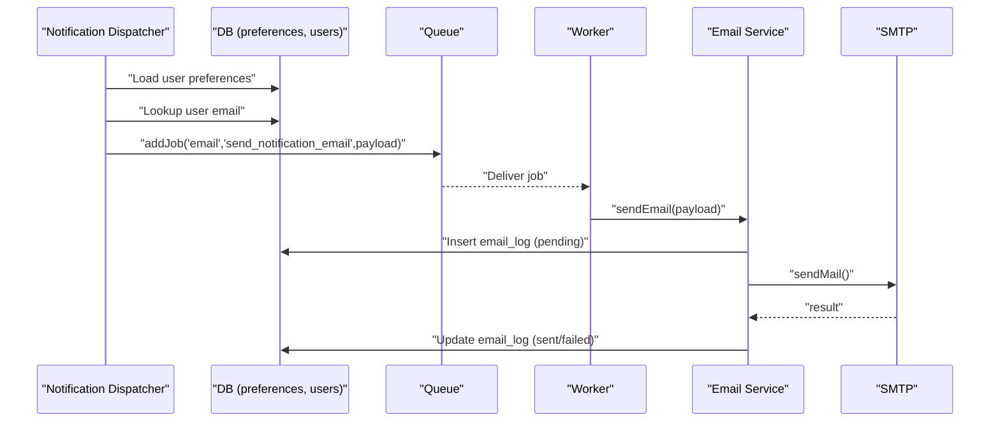

**Diagram sources**
- [notificationDispatcher.js:5-63](file://backend/src/services/notificationDispatcher.js#L5-L63)
- [emailService.js:41-103](file://backend/src/services/emailService.js#L41-L103)
- [20260515064955_add_notifications_and_email_system.js:15-29](file://backend/src/db/migrations/20260515064955_add_notifications_and_email_system.js#L15-L29)

**Section sources**
- [notificationDispatcher.js:5-63](file://backend/src/services/notificationDispatcher.js#L5-L63)
- [emailService.js:41-103](file://backend/src/services/emailService.js#L41-L103)
- [03_email_templates.js:1-111](file://backend/src/db/seeds/03_email_templates.js#L1-L111)

### Notification Center and System Maintenance
Notification center features:
- Multi-recipient targeting (all, department, specific users)
- Priority, category, and read/ack tracking
- Scheduling service with frequency support (once, daily, weekly, monthly)

Maintenance tasks:
- Low fund threshold checks
- Escalation checks
- Scheduled report generation

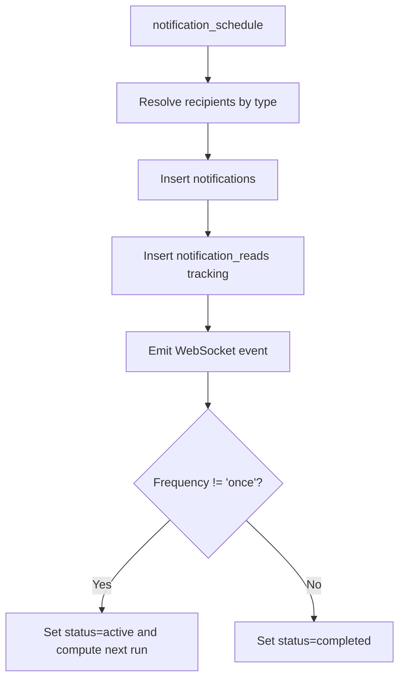

**Diagram sources**
- [20260517090000_create_notification_center_tables.js:82-99](file://backend/src/db/migrations/20260517090000_create_notification_center_tables.js#L82-L99)
- [scheduler.js:42-147](file://backend/src/services/scheduler.js#L42-L147)

**Section sources**
- [20260517090000_create_notification_center_tables.js:1-119](file://backend/src/db/migrations/20260517090000_create_notification_center_tables.js#L1-L119)
- [scheduler.js:42-147](file://backend/src/services/scheduler.js#L42-L147)

### Job Monitoring and Queue Health
Monitoring approaches:
- Frontend Queue Monitor displays queue statistics and links to Bull Board
- Bull Board integration provides advanced queue management and failure analysis
- Application startup initializes Bull Board adapters for queue inspection

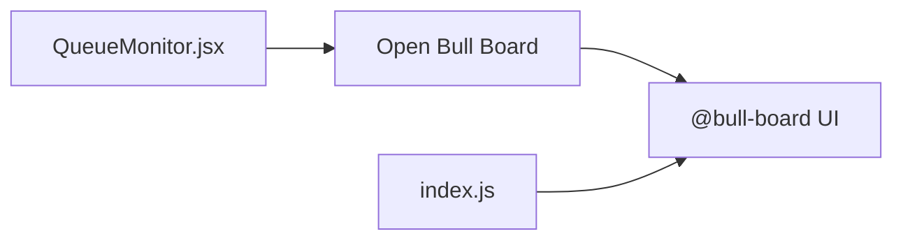

**Diagram sources**
- [QueueMonitor.jsx:111-133](file://frontend/src/pages/QueueMonitor.jsx#L111-L133)
- [index.js:18-22](file://backend/src/index.js#L18-L22)

**Section sources**
- [QueueMonitor.jsx:111-133](file://frontend/src/pages/QueueMonitor.jsx#L111-L133)
- [index.js:18-22](file://backend/src/index.js#L18-L22)

## Dependency Analysis
The system exhibits clear separation of concerns:
- Queue Manager depends on Redis/IORedis and Knex for DB fallback
- Worker depends on Queue Manager and processors
- Scheduler depends on Queue Manager and database for scheduling
- Notification Dispatcher depends on Queue Manager and Email Service
- Email Service depends on SMTP configuration and database logging
- Database migrations define schemas consumed by all components

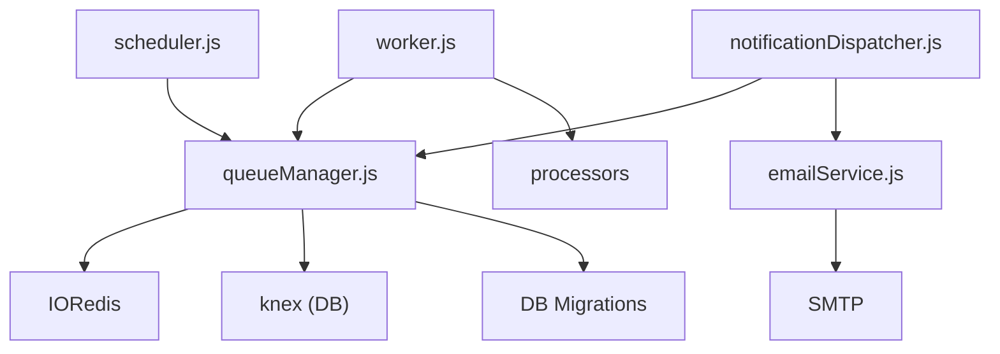

**Diagram sources**
- [queueManager.js:1-3](file://backend/src/services/queueManager.js#L1-L3)
- [worker.js:1-3](file://backend/src/services/worker.js#L1-L3)
- [scheduler.js:1-3](file://backend/src/services/scheduler.js#L1-L3)
- [notificationDispatcher.js:1-3](file://backend/src/services/notificationDispatcher.js#L1-L3)
- [emailService.js:1-2](file://backend/src/services/emailService.js#L1-L2)
- [20260515064955_add_notifications_and_email_system.js:1-110](file://backend/src/db/migrations/20260515064955_add_notifications_and_email_system.js#L1-L110)

**Section sources**
- [queueManager.js:1-3](file://backend/src/services/queueManager.js#L1-L3)
- [worker.js:1-3](file://backend/src/services/worker.js#L1-L3)
- [scheduler.js:1-3](file://backend/src/services/scheduler.js#L1-L3)
- [notificationDispatcher.js:1-3](file://backend/src/services/notificationDispatcher.js#L1-L3)
- [emailService.js:1-2](file://backend/src/services/emailService.js#L1-L2)

## Performance Considerations
- Redis-backed queues offer high throughput and low latency compared to DB polling
- DB fallback limits concurrent processing to a small batch per tick to avoid overload
- Exponential backoff reduces load on failing systems and prevents thundering herds
- Indexes on scheduling tables improve lookup performance for notifications
- Template compilation is O(n) over placeholders; keep templates concise
- SMTP verification helps detect misconfiguration early, avoiding wasted retries

[No sources needed since this section provides general guidance]

## Troubleshooting Guide
Common issues and resolutions:
- Redis connectivity failures: The system automatically falls back to DB and logs warnings; verify Redis availability and credentials
- Email not sending: Check SMTP configuration; the service returns a skipped result when not configured
- Job not processed: Verify queue existence, worker registration, and that the job name matches a registered processor
- DB fallback not running: Ensure polling interval is active and the fallback table has pending jobs
- Notification delivery delays: Confirm scheduling table entries and recipient resolution logic

**Section sources**
- [queueManager.js:31-51](file://backend/src/services/queueManager.js#L31-L51)
- [emailService.js:42-50](file://backend/src/services/emailService.js#L42-L50)
- [worker.js:30-36](file://backend/src/services/worker.js#L30-L36)
- [scheduler.js:42-147](file://backend/src/services/scheduler.js#L42-L147)

## Conclusion
The background job processing system combines BullMQ for scalable, resilient queue management with a robust database fallback for reliability. It supports diverse job types, intelligent scheduling, comprehensive notification delivery, and strong observability through Bull Board and a dedicated frontend monitor. The design balances performance, fault tolerance, and maintainability while enabling future enhancements.

[No sources needed since this section summarizes without analyzing specific files]

## Appendices

### Database Schema Overview
Key tables supporting job processing and notifications:
- queue_fallback_jobs: persisted jobs with priority and retry metadata
- email_templates: reusable email templates with placeholders
- email_logs: audit trail for sent/failure states
- notification_schedule: scheduled notifications with frequency and recipients
- notifications and related tracking tables: in-app notifications and read/ack tracking

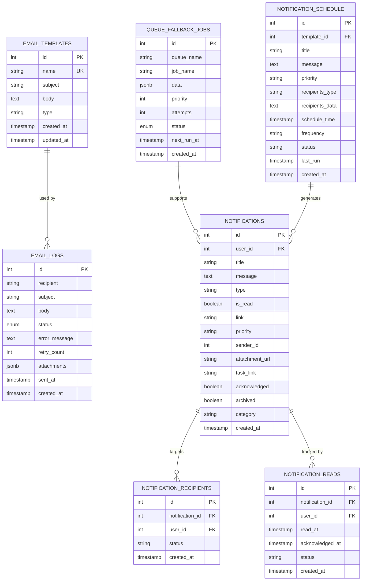

**Diagram sources**
- [20260515064955_add_notifications_and_email_system.js:84-97](file://backend/src/db/migrations/20260515064955_add_notifications_and_email_system.js#L84-L97)
- [20260515064955_add_notifications_and_email_system.js:15-29](file://backend/src/db/migrations/20260515064955_add_notifications_and_email_system.js#L15-L29)
- [20260517090000_create_notification_center_tables.js:82-99](file://backend/src/db/migrations/20260517090000_create_notification_center_tables.js#L82-L99)
- [20260517090000_create_notification_center_tables.js:49-80](file://backend/src/db/migrations/20260517090000_create_notification_center_tables.js#L49-L80)