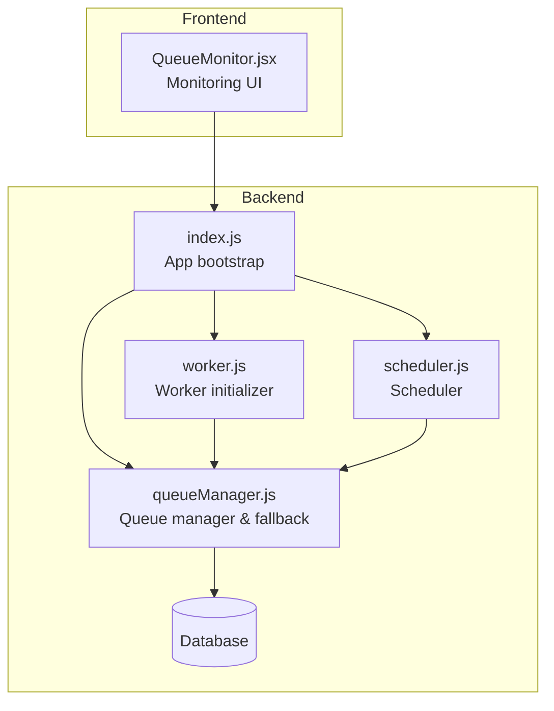
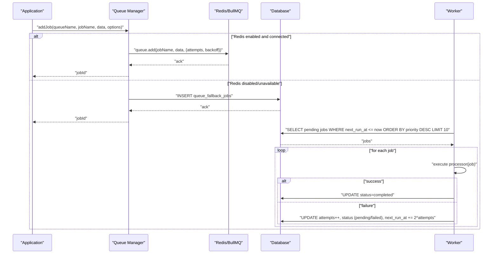
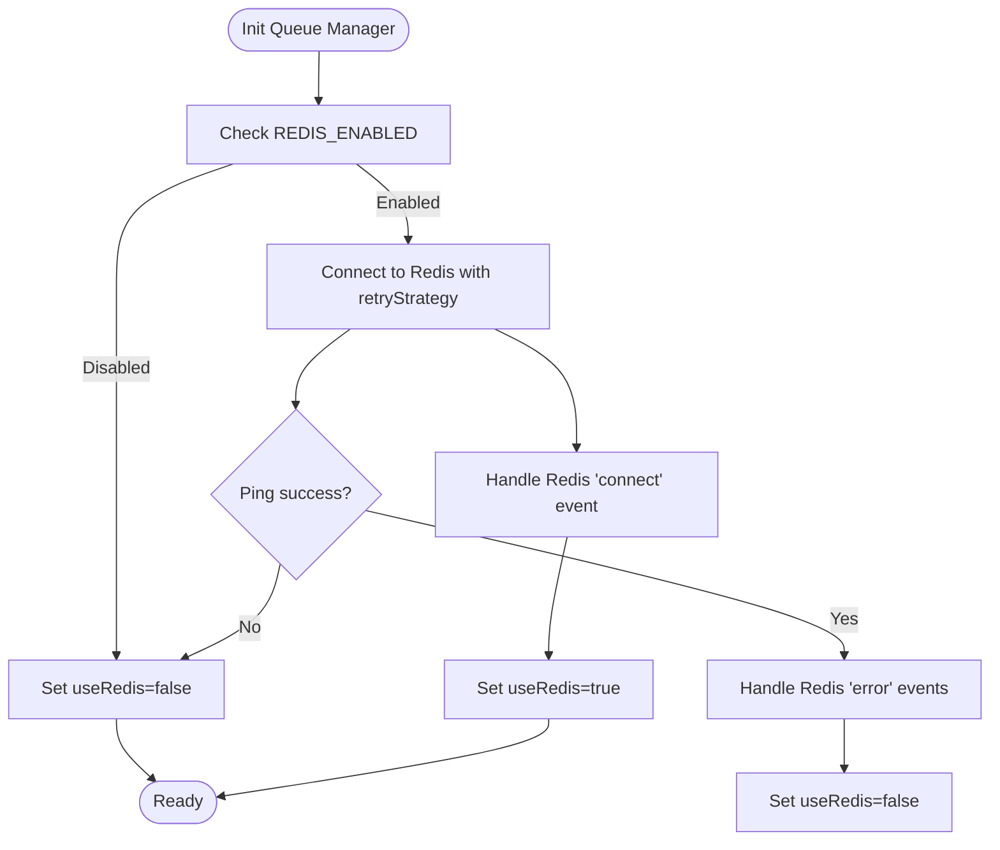
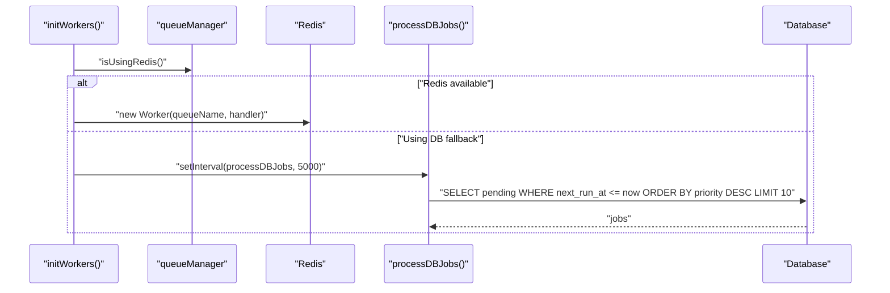
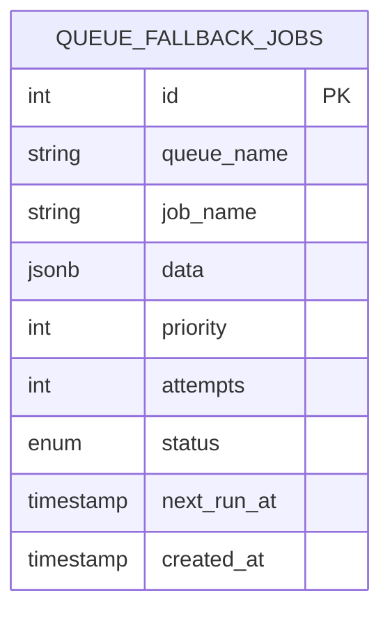
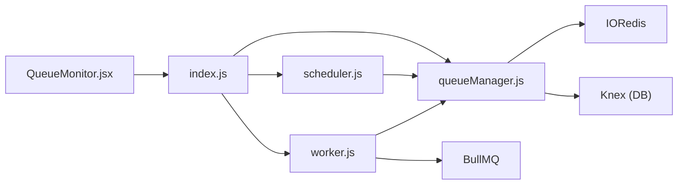

# Fallback Mechanisms

<cite>
**Referenced Files in This Document**
- [queueManager.js](file://backend/src/services/queueManager.js)
- [worker.js](file://backend/src/services/worker.js)
- [scheduler.js](file://backend/src/services/scheduler.js)
- [add_notifications_and_email_system.js](file://backend/src/db/migrations/20260515064955_add_notifications_and_email_system.js)
- [index.js](file://backend/src/index.js)
- [QueueMonitor.jsx](file://frontend/src/pages/QueueMonitor.jsx)
</cite>

## Table of Contents
1. [Introduction](#introduction)
2. [Project Structure](#project-structure)
3. [Core Components](#core-components)
4. [Architecture Overview](#architecture-overview)
5. [Detailed Component Analysis](#detailed-component-analysis)
6. [Dependency Analysis](#dependency-analysis)
7. [Performance Considerations](#performance-considerations)
8. [Troubleshooting Guide](#troubleshooting-guide)
9. [Conclusion](#conclusion)
10. [Appendices](#appendices)

## Introduction
This document explains the database fallback system for background job processing. It covers fallback triggers, job migration, failover procedures, detection mechanisms, automatic failover conditions, manual activation, queue table structure, job persistence, fallback job processing, retry strategies, exponential backoff, failure recovery, monitoring, performance impact, migration back to Redis, data consistency, ordering guarantees, and maintenance procedures.

## Project Structure
The fallback system spans three primary areas:
- Queue management service that selects Redis (BullMQ) or database fallback based on configuration and runtime health
- Worker service that initializes BullMQ workers when Redis is available or polls the database when Redis is unavailable
- Scheduler service that enqueues recurring jobs into either Redis or the database fallback

**Diagram sources**
- [index.js:13-25](file://backend/src/index.js#L13-L25)
- [queueManager.js:1-125](file://backend/src/services/queueManager.js#L1-L125)
- [worker.js:1-42](file://backend/src/services/worker.js#L1-L42)
- [scheduler.js:1-40](file://backend/src/services/scheduler.js#L1-L40)
- [QueueMonitor.jsx:1-154](file://frontend/src/pages/QueueMonitor.jsx#L1-L154)

**Section sources**
- [index.js:13-25](file://backend/src/index.js#L13-L25)
- [queueManager.js:1-125](file://backend/src/services/queueManager.js#L1-L125)
- [worker.js:1-42](file://backend/src/services/worker.js#L1-L42)
- [scheduler.js:1-40](file://backend/src/services/scheduler.js#L1-L40)
- [QueueMonitor.jsx:1-154](file://frontend/src/pages/QueueMonitor.jsx#L1-L154)

## Core Components
- Queue Manager: Initializes Redis connection with retry strategy, detects failures, and switches to database fallback. Provides enqueue operations that persist jobs to the database when Redis is unavailable.
- Worker: Creates BullMQ workers when Redis is available; otherwise runs a polling loop to process database fallback jobs.
- Scheduler: Schedules recurring tasks and enqueues them via the queue manager, automatically using the appropriate backend.
- Database Fallback Jobs Table: Stores pending, failed, and completed jobs with metadata for retries and scheduling.

Key behaviors:
- Automatic failover when Redis is disabled by configuration or becomes unreachable
- Exponential backoff for database fallback retries
- Priority-based processing of fallback jobs
- Manual fallback activation via configuration toggle

**Section sources**
- [queueManager.js:9-125](file://backend/src/services/queueManager.js#L9-L125)
- [worker.js:22-37](file://backend/src/services/worker.js#L22-L37)
- [scheduler.js:5-40](file://backend/src/services/scheduler.js#L5-L40)
- [add_notifications_and_email_system.js:84-97](file://backend/src/db/migrations/20260515064955_add_notifications_and_email_system.js#L84-L97)

## Architecture Overview
The system dynamically chooses between Redis (BullMQ) and the database for job processing. Redis is preferred for production due to lower overhead and native queue semantics. When Redis is unavailable or disabled, jobs are persisted to the database and processed by a polling worker.

**Diagram sources**
- [queueManager.js:61-116](file://backend/src/services/queueManager.js#L61-L116)
- [worker.js:32-36](file://backend/src/services/worker.js#L32-L36)
- [add_notifications_and_email_system.js:84-97](file://backend/src/db/migrations/20260515064955_add_notifications_and_email_system.js#L84-L97)

## Detailed Component Analysis

### Queue Manager
Responsibilities:
- Initialize Redis connection with retry strategy and error handling
- Detect Redis unavailability and switch to database fallback mode
- Enqueue jobs to Redis when available; otherwise persist to database
- Provide a polling mechanism for database fallback job processing

Automatic failover conditions:
- Redis disabled via configuration flag
- Redis connection errors after connect event
- Failure to ping Redis during initialization
- Runtime exceptions when adding jobs to BullMQ

Exponential backoff and retry:
- Redis: Built-in BullMQ retry/backoff configuration
- Database fallback: Attempts incremented per failure with exponential delay

**Diagram sources**
- [queueManager.js:9-52](file://backend/src/services/queueManager.js#L9-L52)

**Section sources**
- [queueManager.js:9-125](file://backend/src/services/queueManager.js#L9-L125)

### Worker
Responsibilities:
- Initialize BullMQ workers when Redis is available
- Initialize a polling worker when Redis is unavailable to process database fallback jobs

Polling interval:
- Every 5 seconds to scan for pending jobs eligible for execution

Processor mapping:
- Supports queue-specific processors mapped by queue name

**Diagram sources**
- [worker.js:22-37](file://backend/src/services/worker.js#L22-L37)
- [queueManager.js:87-116](file://backend/src/services/queueManager.js#L87-L116)

**Section sources**
- [worker.js:1-42](file://backend/src/services/worker.js#L1-L42)

### Scheduler
Responsibilities:
- Schedule recurring tasks using cron
- Enqueue jobs via the queue manager, which automatically selects Redis or database fallback

Examples:
- Daily summary reports
- Monthly financial reports
- Hourly escalation checks
- Periodic low fund checks

**Section sources**
- [scheduler.js:1-40](file://backend/src/services/scheduler.js#L1-L40)

### Database Fallback Jobs Table
Structure and purpose:
- Stores job metadata for fallback processing
- Tracks status, attempts, priority, and scheduling
- Enables ordered processing by priority and next execution time

Columns:
- queue_name, job_name, data (JSON), priority, attempts, status, next_run_at, created_at

Indexing considerations:
- Implicit primary key on id
- Ordering by priority desc and next_run_at asc recommended for efficient polling

**Diagram sources**
- [add_notifications_and_email_system.js:84-97](file://backend/src/db/migrations/20260515064955_add_notifications_and_email_system.js#L84-L97)

**Section sources**
- [add_notifications_and_email_system.js:84-97](file://backend/src/db/migrations/20260515064955_add_notifications_and_email_system.js#L84-L97)

### Monitoring and Dashboard
- Frontend monitoring page displays queue health statistics and links to the technical dashboard
- The Bull Board integration provides advanced queue management and failure analysis

Operational visibility:
- System status indicator (Redis online/offline)
- Links to open the technical dashboard for detailed queue inspection

**Section sources**
- [QueueMonitor.jsx:20-154](file://frontend/src/pages/QueueMonitor.jsx#L20-L154)

## Dependency Analysis
The queue manager depends on Redis/IORedis and Knex for database operations. The worker depends on the queue manager for runtime selection and on BullMQ when Redis is available. The scheduler depends on the queue manager to enqueue jobs.

**Diagram sources**
- [queueManager.js:1-3](file://backend/src/services/queueManager.js#L1-L3)
- [worker.js:1-2](file://backend/src/services/worker.js#L1-L2)
- [scheduler.js:1-3](file://backend/src/services/scheduler.js#L1-L3)
- [index.js:13-16](file://backend/src/index.js#L13-L16)
- [QueueMonitor.jsx:1-5](file://frontend/src/pages/QueueMonitor.jsx#L1-L5)

**Section sources**
- [queueManager.js:1-125](file://backend/src/services/queueManager.js#L1-L125)
- [worker.js:1-42](file://backend/src/services/worker.js#L1-L42)
- [scheduler.js:1-40](file://backend/src/services/scheduler.js#L1-L40)
- [index.js:13-25](file://backend/src/index.js#L13-L25)
- [QueueMonitor.jsx:1-154](file://frontend/src/pages/QueueMonitor.jsx#L1-L154)

## Performance Considerations
- Redis advantages: Native queue operations, zero-poll latency, built-in retry/backoff, and lower CPU overhead
- Database fallback disadvantages: Polling overhead, potential contention, and increased I/O
- Recommendations:
  - Prefer Redis for production environments
  - Tune polling interval and batch size for database fallback
  - Monitor queue depth and adjust worker concurrency
  - Use indexes on priority and next_run_at for efficient polling queries

[No sources needed since this section provides general guidance]

## Troubleshooting Guide
Common scenarios and resolutions:
- Redis connectivity issues: The system falls back to database immediately upon errors; verify Redis availability and network connectivity
- Redis disabled by configuration: Set the appropriate environment variable to enable Redis and restart services
- Database fallback jobs stuck: Investigate failed job records and their retry timestamps; ensure the polling worker is running
- Job ordering concerns: Confirm priority values and next_run_at scheduling; verify polling order respects priority and time
- Migration back to Redis: Enable Redis configuration, restart services, and monitor queue metrics to confirm smooth transition

**Section sources**
- [queueManager.js:31-44](file://backend/src/services/queueManager.js#L31-L44)
- [worker.js:32-36](file://backend/src/services/worker.js#L32-L36)
- [add_notifications_and_email_system.js:84-97](file://backend/src/db/migrations/20260515064955_add_notifications_and_email_system.js#L84-L97)

## Conclusion
The fallback system provides robust resilience for background job processing. Automatic failover ensures continuity when Redis is unavailable, while database fallback preserves job persistence and eventual execution. Proper monitoring, tuning, and migration back to Redis are essential for optimal performance and reliability.

[No sources needed since this section summarizes without analyzing specific files]

## Appendices

### Fallback Triggers and Conditions
- Configuration-driven disablement of Redis
- Redis connection errors after successful connect
- Initialization ping failures
- Runtime exceptions when adding jobs to BullMQ

**Section sources**
- [queueManager.js:10-51](file://backend/src/services/queueManager.js#L10-L51)

### Job Migration and Failover Procedures
- Enqueue operations automatically select backend
- Database fallback persists jobs with priority and scheduling
- Polling worker processes eligible jobs and updates status

**Section sources**
- [queueManager.js:61-116](file://backend/src/services/queueManager.js#L61-L116)
- [worker.js:32-36](file://backend/src/services/worker.js#L32-L36)

### Retry Strategies and Exponential Backoff
- Redis: Built-in attempts and exponential backoff configuration
- Database fallback: Attempts incremented per failure with exponential delay

**Section sources**
- [queueManager.js:65-68](file://backend/src/services/queueManager.js#L65-L68)
- [queueManager.js:104-106](file://backend/src/services/queueManager.js#L104-L106)

### Failure Recovery Procedures
- Failed database fallback jobs marked as failed after max attempts
- Pending jobs rescheduled with exponential backoff delays
- Manual intervention supported via the technical dashboard

**Section sources**
- [queueManager.js:104-113](file://backend/src/services/queueManager.js#L104-L113)
- [QueueMonitor.jsx:111-133](file://frontend/src/pages/QueueMonitor.jsx#L111-L133)

### Monitoring and Observability
- Frontend monitoring page for high-level queue health
- Technical dashboard access for detailed queue inspection and management

**Section sources**
- [QueueMonitor.jsx:20-154](file://frontend/src/pages/QueueMonitor.jsx#L20-L154)

### Data Consistency and Ordering Guarantees
- Database fallback uses explicit status tracking and scheduling fields
- Priority-based ordering and time-based eligibility ensure predictable processing
- Consider adding database-level constraints and indexes for stronger guarantees

**Section sources**
- [add_notifications_and_email_system.js:84-97](file://backend/src/db/migrations/20260515064955_add_notifications_and_email_system.js#L84-L97)

### Migration Back to Redis
- Enable Redis configuration and restart services
- Verify BullMQ workers are initialized and processing queues
- Monitor queue metrics to confirm smooth transition

**Section sources**
- [queueManager.js:41-44](file://backend/src/services/queueManager.js#L41-L44)
- [worker.js:23-29](file://backend/src/services/worker.js#L23-L29)