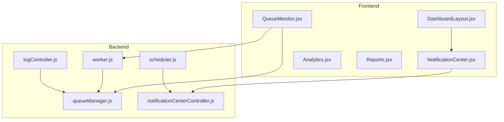
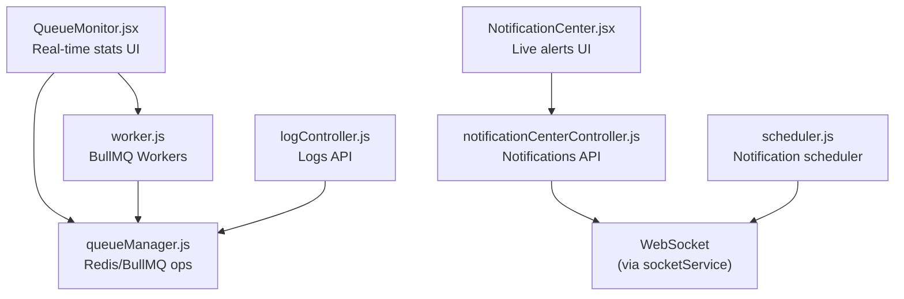
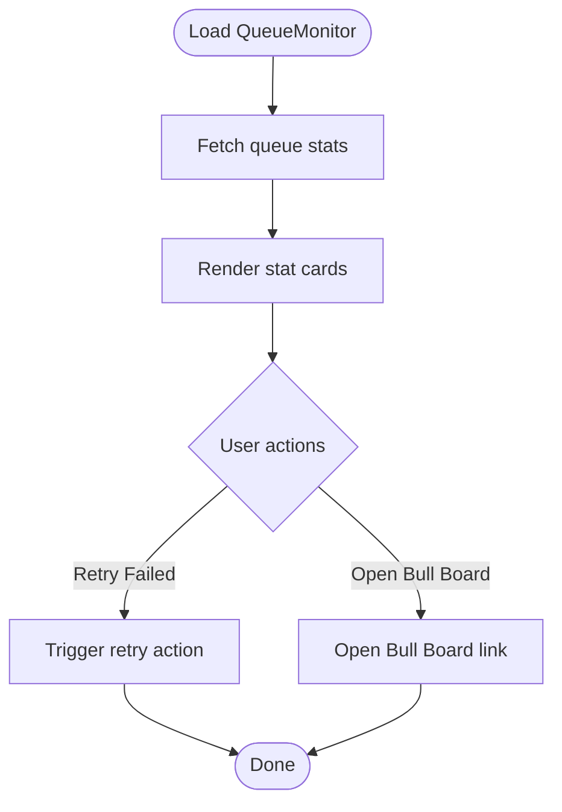
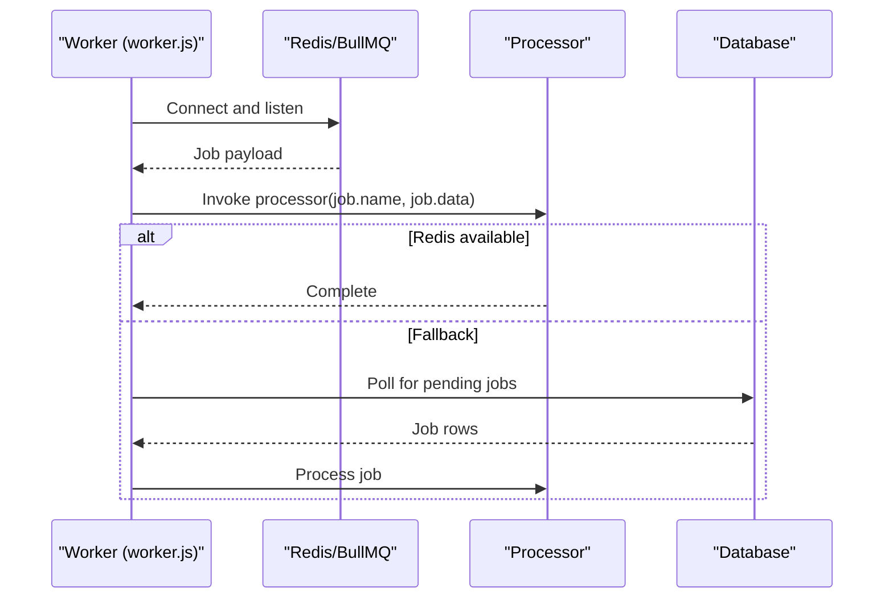
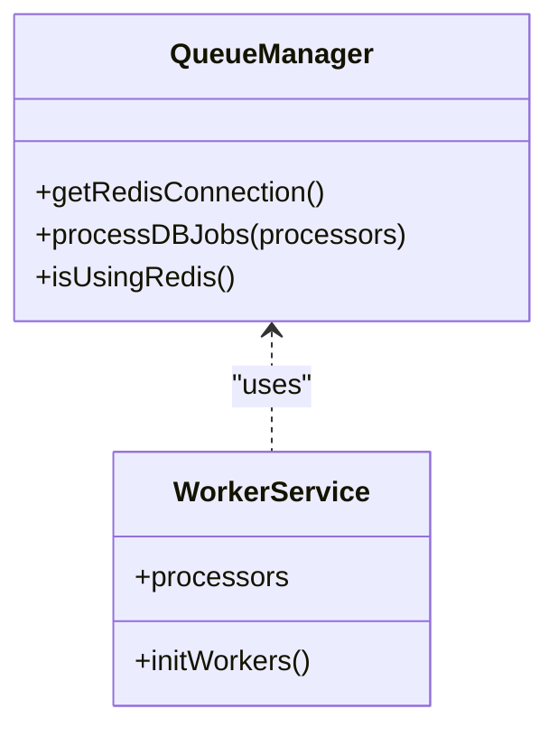
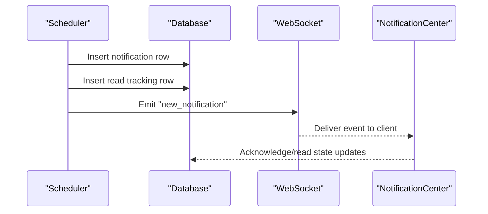
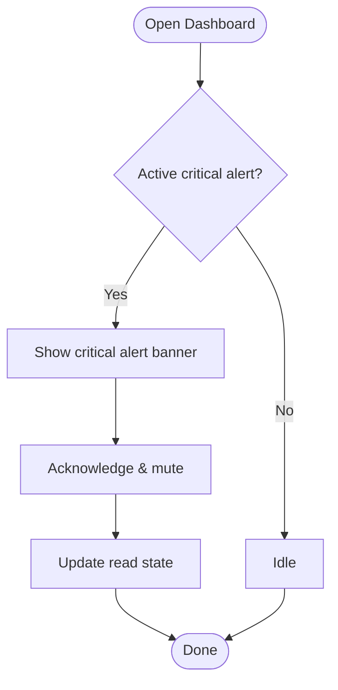
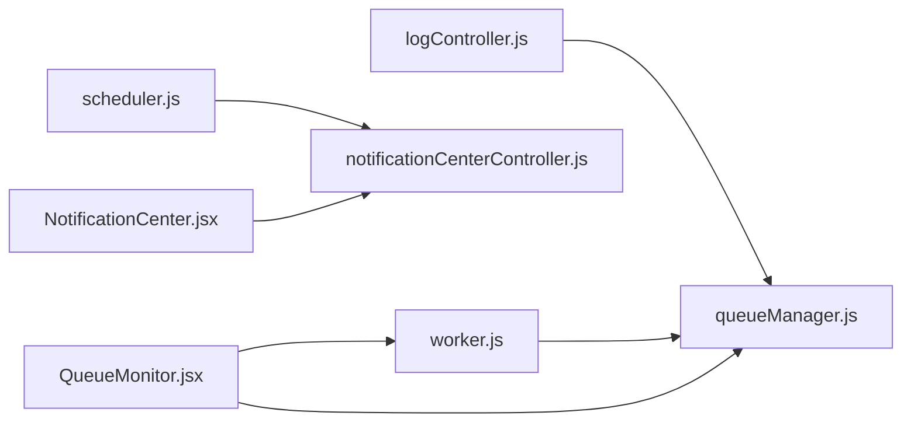

# Job Monitoring & Health

<cite>
**Referenced Files in This Document**
- [QueueMonitor.jsx](file://frontend/src/pages/QueueMonitor.jsx)
- [worker.js](file://backend/src/services/worker.js)
- [queueManager.js](file://backend/src/services/queueManager.js)
- [scheduler.js](file://backend/src/services/scheduler.js)
- [logController.js](file://backend/src/controllers/logController.js)
- [notificationCenterController.js](file://backend/src/controllers/notificationCenterController.js)
- [DashboardLayout.jsx](file://frontend/src/layouts/DashboardLayout.jsx)
- [NotificationCenter.jsx](file://frontend/src/components/NotificationCenter.jsx)
- [Analytics.jsx](file://frontend/src/pages/Analytics.jsx)
- [Reports.jsx](file://frontend/src/pages/Reports.jsx)
</cite>

## Table of Contents
1. [Introduction](#introduction)
2. [Project Structure](#project-structure)
3. [Core Components](#core-components)
4. [Architecture Overview](#architecture-overview)
5. [Detailed Component Analysis](#detailed-component-analysis)
6. [Dependency Analysis](#dependency-analysis)
7. [Performance Considerations](#performance-considerations)
8. [Troubleshooting Guide](#troubleshooting-guide)
9. [Conclusion](#conclusion)
10. [Appendices](#appendices)

## Introduction
This document describes the job monitoring and health management system for the application, focusing on queue status tracking, job metrics collection, and system health indicators. It explains the monitoring dashboard implementation, real-time queue statistics, alerting mechanisms, and operational insights derived from the frontend and backend components. The system leverages BullMQ-backed queues for background jobs and integrates with Redis for queue persistence and visibility. The frontend provides a Queue Health Monitor page and a live notification center, while the backend manages workers, queue operations, and scheduling.

## Project Structure
The monitoring and health system spans both frontend and backend layers:
- Frontend: Queue monitor dashboard, notification center, and analytics/reporting pages
- Backend: Queue manager, worker initialization, scheduler, and controllers for logs and notifications

**Diagram sources**
- [QueueMonitor.jsx:1-154](file://frontend/src/pages/QueueMonitor.jsx#L1-L154)
- [worker.js:1-42](file://backend/src/services/worker.js#L1-L42)
- [queueManager.js](file://backend/src/services/queueManager.js)
- [scheduler.js:79-115](file://backend/src/services/scheduler.js#L79-L115)
- [logController.js](file://backend/src/controllers/logController.js)
- [notificationCenterController.js](file://backend/src/controllers/notificationCenterController.js)
- [DashboardLayout.jsx:49-334](file://frontend/src/layouts/DashboardLayout.jsx#L49-L334)
- [NotificationCenter.jsx:166-182](file://frontend/src/components/NotificationCenter.jsx#L166-L182)
- [Analytics.jsx](file://frontend/src/pages/Analytics.jsx)
- [Reports.jsx](file://frontend/src/pages/Reports.jsx)

**Section sources**
- [QueueMonitor.jsx:1-154](file://frontend/src/pages/QueueMonitor.jsx#L1-L154)
- [worker.js:1-42](file://backend/src/services/worker.js#L1-L42)
- [queueManager.js](file://backend/src/services/queueManager.js)
- [scheduler.js:79-115](file://backend/src/services/scheduler.js#L79-L115)
- [logController.js](file://backend/src/controllers/logController.js)
- [notificationCenterController.js](file://backend/src/controllers/notificationCenterController.js)
- [DashboardLayout.jsx:49-334](file://frontend/src/layouts/DashboardLayout.jsx#L49-L334)
- [NotificationCenter.jsx:166-182](file://frontend/src/components/NotificationCenter.jsx#L166-L182)
- [Analytics.jsx](file://frontend/src/pages/Analytics.jsx)
- [Reports.jsx](file://frontend/src/pages/Reports.jsx)

## Core Components
- Queue Health Monitor (frontend): Displays real-time queue statistics (active, waiting, completed, failed, delayed) and links to advanced queue management.
- Workers (backend): Initializes BullMQ workers for processing email and notification jobs, with Redis fallback to database polling.
- Queue Manager (backend): Provides Redis connection and queue operations; supports BullMQ-based queue management and database fallback.
- Scheduler (backend): Schedules and emits notifications via WebSocket to connected clients.
- Notification Center (frontend): Live notification panel with critical alerts and acknowledgment workflow.
- Logging and Analytics (backend/frontend): Controllers and pages for logs and reporting/analytics.

Key responsibilities:
- Real-time queue visibility and basic metrics aggregation
- Background job processing and queue health
- Live notification delivery and acknowledgment
- Historical analytics and reporting

**Section sources**
- [QueueMonitor.jsx:20-109](file://frontend/src/pages/QueueMonitor.jsx#L20-L109)
- [worker.js:22-42](file://backend/src/services/worker.js#L22-L42)
- [queueManager.js](file://backend/src/services/queueManager.js)
- [scheduler.js:79-115](file://backend/src/services/scheduler.js#L79-L115)
- [DashboardLayout.jsx:304-328](file://frontend/src/layouts/DashboardLayout.jsx#L304-L328)
- [NotificationCenter.jsx:166-182](file://frontend/src/components/NotificationCenter.jsx#L166-L182)

## Architecture Overview
The monitoring architecture combines a frontend dashboard with backend queue processing and scheduling:
- Frontend dashboards consume queue metrics and display health indicators
- Backend workers process jobs from BullMQ queues
- Scheduler emits live notifications via WebSocket
- Controllers manage logs and notification center data

**Diagram sources**
- [QueueMonitor.jsx:20-109](file://frontend/src/pages/QueueMonitor.jsx#L20-L109)
- [NotificationCenter.jsx:166-182](file://frontend/src/components/NotificationCenter.jsx#L166-L182)
- [worker.js:22-42](file://backend/src/services/worker.js#L22-L42)
- [queueManager.js](file://backend/src/services/queueManager.js)
- [scheduler.js:79-115](file://backend/src/services/scheduler.js#L79-L115)
- [logController.js](file://backend/src/controllers/logController.js)
- [notificationCenterController.js](file://backend/src/controllers/notificationCenterController.js)

## Detailed Component Analysis

### Queue Health Monitor (Frontend)
The Queue Health Monitor page aggregates high-level queue metrics and provides quick access to advanced queue management:
- Metrics displayed: Active jobs, Waiting jobs, Completed jobs, Failed jobs, Delayed jobs
- System status indicator: Redis (BullMQ) online
- Actionable controls: Retry all failed jobs button
- Advanced dashboard link: Technical Bull Board interface for granular queue inspection

**Diagram sources**
- [QueueMonitor.jsx:31-52](file://frontend/src/pages/QueueMonitor.jsx#L31-L52)
- [QueueMonitor.jsx:79-109](file://frontend/src/pages/QueueMonitor.jsx#L79-L109)
- [QueueMonitor.jsx:111-149](file://frontend/src/pages/QueueMonitor.jsx#L111-L149)

**Section sources**
- [QueueMonitor.jsx:20-109](file://frontend/src/pages/QueueMonitor.jsx#L20-L109)
- [QueueMonitor.jsx:111-149](file://frontend/src/pages/QueueMonitor.jsx#L111-L149)

### Workers and Queue Processing (Backend)
The worker service initializes BullMQ workers for processing jobs from named queues and falls back to database polling when Redis is unavailable:
- Processor registration: email and notifications queues
- Job execution: dispatches to processor functions based on job name
- Fallback mode: periodic polling of database jobs at fixed intervals

**Diagram sources**
- [worker.js:22-42](file://backend/src/services/worker.js#L22-L42)

**Section sources**
- [worker.js:1-42](file://backend/src/services/worker.js#L1-L42)

### Queue Manager and Storage (Backend)
The queue manager provides Redis connectivity and queue operations, enabling BullMQ-backed queue management and a database fallback mechanism:
- Redis connection management
- Queue operations abstraction
- Database polling fallback for job processing

**Diagram sources**
- [queueManager.js](file://backend/src/services/queueManager.js)
- [worker.js:1-42](file://backend/src/services/worker.js#L1-L42)

**Section sources**
- [queueManager.js](file://backend/src/services/queueManager.js)
- [worker.js:1-42](file://backend/src/services/worker.js#L1-L42)

### Scheduler and Live Notifications (Backend)
The scheduler emits notifications to users via WebSocket and persists notification records:
- Inserts notification and read tracking rows
- Emits live events to connected users
- Supports priority-based categorization and real-time delivery

**Diagram sources**
- [scheduler.js:79-115](file://backend/src/services/scheduler.js#L79-L115)

**Section sources**
- [scheduler.js:79-115](file://backend/src/services/scheduler.js#L79-L115)

### Notification Center and Alerting (Frontend)
The notification center displays live alerts and critical warnings, with acknowledgment workflows:
- Critical alarm banner with message and acknowledgment button
- Navigation to full activity history
- Integration with WebSocket-driven live updates

**Diagram sources**
- [DashboardLayout.jsx:304-328](file://frontend/src/layouts/DashboardLayout.jsx#L304-L328)
- [NotificationCenter.jsx:166-182](file://frontend/src/components/NotificationCenter.jsx#L166-L182)

**Section sources**
- [DashboardLayout.jsx:304-328](file://frontend/src/layouts/DashboardLayout.jsx#L304-L328)
- [NotificationCenter.jsx:166-182](file://frontend/src/components/NotificationCenter.jsx#L166-L182)

### Analytics and Reporting (Frontend)
Analytics and Reports pages provide historical insights and broadcast audits:
- Broadcast audits: Delivery rates, read receipts, and acknowledgment timestamps
- Historical analytics and reporting dashboards

**Section sources**
- [Analytics.jsx](file://frontend/src/pages/Analytics.jsx)
- [Reports.jsx](file://frontend/src/pages/Reports.jsx)

## Dependency Analysis
The monitoring system exhibits clear separation of concerns:
- Frontend depends on backend APIs for queue stats and notifications
- Backend workers depend on queue manager for Redis connections
- Scheduler depends on database and WebSocket services
- Controllers mediate between frontend and backend services

**Diagram sources**
- [QueueMonitor.jsx:1-154](file://frontend/src/pages/QueueMonitor.jsx#L1-L154)
- [worker.js:1-42](file://backend/src/services/worker.js#L1-L42)
- [queueManager.js](file://backend/src/services/queueManager.js)
- [scheduler.js:79-115](file://backend/src/services/scheduler.js#L79-L115)
- [logController.js](file://backend/src/controllers/logController.js)
- [notificationCenterController.js](file://backend/src/controllers/notificationCenterController.js)
- [NotificationCenter.jsx:166-182](file://frontend/src/components/NotificationCenter.jsx#L166-L182)

**Section sources**
- [QueueMonitor.jsx:1-154](file://frontend/src/pages/QueueMonitor.jsx#L1-L154)
- [worker.js:1-42](file://backend/src/services/worker.js#L1-L42)
- [queueManager.js](file://backend/src/services/queueManager.js)
- [scheduler.js:79-115](file://backend/src/services/scheduler.js#L79-L115)
- [logController.js](file://backend/src/controllers/logController.js)
- [notificationCenterController.js](file://backend/src/controllers/notificationCenterController.js)
- [NotificationCenter.jsx:166-182](file://frontend/src/components/NotificationCenter.jsx#L166-L182)

## Performance Considerations
- Worker concurrency: Tune the number of workers per queue to match workload and CPU capacity
- Polling interval: Database fallback polling interval impacts latency and resource usage; adjust based on job volume
- Redis connectivity: Ensure reliable Redis availability; fallback to database reduces throughput but maintains resilience
- Queue backpressure: Monitor waiting and failed job counts; scale workers or offload jobs to reduce backlog
- WebSocket load: Limit frequent re-emissions; batch notifications when appropriate
- Analytics queries: Optimize historical data queries and pagination for reporting pages

## Troubleshooting Guide
Common issues and resolutions:
- Redis connectivity failures
  - Symptom: Workers fall back to database polling
  - Action: Verify Redis server status and network connectivity; restore Redis to enable BullMQ processing
- High failed job count
  - Symptom: Increased failed metrics in Queue Monitor
  - Action: Inspect Bull Board for failed jobs, retry failed jobs, and review processor logs
- Backlog growth
  - Symptom: Rising waiting jobs
  - Action: Scale up workers, optimize job processing time, or offload heavy tasks to background processes
- Live notification delivery delays
  - Symptom: Slow or missing notifications
  - Action: Confirm WebSocket connection health, check scheduler emissions, and validate notification center subscriptions
- Critical alerts not acknowledged
  - Symptom: Persistent critical banners
  - Action: Use acknowledgment button in notification center; verify read state updates in the database

**Section sources**
- [worker.js:22-42](file://backend/src/services/worker.js#L22-L42)
- [QueueMonitor.jsx:20-109](file://frontend/src/pages/QueueMonitor.jsx#L20-L109)
- [DashboardLayout.jsx:304-328](file://frontend/src/layouts/DashboardLayout.jsx#L304-L328)
- [NotificationCenter.jsx:166-182](file://frontend/src/components/NotificationCenter.jsx#L166-L182)
- [scheduler.js:79-115](file://backend/src/services/scheduler.js#L79-L115)

## Conclusion
The job monitoring and health management system integrates a frontend dashboard with backend queue processing and scheduling to provide real-time visibility and actionable insights. While the current implementation focuses on high-level queue metrics and live notifications, extending it with dedicated metrics collection endpoints, alert thresholds, and historical analytics would further enhance operational observability and incident response.

## Appendices
- Monitoring configuration
  - Metric collection intervals: Not implemented in current code; consider adding periodic polling endpoints for queue stats
  - Historical data retention: Not implemented in current code; define retention policies for logs and analytics
- Alerting mechanisms
  - Current: Critical alerts with acknowledgment in the notification center
  - Enhancement: Add threshold-based alerts and external notification channels
- Operational best practices
  - Regularly review queue backlog and failed job trends
  - Monitor worker utilization and adjust concurrency
  - Maintain Redis health and plan for graceful degradation to database fallback