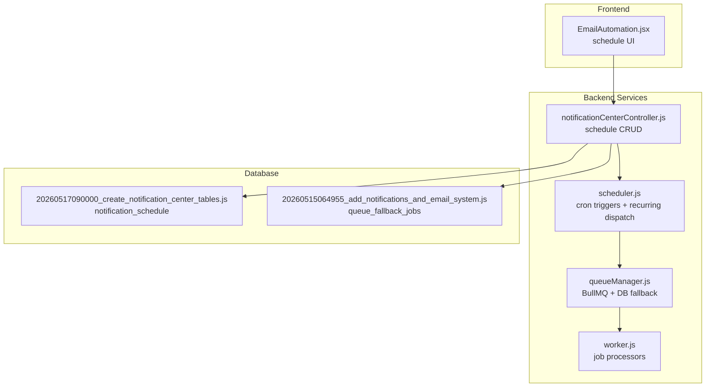
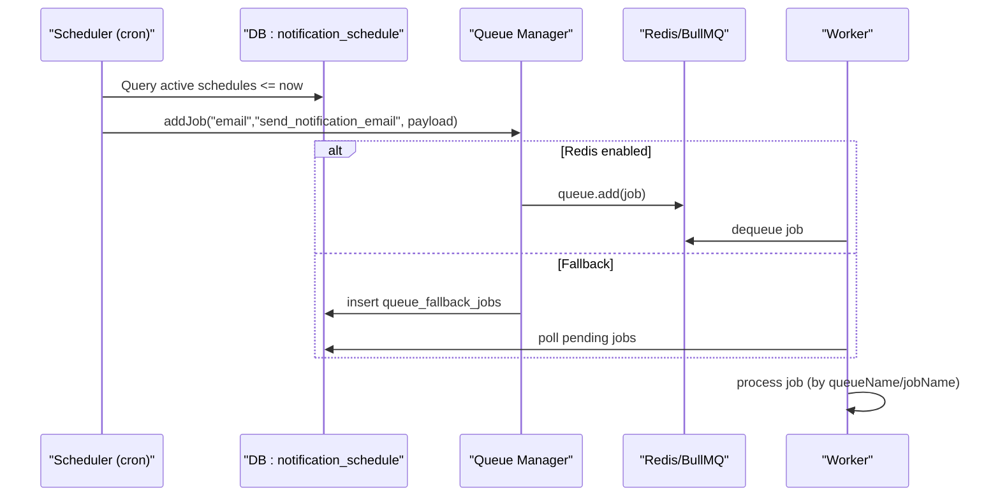
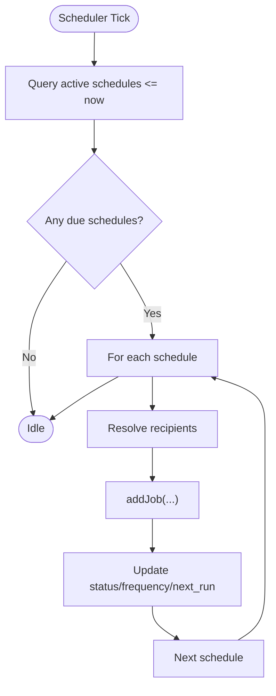
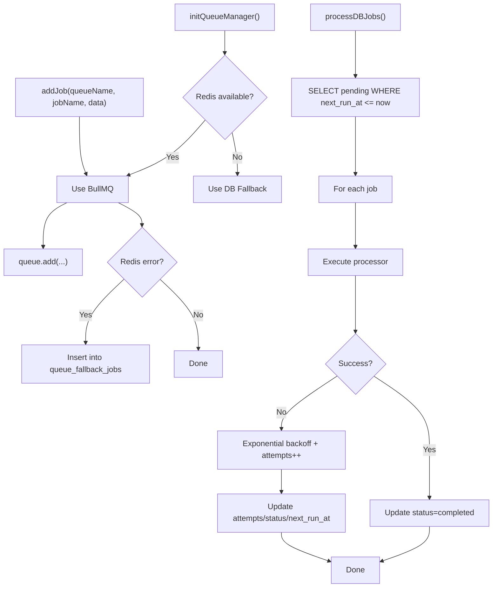
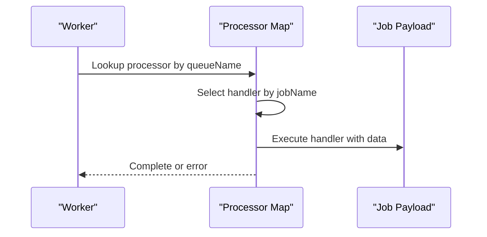
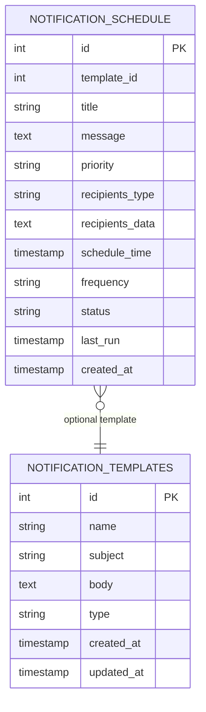
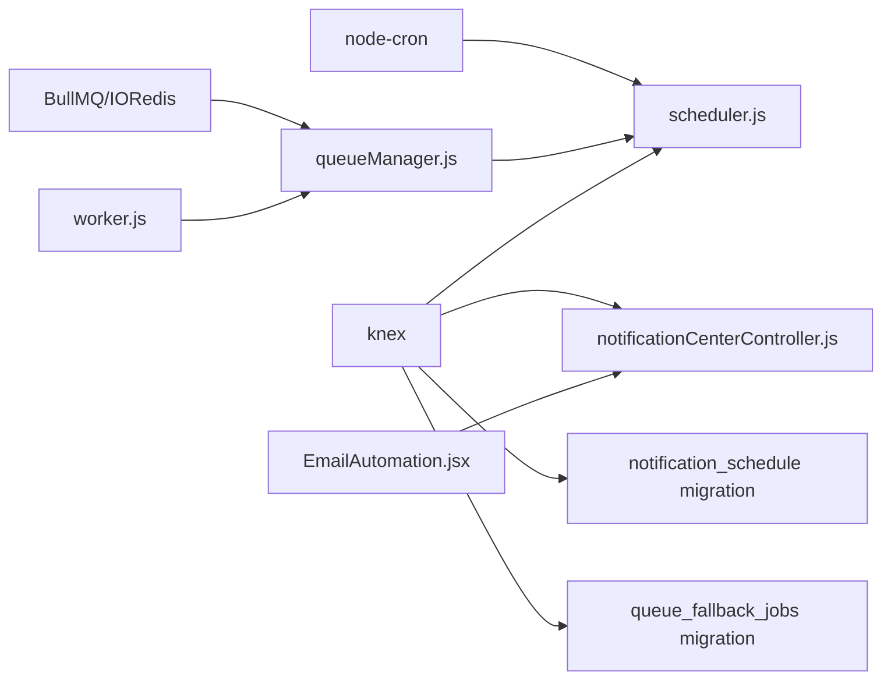

# Job Scheduling

<cite>
**Referenced Files in This Document**
- [scheduler.js](file://backend/src/services/scheduler.js)
- [queueManager.js](file://backend/src/services/queueManager.js)
- [worker.js](file://backend/src/services/worker.js)
- [notificationCenterController.js](file://backend/src/controllers/notificationCenterController.js)
- [20260517090000_create_notification_center_tables.js](file://backend/src/db/migrations/20260517090000_create_notification_center_tables.js)
- [20260515064955_add_notifications_and_email_system.js](file://backend/src/db/migrations/20260515064955_add_notifications_and_email_system.js)
- [EmailAutomation.jsx](file://frontend/src/pages/EmailAutomation.jsx)
</cite>

## Table of Contents
1. [Introduction](#introduction)
2. [Project Structure](#project-structure)
3. [Core Components](#core-components)
4. [Architecture Overview](#architecture-overview)
5. [Detailed Component Analysis](#detailed-component-analysis)
6. [Dependency Analysis](#dependency-analysis)
7. [Performance Considerations](#performance-considerations)
8. [Troubleshooting Guide](#troubleshooting-guide)
9. [Conclusion](#conclusion)

## Introduction
This document describes the job scheduling system used for cron-based scheduling, delayed execution, and recurring job management. It covers schedule configuration, timezone handling, scheduling precision, job timing mechanisms, execution intervals, schedule persistence, initialization, job registration, and monitoring. It also includes best practices, performance considerations, troubleshooting, and scheduler restart handling with job state recovery.

## Project Structure
The scheduling system spans backend services, database migrations, and a frontend UI for schedule management:
- Scheduler service defines cron-based triggers and recurring dispatch logic.
- Queue manager supports Redis-backed BullMQ and a database fallback for job execution.
- Worker processes jobs from queues.
- Controllers manage schedule CRUD operations.
- Migrations define persistent schedule storage and related tables.
- Frontend provides schedule creation and monitoring UI.

**Diagram sources**
- [scheduler.js:5-150](file://backend/src/services/scheduler.js#L5-L150)
- [queueManager.js:1-125](file://backend/src/services/queueManager.js#L1-L125)
- [worker.js:1-42](file://backend/src/services/worker.js#L1-L42)
- [notificationCenterController.js:243-286](file://backend/src/controllers/notificationCenterController.js#L243-L286)
- [20260517090000_create_notification_center_tables.js:82-100](file://backend/src/db/migrations/20260517090000_create_notification_center_tables.js#L82-L100)
- [20260515064955_add_notifications_and_email_system.js:84-98](file://backend/src/db/migrations/20260515064955_add_notifications_and_email_system.js#L84-L98)
- [EmailAutomation.jsx:1011-1066](file://frontend/src/pages/EmailAutomation.jsx#L1011-L1066)

**Section sources**
- [scheduler.js:5-150](file://backend/src/services/scheduler.js#L5-L150)
- [queueManager.js:1-125](file://backend/src/services/queueManager.js#L1-L125)
- [worker.js:1-42](file://backend/src/services/worker.js#L1-L42)
- [notificationCenterController.js:243-286](file://backend/src/controllers/notificationCenterController.js#L243-L286)
- [20260517090000_create_notification_center_tables.js:82-100](file://backend/src/db/migrations/20260517090000_create_notification_center_tables.js#L82-L100)
- [20260515064955_add_notifications_and_email_system.js:84-98](file://backend/src/db/migrations/20260515064955_add_notifications_and_email_system.js#L84-L98)
- [EmailAutomation.jsx:1011-1066](file://frontend/src/pages/EmailAutomation.jsx#L1011-L1066)

## Core Components
- Scheduler service initializes cron-based triggers and recurring dispatch logic for notifications.
- Queue manager supports Redis-backed BullMQ with automatic fallback to a database-backed queue.
- Worker processes jobs from queues based on queue names and job names.
- Controllers expose endpoints to list, create, and delete schedules.
- Migrations define persistent storage for schedules and fallback jobs.
- Frontend provides schedule creation and monitoring UI.

**Section sources**
- [scheduler.js:5-150](file://backend/src/services/scheduler.js#L5-L150)
- [queueManager.js:1-125](file://backend/src/services/queueManager.js#L1-L125)
- [worker.js:1-42](file://backend/src/services/worker.js#L1-L42)
- [notificationCenterController.js:243-286](file://backend/src/controllers/notificationCenterController.js#L243-L286)
- [20260517090000_create_notification_center_tables.js:82-100](file://backend/src/db/migrations/20260517090000_create_notification_center_tables.js#L82-L100)
- [20260515064955_add_notifications_and_email_system.js:84-98](file://backend/src/db/migrations/20260515064955_add_notifications_and_email_system.js#L84-L98)
- [EmailAutomation.jsx:1011-1066](file://frontend/src/pages/EmailAutomation.jsx#L1011-L1066)

## Architecture Overview
The system combines cron-based scheduling with a robust job execution pipeline:
- Cron triggers in the scheduler detect due schedules and enqueue jobs via the queue manager.
- Jobs are processed by workers either from Redis/BullMQ or from the database fallback.
- Schedules are persisted in the database with fields for frequency, status, and next run time.

**Diagram sources**
- [scheduler.js:42-147](file://backend/src/services/scheduler.js#L42-L147)
- [queueManager.js:61-85](file://backend/src/services/queueManager.js#L61-L85)
- [worker.js:22-37](file://backend/src/services/worker.js#L22-L37)
- [20260517090000_create_notification_center_tables.js:82-100](file://backend/src/db/migrations/20260517090000_create_notification_center_tables.js#L82-L100)
- [20260515064955_add_notifications_and_email_system.js:84-98](file://backend/src/db/migrations/20260515064955_add_notifications_and_email_system.js#L84-L98)

## Detailed Component Analysis

### Scheduler Service
- Initializes cron triggers for:
  - Daily summary reports at 11:59 PM.
  - Monthly financial reports at 1 AM on the 1st.
  - Hourly escalation checks.
  - Every 4 hours low fund checks.
  - Per-minute dispatcher for scheduled notifications.
- The per-minute dispatcher:
  - Queries active schedules whose schedule_time is less than or equal to now.
  - Resolves recipients based on recipients_type and recipients_data.
  - Enqueues jobs via the queue manager.
  - Updates schedule status and next run time according to frequency.

**Diagram sources**
- [scheduler.js:42-147](file://backend/src/services/scheduler.js#L42-L147)

**Section sources**
- [scheduler.js:5-150](file://backend/src/services/scheduler.js#L5-L150)

### Queue Manager and Fallback
- Supports Redis-backed BullMQ with automatic fallback to a database-backed queue.
- addJob writes to Redis when available; otherwise inserts into queue_fallback_jobs with next_run_at and priority.
- processDBJobs polls pending database jobs and retries with exponential backoff.

**Diagram sources**
- [queueManager.js:9-125](file://backend/src/services/queueManager.js#L9-L125)

**Section sources**
- [queueManager.js:1-125](file://backend/src/services/queueManager.js#L1-L125)

### Worker Processors
- Processes jobs from Redis/BullMQ or database fallback based on queueName and jobName.
- Email queue processor handles sending emails and scheduled reports.
- Notifications queue processor handles escalation checks.

**Diagram sources**
- [worker.js:5-20](file://backend/src/services/worker.js#L5-L20)

**Section sources**
- [worker.js:1-42](file://backend/src/services/worker.js#L1-L42)

### Schedule Persistence and Monitoring
- notification_schedule persists schedule metadata including title, message, priority, recipients_type, recipients_data, schedule_time, frequency, status, and last_run.
- Controllers provide endpoints to list, create, and delete schedules.
- Frontend displays schedules with next run and last dispatched timestamps.

**Diagram sources**
- [20260517090000_create_notification_center_tables.js:82-100](file://backend/src/db/migrations/20260517090000_create_notification_center_tables.js#L82-L100)

**Section sources**
- [notificationCenterController.js:243-286](file://backend/src/controllers/notificationCenterController.js#L243-L286)
- [20260517090000_create_notification_center_tables.js:82-100](file://backend/src/db/migrations/20260517090000_create_notification_center_tables.js#L82-L100)
- [EmailAutomation.jsx:665-697](file://frontend/src/pages/EmailAutomation.jsx#L665-L697)

## Dependency Analysis
- scheduler.js depends on:
  - node-cron for cron scheduling.
  - queueManager.js for job enqueueing.
  - knex for database queries and updates.
- queueManager.js depends on:
  - BullMQ for Redis-backed queues.
  - IORedis for Redis connectivity.
  - knex for database fallback.
- worker.js depends on:
  - BullMQ for Redis workers.
  - queueManager.js for fallback polling.
- Controllers depend on knex for schedule persistence.
- Migrations define the schema for schedules and fallback jobs.

**Diagram sources**
- [scheduler.js:1-3](file://backend/src/services/scheduler.js#L1-L3)
- [queueManager.js:1-3](file://backend/src/services/queueManager.js#L1-L3)
- [worker.js:1-3](file://backend/src/services/worker.js#L1-L3)
- [notificationCenterController.js:243-286](file://backend/src/controllers/notificationCenterController.js#L243-L286)
- [20260517090000_create_notification_center_tables.js:82-100](file://backend/src/db/migrations/20260517090000_create_notification_center_tables.js#L82-L100)
- [20260515064955_add_notifications_and_email_system.js:84-98](file://backend/src/db/migrations/20260515064955_add_notifications_and_email_system.js#L84-L98)
- [EmailAutomation.jsx:1011-1066](file://frontend/src/pages/EmailAutomation.jsx#L1011-L1066)

**Section sources**
- [scheduler.js:1-3](file://backend/src/services/scheduler.js#L1-L3)
- [queueManager.js:1-3](file://backend/src/services/queueManager.js#L1-L3)
- [worker.js:1-3](file://backend/src/services/worker.js#L1-L3)
- [notificationCenterController.js:243-286](file://backend/src/controllers/notificationCenterController.js#L243-L286)
- [20260517090000_create_notification_center_tables.js:82-100](file://backend/src/db/migrations/20260517090000_create_notification_center_tables.js#L82-L100)
- [20260515064955_add_notifications_and_email_system.js:84-98](file://backend/src/db/migrations/20260515064955_add_notifications_and_email_system.js#L84-L98)
- [EmailAutomation.jsx:1011-1066](file://frontend/src/pages/EmailAutomation.jsx#L1011-L1066)

## Performance Considerations
- Cron precision: The per-minute dispatcher ensures timely detection of due schedules. For sub-minute precision, consider reducing the cron interval or using a higher-frequency mechanism.
- Recurring schedule updates: The scheduler recalculates next run time based on schedule_time and frequency. Ensure schedule_time is set appropriately to avoid drift.
- Queue throughput: Redis-backed BullMQ offers better throughput and reliability compared to database fallback. Enable Redis for production workloads.
- Backoff strategy: Database fallback uses exponential backoff to prevent hot loops on transient failures.
- Indexing: The notification_schedule table includes an index on schedule_time to optimize queries.

[No sources needed since this section provides general guidance]

## Troubleshooting Guide
Common issues and resolutions:
- Redis connectivity errors:
  - Symptom: Redis errors logged and fallback to database queue.
  - Resolution: Verify Redis host/port and network connectivity; ensure Redis is reachable.
- Jobs not executing:
  - Symptom: Jobs remain pending.
  - Resolution: Confirm Redis availability or enable workers polling the database fallback; check queue processor mappings.
- Schedules not firing:
  - Symptom: No dispatch despite schedule_time reached.
  - Resolution: Verify cron tick runs, schedule status is active, and schedule_time is in the past or present.
- Recurring schedules stuck:
  - Symptom: Frequency does not advance next run time.
  - Resolution: Ensure the scheduler updates status and schedule_time after dispatch; confirm frequency values are valid.
- Recipient resolution failures:
  - Symptom: Empty recipient lists.
  - Resolution: Validate recipients_type and recipients_data; ensure JSON parsing succeeds.

**Section sources**
- [queueManager.js:31-51](file://backend/src/services/queueManager.js#L31-L51)
- [scheduler.js:144-146](file://backend/src/services/scheduler.js#L144-L146)
- [20260517090000_create_notification_center_tables.js:82-100](file://backend/src/db/migrations/20260517090000_create_notification_center_tables.js#L82-L100)

## Conclusion
The scheduling system combines cron-based triggers with a resilient job execution pipeline. It supports recurring schedules, flexible recipient targeting, and robust fallback mechanisms. Proper configuration of Redis, queue processors, and schedule persistence ensures reliable operation. Use the provided endpoints and UI to manage schedules effectively and monitor their execution.