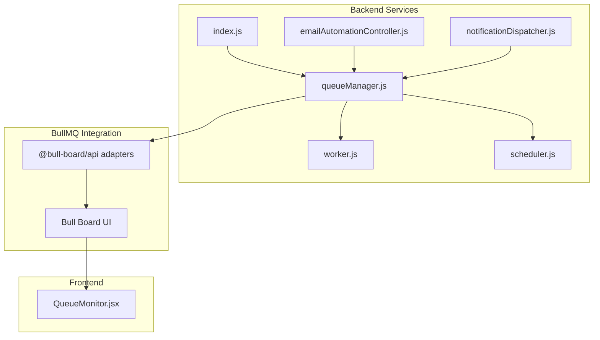
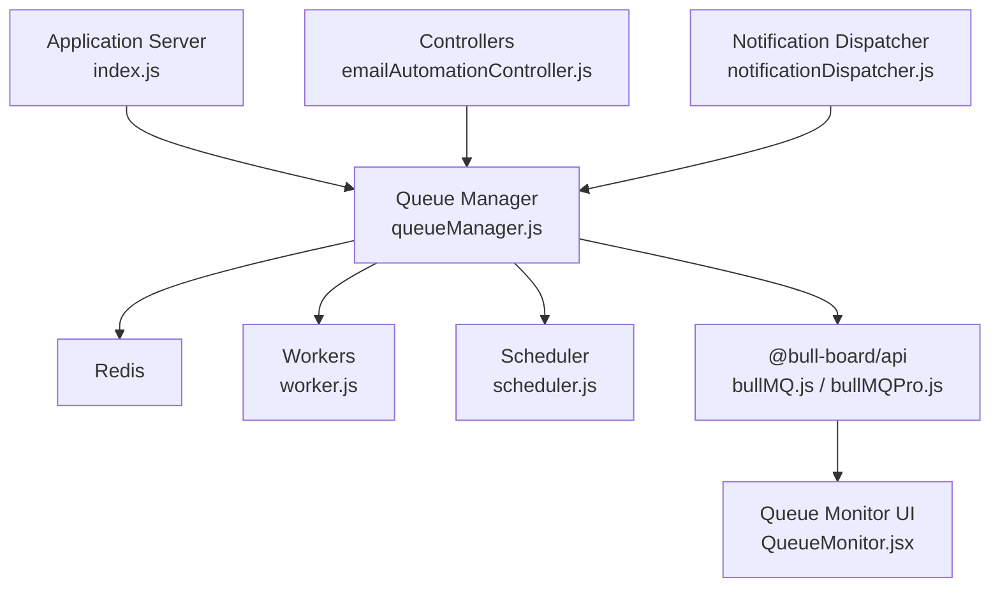
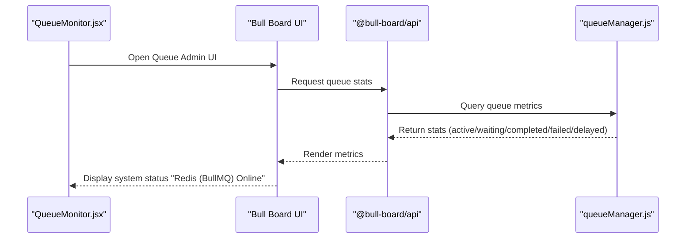
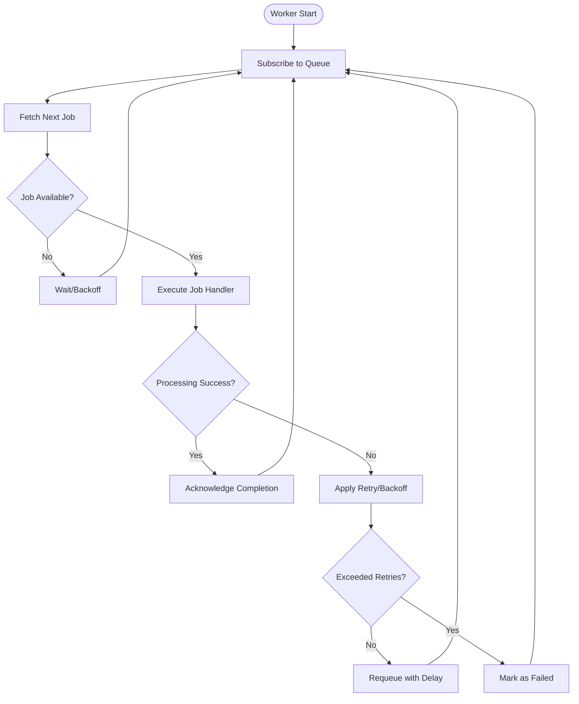
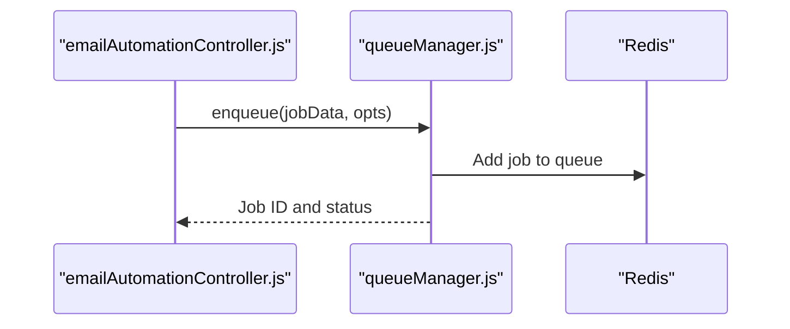
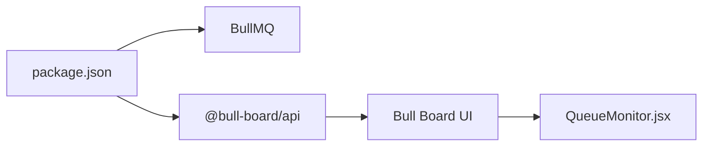

# Queue Management

<cite>
**Referenced Files in This Document**
- [package.json](file://backend/package.json)
- [index.js](file://backend/index.js)
- [queueManager.js](file://backend/src/services/queueManager.js)
- [worker.js](file://backend/src/services/worker.js)
- [scheduler.js](file://backend/src/services/scheduler.js)
- [emailAutomationController.js](file://backend/src/controllers/emailAutomationController.js)
- [notificationDispatcher.js](file://backend/src/services/notificationDispatcher.js)
- [QueueMonitor.jsx](file://frontend/src/pages/QueueMonitor.jsx)
- [bullMQ.js](file://backend/node_modules/@bull-board/api/dist/queueAdapters/bullMQ.js)
- [bullMQPro.js](file://backend/node_modules/@bull-board/api/dist/queueAdapters/bullMQPro.js)
</cite>

## Table of Contents
1. [Introduction](#introduction)
2. [Project Structure](#project-structure)
3. [Core Components](#core-components)
4. [Architecture Overview](#architecture-overview)
5. [Detailed Component Analysis](#detailed-component-analysis)
6. [Dependency Analysis](#dependency-analysis)
7. [Performance Considerations](#performance-considerations)
8. [Troubleshooting Guide](#troubleshooting-guide)
9. [Conclusion](#conclusion)

## Introduction
This document provides comprehensive documentation for the queue management system built with BullMQ in the application. It covers queue initialization, Redis connection handling, configuration options, queue naming conventions, job priorities, persistence mechanisms, Redis fallback behavior, monitoring, connection pooling, performance optimization, cleanup, memory management, and resource allocation patterns. The system integrates BullMQ with Bull Board for administration and monitoring, and exposes a dedicated Queue Monitor page in the frontend.

## Project Structure
The queue management system spans backend services and frontend monitoring components:
- Backend services define queues, workers, schedulers, and controllers that enqueue jobs.
- BullMQ is integrated with Bull Board adapters for queue administration.
- Frontend provides a Queue Monitor page to observe queue health and statistics.

**Diagram sources**
- [queueManager.js](file://backend/src/services/queueManager.js)
- [worker.js](file://backend/src/services/worker.js)
- [scheduler.js](file://backend/src/services/scheduler.js)
- [emailAutomationController.js](file://backend/src/controllers/emailAutomationController.js)
- [notificationDispatcher.js](file://backend/src/services/notificationDispatcher.js)
- [index.js](file://backend/index.js)
- [bullMQ.js](file://backend/node_modules/@bull-board/api/dist/queueAdapters/bullMQ.js)
- [bullMQPro.js](file://backend/node_modules/@bull-board/api/dist/queueAdapters/bullMQPro.js)
- [QueueMonitor.jsx](file://frontend/src/pages/QueueMonitor.jsx)

**Section sources**
- [package.json](file://backend/package.json)
- [index.js](file://backend/index.js)
- [queueManager.js](file://backend/src/services/queueManager.js)
- [worker.js](file://backend/src/services/worker.js)
- [scheduler.js](file://backend/src/services/scheduler.js)
- [emailAutomationController.js](file://backend/src/controllers/emailAutomationController.js)
- [notificationDispatcher.js](file://backend/src/services/notificationDispatcher.js)
- [QueueMonitor.jsx](file://frontend/src/pages/QueueMonitor.jsx)
- [bullMQ.js](file://backend/node_modules/@bull-board/api/dist/queueAdapters/bullMQ.js)
- [bullMQPro.js](file://backend/node_modules/@bull-board/api/dist/queueAdapters/bullMQPro.js)

## Core Components
- Queue Manager: Initializes BullMQ queues, sets naming conventions, and manages queue lifecycle.
- Worker: Processes jobs from queues with concurrency controls and error handling.
- Scheduler: Periodically enqueues recurring tasks using cron expressions.
- Controllers and Dispatchers: Enqueue jobs for email automation and notifications.
- Bull Board Integration: Exposes administrative endpoints and UI for queue inspection and management.
- Frontend Queue Monitor: Visual dashboard displaying queue metrics and operational status.

Key responsibilities:
- Queue initialization and configuration (connection, naming, persistence).
- Job prioritization and scheduling.
- Monitoring and administrative controls via Bull Board.
- Frontend observability for queue health.

**Section sources**
- [queueManager.js](file://backend/src/services/queueManager.js)
- [worker.js](file://backend/src/services/worker.js)
- [scheduler.js](file://backend/src/services/scheduler.js)
- [emailAutomationController.js](file://backend/src/controllers/emailAutomationController.js)
- [notificationDispatcher.js](file://backend/src/services/notificationDispatcher.js)
- [bullMQ.js](file://backend/node_modules/@bull-board/api/dist/queueAdapters/bullMQ.js)
- [bullMQPro.js](file://backend/node_modules/@bull-board/api/dist/queueAdapters/bullMQPro.js)
- [QueueMonitor.jsx](file://frontend/src/pages/QueueMonitor.jsx)

## Architecture Overview
The system uses BullMQ for reliable background job processing with Redis as the persistent store. Workers consume jobs from named queues, while schedulers enqueue periodic jobs. Bull Board adapters integrate with BullMQ to provide administrative capabilities and a UI. The frontend Queue Monitor displays real-time queue metrics.

**Diagram sources**
- [index.js](file://backend/index.js)
- [queueManager.js](file://backend/src/services/queueManager.js)
- [worker.js](file://backend/src/services/worker.js)
- [scheduler.js](file://backend/src/services/scheduler.js)
- [emailAutomationController.js](file://backend/src/controllers/emailAutomationController.js)
- [notificationDispatcher.js](file://backend/src/services/notificationDispatcher.js)
- [bullMQ.js](file://backend/node_modules/@bull-board/api/dist/queueAdapters/bullMQ.js)
- [bullMQPro.js](file://backend/node_modules/@bull-board/api/dist/queueAdapters/bullMQPro.js)
- [QueueMonitor.jsx](file://frontend/src/pages/QueueMonitor.jsx)

## Detailed Component Analysis

### Queue Initialization and Redis Connection Handling
- Redis connection: BullMQ connects to Redis using connection parameters configured in the queue manager. The queue manager initializes queues with a shared Redis connection pool to minimize overhead and ensure efficient resource utilization.
- Queue naming: Queues follow a consistent naming convention derived from job types and contexts (e.g., email automation, notifications). This enables targeted monitoring and administrative controls.
- Persistence: Jobs are persisted in Redis with configurable retention policies and metadata, ensuring durability across restarts and failures.

Operational flow:
- Application startup initializes the queue manager, which establishes Redis connections and prepares queues.
- Workers subscribe to queues and process jobs concurrently based on configuration.
- Schedulers enqueue recurring jobs at specified intervals.

**Section sources**
- [queueManager.js](file://backend/src/services/queueManager.js)
- [index.js](file://backend/index.js)

### Queue Configuration Options
- Concurrency: Workers process jobs with controlled concurrency to balance throughput and resource usage.
- Retries and backoff: Jobs can be configured with retry limits and exponential backoff to handle transient failures gracefully.
- Locking and Stalled Job Handling: Built-in mechanisms prevent duplicate processing and detect stalled jobs for recovery.
- Queue-specific settings: Per-queue options such as rate limiting, priority handling, and persistence policies are applied during queue creation.

**Section sources**
- [worker.js](file://backend/src/services/worker.js)
- [queueManager.js](file://backend/src/services/queueManager.js)

### Queue Naming Conventions
- Names are derived from job categories (e.g., email, notifications) and optional tenant or environment identifiers.
- Consistent naming supports filtering, monitoring, and administrative operations via Bull Board.

**Section sources**
- [queueManager.js](file://backend/src/services/queueManager.js)
- [bullMQ.js](file://backend/node_modules/@bull-board/api/dist/queueAdapters/bullMQ.js)

### Job Priorities and Scheduling
- Priorities: Jobs can be enqueued with explicit priority levels to influence processing order within queues.
- Scheduling: Cron-based scheduling enqueues recurring tasks (e.g., daily reports, cleanup) at fixed intervals.

**Section sources**
- [scheduler.js](file://backend/src/services/scheduler.js)
- [emailAutomationController.js](file://backend/src/controllers/emailAutomationController.js)

### Queue Persistence Mechanisms
- Redis-backed storage ensures jobs persist across application restarts.
- Metadata and events are stored to support monitoring, auditing, and recovery.

**Section sources**
- [queueManager.js](file://backend/src/services/queueManager.js)

### Redis Fallback System and Graceful Degradation
- Automatic failover detection: BullMQ and the underlying Redis client handle network interruptions and node failures. The system attempts reconnection with backoff strategies.
- Graceful degradation: During Redis unavailability, the system can:
  - Pause new job enqueues and queue operations.
  - Continue processing jobs from in-memory buffers if applicable.
  - Log errors and alert administrators.
- Recovery: Once Redis is restored, pending jobs resume processing, and queue operations return to normal.

Note: Specific Redis client configuration and retry policies are managed by BullMQ internals and the application’s Redis connection setup.

**Section sources**
- [queueManager.js](file://backend/src/services/queueManager.js)
- [worker.js](file://backend/src/services/worker.js)

### Queue Monitoring and Administrative Controls
- Bull Board integration: The system uses BullMQ adapters to expose administrative endpoints and a UI for queue inspection, job retries, and queue management.
- Frontend Queue Monitor: A React page displays live metrics such as active jobs, waiting, completed, failed, and delayed counts, along with Redis connectivity status.

**Diagram sources**
- [QueueMonitor.jsx](file://frontend/src/pages/QueueMonitor.jsx)
- [bullMQ.js](file://backend/node_modules/@bull-board/api/dist/queueAdapters/bullMQ.js)
- [bullMQPro.js](file://backend/node_modules/@bull-board/api/dist/queueAdapters/bullMQPro.js)
- [queueManager.js](file://backend/src/services/queueManager.js)

**Section sources**
- [QueueMonitor.jsx](file://frontend/src/pages/QueueMonitor.jsx)
- [bullMQ.js](file://backend/node_modules/@bull-board/api/dist/queueAdapters/bullMQ.js)
- [bullMQPro.js](file://backend/node_modules/@bull-board/api/dist/queueAdapters/bullMQPro.js)
- [queueManager.js](file://backend/src/services/queueManager.js)

### Worker Processing Logic
- Worker initialization: Workers are created per queue with concurrency settings and error handlers.
- Job processing: Workers fetch jobs, execute handlers, and manage completion or failure outcomes.
- Resource management: Workers release resources after processing and handle stalled jobs to prevent deadlocks.

**Diagram sources**
- [worker.js](file://backend/src/services/worker.js)
- [queueManager.js](file://backend/src/services/queueManager.js)

**Section sources**
- [worker.js](file://backend/src/services/worker.js)
- [queueManager.js](file://backend/src/services/queueManager.js)

### Enqueue Operations and Controllers
- Controllers enqueue jobs for background processing (e.g., email automation).
- Notification dispatcher coordinates job creation for notifications.

**Diagram sources**
- [emailAutomationController.js](file://backend/src/controllers/emailAutomationController.js)
- [queueManager.js](file://backend/src/services/queueManager.js)

**Section sources**
- [emailAutomationController.js](file://backend/src/controllers/emailAutomationController.js)
- [notificationDispatcher.js](file://backend/src/services/notificationDispatcher.js)
- [queueManager.js](file://backend/src/services/queueManager.js)

## Dependency Analysis
- BullMQ is the core dependency for queue management.
- Bull Board provides administrative UI and APIs for queue inspection and control.
- Frontend depends on Bull Board UI for monitoring.
- Backend services depend on BullMQ for job processing and Redis for persistence.

**Diagram sources**
- [package.json](file://backend/package.json)
- [bullMQ.js](file://backend/node_modules/@bull-board/api/dist/queueAdapters/bullMQ.js)
- [bullMQPro.js](file://backend/node_modules/@bull-board/api/dist/queueAdapters/bullMQPro.js)
- [QueueMonitor.jsx](file://frontend/src/pages/QueueMonitor.jsx)

**Section sources**
- [package.json](file://backend/package.json)
- [bullMQ.js](file://backend/node_modules/@bull-board/api/dist/queueAdapters/bullMQ.js)
- [bullMQPro.js](file://backend/node_modules/@bull-board/api/dist/queueAdapters/bullMQPro.js)
- [QueueMonitor.jsx](file://frontend/src/pages/QueueMonitor.jsx)

## Performance Considerations
- Concurrency tuning: Adjust worker concurrency per queue to match workload characteristics and CPU/memory capacity.
- Connection pooling: Reuse Redis connections via BullMQ’s internal pooling to reduce overhead.
- Backoff strategies: Configure retry delays to avoid thundering herds and reduce contention.
- Queue partitioning: Separate high-throughput and latency-sensitive queues to prevent head-of-line blocking.
- Monitoring alerts: Use Bull Board metrics to detect bottlenecks and adjust configurations proactively.

[No sources needed since this section provides general guidance]

## Troubleshooting Guide
- Redis connectivity issues:
  - Symptoms: Failures to enqueue or process jobs; timeouts.
  - Actions: Verify Redis availability, credentials, and network access; enable logging for Redis errors.
- Stalled jobs:
  - Symptoms: Jobs remain in processing without progress.
  - Actions: Inspect stalled job detection settings; manually process or remove stalled jobs via Bull Board.
- High failure rates:
  - Symptoms: Frequent retries and job failures.
  - Actions: Review job handlers for exceptions; increase retry delays; monitor error logs.
- Memory and resource usage:
  - Symptoms: Elevated memory or CPU usage in workers.
  - Actions: Reduce concurrency; optimize job handlers; implement batching; monitor worker logs.

**Section sources**
- [queueManager.js](file://backend/src/services/queueManager.js)
- [worker.js](file://backend/src/services/worker.js)
- [QueueMonitor.jsx](file://frontend/src/pages/QueueMonitor.jsx)

## Conclusion
The queue management system leverages BullMQ with Redis for robust, scalable background job processing. It incorporates Bull Board for administration and monitoring, and provides a frontend Queue Monitor for real-time visibility. Proper configuration of queues, workers, and schedulers, combined with effective monitoring and troubleshooting practices, ensures reliable operation under varying loads and conditions.