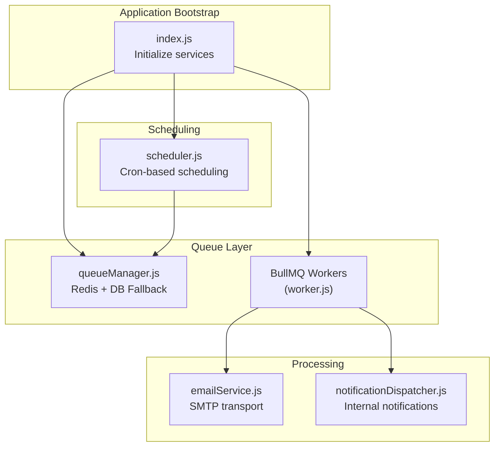
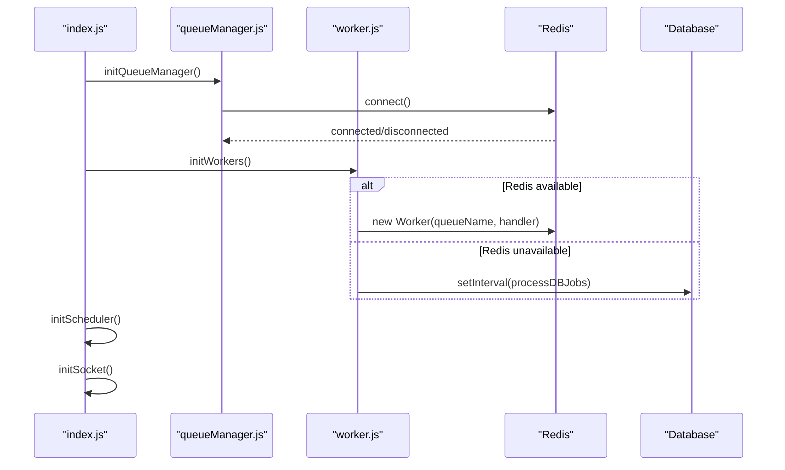
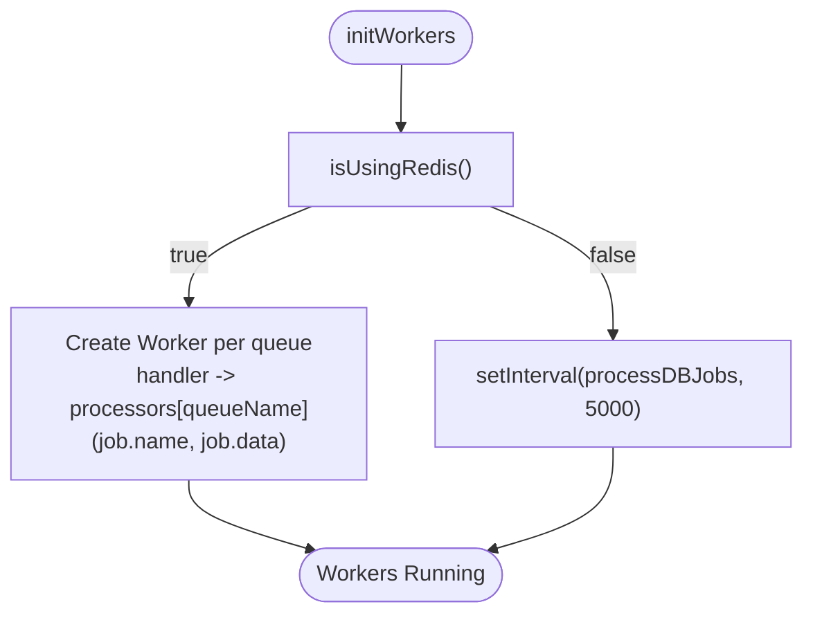
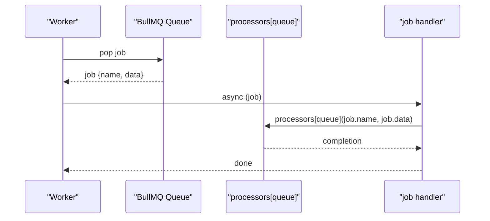
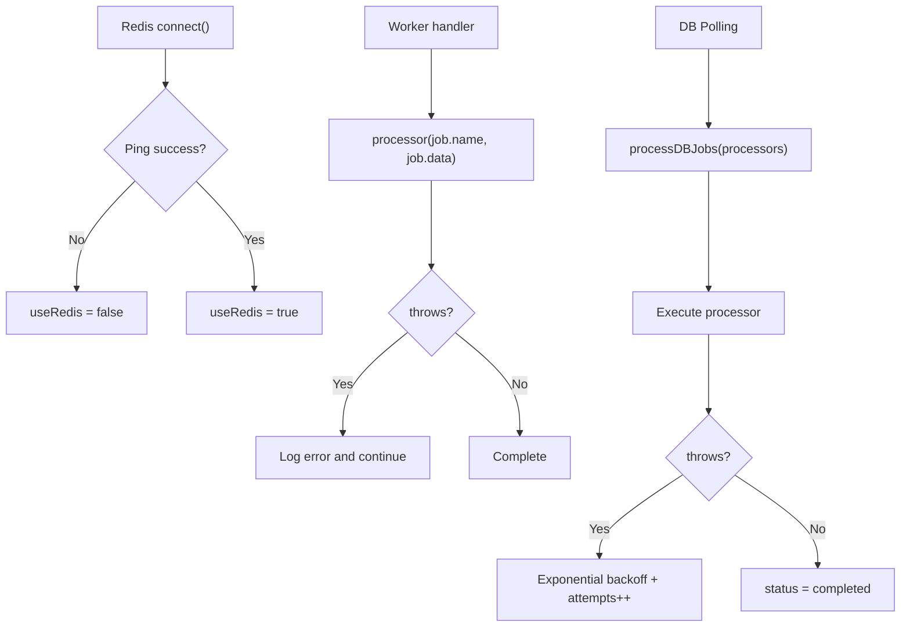
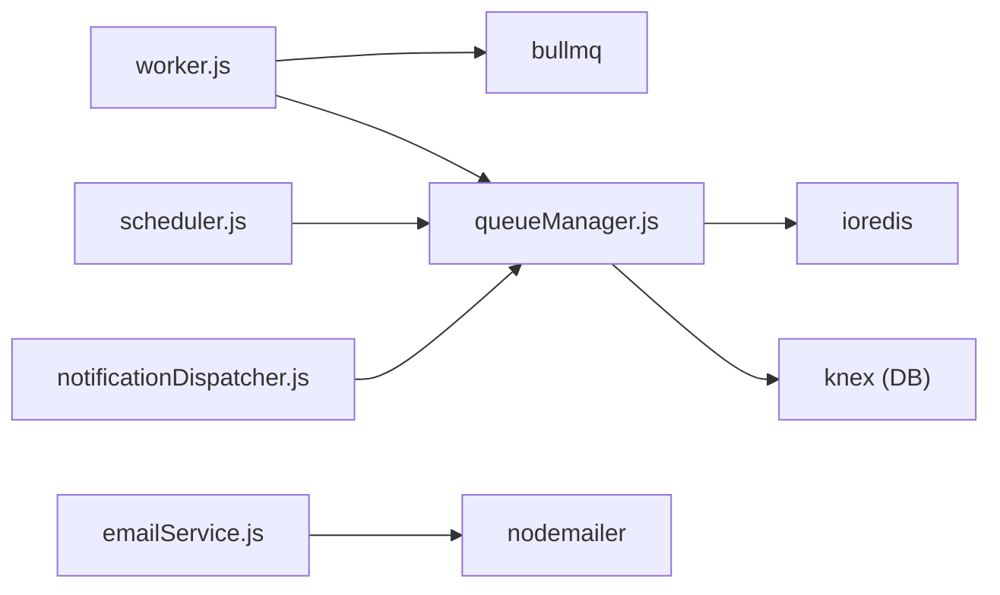

# Worker Processes

<cite>
**Referenced Files in This Document**
- [worker.js](file://backend/src/services/worker.js)
- [queueManager.js](file://backend/src/services/queueManager.js)
- [scheduler.js](file://backend/src/services/scheduler.js)
- [emailService.js](file://backend/src/services/emailService.js)
- [notificationDispatcher.js](file://backend/src/services/notificationDispatcher.js)
- [index.js](file://backend/src/index.js)
- [package.json](file://backend/package.json)
</cite>

## Table of Contents
1. [Introduction](#introduction)
2. [Project Structure](#project-structure)
3. [Core Components](#core-components)
4. [Architecture Overview](#architecture-overview)
5. [Detailed Component Analysis](#detailed-component-analysis)
6. [Dependency Analysis](#dependency-analysis)
7. [Performance Considerations](#performance-considerations)
8. [Troubleshooting Guide](#troubleshooting-guide)
9. [Conclusion](#conclusion)

## Introduction
This document explains the worker process implementation and job processing workflows in the backend. It covers worker initialization, job processing callbacks, error handling, concurrency limits, resource management, lifecycle management, graceful shutdown procedures, process supervision, timeouts, memory leak prevention, performance monitoring, worker scaling, load balancing, and distributed processing considerations. The system uses BullMQ for Redis-backed queues with a database fallback mechanism for environments without Redis.

## Project Structure
The worker system is composed of:
- Worker initialization and processors
- Queue manager for Redis and database fallback
- Scheduler for recurring tasks
- Email service for sending emails
- Notification dispatcher for internal notifications
- Application bootstrap that initializes services

**Diagram sources**
- [index.js:127-149](file://backend/src/index.js#L127-L149)
- [queueManager.js:9-52](file://backend/src/services/queueManager.js#L9-L52)
- [worker.js:22-37](file://backend/src/services/worker.js#L22-L37)
- [scheduler.js:5-41](file://backend/src/services/scheduler.js#L5-L41)
- [emailService.js:11-30](file://backend/src/services/emailService.js#L11-L30)
- [notificationDispatcher.js:5-63](file://backend/src/services/notificationDispatcher.js#L5-L63)

**Section sources**
- [index.js:127-149](file://backend/src/index.js#L127-L149)
- [package.json:17-38](file://backend/package.json#L17-L38)

## Core Components
- Worker initialization and processors: Creates BullMQ workers per queue and defines job handlers for email and notifications.
- Queue manager: Initializes Redis connection, manages BullMQ queues, and falls back to database polling when Redis is unavailable.
- Scheduler: Uses cron to enqueue periodic jobs for reports, escalations, low fund checks, and scheduled notifications.
- Email service: Provides SMTP transport and templating for email delivery.
- Notification dispatcher: Handles in-app notifications and optionally triggers email notifications.

**Section sources**
- [worker.js:5-20](file://backend/src/services/worker.js#L5-L20)
- [queueManager.js:54-85](file://backend/src/services/queueManager.js#L54-L85)
- [scheduler.js:5-41](file://backend/src/services/scheduler.js#L5-L41)
- [emailService.js:11-30](file://backend/src/services/emailService.js#L11-L30)
- [notificationDispatcher.js:5-63](file://backend/src/services/notificationDispatcher.js#L5-L63)

## Architecture Overview
The system initializes services in a specific order: queue manager, workers, scheduler, and socket service. When Redis is available, BullMQ workers consume jobs from queues. When Redis is unavailable, a database polling mechanism processes queued jobs. The scheduler periodically enqueues jobs into the appropriate queues.

**Diagram sources**
- [index.js:127-149](file://backend/src/index.js#L127-L149)
- [queueManager.js:9-52](file://backend/src/services/queueManager.js#L9-L52)
- [worker.js:22-37](file://backend/src/services/worker.js#L22-L37)

## Detailed Component Analysis

### Worker Initialization and Job Processing Callbacks
- Processor map defines handlers for each queue:
  - email: processes send_notification_email and send_scheduled_report
  - notifications: processes escalation_check
- Worker creation:
  - If Redis is available, creates a Worker per queue with a handler that invokes the processor by job name.
  - If Redis is unavailable, starts a polling interval that calls processDBJobs to handle database-backed jobs.

**Diagram sources**
- [worker.js:22-37](file://backend/src/services/worker.js#L22-L37)

**Section sources**
- [worker.js:5-20](file://backend/src/services/worker.js#L5-L20)
- [worker.js:22-37](file://backend/src/services/worker.js#L22-L37)

### Job Execution Patterns and Concurrency Limits
- BullMQ Worker constructor accepts a connection object; concurrency is managed by BullMQ defaults unless overridden.
- The code does not explicitly set concurrency in the Worker constructor, implying default behavior.
- Bull Board integration exposes queue controls including concurrency settings when Redis is enabled.

**Diagram sources**
- [worker.js:26-28](file://backend/src/services/worker.js#L26-L28)
- [index.js:134-148](file://backend/src/index.js#L134-L148)

**Section sources**
- [worker.js:26-28](file://backend/src/services/worker.js#L26-L28)
- [index.js:134-148](file://backend/src/index.js#L134-L148)

### Error Handling Mechanisms
- Redis connection:
  - Retry strategy with capped retries; on repeated failures, sets a flag to use database fallback.
  - Emits error events; logs warnings and switches to database mode.
- Database fallback:
  - processDBJobs iterates pending jobs, executes processor, updates status, and schedules retries with exponential backoff.
- Email service:
  - Validates SMTP configuration and logs warnings when not configured.
  - Writes email logs with status and error messages.

**Diagram sources**
- [queueManager.js:16-51](file://backend/src/services/queueManager.js#L16-L51)
- [queueManager.js:87-116](file://backend/src/services/queueManager.js#L87-L116)
- [emailService.js:41-103](file://backend/src/services/emailService.js#L41-L103)

**Section sources**
- [queueManager.js:16-51](file://backend/src/services/queueManager.js#L16-L51)
- [queueManager.js:87-116](file://backend/src/services/queueManager.js#L87-L116)
- [emailService.js:41-103](file://backend/src/services/emailService.js#L41-L103)

### Resource Management and Memory Leak Prevention
- Worker lifecycle:
  - Workers are created at startup and persist for the lifetime of the process.
  - No explicit cleanup or graceful shutdown logic is present in the worker initialization code.
- Database polling:
  - Uses setInterval; ensure to cancel intervals on shutdown for graceful termination.
- Email transport:
  - Transporter is lazily created and reused; ensure proper disposal if needed.

Recommendations:
- Implement graceful shutdown to clear intervals and close connections.
- Monitor memory usage and restart unhealthy workers if necessary.

**Section sources**
- [worker.js:33-35](file://backend/src/services/worker.js#L33-L35)
- [emailService.js:16-30](file://backend/src/services/emailService.js#L16-L30)

### Worker Lifecycle Management and Graceful Shutdown
Current behavior:
- Workers are started at application boot and remain active.
- No explicit signal handlers or cleanup routines are implemented.

Recommended improvements:
- Register SIGTERM/SIGINT handlers to stop polling intervals and exit gracefully.
- Close Redis connections and dispose of resources before process exit.

**Section sources**
- [worker.js:22-37](file://backend/src/services/worker.js#L22-L37)
- [index.js:127-149](file://backend/src/index.js#L127-L149)

### Process Supervision
- The system relies on external process supervisors (e.g., PM2, systemd) to manage process lifecycle.
- Bull Board provides operational visibility for queue health and job states.

**Section sources**
- [index.js:134-148](file://backend/src/index.js#L134-L148)

### Job Timeout Handling
- The code does not configure job timeouts in the Worker constructor or queue options.
- Consider adding timeout options to job processing to prevent long-running jobs from blocking workers.

**Section sources**
- [worker.js:26-28](file://backend/src/services/worker.js#L26-L28)
- [queueManager.js:61-85](file://backend/src/services/queueManager.js#L61-L85)

### Performance Monitoring
- Bull Board integration exposes queue statistics and job states when Redis is available.
- The frontend includes a queue monitor page indicating system status and counts.

**Section sources**
- [index.js:134-148](file://backend/src/index.js#L134-L148)
- [package.json:18-21](file://backend/package.json#L18-L21)

### Worker Scaling and Load Balancing
- Horizontal scaling:
  - Multiple worker processes can run against the same Redis instance; BullMQ distributes jobs among workers automatically.
- Vertical scaling:
  - Increase worker count per queue to improve throughput.
- Load balancing:
  - Use separate queues for different job types to balance load across workers.

**Section sources**
- [worker.js:25-29](file://backend/src/services/worker.js#L25-L29)
- [index.js:134-148](file://backend/src/index.js#L134-L148)

### Distributed Processing Considerations
- Redis acts as a shared broker for jobs across multiple worker instances.
- Database fallback mode disables distributed processing; ensure Redis is available for distributed scaling.

**Section sources**
- [queueManager.js:9-52](file://backend/src/services/queueManager.js#L9-L52)
- [worker.js:30-36](file://backend/src/services/worker.js#L30-L36)

## Dependency Analysis
The worker system depends on BullMQ for queueing, IORedis for Redis connectivity, and Knex for database operations in fallback mode. The scheduler depends on node-cron and the queue manager to enqueue jobs.

**Diagram sources**
- [worker.js:1-3](file://backend/src/services/worker.js#L1-L3)
- [queueManager.js:1-3](file://backend/src/services/queueManager.js#L1-L3)
- [scheduler.js:1-3](file://backend/src/services/scheduler.js#L1-L3)
- [emailService.js:1-2](file://backend/src/services/emailService.js#L1-L2)
- [notificationDispatcher.js:1-3](file://backend/src/services/notificationDispatcher.js#L1-L3)

**Section sources**
- [package.json:17-38](file://backend/package.json#L17-L38)

## Performance Considerations
- Use Redis for distributed processing and horizontal scaling.
- Configure BullMQ queue options (attempts, backoff) to handle transient failures.
- Monitor queue length and job latency via Bull Board.
- Avoid heavy synchronous operations inside job handlers; delegate to external services when possible.

## Troubleshooting Guide
Common issues and resolutions:
- Redis connectivity problems:
  - Symptoms: frequent fallback to database polling, warnings about Redis errors.
  - Resolution: verify Redis credentials and network; ensure ping succeeds; consider retry strategy tuning.
- Database fallback job failures:
  - Symptoms: jobs stuck in pending with increasing attempts.
  - Resolution: inspect processor logic, fix exceptions, and confirm exponential backoff behavior.
- Email delivery failures:
  - Symptoms: email logs show failed status with error messages.
  - Resolution: verify SMTP configuration, templates, and attachment paths.

**Section sources**
- [queueManager.js:16-51](file://backend/src/services/queueManager.js#L16-L51)
- [queueManager.js:87-116](file://backend/src/services/queueManager.js#L87-L116)
- [emailService.js:41-103](file://backend/src/services/emailService.js#L41-L103)

## Conclusion
The worker system leverages BullMQ for scalable, distributed job processing with a robust database fallback. Workers are initialized at startup, and job processing is handled by queue-specific processors. Error handling is implemented at multiple layers, and Bull Board provides operational insights. To enhance reliability, implement graceful shutdown, configure timeouts, and monitor performance metrics. For distributed processing, ensure Redis availability and scale workers horizontally as needed.