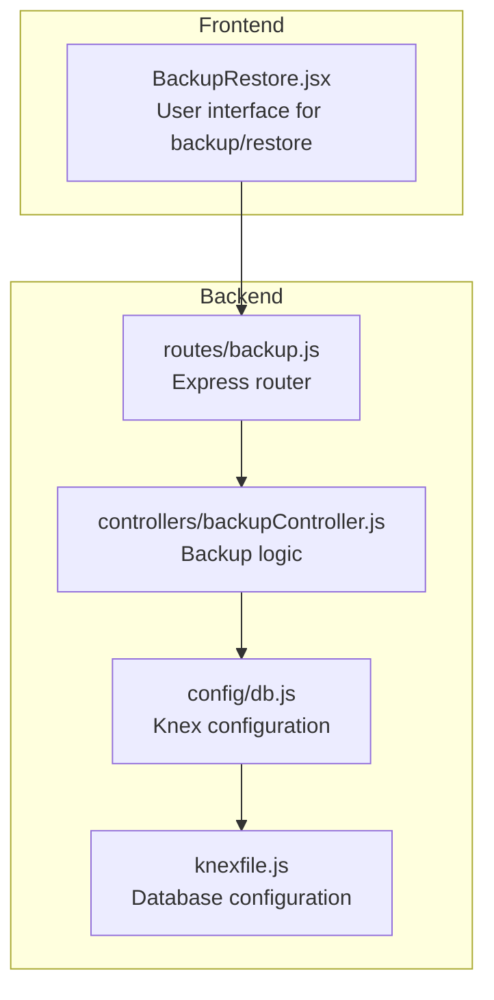
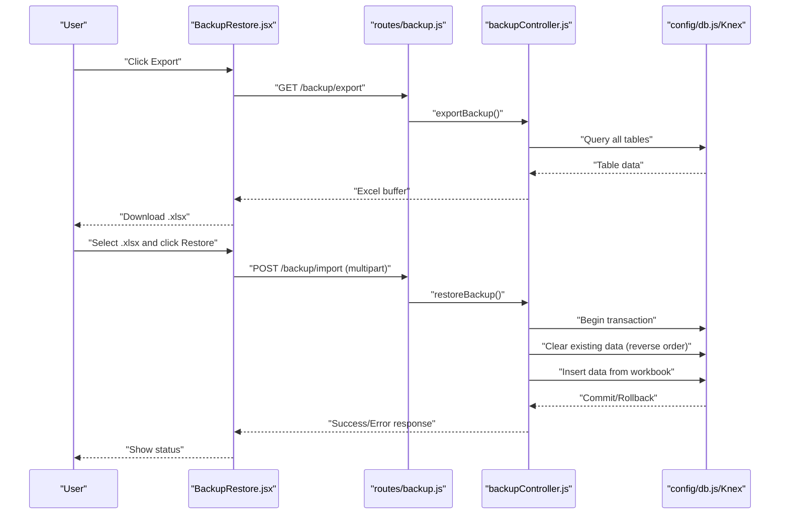
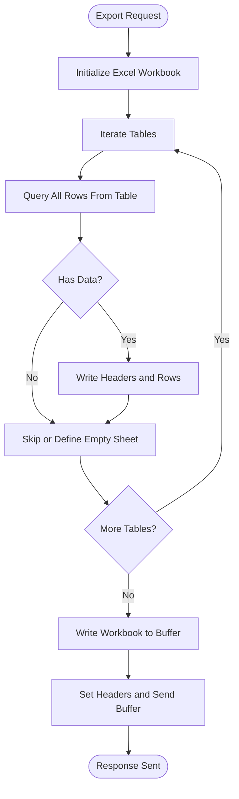
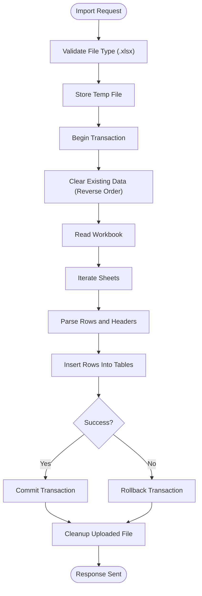
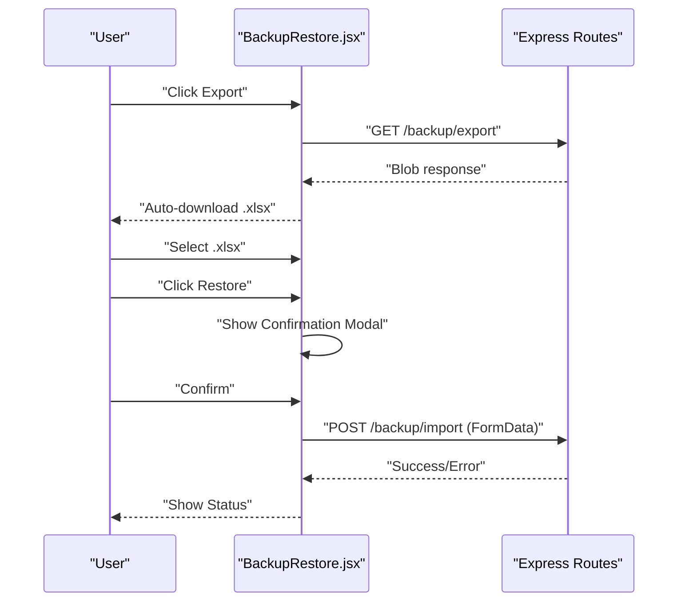
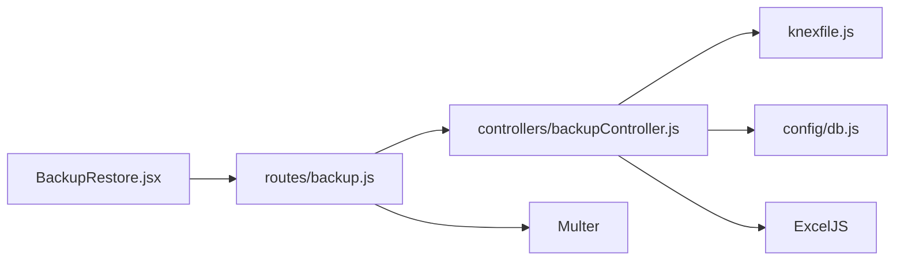

# Backup & Recovery

<cite>
**Referenced Files in This Document**
- [backupController.js](file://backend/src/controllers/backupController.js)
- [backup.js](file://backend/src/routes/backup.js)
- [BackupRestore.jsx](file://frontend/src/pages/BackupRestore.jsx)
- [scheduler.js](file://backend/src/services/scheduler.js)
- [db.js](file://backend/src/config/db.js)
- [knexfile.js](file://backend/knexfile.js)
- [create_db.js](file://backend/src/utils/create_db.js)
- [package.json](file://backend/package.json)
- [deployment_guide.md](file://deployment_guide.md)
- [USER_MANUAL.md](file://USER_MANUAL.md)
</cite>

## Table of Contents
1. [Introduction](#introduction)
2. [Project Structure](#project-structure)
3. [Core Components](#core-components)
4. [Architecture Overview](#architecture-overview)
5. [Detailed Component Analysis](#detailed-component-analysis)
6. [Dependency Analysis](#dependency-analysis)
7. [Performance Considerations](#performance-considerations)
8. [Troubleshooting Guide](#troubleshooting-guide)
9. [Conclusion](#conclusion)
10. [Appendices](#appendices)

## Introduction
This document provides comprehensive backup and recovery procedures for the NKB Petty Cash System. It covers system backup procedures, data export/import capabilities, and disaster recovery processes. It also documents automated backup schedules, manual backup operations, incremental backup strategies, database backup, file storage backup, configuration backup, restore procedures, data validation, rollback capabilities, backup monitoring and alerting, retention policies, backup security and encryption, offsite storage considerations, and integration with system maintenance and deployment procedures.

## Project Structure
The backup and restore functionality is implemented as a dedicated module within the backend service and surfaced through a frontend page. The backend exposes two endpoints: one for exporting a consolidated Excel backup and another for importing and restoring from an Excel backup file. The frontend provides a guided user interface for initiating backups and restores with safety warnings and confirmation steps.

**Diagram sources**
- [backup.js:1-33](file://backend/src/routes/backup.js#L1-L33)
- [backupController.js:1-137](file://backend/src/controllers/backupController.js#L1-L137)
- [db.js:1-8](file://backend/src/config/db.js#L1-L8)
- [knexfile.js:1-37](file://backend/knexfile.js#L1-L37)

**Section sources**
- [backup.js:1-33](file://backend/src/routes/backup.js#L1-L33)
- [backupController.js:1-137](file://backend/src/controllers/backupController.js#L1-L137)
- [db.js:1-8](file://backend/src/config/db.js#L1-L8)
- [knexfile.js:1-37](file://backend/knexfile.js#L1-L37)

## Core Components
- Backup Export Endpoint: Generates a consolidated Excel workbook containing all system tables and streams it to the client.
- Backup Import Endpoint: Accepts an Excel file, validates the file type, and performs a transactional restore by clearing existing data and inserting data from the workbook.
- Frontend Backup Page: Provides a guided interface for exporting backups and restoring from backups with confirmation and warnings.
- Database Layer: Uses Knex.js for database queries and transactions.
- Scheduler: Provides automated job scheduling for system tasks (not backups), which can inform backup timing and coordination.

Key responsibilities:
- Export: Collects data from predefined tables and writes to an Excel workbook.
- Import: Validates file type, clears existing data in dependency-aware order, inserts new data, and handles transaction commit/rollback.
- UI: Ensures authorized access and provides user feedback and warnings.

**Section sources**
- [backupController.js:6-56](file://backend/src/controllers/backupController.js#L6-L56)
- [backupController.js:58-136](file://backend/src/controllers/backupController.js#L58-L136)
- [backup.js:8-30](file://backend/src/routes/backup.js#L8-L30)
- [BackupRestore.jsx:12-65](file://frontend/src/pages/BackupRestore.jsx#L12-L65)
- [scheduler.js:1-155](file://backend/src/services/scheduler.js#L1-L155)

## Architecture Overview
The backup and restore architecture consists of a frontend page that communicates with backend routes. The routes enforce authorization and delegate to the controller, which interacts with the database through Knex. The controller reads/writes Excel files using ExcelJS.

**Diagram sources**
- [BackupRestore.jsx:12-65](file://frontend/src/pages/BackupRestore.jsx#L12-L65)
- [backup.js:29-30](file://backend/src/routes/backup.js#L29-L30)
- [backupController.js:6-56](file://backend/src/controllers/backupController.js#L6-L56)
- [backupController.js:58-136](file://backend/src/controllers/backupController.js#L58-L136)
- [db.js:1-8](file://backend/src/config/db.js#L1-L8)

## Detailed Component Analysis

### Backup Export Workflow
The export endpoint creates an Excel workbook and writes data from multiple tables. It sets appropriate headers for file download and returns the workbook buffer.

**Diagram sources**
- [backupController.js:6-56](file://backend/src/controllers/backupController.js#L6-L56)

**Section sources**
- [backupController.js:6-56](file://backend/src/controllers/backupController.js#L6-L56)

### Backup Import and Restore Workflow
The import endpoint validates the file type, starts a transaction, clears existing data in dependency-aware reverse order, and inserts data from the workbook. It commits on success and rolls back on error, cleaning up uploaded files.

**Diagram sources**
- [backup.js:8-27](file://backend/src/routes/backup.js#L8-L27)
- [backupController.js:58-136](file://backend/src/controllers/backupController.js#L58-L136)

**Section sources**
- [backup.js:8-27](file://backend/src/routes/backup.js#L8-L27)
- [backupController.js:58-136](file://backend/src/controllers/backupController.js#L58-L136)

### Frontend Backup Page Interactions
The frontend provides a guided experience with loading states, status messages, file selection, and confirmation modals. It ensures only authorized users can trigger backups and restores.

**Diagram sources**
- [BackupRestore.jsx:12-65](file://frontend/src/pages/BackupRestore.jsx#L12-L65)
- [backup.js:29-30](file://backend/src/routes/backup.js#L29-L30)

**Section sources**
- [BackupRestore.jsx:12-65](file://frontend/src/pages/BackupRestore.jsx#L12-L65)
- [backup.js:29-30](file://backend/src/routes/backup.js#L29-L30)

### Database and Configuration
- Database configuration is managed via Knex with separate environments for development and production.
- The database client is MySQL2, and migrations/seeds directories are configured.
- A utility script demonstrates database creation for local development.

**Section sources**
- [knexfile.js:1-37](file://backend/knexfile.js#L1-L37)
- [db.js:1-8](file://backend/src/config/db.js#L1-L8)
- [create_db.js:1-29](file://backend/src/utils/create_db.js#L1-L29)

### Scheduler and Backup Coordination
While the scheduler does not directly manage backups, it runs periodic tasks that can inform backup timing and system health checks. It schedules daily summaries, monthly reports, escalation checks, low fund alerts, and notification dispatches.

**Section sources**
- [scheduler.js:1-155](file://backend/src/services/scheduler.js#L1-L155)

## Dependency Analysis
The backup module depends on:
- Express routes for HTTP handling and Multer for file uploads.
- ExcelJS for reading/writing Excel workbooks.
- Knex for database queries and transactions.
- Frontend API service for HTTP requests.

**Diagram sources**
- [BackupRestore.jsx:1-210](file://frontend/src/pages/BackupRestore.jsx#L1-L210)
- [backup.js:1-33](file://backend/src/routes/backup.js#L1-L33)
- [backupController.js:1-137](file://backend/src/controllers/backupController.js#L1-L137)
- [knexfile.js:1-37](file://backend/knexfile.js#L1-L37)
- [db.js:1-8](file://backend/src/config/db.js#L1-L8)

**Section sources**
- [package.json:17-38](file://backend/package.json#L17-L38)
- [backup.js:1-33](file://backend/src/routes/backup.js#L1-L33)
- [backupController.js:1-137](file://backend/src/controllers/backupController.js#L1-L137)

## Performance Considerations
- Export performance scales with the number of tables and rows. Consider limiting concurrent exports or batching large datasets.
- Import performance depends on workbook size and database write throughput. Use transactional inserts and avoid unnecessary conversions.
- File upload size limits and timeouts should be configured appropriately in the hosting environment.
- For large systems, consider chunked imports and progress reporting to improve reliability.

## Troubleshooting Guide
Common issues and resolutions:
- Access Denied: Ensure the user has Super Admin role and proper authentication.
- Invalid File Type: Only .xlsx files are accepted; verify the file format.
- Restore Errors: The system rolls back on failures and cleans up uploaded files. Check server logs for detailed error messages.
- Database Connectivity: Verify database credentials and connectivity as per deployment guide.
- Frontend Not Loading: Confirm the backend serves the frontend dist folder and environment variables are set.

**Section sources**
- [backup.js:18-27](file://backend/src/routes/backup.js#L18-L27)
- [backupController.js:58-136](file://backend/src/controllers/backupController.js#L58-L136)
- [deployment_guide.md:17-33](file://deployment_guide.md#L17-L33)

## Conclusion
The NKB Petty Cash System provides a straightforward, Excel-based backup and restore mechanism with strong authorization controls and user-facing safeguards. While the current implementation focuses on logical database backups via Excel, organizations can integrate external tools for automated, encrypted, and offsite backups to meet enterprise-grade disaster recovery requirements.

## Appendices

### Backup Procedures

- Manual Backup Operations
  - Navigate to the System Maintenance page and export a backup to receive a consolidated Excel file.
  - Store the downloaded file securely and separately from the system.

- Disaster Recovery Processes
  - Use the Restore from Backup feature to overwrite current data with a previous backup.
  - Confirm the destructive nature of the operation and ensure a recent backup exists before proceeding.

- Incremental Backup Strategies
  - The system does not implement native incremental backups. Organizations can complement the Excel export with external solutions (e.g., database dumps, cloud storage) to achieve incremental and automated backups.

- Database Backup
  - The export endpoint retrieves data from core tables and writes to Excel. For database-level backups, use database-native tools aligned with the configured database client.

- File Storage Backup
  - Attachments and uploaded files are stored under the uploads directory. Back up this directory alongside database backups.

- Configuration Backup
  - Environment variables and configuration files (e.g., .env, knex configuration) should be versioned and backed up separately.

- Restore Procedures
  - Upload a valid .xlsx backup file and confirm the restoration. The system clears existing data in dependency-aware order before inserting new data.

- Data Validation and Rollback
  - The restore process uses transactions and rolls back on errors. Validate data integrity post-restore and maintain a recent backup for rollback.

- Backup Monitoring and Alerting
  - Use external monitoring tools to track backup job success and alert on failures. The scheduler can be leveraged to coordinate related system tasks.

- Retention Policies
  - Define retention periods for backups (e.g., daily for 30 days, weekly for 12 weeks, monthly for 12 months) and enforce automated deletion.

- Backup Security, Encryption, and Offsite Storage
  - Encrypt backup files before storing them offsite. Use secure storage providers and restrict access to backup artifacts.

- Integration with Maintenance and Deployment
  - Coordinate backups with deployments and migrations. Follow the deployment guide’s migration steps and ensure database readiness before restoring.

**Section sources**
- [USER_MANUAL.md:661-691](file://USER_MANUAL.md#L661-L691)
- [backup.js:8-27](file://backend/src/routes/backup.js#L8-L27)
- [backupController.js:58-136](file://backend/src/controllers/backupController.js#L58-L136)
- [deployment_guide.md:53-58](file://deployment_guide.md#L53-L58)