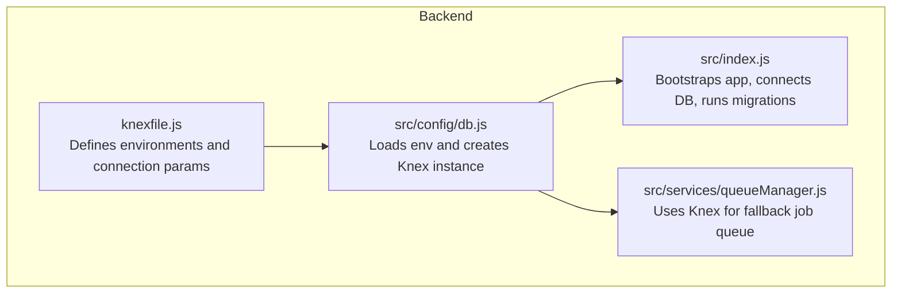
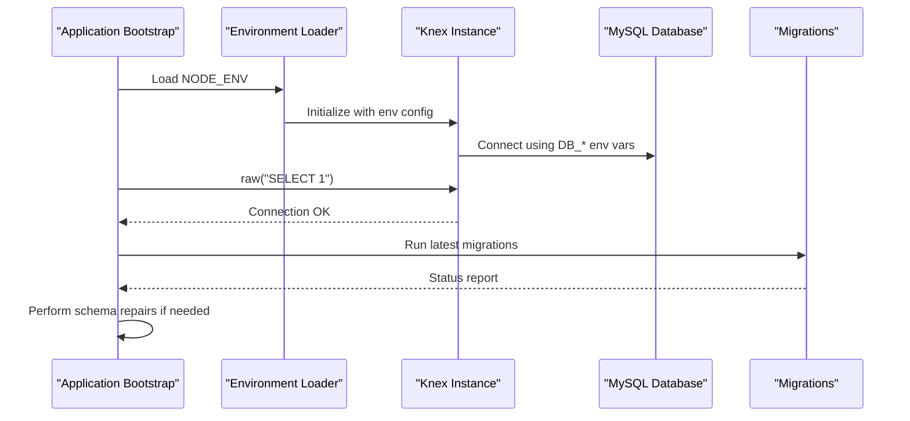
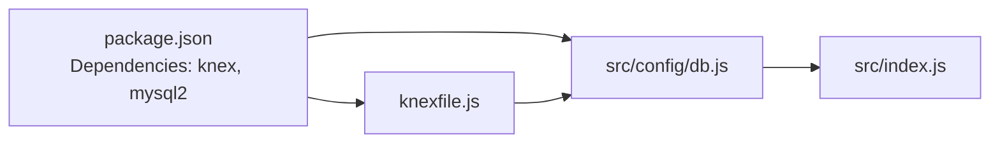

# Database Configuration & Connection Management

<cite>
**Referenced Files in This Document**
- [knexfile.js](file://backend/knexfile.js)
- [db.js](file://backend/src/config/db.js)
- [package.json](file://backend/package.json)
- [index.js](file://backend/src/index.js)
- [queueManager.js](file://backend/src/services/queueManager.js)
- [create_db.js](file://backend/src/utils/create_db.js)
- [deployment_guide.md](file://deployment_guide.md)
- [deployment_progress.md](file://deployment_progress.md)
</cite>

## Table of Contents
1. [Introduction](#introduction)
2. [Project Structure](#project-structure)
3. [Core Components](#core-components)
4. [Architecture Overview](#architecture-overview)
5. [Detailed Component Analysis](#detailed-component-analysis)
6. [Dependency Analysis](#dependency-analysis)
7. [Performance Considerations](#performance-considerations)
8. [Troubleshooting Guide](#troubleshooting-guide)
9. [Conclusion](#conclusion)
10. [Appendices](#appendices)

## Introduction
This document explains the database configuration and connection management for the backend service. It focuses on Knex.js setup, environment-specific configuration, credential management, connection string formats, SSL considerations, timeouts, retries, error handling, and operational best practices for development, staging, and production environments. It also covers performance tuning, query logging, and monitoring configuration, along with practical examples for different deployment scenarios.

## Project Structure
The database configuration is centralized in a Knex.js configuration file and consumed by an environment-aware loader. The application initializes the database connection early during startup, runs migrations, and performs schema repairs to ensure robustness across deployments.

**Diagram sources**
- [knexfile.js:1-37](file://backend/knexfile.js#L1-L37)
- [db.js:1-8](file://backend/src/config/db.js#L1-L8)
- [index.js:23-80](file://backend/src/index.js#L23-L80)
- [queueManager.js:1-125](file://backend/src/services/queueManager.js#L1-L125)

**Section sources**
- [knexfile.js:1-37](file://backend/knexfile.js#L1-L37)
- [db.js:1-8](file://backend/src/config/db.js#L1-L8)
- [index.js:23-80](file://backend/src/index.js#L23-L80)
- [queueManager.js:1-125](file://backend/src/services/queueManager.js#L1-L125)

## Core Components
- Knex configuration file defines two environments: development and production. Both share identical connection parameters loaded from environment variables.
- Environment-aware loader selects the appropriate environment and instantiates Knex.
- Application bootstrap validates connectivity, runs migrations, and performs schema repairs.
- Optional Redis-backed queue falls back to database-backed queue when Redis is unavailable.

Key implementation references:
- Environment selection and Knex instantiation: [db.js:4-5](file://backend/src/config/db.js#L4-L5)
- Migration and connectivity checks: [index.js:32-59](file://backend/src/index.js#L32-L59)
- Fallback queue mechanism: [queueManager.js:61-85](file://backend/src/services/queueManager.js#L61-L85)

**Section sources**
- [db.js:1-8](file://backend/src/config/db.js#L1-L8)
- [index.js:23-80](file://backend/src/index.js#L23-L80)
- [queueManager.js:1-125](file://backend/src/services/queueManager.js#L1-L125)

## Architecture Overview
The runtime database architecture integrates Knex for SQL operations, with optional Redis for queuing and a database-backed fallback. The application ensures schema consistency at startup and monitors connectivity.

**Diagram sources**
- [db.js:4-5](file://backend/src/config/db.js#L4-L5)
- [index.js:32-59](file://backend/src/index.js#L32-L59)
- [knexfile.js:4-19](file://backend/knexfile.js#L4-L19)

## Detailed Component Analysis

### Knex Configuration and Environment-Specific Settings
- Environments: development and production are defined with identical connection blocks.
- Connection parameters are sourced from environment variables: host, user, password, database, port.
- Migration and seed directories are configured under src/db.

Operational notes:
- The configuration does not define explicit connection pooling options, SSL settings, or timeouts. These can be added to the connection block as needed.

References:
- [knexfile.js:3-19](file://backend/knexfile.js#L3-L19)
- [knexfile.js:20-36](file://backend/knexfile.js#L20-L36)

**Section sources**
- [knexfile.js:1-37](file://backend/knexfile.js#L1-L37)

### Environment Variable Usage and Credentials Management
- Credentials are managed via environment variables: DB_HOST, DB_USER, DB_PASSWORD, DB_NAME, DB_PORT.
- The application logs diagnostic values during startup for verification.
- Deployment guides specify localhost binding for DB_HOST in local setups.

References:
- [knexfile.js:6-11](file://backend/knexfile.js#L6-L11)
- [knexfile.js:22-27](file://backend/knexfile.js#L22-L27)
- [index.js:34-36](file://backend/src/index.js#L34-L36)
- [deployment_guide.md:20-23](file://deployment_guide.md#L20-L23)
- [deployment_progress.md:17](file://deployment_progress.md#L17)

**Section sources**
- [knexfile.js:1-37](file://backend/knexfile.js#L1-L37)
- [index.js:23-40](file://backend/src/index.js#L23-L40)
- [deployment_guide.md:9](file://deployment_guide.md#L9)
- [deployment_progress.md:17](file://deployment_progress.md#L17)

### Connection String Formats and SSL Configurations
- Current configuration uses separate host, user, password, database, and port parameters.
- SSL is not configured in the provided files. For secure connections, add SSL-related options to the Knex connection block (e.g., ssl enabled flag and CA bundle paths).

References:
- [knexfile.js:4-19](file://backend/knexfile.js#L4-L19)
- [knexfile.js:20-36](file://backend/knexfile.js#L20-L36)

**Section sources**
- [knexfile.js:1-37](file://backend/knexfile.js#L1-L37)

### Connection Timeout Settings and Retry Mechanisms
- No explicit connection timeouts or retry policies are defined in the configuration.
- The application performs a connectivity test via a raw SELECT query at startup.
- Redis-backed queue includes retry strategy and fallback logic; database fallback queue has its own retry/backoff behavior.

References:
- [index.js:42-44](file://backend/src/index.js#L42-L44)
- [queueManager.js:16-51](file://backend/src/services/queueManager.js#L16-L51)
- [queueManager.js:87-116](file://backend/src/services/queueManager.js#L87-L116)

**Section sources**
- [index.js:32-59](file://backend/src/index.js#L32-L59)
- [queueManager.js:1-125](file://backend/src/services/queueManager.js#L1-L125)

### Error Handling Strategies
- Startup logs indicate success/failure of connectivity and migrations.
- Schema repair routines handle missing tables and column adjustments.
- Redis errors trigger fallback to database-backed queue; database queue tracks attempts and schedules retries.

References:
- [index.js:50-58](file://backend/src/index.js#L50-L58)
- [queueManager.js:31-39](file://backend/src/services/queueManager.js#L31-L39)
- [queueManager.js:102-113](file://backend/src/services/queueManager.js#L102-L113)

**Section sources**
- [index.js:23-80](file://backend/src/index.js#L23-L80)
- [queueManager.js:1-125](file://backend/src/services/queueManager.js#L1-L125)

### Database Performance Tuning, Query Logging, and Monitoring
- The configuration does not enable Knex query logging or performance-specific knobs.
- Consider enabling query logging for diagnostics and adding pool settings for concurrency and timeouts in production.

References:
- [knexfile.js:13-18](file://backend/knexfile.js#L13-L18)
- [knexfile.js:29-34](file://backend/knexfile.js#L29-L34)

**Section sources**
- [knexfile.js:1-37](file://backend/knexfile.js#L1-L37)

### Operational Examples and Scaling Guidance
- Development: Use localhost DB_HOST with minimal pool settings; enable query logging for debugging.
- Staging: Mirror production credentials; add SSL and moderate pool sizes; enable structured logging and metrics.
- Production: Enable SSL, configure robust pool limits and timeouts; monitor slow queries and connection saturation; consider read replicas for heavy reads.

[No sources needed since this section provides general guidance]

## Dependency Analysis
The database layer depends on Knex and the mysql2 client. The application loads the Knex instance at runtime and uses it across services.

**Diagram sources**
- [package.json:31](file://backend/package.json#L31)
- [package.json:34](file://backend/package.json#L34)
- [knexfile.js:1](file://backend/knexfile.js#L1)
- [db.js:1-2](file://backend/src/config/db.js#L1-L2)
- [index.js:28-29](file://backend/src/index.js#L28-L29)

**Section sources**
- [package.json:17-38](file://backend/package.json#L17-L38)
- [knexfile.js:1-37](file://backend/knexfile.js#L1-L37)
- [db.js:1-8](file://backend/src/config/db.js#L1-L8)
- [index.js:23-31](file://backend/src/index.js#L23-L31)

## Performance Considerations
- Add pool configuration to the Knex connection block for min/max connections, acquire timeout, idle timeout, and other pool-related settings.
- Enable query logging temporarily for profiling; disable in production to reduce overhead.
- Monitor slow queries and connection saturation; adjust pool sizes accordingly.
- Consider read replicas for reporting workloads and offload heavy reads.

[No sources needed since this section provides general guidance]

## Troubleshooting Guide
Common issues and remedies:
- Access denied or connection failures: Verify DB_HOST set to localhost for local setups, confirm DB_USER, DB_PASSWORD, DB_NAME, and DB_PORT.
- Migration lock or race conditions: The application forces free migrations lock and introduces a random delay before running migrations.
- Schema inconsistencies: The bootstrapper performs existence checks and applies targeted repair logic for critical tables and columns.
- Redis fallback: If Redis is unreachable, the system automatically switches to database-backed queue and logs warnings.

References:
- [deployment_guide.md:9](file://deployment_guide.md#L9)
- [deployment_guide.md:20-23](file://deployment_guide.md#L20-L23)
- [index.js:47-59](file://backend/src/index.js#L47-L59)
- [index.js:62-80](file://backend/src/index.js#L62-L80)
- [queueManager.js:16-51](file://backend/src/services/queueManager.js#L16-L51)

**Section sources**
- [deployment_guide.md:9](file://deployment_guide.md#L9)
- [deployment_guide.md:20-23](file://deployment_guide.md#L20-L23)
- [index.js:42-80](file://backend/src/index.js#L42-L80)
- [queueManager.js:1-125](file://backend/src/services/queueManager.js#L1-L125)

## Conclusion
The current configuration provides a clean separation between environment settings and Knex instantiation, with robust startup checks and schema repair capabilities. To harden the system for production, augment the Knex configuration with SSL, connection pooling, timeouts, and query logging. Adopt environment-specific secrets management and monitoring practices aligned with deployment stage requirements.

[No sources needed since this section summarizes without analyzing specific files]

## Appendices

### Appendix A: Environment Variables Reference
- DB_HOST: Database hostname or IP address
- DB_USER: Database username
- DB_PASSWORD: Database password
- DB_NAME: Database name
- DB_PORT: Database port (defaults to 3306 if unset)
- NODE_ENV: Environment selector (development or production)

References:
- [knexfile.js:6-11](file://backend/knexfile.js#L6-L11)
- [knexfile.js:22-27](file://backend/knexfile.js#L22-L27)
- [db.js:4](file://backend/src/config/db.js#L4)

**Section sources**
- [knexfile.js:1-37](file://backend/knexfile.js#L1-L37)
- [db.js:1-8](file://backend/src/config/db.js#L1-L8)

### Appendix B: Knex Pool and SSL Options (Recommended)
Add the following to the Knex connection block for production-grade setups:
- Pool settings: min, max, acquireTimeoutMillis, idleTimeoutMillis, createTimeoutMillis
- SSL: ssl enabled flag and certificate authority path
- Additional: charset, timezone, and connection flags as needed

References:
- [knexfile.js:4-19](file://backend/knexfile.js#L4-L19)
- [knexfile.js:20-36](file://backend/knexfile.js#L20-L36)

**Section sources**
- [knexfile.js:1-37](file://backend/knexfile.js#L1-L37)

### Appendix C: Local Database Creation Utility
A utility script demonstrates PostgreSQL database creation using pg Client. While the project primarily uses MySQL, this illustrates environment-specific database setup patterns.

References:
- [create_db.js:1-28](file://backend/src/utils/create_db.js#L1-L28)

**Section sources**
- [create_db.js:1-28](file://backend/src/utils/create_db.js#L1-L28)